# Dansande robotar

Koda robotar som dansar och låt musiken flöda! Här får du prova på en enkel och rolig uppgift att koda i Scratch. Ett mål med uppgiften är att du skall lära dig att använda meddelanden och funktioner.
Klicka på bilden nedan för att se ett exempelprojekt på hur ett projekt med dansande robotar kan komma att se ut (slå på ljudet): 

> Bläddra dig fram genom denna guide, steg för steg. <a href="https://scratch.mit.edu" target="_blank">
  Öppna även verktyget Scratch på sajten www.scratch.mit.edu</a> där du kodar och skapar själva spelet utifrån Kodbokens instruktioner. Logga gärna in på Scratch för att kunna spara och dela projektet, så kan dina vänner få prova din robotdans. Ett konto på Scratch är gratis.
  
Är du redo att koda? Då börjar vi!

## 1: Välja sprajtar och bakgrund

Först behöver du en **robotfigur** och en ny **bakgrund** där roboten sen kan dansa. Alla figurer man lägger in i Scratch kallas för en **sprajt**

>**VAD SKA JAG GÖRA?**

- Ta bort kattfiguren
- Välj en ny sprajt
- Välj en ny bakgrund
- Välj en till sprajt
- Minska eller öka storleken på sprajtarna om du vill

>**INSTRUKTION HUR JAG GÖR STEG-FÖR-STEG:**

1. Tryck på **Skapa** på Scratch startsida för ett skapa ett nytt projekt. Se gärna till att du är inloggad på Scratch, så kan du spara ditt projekt även.

 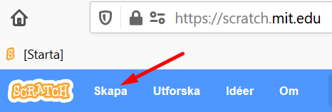

2. Ser du katten på den tomma scenen till höger? Vi ska byta ut den till en ny robot-figur. Ta först bort katt-sprajten genom att klicka på den lilla soptunnan på den lilla kattbilden som finns under scenen. Då försvinner katten ur projektet och scenen blir helt tom.

 
  
3. Klicka på ikonen för **Välj en sprajt** som ser ut som en liten vit katt på en blå knapp. Den finns längst ned under scenen. Välj en ny sprajtfigur som ska vara en robot. Se till att det är en robotsprajt som kan röra på sig (alltså en figur som rör sig när du för muspekaren över den i Scratch sprajtbibliotek). Vi har valt en robot som ser ut att flyga fram, men du kan välja vilken sprajt du vill såklart. (Tips: i sprajtbiblioteket finns ett sökverktyg högst upp till vänster, testa att skriva "robot".)

  
  
Nu har du en robot som din sprajt på scenen. 

  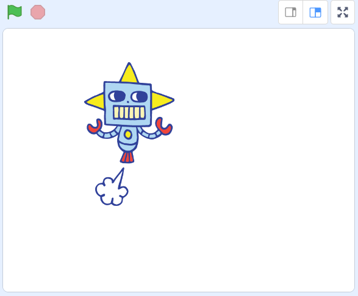

Vi går vidare och lägger till en bakgrundsbild.

4. Klicka på ikonen för **Välj en bakgrund** som finns längst ned till höger under scenen och välj sen en bakgrund du gillar. I vårt exempelprojekt valde vi bakgrunden som heter **"Concert"**. 

  
  
>**Tips!** Du kan även välja att rita en egen bakgrund med ritverktyget, som du hittar om du håller muspekaren över knappen **Välj en bakgrund** och sen klickar på målarpenseln i menyn som kommer upp. Innan du börjar måla, klicka först på blå knappen under målarytan som heter **Gör till Bitmap**. Sen kan du börja måla. När du är klar, gå tillbaka ut ur ritverktyget genom att klicka på fliken som heter **Kod** högst upp till vänster i Scratch och aktivera din robot-sprajt igen, genom att klicka på den lilla bilden av din sprajt under scenen. Se de två bilderna:

*Bilder till tipset ovan*

    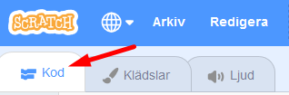
  
5. Dax att lägga till en till robotsprajt. Klicka igen på **Välj en sprajt**-ikonen längst ned och lägg in **en till robotsprajt** till projektet (eller välj en annan sprajt du gillar, gärna en som kan röra på sig). 

Dra sen i de två sprajtfigurerna på scenen och ställ dem där du vill ha dem, så att de står bredvid varandra. Ge dem lite utrymme att att röra på sig.

  

6. Om sprajtarna är för stora eller för små kan du ändra storlek på dem. Under scenen med sprajtarna finner du texten **Storlek** och bredvid står det **100** - alltså 100% full storlek. Klicka på siffrorna och skriv istället in ett lägre eller högre procenttal, klicka sedan någonstans bredvid siffran du just skrev så ändras sprajtens storlek på scenen. Pröva dig fram till en storlek du gillar. För att ändra den andra sprajten markerar du den lilla bilden av den sprajten under scenen och ändrar dess storlek på likadant sätt som den första.

  

Nu har du två sprajtar och en bakgrund. Dax att börja koda dansen!

## 2: Musik att dansa till

Nu ska vi koda så den första robotsprajten får några rörelser och lägga till musik. Koden som vi bygger ihop kallas för ett **skript**.

>**VAD SKA JAG GÖRA?**

- Lägg in ett startblock på den tomma skriptytan för en av robotarna
- Lägg till ett musikblock
- Välj ny musik till projektet och lägg in i skriptet

>**INSTRUKTION HUR JAG GÖR STEG-FÖR-STEG:**

1. Se till att du klickat på och markerat den robotsprajt du vill koda först. Det gör du genom att klicka på den lilla bilden av din sprajt under scenen. Välj den sprajt som kunde röra på sig när du valde sprajtar i sprajtbiblioteket. 

  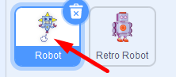

>**Tips!** Den sprajt du valt syns även som en gråtonad bild i övre högra hörnet av den stora tomma skriptytan i mitten av Scratch, till vänster om scenen. På så sätt kan du se vilken sprajt det är som du just nu kodar. Det är på skriptytan som du ska lägga in koden som sen styr din sprajt. Se bilden:

*Bild till tipset ovan:*

  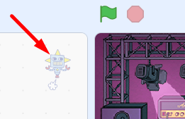

2. Först ska vi lägga till ett startblock. Under tema HÄNDELSER finner du blocket **när GRÖN FLAGGA klickas på**. Dra i detta block och lägg det någonstans på den tomma vita skriptytan i mitten av Scratch. 

  

3. Nu ska vi lägga in att musik ska spelas när jag startar projektet. Vi vill att musiken ska spelas om och om igen i en evighetsloop. Börja med att skapa loopen. Under tema KONTROLL lägger du till blocket **för alltid**. Fäst den direkt under första startblocket **när GRÖN FLAGGA klickas på**, så de pusslar ihop sig. 

  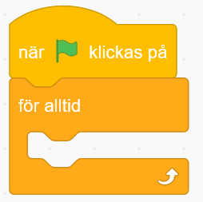

4. Nu ska vi lägga till musik till projektet. Från tema LJUD drar du in blocket **spela ljudet ___ tills färdigt** och lägg in detta block inuti den loop du lade in nyss. Då ser det ut som på bilden nedan.

  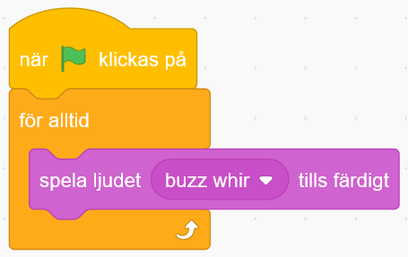

>**Testa koden!** Klicka på den gröna flaggan ovanför scenen. Vad händer? Hörs det ljud? Blev det ett bra ljud? Tänk på att du kan behöva sätta på högtalarna och kanske även höja volymen om den är för låg.

Nu hörs det ljud, som spelas om och om igen i en evighetsloop. Men det kanske inte blev rätt ljud för den musik vi vill ha? Du kan stoppa projektet och ljudet med **den röda stoppknappen** ovanför scenen.

  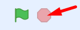

5. Nu ska vi byta ut ljudet till en musikslinga för roboten att dansa till. Gå först till fliken som heter **Ljud** i övre vänstra hörnet av Scratch. Nu kommer du in i Scratch ljudstudio. 

  
  
6. Klicka på den blå knappen längst ned till vänster som heter **Välj ett ljud**. Nu kommer du in i Scratch ljudbibliotek. 

 
 
7. Enklaste sättet att hitta musik som passar att loopas om och om igen är om du klickar på kategorin som heter **loopar**. Den finner du på de orangea knapparna i överkant. Nu kan du lyssna på de olika ljuden genom att hålla muspekaren över ljudens små, lila PLAY-symboler. När du hittat musiken du vill använda klickar du på mitten av ljudets fyrkant, så läggs ljudet till i ditt projekt. Vi har valt ljudet *Dance Magic* i vårt exempel.

  

8. När du valt musiken du vill använda klickar du på fliken som heter **Kod** i övre vänstra delen av Scratch. Nu ser du kodblocken och skriptytan igen och kan koda in musiken du just valt för din robot att dansa till.

  
  
9. I koden du lagt på skriptytan ser du blocket som heter **spela ljudet ____ tills färdigt**. Klicka på namnet på ljudet i blocket, så visar sig en lista med olika ljud som finns i projektet. Välj det nya ljud som du just lade till i Scratch ljudstudio. Klicka på dess namn i listan och vips har du lagt in ditt nya ljud i robotens kod. Vi har valt ljudet *Dance Magic* i vårt exempel.

  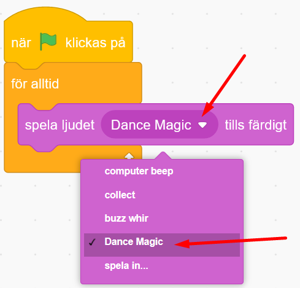

>**Testa koden!** Klicka på den gröna flaggan ovanför scenen och testa att köra koden. Vad händer? Spelas din nya musik nu istället för det gamla ljudet? Blev det som du ville? Du kan alltid byta till annan musik på samma sätt som du nyss gjorde i stegen ovan.

Nu har vi bra musik för robotarna att dansa till! Dags att koda in röresle för robotarna!

## 3: Få roboten att dansa

I Scratch kan man koda in att sprajtarna kan skicka ett meddelande till varandra och även mellan olika skript. Meddelanden kan tänkas vara som ett litet brev eller ett sms som meddelar till exempel att någon ska börja dansa eller att något annant ska hända när meddelandet tagits emot. Nu ska vi skapa ett meddelande som ska sätta igång våra sprajtar att dansa. Gör såhär:

1. Först ska vi lägga till kodblock för ett meddelande. Från tema HÄNDELSER drar du in blocket **skicka meddelande1**. Lägg blocket direkt under startblocket **när GRÖNA FLAGGAN klickas på** som du har i ditt skript redan. Då ser skriptet på kodytan ut såhär:

  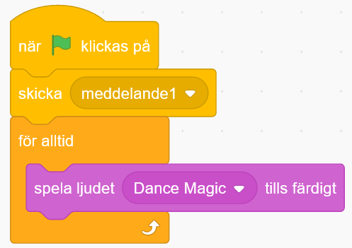

2. Nu ska vi skapa ett nytt meddelande i kodblocket. Klicka på den lilla pilen bredvid texten **meddelande1** i kodblocket du just lade in. Klicka sen på  **Nytt meddelande** i menyn som kommer fram. Klicka på *Nytt meddelande*.

  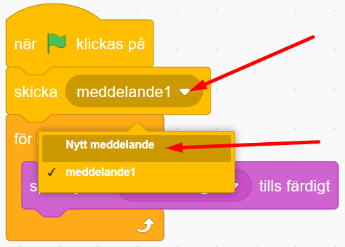

3. Skriv in ordet **Dansa** i textrutan och klicka på OK. Nu ändras texten i kodblocket så det står **skicka Dansa**. 

  

Vårt meddelande **Dansa** är nu färdigt att skickas iväg, men det behöver också tas emot någonstans för att det ska kunna fungera. Vi behöver lägga till det i koden:

4. Vi skapar ett nytt skript på kodytan, som ska få sprajten att börja dansa när den tar emot meddelandet *Dansa*. Från tema HÄNDELSER drar du in startblocket **när jag tar emot meddelande1** och lägger det fritt på skriptytan. 

  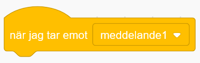

5. Nu ska vi välja vilket meddelande blocket ska ta emot. Klicka på den lilla pilen i blocket och välj sen meddelandet **Dansa** från menyn. Nu ändras texten i ditt block till **när jag tar emot Dansa**, alltså när blocket tar emot det meddelandet du nyss skapat. Som ett sms från ett skript till ett annat.

  
  
6. Nu ska vi lägga till en loop som gör att kod kan loopas för evigt om och om igen. Från tema KONTROLL drar du in kodblocket **för alltid**. Sätt fast det under det första blocket med meddelandet **Dansa**, så det ser ut såhär:

  
  
7. Nu ska vi få sprajten att byta klädslar, alltså att byta mellan olika bilder av sprajtens olika positioner och rörelser. Då kommer sprajten att animeras, alltså se ut att ändra utseende och röra på sig. Från tema UTSEENDE drar du in blocket **nästa klädsel** och lägger det inuti loopen **för alltid**. Om du nu startar koden kommer sprajten att byta klädslar om och om igen, jättesnabbt. Testa att köra koden!

  
 
>**Tänk på!** En del sprajtar saknar fler klädslar och kommer därför inte fungera med koden ovan. Du vet om du har en sprajt med klädslar om den rörde på sig när du valde ny sprajt i Scratch sprajtbibliotek. Du kan även kolla sprajtens olika klädslar om du klickar på fliken som heter **Klädslar** i övre vänstra delen av Scratch. Om sprajten har fler än en klädsel så ser du dem nu i vänstra delen av Scratch, med flera bilder av sprajten under varandra. Gå sen tillbaka till kodytan på fliken bredvid som heter **Kod**. Se bild nedan:

*Bild till tipset ovan*

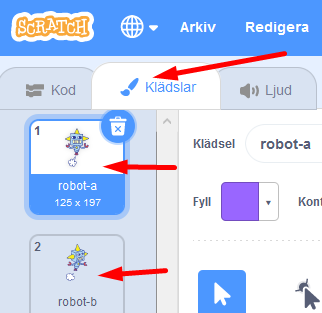
  
>**Testa koden!** Klicka på den gröna flaggan ovanför scenen och testa koden. Vad händer? Byter sprajten mellan klädslar? Går det lite för snabbt?
  
8. För att göra bytet mellan olika klädslar långsammare kan vi lägga in en liten paus mellan varje byte. Från tema KONTROLL drar du in blocket **vänta 1 sekunder**. Lägg in det inuti **för alltid**-loopen. Klicka sen på variabeln med siffran **1** i blocket och ändra till **0.25** för kortare paustid.

  
  
>**Tänk på!** I Scratch skrivs siffror med en punkt ( . ) mellan heltal och decimaler, inte med kommatecken ( , ). Exempelvis **O.25**. Annars fungerar inte koden för den instruktionen.

>**Testa koden!** Klicka på den gröna flaggan ovanför scenen och testa koden. Vad händer? Hörs musiken? Dansar robotsprajten? Går bytet mellan klädslarna lagom fort? Testa att ändra till olika lång väntetid mellan sprajtens klädselbyten så det blir som du vill ha det.

Nu finns det kod för att din sprajt ska kunna röra på sig och dansa runt till musik! Det är dags att få den andra robotsprajten att också dansa!

## 4: Alla dansar tillsammans

Nu vill vi att båda robotarna ska dansa tillsammans! Du kommer att få se varför **skicka** och **ta emot meddelande** är så bra att använda. Då börjar vi koda!

>**VAD SKA JAG GÖRA?**

- Skapa skript med byte av klädslar i den andra sprajten
- Skapa mer rörelse för sprajten

>**INSTRUKTION HUR JAG GÖR STEG-FÖR-STEG:**

1. Klicka på de små bilderna av sprajtarna under scenen för att byta till den andra sprajten som du vill koda. Nu får du fram den andra sprajtens tomma skriptyta, där finns ju ännu inga kodblock inlagda. Dax att börja koda. 

  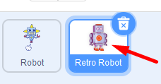

2. Från tema HÄNDELSER drar du in kodblocket **när jag tar emot Dansa**. Lägg det någonstans på kodytan för den andra robotsprajten.

  

2. Från tema KONTROLL drar du in en **för alltid**-loop. sätt den direkt under det första kodblocket.

  

3. Nu ska vi få roboten att glida till olika ställen på scenen. Från tema RÖRELSE drar du in kodblocket **glid 2 sekunder till slumpmässig position**. Lägg detta block inuti **för alltid**-loopen. 

  

>**Tips!** Du bestämmer själv vad som ska hända när sprajtarna **tar emot** meddelandet *Dansa*. Sprajtarna kan röra sig genom att byta klädslar eller säga något med en pratbubbla från tema UTSEENDE, kanske glida till ny position från tema RÖRELSE? Testa dig fram!

>**Testa koden!** Klicka på den gröna flaggan ovanför scenen och testa ditt projekt. Vad händer? Rör sig båda robotarna? Dansar de lagom fort? Ser dansen och projektet ut som du vill? Vill du att robotarna ska göra något mer? Du kan alltid ändra i koden och bygga vidare med mer kodbitar.

## 5: Effekter på bakgrundsbilden

Nu ska vi se till att själva bakgrunden får en snygg färgeffekt! 

>**VAD SKA JAG GÖRA?**

- Koda scenens bakgrundsbild att ta emot ett meddelande
- Koda så att bilden för alltid ska ändra färgeffekt

>**INSTRUKTION HUR JAG GÖR STEG-FÖR-STEG:**

1. Klicka på den lilla bilden av din bakgrund nere till höger under ditt projekt där det står **Scen**. Då kommer skriptytan för din bakgrund fram, där du också kan lägga in kod. Bakgrunden kan inte röra på sig, men den kan bytas ut till andra bakgrunder efter ett tag eller ha olika färgeffekter på sig så den blir cool.

  

2. Nu kodar du scenen med bakgrundsbilden, och har alltså en ny, tom skriptyta att koda på. Från tema HÄNDELSER drar du in meddelandeblocket **när jag tar emot Dansa** Lägg den på bakgrundens tomma skriptyta.

  
 
3. Från tema KONTROLL drar du in blocket **för alltid**, alltså en loop, och fäster det under blocket **när jag tar emot Dansa**.

  

4. Från tema UTSEENDE drar du in blocket **ändra färgeffekten med 25** och lägger den inuti **för alltid**-loopen.

  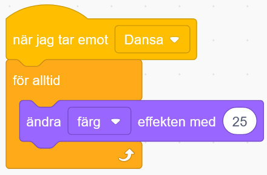

>**Tips!** Vill du att bakgrunden ska växla färg långsammare? Då kan du lägga till ett vänta-block från tema HÄNDELSER inuti loopen. Kanske 0.25 sekunder är lagom lång väntetid?

> **Testa ditt projekt!** Ändrar bakgrundsbilden på scenen färg? Blev det som du ville?

Nu är ditt projekt färdigt och robotarna dansar loss i ett härligt party! På nästa sida får du förslag på hur du kan pynta vidare och lägga till mer saker i ditt projekt!

## Färdig!
Grattis, nu har du gjort klart uppgiften. Bra kodat!

**Glöm inte att spara ditt projekt!** Om du är inloggad på Scratch kan du spara ditt projekt. Döp det även till något du gillar, kanske till Robotdans? Namnet kan du skriva in högst upp. Klicka gärna på knappen **Dela**, så kan andra se ditt projekt. Om du skickar webadressen (projektets Url) till vänner och familj så kan de testa projektet.

  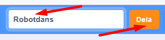

> **Testa ditt projekt** och låt gärna andra få prova!

## Utmaning
Har du tid över? Här kommer utmaningar för dig som vill fortsätta.

### Unika sprajtar
Kan du ändra i skripten för dina sprajtar så att de blir mer olika och roliga? Kanske lägga till andra sprajtar? Pratbubblor? Var kreativ och våga prova dig fram. Du kan alltid ändra om och skapa nytt med kod!

  

Testa till exempel att:

* Lägga till pratbubblor på sprajtarna så de säger olika saker

* Ändra storlek på sprajten så den blir exempelvis större eller mindre medan musiken spelas

* Lägga till rotation så att sprajtarna vänder sig runt, runt

* Ändra hur fort sprajtarna dansar

* Rita till objekt eller ändra färger på olika klädslar i dina sprajter

Kan du hitta fler sätt att göra dom mer unika?

## Frågeställningar

* Vad är en loop bra till när man programmerar?

* Vad är ett meddelande i koden?

* Vad kan du använda ett meddelande till?
