# Dansande robotar

Koda robotar som dansar och låt musiken flöda! Här får du prova på en enkel och rolig uppgift att koda i Scratch. Ett mål med uppgiften är att du skall lära dig att använda meddelanden och funktioner.
Klicka på bilden nedan för att se ett exempelprojekt på hur ett projekt med dansande robotar kan komma att se ut (slå på ljudet): <a href="https://scratch.mit.edu/projects/430585716" target="_blank"> 

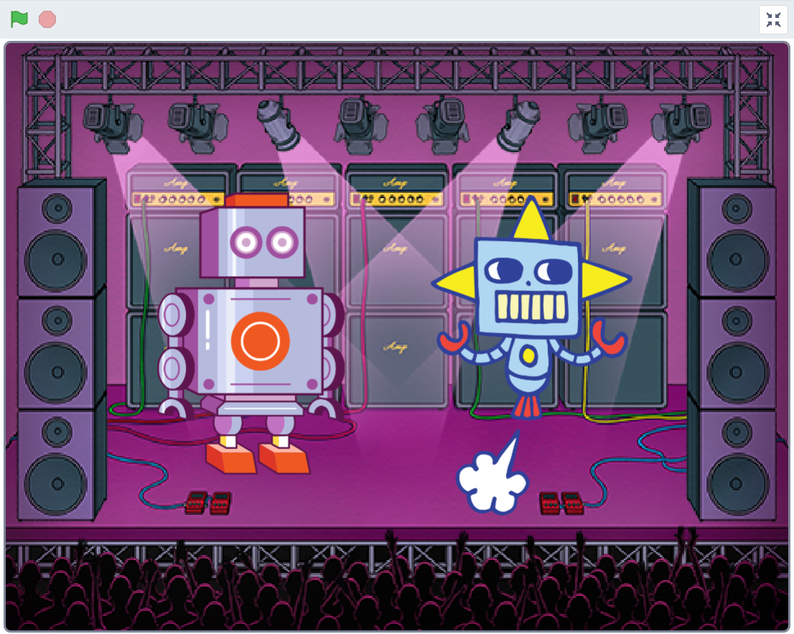</a>

> Bläddra dig fram genom denna guide, steg för steg. <a href="https://scratch.mit.edu" target="_blank">
  Öppna även verktyget Scratch på sajten www.scratch.mit.edu</a> där du kodar och skapar själva spelet utifrån Kodbokens instruktioner. Logga gärna in på Scratch för att kunna spara och dela projektet, så kan dina vänner få prova din robotdans. Ett konto på Scratch är gratis.
  
Är du redo att koda? Då börjar vi!

## 1: Välja sprajtar och bakgrund

Först behöver du en **robotfigur** och en ny **bakgrund** där roboten sen kan dansa. Alla figurer man lägger in i Scratch kallas för en **sprajt**

>**VAD SKA JAG GÖRA?**

- Ta bort kattfiguren
- Välj en ny sprajt
- Välj en ny bakgrund
- Välj en till sprajt
- Minska eller öka storleken på sprajtarna om du vill

 
>**INSTRUKTION HUR JAG GÖR STEG-FÖR-STEG:**

1. Tryck på **Skapa** på Scratch startsida för ett skapa ett nytt projekt. Se gärna till att du är inloggad på Scratch, så kan du spara ditt projekt även.

2. Ser du katten på den tomma scenen till höger. Vi ska byta ut den till en ny robot-figur. Ta först bort katt-sprajten genom att klicka på den lilla soptunnan på den lilla kattbilden som finns under scenen. Då försvinner katten ur projektet och scenen blir helt tom.

 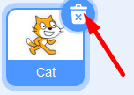
  
3. Klicka på ikonen för **Välj en sprajt** som ser ut som en liten vit katt på en blå knapp. Den finns längst ned under scenen. Välj en ny sprajtfigur som ska vara en robot. Se till att det är en robotsprajt som kan röra på sig (alltså en figur som rör sig när du för muspekaren över den i Scratch sprajtbibliotek). Vi har valt en robot som ser ut att flyga fram, men du kan välja vilken sprajt du vill såklart. (Tips: i sprajtbiblioteket finns ett sökverktyg högst upp till vänster, testa att skriva "robot".)

  
  
Nu har du en robot som din sprajt på scenen. Vi går vidare och lägger till en bakgrundsbild.

4. Klicka på ikonen för **Välj en bakgrund** som finns längst ned till höger under scenen och välj sen en bakgrund du gillar. I vårt exempelprojekt valde vi bakgrunden som heter **"Concert"**. 

  
  
>**Tips!** Du kan även välja att rita en egen bakgrund med ritverktyget, som du hittar om du håller muspekaren över knappen **Välj en bakgrund** och sen klickar på målarpenseln i menyn som kommer upp. Innan du börjar måla, klicka först på blå knappen under målarytan som heter **Gör till Bitmap**. Sen kan du börja måla. När du är klar, gå tillbaka ut ur ritverktyget genom att klicka på fliken som heter **KOD** högst upp till vänster i Scratch och aktivera din robot-sprajt igen, genom att klicka på den lilla bilden av din sprajt under scenen.

5. Klicka nu på **Välj en sprajt** och lägg in **en till robotsprajt** till projektet (eller välj en annan sprajt du gillar, gärna en som kan röra på sig). Dra i de två sprajtfigurerna på scenen så att de står bredvid varandra eller där du vill ha dem. Ge dem lite utrymme att att röra på sig.

6. Om sprajtarna är för stora eller för små kan du ändra storlek på dem. Under scenen med sprajtarna finner du texten **Storlek** och bredvid står det **100** - alltså 100% full storlek. Klicka på siffrorna och skriv istället in ett lägre eller högre procenttal, klicka sedan någonstans bredvid siffran du just skrev så ändras sprajtens storlek på scenen. Pröva dig fram till en storlek du gillar. För att ändra den andra sprajten markerar du den lilla bilden av den sprajten under scenen och ändrar dess storlek på likadant sätt som den första.

  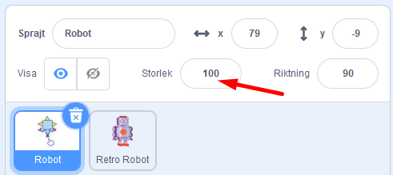

Nu har du två sprajtar och en bakgrund. Dax att börja koda dansen!

## 2: Musik att dansa till

Nu ska vi koda så den första robotsprajten får några rörelser och lägga till musik. Koden som vi bygger ihop kallas för ett **skript**.

>**VAD SKA JAG GÖRA?**

- Lägg in ett startblock på den tomma skriptytan för en av robotarna
- Lägg till ett musikblock
- Välj ny musik till projektet och lägg in i skriptet

 
>**INSTRUKTION HUR JAG GÖR STEG-FÖR-STEG:**

1. Se till att du klickat på och markerat den robotsprajt du vill koda först. Välj den sprajt som kunde röra på sig när du valde sprajtar i sprajtbiblioteket. Den sprajt du valt syns även som en gråtonad bild i övre högra hörnet av den stora tomma skriptytan i mitten av Scratch, till vänster om scenen. På så sätt kan du se vilken sprajt det är som du just nu kodar. Det är på skriptytan som du ska lägga in koden som sen styr din sprajt.

2. Först ska vi lägga till ett startblock. Under tema HÄNDELSER finner du blocket **när GRÖN FLAGGA klickas på**. Dra i detta block och lägg det någonstans på den tomma vita skriptytan i mitten av Scratch. 

BILD STARTBLOCK

3. Nu ska vi lägga in att musik ska spelas när jag startar projektet. Vi vill att musiken ska spelas om och om igen i en evighetsloop. Börja med att skapa loopen. Under tema KONTROLL lägger du till blocket **för alltid**. Fäst den direkt under första startblocket **när GRÖN FLAGGA klickas på**, så de puzzlar ihop sig. 

4. Nu ska vi lägga till musik till projektet. Från tema LJUD drar du in blocket **spela ljudet ___ tills färdigt** och lägg in detta block inuti den loop du lade in nySS. Då ser det ut som bilden nedan.

BILD

>Testa koden! Klicka på den gröna flaggan ovanför scenen. Vad händer? Hörs det ljud? Tänk på att du kan behöva sätta på högtalarna och kanske även höja volymen om den är för låg.

Nu hörs det ljud, som spelas om och om igen i en evighetsloop. Du kan stoppa projektet och ljudet med **den röda stoppknappen ovanför scenen**.

5. Nu ska vi byta ut ljudet till en musikslinga för roboten att dansa till. Gå först till fliken som heter LJUD i övre vänstra hörnet av Scratch. Nu kommer du in i Scratch ljudstudio. Klicka på den blå knappen längst ned till vänster som heter **Välj ett ljud**. Nu kommer du in i Scratch ljudbibliotek. 

 
 
6. Du finner lättast musik som passar att loopas om och om igen om du klickar på kategorin som heter **loopar**. Kategorierna finner du på de orangea knapparna i överkant. Nu kan du lyssna på de olika ljuden genom att hålla muspekaren över ljudens små, lila PLAY-symboler. När du hittat musiken du vill använda klickar du på mitten av ljudets fyrkant, så läggs ljudet till i ditt projekt. 

  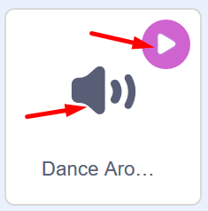

  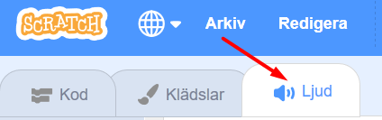

7. När du valt musiken du vill använda klickar du på fliken som heter **KOD** i övre vänstra delen av Scratch. Nu ser du kodblocken och skriptytan igen och kan koda in musiken du just valt för din robot att dansa till.

  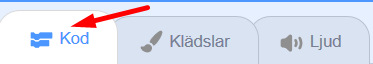
  
8. I koden du lagt på skriptytan ser du blocket som heter **spela ljudet ____ tills färdigt**. Klicka på namnet på ljudet i blocket, så visar sig en lista med olika ljud som finns i projektet. Välj det nya ljud som du just lade till i Scratch ljudstudio. Klicka på dess namn i listan och vips har du lagt in ditt nya ljud i robotens kod. 

>**Testa koden!** Klicka på den gröna flaggan ovanför scenen och testa att köra koden. Vad händer? Spelas din nya musik nu istället för det gamla ljudet? Blev det som du ville? Du kan alltid byta till annan musik på samma sätt som du nyss gjorde i stegen ovan.

## 3: Få roboten att dansa

5. Nu ska vi lägga till kod för ett meddelande. Från tema HÄNDELSER drar du in blocket **skicka meddelande1**. Sätt in det under de andra blocken på skriptytan.

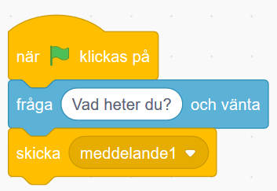

6. Nu ska vi skapa ett nytt meddelande. Klicka på den lilla pilen bredvid texten **meddelande** i blocket du just lade in. Klicka sen på  **Nytt meddelande** i menyn som kommer fram. 

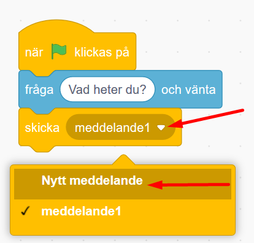

7. Skriv in ordet **Dansa** i textrutan och klicka på OK. Nu ändras texten i blocket så det står **skicka Dansa**.

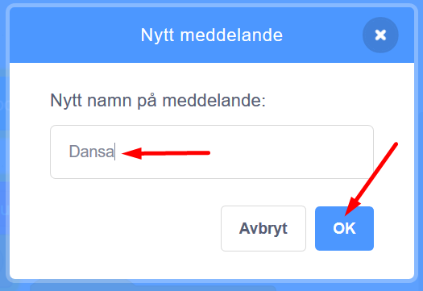

8. Nu lägger vi in musiken. Från tema **Ljud** drar du in blocket **Spela ljudet ____ tills färdigt**. (i blocket står namnet på det ljud du valde tidigare, i vårt exempel heter ljudet *Dance Around*. 

  

9. Nu ska vi skapa ett nytt skript till vår sprajt som som vi lägger bredvid det första på skriptytan. Från tema HÄNDELSER drar du in blocket **När jag tar emot meddelande1**. Klicka på den lilla pilen och välj meddelandet **Dansa** som du skapade tidigare.

  
  
10. Nu ska vi lägga till en loop som gör att kod kan loopas för evigt om och om igen. Från tema KONTROLL drar du in blocket **för alltid**. Sätt fast det under det förra blocket med meddelandet du just drog in.

  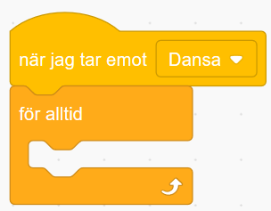
  
11. Nu ska vi få sprajten att byta klädslar, eller bilder av olika positioner av sprajten som det är egentligen. Från tema UTSEENDE drar du in blocket **nästa klädsel** och lägger det inuti loopen, så det ser ut såhär:

  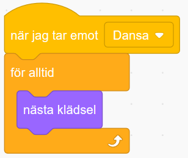
  
12. Från tema KONTROLL drar du in blocket **vänta 1 sekunder**. Lägg in det i loopen under blocket **nästa klädsel**. Klicka på variabeln **1** i blocket och ändra till **0.25** för kortare väntetid.

  

Nu finns det kod för att din sprajt ska kunna röra på sig och dansa runt till musik!

> **Testa ditt projekt!** Spelas ljudet efter att du har skrivit in ett namn som svar? Dansar sprajten lagom fort eller går det för snabbt eller långsamt? Testa att byta ut hur länge den ska vänta mellan klädselbyten.

## 4: Dansen är slut

För att sprajten ska sluta dansa när melodin är slut, måste du koda den att göra det. Det kan du fixa med ett nytt **meddelande** som berättar att dansen är slut, så att sprajten kan säga en hälsning, exempelvis *"Glad Påsk"* och sluta dansa.

<video src="./Påskkort_4.mp4" controls muted height=480 width=640 />

>**VAD SKA JAG GÖRA?**

Se i videon ovan hur du ska:
- Skapa ett till meddelande
- Stoppa skriptet
- Lägga in en operator och sammanfoga ett svarsmeddelande

 
>**INSTRUKTION HUR JAG GÖR STEG-FÖR-STEG:**

1. Först ska vi lägga in kod för ett meddelande. Från tema HÄNDELSER drar du in blocket **skicka meddelande1**. Fäst blocket i det första större skriptet i sprajten, såhär:

  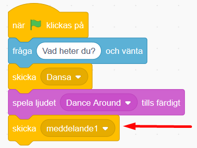

2. Sen skapar vi ett nytt meddelande. Klicka på lilla pilen i meddelande-blocket och klicka på **Nytt meddelande**. Döp det till *Dansen slut*.

3. Nu ska vi skapa ett helt nytt skript bredvid de andra. Från tema HÄNDELSER drar du ut **När jag tar emot meddelande1** och lägger det fritt på skriptytan som ett nytt skript. Klicka på lilla pilen i blocket och byt till meddelandet *Dansen slut*. 

  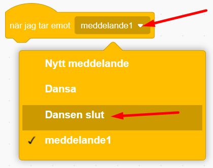

4. Från tema KONTROLL tar du blocket **stoppa alla**. Lägg det direkt under det förra blocket du lade in. Klicka på lilla pilen i blocket och byt till **andra skript i sprajten**.

  

5. Nu ska vi koda så att sprajten säger något på slutet och lägger in namnet du skrev in i början. Från tema UTSEENDE drar du in blocket **säg Hej! i 2 sekunder**. Fäst det under det förra blocket du lade in, såhär:

  
  
6. Nu ska vi lägga in en operator. Det är ett block som kan göra beräkningar i koden, exempelvis sätta ihop olika saker. Från tema OPERATORER drar du ut det gröna blocket som heter **sammanfoga äpple och banan**. Lägg det inuti textbubblan i förra blocket där det står **Hej!**. 

    

> **Tips** Svårt att lägga in operatorblocket? Gör såhär: dra operatorblockets ena kant snett in över texten Hej! och när det visas en vit ring runt texten Hej! så kan du släppa. Då fäster operatorblocket inne i textcirkeln.

8. Klicka på texten **äpple** i det gröna blocket och skriv istället **Glad Påsk**. (lägg till ett mellanslag efter Glad påsk, så blir det mellanrum mellan Glad Påsk och nästa ord som sen ska komma.)

  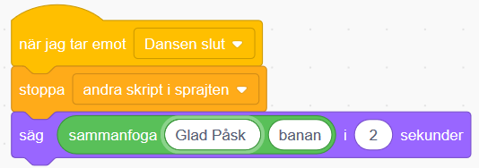  
  
7. Nu ska vi lägga in svaret på projektets första fråga *Vad heter du?*, som sprajten ställde i början. Från tema KÄNNA AV drar du in lilla blocket **Svar** och lägger det inuti den gröna operator-blockets andra textcirkel, där det nu står *banan*. Såhär:

  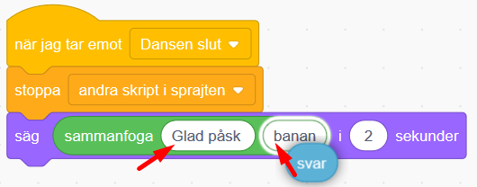  
  

När du är färdig ska koden se ut såhär:

  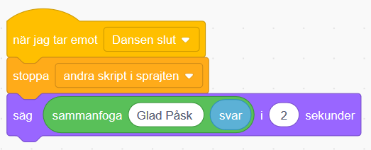

> **Testa ditt projekt!** Slutar sprajten att röra sig när melodin är slut? Säger pingvinen _"Glad Påsk"_ och det namn som du skrev in när kortet frågade _"Vad heter du?"_ i början?

Nu vill vi att alla sprajtar ska röra på sig och dansa loss! Vi kodar vidare!

## 5: Alla ska dansa!

Nu vill vi att de två andra sprajtarna ska dansa också! Du kommer att få se varför **skicka** och **ta emot meddelande** är så bra att ha. Det kallas för en FUNKTION och är en del av programmet som kan anropas flera gånger och från flera olika skript. Då börjar vi koda!
<video src="./Påskkort_5.mp4" controls muted height=480 width=640 />

>**VAD SKA JAG GÖRA?**

Se i videon ovan hur du ska:
- Skapa skript med byte av klädslar i de andra två sprajterna
- Skapa mer rörelse av sprajt

 
>**INSTRUKTION HUR JAG GÖR STEG-FÖR-STEG:**

1. Nu ska du skapa två skript vardera på de andra sprajtarna i projektet. Klicka på de små bilderna av sprajtarna under scenen med ditt projekt för att byta till ny figur att koda. Skapa skripten du ser i bilden nedan på vardera sprajt. 

  

2. Du bestämmer själv vad som ska hända när sprajtarna **tar emot** meddelandet *Dansa* och meddelandet *Dansen slut*. Sprajtarna kan röra sig genom att byta klädslar, kanske glida till ny position eller säga något med pratbubbla de med? Testa dig fram.
Såhär kan till exempel ett skript se ut om du vill att något ska glida till olika slumpvisa ställen. 

  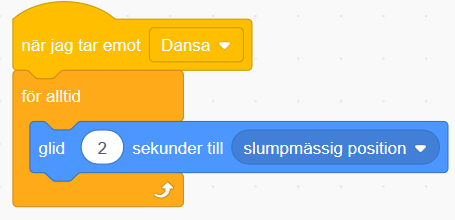

> **Testa ditt projekt!** Dansar alla sprajtar nu? Dansar de i rätt hastighet? Testa att ändra antalet sekunder som de väntar innan byte av klädsel.

## 6: Pynta påskkortet

Du har dansande sprajtar och musik, men det finns alltid plats för lite mer bling och pynt på vykortet! Kanske ska en annan sprajt dyka upp när musiken tar slut, en snöflinga, en stjärna eller annan figur? 
<video src="./Påskkort_6.mp4" controls muted height=480 width=640 />

>**VAD SKA JAG GÖRA?**

Se i videon ovan hur du ska:
- Lägg till en ny sprajt
- Skapa ett skript som gömmer sprajten när projektet startar
- Låta sprajten ta emot ett meddelande och för alltid byta klädslar
- Låta sprajten ta emot ett meddelande och gömma sig igen

 
>**INSTRUKTION HUR JAG GÖR STEG-FÖR-STEG:**

1. Börja med en sprajt som ska vara osynlig i början men dyka upp på slutet, exempelvis ett hjärta. Lägg då till sprajten **Heart** från biblioteket och placera den där du vill ha den på scenen.

  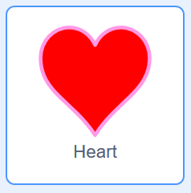

2. Nu ska vi koda när den nya sprajten ska vara gömd och när den ska synas. Från tema HÄNDELSER drar du ut blocket **när GRÖNA FLAGGAN klickas på** och lägger den på den nya sprajtens skriptyta. 

  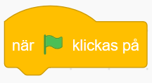

3. Från tema UTSEENDE drar du ut blocket **göm** och sätter fast den under blocket med gröna flaggan. 

  

4. Från tema HÄNDELSER drar du in blocket **när jag tar emot Dansa** (alltså ett meddelande). Lägg det fritt på sprajtens skriptyta bredvid det första skriptet. 

  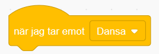
  
5. Från tema UTSEENDE drar du in lilla blocket **visa** och fäster det under förra blocket. 

  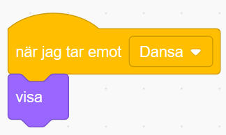

5. Från tema KONTROLL drar du ut blocket **för alltid**, som alltså är en loop. Fäst det under det förra blocket du drog in. 

  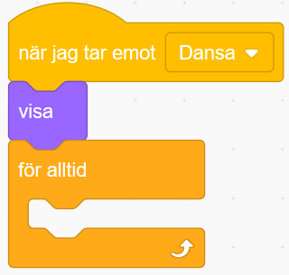

6. Från tema UTSEENDE drar du in blocket **nästa klädsel** och lägger det inuti loopen.

  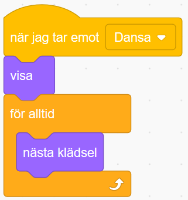
  
7. Från tema KONTROLL drar du in blocket **vänta 1 sekunder**. Lägg det längst ned innanför loopen. Klicka på variabeln **1** och ändra till **0.25**. 

  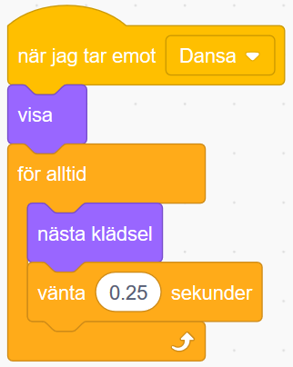
  
8. Om du vill att sprajten ska försvinna igen när musiken tar slut drar du från tema HÄNDELSER in blocket **när jag tar emot Dansa**. Lägg det fritt på skriptytan bredvid de andra skripten. Klicka på lilla pilen i blocket och byt medelandet till **Dansen slut**. 

  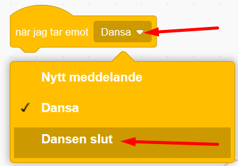

9. Från tema UTSEENDE drar du sen in blocket **göm** och fäst det direkt under blocket du just drog in. Då ser skriptet ut såhär. 

  

> **Testa koden!** Fungerar projektet som du vill? Gömmer sig och visar sig sprajten som den ska? Tips: om något inte fungerar, gå igenom koden och läs den högt så kan man enklare hitta felet. Kontrollera att du valt rätt meddelande i de olika skripten.

## 7: Blinga bakgrundsbilden

Nu ska vi se till att själva bakgrunden får en snygg färgeffekt! 
<video src="./Påskkort_7.mp4" controls muted height=480 width=640 />

>**VAD SKA JAG GÖRA?**

Se i videon ovan hur du ska:
- Koda scenens bakgrundsbild att ta emot ett meddelande
- Koda att bilden för alltid ska ändra färgeffekt
- Stoppa skriptet

 
>**INSTRUKTION HUR JAG GÖR STEG-FÖR-STEG:**

1. Klicka på lilla bilden av din bakgrund nere till höger under ditt projekt där det står **Scen**. Då kommer skriptytan för din bakgrund fram, där du kan lägga in kod.

  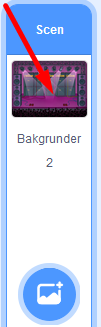

2. Från tema HÄNDELSER drar du in två meddelandeblock med **när jag tar emot Dansa** Lägg dem bredvid varandra på bakgrundens tomma skriptyta. Ändra så att ett block har meddelandet **Dansa** och det andra har meddelandet **Dansen slut**, så det ser ut såhär:

  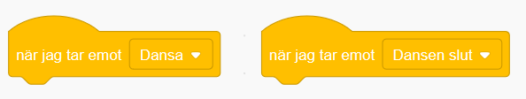
  
3. Från tema KONTROLL drar du in blocket **för alltid**, alltså en loop, och fäster det under blocket **när jag tar emot Dansa**.

5. Från tema UTSEENDE drar du in blocket **ändra färgeffekten med 25** och lägger den inuti loopen.

6. Från tema KONTROLL drar du in blocket **vänta 1 sekunder**. Lägg det nederst inuti loopen. Klicka på variablen **1** i blocket och skriv **2** istället. 

När du är färdig ska skriptet se ut såhär:

  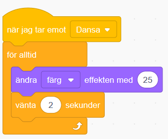

7. Från tema KONTROLL drar du in skriptet **stoppa alla**. Fäst det under blocket **när jag tar emot Dansen slut**. Klicka på lilla pilen i blocket och ändra till **stoppa andra skript i sprajten**. 

  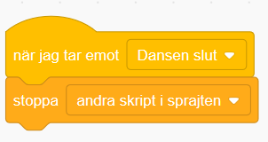

> **Testa ditt projekt!** Ändrar bakgrundsbilden på scenen färg? Slutar den ändra färg när musiken är slut?

## Färdig!
Grattis, nu har du gjort klart uppgiften.

**Glöm inte att spara ditt projekt!** Döp ditt Påskkortsprojekt högst upp. Klicka gärna på **Dela** så kan andra se ditt Påskkort och projekt. Om du skickar webadressen (projektets Url) till vänner så kan de testa projektet.

  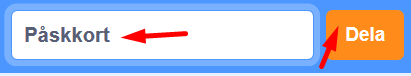

> **Testa ditt projekt** och låt gärna andra få prova!

## Utmaning
Har du tid över? Här kommer utmaningar för dig som vill fortsätta.

### Unika sprajtar
Kan du ändra i skripten för dina sprajtar så att de blir mer olika och roliga?
<a href="https://scratch.mit.edu/projects/383506646" target="_blank">
  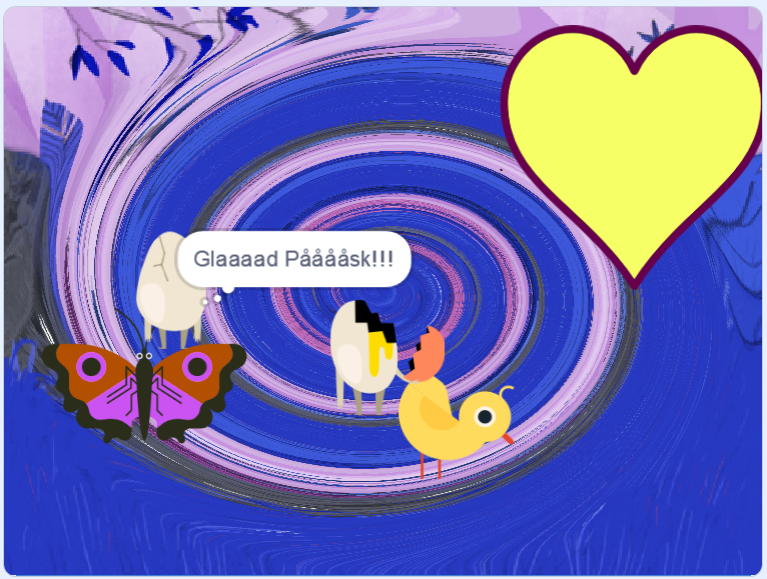</a>

Testa till exempel att:

* Lägg till pratbubblor på sprajtarna så de säger olika saker

* Ändra färgeffekt under dansen (på samma sätt som du gjorde med bakgrunden)

* Ändra storlek på sprajten så den blir exempelvis större eller mindre medan musiken spelas

* Lägg till rotation så att sprajtarna vrider på sig

* Ändra hur fort dom dansar

* låt sprajter glida till slumpvisa positioner

* Rita till objekt eller ändra färger på olika klädslar i dina sprajter

Kan du hitta fler sätt att göra dom mer unika?

## Frågeställningar

* Vad är en loop bra till när man programmerar?

* Vad för block kan du använda för att få spelaren att ge ett svar på en fråga?

* Vad är ett meddelande?

* Vad kan du använda ett meddelande till?
