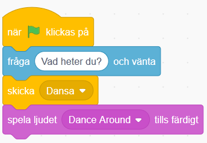
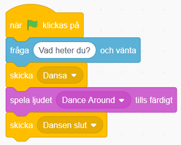
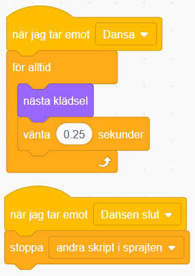
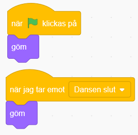
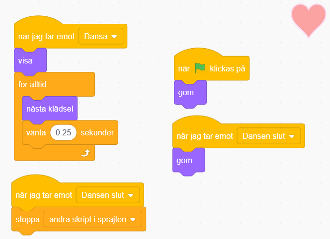
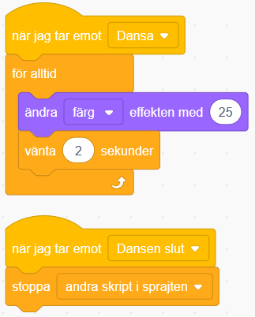

# Min Robot
Här du skapa din egen robot! Vad vil du att din robot ska hjälpa dig med? I den här uppgiften får du prova att koda meddelanden och funktioner i Scratch. 

**ÄNDRA BILD/LÄNK  OCH BYGG PROJEKT!** Här kan du se ett exempelprojekt på ett vykort: 

> Bläddra dig fram genom denna guide, steg för steg. <a href="https://scratch.mit.edu" target="_blank">
  Öppna även verktyget Scratch på sajten www.scratch.mit.edu</a> där du kodar och skapar själva spelet utifrån Kodbokens instruktioner.
  
  Då börjar vi koda!
  
  1. Välj en färdig sprajt-figur som din robot - eller rita din egen robot med ritverktyget.
  2. Välj bakgrund
  3. Vad ska roboten hjälpa dig med i din vardag. (Ex: pigga upp mig när det känns tråkigt genom att spela glad musik, eller matväljaren - hjälp mig välja vad jag ska äta idag.
  4. Få roboten att rra på sig/dansa
  5.Utveckla med fler val och slump? 
  6. Utveckla med ljud - uppläst röst på text?

## 1: Välj bakgrund och rita din robot

Här ska du välja en ny bakgrund och rita din robotfigur. Gör såhär:

1. Logga in på Scratch och öppna ett nytt projekt genom att trycka på **Skapa** på Scratch startsida.

2. Nu ska du välja en ny bakgrundsbild. I nedre högra hörnet finns en blå ikone för **Välj en bakgrund**. Klicka på den så kommer du till Scratch bakgrunds-bibliotek. Klicka på en bakgrundsbild du gillar så läggs den till i ditt projekt.

  

3. Ta bort Katt-sprajten i projektet genom att klicka på soptunnan på den lilla kattbilden under scenen. Då försvinner katten ur projektet.

  

4. Dax att rita din egen robotfigur. Om du inte vill rita kan du istället välja en färdig sprajtfigur som din robot.

5. Om din robotfigur är för stor kan du ändra storleken. Klicka på siffrorna vid **Storlek** som finns under scenen och skriv in nytt lägre tal. (Storleken visas i procent, där 100 är full storlek.) Prova dig fram.

  

Nu har du en robot-sprajt och en bakgrund. Nu ska vi lägga till vad roboten ska hjälpa dig med. Dax att koda vidare.

## 2: Roboten frågar

Nu ska du få roboten (eller den sprajt du valt) att fråga vad du behöver hjälp med. Det kan avar att exempelvis hjälpa dig att välja maträtt eller pigga upp dig om du känner dig ledsen.

1. Se först till att robot-sprajten är vald, genom att klicka på den lilla robot-figuren under scenen så den blir blåmarkerad. Nu kan du koda din robot. 

2. Från tema **HÄNDELSER** drar du in kodblocket **När GRÖN FLAGGA klickas på** och lägger det på skriptytan för din robot.

3. Fån tema **KÄNNA AV** drar du in kodblocket **fråga** *What's your name?* **och vänta**. Lägg det direkt under **När GRÖN FLAGGA klickas på**.

4. Vi vill att roboten ska kunan hjälpa oss med något, exempelvis vad vi ska äta till middag eller trösta oss om vi är ledsna. Ändra därför texten i det blå kodblocket, så att roboten frågar en fråga som vi sen ska svara på, exempelvis kan en tröstar-robot fråga: *Hur mår du?*.

> Välj en fråga som passar för vad just din robot ska hjälpa dig med. Om det är en Matväljar-robot kanske den frågar: *Vad är du sugen på att äta idag?* Om det är en Tröstar-robot, kanske den frågar *Hur mår du?*. Om det är en Klädväljar-robot kanske den kan fråga: *Vad är det för väder idag?. 

  

5. Klicka på den gröna flaggan ovanför projektet, så ställer din robot frågan du lagt in i koden. Men för att du ska kunna svara roboten behöver du koda vidare. 

> Testa ditt projekt! Klicka på START-flaggan. Frågar roboten din fråga?

## 3: Pingvinen kan dansa!

Nu vill du ge pingvinen några rörelser till musik. 

8. Gå till fliken LJUD i övre vänstra hörnet.

  

9. Klicka sen på VÄLJ NYTT LJUD-symbolen i nedre vänstra hörnet. 

  

10. Välj nytt ljud från ljudbiblioteket och klicka på det ljud du vill välja. Vi har valt **Loop > Dance Around** i exempelprojektet. 
  
  > **Tips!** Man kan förlyssna på de olika ljuden genom att föra musknappen över de olika! Om du inte hör någonting så kanske du har stängt av ljudet eller har hörlurar inkopplade, fråga någon om hjälp om du inte kan få igång ljudet!

11. Gå till fliken KOD i vänstra övre hörnet och ändra lite i skriptet som du skapade i steg 2. Det ska nu:

  * Starta när START-flaggan klickas på

  * **Fråga** _"Vad heter du?"_ och vänta på svar

  * **Skicka** meddelandet _"Dansa"_

  * **Spela ljudet** _Dance Around_ tills det har spelats färdigt

  

  _Meddelandet "Dansa" kommer att bli viktigt
om en stund. Kan du lista ut varför?_

12. Skapa nu ett nytt skript till pingvinen som ska:

  * Starta när det **tar emot meddelandet** _"Dansa"_

  * **För alltid**:

    * Byta till **nästa klädsel**

    * **Vänta 0.25 sekunder**

  

> Testa ditt projekt! Spelas ljudet efter att du har skrivit in ett namn? Dansar pingvinen lagom fort eller går det för snabbt eller långsamt? Testa att byta ut hur länge den ska vänta mellan klädselbyten.

## 4: Festens slut

För att pingvinen ska sluta dansa när melodin är slut, måste du koda den att göra det. Det kan du fixa med ett nytt **meddelande** som berättar att dansen är slut, så att pingvinen kan säga en hälsning, exempelvis *"Ha det så bra "* och sluta dansa.

13. Gör så att skriptet du gjorde i steg 1 skickar ut **meddelande** _"DANSEN SLUT"_ efter att ljudet _Danse Around_ har spelats klart.

  

14. Skapa ett nytt skript för pingvinen som ska:

  * Starta när det **tar emot meddelande** _"DANSEN SLUT"_

  * **Stoppa** alla _andra skript i sprajt_

  * **Säga** _"Ha det så bra"_ och **namnet du skrev in i början** i 2 sekunder! (namnet kommer automatiskt läggas in)

  

> Testa ditt projekt! Slutar Pingvinen att röra sig när melodin är slut? Säger pingvinen _"Ha det så bra …"_ och det namn som du skrev in när kortet frågade _"Vad heter du?"_ i början?

  > **Tips:** Om den sätter ihop Ha det så bra med namnet, så lägg till ett mellanslag efter _"Ha det så bra "_ i skriptet!

## 5: Alla ska dansa!

Nu vill vi att de två andra sprajtarna ska dansa också! Du ska få bestämma vad de gör när musiken börjar och när musiken slutar. Du kommer att få se varför **skicka** och **ta emot meddelande** är så bra att ha. Det kallas för en FUNKTION och är en del av programmet som kan anropas flera gånger och från flera olika skript i programmet.

15. Först måste du se till så att dina sprajtar har flera klädslar att byta mellan - och alltså kan röra sig. Annars kommer de stå stilla. 

16. Nu ska du skapa två skript för vardera sprajt. Du kan göra skripten för en sprajt och sedan kopiera dem till den andra. Bestäm själv vad som händer när sprajtarna **tar emot** meddelande "DANSA" och "DANSEN SLUT".

  

  > **Tips:** Titta på hur du gjorde skripten för pingvinen om du inte kommer ihåg!

> Testa ditt projekt! Dansar alla sprajtar nu? Dansar de i rätt hastighet? Testa att ändra antalet sekunder som de väntar innan byte av klädsel.

## 6: Pynta vykortet

Du har dansare och musik, men det finns alltid plats för lite mer bling och punt på vykortet! Kanske ska en annan sprajt dyka upp när musiken tar slut, en snöflinga, en stjärna eller ej annan figur? Du kan också göra fint med bakgrunden genom att exempelvis byta färg på scenen i takt med musiken eller lägga in stämningsmusik.

17. Börja med en sprajt som ska dykea upp på slutet, exempelvis ett hjärta. Lägg då till sprajten **Heart** från biblioteket och placera den där du vill ha den på scenen.

18. Skapa ett skript för hjärtat som säger att den ska vara **gömd** när START klickas på (så man inte ser den i början), och ett skript som säger att den ska **gömma** sig när den **tar emot meddelandet** "DANSEN SLUT" ( så den försvinenr igen när dansen är slut).

  
  
19. Sen lägger vi in att hjärtat ska **visa** sig och dansa och **byta klädsel** precis som pingvinen, när musiken går igång. Och försvinna igen när musiken tar slut.

  

20. Nu när vi har gjort ett hjärta (eller vilken sprajt du väljer) så ska vi se till att scenen blir mer pyntad genom att scenen ändrar färg. Klicka på BAKGRUNDER som finns under SCEN och gå till KOD-fliken. Skapa ett skript för när scenen tar emot meddelandet "DANSA" och ett för "DANSEN SLUT".

21. Skriptet för "DANSA" ska använda en LOOP som gör att scenen **för alltid** ska:

  * **Ändra** _färg_ **effekten med** _25_

  * **Vänta** _2_ **sekunder**

22. Skriptet för "DANSEN SLUT" ska:

  * **Stoppa** _andra skript i sprajten_

  

> **Testa ditt projekt!** Kommer det upp ett hjärte när pingvinen säger _"Ha det så bra …"_? Ändrar scenen färg? Slutar den ändra färg när melodin är slut?

## Färdig!
Grattis, nu har du gjort klart uppgiften.

**Glöm inte att spara ditt projekt!** Döp det gärna till uppgiftens namn så att du enkelt kan hitta den igen.

> **Testa ditt projekt**  
Visa gärna någon det som du har gjort och låt dem testa. Tryck på DELA för att andra ska kunna hitta spelet på Scratch. Gå ut till projektsidan och låt någon annan testa spelet!

## Utmaning
Har du tid över? Här kommer en utmaning för dig som vill fortsätta.

### Unika sprajtar
Kan du ändra i skripten för dina sprajtar så att de blir mer olika och roliga? Testa till exempel att:

* Ändra färgeffekt under dansen

* Ändra storlek på sprajten

* Lägg till rotation så att de vrider på sig

* Ändra hur fort dom dansar

Kan du hitta fler sätt att göra dom mer unika?

## Frågeställningar

* Hur är denna uppgift en berättelse?  

* Vad för block kan du använda för att få spelaren att ge ett svar på en fråga?

* Vad är ett meddelande?

* Vad kan du använda ett meddelande till?
