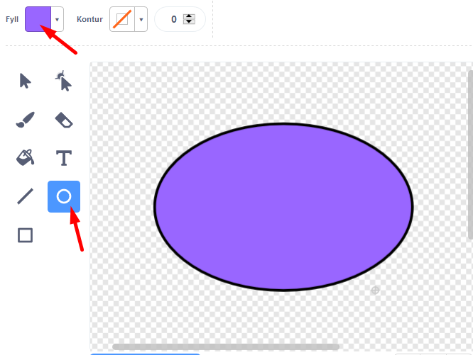
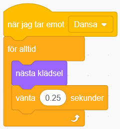

# Min Robot
Här får du skapa din egen robot som hjälper dig i din vardag! Vad vill du att din robot ska hjälpa dig med? En Musikrobot som spelar glad musik när du är ledsen? Eller en Matrobot som hjälper dig välja vad du ska äta till middag? I den här uppgiften får du prova på att koda meddelanden och variabler i Scratch. 

Klicka på bilden nedanför för att testa ett exempelprojekt med en hjälpsam Känslorobot: 

> Bläddra dig fram genom denna guide, steg för steg. <a href="https://scratch.mit.edu" target="_blank">
  Öppna även verktyget Scratch på sajten www.scratch.mit.edu</a> där du kodar och skapar själva Min Robot-projektet utifrån Kodbokens instruktioner.
  
Du bestämmer själv hur just din robot ska se ut, vad den ska hjälpa till med och hur. Kanske det är en Matrobot som hjälper dig att välja vad du ska äta till middag? Eller en Musikrobot som spelar glad musik när du har tråkigt? 

Då börjar vi koda!

## 1: Välj bakgrund och din robot

Här ska du välja en ny bakgrund och rita din robotfigur. Gör såhär:

1. Logga in på Scratch och öppna ett nytt projekt genom att trycka på **Skapa** på Scratch startsida.

2. Nu ska du välja en ny bakgrundsbild. I nedre högra hörnet finns en blå ikonne för **Välj en bakgrund**. Klicka på den så kommer du till Scratch bakgrunds-bibliotek. Klicka på en bakgrundsbild du gillar så läggs den till i ditt projekt.

  

3. Ta bort Katt-sprajten i projektet genom att klicka på soptunnan på den lilla kattbilden under scenen. Då försvinner katten ur projektet.

  

Dax att välja en figur som ska vara din robot. I vårt exempelprojekt har vi valt sprajten **Retro Robot**, men du väljer vilken figur du vill som din robot. 

4. Klicka på knappen **Välj ny sprajt**. Det är den lilla blå symbolen med en vit katt på, som du finner i nedre högra hörnet i Scratch. Klicka på sprajt du vill ha i sprajtbibioteket som kommer fram, så läggs den till i ditt projekt. 

  

Om du istället vill rita din egen robot kan du välja ritverktyget genom klcika på penseln **Måla ny sprajt** som kommer fram om du håller muspekaren över knappen **Välj ny sprajt**: 

  
  
När du är nöjd med din ritade sprajt så klickar du på fliken **Kod** högst upp i vänstra hörnet, så kommer du tillbaka ut ur ritverktyget.
  
  

5. Om din robotfigur är för stor kan du ändra storleken. Klicka på siffrorna vid **Storlek** som finns under scenen och skriv in nytt lägre tal. Storleken visas i procent, där 100 är full storlek. Prova dig fram tills du är nöjd.

  

Nu har du din robot-sprajt och en bakgrund. Nu ska vi börja koda det som roboten ska hjälpa till med.  att lägga till vad roboten ska hjälpa dig med.

## 2: Robotens frågor

Nu ska du få din robot att fråga vad du behöver hjälp med. Det kan vara att exempelvis hjälpa dig att välja maträtt eller pigga upp dig om du känner dig ledsen. Gör såhär:

1. Se först till att robot-sprajten är vald, genom att klicka på den lilla robot-figuren under scenen så den blir blåmarkerad. Nu kan du börja koda din robot. 

2. Från tema **HÄNDELSER** drar du in kodblocket **När GRÖN FLAGGA klickas på** och lägger det på skriptytan för din robot. Det här är koden för starktknappen på ditt projekt. 

  

3. Fån tema **UTSEENDE** drar du in kodblocket **säg hej i 2 sekunder** Lägg det direkt under **När GRÖN FLAGGA klickas på**.

  
  
 4. Klicka på ordet *Hej* i det lila kodblocket du just lade till och ändra texten till vad du vill att din robot ska presentera sig som. I vårt exempel har vi gjort en Känslorobot, så vi skrev: *Hej! Jag är din Känslorobot*.

  

5. Dra sedan in ett till likadant kodblock med **säg Hej i 2 sekunder** från tema **UTSEENDE** och lägg det under de andra kodblocken. 

6. Vi vill att roboten ska kunna hjälpa oss med något. Ändra därför texten *Hej* i det nya kodblocket till en fråga som du vill att roboten ska ställa dig, så den vet hur den bäst kan hjälpa dig. I vårt exempel med vår Känslorobot har vi valt frågan *Hur mår du?*.

  

> **Tips!** Är det svårt att komma på en bra fråga till din robot? Välj en fråga som passar för vad just din robot ska hjälpa dig med. Om det är en Matväljar-robot kanske den frågar: *Vad är du sugen på att äta?* Om det är en Tröstar-robot, kanske den frågar *Hur mår du?*.

  

> **Testa ditt projekt!** Klicka på START-flaggan. Frågar roboten din fråga?

Nu har vi en robot som ställer frågor. Men hur ska den veta ditt svar? Vi måste koda vidare. 

## 3: Svar att välja mellan
För att din robot ska kunna hjälpa dig måste den veta vad du svarar på frågan. Därför ska vi nu lägga till två olika svar att välja mellan. För att lösa det skapar vi två nya sprajtar som blir till svar-knappar att klicka på. Du ska göra en knapp i taget, så att det till slut blir till två olika sprajtar med varsin knapp. Gör såhär:

1. Håll muspekaren över **Skapa ny sprajt** och välj penseln för **Måla**. Nu kommer ritverktyget för sprajtar fram. 

  
  
Du ser även att det bildas en ny liten sprajt-ruta under scenen, bredvid din robot. Det blir din nya knapp-sprajt.

  
  
2. Rita nu den första knappen. Det kan vara exempelvis en enkel rund eller fyrkantig form fylld med färg. Välj först en **färg** du vill ha på knappen. Välj sen ett **ritverktyg**, exempelvis rund form, och måla en knapp på ritytan.

  
 
4. Byt till en ny färg som du vill skriva texten med svaret på din knapp. Välj en färg som syns tydligt på knappen. Välj sen verktyg att skriva text med, det är knappen med ett **T**. Skriv ett ord med ett av svaren på din knapp. 

  

>**Tips!** Blir knappens text för liten eller på fel ställe? Du kan ändra storlek på texten och vart den ska placeras genom att klicka en gång utanför ritverktygets yta, direkt efter att du skrivit texten. Då kommer en liten ram upp kring texten, som du kan dra i hörnpunkterna för att förstora eller förminska texten och ta tag i mitten av för att flytta till rätt position på knappen.  utanför 

5. Nu ska du göra en till knapp med den andra svars-texten på. Gör på samma sätt som ovan. Börja med att klicka på **Måla** som finns under knappen för **Skapa ny sprajt**.

  
  
6. Rita nu en andra knapp och skriv den andra svarstexten på den. Följ instruktionen ovan och gör din knapp på samma sätt som din första. 

Såhär ser vårt exempel ut med vår Känslorobot. Du bestämmer själv vilka svar din robot ska få och hur knapparna ska se ut.

  

Nu har du att ha en robot och två olika svarsknappar bredvid. Men hur ska roboten få reda på vilket svar vi väljer att klicka på? Och hur ska knapparna kopplas så de börjar fungera? Dax att koda vidare, så roboten kan få instruktioner om våra svar och kan hjälpa oss! 

## 4: Koppla svaren till roboten

## 3: Pingvinen kan dansa!

Nu vill du ge pingvinen några rörelser till musik. 

8. Gå till fliken LJUD i övre vänstra hörnet.

  

9. Klicka sen på VÄLJ NYTT LJUD-symbolen i nedre vänstra hörnet. 

  

10. Välj nytt ljud från ljudbiblioteket och klicka på det ljud du vill välja. Vi har valt **Loop > Dance Around** i exempelprojektet. 
  
  > **Tips!** Man kan förlyssna på de olika ljuden genom att föra musknappen över de olika! Om du inte hör någonting så kanske du har stängt av ljudet eller har hörlurar inkopplade, fråga någon om hjälp om du inte kan få igång ljudet!

11. Gå till fliken KOD i vänstra övre hörnet och ändra lite i skriptet som du skapade i steg 2. Det ska nu:

  * Starta när START-flaggan klickas på

  * **Fråga** _"Vad heter du?"_ och vänta på svar

  * **Skicka** meddelandet _"Dansa"_

  * **Spela ljudet** _Dance Around_ tills det har spelats färdigt

  

  _Meddelandet "Dansa" kommer att bli viktigt
om en stund. Kan du lista ut varför?_

12. Skapa nu ett nytt skript till pingvinen som ska:

  * Starta när det **tar emot meddelandet** _"Dansa"_

  * **För alltid**:

    * Byta till **nästa klädsel**

    * **Vänta 0.25 sekunder**

  

> Testa ditt projekt! Spelas ljudet efter att du har skrivit in ett namn? Dansar pingvinen lagom fort eller går det för snabbt eller långsamt? Testa att byta ut hur länge den ska vänta mellan klädselbyten.

## 4: Festens slut

För att pingvinen ska sluta dansa när melodin är slut, måste du koda den att göra det. Det kan du fixa med ett nytt **meddelande** som berättar att dansen är slut, så att pingvinen kan säga en hälsning, exempelvis *"Ha det så bra "* och sluta dansa.

13. Gör så att skriptet du gjorde i steg 1 skickar ut **meddelande** _"DANSEN SLUT"_ efter att ljudet _Danse Around_ har spelats klart.

  

14. Skapa ett nytt skript för pingvinen som ska:

  * Starta när det **tar emot meddelande** _"DANSEN SLUT"_

  * **Stoppa** alla _andra skript i sprajt_

  * **Säga** _"Ha det så bra"_ och **namnet du skrev in i början** i 2 sekunder! (namnet kommer automatiskt läggas in)

  

> Testa ditt projekt! Slutar Pingvinen att röra sig när melodin är slut? Säger pingvinen _"Ha det så bra …"_ och det namn som du skrev in när kortet frågade _"Vad heter du?"_ i början?

  > **Tips:** Om den sätter ihop Ha det så bra med namnet, så lägg till ett mellanslag efter _"Ha det så bra "_ i skriptet!

## 5: Alla ska dansa!

Nu vill vi att de två andra sprajtarna ska dansa också! Du ska få bestämma vad de gör när musiken börjar och när musiken slutar. Du kommer att få se varför **skicka** och **ta emot meddelande** är så bra att ha. Det kallas för en FUNKTION och är en del av programmet som kan anropas flera gånger och från flera olika skript i programmet.

15. Först måste du se till så att dina sprajtar har flera klädslar att byta mellan - och alltså kan röra sig. Annars kommer de stå stilla. 

16. Nu ska du skapa två skript för vardera sprajt. Du kan göra skripten för en sprajt och sedan kopiera dem till den andra. Bestäm själv vad som händer när sprajtarna **tar emot** meddelande "DANSA" och "DANSEN SLUT".

  

  > **Tips:** Titta på hur du gjorde skripten för pingvinen om du inte kommer ihåg!

> Testa ditt projekt! Dansar alla sprajtar nu? Dansar de i rätt hastighet? Testa att ändra antalet sekunder som de väntar innan byte av klädsel.

## 6: Pynta vykortet

Du har dansare och musik, men det finns alltid plats för lite mer bling och punt på vykortet! Kanske ska en annan sprajt dyka upp när musiken tar slut, en snöflinga, en stjärna eller ej annan figur? Du kan också göra fint med bakgrunden genom att exempelvis byta färg på scenen i takt med musiken eller lägga in stämningsmusik.

17. Börja med en sprajt som ska dykea upp på slutet, exempelvis ett hjärta. Lägg då till sprajten **Heart** från biblioteket och placera den där du vill ha den på scenen.

18. Skapa ett skript för hjärtat som säger att den ska vara **gömd** när START klickas på (så man inte ser den i början), och ett skript som säger att den ska **gömma** sig när den **tar emot meddelandet** "DANSEN SLUT" ( så den försvinenr igen när dansen är slut).

  
  
19. Sen lägger vi in att hjärtat ska **visa** sig och dansa och **byta klädsel** precis som pingvinen, när musiken går igång. Och försvinna igen när musiken tar slut.

  

20. Nu när vi har gjort ett hjärta (eller vilken sprajt du väljer) så ska vi se till att scenen blir mer pyntad genom att scenen ändrar färg. Klicka på BAKGRUNDER som finns under SCEN och gå till KOD-fliken. Skapa ett skript för när scenen tar emot meddelandet "DANSA" och ett för "DANSEN SLUT".

21. Skriptet för "DANSA" ska använda en LOOP som gör att scenen **för alltid** ska:

  * **Ändra** _färg_ **effekten med** _25_

  * **Vänta** _2_ **sekunder**

22. Skriptet för "DANSEN SLUT" ska:

  * **Stoppa** _andra skript i sprajten_

  

> **Testa ditt projekt!** Kommer det upp ett hjärte när pingvinen säger _"Ha det så bra …"_? Ändrar scenen färg? Slutar den ändra färg när melodin är slut?

## Färdig!
Grattis, nu har du gjort klart uppgiften.

**Glöm inte att spara ditt projekt!** Döp det gärna till uppgiftens namn så att du enkelt kan hitta den igen.

> **Testa ditt projekt**  
Visa gärna någon det som du har gjort och låt dem testa. Tryck på DELA för att andra ska kunna hitta spelet på Scratch. Gå ut till projektsidan och låt någon annan testa spelet!

## Utmaning
Har du tid över? Här kommer en utmaning för dig som vill fortsätta.

### Unika sprajtar
Kan du ändra i skripten för dina sprajtar så att de blir mer olika och roliga? Testa till exempel att:

* Ändra färgeffekt under dansen

* Ändra storlek på sprajten

* Lägg till rotation så att de vrider på sig

* Ändra hur fort dom dansar

Kan du hitta fler sätt att göra dom mer unika?

## Frågeställningar

* Hur är denna uppgift en berättelse?  

* Vad för block kan du använda för att få spelaren att ge ett svar på en fråga?

* Vad är ett meddelande?

* Vad kan du använda ett meddelande till?
