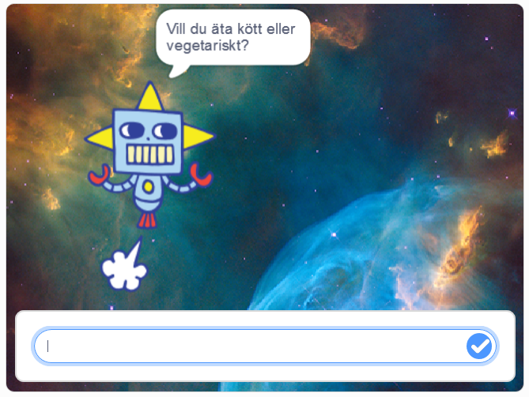
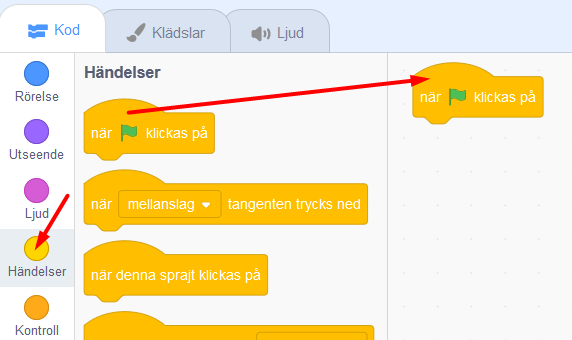
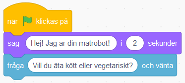

# Min Robot
Här får du skapa din egen robot som hjälper dig i din vardag! Vad vill du att din robot ska hjälpa dig med? En Musikrobot som spelar glad musik när du är ledsen? Eller en Matrobot som hjälper dig välja vad du ska äta till middag? I den här uppgiften får du prova på att koda variabler, operatorer och slump i Scratch. 

Klicka på bilden nedanför för att testa ett exempelprojekt med en hjälpsam Matrobot: 

> Bläddra dig fram genom denna guide, steg för steg. <a href="https://scratch.mit.edu" target="_blank">
  Öppna även verktyget Scratch på sajten www.scratch.mit.edu</a> där du kodar och skapar själva Min Robot-projektet utifrån Kodbokens instruktioner.
  
Du bestämmer själv hur just din robot ska se ut, vad den ska hjälpa till med och hur. Kanske det är en Matrobot som hjälper dig att välja vad du ska äta till middag? Eller en Musikrobot som spelar glad musik när du har tråkigt? 

Då börjar vi koda!

## 1: Välj bakgrund och din robot

Här ska du välja en ny bakgrund och välja din robotfigur - eller om du vill kan du såklart rita din egen robot. Gör såhär:

1. Logga in på Scratch och öppna ett nytt projekt genom att trycka på **Skapa** på Scratch startsida.

2. Nu ska du välja en ny bakgrundsbild. I nedre högra hörnet finns en blå ikonen för **Välj en bakgrund**. Klicka på den så kommer du till Scratch bakgrunds-bibliotek. Klicka på en bakgrundsbild du gillar så läggs den till i ditt projekt. (Du kan givetvis även välja att rita din egen bakgrund med Scratch ritverktyg för bakgrunder.)

  

3. Ta bort Katt-sprajten i projektet genom att klicka på soptunnan på den lilla kattbilden under scenen. Då försvinner katten ur projektet.

  

Dax att välja en figur som ska vara din robot. I vårt exempelprojekt har vi valt sprajten **Retro Robot**, men du väljer vilken figur du vill som din robot. 

4. Klicka på knappen **Välj ny sprajt**. Det är den lilla blå symbolen med en vit katt på, som du finner i nedre högra hörnet i Scratch. Klicka på sprajt du vill ha i sprajtbibioteket som kommer fram, så läggs den till i ditt projekt. 

  

Om du istället vill rita din egen robot kan du välja ritverktyget genom klicka på penseln **Måla ny sprajt** som kommer fram om du håller muspekaren över knappen **Välj ny sprajt**: 

  
  
När du är nöjd med din ritade sprajt så klickar du på fliken **Kod** högst upp i vänstra hörnet, så kommer du tillbaka ut ur ritverktyget.
  
  

5. Om din robotfigur är för stor kan du ändra storleken. Klicka på siffrorna vid **Storlek** som finns under scenen och skriv in nytt lägre tal. Storleken visas i procent, där 100 är full storlek. Prova dig fram tills du är nöjd.

  

Nu har du din robot-sprajt och en bakgrund. Nu ska vi börja koda vad som roboten ska hjälpa till med. 

## 2: Robotens frågor

Nu ska du få din robot att fråga vad du behöver hjälp med. Det kan vara att exempelvis hjälpa dig att välja maträtt till middag eller pigga upp dig om du känner dig ledsen. I vårt exempel har vi valt att skapa en robot som hjälper oss välja middag. Gör såhär:

1. Se först till att robot-sprajten är vald, genom att klicka på den lilla robot-figuren under scenen så den blir blåmarkerad. Nu kan du börja koda din robot. 

2. Från tema **HÄNDELSER** drar du in kodblocket **När GRÖN FLAGGA klickas på** och lägger det på skriptytan för din robot. Det här är koden för startknappen på ditt projekt. 

  

3. Fån tema **UTSEENDE** drar du in kodblocket **säg hej i 2 sekunder** Lägg det direkt under **När GRÖN FLAGGA klickas på**.

  
  
 4. Klicka på ordet *Hej* i det lila kodblocket du just lade till och ändra texten till vad du vill att din robot ska presentera sig som. I vårt exempel har vi gjort en Matrobot, så vi skrev: *Hej! Jag är din Matrobot!*.
!
  

>**Testa koden!** Klicka på den lilla flaggan ovanför scenen och testa koden. Presenterar sig roboten?

5. Nu vill vi att roboten ska ställa en fråga som vi ska skriva in svaret på. Då behöver vi ett annat block. Under tema **KÄNNA AV** finns blocket **fråga** *Vad heter du?* **och vänta**. Dra sedan in blocket och sätt ihop det underst med de andra kodblocken på skriptytan.

6. Klicka på texten i kodblocket du lade till och ändra texten *Vad heter du?* till en fråga som din din robot ska ställa dig, så den vet hur den bäst kan hjälpa dig. I vårt exempel med vår Matrobot har vi valt frågan *Vill du äta kött eller vegetariskt?*.

  

> **Tänk på!** Det är viktigt att skriva rätt i det svar ger till roboten, då svaret måste vara exakt det samma som roboten efterfrågar, exempelvis ja eller nej, kött eller vegetariskt, och såvidare. Tänk på att göra enkla svar, så det inte blir komplicerat att skriva. 

>**Tips!** Är det svårt att komma på en bra fråga till din robot? Välj en fråga som passar för vad just din robot ska hjälpa dig med.  Om det är en Tröstar-robot, kanske den frågar *Hur mår du - glad eller ledsen?*. Om det är en Musik-robot kanske den frågar *Vilken musik gillar du - lugn eller snabb?

  

> **Testa ditt projekt!** Klicka på START-flaggan. Frågar roboten din fråga? Vad händer om du skriver ett svar i nedre textrutan?

Nu har vi en robot som ställer frågor. Men hur ska den veta ditt svar? Vi måste koda vidare. 

## 3: Roboten hjälper till
För att din robot ska kunna hjälpa dig måste den veta vad du svarar på frågan. Därför ska vi nu lägga till kod för de två olika svaren du har att välja mellan. Roboten behöver instruktioner som anger vad den ska göra beroende på vilket svar den får in. Då använder vi en if-sats som säger att OM svaret är exempelvis JA så gär du det här, ANNARS gör du det här. Då börjar vi

1. Under tema **KONTROLL** finns kodblocket **om __ då**. Dra in blocket och lägg det direkt under din robots frågor i koden. 

  

2. Ser du det kantiga hålet mellan **om** och **då** i kodblocket du just lade till? Nu ska vi lägga in kod där som säger att **om** *Svar = kött* **då**. Gör såhär: Gå först till det gröna temat **OPERATORER** och leta fram kodblocket som har tecknet för "lika med" i sig ( = ). Dra in blocket och lägg det inuti det kantiga hålet mellan **om __ då**. Då ser skriptet ut såhär:

  
  
3. Nu ska vi lägga in vad det gröna operatorblocket ska hantera för variabler. Vi vill att det ska stå kod som ger **om** *Svar = kött* **då**. Koden ska **känna av** vilket svar som skrivs in i textrutan för svaret. Gå därför till tema **KÄNNA AV** och hitta kodblocket **svar**. Dra in blocket så det lägger sig inuti den första tomma vita cirkeln i den gröna operator-blocket, så det ser ut såhär:

  
 
4. Skriv sedan in det första av de svarsval du gav i robotens fråga, exempelvis svaret **kött** så som vår matrobot efterfrågar i exemplet i denna instruktion. (*"Vill du äta kött eller vegetariskt?"*).

5. Nu ska vi ändra så att svaret blir lika med ett av robotens givna svarsval i det gröna operatorblocket. Klicka på variabelsiffran 50 och skriv istället ett av robotens två svarsval. I vårt exempel med Matroboten skriver vi svarsvalet *kött*.

  
  
6. Nu vet roboten vilket svar vi valt och kan hjälpa dig, dax att lägga till robotens svar. Under tema **UTSEENDE** finns blocket **säg Hej! i 2 sekunder**. lägg in det blocket inuti den gula villkors-loopen. Ändra texten till robotens svar som passar med det val du skrivit till den. I vårt exempel blir det såhär:

  

7. Gör nu en exakt likadan kod till som du just gjort för svarsvalet kött, men som istället styr vad som händer om du svarar det andra svarsvalet. Exempelvis om vi svarar Matroboten att vi vill äta *vegetariskt* istället för *kött*. Repetera steg 1-6 ovan för att bygga en lika dan kodbit till . Lägg hela kodbiten direkt under det förra, så det ser ut såhär när det är färdigt:

  

>**Testa koden!** Vad händer när du svarar roboten ett av svarsvalen? Fungerar de olika svaren? 

Nu har vi en robot som kan hjälpa dig! Men visst vore et kul om den spelade lite musik och rörde på sig! Vi pimpar vår robot lite!

## Roboten spelar musik

xxxxxxx

## Färdig!
Grattis, nu har du gjort klart uppgiften.

**Glöm inte att spara ditt projekt!** Döp det gärna till uppgiftens namn så att du enkelt kan hitta den igen.

> **Testa ditt projekt**  
Visa gärna någon det som du har gjort och låt dem testa. Tryck på DELA för att andra ska kunna hitta spelet på Scratch. Gå ut till projektsidan och låt någon annan testa spelet!

## Utmaning
Har du tid över? Här kommer en utmaning för dig som vill fortsätta.

## Frågeställningar

