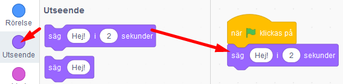
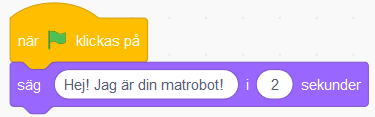
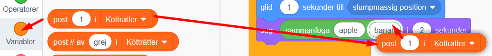
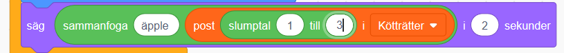

# Min Robot
Här får du skapa din egen robot som hjälper dig i din vardag! Vad vill du att din robot ska hjälpa dig med? En Musikrobot som spelar glad musik när du är ledsen? Eller en Matrobot som hjälper dig välja vad du ska äta till middag? I den här uppgiften får du prova på att koda villkor, operatorer och om du vill även slump i Scratch. 

Klicka på bilden nedanför för att testa ett exempelprojekt med en hjälpsam Matrobot: 

> Bläddra dig fram genom denna guide, steg för steg. <a href="https://scratch.mit.edu" target="_blank">
  Öppna även verktyget Scratch på sajten www.scratch.mit.edu</a> där du kodar och skapar själva Min Robot-projektet utifrån Kodbokens instruktioner.

Så, vad ska din robot hjälpa dig med? Dax att börja koda!

## 1: Välj bakgrund och din robot

Här ska du välja en ny bakgrund och välja din robotfigur - eller om du vill kan du såklart rita din egen robot.
<video src="./MinRobot_1.mp4" controls muted height=480 width=640 />

>**VAD SKA JAG GÖRA?**

Se i videon ovan hur du ska:
- Ta bort kattfiguren
- Välj ny sprajt
- Ändra sprajtens storlek (om du vill)
- Lägg till en bakgrundsbild

 
>**INSTRUKTION HUR JAG GÖR STEG-FÖR-STEG:**

1. Logga in på Scratch och öppna ett nytt projekt genom att trycka på **Skapa** på Scratch startsida.

2. Ta bort Katt-sprajten i projektet genom att klicka på soptunnan på den lilla kattbilden under scenen. Då försvinner katten ur projektet.

  

Dax att välja en figur som ska vara din robot. I vårt exempelprojekt har vi valt sprajten **Retro Robot**, men du väljer vilken figur du vill som din robot. 

3. Klicka på knappen **Välj ny sprajt**. Det är den lilla blå symbolen med en vit katt på, som du finner i nedre högra hörnet i Scratch. Klicka på en sprajt du vill ha i sprajtbibioteket som kommer fram, så läggs den till i ditt projekt. (Tips: sök på robot i sökverktyget så finner du enkelt Scratch robotar.)

  
  
4. Om din robotfigur är för stor eller för liten kan du ändra storleken på den. Klicka på siffrorna vid **Storlek** som finns under scenen och skriv in nytt lägre elelr högre tal. Storleken visas i procent, där 100 är full storlek. Prova dig fram tills du är nöjd.

  

5. Nu ska du välja en ny bakgrundsbild. I nedre högra hörnet finns en blå ikonen för **Välj en bakgrund**. Klicka på den så kommer du till Scratch bakgrunds-bibliotek. Klicka på en bakgrundsbild du gillar så läggs den till i ditt projekt.

  
  
Nu har du din robot-sprajt och en bakgrund. Nu ska vi börja koda vad som roboten ska hjälpa till med. 

## 2: Robotens frågor

Nu ska du få din robot att fråga vad du behöver hjälp med. Det kan vara att exempelvis hjälpa dig att välja maträtt till middag eller pigga upp dig om du känner dig ledsen. I vårt exempel har vi valt att skapa en robot som hjälper oss välja middag.
<video src="./MinRobot_2.mp4" controls muted height=480 width=640 />

>**VAD SKA JAG GÖRA?**

Se i videon ovan hur du ska:
- Lägg till ett startskript för "När gröna flaggan klickas på"
- Lägg till ett block för robotens att säga en hälsning
- Lägg till en fråga med två svarsval och låt roboten vänta på ett svar

 
>**INSTRUKTION HUR JAG GÖR STEG-FÖR-STEG:**

1. Se först till att robot-sprajten är vald, genom att klicka på den lilla robot-figuren under scenen så den blir blåmarkerad. Nu kan du börja koda din robot. 

2. Från tema **HÄNDELSER** drar du in kodblocket **När GRÖN FLAGGA klickas på** och lägger det på skriptytan för din robot. Det här är koden för startknappen på ditt projekt. 

  

3. Fån tema **UTSEENDE** drar du in kodblocket **säg hej i 2 sekunder** Lägg det direkt under **När GRÖN FLAGGA klickas på**.

  
  
 4. Klicka på ordet *Hej* i det lila kodblocket du just lade till och ändra texten till vad du vill att din robot ska presentera sig som. I vårt exempel har vi gjort en Matrobot, så vi skrev: *Hej! Jag är din Matrobot!*.
!
  

>**Testa koden!** Klicka på den lilla flaggan ovanför scenen och testa koden. Presenterar sig roboten?

5. Nu vill vi att roboten ska ställa en fråga som vi ska skriva in svaret på. Då behöver vi ett annat block. Under tema **KÄNNA AV** finns blocket **fråga** *Vad heter du?* **och vänta**. Dra sedan in blocket och sätt ihop det underst med de andra kodblocken på skriptytan.

6. Klicka på texten i kodblocket du lade till och ändra texten *Vad heter du?* till en fråga som din din robot ska ställa dig, så den vet hur den bäst kan hjälpa dig. I vårt exempel med vår Matrobot har vi valt frågan *Vill du äta kött eller vegetariskt?*.

  

> **Tänk på!** Det är viktigt att skriva rätt i det svar ger till roboten, då svaret måste vara exakt det samma som roboten efterfrågar, exempelvis ja eller nej, kött eller vegetariskt, och såvidare. Tänk på att göra enkla svar, så det inte blir komplicerat att skriva. 

>**Tips!** Är det svårt att komma på en bra fråga till din robot? Välj en fråga som passar för vad just din robot ska hjälpa dig med.  Om det är en Tröstar-robot, kanske den frågar *Hur mår du - glad eller ledsen?*. Om det är en Musik-robot kanske den frågar *Vilken musik gillar du - lugn eller snabb?

  

> **Testa ditt projekt!** Klicka på START-flaggan. Frågar roboten din fråga? Vad händer om du skriver ett svar i nedre textrutan?

Nu har vi en robot som ställer frågor. Men hur ska den veta ditt svar? Vi måste koda vidare. 

## 3: Roboten hjälper till
För att din robot ska kunna hjälpa dig måste den veta vad du svarar på frågan. Därför ska vi nu lägga till kod för de två olika svaren du har att välja mellan. Roboten behöver instruktioner som anger vad den ska göra beroende på vilket svar den får in. Då använder vi en if-sats som säger att OM svaret är exempelvis JA så gär du det här, ANNARS gör du det här.
<video src="./MinRobot_3.mp4" controls muted height=480 width=640 />

>**VAD SKA JAG GÖRA?**

Se i videon ovan hur du ska:
- Lägg till ett villkors-block för "Om__Då"
- Lägg till en operator för "__ = ___ "
- Lägg till blocket för frågans svar i operatorn
- Skriv in ett av frågans svarsval i operatorn
- Lägg till så roboten svarar tillbaka

 
>**INSTRUKTION HUR JAG GÖR STEG-FÖR-STEG:**

1. Under tema **KONTROLL** finns kodblocket **om __ då**. Dra in blocket och lägg det direkt under din robots frågor i koden. 

  

2. Ser du det kantiga hålet mellan **om** och **då** i kodblocket du just lade till? Nu ska vi lägga in kod där som säger att **om** *Svar = kött* **då**. Gör såhär: Gå först till det gröna temat **OPERATORER** och leta fram kodblocket som har tecknet för "lika med" i sig ( = ). Dra in blocket och lägg det inuti det kantiga hålet mellan **om __ då**. Då ser skriptet ut såhär:

  
  
3. Nu ska vi lägga in vad det gröna operatorblocket ska hantera för variabler. Vi vill att det ska stå kod som ger **om** *Svar = kött* **då**. Koden ska **känna av** vilket svar som skrivs in i textrutan för svaret. Gå därför till tema **KÄNNA AV** och hitta kodblocket **svar**. Dra in blocket så det lägger sig inuti den första tomma vita cirkeln i den gröna operator-blocket, så det ser ut såhär:

  
 
4. Skriv sedan in det första av de svarsval du gav i robotens fråga, exempelvis svaret **kött** så som vår matrobot efterfrågar i exemplet i denna instruktion. (*"Vill du äta kött eller vegetariskt?"*).

5. Nu ska vi ändra så att svaret blir lika med ett av robotens givna svarsval i det gröna operatorblocket. Klicka på variabelsiffran 50 och skriv istället ett av robotens två svarsval. I vårt exempel med Matroboten skriver vi svarsvalet *kött*.

  
  
6. Nu vet roboten vilket svar vi valt och kan hjälpa dig, dax att lägga till robotens svar. Under tema **UTSEENDE** finns blocket **säg Hej! i 2 sekunder**. lägg in det blocket inuti den gula villkors-loopen. Ändra texten till robotens svar som passar med det val du skrivit till den. I vårt exempel blir koden med svaret såhär:

  

7. Gör nu en exakt likadan kod till som den du just gjort för det första svarsvalet ovan, men som istället styr vad som händer om du svarar det andra svarsvalet. Exempelvis om vi svarar Matroboten att vi vill äta *vegetariskt* istället för *kött*. Repetera steg 1-6 ovan för att bygga en likadan kodbit till. Sätt in hela kodbiten direkt under det förra, så det ser ut såhär:

  

>**Testa koden!** Vad händer när du svarar roboten ett av svarsvalen? Fungerar de olika svaren? 

Nu har vi en robot som kan hjälpa dig! Men visst vore et kul om den spelade lite musik och rörde på sig! Vi pimpar vår robot lite!

## 4: Roboten spelar ljud
Nu ska vi lägga på lite musik eller ljudeffekter till din robots olika svar. 
<video src="./MinRobot_4.mp4" controls muted height=480 width=640 />

>**VAD SKA JAG GÖRA?**

Se i videon ovan hur du ska:
- Lägg till två ljudblock inom villkoret
- Lägga till nytt ljud
- Ändra ljudet i ljudblocket så rätt spelas

 
>**INSTRUKTION HUR JAG GÖR STEG-FÖR-STEG:**

1. Först ska vi lägga till kodblocken för ljud, så att roboten vet när den ska spela sin musik. Under tema **LJUD** väljer du kodblocket **Starta ljud** *Pop*. Dra in två sådana block och lägg dem inuti vardera villkors-loop för **om...då**, så det ser ut såhär:

  
  
>**Tips!** Ibland kan det stå något annat ljud än just ljudet **Pop** i kodblocket. Det är ok, välj det ändå. 

>**Testa koden!** Kör igång ditt projekt och testa koden. Hörs det ett ljud efter att roboten svarat på ditt knappval? Om du hör ljudet så vet du att roboten kan skapa ljud. Om du inget hör, kolla att högtalarna på din dator är på och volymen bra och prova att starta projektet igen. 

2. Nu ska vi välja ett nytt ljud eller musik som du tycker passar din robots två olika hjälpande svar. Klicka på **fliken** som heter **Ljud** i övre vänstra hörnet i Scratch. Då kommer du till Scratch ljudredigerare, där du kan välja nya ljud.

  
  
3. Nu ska vi välja två olika ljud eller musiksslingor som du tycker passar för din robots två olika svar. Klicka på **Välj nytt ljud** som är den lilla blå knappen med en vit högtalare på i nedre vänstra hörnet av Scratch. 

  

4. Om du vill ha musik väljer du kategorin **Loopar** högst upp, vill du ha ljudeffekter kan du välja kategorin **Effekter**. Lyssna på de olika ljuden genom att klicka på de lilla små Play-knapparna. När du hittat ett ljud du vill ha klickar du mitt på ljudets svarta hägtalarbild så läggs ljudet till i ditt projekt.

  
  
5. Gör om steg 2 och 3 och välj ditt andra ljud till ditt projekt. I vårt exempelprojekt har vi valt två likadana datorljud som heter  **computer beep**.

6. När du är nöjd klickar du på fliken **KOD** i övre vänstra hörnet av Scratch, så kommer du tillbaka till robotens skriptyta med all kod igen.

  
  
7.  Klicka nu på den lilla pilen i dina kodblock för ljud. Byt ljudet som ska spelas till något av de nya ljud som du valt. I vårt exempelprojekt ser nu koden ut såhär:

  
  
>**Testa koden!** Spelar roboten dina nya ljud när du testar dina olika svarsknappar? 

Nu har vi en robot som svarar och som spelar ljud. Kul om den rör sig lite också. Vi lägger till kod för rörelse!

## 5: Roboten rör sig
För att göra roboten mer levande kan den gärna få röra sig. Det kan man lösa på olika sätt för att få fram olika rörelser.
<video src="./MinRobot_5.mp4" controls muted height=480 width=640 />

>**VAD SKA JAG GÖRA?**

Se i videon ovan hur du ska:
- Lägg till två rörelseblock, ett i vardera villkor, för roboten att glida iväg
- Lägg till en startposition för roboten
- Animera robotens olika klädslar med block för att ändra klädsel, ett i vardera villkor
- Lägg till en bestämd första robotklädsel när projektet startas

 
>**INSTRUKTION HUR JAG GÖR STEG-FÖR-STEG:**

1. Under tema **RÖRELSE** finns kodblocket **glid 1 sekunder till slumpmässig position**. Dra in två sådana block och lägg ett inuti vardera villkor med **om...då**. Då ser koden ut såhär:

  
  
2.. För att roboten alltid ska ha samma startpunkt varje gång du startar om, behöver du lägga in en **startposition** i koden. Se först till att din robot står på det ställe där du vill den alltid ska starta, du kan dra robot-sprajten dit du vill den ska stå. Under tema **RÖRELSE** finns kodblocket **gå till x: __ och y: __**. Dra in detta block och lägg det direkt under blocket **När GRÖN FLAGGA klickas på**.

  
  
>**Testa koden!** Vad händer när du kör koden? Rör sig roboten när den svarat dig? Hoppar roboten tillbaka till si startposition varje gång du klickar på den gröna flaggan?

3. Om du vill kan du även animera din robot så den ändrar sig i utseendet. Det kan du göra genom att växla mellan olika bilder av robot-sprajten. I Scratch kallas bilderna det för sprajtens **klädslar**. Alla sprajtar har inte flera klädslar, men många har det. Kontrollera vilka klädslar din sprajt har genom att klicka på fliken **KLÄDSLAR** som finns i övre vänstra hörnet. Då ser du sprajtens klädslar till vänster. I vårt exempel ser vår robots klädslar ut såhär:

  

4. Varje klädsel har ett namn. Dessa går att lägga in i kod-skriptet så att du kan byta klädslar. Bestäm först vilken klädsel du vill att din robot ska ha varje gång den startas. Under tema **UTSEENDE** finns blocket **ändra klädsel till...**. Lägg blocket direkt under översta blocket med gröna startflaggan. Klicka sen på lilla **pilen i blocket** och ändra till den klädsel du vill ha som start-klädsel.

  
  
5. Lägg nu in två likadana block till med **ändra klädsel till...**. Lägg ett block inom vardera villkors-loop **om...då**. Ändra dem till den klädsel du vill att din robot ska få varje gång den gett sitt svar. Såhär kan koden se ut nu:

  

>**Testa koden!** Vad händer när du kör koden? Rör sig roboten? Byter den klädslar? 

> **Tips!** Om din sprajt saknar fler klädslar, eller om du ritat din egen sprajt, kan du skapa fler klädslar genom att exempelvis kopiera sprajtens enda klädsel (högerklicka på den enda klädsel som finns och välj kopiera, så får du en till likadan) och sedan ändra lite på den nya klädseln som skapades. Kanske du vill ändra färg på sprajten med hink-verktyget, eller måla dit en glad mun eller stora ögon?

## Färdig!
Grattis, nu har du gjort klart uppgiften. Om du har följt vår instruktion ser den färdiga koden ut ungefär såhär:

  

**Glöm inte att spara ditt projekt!** Döp det gärna till uppgiftens namn så att du enkelt kan hitta den igen.

> **Testa ditt projekt**  
Visa gärna någon det som du har gjort och låt dem testa. Tryck på DELA för att andra ska kunna hitta spelet på Scratch. Gå ut till projektsidan och låt någon annan testa spelet!

## Utmaning
Har du tid över? Här kommer en utmaning för dig som vill fortsätta.

**Slumpa fram fler svar**
  
  
För att din robot ska kännas mer som att den är en smart robot som kan "tänka själv", kan du lägga till att den ska slumpa fram olika svar till dig. Då varierar den svaren varje gång du ber den svara. 
För att roboten ska kunna slumpa behöver den olika svar i en lista. Den behöver en lista för vardera val vi svarat på, exempelvis om vi svarat att vi vill äta vegetariskt eller kött i vår Matrobot, så behöver vi skapa två listor, en med vegetariska rätter att välja mellan och en för kötträtter. Vi börjar med att skapa två listor med olika savrsval. 

1. Under tema **VARIABLER** klickar du på **Skapa en lista**. 

  

2. Namnge din nya lista till ett av dina svarsval, exempelvis *Vegetariska rätter* som i vårt exempel med Matrobot.

  

3. Gör en exakt likadan lista till som du döper för ditt andra svarsval, som i vårt exempel blir *Kötträtter* med vår Matrobot.

4. Nu har du fått fram två listor som heter dina valda namn (exempelvis Vegetariska rätter och Kötträtter). Det syns bland dina block och även som två tomma listor på scenen bredvid din robot. 

  
  
  
5. Nu ska du lägga till tre stycken olika svar i respektive lista, som roboten kan slumpa fram när den ska svara. Under tema **VARIABLER** drar du ut blocket **lägg till** *grej* **i** *Kötträtter*. (istället för vårt exempel med "Kötträtter" står det här ett av dina skapade namn på en av dina svarslistor.) Lägg blocket fritt på din skriptyta med kod. 

6. Istället för ordet *grej* skriver du nu in ett svarsalternativ som passar för just denna lista. I vårt exempel med listan *Kötträtter* kan ett svar från Matroboten exempelvis vara *lasagne*. 

7. Dra ut två till likadana kodblock till och byt ut ordet *grej* till andra svar som passar för denna lista. I vårt exempel blir det *köttbullar* och *korvgryta*. Sätt alla de tre kodblocken under varandra så de sitter ihop. 

  
  
8. Från tema **HÄNDELSER** drar du in startblocket **när GRÖN FLAGGA klickas på**. Lägg det överst på de andra kodblocken. När du startar om din robot, vill du att din svarslista alltid ska vara tom, så från tema **VARIABLER** drar du även in kodblocket **ta bort alla** *Kötträtter*. Lägg det direkt under **när GRÖN FLAGGA klickas på**, så det ser ut såhär:

  
  
9. Gör nu ett exakt likadant kodskript för din andra lista. Lägg den bredvid din första. Notera att du behöver klicka på lilla pilen och byta till din andra svarslista, i vårt exempel byter vi alltså från *Kötträtter* till *Vegetariska rätter* i kodblocken. När du är färdig kan koden och din robot på scenen se ut exempelvis såhär:

  
  
  
10. Nu ska vi lägga in kod i robotens stora kodskript, så att roboten kan hämta svar att slumpa ut ur de två olika listorna. Leta fram kodblocket i robotens kod där det står **säg ___ i 2 sekunder**. Nu ska vi byta ut det som roboten säger där mot slumpade svar ur en av listorna. Under tema **OPERATORER** drar du in blocket **sammanfoga äpple och banan**. Lägg in det gröna blocket inuti det lila blocket ovanpå den text som står i den vita bubblan efter ordet **säg...**, såhär:

  
  
11. Nu ska vi koda in vilken lista som roboten ska hämta sina svarsval från. Från tema **VARIABLER** drar du in kodblocket **post 1 i** *Kötträtter*. (Det står något av dina listors namn i kodblocket, du kan byta med lilla pilen i kodblocket, så det hämtar svar från rätt lista.) Dra in kodbiten och lägg den inuti den gröna operatorblocket där det står **banan**. Så här:

  

12. Just nu visar din kod att roboten alltid ska välja att posta svaret nummer 1 ur listan, men vi vill ju att den ska slumpa svar från hela listan. Nu ska vi lägga till kod för slump, så roboten kan ge olika svar från sina listor. Under tema **OPERATORER** finns kodblocket **slumptal 1 till 10**. Dra in det och lägg det ovanpå där det står siffran **1** i orangea variabelkoden, direkt efter **säg sammanfoga post...**. Så här: 

  
  
Ändra sedan variablen i operatorn så att det står **slumptal 1 till 3**, då du endast har 3 svarsval i din lista. 

  

13. Byt nu ut texten **äpple** till något som passar vad din robot ska säga. I vprt exempel med vår Matrobot skriver vi istället: *Då lagar jag *. Sedan kommer svaret från listan att stå efter, exempelvis *Då lagar jag lasagne*.
Nu ska koden i skriptet se ut såhär:

  
  
> **Testa koden!** Vad händer när roboten svarar dig? Slumpar den fram olika svar varje gång du startar om med gröna flaggan? 
> **Tips!** Sitter orden ihop i svaret? Lägg då till ett mellanslag efter texten *"Då lagar jag "* så får du mellanrumm mellan din svarsmening och ditt slumpade svar. 

14. Skapa nu exakt samma kod igen längre ned i din robots kodskript, så att den kan hämta slumpade svar från din andra lista också. I vårt exempel med vår Matrobot ser då hela koden ut såhär:

  
  
15. För att listorna med svarsvalen inte ska synas på scenen med roboten lägger du slutligen till två stycken block **göm listan ____** som finns under tema **VARIABLER**. Lägg en vardera under de två skripten med variabler för de två listorna, direkt inunder **när GRÖN FLAGGA klickas på**, så det ser ut såhär:

  
  
Notera att du behöver ändra namnet på listan i kodblocket, så det är ett block med vardera listas namn i sig.
  
> **Testa koden!** Ger roboten slumpade svar från de två olika listorna? Är listorna synliga på scenen?

Nu har du en robot som kan slumpa fram svar. Utmana dig genom att lägga till fler svar och ändra i antalet som roboten kan slumpa fram. Kanske till och med fler listor? 

## Frågeställningar

* Vad är en loop?

* Varför kan det vara bra att använda en loop?

* Vad är ett villkor? 

* Vad är slump?

* Varför kan inte roboten förstå dig om du skriver fel svar på frågan?

