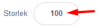
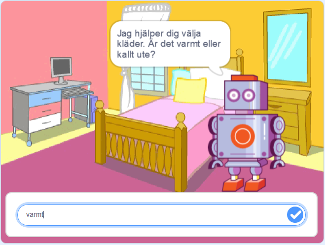

# Min Robot med frågor
Här får du skapa din egen robot som hjälper dig i din vardag! Vad vill du att din robot ska hjälpa dig med? En Musikrobot som spelar glad musik när du är ledsen? Eller en Matrobot som hjälper dig välja vad du ska äta till middag? I den här uppgiften får du prova på att koda variabler, operatorer och slump i Scratch. 

Klicka på bilden nedanför för att testa ett exempelprojekt med en hjälpsam Matrobot: 

> Bläddra dig fram genom denna guide, steg för steg. <a href="https://scratch.mit.edu" target="_blank">
  Öppna även verktyget Scratch på sajten www.scratch.mit.edu</a> där du kodar och skapar själva Min Robot-projektet utifrån Kodbokens instruktioner.
  
Du bestämmer själv hur just din robot ska se ut, vad den ska hjälpa till med och hur. Kanske det är en Matrobot som hjälper dig att välja vad du ska äta till middag? Eller en Musikrobot som spelar glad musik när du har tråkigt? 

Då börjar vi koda!

## 1: Välj bakgrund och din robot

Här ska du välja en ny bakgrund och välja din robotfigur - eller om du vill kan du såklart rita din egen robot. Gör såhär:

1. Logga in på Scratch och öppna ett nytt projekt genom att trycka på **Skapa** på Scratch startsida.

2. Nu ska du välja en ny bakgrundsbild. I nedre högra hörnet finns en blå ikonen för **Välj en bakgrund**. Klicka på den så kommer du till Scratch bakgrunds-bibliotek. Klicka på en bakgrundsbild du gillar så läggs den till i ditt projekt. (Du kan givetvis även välja att rita din egen bakgrund med Scratch ritverktyg för bakgrunder.)

  

3. Ta bort Katt-sprajten i projektet genom att klicka på soptunnan på den lilla kattbilden under scenen. Då försvinner katten ur projektet.

  

Dax att välja en figur som ska vara din robot. I vårt exempelprojekt har vi valt sprajten **Retro Robot**, men du väljer vilken figur du vill som din robot. 

4. Klicka på knappen **Välj ny sprajt**. Det är den lilla blå symbolen med en vit katt på, som du finner i nedre högra hörnet i Scratch. Klicka på sprajt du vill ha i sprajtbibioteket som kommer fram, så läggs den till i ditt projekt. 

  

Om du istället vill rita din egen robot kan du välja ritverktyget genom klicka på penseln **Måla ny sprajt** som kommer fram om du håller muspekaren över knappen **Välj ny sprajt**: 

  
  
När du är nöjd med din ritade sprajt så klickar du på fliken **Kod** högst upp i vänstra hörnet, så kommer du tillbaka ut ur ritverktyget.
  
  

5. Om din robotfigur är för stor kan du ändra storleken. Klicka på siffrorna vid **Storlek** som finns under scenen och skriv in nytt lägre tal. Storleken visas i procent, där 100 är full storlek. Prova dig fram tills du är nöjd.

  

Nu har du din robot-sprajt och en bakgrund. Nu ska vi börja koda vad som roboten ska hjälpa till med. 

## 2: Robotens frågor

Nu ska du få din robot att fråga vad du behöver hjälp med. Det kan vara att exempelvis hjälpa dig att välja maträtt till middag eller pigga upp dig om du känner dig ledsen. I vårt exempel har vi valt att skapa en robot som hjälper oss välja middag. Gör såhär:

1. Se först till att robot-sprajten är vald, genom att klicka på den lilla robot-figuren under scenen så den blir blåmarkerad. Nu kan du börja koda din robot. 

2. Från tema **HÄNDELSER** drar du in kodblocket **När GRÖN FLAGGA klickas på** och lägger det på skriptytan för din robot. Det här är koden för startknappen på ditt projekt. 

  

3. Fån tema **UTSEENDE** drar du in kodblocket **säg hej i 2 sekunder** Lägg det direkt under **När GRÖN FLAGGA klickas på**.

  
  
 4. Klicka på ordet *Hej* i det lila kodblocket du just lade till och ändra texten till vad du vill att din robot ska presentera sig som. I vårt exempel har vi gjort en Matrobot, så vi skrev: *Hej! Jag är din Matrobot!*.
!
  

>**Testa koden!** Klicka på den lilla flaggan ovanför scenen och testa koden. Presenterar sig roboten?

5. Nu vill vi att roboten ska ställa en fråga som vi ska skriva in svaret på. Då behöver vi ett annat block. Under tema **KÄNNA AV** finns blocket **fråga** *Vad heter du?* **och vänta**. Dra sedan in blocket och sätt ihop det underst med de andra kodblocken på skriptytan.

6.Klicka på texten i kodblocket du lade till och ändra texten *Vad heter du?* till en fråga som roboten ska ställa dig, så den vet hur den bäst kan hjälpa dig. I vårt exempel med vår Matrobot har vi valt frågan *Är du hungrig - ja eller nej?*.

  

> **Tänk på!** Det är viktigt att skriva ut vilka svar man ska ge roboten, då svaret måste vara exakt det samma som roboten efterfrågar, exempelvis ja eller nej. Tänk på att göra enkla svar, så det inte blir komplicerat att skriva. 

>**Tips!** Är det svårt att komma på en bra fråga till din robot? Välj en fråga som passar för vad just din robot ska hjälpa dig med.  Om det är en Tröstar-robot, kanske den frågar *Hur mår du - glad eller ledsen?*. Om det är en Musik-robot kanske den frågar *Vilken musik gillar du - lugn eller snabb?

  

> **Testa ditt projekt!** Klicka på START-flaggan. Frågar roboten din fråga? Vad händer om du skriver ett svar i nedre textrutan?

Nu har vi en robot som ställer frågor. Men hur ska den veta ditt svar? Vi måste koda vidare. 

## 3: Svar att välja mellan
För att din robot ska kunna hjälpa dig måste den veta vad du svarar på frågan. Därför ska vi nu lägga till kod för de två olika svaren du har att välja mellan. Roboten behöver instruktioner som anger vad den ska göra beroende på vilket svar den får in. Då använder vi en if-sats som säger att OM svaret är exempelvis JA så gär du det här, ANNARS gör du det här. Då börjar vi

1. Under tema **KONTROLL** finns kodblocket **om __ då __ annars**. Dra in blocket och lägg det direkt under din robots frågor i koden. 

  

2. Ser du det kantiga hålet mellan **om** och **då** i kodblocket du just lade till? Nu ska vi lägga in kod där som säger att **om** *Svar = ja* **då**. Gör såhär: Gå först till det gröna temat **OPERATORER** och leta fram kodblocket som har tecknet för "lika med" i sig ( = ). Dra in det blocket och lägg det inuti hålet mellan **om __ då**. Då ser det ut såhär:

  
  
3. Nu ska vi lägga in vad den gröna operatorblocket ska hantera för variabler. Vi vill att det ska stå kod för **om** *Svar = ja* **då**. Koden ska "känna av" vilket svar som skrivs in i textrutan. Gå därför till tema **KÄNNA AV** och hitta kodblocket **svar**. 
Dra in det så det lägger sig inuti den första tomma vita cirkeln i den gröna operator-koden, så det ser ut såhär:

  
 
4. Skriv sedan in det första av de svarsval du skrev i robotens fråga, exempelvis ett **ja** så som vår matrobot efterfrågar i vårt exempel i denna instruktion. (Är du hungrig? Svara ja eller nej).

XXXXXXXX

XXXXXXXXXXX

XXXXXXXXX
  

>**Tips!** Blir knappens text för liten eller på fel ställe? Du kan ändra storlek på texten och vart den ska placeras genom att klicka en gång utanför ritverktygets yta, direkt efter att du skrivit texten. Då kommer en liten ram upp kring texten, som du kan dra i hörnpunkterna för att förstora eller förminska texten och ta tag i mitten av för att flytta till rätt position på knappen.  utanför 

5. Nu ska du göra en till knapp med den andra svars-texten på. Gör på samma sätt som ovan. Börja med att klicka på **Måla** som finns under knappen för **Skapa ny sprajt**.

  
  
6. Rita nu en andra knapp och skriv den andra svarstexten på den. Följ instruktionen ovan och gör din knapp på samma sätt som din första. 

Såhär ser vårt exempel ut med vår Känslorobot. Du bestämmer själv vilka svar din robot ska få och hur knapparna ska se ut.

  

Nu har du att ha en robot och två olika svarsknappar bredvid. Men hur ska roboten få reda på vilket svar vi väljer att klicka på? Och hur ska knapparna kopplas så de börjar fungera? Dax att koda vidare, så roboten kan få instruktioner om våra svar och kan hjälpa oss! 

## 4: Roboten skickar meddelande
Nu ska vi lägga till kod för att koppla svarsknapparna till roboten, så att roboten kan veta vilket svar du ger - alltså vilken knapp du klickar på. För att göra detta ska vi låta de olika srajtarna skicka små meddelanden till varandra, som får olika saker att hönda i rätt ordning. Då börjar vi!

1. Se först till att du är tillbaka på rätt ställe där du kan koda och inte är kvar i ritverktyget. Klicka på fliken **Kod** hägst upp i vänstra hörnet. 

  

2. Klicka även på lilla ikonen av din robot som finns under scenen, så att rätt sprajt är vald och du kan koda din robot och inte svarsknapparnas sprajtar.

  
  
3. Nu ska vi skapa ett första meddelande, som ska skickas från roboten till svarsknapparna. Under tema **HÄNDELSER** väljer du kodblocket **Skicka meddelande1**. Dra in det på skriptytan och lägg det direkt under den kod som finns för roboten redan. Då ser det ut såhär:

4. Klicka sedan på lilla pilen i det nya kodblocket så kommer en meny upp in under. Välj **Nytt meddelande**. 

  
  
5. Skriv nu ett enkelt namn på ditt meddelande som beskrivet kort vad den gör. I vårt exempel döper vi det till *Skicka känslor".

  
  
6. När du tryck på OK ändras texten i kodblocket och ditt nya meddelandes namn står nu där. 

  

Nu har vi skapat ett första meddelande och lagt in det i robotens kod. Men om vi trycker på gröna flaggan ovanför scenen så händer ingenting med meddelandet. Det är för att vi inte lagt in vart meddelandet ska gå och vad som då ska hända. Dax att koda vidare!

## 4: Knapparnna tar emot meddelandet
Nu ska vi koda vidare så att robotens meddelande kan tas emot av sprajtarna som är de två svarsknapparna. 

1. Klicka på en av dina sprajtar för svarsknapparna, som finns direkt under scenen. Då får du fram den tomma skriptytan för en av knapparna. Den är tom då du inte lagt till någon kod där ännu. 

  
  
2. När vi startar vårt projekt med den lilla gröna flaggan vill vi att svarsknapparna ska vara gömda och inte synas. De ska komma fram först när roboten har ställt sin fråga. Från tema **HÄNDELSER** dra du ut kodblocket **när GRÖN FLAGGA klickas på**. Lägg det på den tomma skriptytan för din svarsknapp. 

3. Under tema **UTSEENDE** väljer du lilla kodblocket **göm**. Lägg det direkt under **när GRÖN FLAGGA klickas på**.

  

4. Nu ska vi lägga in att knapp-sprajten ska ta emot robotens meddelande. Under tema **HÄNDELSER** väljer du kodblocket **När jag tar emot "Visa känslor"**. Dra in den på skriptytan och lägg den bredvid de andra kodblocken, fritt på skriptytan.

5. När knapp-sprajten tagit emot meddelandet ska den visa sig. Under tema **UTSEENDE** väljer du lilla kodblocket **visa**. Lägg det direkt under kodblocket för meddelandet på skriptytan.

  
  
>**Testa koden!** Tryck på den gröna flaggan ovanför scenen och testa koden. Är din svarsknapp gömd när du startar projektet och kommer det fram efter att roboten ställt sina frågor?

6. Nu ska du lägga examt samma kod på din andra knapp också. Klicka på din andra knapp-sprajt så den blir vald och gör om stegen ovan så den får samma kod. 

>**Testa koden!** Gömmer sig båda knapparna när projektet börjar och kommer båda knapaprna med svaren fram efter att roboten ställt sin fråga?

## 5: Knapparna skickar svar
När man klickar på en svarsknappar ska den skicka ett meddelande tillbaka till roboten, så att roboten vet vilket svar vi valt. Gör såhär:

1. Under tema **HÄNDELSER** väljer du kodblocket **när denna sprajt klickas på**. Dra in den på skriptytan för en av dina svarsknappar och lägg den fritt på ytan bredvid den andra koden som redan ligger där. 

2. När vi valt vårt svar och klickat på knappen vill vi att knappen ska gömma sig igen. Lägg därför till kodblocket **göm** under tema **UTSEENDE**. Lägg det direkt under kodblocket **när denna sprajt klickas på**. 

  

3. Knappen vi klickar på ska även skicka tillbaka ett meddelande till roboten, så att roboten får veta vilket svar som valts på. Under tema **HÄNDELSER** väljer du kodblocket **skicka Visa känsla**. Lägg det under kodblocket **göm** på skriptytan.

  

4. Klicka på den lilla pilen i blocket med meddelandet och välj **Nytt meddelande**. Döp meddelandet till något som beskriver din knapp, exempelvis *Glad känsla*. 

  

5. Gör nu exakt samma sak igen på din andra knapp. Men glöm inte att ge din andra knapp ett eget nytt meddelande att skicka som beskriver den, exempelvis *Ledsen känsla*. Följ stegen ovan för att skapa samma kod på din andra knapp. 

## 6: Roboten svarar dig
Nu har vi skapat svarsmeddelanden från våra två olika svarsknappar. Vi vill att roboten ska ge två olika reaktioner tillbaka beroende på vilket av de två svaren man klickat på. Dax att koda roboten så att den kan ta emot knapparnas olika meddelanden. 

1. Se till att robot-sprajten är vald, så du kodar roboten och inte dina knappar.

  
  
2. Under tema **HÄNDELSER** väljer du kodblocket **När jag tar emot Glad känsla**. (**Notera:** Det kan givetvis stå något annat än just **Ledsen känsla** i kodblocket, beroende på vilket meddelande du senast skrivit!) Dra in kodblvoket på robotens skriptyta och lägg det fritt på ytan bredvid den andra koden. 

  

3. Om du vill ändra till ett annat meddelande i kodblocket klickar du bara på lilla pilen i kodblocket och väljer vilket meddelande av dina två olika svarsknappar du vill börja med.

4. I vårt exempel har vi en knapp med ordet **GLAD** och vi vill att roboten ska fira att vi är glada. (**Notera:** Du väljer givetvis vad din robot ska hjälpa dig med utifrån vad det är för robot du har och vilka svar du valt att ge.) Under tema **UTSEENDE** väljer du kodblocket **Säg Hej i 2 sekunder**. Lägg kodblocket direkt under **När jag tar emot Glad känsla**.

5. Ändra texten i kodblocket så att roboten säger något till dig som svar på din valda knapp-svar. I vårt exempel firar roboten att vi ä glada och säger såhär:

  

6. Nu ska vi göra en likadan kod till som ovan, som tar hand om den andra knappens svar. I vårt exempel har vi knappar som skickar meddelandet *Glad känsla* och *Ledsen känsla*. När roboten får meddelande om att vi valt att vi är ledsna, vill vi att den ska hjälpa oss att känna oss lite gladare igen. Såhär blir vårt exempel på en till kod för Ledsen känsla:

  

>**Testa koden!** Vad händer när du startar ditt projekt? Fungerar knapparna när du klickar på dem? Svarar roboten olika beroende på vilken knapp du klickar på? Notera att du måste trycka på den gröna flaggan för att starta om projektet och din robot.

## 7: Roboten spelar musik
Nu ska vi lägga på lite musik eller ljudeffekter till din robots olika svar. 

1. Först ska vi lägga till kodblocken för ljud till roboten, så att den vet när den ska spela sin musik. Under tema **LJUD** väljer du kodblocket **Starta ljud Pop**. Lägg ett likadant kodblock på vardera skript med robotens hjälpande svar.

  

>**Testa koden!** Kör igång ditt projekt och testa koden. Hörs det ett kort ljud efter att roboten svarat på ditt knappval? Om du hör ljudet så vet du att roboten kan skapa ljud. Om du inget hör, kolla att högtalarna på din dator är på och volymen bra. 

2. Nu ska vi välja nytt ljud eller musik som du tycker passar din robots två olika hjälpande svar. Klicka på fliken som heter **Ljud** i övre vänstra hörnet i Scratch. Nu kommer du till Scratch ljudredigerare. 

  
  
3. Nu ska vi välja två olika ljud eller musik som du tycker passar för din robots två olika svar. I vårt exempel med vår Känslorobot vill vi ha en musik som firar att vi är glada och en musik som piggar upp oss om vi känner oss ledsna. Klicka på **Välj nytt ljud** som är den lilla blå knappen med en vit högtalare på i nedre vänstra hörnet av Scratch. 

  

4. Om du vill ha musik väljer du kategorin **Loopar** högst upp. Lyssna på de olika ljuden genom att klicka på de lilla små Play-knapparna. När du hittar ett ljud du vill ha klickar du mitt på ljudet, så läggs det till ditt projekt.

  
  
5. Gör om steg 2 och 3 och välj ditt andra ljud till ditt projekt. I vårt exempelprojekt har vi valt ljuden **Dance Energetic** och **Dance Magic**.

6. När du är nöjd klickar du på fliken **KOD** i övre vänstra hörnet av Scratch, så kommer du tillbaka till robotens skriptyta med all kod igen.

  
  
7.  Klicka nu på den lilla pilen i dina kodblock för ljud som heter **Starta ljudet Pop**. Byt ljudet som ska spelas till något av de nya ljud som du valt. I vårt exempelprojekt ser koden ut såhär:

  
  
>**Testa koden!** Spelar roboten dina nya ljud när du testar dina olika svarsknappar? 

## 8: Roboten rör sig

fkjdnfjsdv

sdmkflvsmdl

vnsdjvnksd

vsndjk
vdsnjkk

## Färdig!
Grattis, nu har du gjort klart uppgiften.

**Glöm inte att spara ditt projekt!** Döp det gärna till uppgiftens namn så att du enkelt kan hitta den igen.

> **Testa ditt projekt**  
Visa gärna någon det som du har gjort och låt dem testa. Tryck på DELA för att andra ska kunna hitta spelet på Scratch. Gå ut till projektsidan och låt någon annan testa spelet!

## Utmaning
Har du tid över? Här kommer en utmaning för dig som vill fortsätta.

## Frågeställningar

