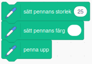

# Romba

Visst kan det ibland kännas tungt och trist att städa, men kanske det blir roligare och enklare med en robotdammsugare som kan hjälpa till hemma? I den här uppgiften får du rita och koda din egen robotdammsugare! Det är lättare än vad du tror! 

Här kan du se ett exempelprojekt på hur ett projekt med en robotdammsugare kan se ut:

BILD SAKNAS SAMT LÄNK TILL EXEMPELPROJEKT

> **HUR KODAR JAG?** 
 
Följ denna instruktion steg för steg och koda ditt projekt i verktyget Scratch. <a href="https://scratch.mit.edu" target="_blank"> Klicka här för att öppna Scratch i en ny flik.</a> I Scratch klickar du på Skapa för att börja. Logga gärna in på Scratch så kan du även spara och dela ditt projekt. Det är gratis att skaffa ett konto.
 

Dax att börja skapa robot! Klicka på kapitel 1 här under för att bläddra dig vidare.

## 1: Rita din robot och rummet
Börja med att ta bort katt-sprajten och klicka sedan på skapa ny sprajt och börja rita din alldeles egen robotdammsugare. Den kan se ut precis så som du vill att den ska se ut! Kanske såhär:

 

Roboten behöver en golvyta att dammsuga okså. Använd fantasin för hur ditt rum eller längenhets form ska se ut, det är endast väggarna du ska rita upp, sett från ovan. Endast väggar ska finnas med i din bild och det är viktigt att alla väggar har exakt samma färg och att inget annat i bakgrunden är målat med samma färg som väggarna! 
Gör såhär:

1.  Klicka på fliken **Bakgrunder** högst upp till vänster för att få fram ritverktyget. 

2. Välj **Pensel** som verktyg. Välj sen den färg du vill ha på väggarna. Måla upp väggarnas form som om rummet eller lägenheten var sedd ovanifrån.

3. Byt verktyg till **Fyll färg**, alltså den som ser ut som en liten **hink** med målarvärg. Välj vilken färg du vill ha på rummets golvyta och fyll golvfärgen genom att klicka på ytan innanför väggarna. 

Här är ett exempel på hur rummet eller lägenheten skulle kunna se ut: 

En dammsugare är ju inte så användbar om det inte finns smuts och damm att städa upp, så nu ska du få måla dit det i rummen. 

4. Välj verktyget **Pensel** och välj sen **en ny färg** att rita allt smuts med. 

5. Måla ut smuts eller damm lite här och var i rummen. Gör ganska mycket, som om det inte har städats på riktigt länge! Det är viktigt att allt smuts har en och samma färg.

Sådär! Nu har vi en riktigt smutsig lägenhet och en robot som vi nu kan programmera att städa upp efter oss! 

## 2: Få roboten att röra sig

Nu ska vi börja koda roboten så att den vet hur den ska röra sig. Det första som vi vill göra är att få städroboten att röra sig framåt. 

1. Klicka på temat **RÖRELSE** och dra ut kodblocket **Gå 10 steg**. Ändra siffran i blocket så det istället står **Gå 5 steg**. 

2. Vi vill att roboten ska gå framåt hela tiden utan att sluta gå. Under tema **KONTROLL** finns kodblocket **För alltid**. Dra ut den på skriptytan och stoppa in blå blocket **Gå 5 steg** inuti. Nu loopas koden för Gå 5 steg för alltid, om och om igen. 

3. Ser du den gröna flaggan ovanför scenen med din robot på? Det är ditt projekts startknapp, för att sätta igång roboten. För att den ska funka, och roboten ska veta när den ska börja gå, behöver vi lägga in det i koden. Under **HÄNDELSER** finns kodblocket **När GRÖN FLAGGA klickas på**. Dra in den på skriptytan och lägg den överst, så den har resten av koden direkt under sig. 

> Testa koden! Klicka på den gröna flaggan ovanför scenen - rör sig roboten framåt? 

Nu rör sig roboten, men den känner inte av väggarna. Dags att koda vidare!

## 3: Känna av väggarna
Först kodar vi så att roboten känner av väggarna när den rör vid väggens färg. Då ska den vända lite och åka åt andra hållet. 

1. Välj tema **KONTROLL** och dra in kodblocket **Om...Då**. Lägg det någonstans fritt på robotens skriptyta. 

2. Välj tema **KÄNNA AV** och välj blocket **Rör vid färgen**. Dra in detta kodblock och lägg det inuti blocket **Om...Då**, så det ser ut som bilden nedan.

Nu står det i koden "Om - rör vid färgen - Då". Dax att hjälpa roboten förstå vilken färg väggen har samt vad som då ska hända när den rör vid väggfärgen. Gör såhär: 

3. Klicka på den färgpunkt som just nu finns i ditt **Känn av färgen**-block. Då kommer en palett med färger fram. Klicka på det lilla pippettverktyget längst ned under färgerna och klicka sedan på en av väggarna på scenen, så väljs exakt samma färg till ditt **Känn av färgen**-block. Nu kan snart koden - och roboten - känna av just din väggfärg.

BILD SAKNAS?

Färgen är rätt, men roboten vet inte ännu vad den ska göra om den träffar på en vägg! Vi vill att roboten ska vända lite åt sidan och åka vidare, bort från väggen. Vi måste ge roboten mer instruktioner med kod. Gör såhär:

4. Välj tema **RÖRELSE** och välj blocket **Sväng vänster 15 grader**. Klicka på siffran 15 och ändra till 36 grader.

5. Dra sen in blocket du redan har på skriptytan med **Gå 5 steg** inom Om...Då...Annars-blocket under Annars-delen, så att det ser ut såhär: 

Nu har vi en robotdammsugare som rör sig runt i rummet vi ritat och vänder om den stöter in i en vägg, men ingen smuts dammsugas upp! Vi behöver koda lite till.

## Dammsugarroboten får en penna

För den här delen behöver vi lägga till en grupp specialblock. Nere i vänstra hörnet hittar vi en knapp som ser ut såhär:

Klickar vi på den kommer vi till en sida där vi kan lägga till massor med olika tillägg. Klicka på tillägget Penna, så läggs den till i ditt Scratchprojekt. 

Sådär! Nu kan vi hitta nya penn-block längst ner under våra vanliga block. Dax att koda mer!

Det första vi måste göra är att göra pennan till den storlek som vi vill ha. Koden som styr pennans storlek lägger vi in före För alltid-blocket. Beroende på hur stor eller liten din robot är så kommer du kanske behöva skriva in en annan siffra här. I exemplet här använder vi storleken 30. Det viktigaste är att pennans storlek är mindre än vad din robotdamsugare är! Prova dig fram, du kan alltid ändra om.

> Notera: Det är viktigt att färgen på pennan är av samma färg som golvet i rummet du ritat. Då "målar" pennan över smutsen med golvfärgen medan roboten åker runt. 

Sätt färgen på pennan genom att dra ut ett "Sätt färg till"-block. Klicka på blockets färg och välj pippetten i rutan som kommer upp och välj sen golvfärgen på scenen, på samma sätt som när du valde färgen för väggen! Nu får blocket den rätta golvfärgen.

BILD PÅ FÄRGPIPETTEN OCH BLOCKET MAN KLICKADE PÅ FÖR ATT UNDERLÄTTA? 

Eftersom vi inte vill dammsuga något innan roboten är ovan smuts, så väljer vi tema PENNA och drar in blocket "Penna upp". Lägg in det i robotens "Om...Då"-block precis ovanför "Rör dig framåt".

Sådär! Nu är vi redo att koda själva städandet av smutsen!

## Dammrugarroboten städar

Nu ska vi koda så att roboten känner av smutsen och dess färg. Gör såhär:

1. Inuti vår För alltid-loop lägger vi nu till ytterligare ett Om...Då-block precis inunder vårt Penna upp-block i skriptet. 

2. Från tema KÄNNA AV drar vi sedan in ett Känn av färgen-block. Klicka på färgen i blocket och pippettverktyget, sedan på smutsfärg på scenen. Då får Känna av-blovket smutsens färg och roboten kan känna av smutsen. 

3. Från tema PENNA drar vi in ett Penna ner-block, och lägger det inuti Om...Då-blocket direkt under Känna av-blocket med smutsens färg.

Skriptet borde nu se ut såhär:

Sätt ihop den här biten kod med resten av kodbitarna på skriptytan för att få ett större skript som ser ut såhär:

Vi kan nu testa skriptet och se hur roboten dammsugar upp smutsen vi ritat ut!

> Testa koden! Försvinner smutsen när dammsugarroboten åkt över det? Får golvet sin rätta färg igen bakom roboten? 

## Fortsättning (Fler alternativ i framtiden)
Kanske finns det något i hemmet som roboten behöver undvika? Kanske finns det något husdjur eller möbel som roboten måste stanna för att inte köra på?

### Koda ett litet husdjur 
Börja med rita en ny sprajt som blir ditt husdjur eller välj en färdig sprajt som du tycker skulle vara rolig att ha som ett husdjur!

> Notera: Om du ritar en egen figur, var noga med att det inte har samma färg som dina väggar, golv eller smuts. 

Vi kodar husdjuret på samma sätt som vi kodade dammsugaren. Börja med att lägga till ett Rör dig framåt-block och ändra variabeln i det  till 5 steg. Vi vill också att husdjuret ska gå framåt hela tiden, så vi lägger Rör dig framåt-blocket inuti ett För alltid-block - alltså en loop.  

För att husdjuret ska vändra då det rör vid en vägg, behöver det känna av väggarnas färg. Lägg till blocket Om ... Då som finns under KONTROLL. Välj sen tema KÄNNA AV och välj blocket "Rör vid färgen", dra in detta inuti "Om...DÅ" blocket.

Klicka på den färg som finns i Känn av färg-blocket och använd pippettverktyget för att välja exakt samma färg som väggarna genom att klicka på en av väggarna på scenen.

Nu känner husdjuret av om den åker in i en vägg! För att husdjuret ska vända åt andra hållet, väljer du temat RÖRELSE och drar ut blocket för Sväng vänster 15 grader. Klicka på variabeln 15 och ändra till 36 grader istället.

Lägg nu in Rör dig framåt-blocket du har på skriptytan, så den hamnar inom dit Om...Då-blok direkt under Annars. Då ska skriptet se ut  såhär: 

Nu har vi ett husdjur som rör sig runt i rummet!

> Tips! Vill du att ditt husdjur ska röra sig lite olika, kan du prova med att lägga in att den förslagsvis ska vänta några sekunder ibland på olika ställen, eller att den ska röra sig annorlunda om den kommer nära robotdammsugaren. Kanske den ska ha röst eller  ljud - eller pratbubbla med text som säger någonting? Kanske du kommer på egna andra idéer?

## Få dammsugaren att undvika husdjuret
För att dammsugarroboten inte ska åka in i husdjuret - eller kanske i olika möbler eller människofigurer - kan du koda så att den stannar om den möter på något. För att roboten ska akta sig för att åka in i husdjuret gör du såhär:

Se till att dammsugarrobot-sprajten är vald, så att du kan koda vidare på robotens skriptyta. Välj KONTROLL och dra in ett till Om...Då-block och placera det direkt ovanför det Om...Då-block i skriptet som känner av färgen på väggarna. I det nya Om...Då-blocket lägger vi till ett Sväng vänster 15 grader-block. Klicka på variabeln 15 och ändra det till 36 grader. (Du kan givetvis valfritt välja mellan ett sväng vänster eller sväng höger-block)

För att få dammsugaren att vända riktning när den stöter på husdjurs-sprajten tar vi under KÄNNA AV ett Rör vid-block och väljer vår husdjurs-sprajt i listan under den lilla pilen i blocket. Detta Rör vid-block placerar vi sen inuti det nya Om...Då-blocket. 

Sådär! Nu undviker Robotdammsugaren även ditt husdjur som springer runt i lägenheten!

> Tips! Du kan givetvis göra på samma sätt för att undvika exempelvis en möbel eller annat i din lägenhet. Det är bra om alla saker som roboten ska undvika har en egen speciell färg, annars kan inte roboten veta vad den rör vid. Men det går såklart bra att allt har samma färg som exempelvis väggarna, så undviker roboten alltid just den färgen.

### Saker att arbeta vidare på
Kan du göra så att roboten kan känna av och skilja på flera olika saker? Kanske finns det en viss typ av smuts som den inte ska damsuga upp utan istället hälla vatten på? 

Går det att få roboten att röra sig på annat sätt?

Ska roboten och husdjuret ha ljud, kanske robot-ljud, varningssignaler eller husdjur som jamar eller skäller? Kanske pratbubblor med text?

Bygg en tidsräknare som räknar städtiden, eller en poängräknare som ger roboten minuspoäng om den dammsugar upp exempelvis strumpor eller kattgodis som katten letar efter. Kanske du kommer på fler egna idéer?
