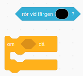
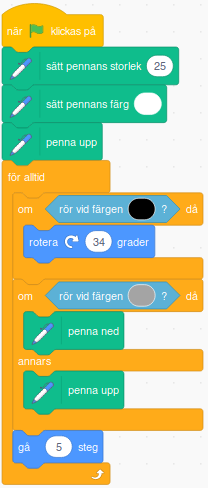
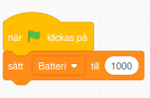
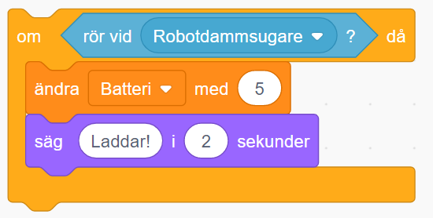
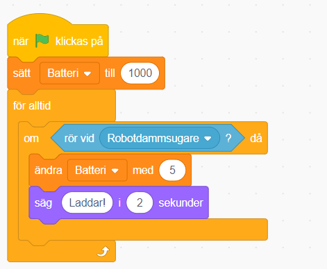

Visst kan det ibland kännas tungt och trist att städa, men kanske det blir roligare och enklare med en robotdammsugare som kan hjälpa till hemma? I den här uppgiften får du rita och koda din egen robotdammsugare! Det är lättare än vad du tror! 

Klicka på bilden nedan för att se ett exempelprojekt i Scratch på hur ett projekt med en robotdammsugare kan tänkas se ut 

> **HUR KODAR JAG?** 
Följ denna instruktion steg för steg och koda ditt projekt i verktyget Scratch. <a href="https://scratch.mit.edu" target="_blank"> Klicka här för att öppna Scratch i en ny flik.</a> I Scratch klickar du på Skapa för att börja. Logga gärna in på Scratch så kan du spara och om du vill även sen dela ditt projekt. Det är gratis att skaffa ett konto på Scratch.
 

Dax att börja skapa en städrobot! Klicka på kapitel 1 här under för att bläddra dig vidare.

## 1: Rita din robot och rummet
Börja med att ta bort katt-sprajten och klicka sedan på skapa ny sprajt och börja rita din alldeles egen robotdammsugare. Den kan se ut precis så som du vill att den ska se ut! Kanske såhär:

 

Roboten behöver en golvyta att dammsuga okså. Använd fantasin för hur ditt rum eller längenhets form ska se ut, det är endast väggarna du ska rita upp, sett från ovan. Endast väggar ska finnas med i din bild och det är viktigt att alla väggar har exakt samma färg och att inget annat i bakgrunden är målat med samma färg som väggarna! 
Gör såhär:

1.  Klicka på fliken **Bakgrunder** högst upp till vänster för att få fram ritverktyget. 

2. Välj **Pensel** som verktyg. Välj sen den färg du vill ha på väggarna. Måla upp väggarnas form som om rummet eller lägenheten var sedd ovanifrån.

3. Byt verktyg till **Fyll färg**, alltså den som ser ut som en liten **hink** med målarvärg. Välj vilken färg du vill ha på rummets golvyta och fyll golvfärgen genom att klicka på ytan innanför väggarna. 

Här är ett exempel på hur rummet eller lägenheten skulle kunna se ut: 

En dammsugare är ju inte så användbar om det inte finns smuts och damm att städa upp, så nu ska du få måla dit det i rummen. 

4. Välj verktyget **Pensel** och välj sen **en ny färg** att rita allt smuts med. 

5. Måla ut smuts eller damm lite här och var i rummen. Gör ganska mycket, som om det inte har städats på riktigt länge! Det är viktigt att allt smuts har en och samma färg.

Sådär! Nu har vi en riktigt smutsig lägenhet och en robot som vi nu kan programmera att städa upp efter oss! 

## 2: Få roboten att röra sig

Nu ska vi börja koda roboten så att den vet hur den ska röra sig. Det första som vi vill göra är att få städroboten att röra sig framåt. 

1. Klicka på temat **RÖRELSE** och dra ut kodblocket **Gå 10 steg**. Ändra siffran i blocket så det istället står **Gå 5 steg**. 

2. Vi vill att roboten ska gå framåt hela tiden utan att sluta gå. Under tema **KONTROLL** finns kodblocket **För alltid**. Dra ut den på skriptytan och stoppa in blå blocket **Gå 5 steg** inuti. Nu loopas koden för Gå 5 steg för alltid, om och om igen. 

3. Ser du den gröna flaggan ovanför scenen med din robot på? Det är ditt projekts startknapp, för att sätta igång roboten. För att den ska funka, och roboten ska veta när den ska börja gå, behöver vi lägga in det i koden. Under **HÄNDELSER** finns kodblocket **När GRÖN FLAGGA klickas på**. Dra in den på skriptytan och lägg den överst, så den har resten av koden direkt under sig. 

> Testa koden! Klicka på den gröna flaggan ovanför scenen - rör sig roboten framåt? 

Nu rör sig roboten, men den känner inte av väggarna. Dags att koda vidare!

## 3: Känna av väggarna
Först kodar vi så att roboten känner av väggarna när den rör vid väggens färg. Då ska den vända lite och åka åt andra hållet. 

1. Välj tema **KONTROLL** och dra in kodblocket **Om...Då**. Lägg det någonstans fritt på robotens skriptyta. 

2. Välj tema **KÄNNA AV** och välj blocket **Rör vid färgen?**. Dra in detta kodblock och lägg det inuti blocket **Om...Då**.

Nu står det i koden **Om - Rör vid färgen? - Då**. Dax att hjälpa roboten förstå vilken färg väggen har samt vad som då ska hända när den rör vid väggfärgen. Gör såhär: 

3. Klicka på den färgpunkt som just nu finns i ditt **Rör vid färgen?**-block. Då kommer en palett med färger fram. Klicka på det lilla pippettverktyget längst ned under färgerna och klicka sedan på en av väggarna på scenen, så väljs exakt samma färg till ditt **Rör vid färgen?**-block. Nu kan snart koden - och roboten - känna av just din väggfärg.

BILD SAKNAS?

Färgen är rätt, men roboten vet inte ännu vad den ska göra om den träffar på en vägg! Vi vill att roboten ska vända lite åt sidan och åka vidare, bort från väggen. Vi måste ge roboten mer instruktioner med kod. Gör såhär:

4. Välj tema **RÖRELSE** och välj blocket **Rotera vänster 15 grader**. Klicka på siffran 15 och ändra till 36 grader.

5. Dra sen in blocket du redan har på skriptytan med **Gå 5 steg** och lägg den direkt under **Om...Då**-blocket, men inom **För alltid**-loopen, så att det ser ut som bilden nedan: 

Nu har vi en robotdammsugare som rör sig runt i rummet vi ritat och vänder om den stöter in i en vägg, men ingen smuts dammsugas upp! 
Vi behöver koda lite till.

## 4: Lägg till nya kodblock

För den här delen behöver vi lägga till en grupp specialblock. Nere i vänstra hörnet hittar vi en knapp för **Tillägg** som ser ut såhär:

Klickar vi knappen **Tillägg** kommer vi till bilder på olika tillägg. Klicka på den som heter Penna, så läggs den till i ditt Scratchprojekt. 

Sådär! Nu kan vi hitta nya penn-block längst ner under våra vanliga block. Dax att koda mer!

## 5: Dammsugarroboten får en penna
För att dammsugarroboten ska se ut att kunna suga upp smutsen i rummet, kommer vi koppla en penn-funktion till den, som målar över smutsen med rummets golvfärg. På så vis ser smutsen ut att försvinna nör roboten åkt över det.

1. Det första vi måste göra är att ändra pennan till den storlek som vi vill ha. Under tema **PENNA** finns kodblocket **Sätt pennans storlek till 1**. Lägg i blocket direkt under start-blocket med **När START-flaggan klickas på**, ovanför **För alltid**-blocket. Ändra siffren 1 till passande storlek, i vårt exempel har vi skrivit 30. Anpassa storlek beroende på hur stor eller liten din robot är. Pennans storlek behöver vara  mindre än din robotdamsugare är! Prova dig fram.

2. Ändra färgen på pennan till golvfärgen, genom att dra ut ett **Sätt färg till**-block från tmat **PENNA**. Klicka på blockets färg och välj pippetten i rutan som kommer upp och välj sen golvfärgen på scenen, på samma sätt som när du valde färgen för väggen! Nu får blocket den rätta golvfärgen.

BILD PÅ FÄRGPIPETTEN OCH BLOCKET MAN KLICKADE SKA IN HÄR.

> Notera: Det är viktigt att färgen på pennan är av samma färg som golvet i rummet du ritat. Då "målar" pennan över smutsen med golvfärgen medan roboten åker runt. 

3. Eftersom vi endast vill dammsuga om roboten rör vid smuts (och inte annars), lyfter vi upp pennan från golvet först, så den inte kan måla golvfärg hela tiden. Välj tema **PENNA** och drar in blocket **Penna upp**. Lägg in det i robotens **Om...Då**-block precis ovanför **Gå 5 steg**. Nu kommer pennan hållas uppe ovan golvet och inte rita golvfärg.

Sådär! Nu är vi redo att koda själva städandet av smutsen!

## 6: Dammrugarroboten städar

Nu ska vi koda så att roboten känner av smutsen - eller snarare dess färg. Gör såhär:

1. Inuti vår **För alltid**-loop på skriptytan flr roboten lägger vi nu till ytterligare ett **Om...Då**-block, precis inunder vårt **Penna upp**-block i skriptet. 

2. Från tema **KÄNNA AV** drar vi sedan in ett **Känn av färgen**-block. Klicka på färgen i blocket och pippettverktyget, sedan på smutsfärgen i rummet på scenen. Då får **Känna av**-blocket smutsens färg och roboten kan "känna av smutsen". 

3. Från tema **PENNA** drar vi in ett **Penna ner**-block, och lägger det inuti **Om...Då**-blocket.

Skriptet bör nu se ut såhär:

Sätt ihop den här biten kod med resten av kodbitarna på skriptytan för att få ett större skript som ser ut såhär:

Vi kan nu testa skriptet och se hur roboten dammsugar upp smutsen vi ritat ut!

> Testa koden! Försvinner smutsen när dammsugarroboten åkt över det? Får golvet sin rätta färg igen bakom roboten? 

## Färdig!
Grattis, nu har du skapat din egen robotdammsugare! Det färdiga skriptet i sin helhet borde se ut ungefär så här - om du följt instruktionerna:

**Glöm inte att spara ditt projekt - och att döpa det!** Döp det gärna till uppgiftens namn Robotdammsugaren - eller hitta på ett eget namn, så att du enkelt kan hitta det igen. Du skriver in namn på spelet högt upp ovanför projektet, där det nu står "Scratchprojekt". Spara sedan, men du måste vara inloggad för att kunna spara.

> **Testa ditt projekt**  
Visa gärna någon ditt spel och låt dem testa. Om du vill, tryck på knappen DELA som du finner överst så kan andra också hitta spelet på Scratch sajt och testa det.

> **Viktigt om du delar ditt projekt:** Tänk på att delade projekt kan ses, testas och remixas (omskapas) av alla som vill på Scratch sajt. Det är viktigt när du sparar och delar att projektet inte innhåller information, bilder eller ljud du inte vill sprida till andra.

## Utmaning (Fler alternativ i framtiden)
Saknas något? Hur skulle du vilja utveckla projektet? 
Kanske finns det något i rummet som roboten behöver undvika? Kanske finns det något husdjur eller möbel som roboten måste stanna för att inte köra på? 

Här nedan följer några exempel på vad du kan koda in i projektet. Vi börjar med ett kodat husdjur som roboten ska akta att inte köra på.

### Koda ett litet husdjur 
Börja med rita en ny sprajt som blir ditt husdjur eller välj en färdig sprajt som du tycker skulle vara rolig att ha som ett husdjur!

> Notera: Om du ritar en egen figur, var noga med att det inte har samma färg som dina väggar, golv eller smuts. 

Vi kodar husdjuret på samma sätt som vi kodade dammsugaren. 

1. Börja med att lägga till ett **Gå 10 steg**-block från **RÖRELSE** och ändra variabeln i det till 5 steg. 

2. Vi vill också att husdjuret ska gå framåt hela tiden, så vi lägger röresleblocket inuti ett **För alltid**-block - alltså en loop.

3. Lägg till ett startblock från tema **HÄNDELSER**, alltså blocket **När START-flaggan klickas på** och sätt den överst i skriptet.

4. För att husdjuret ska vändra då det rör vid en vägg, behöver det känna av väggarnas färg. Lägg till blocket **Om...Då** som finns under tema **KONTROLL**. Välj sen tema **KÄNNA AV** och välj blocket **Rör vid färgen?**. Dra in detta block inuti **Om...Då**-blocket.

5. Klicka på den färg som finns i **Rör vid färgen?**-blocket och använd pippettverktyget för att välja exakt samma färg som väggarna genom att klicka på en av väggarna på scenen.

6. Nu känner husdjuret av om den åker in i en vägg! För att husdjuret ska vända åt andra hållet, väljer du temat **RÖRELSE**och drar ut blocket för **Rotera vänster 15 grader**. Klicka på variabeln 15 och ändra till 36 grader istället.

Lägg nu in röresle-blocket du har på skriptytan, så den hamnar **Fär alltid**-loopen, direkt under **Om...Då**-blocket. Då ska skriptet se ut såhär: 

Nu har vi ett husdjur som rör sig runt i rummet!

> Tips! Vill du att ditt husdjur ska röra sig lite olika genom rummet, kan du prova med att lägga in att den förslagsvis ska vänta några sekunder ibland på olika ställen, eller att den ska röra sig annorlunda om den kommer nära robotdammsugaren. Kanske den ska ha röst eller  ljud - eller pratbubbla med text som säger någonting? Kanske du kommer på egna andra idéer?

### Få dammsugaren att undvika husdjuret
För att dammsugarroboten inte ska åka in i husdjuret - eller kanske i olika möbler eller människofigurer - kan du koda så att den stannar om den möter på något. För att roboten ska akta sig för att åka in i husdjuret gör du såhär:

1. Se till att dammsugarrobot-sprajten är vald, så att du kan koda vidare på robotens skriptyta. 

2. Välj tema **KONTROLL** och dra in ett till **Om...Då**-block. Placera det direkt ovanför det **Om...Då**-block du redan har i skriptet som känner av färgen på väggarna. 

3. I det nya **Om...Då**-blocket lägger vi till ett **Rotera vänster 15 grader**-block. Klicka på variabeln 15 och ändra det till 36 grader. (Du kan givetvis valfritt välja mellan ett vänd vänster eller vänd höger-block)

4. För att få dammsugaren att vända riktning när den stöter på husdjurs-sprajten tar vi under **KÄNNA AV** ett **Rör vid muspekare?**-block. Klicka sedan på lilla pilen på **Rör vid muspekare?**-blocket och välj vårt husdjurs-sprajt i listan, så muspekare nyts ut mot din husdjurssprajts namn. Detta **Rör vid...?**-block sätter vi sen in inuti det nya **Om...Då**-blocket. 

Sådär! Nu undviker Robotdammsugaren även ditt husdjur som springer runt i lägenheten!

> Tips! Du kan givetvis göra på samma sätt för att undvika exempelvis en möbel eller annat i din lägenhet. Det är bra om alla saker som roboten ska undvika har en egen speciell färg, annars kan inte roboten veta vad den rör vid. Men det går såklart bra att allt har samma färg som exempelvis väggarna, så undviker roboten alltid just den färgen.

### Koda ett batteri och en laddningstation till dammsugaren!
1. Börja med att rita eller välja en sprajt som ska vara platsen där robotdammsugaren kan ladda sitt batteri. 

2. Skapa därefter en ny **Variabel** och döp den till **Batteri**. 

> En variabel kan ses som en låda i vilken vi lägger en liten kom-ihåg lapp med någon form av information. I det här fallet är informationen hur mycket batteri som dammsugaren har kvar att använda innan den behöver laddas - som en batterimätare.

3. När vi startar skriptet vill vi att batteriets variabel ska vara **1000**, så därför lägger vi till ett variabel-block som kan ändra variabelns värde. Var noga med att ändra så att det i blocket står **sätt "Batteri" till 1000**, så det ser ut såhär:

4. Nu kan vi börja koda batteriets möjlighet till laddning och urladdning. Börja med att sätta ett **för alltid**-block (en loop) direkt inunder **sätt batteri**-blocket. Inuti loopen kommer vi sätta in två stycken **om...då**-block. Ett som sköter batteriets laddande, och ett annat som sköter batteriets urladdning. 

5. Nu kodar vi först delen för batteriets laddning. Ta ett **känna av**-block och välj sprajten för vår dammsugare. Inuti blocket sätter vi därefter ett variabelblock som heter **ändra batteri med** och ändrar variabeln till **5**. För att det ska synas vad som händer kan vi lägga till ett **säg**-block från tema UTSEENDE som säger "Laddar batteri!" När du är klar ser skriptet ut såhär:

 
Vi stoppar in skriptet ovan i vårt **för alltid**-block och så det ser ut såhär:

Nu går det att ladda roboten!
För att göra det realistiskt behöver vi också skriva lite kod så att robotens bateri laddas ut medan den städar. 

6. Vi tar ett **om...då...annars**-block och sätter in ett **operator**-block och gör jämförelsen **om värdet av "Batteri" är större än 0**. Koden ser då ut såhär:

7. Innanför **om...då**-delen av blocket sätter vi ett **ändra "Batteri" med 1**-block och skriver in **-1** som variabel. Längre ned i blockets **...annars**-del sätter vi in ett **Säg**-block från tema UTSEENDE, och skriv in "Åh nej! Batteriet tog slut!". 
När du är klar borde skriptet se ut såhär:

Sätt nu även detta skript innuti **för alltid**-blocket, så att skriptet för batteriets kod ser ut såhär:

Nu Har vi kodat batteriets laddning och urladdning. Då återstår bara att göra så att robotdammsugaren stannar helt och inte kan röra sig framåt om den råkar få slut på sitt batteri. Gör såhär:

8. Välj din dammsugarsprajt och skapa ett nytt om block. I det lägger vi in en jämförelse som kollar om batteriet är större än noll.

Nu ska vi bara lägga in detta block innanför **för alltid**-blocket, och dra med även all den kod som tidigare låg innanför **för alltid**-blocket i det nya om blocket. När du är klar bör det se ut såhär:

Sådär! Nu använder din robotdammsugare ett batteri!

### Saker att arbeta vidare på
1. Kan du göra så att roboten kan känna av och skilja på flera olika saker? Kanske finns det en viss typ av smuts som den inte ska damsuga upp utan istället hälla vatten på? 

2. Går det att få roboten att röra sig på annat sätt?

3. Ska roboten och husdjuret ha ljud, kanske robot-ljud, varningssignaler eller husdjur som jamar eller skäller? Kanske pratbubblor med text?

4. Bygg en tidsräknare som räknar städtiden, eller en poängräknare som ger roboten minuspoäng om den dammsugar upp exempelvis strumpor eller kattgodis som katten letar efter. Kanske du kommer på fler egna idéer?
