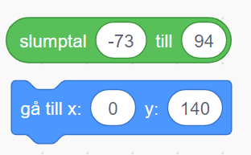

# Sopsorterare 

Tycker du det är jobbigt att sortera sopor för återvinning? Varför inte programmera en robot att hjälpa till! I den här uppgiften kommer vi koda ett spel där du eller en kompis får styra en sorteringsrobot som automatiskt skickar soporna till rätt ställe!

## 1: Välj en robot och koda styrning

Vi ska skapa en robot som sorterar sopor. En robot kan ju se ut precis som du vill, det kan vara en robotskalbagge eller en robotanka. I vår exempel har vi valt en sprajt som ser ut som en robotfigur. 

1. Ta först bort kattsprajten från projektet genom att klicka på den lilla soptunnan på den lilla katt-figuren under scenen. Klicka sen på **Välj ny sprajt** under scenen och välj en sprajt som du vill ha som din robot. I vårt exempel har vi roboten på bilden nedan, men du kan välja vilken sprajt du vill.  

2. Nu ska vi koda så att roboten kan styras för att fånga och sortera alla sopor som kommer falla ned mot den. Vi ska styra roboten åt höger och vänster med hjälp av datorns tangentbord med höger- och vänsterpil. 
Börja med att dra ut två stycken block från tema HÄNDELSER som heter **när [mellanslag] tangenten trycks ned**. Lägg dem bredvid varandra på robotens skriptyta. 

3. Klicka på ordet **mellanslag** i blocken och välj istället **vänsterpil** och **högerpil**, så det ser ut såhär:

4. Under dessa block lägger vi in blocket **gå 10 steg**. Ändra i skriptet för **vänsterpil**tangenten så det står **gå -10 steg**. Då kommer roboten gå åt vänster med vänsterpil-tangenten. När du är klar ska de båda blocken se ut såhär:

Sådär! Nu kan vi styra roboten! Enkelt va? Dags att lägga till lite sopor som roboten ska kunna sortera.

## 2: Soporna
Innan vi börjar koda roboten så måste vi först göra lite sopor som den kan sortera. 

1. Måla en egen ny sprajt genom att välja hålla muspekaren över knappen för **Välj ny sprajt** och klicka på lilla penseln som heter **Måla**. Döp denna nya sprajt till **Sopor**.

2. Vi ska nu skapa två olika klädslar i den nya sprajten, som vi senare kan använda som olika sopor att källsortera. I denna instruktion ska vi visa hur du kan skapa två olika sopklädslar - en glasflaska och en äppelskrutt. När du förstår principen att göra olika sop-klädslar kommer du enkelt sen kunna skapa fler sopor att slumpa mellan!

Som exempel har vi här skapat en glasflaska som ska sorteras som **glas** och en äppelskrutt som ska sorteras som **kompost** Du kan givetvis själv välja vilka olika sopor du vill ha.

3. Döp klädslarna till vad för typ av sopor det är, exempelvis **glas** för glasflaskan och **kompost** för äppelskrutten. 

4. Vi ska nu koda så att soporna ramlar ner ovanifrån ner mot roboten, så att den kan fånga och sortera soporna! Klicka på fliken som heter KOD högst upp i vänstra hörnet av Scratch, så kommer du ur ritverktyget och tillbaka till skriptytan för din sprajt. 

5.  Dra ut ett startblock **när GRÖN FLAGGA klickas på** från tema HÄNDELSER och lägg på skriptytan för sopsprajten. 

6. Från tema KÄNNA AV lägger du till blocket **sätt dragläge till "dragbar"**, fäst det under startblocket. 

Blocket för dragläget du just lade till är en liten extra grej som gör att man kan hjälpa roboten sortera rätt genom att klicka och dra soporna till rätt återvinningsställe!

Nu har vi en sprajt som är sopor som kan flyttas på skärmen. men hur ska vi koda så att de olika typerna av sopor visas? Oh hur ska soporna röra sig? Vi går vidare.

## 3: Slumpa sopklädslar som faller ned
Nu ska vi skapa meddelanden så att olika sprajtar kan "prata med varandra" och veta när och vad de ska göra. Meddelanden förenklar vårt arbete, då vi kan skapa en samling med kodblock som körs varje gång som vi skickar meddelandet så att vi inte behöver skriva samma sak flera gånger. Ungefär som att skicka iväg ett och samma sms till flera kompisar samtidigt, istället för att behöva skriva ett i taget till vardera kompis. Praktiskt va?! 

1. Nu ska du koda mer på din sop-sprajt. Dubbelkolla att du kodar på rätt sprajt, genom att klicka på den lilla bilden av din sop-sprajt som finns under scenen. Då blir sprajten aktiverad. 

2. Från tema HÄNDELSER drar du ut blocket **när jag tar emot meddelande1**. Lägg det fritt bredvid de andra kodblocken som finns på skriptytan.

3. Klicka på lilla pilen i blocket bredvid där det står **meddelande1** och välj "skapa nytt meddelande". 

4. Meddelandet som ska skickas handlar om att sopsprajten ska starta om sin kod när den tar emot meddelandet. Därför döper vi meddelandet till "omstart", så vet vi vad det handlas om. Tryck sen OK, så skapas ett nytt meddelande.

När du är klar borde det se ut såhär:

Sådär! Nu har vi skapat början på en bit kod som kommer att köras varje gång sprajten tar emot meddelandet "omstart".

5. Under detta block sätter vi från tema UTSEENDE in blocket **ändra klädsel till "glas"**. (Kanske det står något annat än just "glas", beroende på vilken klädsel du visar just nu och vad du döpt dina sop-klädslar till.) 

6. Inuti detta block lägger vi från tema OPERATORER in ett blocket **slumptal 1 till 10**. Ändra så det står **1 till 2** istället, då vi ännu bara har två olika sop-klädslar att slumpa mellan. (Om du gör fler sop-klädslar sen så ändrar du bara på sista talet till det totala antal klädslar sop-sprajten har!)

Nu har du alltså kodat att sprajten ska slumpa mellan klädslarna så att den ibland visar glasflaskan och ibland äppelskrutten. Så att det blir olika sopor för roboten att sortera. 

>**Testa koden!** Klicka på gröna startflaggan ovanför ditt projekt för att starta koden. Vilke sop-klädsel visas? Klicka på gröna startflaggan flera gånger efter varandra och se om det slumpas fram olika klädslar ibland? Om inte, dubbelkolla att det står rätt i koden, att det står **omstart** i meddelandet som skickas och det som tas emot.

Dax att skapa rörelse på soporna, så att de faller ned från slumpmässigt valda platser i ovankant. 

7. XXXXXXXXXXXXXXXX Sopsprajten ska starta högst upp i ovankant på scenen och sedan glida nedåt. Detta gör vi genom att sätta en bestämd startposition för sprajten, med hjälp av ett **gå till x och y**-block från tema RÖRELSE. Detta är alltså x och y i ett koordinatsystem. Dra ut blocket och sätt det under **ändra klädsel**-blocket. 

8. För att dina sopor ska falla från lite olika positioner i toppen, kodar vi in att det ska slumpas fram exakt var sopan faller ned från. Från tema OPERATORER drar du in blocket **slumptal 1 till 10** och lägger in det i det blå blocket efter **x:**. (se bilden nedan).

9. Ändra slumptalet **1 till 10** så det står förslagsvis **-73 till 94**. 

10. **y-postionen** ändrar du till **140**. Du kan anpassa koordinaterna x och y för att passa till just din sopsorterarrobot, testa dig fram.

11. Under detta block sätter vi från tema RÖRSELSE in blocket **glid 1 sek till x:... y:...**. Sätt fast det direkt under det förra röresleblocket med **gå till x:... och y:...**. Ändra till **2 sek** och sätt från tema OPERATORER in blocket **slumptal 1 till 10** i vita bubblan efter **X:...** och skriv där **-73 och 94**. Ändra även **y**-positionen **-130**. 

Tillsammans borde all kod nu se ut såhär:

12. Men vi måste såklart lägga till kod för när meddelandet "omstart" ska skickas också! Från tema HÄNDELSER drar du ut blocket **skicka meddelande1 och vänta** och fäster det längst ned i sopsprajtens andra kodskript som börjar med blocket **när GRÖN FLAGGA klickas på**. Ändra även i blocket så att det står **skicka "omstart" och vänta**, om det inte redan står det. Såhär ska det se ut när det är klart:

>**Testa koden!** Klicka på gröna startflaggan ovanför ditt projekt för att starta koden. Vad händer med soporna? Starta om flera gånger och se vad som händer.

Nu har vi en robot som kan styras och sopor som kan röra sig och bytas mellan olika sopklädslar. Vi går vidare!

## 4: missa sopan???

Vi går nu tillbaka till vårt **när jag tar emot omstart** block. Nu ska vi här placera ut ett **för alltid**-block från tema KONTROLL och inuti blocket ska vi sätta blocket **om...då** från tema KONTROLL. Inuti detta villkorsblock sätter vi block från tema RÖRELSE som kontrollerar om **y positionen är mindre än -129** (Detta eftersom vi tidigare valde att glida till -130). Slutligen sätter vi ett **skicka omstart**-block innuti detta. 

Alltihop tillsammans borde se ut såhär:

## 5: Sopkärl 
Vi måste ju också ha någonting som soporna kan sorteras in i. Nu får du skapa två nya sprajter, rita olika återvinningskärl eller välj någon sprajt som du gillar från Scratch sprajtbibliotek med färdiga sprajter. 

I vårt exempel har vi ritat ett sopkärl som enkla små lådor som ser ut såhär:

Vi ska nu koda sopkärlen så att de bara tar emot just den typ av sopor som vi vill ska hamna just där, exempelvis glasflaskor ska in i glasåtervinningen och äppelskruttar ska in i komposten. 

1. Vi börjar med att dra ut ett start block **när GRÖN FLAGGA klickas på** från tema HÄNDELSER och lägger in blocket på en av sopkärlens skriptyta. 

2. Under detta block placerar vi ett **för alltid** -block från tema KONTROLL. 

3. Under detta sätter vi ett **om...då**-block från tema KONTROLL. 

4. Inuti **om...då**-blocket sätter vi in ett **rör vid muspekare**-block från tema KÄNNA AV. Klicka på ordet **muspekare** i blocket och välj istället din skräpsprajt. I vårt exempel står det nu **rör vid sopor**, alltså vår sprajt som heter sopor.

5. I sprajten  **sopor** finns våra två olika klädslar, en glasflaska och en äppelskrutt. För att rätt typ av sopor ska hamna i rätt sopkärl behöver vi koda så att sopkärlet känner av vilken klädsel som visas på sopsprajten. Vi sätter därför in ytterligare ett **om...då**-block från tema KONTROLL. Lägg det inuti ditt första **om...då**-block i skriptet.

6. I det kantiga hålet mellan **om...då** i blocket sätter vi in ett = jämförelseblock från tema OPERATORER, så det ser ut såhär. 

7. Från tema KÄNNA AV drar vi in blocket **bakgrundsnummer av scen**. Lägg in det i den första tomma vita ringen i det gröna operatorblocket, så det ser ut som i bilden nedanför. 

8. Nu ska vi ändra i det blå blocket du just lade in, så att sopkärls-sprajten kan känna av om det är rätt sopor den tar meot. Klicka på ordet **scen** i det blå blocket och byt till sprajten **sopor**. Ordet **bakgrundsnummer** ändrades nu automatiskt till **x position**. Klicka på ordet **x position** och välj istället **klädselnamn**. I den andra vita ringen där det står siffran **50** skriver du istället namnet på klädseln för den typ av sopor kärlet ska ta emot, exempelvis **glas**. När du är klar ska koden se ut såhär:

>**Tänk på!** Det är viktigt att vi skriver namnet på soptypen på exakt samma sätt som den heter i sprajtens klädselnamn, alltså kola  noga om du har stor eller liten bokstav i namnet och inga felstavningar. Sopsorterarroboten du ska skapa är väldigt smart, men den gör bara exakt som du säger åt den att göra. Om vi skriver till exempel "Glas" med stor bokstav, men soporna heter "glas" med liten bokstav kommer roboten jämföra dessa två namn och inte hitta glas-soporna. Roboten kommer då inte veta vad den ska göra och välja att göra ingenting.

9. Slutligen sätter vi in ett **skicka omstart**-block inuti vårt sista**om...då**-block. 

Nu är koden färdig och borde det se ut såhär:

>**Testa koden!** Nu har vi ett sopkärl som är redo att ta emot en typ av sopor och som kommer känna av om vi försöker stoppa i rätt typ av sopor i det! Testa att starta och dra sopsprajten **glas** till det sopkärl du just kodat. Vad händer? Börjar programmet om med nya sopor som faller från toppen? Om du gör det flera gåpnger, växlar utseendet av soporna ibland till den andra typen då (alltså äppelskrutten)? 
 
10. På samma sätt som vi precis kodat det gförsta sopkärlet, ska vi nu koda det andra sopkärlet också. Antingen kan du kopiera din sprajt och byta färg eller kanske rita någonting helt annat. För att göra flera sopkärl följer du helt enkelt stegen vi precis gjort men ändrar så att istället för klädseln **glas** så kollar detta andra sopkärlet efter klädseln **kompost** (som kan ta emot äppelskrutten). Byt bara namnet i Känna-av-blocket. 

**Utveckla koden om du vill!**
Vill du att sopsorterarroboten ska säga något om du lägger fel sopor i de olika sopkärlen? Då kan du byta ut det sista **om...då**-blocket du lade in i dina olika sopkärl mot ett **om...då...annars**-block istället. Inom **annars**-biten lägger vi in ett **säg Hej! i 2 sekunder**-block från tema UTSEENDE. Klicka på ordet Hej! och skriv istället exempelvis "Oj, nu blev det fel!". Gör lika dant på båda sopkärlen, se exempel på hur koden kan se ut i bilden nedan. Testa koden och prova att lägga fel sopor i de olika kärlen. Vad händer?

## 6: Fånga sopor
Vi måste också programera roboten så den tar hand om soporna som faller ner på rätt sätt så att allt tas om hand och kan bli till nya saker. 

För att göra detta måste roboten känna igen vad för typ av sopor det är som den stöter på. Vi kommer att koda detta på ett sätt som påminner mycket om det vi kodade till sopkärlen.

Vi börjar med att lägga till en [för alltid loop] under [startblocket] med den gröna flaggan. 

Sen kan vi börja med om skräptypen är glas. Vi skapar fört ett jämförelseblock som vi därefter kan sätta in i ett om-block. På den ena sidan sätter vi som tidigare klädselnamn av Sopsprajten och på andra sidan skriver vi glas. 

Vi upprepar samma steg för andra soptyper vi skapat och när du är klar borde det se ut något sådanthär: 

Kom igåg att det är viktigt att det står exakt så som du skrev namnet på din klädsel på andra sidan!

För vår andra soptyp kan vi kopiera blocken vi skapade i föregående steg men glöm inte att byta namn på din soptyp! 

När du är klar ser det nog ut något sådant här:

## 7: Sortera!
Det är ju lite tråkigt att dra soporna till rätt sopkärl så istället ska vi programmera roboten att den gör detta åt oss. Nu ska vi i varje litet om-block vi skapat för de olika soptyperna använda oss av meddelanden för att få sakerna att hamna rätt. I blocket för glas ska vi skicka meddelandet **glas**. 

Gör du fler soptyper är det bara att upprepa dessa steg nedan. Skapar du exempelvis ett batteri ska du istället kolla efter klädselnamnet **batteri** och skicka den soptypen i ditt meddelande. 

Vi går nu tillbaka till vår sopsprajt. Det sista vi behöver göra är att få soporna att glida till rätt sopkärl. Detta gör vi helt enkelt genom att dra ut när jag tar emot meddelande block och sätter dessa till våra olika soptypsmedelanden. 

Under de två blocken sätter vi ett glid till block och sätter det till 1 sekund och på den ena skriver positionen för komposten och för den andra positionen för glasåtervinningen. 

Sådär! Om inget har blivit tokigt har du nu en robot som sorterar sopor! 

