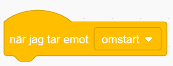
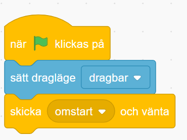
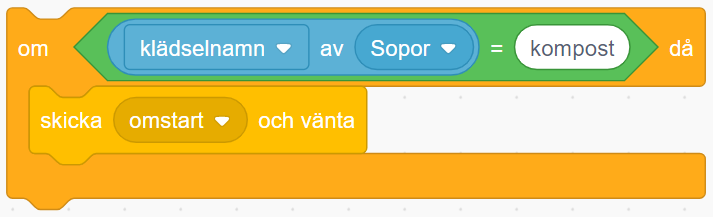
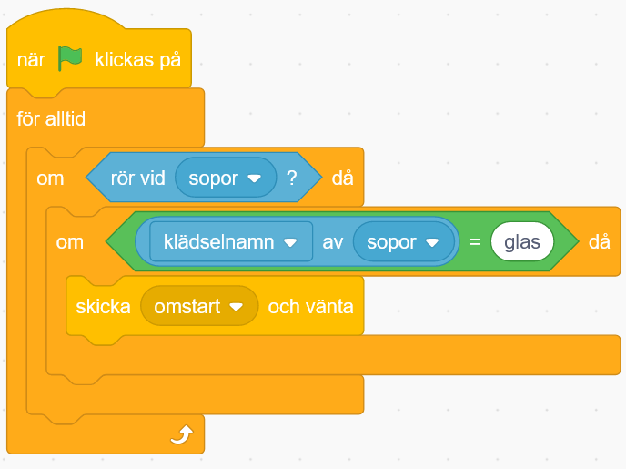

# Sopsorterare 

Tycker du det är jobbigt att sortera sopor för återvinning? Varför inte programmera en robot att hjälpa till! I den här uppgiften kommer vi koda ett spel där du eller en kompis får styra en sorteringsrobot som automatiskt skickar soporna till rätt ställe!

## 1: Soporna
Innan vi börjar koda roboten så måste vi först göra lite sopor som den kan sortera. 

1. Ta bort kattsprajten från projektet och skapa sedan en ny sprajt genom att **Måla** en ny sprajt. Döp denna nya sprajt till **Sopor**.

2. Vi ska nu skapa två olika klädslar i den nya sprajten, som vi senare kan använda som sopor att källsortera. (När du förstår principen att göra olika sop-klädslar kommer du enkelt kunna skapa fler sopsprajtar!)

Som exempel har vi här skapat en glasflaska och en äppelskrutt (men du kan själv välja vilka olika sopor du vill kunna sortera:

3. Döp klädslarna till vad för typ av sopor det är, exempelvis **Glas** för glasflaskan och **Kompost** för äppelskrutten. 

4. Vi ska nu koda så att soporna ramlar ner ifrån ovan som roboten senare ska fånga och sortera! Klicka på fliken som heter KOD högst upp i vänstra hörnet av Scratch, så kommer du tillbaka till skriptytan för din sprajt. 

5.  Dra ut ett startblock från tema HÄNDELSER och lägg på skriptytan för sopsprajten. 

6. Från tema KÄNNA AV lägger du till blocket **sätt dragläge till "dragbar"**, färst det under startblocket. 

Blocket för dragläget du just lade till är en liten extra grej som gör att man kan hjälpa roboten sortera rätt genom att klicka och dra soporna till rätt återvinningsställe!

Nu har vi två sopor som kan sorteras och flyttas på skärmen. Vi går vidare.

## 2: Skapa meddelande
Nu ska vi skapa meddelanden så att olika sprajtar kan "prata med varandra" och veta när och vad de ska göra. Meddelanden förenklar vårt arbete, då vi kan skapa en samling med kodblock som körs varje gång som vi skickar meddelandet så att vi inte behöver skriva samma sak flera gånger. Ungefär som att skicka iväg ett sms till flera kompisar samtidigt. Praktiskt va?! 

1. Från tema HÄNDELSER drar du ut blocket **när jag tar emot meddelande1**. Lägg det fritt bredvid de andra blocken som finns på skriptytan.

2. Klicka på lilla pilen i blocket bredvid där det står **meddelande1** och välj "skapa nytt meddelande". 

3. Nu kan du döpa ditt meddelande till något passande. I vårt fall är "omstart" ett bra namn. Tryck sedan OK, så skapas ett nytt meddelande.

När du är klar borde det se ut såhär:

Sådär! Nu har vi skapat början på en bit kod som kommer att köras varje gång vi skickar meddelandet "omstart".

4. Innan vi går vidare och kodar vad som ska hända vid omstart kan vi passa på att placera ut ett block som skickar iväg vårt nya meddelande. Från tema HÄNDELSER drar du ut blocket **skicka meddelande1 och vänta**. Ändra i blocket så att det står **skicka omstart och vänta**, om det inte redan står det. 

5. Nu går vi tillbaka till blocket som heter **när jag tar emot omstart**.

Under detta block sätter vi från tema UTSEENDE in blocket **ändra klädsel till glas**. (Kanske det står något annat än just glas, beroende på vilken klädsel du visar just nu.) 

6. Inuti detta block lägger vi från tema OPERATORER in ett slumptalsblock som vi sätter till mellan 1 och 2 (Om du gör fler klädslar så ändra bara på sista talet till det totala antal klädslar sprajten har!)

Nu har du alltså kodat att sprajten ska slumpa mellan klädslarna så att den ibland visar glasflaskan och ibland äppelskrutten. Så att det blir olika sopor att sortera. 

>**Testa koden!** Klicka på gröna startflaggan ovanför ditt projekt för att starta koden. Vilke sop-klädsel visas? Klicka på gröna startflaggan flera gånger efter varandra och se om det slumpas fram olika klädslar ibland? Om inte, dubbelkolla att det står rätt i koden, att det står **omstart** i meddelandet som skickas och det som tas emot.

7. Nu vill vi att sopsprajten ska starta högst upp på scenen och sedan glida neråt mot botten. Detta gör vi genom att sätta en bestämd startposition för sprajten, med hjälp av ett **gå till x och y**-block från tema RÖRELSE. Detta är alltså x och y i ett koordinatsystem. Dra ut blocket och sätt det under **ändra klädsel**-blocket. 

8. För att dina sopor ska falla från lite olika positioner i toppen, kodar vi in att det ska slumpas fram exakt var sopan faller ned från. Från tema OPERATORER drar du in blocket **slumptal 1 till 10** och lägger in det i det blå blocket efter **x:**. (se bilden nedan).

9. Ändra slumptalet **1 till 10** så det står förslagsvis **-73 till 94**. 

10. **y-postionen** ändrar du till **140**. Du kan anpassa koordinaterna x och y för att passa till just din sopsorterarrobot, testa dig fram.

11. Under detta block sätter vi från tema RÖRSELSE in blocket **glid 1 sek till x:... y:...**. Sätt fast det direkt under det förra röresleblocket med **gå till x:... och y:...**. Ändra till **2 sek** och sätt från tema OPERATORER in blocket **slumptal 1 till 10** i vita bubblan efter **X:...** och skriv där **-73 och 94**. Ändra även **y**-positionen **-130**. 

Tillsammans borde all kod nu se ut såhär:

>**Testa koden!** Klicka på gröna startflaggan ovanför ditt projekt för att starta koden. Vad händer med soporna? Starta om flera gånger och se vad som händer.

## 3: missa sopan???

Vi går nu tillbaka till vårt **när jag tar emot omstart** block. Nu ska vi här placera ut ett **för alltid**-block från tema KONTROLL och inuti blocket ska vi sätta blocket **om...då** från tema KONTROLL. Inuti detta villkorsblock sätter vi block från tema RÖRELSE som kontrollerar om **y positionen är mindre än -129** (Detta eftersom vi tidigare valde att glida till -130). Slutligen sätter vi ett **skicka omstart**-block innuti detta. 

Alltihop tillsammans borde se ut såhär:

## 4: Sopkärl 
Vi måste ju också ha någonting som soporna kan sorteras in i. Nu får du skapa två nya sprajter, rita olika återvinningskärl eller välj någon sprajt som du gillar från Scratch sprajtbibliotek med färdiga sprajter. 

I vårt exempel har vi ritat ett sopkärl som enkla små lådor som ser ut såhär:

Vi ska nu koda sopkärlen så att de bara tar emot just den typ av sopor som vi vill ska hamna just där, exempelvis glasflaskor ska in i glasåtervinningen och äppelskruttar ska in i komposten. 

1. Vi börjar med att dra ut ett start block **när GRÖN FLAGGA klickas på** från tema HÄNDELSER och lägger in blocket på en av sopkärlens skriptyta. 

2. Under detta block placerar vi ett **för alltid** -block från tema KONTROLL. 

3. Under detta sätter vi ett **om...då**-block från tema KONTROLL. 

4. Inuti **om...då**-blocket sätter vi in ett **rör vid muspekare**-block från tema KÄNNA AV. Klicka på ordet **muspekare** i blocket och välj istället din skräpsprajt. I vårt exempel står det nu **rör vid sopor**, alltså vår sprajt som heter sopor.

5. I sprajten  **sopor** finns våra två olika klädslar, en glasflaska och en äppelskrutt. För att rätt typ av sopor ska hamna i rätt sopkärl behöver vi koda så att sopkärlet känner av vilken klädsel som visas på sopsprajten. Vi sätter därför in ytterligare ett **om...då**-block från tema KONTROLL. 

6. I det kantiga hålet mellan **om...då** i blocket sätter vi in ett = jämförelseblock från tema OPERATORER. 

7. XXXXXXXXXXXXXXXXXXXXXI vilket vi sätter [Om x av y] blocket i vårt jämförelseblock och väljer "Klädselnamn" och vår sopsprajt.  

På andra sidan skriver vi namnet på soptypen som ska slängas här i, exempelvis **glas**. 

>**Tänk på!** Det är viktigt att vi skriver namnet på soptypen på exakt samma sätt som den heter, alltså var noga med om du har stor eller liten bokstav i namnet och inga felstavningar. Sopsorterarroboten du ska skapa är väldigt smart, men den gör bara exakt som du säger åt den att göra. Om vi skriver till exempel "Glas" med stor bokstav, men soporna heter "glas" med liten bokstav kommer roboten jämföra desa två namn och inte hitta glas-soporna. Roboten kommer därför inte veta vad den ska göra. 

Slutligen sätter vi också ett **skicka omstart**-block inuti vårt **om...då**-block. 

När vi sen sätter ihop allting borde det se ut såhär:

Sådär! Nu har vi ett sopkärl som är redo att ta emot en typ av sopor och som kommer känna av om vi försöker stoppa i rätt typ av sopor! Testa att starta och dra sopsprajten till ditt sopkärl. 

På samma sätt som vi precis gjort kan vi nu koda ett till sopkärl. Antingen kan du kopiera din sprajt och byta färg eller kanske rita någonting helt annat. För att göra flera sopkärl följer du helt enkelt stegen vi precis gjort men ändrar så att istället för klädsel 1, så kollar till exempel ett glasåtervinningskärl efter klädsel 2 som är just glas. 

(Bygga vidare)
I annars biten lägger vi säg-blocket för att få soptunnan att säga någonting om en försöker slänga fel sak i kärlet. Dra in ett säg-block och skriv någonting i stil med "Oj, nu blev det fel!"

## 5: Styr roboten
Det är ju lite tråkigt att dra varje grej till rätt ställe så istället kan vi programera en robot som gör detta åt oss. 

Vi börjar med att välja en sprajt till vår robot som vi därefter kan koda så att vi kan styra den för att fånga alla sopor. Jag har valt att göra en skalbaggerobot men du kan välja en annan typ av robot om du vill. 

För att styra roboten behöver vi två när [någonting] trycks på block. som vi sätter till höger samt vänsterpil.

Under dessa placerar vi sen blocken gå -10 steg under vänsterpil, och blocket gå 10 steg under högerpil. När du är klar ska de båda blocken se ut såhär:

Sådär! Nu kan vi styra roboten! Enkelt va? 

## 6: Fånga sopor
Vi måste också programera roboten så den tar hand om soporna som faller ner på rätt sätt så att allt tas om hand och kan bli till nya saker. 

För att göra detta måste roboten känna igen vad för typ av sopor det är som den stöter på. Vi kommer att koda detta på ett sätt som påminner mycket om det vi kodade till sopkärlen.

Vi börjar med att lägga till en [för alltid loop] under [startblocket] med den gröna flaggan. 

Sen kan vi börja med om skräptypen är glas. Vi skapar fört ett jämförelseblock som vi därefter kan sätta in i ett om-block. På den ena sidan sätter vi som tidigare klädselnamn av Sopsprajten och på andra sidan skriver vi glas. 

Vi upprepar samma steg för andra soptyper vi skapat och när du är klar borde det se ut något sådanthär: 

Kom igåg att det är viktigt att det står exakt så som du skrev namnet på din klädsel på andra sidan!

För vår andra soptyp kan vi kopiera blocken vi skapade i föregående steg men glöm inte att byta namn på din soptyp! 

När du är klar ser det nog ut något sådant här:

## 7: Sortera!
Nu ska vi i varje litet om-block vi skapat för de olika soptyperna använda oss av medelanden för att få sakerna att hamna rätt. I blocket för glas ska vi skicka meddelandet glas. 

Gör du fler sopsorter är det bara att upprepa dessa steg. Skapar du exempelvis ett batteri ska du istället kolla efter klädselnamn batteri och skicka den soptypen. 

Vi går nu tillbaka till vår sopsprajt. Det sista vi behöver göra är att få soporna att glida till rätt sopkärl. Detta gör vi helt enkelt genom att dra ut när jag tar emot meddelande block och sätter dessa till våra olika soptypsmedelanden. 

Under de två blocken sätter vi ett glid till block och sätter det till 1 sekund och på den ena skriver positionen för komposten och för den andra positionen för glasåtervinningen. 

Sådär! Om inget har blivit tokigt har du nu en robot som sorterar sopor! 

