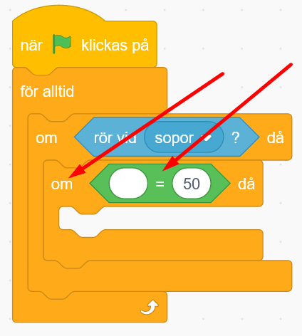

# Sopsorterare 

Tycker du det är jobbigt att sortera sopor för återvinning? Varför inte programmera en robot att hjälpa till? 

I den här uppgiften kommer vi koda ett spel där du eller en kompis får styra en sorteringsrobot som automatiskt skickar soporna till rätt ställe!

Nedan hittar du ett exempelprojekt. Nar du har kodat allt ska resultat se ungefär så har:

<a href="https://scratch.mit.edu/projects/499266198/" target="_blank"> https://scratch.mit.edu/projects/499266198//</a>

<!---
## 1: Välj en robot och koda styrning

Vi ska skapa en robot som sorterar sopor. En robot kan ju se ut precis som du vill, det kan vara en robotskalbagge eller en robotanka. I vår exempel har vi valt en sprajt som ser ut som en robotfigur. 

1. Ta först bort kattsprajten från projektet genom att klicka på den lilla soptunnan på den lilla katt-figuren under scenen. Klicka sen på **Välj ny sprajt** under scenen och välj en sprajt som du vill ha som din robot. I vårt exempel har vi roboten på bilden nedan, men du kan välja vilken sprajt du vill.  

2. Känns roboten för stor? Ändra storleken på den genom att ändra siffran där det står **Storlek 100** under scenen. 100 är full storlek, alltså 100%, så prova dig fram till något mindre procenttal, exempelvis 70. Klicka på gröna startflaggan om roboten inte ändrar storlek, så ändras den. Ändra storlek tills du är nöjd.

2. Nu ska vi koda så att roboten kan styras för att fånga och sortera alla sopor som kommer falla ned mot den. Vi ska styra roboten åt höger och vänster med hjälp av datorns tangentbord med höger- och vänsterpil. 
Börja med att dra ut två stycken block från tema HÄNDELSER som heter **när [mellanslag] tangenten trycks ned**. Lägg dem bredvid varandra på robotens skriptyta. 

3. Klicka på ordet **mellanslag** i blocken och välj istället **vänsterpil** och **högerpil**, så det ser ut såhär:

4. Under dessa block lägger vi in blocket **gå 10 steg**. Ändra i skriptet för **vänsterpil**tangenten så det står **gå -10 steg**. Då kommer roboten gå åt vänster med vänsterpil-tangenten. När du är klar ska de båda blocken se ut såhär:

Sådär! Nu kan vi styra roboten! Enkelt va? Dags att lägga till lite sopor som roboten ska kunna sortera.

## 2: Soporna
Innan vi börjar koda roboten så måste vi först göra lite sopor som den kan sortera. 

1. Måla en egen ny sprajt genom att välja hålla muspekaren över knappen för **Välj ny sprajt** och klicka på lilla penseln som heter **Måla**. Döp denna nya sprajt till **Sopor**.

2. Vi ska nu skapa två olika klädslar i den nya sprajten, som vi senare kan använda som olika sopor att källsortera. I denna instruktion ska vi visa hur du kan skapa två olika sopklädslar - en glasflaska och en äppelskrutt. När du förstår principen att göra olika sop-klädslar kommer du enkelt sen kunna skapa fler sopor att slumpa mellan!

Som exempel har vi här skapat en glasflaska som ska sorteras som **glas** och en äppelskrutt som ska sorteras som **kompost** Du kan givetvis själv välja vilka olika sopor du vill ha.

3. Döp klädslarna till vad för typ av sopor det är, exempelvis **glas** för glasflaskan och **kompost** för äppelskrutten. 

4. Nu ska du sätta en passande storlek på din sopsprajt, så den känns lagom stor i förhållande till din robot. Gör de ganska liten, ungefär som din tumnagel eller något mindre brukar bli lagom. Se till att din sopsprajt är vald och ändra storleken under scenen där det står **Storlek 100**. Kanske 30 blir lagom? Prova dig fram tills du är nöjd.

5. Vi ska nu koda så att soporna ramlar ner ovanifrån ner mot roboten, så att den kan fånga och sortera soporna! Klicka på fliken som heter KOD högst upp i vänstra hörnet av Scratch, så kommer du ur ritverktyget och tillbaka till skriptytan för din sprajt. 

6. Se till att du kodar i rätt sprajt. Vi fortsätter koda roboten. 

6.  Dra ut ett startblock **när GRÖN FLAGGA klickas på** från tema HÄNDELSER och lägg på skriptytan för sopsprajten. 

7. Från tema KÄNNA AV lägger du till blocket **sätt dragläge till "dragbar"**, fäst det under startblocket. 

Blocket för dragläget du just lade till är en liten extra grej som gör att man kan hjälpa roboten sortera rätt genom att klicka och dra soporna till rätt återvinningsställe!

Nu har vi en sprajt som är sopor som kan flyttas på skärmen. men hur ska vi koda så att de olika typerna av sopor visas? Oh hur ska soporna röra sig? Vi går vidare.

## 3: Slumpa sopklädslar som faller ned
Nu ska vi skapa meddelanden så att olika sprajtar kan "prata med varandra" och veta när och vad de ska göra. Meddelanden förenklar vårt arbete, då vi kan skapa en samling med kodblock som körs varje gång som vi skickar meddelandet så att vi inte behöver skriva samma sak flera gånger. Ungefär som att skicka iväg ett och samma sms till flera kompisar samtidigt, istället för att behöva skriva ett i taget till vardera kompis. Praktiskt va?! 

1. Nu ska du koda mer på din sop-sprajt. Dubbelkolla att du kodar på rätt sprajt, genom att klicka på den lilla bilden av din sop-sprajt som finns under scenen. Då blir sprajten aktiverad och får en blå ram omkring sprajtbilden. 

2. Från tema HÄNDELSER drar du ut blocket **när jag tar emot meddelande1**. Lägg det fritt bredvid de andra kodblocken som finns på skriptytan.

3. Klicka på lilla pilen i blocket bredvid där det står **meddelande1** och välj **Nytt meddelande**. 

4. Meddelandet som ska skickas handlar om att sopsprajten ska starta om sin kod när den tar emot meddelandet. Därför döper vi meddelandet till "omstart", så vet vi vad det handlas om. Tryck sen OK, så skapas ett nytt meddelande.

När du är klar borde det se ut såhär:

Sådär! Nu har vi skapat början på en bit kod som kommer att köras varje gång sprajten tar emot meddelandet "omstart".

5. Under detta block sätter vi från tema UTSEENDE in blocket **ändra klädsel till "glas"**. (Kanske det står något annat än just "glas", beroende på vilken klädsel du visar just nu och vad du döpt dina sop-klädslar till.) 

6. Inuti detta block lägger vi från tema OPERATORER in ett blocket **slumptal 1 till 10**. Ändra så det står **1 till 2** istället, då vi ännu bara har två olika sop-klädslar att slumpa mellan. (Om du gör fler sop-klädslar sen så ändrar du bara på sista talet till det totala antal klädslar sop-sprajten har!)

Nu har du alltså kodat att sprajten ska slumpa mellan klädslarna så att den ibland visar glasflaskan och ibland äppelskrutten. Så att det blir olika sopor för roboten att sortera. 

>**Testa koden!** Klicka på gröna startflaggan ovanför ditt projekt för att starta koden. Vilke sop-klädsel visas? Klicka på gröna startflaggan flera gånger efter varandra och se om det slumpas fram olika klädslar ibland? Om inte, dubbelkolla att det står rätt i koden, att det står **omstart** i meddelandet som skickas och det som tas emot.

7. Dax att skapa rörelse på soporna. Sopsprajten ska starta högst upp i ovankant på scenen och sedan glida nedåt. Detta gör vi genom att sätta en bestämd startposition för sopsprajten, med hjälp av ett **gå till x och y**-block från tema RÖRELSE. Detta är alltså x och y i ett koordinatsystem, som anger position på scenen. Dra ut blocket och sätt det under **ändra klädsel**-blocket. 

8. För att dina sopor ska falla från lite olika positioner i toppen, kodar vi in att det ska slumpas fram exakt var sopan faller ned från. Från tema OPERATORER drar du in blocket **slumptal 1 till 10** och lägger in det i det blå blocket efter **x:**. (se bilden nedan).

9. Ändra slumptalet i blocket **1 till 10** så det står koordinatpositioner istället, förslagsvis **-73 till 94**. Då kommer sprajten alltså att slumpvis välja att starta i en plats någonstans mellan x: -73 till x: 94 i scenens ovankant, då x-positioner sätter positionen horisontellt,  åt höger eller vänster på scenen. 

10. **y-postionen** ändrar du till **140**, alltså positionen för hur högt upp sprajten ska starta från på scenen.

>**Tänk på!** Siffran för x-positionen styr positionen av sprajten horisontellt, alltså åt höger och vänster på scenen. Och y-positionen styr sprajtens position vertikalt, alltså uppåt och nedåt. Du kan anpassa koordinaterna x och y för dina sopor för att passa till just din sopsorterarrobot, testa dig fram.

11. Under **gå till x:... och y:...**-blocket sätter vi in blocket **glid 1 sek till x:... y:...** från tema RÖRELSE.

Ändra i blocket så det står **2 sek** istället. Från tema OPERATORER sätter du sen in blocket **slumptal 1 till 10** i vita bubblan efter **x:...** och skriv in **-73 och 94** i det gröna operatorblocket. Ändra även **y**-positionen **-130**. 

När du är färdig borde all kod nu se ut såhär:

Nu har vi ett skript med kod som gör att en slumpvis vald sopsprajt faller ned när vi startar projektet och sen stannar sopsprajten i luften och inget nytt händer. Men vi vill att det ska falla ned mer sopor hela tiden och att det ska slumpa mellan olika sopklädslar. Vi måste ju lägga till kod för **när** meddelandet "omstart" ska skickas iväg också, så att detta kan hända. Dax att koda vidare!
--->

## 1: Välj en robot och koda styrning

Vi ska skapa en robot som sorterar sopor. I vår exempel har vi valt en sprajt som ser ut som en robotfigur men den kan ju se ut precis som du vill.

1. Ta först bort kattsprajten från projektet. **Välj ny sprajt** som du vill ha som din robot.  

2. Känns roboten för stor? Ändra storleken på den genom att ändra siffran där det står **Storlek 100** under scenen. Ändra storlek tills du är nöjd.

3. Nu ska vi koda så att roboten kan styras med hjälp av datorns tangentbord med höger- och vänsterpil. 
Börja med att dra ut två stycken block från tema HÄNDELSER som heter **när [mellanslag] tangenten trycks ned**. Lägg dem bredvid varandra på robotens skriptyta. 

4. Klicka på ordet **mellanslag** i blocken och välj istället **vänsterpil** och **högerpil**, så det ser ut såhär:

5. Under dessa block lägger vi in blocket **gå 10 steg**. Ändra i skriptet för **vänsterpil**tangenten så det står **gå -10 steg**. När du är klar ska de båda blocken se ut såhär:

Sådär! Nu kan vi styra roboten! Enkelt va? Dags att lägga till lite sopor som roboten ska kunna sortera.

## 2: Soporna
Innan vi börjar koda roboten så måste vi först göra lite sopor som den kan sortera. 

1. Måla en egen ny sprajt och döp den till **Sopor**.

2. Vi ska nu skapa två olika klädslar i den nya sprajten, som vi senare kan använda som olika sopor att källsortera. 

Som exempel har vi här skapat en glasflaska som ska sorteras som **glas** och en äppelskrutt som ska sorteras som **kompost** 

3. Döp klädslarna till vad för typ av sopor det är, exempelvis **glas** för glasflaskan och **kompost** för äppelskrutten. 

4. Nu ska du sätta en passande storlek på din sopsprajt, så den känns lagom stor i förhållande till din robot.

5. Nu ska vi gå tillbaka till skriptytan och koda sprajten så att soporna ramlar ner ovanifrån ner mot roboten.

6.  Dra ut ett startblock **när GRÖN FLAGGA klickas på** till skriptytan för sopsprajten. 

7. Från tema KÄNNA AV lägger du till blocket **sätt dragläge till "dragbar"**, fäst det under startblocket. 

Blocket för dragläget du just lade till är en liten extra grej som gör att man kan hjälpa roboten sortera rätt genom att klicka och dra soporna till rätt återvinningsställe!

Nu har vi en sprajt som är sopor som kan flyttas på skärmen. men hur ska vi koda så att de olika typerna av sopor visas? Vi går vidare.

## 3: Slumpa sopklädslar som faller ned
Nu ska vi skapa meddelanden så att olika sprajtar kan "prata med varandra" och veta när och vad de ska göra. 

1. Dubbelkolla att du kodar på rätt sprajt. Du kodar fortfarande på din sop-sprajt.

2. Från tema HÄNDELSER drar du ut blocket **när jag tar emot meddelande1**.

3. Klicka på lilla pilen i blocket bredvid där det står **meddelande1** och välj **Nytt meddelande**. 

4. Meddelandet som ska skickas handlar om att sopsprajten ska starta om sin kod när den tar emot meddelandet. Därför döper vi meddelandet till "omstart", så vet vi vad det handlas om. Tryck sen OK, så skapas ett nytt meddelande.

När du är klar borde det se ut såhär:

Sådär! Nu har vi skapat början på en bit kod som kommer att köras varje gång sprajten tar emot meddelandet "omstart".

5. Under detta block sätter vi från tema UTSEENDE in blocket **ändra klädsel till "glas"**. Beroende på vad du har döpt din klädsel till kan det stå något annat än "glas". 

6. Inuti detta block lägger vi från tema OPERATORER in ett blocket **slumptal 1 till 10**. Ändra så det står **1 till 2** istället, då vi ännu bara har två olika sop-klädslar att slumpa mellan.

Nu har du alltså kodat att sprajten ska slumpa mellan klädslarna så att den ibland visar glasflaskan och ibland äppelskrutten.

>**Testa koden!** Klicka på gröna startflaggan flera gånger efter varandra och se om det slumpas fram olika klädslar ibland?

7. Dags att skapa rörelse på soporna. Sopsprajten ska starta högst upp i ovankant på scenen och sedan glida nedåt. Från tema RÖRELSE välj **gå till x och y**-block och sätt det under **ändra klädsel**-blocket. 

8. För att dina sopor ska falla från lite olika positioner i toppen, kodar vi in att de ska slumpas fram. Från tema OPERATORER drar du in blocket **slumptal 1 till 10** och lägger in det i det blå blocket efter **x:**.

9. Ändra slumptalet i blocket **1 till 10** så det står koordinatpositioner istället, förslagsvis **-73 till 94**. 

Då kommer sprajten alltså att slumpvis välja att starta i en plats någonstans mellan x: -73 till x: 94 i scenens ovankant.

10. **y-postionen** ändrar du till **140**.

>**Tänk på!** Siffran för x-positionen styr positionen av sprajten horisontellt, alltså åt höger och vänster på scenen. Och y-positionen styr sprajtens position vertikalt, alltså uppåt och nedåt. 

11. Under **gå till x:... och y:...**-blocket sätter vi in blocket **glid 1 sek till x:... y:...** från tema RÖRELSE och ändra den till 2 sek istället.

Dra blocket **slumptal 1 till 10**. I vita bubblan efter **x:...** och skriv in **-73 och 94** i det gröna operatorblocket. Ändra även **y**-positionen **-130**. 

När du är färdig borde all kod nu se ut såhär:

Nu har vi ett skript med kod som gör att en slumpvis vald sopsprajt faller ned när vi startar projektet. Vi fortsätter att koda!

## 4: Skicka meddelandet omstart

1. Från tema HÄNDELSER drar du ut blocket **skicka meddelande1 och vänta**. Fäst blocket längst ned i sopsprajtens andra kodskript som börjar med blocket **när GRÖN FLAGGA klickas på**. Ändra sen i meddelandeblocket du just lade till så att det står **skicka "omstart" och vänta**. Såhär ska det se ut när det är klart:

>**Testa koden!** Klicka på gröna startflaggan ovanför ditt projekt för att starta koden. Vad händer med soporna? Starta om projektet flera gånger och se vad som händer.

Vi vill att om roboten missar att sortera sopan, och den faller ned till marken, så ska det en ny sopa börja falla ned. För det behöver vi skapa en loopad kodsnutt. Gör såhär:

2. Från tema KONTROLL drar du in ett **för alltid**-block och fäster det längst ned i skriptet du kodar. 

3. Dra sen ut ett villkorsblock med **om...då** från tema KONTROLL och lägg det inuti **för alltid**-blocket. 

4. Från tema OPERATORER drar du in ett jämföresleblock med tecknet **<**, som alltså betyder *mindre än*. Lägg in blocket i hålet mellan **om...då**, så koden ser ut såhär: 

5. Nu vill vi att villkoret ska läsa av när soporna har fallit ända ned förbi roboten. Vi börjar med att ändra siffran **50** igröna operatorblocket så det står koordinatorpositionen **-129**. Alltså lite kortare än positionen -130 som vi satte för sopan att falla ned till. 

6. Nu lägger vi till att det är y-positionen villkoret ska kolla efter. Från tema RÖRELSE drar du in blocket som heter **y-position**. Lägg det i den första vita bubblan i det gröna operatorblocket, så att villkoret blir **om y positionen < -129 då**. 

7. Slutligen sätter vi ett **skicka omstart**-block från tema HÄNDELSER innuti villkoret. När du är klar ska koden se ut såhär:

**Testa koden!** Tryck på startflaggan och se vad som händer. Startar soporna om när de fallit till marken? Slumpas det mellan olika sopor ibland? 

**Tips!** Om du gjort rätt i koden, men soporna ändå inte startar om när de fallit till marken, så kan du testa att ändra koordinatposition till en lite lägre siffra än just -129. Prova exempelvis -120 och se om det fungerar bättre när du startar om koden. Om sopsprajtarna är ganska stora, kan du även prova att göra dem lite mindre genom att minska storleken på den under scenen där det står Storlek 100. 

Nu har vi en robot som kan styras och sopor som kan röra sig och slumpas mellan olika sopklädslar samt startas om. Men vart ska soporna sorteras? Vi går vidare!

## 5: Sopornas återvinningslåda
Vi måste ju också ha någonting som soporna kan sorteras in i. Nu ska du skapa nya sprajter som blir robotens återvinningslådor. Du kan välja att rita egna sprajtar för återvinningslådorna eller välja färdiga sprajter som du tycker passar från Scratch sprajtbibliotek. 

1. Skapa först en första ny sprajt-låda, som du efter att ha ritat och kodat ska få kopiera så du får fler återvinningslådor. På det sätter behöver du inte koda samma sak flera gånger, bara ändra lite i utseendet och lite i koden. För att måla en ny sprajt, håll muspekaren över **Välj en sprajt** och klicka på pensel-symbolen som heter **Måla**.

2. I vårt exempel har vi ritat en ny sprajt som vår återvinningslåda och skrivit på lådan med textverktyget vad den återvinner (exempelvis "glas"), så den ser ut såhär:

>**Glöm inte!** För att kunna rita enkelt en låda och skriva på den behöver du först trycka på den blå knappen **Gör till bitmap** under ritverktygets yta.

Vi ska nu koda sopkärlen så att de bara tar emot just den typ av sopor som vi vill ska hamna just där, exempelvis glasflaskor ska in i glasåtervinningslådan och äppelskruttar ska in i komposten. 

3. Vi börjar med att dra ut ett start block **när GRÖN FLAGGA klickas på** från tema HÄNDELSER och lägger in blocket på en av sopkärlens skriptyta. 

4. Under detta block placerar vi ett **för alltid** -block från tema KONTROLL. 

5. Under detta sätter vi ett **om...då**-block från tema KONTROLL. 

6. Inuti **om...då**-blocket sätter vi in ett **rör vid muspekare**-block från tema KÄNNA AV. Klicka på ordet **muspekare** i blocket och välj istället din skräpsprajt. I vårt exempel står det nu **rör vid sopor**, alltså vår sprajt som heter sopor.

7. I sprajten  **sopor** finns våra två olika klädslar, en glasflaska och en äppelskrutt. För att rätt typ av sopor ska hamna i rätt sopkärl behöver vi koda så att sopkärlet känner av vilken klädsel som visas på sopsprajten. Vi sätter därför in ytterligare ett **om...då**-block från tema KONTROLL. Lägg det inuti ditt första **om...då**-block i skriptet.

8. I det kantiga hålet mellan **om...då** i blocket sätter vi in ett = jämförelseblock från tema OPERATORER, så det ser ut såhär. 

9. Från tema KÄNNA AV drar vi in blocket **bakgrundsnummer av scen**. Lägg in det i den första tomma vita ringen i det gröna operatorblocket, så det ser ut som i bilden nedanför. 

10. Nu ska vi ändra i det blå blocket du just lade in, så att sopkärls-sprajten kan känna av om det är rätt sopor den tar meot. Klicka på ordet **scen** i det blå blocket och byt till sprajten **sopor**. Ordet **bakgrundsnummer** ändrades nu automatiskt till **x position**. Klicka på ordet **x position** och välj istället **klädselnamn**. I den andra vita ringen där det står siffran **50** skriver du istället namnet på klädseln för den typ av sopor kärlet ska ta emot, exempelvis **glas**. När du är klar ska koden se ut såhär:

>**Tänk på!** Det är viktigt att vi skriver namnet på soptypen på exakt samma sätt som den heter i sprajtens klädselnamn, alltså kola  noga om du har stor eller liten bokstav i namnet och inga felstavningar. Sopsorterarroboten du ska skapa är väldigt smart, men den gör bara exakt som du säger åt den att göra. Om vi skriver till exempel "Glas" med stor bokstav, men soporna heter "glas" med liten bokstav kommer roboten jämföra dessa två namn och inte hitta glas-soporna. Roboten kommer då inte veta vad den ska göra och välja att göra ingenting.

11. Slutligen sätter vi in ett **skicka omstart och vänta**-block inuti vårt sista **om...då**-block. 

Nu är koden färdig och borde se ut såhär:

>**Testa koden!** Nu har vi ett sopkärl som är redo att ta emot en typ av sopor och som kommer känna av om vi försöker stoppa i rätt typ av sopor i det! Testa att starta och dra sopsprajten **glas** till det sopkärl du just kodat. Vad händer? Börjar programmet om med nya sopor som faller från toppen? Om du gör det flera gånger, växlar utseendet av soporna ibland till den andra typen då (alltså äppelskrutten)? 

## 6: Kopiera fler lådor
Nu ska vi kopiera låd-sprajten så vi får en till likadan, där koden även följer med. 

1. Kopiera låd-sprajten genom att högerklicka på den lilla bilden av din återvinningslåda under scenen och välj kopiera.

2. Gå nu till nya lådsprajtens klädslar (klicka på fliken KLÄDSLAR högt upp till vänster i Scratch). Klicka på blå knappen **Gör till bitmap** under scenen och ändra lådans färg och text, så det står exempelvis "Kompost". 

>**Tips!** Sudda först bort texten du vill byta ut på den kopierade lådan med hjälp av suddgummi-verktyget, sen kan du färga lådan med ny färg och skriva på en ny text. Glöm inte att klicka på knappen **Gör till bitmap** allra först för at kunna måla. 

3. För att koden ska fungera för denna andra låda, behöver du ändra i dess kod så att istället för sopsprajtens klädsel **glas** så kollar denna andra återvinningslåda efter klädseln **kompost** (så den kan ta emot äppelskrutten). Byt bara namnet på klädseln i Känna-av-blocket. 

**Vidareutveckla koden om du vill:**

Vill du att sopsorterarroboten ska säga något om du lägger fel sopor i de olika återvinningslådorna? Då kan du byta ut det sista **om...då**-blocket du lade in i dina olika lådor mot ett **om...då...annars**-block istället. Inom **annars**-biten i detta nya block lägger vi in ett **säg Hej! i 2 sekunder**-block från tema UTSEENDE. Klicka på ordet Hej! och skriv istället exempelvis "Oj, nu blev det fel!". Gör likadant på båda återvinningslådorna, se exempel på hur koden kan se ut i bilden nedan. Testa koden och prova att lägga fel sopor i de olika återvinningslådorna. Vad händer?

## 7: Fånga sopor
Vi måste också programmera roboten så den sorterar soporna som faller ner i rätt återvinningslåda, så att alla sopor kan återvinnas och kan bli till nya saker. 

För att göra detta måste roboten känna igen vad för typ av sopor det är som faller ned, så den kan fånga rätt sopor. I nästa steg ska vi koda så den sorterar dem rätt. Vi kommer att koda detta på ett sätt som påminner mycket om det vi kodade sopkärlen.

1. Se till att du har aktivierat roboten, så du kodar rätt sprajt. Från tema HÄNDELSER drar du ut startblocket **när GRÖN FLAGGA klickas på** och lägger det fritt på robotens skriptyta. 

2. Från tema KONTROLL lägger du till en **för alltid**-loop och fäster det under startblocket med flaggan. 

3. För att roboten ska veta vad den ska hålla utkik efter, börjar vi med att bestämma att det är din sopsprajt den ska känna av. Från tema KONTROLL drar du in ett villkorsblock med **om...då**. Lägg det inuti din **för alltid**-loop. från tema KÄNNA AV drar du in blocket **rör vid muspekare**. Lägg in det i hålet mellan **om...då**, klicka på ordet *muspekare* och ändra till nmanet för din sopsprajt. I vårt exempel heter vår sopsprajt *sopor*

4. Nu ska vi koda in ett villkor till som gör att roboten känner av om den rör vid en viss soptyp och som senare ska kodas för att säga åt roboten vad den då ska göra. Börja med att dra in ett till **om...då**-block från tema KONTROLL och lägg in blocket inuti det första **om...då** blcoket, så det ser ut som i bilden nedan:

4. Nu ska vi skapa ett jämförelseblock som kan stämma av vilken soptyp som roboten rör vid (exempelvis glas eller kompost?). Från tema OPERATORER drar du in blocket **__ = 50** och lägger in det i hålet mellan **om** och **då**. 

5. Från tema KÄNNA AV drar du in blocket **bakgrundsnummer av scen** och lägger in det i den första vita, tomma bubblan i operatorblocket. (När du lagt in det blå Känna av-blocket byts namnet *bakgrundsnummer* till *backdrop #*, men det är samma sak.

6. Vi vill ju att sprajten **Sopor** ska byta klädslar, inte att scenen ska byta bakgrundsnummer som det nu står i koden. Vi ändrar i koden genom att klicka först på ordet **scen** i det blå Känna av-blocket, och välja sopsprajten istället. Klicka sedan på ordet till vänster i Känna av-blocket, där det nu står *x-position* och välj istället så det står **klädselnamn**. Slutligen ändrar du i Operatorblockets vita bubbla där det nu står *50* så att det istället står namnet på en av sopsprajtens klädslar, exempelvis **glas**. 

7. För att roboten ska kunna känna igen alla våra soptyper (glasflaskan och äppelskrutten) behöver vi göra en likadan kodsnutt som den vi nyss gjorde för soptypen **glas** ovan. Upprepa därför stegen ovanför så roboten kan känna av andra soptyper, exempelvis **kompost**. (Tips: du kan om du vill kopiera koden du nyss gjorde och bara ändra i den så det står rätt sopklädsel.) När du är klar ska koden se ut något såhär: 

När du har färdig kodat den ska det se ut något såhär:

**Kom ihåg!** Det är viktigt att det skrivs in exakt samma klädselnamn i gröna Operator-blocket så som du skrev namnet på sopornas  klädslar i återvinningslådornas kod. Annars kan inte roboten senare sortera soporna till rätt låda.

Nu kan roboten känna igen våra två olika soptyper som faller ned, men den kan inte änu sortera dem rätt. Vi kodar vidare!

## 8: Sortera!
Det är ju lite tråkigt att själv dra soporna till rätt återvinningslåda så istället ska vi programmera roboten att den gör detta åt oss. Nu ska vi i varje litet **om...då**-block vi skapat för de olika soptyperna använda oss av meddelanden för att få soporna roboten fångar att sorteras rätt.

1.Från tema HÄNDELSER drar du in meddelandeblocket **skicka omstart och vänta**. L'gg det inuti den första soptypens **om...då**-block så det ser ut som i bilden nedan. Klicka på ordet **omstart** och skapa ett nytt meddelande som du döper till din soptyps namn, exempelvis **glas**. 

Gör du fler soptyper är det bara att upprepa dessa steg nedan. Skapar du exempelvis ett batteri ska du istället kolla efter klädselnamnet **batteri** och skicka den soptypen i ditt meddelande. 

Vi går nu tillbaka till vår sopsprajt. Det sista vi behöver göra är att få soporna att glida till rätt sopkärl. Detta gör vi helt enkelt genom att dra ut när jag tar emot meddelande block och sätter dessa till våra olika soptypsmedelanden. 

Under de två blocken sätter vi ett glid till block och sätter det till 1 sekund och på den ena skriver positionen för komposten och för den andra positionen för glasåtervinningen. 

Sådär! Om inget har blivit tokigt har du nu en robot som sorterar sopor! 

## Färdig!
Grymt jobbat! Spara och dela gärna ditt projekt så andra kan testa det! 

