# CODE YOUR SPACE ROCKET
We begin our space adventure by building a rocket using the programming tool Scratch. First, we will draw our rocket using geometric shapes and then write some code that will send it into space! 

The end result could look like this: <a href="https://scratch.mit.edu/projects/460478635/" target="_blank">https://scratch.mit.edu/projects/460478635//</a>

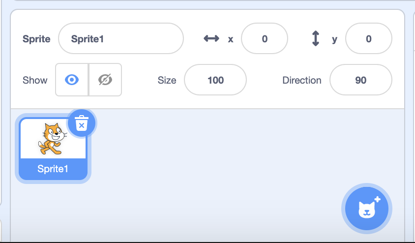

## 1 - Create a new project in Scratch 
Click on this link to be directed to the Scratch website: https://scratch.mit.edu/ 

There is a menu at the top of the page. Click on Create. 

The cat that you see on screen is created when someone starts a new project. Since we don’t need the cat for our program, we will begin by removing it. To do that, go to the small figure of the cat in a box and click on the trash bin sign.  

## 2 - Paint a new sprite 

To create a new sprite, put the mouse on button with the cat head but don’t click on it. Instead, put the mouse on the brush and click on that. Go to the place where the cat used to be and name your sprite “Rocket” 

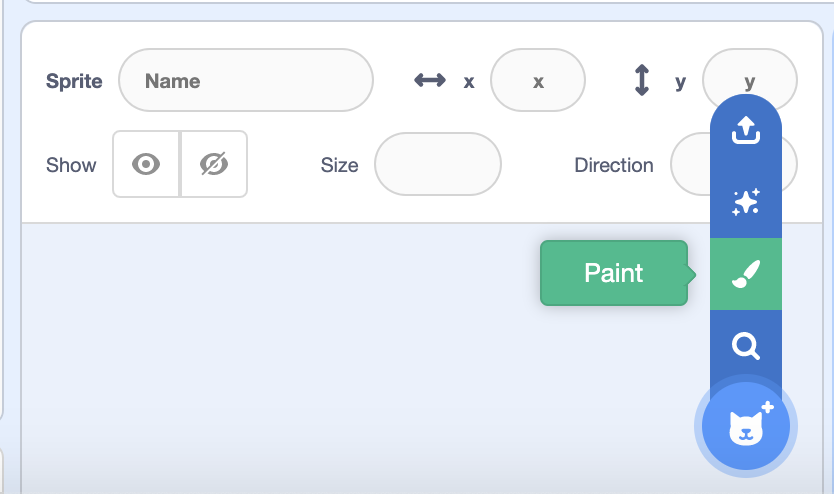

Now it’s time to start! 

## 3 - The nose of the rocket 

You want to the nose of your rocket to be an equilateral triangle. An equilateral triangle is the one where all the sides are the same length. Scratch does not have a tool for drawing a triangle, so instead we will draw one using the tool for drawing lines. 

1. Select the “Line” tool. 
2. Click and drag to draw a line. 
3. Draw a triangle with three sides of equal length. Scratch does not have a ruler, but if you have one close by, you can hold it up to the screen to see whether your lines are the same length. 

> If you want to delete the last line you drew, click on the “undo” arrow. 

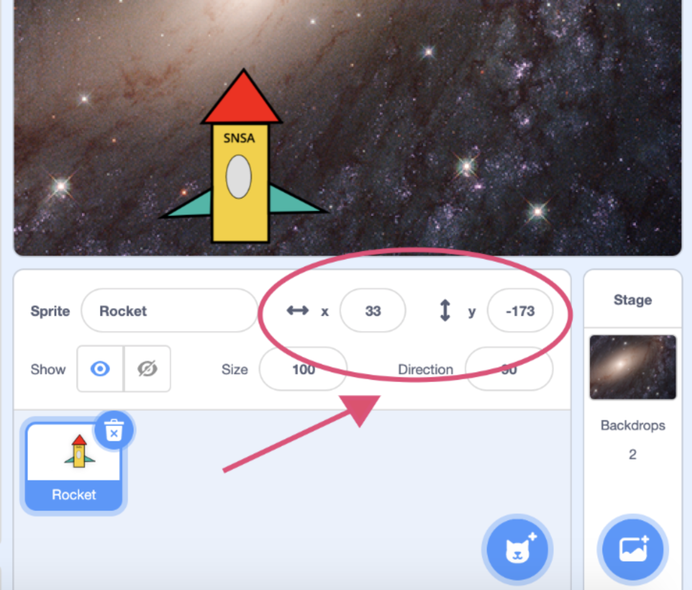

Now that you have drawn the outline of your triangle, it’s time to colour it. Select the “Fill” tool, which looks like a paint bucket. Then choose the colour you want to fill your triangle with and click in your triangle. Does the triangle change to the colour you have chosen? Awesome! 

> Isn’t it working? The Fill tool only works if there are no gaps in the outline of the triangle. Keep drawing lines until there are no gaps, then you can add the colour. 
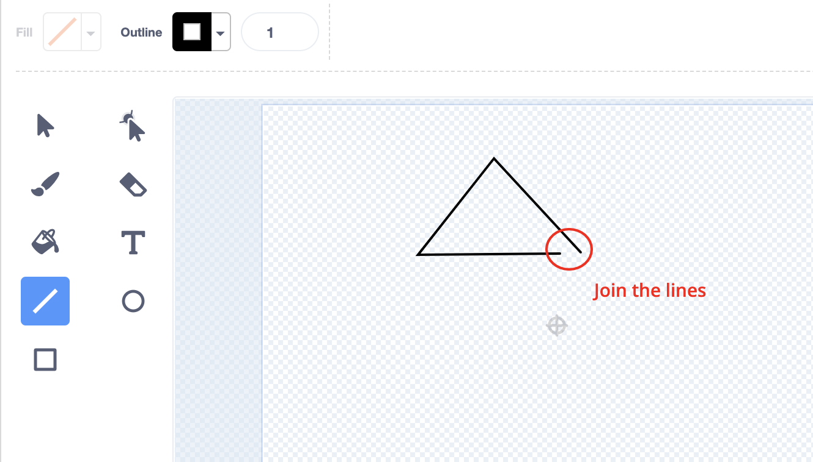

## 4 - The body of the rocket 

The rocket’s body is made from a rectangle shape. We can draw a rectangle by using the Line tool if we want to – or we can use the Rectangle tool. 

1. Select the Rectangle tool. 
2. Select a colour to fill. 
3. Click and drag it to draw a rectangle. 

> If you want to move your rectangle or change its size, you don’t need to redo it. You can select the “Select” tool, which looks like a cursor, and then click on the rectangle to move it or change its size. 

## 5 - Fins 

A rocket needs small fins at the bottom, so it travels straight through the air. You will need two fins, one on each side of the rocket. 

A fin is made from a right-angle triangle. Ask your teacher if you are not sure what a right-angle triangle is. 

Move the fins to the bottom of the rectangle. Now it's starting to look like a rocket! 

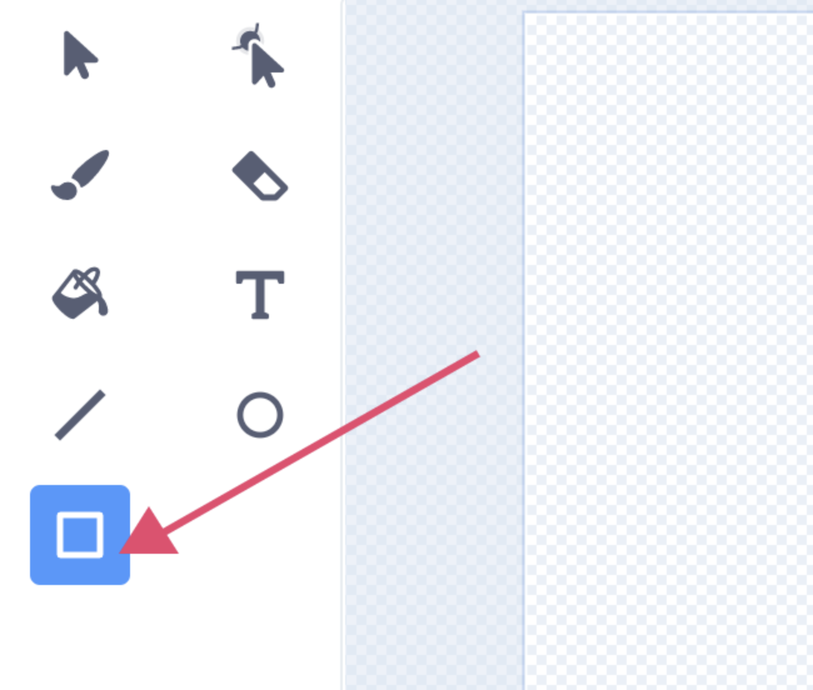

## 6 - Use the Text tool 

So that other spaceships can see that your rocket comes from Sweden, we are going to label our rocket using the Text tool. 

1. Select the Text tool and change the fill colour to the colour you want to write in. 
2. Click inside the rectangle to choose where you will start writing.  
3. Type the text “SNSA”. 

> SNSA stands for Swedish National Space Agency. In Swedish it is called Rymdstyrelsen. 
> If you are not happy with where your text is located, you can move it using the Move tool or clicking it and dragging it. 

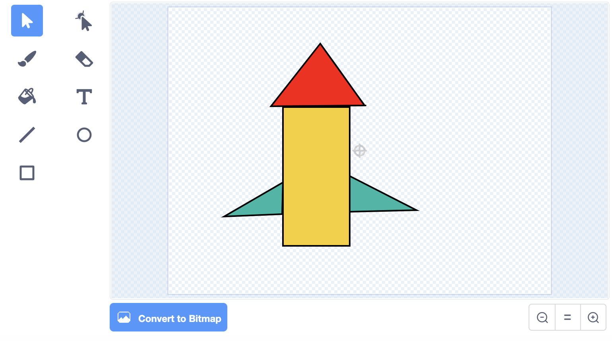

## 7 - Personalise your rocket 

Now the basic of your rocket are finished and you can personalise it by decorating it the way you want. 

You can decorate the rocket using the following geometric shapes: rectangle, triangle, circle and square. 

> Have you seen that there is a Circle tool that works in the same way as the Rectangle tool? 

If you want to write anything else on your rocket you can use the Text tool as well. 

### Ideas and suggestions! 

For example, you could: 

- Make windows by drawing circles, triangles or squares. 
- Give your rocket a name and write the name on it. 
- Draw a star on the rocket by putting two triangles together. 

- or something completely different. You can choose! 

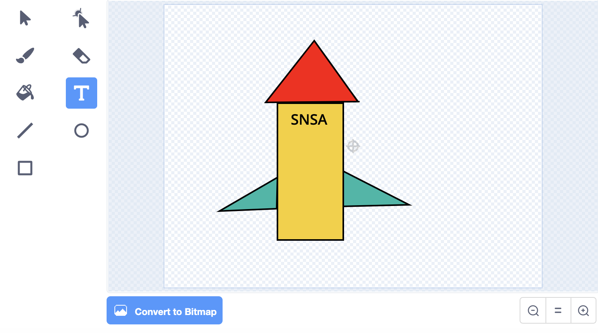

## 8 - Choose a space backdrop from the library 

Click on “Choose a Backdrop” in the lower right corner. 

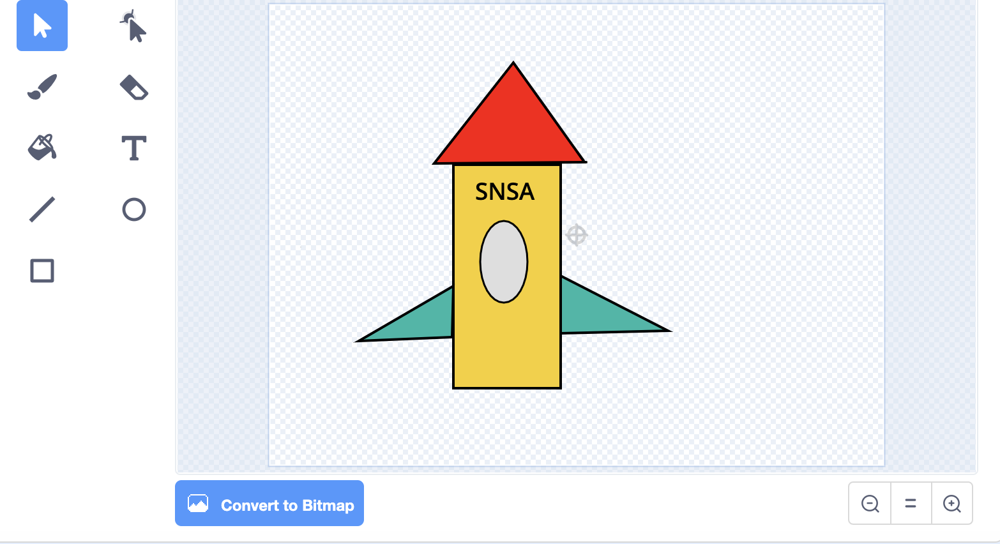

Then choose one of the space backdrops in the library. 

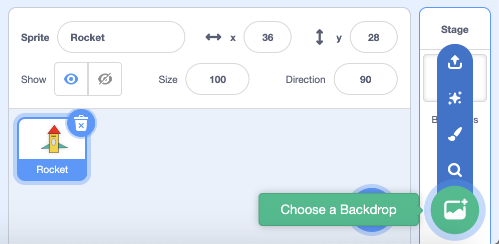

## 9 - Code the rocket so it moves 

Now we are going to code our first algorithm. We are going to make our rocket travel straight up into space. 

An algorithm, or a script as it’s called here, has to be precise, complete and in the right order. That way, if the computer will be able to understand the instructions. You can test this by answering the questions When? What? How? When you write your script. 

### When? 

Choose when the rocket will take off. When you click on the start flag? When you click on the rocket? When you press a key on the keyboard? 

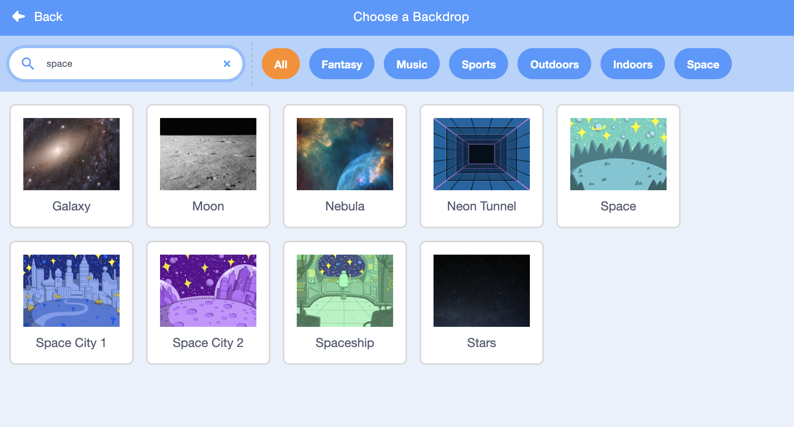

Explore the Events category to find a block that says when something will happen. 

### What? 

The rocket must travel upwards, into space. So it must move – look in the category called *Motion*. Which block of script do you want to move here? 

Tip: You can’t use “go” because that is in the wrong direction... what do you want to use? Glide? Change? 

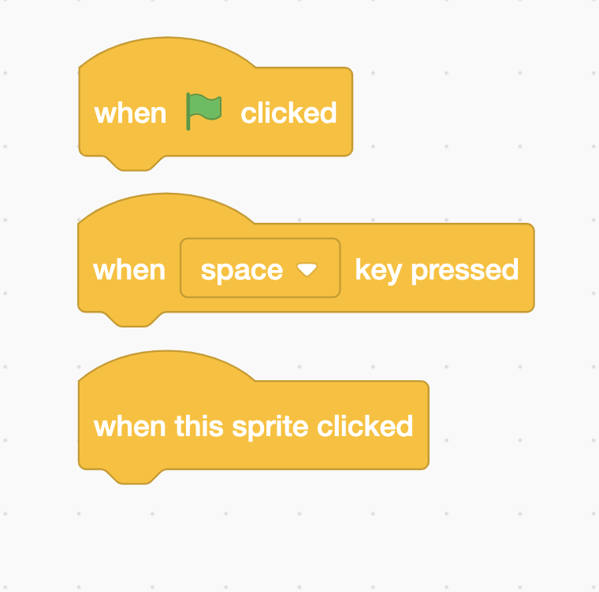

### How? 

How do you want to rocket to move? What direction should it move? 

We want it to travel upward! We need to use coordinates. The rocket has a coordinate to keep track of its location. A coordinate is composed of a number for X and a number for Y. Maybe you’ve already noticed that your rocket has a coordinate? 

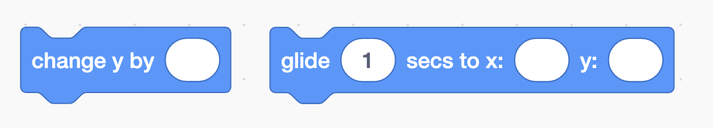

If you change X, the rocket will move to the left or right. A higher number moves it to the right and a lower one to the left. 

If you change Y, the rocket moves up or down. A higher number moves it upwards and a lower one downwards. 

**We want the rocket to travel upwards.** Can you find a block for **change y**? 

Click on the block. Does the rocket move upwards? 

### Other things to try: 

How far do you want to travel? Change the value in the block and test what happens when you use a big number or a small number. 

There is a block called **forever**. Try putting your change **y** block inside this block and see what happens. 

## Finished! 

Now you have made a space rocket. Nice work! 

You can use this space rocket for the other tasks in Space theme on kodboken.se. 

### Save 

Don’t forget to save your project! You can give it the same name as this task, so it is easy to find it again. 

> **Test your project**
> Show someone what you have created and let them test it. Click on SHARE so that others can find your game on Scratch. Go to the project page and let someone else try the game! 
