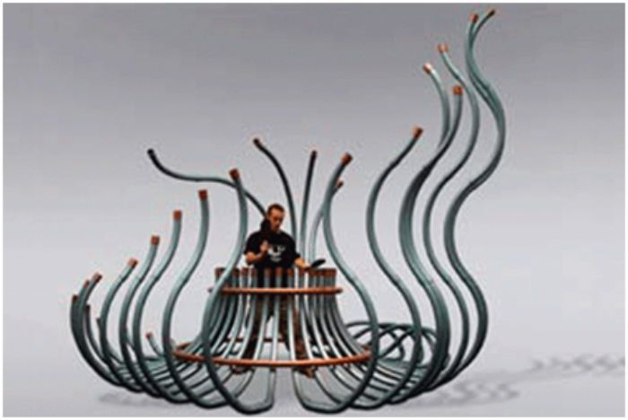
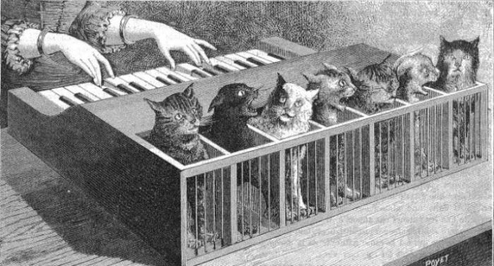
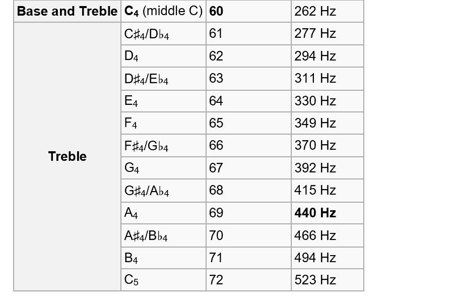

# Imaginary music

What would you like your very own instrument to look and sound like? In the past, there were only acoustic instruments such as piano, violin, guitar or sitar to play music on. Today, there are electric instruments and computers that can play almost any incredible digital sound there is. Here you can create your own imaginary instrument that works and sounds just the way you want it to!

In the example below we have coded an imaginary synth using crabs as keys. Click on the green flag to play on it. Use the computer keys A, S, D, F, G, H, J, K. They form a C-scale:
 <a href="https://scratch.mit.edu/projects/400771414/" target="_blank">https://scratch.mit.edu/projects/400771414/
  a
</a>

... and here is a Monster instrument with choral singing that you can try. Use the computer keys A, S, D, F, G, H, J, K to play a C-scale: <a href="https://scratch.mit.edu/projects/400757584/" target="_blank">https://scratch.mit.edu/projects/400757584
  
</a> 

... and here you can test a coded piano. Use the computer keys A, S, D, F, G, H, J, K to play a C-scale: <a href="https://scratch.mit.edu/projects/398827603/" target="_blank">https://scratch.mit.edu/projects/398827603/
  
</a> 

> **HOW TO GET STARTED??** Go through this guide, step by step. <a href="https://scratch.mit.edu" target="_blank">
  But first you need to open the Scratch online coding tool by clicking the **Open Scratch** link next to the above cat or by typing  www.scratch.mit.edu </a>. In Scratch, you can code and create your own imaginary instrument with the help of our instructions.

Let’s get started on your instrument. You decide what it will look and sound like. These instructions show you how to create an imaginary synth using crabs as keys – like the example above. But, feel free to swap and change to create exactly the instrument that you want.

Go to the next chapter to start coding!

## 1: Design your idea and select key and background
You first need to figure out what your instrument should look like and choose what you are going to play on. You can draw your own images, choose ready-made shapes and backgrounds or use photos or paper drawings that you scan to your computer and upload to Scratch.

  
  

In this tutorial, we will create a crab synth that you play using the computer keys. There will be 8 "keys" consisting of 8 crabs, each with a different note.

  

But what will your imaginary instrument look like? And, how many keys do you want it to have? Each key will have one sound or note. Do you want to play on fruit? Animals? Stars? Or, maybe you want to draw your own keys in Scratch. 

Let's start creating! The video below shows how to make the first steps in Scratch. Under the video you will find full instructions with text and images. 
<video src="./ImaginaryMusic_1.mp4" controls muted height=480 width=640 />

>**WHAT SHOULD BE DONE?**

The video above explains how to:
- Remove the cat sprite
- Choose a new sprite
- Choose a new background

 
>**STEP-BY-STEP INSTRUCTIONS:**

1. First you have to select your instrument's keys. <a href="https://scratch.mit.edu" target="_blank"> Open Scratch at www.scratch.mit.edu </a> and log in to your Scratch account so you can save your project later. If you don't have an account, you can easily sign up for one for free on the Scratch site. 

When you’ve logged in, click **Create** in the upper-left hand corner of the Scratch start page to create a new project.

> **A tip!** Click on the little white globe in the upper left part of Scratch and select the language you want to work in.

2. Remove the cat figure by clicking on the trashcan on the small image of the cat below the stage. The figure will be deleted from the project.
  

> **Did you know?** All figures and objects that you use in Scratch are called **Sprites**!

3. It is time to choose a new sprite that will be the first key on your instrument. Click **choose a Sprite**, the button with a cat symbol in the lower right corner. You’ve entered the Scratch sprite library. There are lots of figures that can become keys to an instrument. Select a sprite you want as your first key. Click on the sprite to add it to your project. In our example, we have chosen a crab.
     
  
> **Did you know?** There are different sprites in Scratch, some of them move. Test by moving your mouse pointer over the sprites in the library. A sprite that moves has different images in different positions that are called "costumes." You can code the costumes to make the sprite look like it is moving, which is called animation. We’ll explain how to do that later on.

4. Now select a background that suits your instrument. Click the **choose a backdrop**-button in the lower right corner of Scratch and the backdrop library will open. Pick a background for your instrument. Where you now see the background with your sprite, is what we call a **Stage**.

  
  
> **A tip!** You can also paint your own backdrop with the Scratch built-in drawing tool. Click on the symbol with a paintbrush called **Paint**. Then click the blue button **Convert to Bitmap** before you start drawing. You find the button at the bottom of your screen under the blank surface of the drawing tool (see image below). Choose between different drawing tools and pick a color by clicking on the little colored box **Fill** at the top. See pictures below:

       
  
  

  
 
Now, let's add music!

## 2: Add the Music extension
To work with audio and music in Scratch, you need to add an Extension. The extension will add new coding blocks related to music to use.
<video src="./ImaginaryMusic_2.mp4" controls muted height=480 width=640 />

>**WHAT SHOULD BE DONE?**

The video above explains how to:
- 

 
>**STEP-BY-STEP INSTRUCTIONS:**

1. Click on the blue **Add Extension** button in the bottom left-hand corner. There you will find the different extensions to add to Scratch.

  
  
2. Click on the box **Music** *Play instruments and drums extension*, which looks like this: 

  
  
Now you have a new Music theme in your library of coding blocks and new green coding blocks for music.

  

It's time to start coding music and tones!

## 3: Select sound and set tones

Time to code the sprite that will be your first key in your instrument to play a specific note - or sound - when a specific computer key is pressed on the computer keyboard. But, how will the sprite know when to play the tone? We need to connect the computer key to the sprite using code.
<video src="./ImaginaryMusic_3.mp4" controls muted height=480 width=640 />

>**WHAT SHOULD BE DONE?**

The video above explains how to:
- 

 
>**STEP-BY-STEP INSTRUCTIONS:**

1. Click on the sprite that you want as your instrument key. It needs to be selected so that is what you code and not the background.

2. Click on the yellow code theme EVENTS (on the left hand side of Scratch) and find the coding block **when GREEN FLAG clicked**. Drag the block and drop it onto the blank script area on the right.

  

This coding block is linked to the green flag above the stage with your instrument. The flag will be the start button for your project, and the red button is the stop button.

  
  
3. Now it’s time to choose what your instrument should sound like, for example as a piano, a marimba or a chorus? Go to the MUSIC theme, find the coding block **set instrument to (1)Piano** and drag it into the script area. Place this new block directly below the first one, so that they fit together like a jig-saw puzzle. It should look like this:

  

4. Click on the word **(1)Piano** in the coding block you just added and select the instrument you want to use from the dropdown menu. In our example project with crabs, we have chosen to keep the piano sound.

  

5. For the computer to know that it should play the note for as long as a key is pressed down, we need to build a script with code that says "forever.” Here's how you code that:

From the theme CONTROL, drag the coding block **forever** to the script area and attach it under the other two coding blocks. You now have what is called a **loop**. Any coding block that you put inside the loop will run over and over again, forever.

  
  
6. You now need to add a **Condition** using a block from the CONTROL-theme called **if ... then**. Put this block inside the loop **forever**, so that it looks like this:

  
  
> **Did you know?** A condition is as a rule that you add within the code. For example, the rule might be: **IF** I press the **A** key on the computer, **THEN** a tone will be played. In a computer game, a condition could be: **IF** the character falls into the hole, **THEN** the it is Game Over.

7. Do you see the diamond shape in the condition block, between **if ... then**? This is where you will insert your coding block. Click on the SENSING theme and drag the block **key space pressed?** to just below the diamond shape. When a white border appears around the shape, drop the block and it will place itself within the diamond. See image below:

  
  
8. Time to pick the computer key that you will play the first note with. Click the word **space** in the blue block and change to the letter **a** in the dropdown menu. You have now selected the computer key **A** on your computer keyboard to play the first sound of your instrument.

  
  
9. What you need now is to pick which note that will be played when the computer key **A** is pressed. Go to MUSIC theme and drag the block **play note 60 for 0.25 beats** to inside the condition **if key a pressed? then**, so that it looks like the picture below:

  

> **Test your code!** You now have a condition that plays a note when the A key is pressed on the computer. Click the GREEN FLAG above the stage to start the script and press the A key on the computer. What happens? Do you hear anything? If not, make sure you have the speakers on and perhaps raise the volume. Otherwise, check your code!
  
**Change note and note length**: You can decide which note that should be played by clicking the number**60** in the music block you just added. A mini piano will show up with a C scale. (See the image below.) Here you can select the note you want by clicking a key on the small piano. You can also switch to higher or lower octaves with the white arrows. And, you can change for how long the note will be played by changing the number of beats in the block where it now says 0.25 beats.

  

## 4: Give the sprite a mouth to sing with
To animate your sprite means that you can make it look like it is moving, for example the crab opens and closes its mouth when it sings. You do this by coding the costume images to be switched between each other. 
<video src="./ImaginaryMusic_4.mp4" controls muted height=480 width=640 />

>**WHAT SHOULD BE DONE?**

The video above explains how to:
- Remove the cat sprite
- Choose a new sprite
- Choose a new background

 
>**STEP-BY-STEP INSTRUCTIONS:**

1. Select your sprite by clicking on the small image of your sprite below the stage. Then click on the Costumes tab, which is found in the top left-hand corner of Scratch (see images below). This is the sprite drawing tool where you can see its costumes (if it has more than one) – and, if not, create new ones.

  
 
2. Check if your sprite already has different costumes. It has several if there are more than one small image of your sprite. Our crab has two costumes, one with closed claws and one with open claws.

  
  
**A tip!** If your sprite only has one costume, you can easily create a new one by right-clicking on the small image of the sprite and choosing duplicate. This will give you two exact copies of your first costume. You can then change them, for example pick a different color or add drawings in order to create different costumes to later animate.

  

In our example, the crab already has eyes, but no mouth, so we will add one. Your sprite might already have eyes and mouth but be creative and experiment! You can change colors, make an eye blink, draw on the sprite costumes and change to whatever you want to see.

3. Let’s draw a closed mouth on our crab's first costume. Make sure the top costume is selected so that you draw on the correct image. Then click on the blue **Convert to Bitmap** button located under the drawing surface.

  

4. Choose a **color** by clicking on the small **Fill** color box and pulling the color pick sliders until you have the color you want.

  
  
5. Then choose which drawing tool you want to paint with, such as **brush** or **line** and draw a mouth onto the sprite figure. You can change the thickness of your tool for thinner or thicker lines.
  
  
  
> **A tip!** If you are not happy with your drawing, you can always reverse a few steps and redo it by clicking on the curved arrow to the left above the drawing tool.

  
  
Our crab's first costume now looks like this:

  
  
6. Click on the second costume so that it is highlighted. We want this costume to have an open mouth to look like it is singing. Draw a **circle** or something like it as the open mouth.

  

You now have a playable key for your instrument with different costumes. Time to animate the sprite so it sings!

## 5: Make the sprite sing

We are ready to **animate the sprite** so that it looks like the crab is singing when we play the notes using the computer keys. We need to add code that instructs the sprite to change costume when the note is played, which in our example means that the crab will open and close its mouth.
<video src="./ImaginaryMusic_5.mp4" controls muted height=480 width=640 />

>**WHAT SHOULD BE DONE?**

The video above explains how to:
- 

 
>**STEP-BY-STEP INSTRUCTIONS:**

1. Click the **Code** tab to move from the drawing tool back to where you can code your sprite.

  

2. Find the coding block **switch costume to...** in the theme LOOKS. Drag it to the script area and place it in the sprite's script just above the green code block **play note 60 for 0.25 beats**. Go back to the LOOKS theme and select the same code block, but this time place it directly under the green block in the script, so that it looks like this:

  
  
3. The costumes have names, which you see in the blocks you've just added. You now need to change the names so that they are not the same. You do this by clicking on the little arrow. A dropdown menu will appear where you select the sprite costumes. When you have two different costumes selected, they will change from one to the other when the note is played. In our example the crab will be singing.

  

4. It is good to pick one start costume that always appears when you press the green start flag. Especially when you have several different costumes that you want to use. In our project we always want the crab to start with a closed mouth. This is how we code it:

From the LOOKS theme, select the block **switch costume to...** and attach it under the first block **when GREEN FLAG clicked**. Doublecheck that the costume with the mouth closed is in the purple block. Now this first costume will always appear when you start playing the instrument.

  

> **Test your code!** Click on the green START flag above the **Stage**. What happens when you press the **A key** on the computer keyboard? Does the costume change so that it looks like the sprite is singing? Do you see the costumes you wanted?

Now you have an animated playable key. But we need more keys. Time to create the rest of the instrument!

## 6: Create all the keys
Let's create all the instrument's keys. If you want **the same sprite to be used for all your keys**, do this:
<video src="./ImaginaryMusic_6.mp4" controls muted height=480 width=640 />

>**WHAT SHOULD BE DONE?**

The video above explains how to:
- 

 
>**STEP-BY-STEP INSTRUCTIONS:**

1. Go to the small image of your sprite below the stage. Right click on it and select **duplicate**. Now an exact copy of your first key has been created, both the sprite character with its costumes and the code you created for the first key. Duplicate several times until you have the number of keys that you want for your instrument. **A tip:** There are 8 notes in a C-scale.

  
  
2. Now place the sprites on the stage by dragging them to where you want them to be. If the sprites look too big or small on the stage, you can change their size by changing the number next to where it says **Size**. The full size is always 100 which stands for 100%. If you change to 50 the sprite will be half as big and if you change to 200 it will be double the size.

  

3. Now you have several keys with exactly the same code and notes. To use different computer keys and play different notes, you need to change the code a little on each sprite.

Click on the second sprite below the stage to select it. Now change the code so that this sprite plays the next note in the C-scale (or pick your own note or sound) and decide which key on your computer that will play it. **A tip:** Use letters next to one another, like A, S, D, F, G, H, J, K, depending how many sprites and what you prefer. You change by going to the block **key a pressed?** in your code, and changing the **a** to another letter, such as **s**. When you’ve changed the key, click on the number **60** in the music block in your script and select the next note on the scale.

  

> **A tip!** It can be tricky to separate the different sprite keys if they all look the same. A tip is to rename them. You can also include the letter of the computer key into the new name of the sprite, such as **Crab S**. You see the name of each sprite under the stage next to where it says **Sprite**. Click on the name and type what you want it to be.

  
  
> **Do you want different looking sprites as keys?** You can absolutely choose different looking sprites. But, keep in mind that you will need to code all the sprites individually instead of copying the sprites with the code. Click **Choose a Sprite** to add new ones or draw your own sprite.
  
>**Test your code!** Click on the green START flag to test your code. What happens when you press the computer keys you have chosen? Can you hear the music? Is it the right notes? Do the right keys play the right note? If the answer is no, you need to check the code and fix it.

Now you have an instrument! In the next chapter we show you how to do more things, like make the sprites move when you play.

## 7: Create more movement (optional)
To have the sprites move around a bit more is fun and there are many different ways to code movement.Here is some examples.
<video src="./ImaginaryMusic_7.mp4" controls muted height=480 width=640 />

>**WHAT SHOULD BE DONE?**

The video above explains how to:
- 

 
>**STEP-BY-STEP INSTRUCTIONS:**

**The sprites glides:** If you want a sprite to glide back and forth between different positions, you can insert blocks from the theme MOTION called **glide 1 secs to x:... y:...** . It uses a coordinate system where **x** is horizontal (landscape) on the stage and **y** is vertical (portrait) on the stage. The center point of the coordinate system, which is called Origo, is 0 and is in the middle of the stage.

  

1. Place the block **when GREEN FLAG clicked** from the EVENTS theme somewhere on the script area. It is the same script area that you’ve used to make sprites sing.

  

2. Find the block **forever** in the theme CONTROL, drag it to the script area and attach it under the first block **when GREEN FLAG  clicked**. Now you have a loop. 

  

3. Select the block **glide 1 secs to x:... y:...** from the theme MOTION and place it inside the **forever**-loop.

  

4. The numbers for **x** and **y** show the position of the sprite on the stage, measured from the center of the sprite. To put the sprite in another position you just change the values for x and y. By moving the sprite to the place you want it to glide to, you see the values you need to enter for x and y below the stage. Write these new numbers into the coding block for x and y.

  

5. Now place one more **glide 1 secs to x:... y:...** block below the first one inside the forever loop. Then drag the sprite in the other direction to where you want it to glide. Check the new values for the position of the sprite and enter the values for x and y in the new block.

  

> **Test your code!** Does the spray move back and forth? By adjusting the seconds, you change the speed of the movement. You can also change the distance it glides with the numbers for x and y.

6. In order for a sprite to always start in a specific place, you can insert a block that provides a starting position. You place the sprite where you always want it to start. You then locate the block **go to x:... y:...** in the MOTION theme and place it directly below the yellow coding block **when GREEN FLAG clicked**.

  

Don't forget to do the same for all your sprites, but make sure you give them different x and y positions so that they don't all end up on top of each other.

> **Test your code!** Does the sprite start in the right place when you press the green flag?

7. **Resizing the sprite**: You can also create a movement so that a sprite becomes larger while it is playing and then smaller again when it is silent, as if it is moving toward you? You do this by going to the theme LOOKS and finding the block **set size to 100%**. Drag two of those blocks to the script area and place them above and below the music block within the sprite condition **if key … pressed? then**, so that it looks like this:

  
  
8. Now change the numbers in the **set size to 100%** blocks to make your sprite bigger and then smaller. Under the stage you can see the current size of your sprite. Write a number in the top size block in the script and another number in the other size block. In our example the crab changes from 100% to 70%. You decide how much you want it to change.

  
  

Don't forget to change sizes on all your sprite keys!

> **Test your code!** Do the sprites change size when you play them? Do they change back to normal size when you stop playing them? Was the size you selected good? You can always change in the code, if you want something to be different.

## 8: Add background music (optional)

If you like, you can add a cool soundtrack to loop in the background. To do this we code the backdrop that we selected in the beginning. 
<video src="./ImaginaryMusic_8.mp4" controls muted height=480 width=640 />

>**WHAT SHOULD BE DONE?**

The video above explains how to:
- 

 
>**STEP-BY-STEP INSTRUCTIONS:**

1. Click on the small image of your backdrop on the far right below the stage. You can now code the backdrop, just like with the sprites.

2. Find the block **when GREEN FLAG clicked** in the EVENTS theme and place it on the empty script page for the backdrop.

3. From the CONTROL theme, pull out the block **forever** so that the music can be looped and play over and over again.

  

4. Place the block **play sound Pop until done** from the SOUND theme in the loop.

  
  
5. When you click the green start-flag, you should hear a fast popping sound over and over again. The code is right, but we should **replace the pop sound with music**. Click on the **Sounds** tab, which you find in the upper left corner of Scratch to take you to the sound editor.

  

6. Here you see **Sound pop**. To change or add a new sound, you click on the blue button with a speaker on the bottom left-hand side of Scratch.

  
  
7. The blue button opens the Scratch audio library. If you click on the theme LOOPS at the top it will be easier to find music tracks that are suitable for looping over and over again. Listen to the sounds by moving the mouse pointer over the purple play buttons on each sound, without clicking. When you find the tune you want, click in the middle of the sound box and it is added to your project.

  
  
  
8. Click on the **Code** tab located at the top left corner of Scratch to return to the code you created on the backdrop.

  
  
9. Time to change to your new sound in the code by clicking on the white arrow next to **pop** in the coding block and selecting your new sound in the dropdown list that appears.

  
  
**Test your code!** Can you hear the background music? Are you satisfied with the sound?

>**A tip!** If you want to record your own sounds and use them for background music – or for your sprite keys? Go to the **Sounds** tab on the top to access the sound editor. At the bottom left you will find the blue button with a speaker on it and if you hover over the button (no clicking) and a menu will appear. Select the microphone and record your own sounds. When you are done with the recording, you insert them into the coding block in the same way as above by changing sound in the block from the dropdown menu where your recording will appear. Remember to name your recordings after recording. You can edit your recordings in the sound editor if you like. 
  

> **What does the numbers allocated to the notes mean?** Well, to put it simply, when you want to create notes electronically, such as a digital piano instead of a regular classical acoustic piano, you need to be able to write which note you want the instrument to play. You then use a scale with numbers for the different notes, a so-called MIDI scale. The lowest notes start at MIDI digits 1, 2, 3 ... and then the scale goes upward for higher notes. (Number 60 is note C on C-scale 4.) Examples of a C-scale with note numbers in MIDI: 
  

## Finished!
Congratulations, you have now completed the task.

  

**Don't forget to save your project!** You must be logged in to save your project. Name your instrument, so that you can easily find it again. 

**A tip:** If you are not logged in, you can save the project as a file on your computer by going to the File menu and selecting Save to your computer.

> **Test your project**
Feel free to show your Imaginary instrument to a friend and have them test it. If you like, press **Share** to allow others to find our instrument on Scratch.

## Questions

* Why can it be useful for a sprite to have multiple costumes?
* What does animation mean?
* How can you use music and notes in Scratch?

