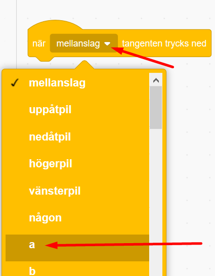
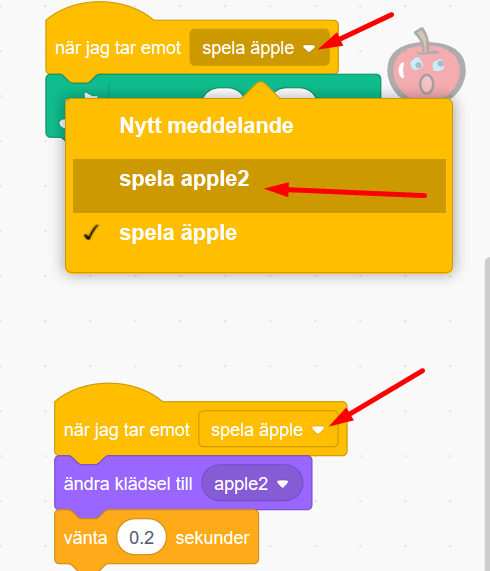

# Fantasiinstrument

Hur skulle du vilja att ditt alldeles egna instrument såg ut och lät? Förr i tiden fanns bara akustiska instrument så som piano, fiol, gitarr eller sitar att spela musik på. Idag finns elektriska instrument och datorer som kan spela upp nästan vilka otroliga digitala ljud som helst. Här ska du få skapa ditt eget kodade Fantasiinstrument som fungerar och låter precis som du vill!

I vårt exempel nedan har vi kodat en fantasisynth med äpplen som tangenter, klicka på gröna flaggan för att prova att spela på det. Använd datortangenterna a, s, d, f, g, h och dpla Blinka lilla stjärna: <a href="https://scratch.mit.edu/projects/400771414/" target="_blank">https://scratch.mit.edu/projects/400771414/
  
</a>

...och här finns ett Monsterinstrument med körsång som du kan testa. Använd datortangenterna a, s, d, f, g, h, j, k för att spela en C-skala.: <a href="https://scratch.mit.edu/projects/400757584/" target="_blank">https://scratch.mit.edu/projects/400757584
  
</a> 

... och här kan du testa ett kodat piano, använd datortangenterna a, s, d, f, g, h, j, k för att spela en C-skala: <a href="https://scratch.mit.edu/projects/398827603/" target="_blank">https://scratch.mit.edu/projects/398827603/
  
</a> 


> **HUR GÖR JAG?** Bläddra dig fram genom denna guide, steg för steg. <a href="https://scratch.mit.edu" target="_blank">
  Öppna även kodarverktyget Scratch genom att klicka på länken **Öppna Scratch** bredvid katt-figuren ovan eller via www.scratch.mit.edu</a>. I Scratch kodar och skapar du ditt fantasiinstrument utifrån instruktionerna som följer nedanför. 

Nu är det din tur att skapa ditt eget instrument. Du bestämmer själv hur det ska se ut och låta. 
Instruktionen följer exemplet av en fantasisynth med äpplen som i projektet här ovan. Men du ändrar och skapar som du vill.

Gå till nästa sida och följ instruktionen för att börja koda ditt instrument! 

## 1: Klura idé och skapa en tangent och en bakgrund
Först behöver du komma på hur ditt instrument ska se ut och välja hur tangenterna ska se ut som man spelar på.

I vårt exempelprojekt i denna instruktion skapas en äppelsynth som du spelar på med hjälp av datorns tangenter. Det kommer vara 6 "tangenter" som består av 6 äpplen med olika noter som spelas. Men hur ska ditt instrument se ut? Och hur många tangenter (och därmed ljud/noter att spela på)? Ska det vara frukter som du spelar på? Eller kanske djur? Stjärnor? Kanske rita egna tangenter? Klura ut hur du vill att ditt instrument ska se ut.

1. Nu ska du få välja ditt instruments tangenter. <a href="https://scratch.mit.edu" target="_blank"> Öppna Scratch www.scratch.mit.edu</a> och logga in med ditt Scratch-konto (Du skaffar enkelt ett gratis konto på Scratch-sidan i övre högra hörnet, om du inte redan har ett konto.). När du är inloggad klickar du sen på **Skapa** uppe till vänster på Scratch-sidan och ett nytt projekt skapas.

2. Radera först kattfiguren på scenen genom att klicka på den lilla soptunnan på den lilla bilden av katten under scenen. Då försvinner katten ur projektet. 

  

>**Visste du att?** Alla figurer och objekt som du använder i ditt Scratch-projekt kallas för **sprajtar**!

3. Dax att välja en ny sprajt-figur som ska bli en första tangent till ditt instrument. Klicka på **Välj ny sprajt**, som är den gröna knappen med en kattsymbol på i nedre högra delen av Scratch. Nu kommer du in i Scratch sprajtbibliotek. Där finns massor av figurer som kan bli instrumentets tangenter. Välj en sprajt du gillar som din första tangent. I vårt exempel har vi valt äpple som tangent.

     
  
> **Tänk på!** När du väljer sprajt i Scratch kan du välja vilken du vill, men det kan vara bra att känna till att det finns olika sprajtar - en del kan röra sig, andra inte. Det ser du om du håller muspekaren över en sprajt i sprajt-biblioteket och den rör på sig. En sprajt som rör på sig har olika "klädslar" eller bilder i olika positioner, som du senare kan koda att växla mellan för att skapa animation och rörelse i sprajten. Om du väljer en sprajt utan rörelse kommer du längre fram i instruktionen att få skapa egna klädslar för rörelse. I vårt exempelprojekt har vi skapat två olika klädslar för våra äpplen - en med stängd mun och en med öppen mun, så de ser ut att kunna sjunga.

4.	Nu ska du välja en bakgrund som passar till ditt instrument. Klicka på knappen för **Välj en bakgrund**, som finns i nedre högra hörnet av Scratch, så kommer du till bakgrundsbiblioteket. Välj vilken bakgrund du vill ha till ditt instrument. 

  
  
>**Tänk på!** Du kan även måla en egen bakgrund med ritverktyget om du vill. Klicka då istället på symbolen med en pensel som heter **Måla** som du ser i bakgrundsmenyn i bilden ovan.
  
Gå nu vidare för att lägga till musik!

## 3: Välj tillägget Musik i Scratch
När du ska jobba med ljud och musik i Scratch ska du lägga till ett tillägg för temat Musik, så du kan få fram nya kodblock för musik att koda med. Gör såhär:

1. Klicka på blå knappen **Lägg till ett tillägg** längst ned i Scratch vänstra hörn. Då kommer du till de olika tillägg som du kan välja att lägga till i Scratch.

  
  
2. Klicka på rutan med tillägget Musik, som ser ut såhär:

  
  
Nu har du fått ett nytt Musiktema i ditt bibliotek för kodblock och nya gröna kodblock för musik.

  

Nu är det dax att koda in musik och toner!

## 4: Ge tangent-sprajten en ton

Nu ska du koda den första tangent-sprajten att spela en viss ton när en viss datortangent trycks ner på datorns tangentbord. Men hur ska sprajten veta om när den ska spela sin ton? Jo, vi måste koppla datortangenten till sprajten med kod. Gör såhär:

1. 
4. Under det gula kodtemat HÄNDELSER hittar du skriptet för **när mellanslag tangenten trycks ner**. Dra in blocket och lägg på skriptytan till höger.

  

5. Ändra nu **"mellanslag"** i kodblocket till bokstaven **"a"** genom att klicka på lilla triangeln och välja **"a"** i listan. Det gör att när du kodat klart din synth så kommer en av sprajt-tangenterna att spela sin ton när du trycker på datorns a-tangent.

  

6.	Under HÄNDELSER, välj kodblocket **skicka meddelande1** och dra ut på skriptytan.

  

7. Ändra "meddelande1" genom att klicka på lilla triangeln i kodblocket och välj Nytt meddelande. 

  

8. Döp ditt nya meddelande till exempelvis **"spela äpple"** om det är ett äpple som du valt som sprajt för synthens tangenter. Annars kan du döpa den till vad du vill. Klicka OK för att skapa ditt nya meddelande.

  
  
9. Koppla ihop kodblocken i rätt ordning på skriptytan. Då ser det ut såhär:

  

10.	Nu ska vi göra ett skript för SPRAJTEN som tar emot meddelandet **"spela äpple"** så den spelar sin ton! Klicka på din tangent-sprajt så att den är markerad och vald. Då får den en blå ring runt som sig. I vårt exmpel är tangent-sprajten ett äpple. Nu är det alltså vår sprajt för syntens tangenter vi ska skapa kodskript för. 

  

11.	Under kodtemat HÄNDELSER, välj kodblocket för **När jag tar emot spela äpple** (alltså tar emot meddelandet vi nyss skapat som skickas från scenen till sprajten). Dra ut blocket på skriptytan för sprajten.

  

12.	Välj nu det nya temat Musik som du lade till tidigare,´. Du finner det långt ned till vänster, med bild med noter. Välj det gröna kodblocket för att **spela not 60 i 0.25 takter** och dra ut till skriptytan. Sätt fast det under det gula kodblocket **när jag tar emot spela äpple** .

  
  
13. Klicka på variablen **0.25** för takten i kodblocket, och skriv istället **0.5**. Det gör att tonen spelas upp lite längre stund varje gång du trycker på tangent **A** på datorns tangentbord.

  

> Testa ditt projekt! Klicka på gröna START-flaggan över SCEN för att stta igång projektet. Vad händer när du trycker på tangenten "A" på din dators tangentbord.? Visst spelas det en ton? Om du inte hör en ton - öka volymen på din dators högtalare!

> **Vad är noternas siffror?** Vad betyder siffran 60 för noten i kodblocket? Jo, förenklat kan man säga att när man vill skapa instrument digitalt, exempelvis ett digitalt piano istället för ett vanligt klassiskt akustisk piano, behöver man kunna skriva vilken not man vill att instrumentet ska spela fram. Och då använder man en skala med siffror för de olika noterna, en så kallad MIDI-skala. De lägsta (mörkaste) noterna börjar på MIDI-siffra 1, 2, 3... och sen går skalan uppåt, till 60 och långt förbi för högre (ljusare) noter. (Just siffra 60 är noten C i C-skala 4.) Exempel på en C-skala med not-siffror i MIDI:

  

## 5: Ge sprajten en mun att sjunga med

I vårt exempel jobbar vi med en äppel-sprajt, den har ingen mun att sjunga med och endast en bild utan röresle eller klädslar. I det här kapitlet guidar vi dig att skapa röresle på din sprajt, genom att skapa egna nya "klädslar" med öppen och stängd mun på don sprajt att sedan växla mellan så den ser ut att sjunga eller inte. 

Hur ska vi se vilken sprajt det är som spelar toner i din synth när du spelar på tangentbordet? Jo, om du ändrar lite på sprajtens  utseende så ser ut som om den sjunger när tonen spelas! I vårt exempel har vi ritat in en mun på våra äpplen som öppnas och stängs när den sjunger. För att göra det ska du ANIMERA sprajten, genom att byta mellan så kallade klädslar på den - med en mun som öppnas och stängs. Gör såhär:

1.	Klicka på fliken KLÄDSLAR för för din tangentsprajt. Fliken finns högst upp i vänstra hörnet av Scratch. 

  
 
Först ska du rita två ögon på äpplet (eller den sprajt du har valt). Välj vilken **färg** du vill ha genom att klicka på den färgade lilla rutan och dra i färgverktyget tills du är nöjd. Välj sen vilket ritverktyg du vill ha för att måla, exempelvis  **pensel**, **cirkel** eller **linje** och rita två ögon. Tips: När du ritat ögonen kan du dra dem dit du vill ha den om de först hamnar lite fel. 

  
  
  

2.	Nu ska du kopiera klädseln så att det blir två likadana klädslar med ögon på för din sprajt. Högerklicka på sprajtens klädsel och välj **kopiera**. Nu får du två likadana klädslar, men de heter sprajtnamnet och en siffra efter (exempelvis apple och apple2).

  

3.	Klicka nu på den första, översta klädseln, (den heter "apple" i vårt exempel), så den blir markerad med en blå ram runt sig. Rita en stängd mun på denna sprajt. Använd exempelvis **pensel** eller **linje**-verktyget. Vårt exempel ser nu ut såhär:

  !Scratch - Klädslar - ritverktyget - rita stängd mun på första klädseln](image_13.png)

4.	Klicka sen på den andra klädseln, (den heter "apple2" i vårt exempel), så den andra blir markerad istället. Måla en **cirkel** som en öppen mun, så sprajten ser ut att sjunga! Dra cirkeln till mitten på äpplet (eller den sprajt du använder) så att den öppna munnen sitter på rätt ställe.

  

**Tips:** Har du valt en annan sprajt som redan har ögon och mun? Eller en sprajt som redan har flera olika klädslar? I så fall får du redigera elelr rita och göra om bilderna som du vill, så länge som en klädsel ser ut att ha en stängd mun och en har en öppen mun - så den kan sjunga! Tänk på att du kan alltid "måla över" en sprajts mun och ögon med en ny färg.

## 6: Få äpplet att börja sjunga!

Nu ska vi ANIMERA sprajten, så den ser ut att sjunga när vi trycker på datorns tangenter för att spela noterna. 
Vi ska göra ett skript som säger åt sprajten att byta klädsel när noten i den spelas. Vi måste ju veta vilken sprajt det är som låter när tangenten trycks ned! Vi använder ett likadant skript med koder som vi använde för att spela tonen. 

1. Klicka på fliken KOD för att komma bort från fliken KLÄDSLAR med ritverktyget och tillbaka där du kan koda skript igen. 

  

2. Från tema HÄNDELSER drar du ut kodblocket: **när jag tar emot spela äpple** och lägger det på skriptytan för din sprajt. Dra sedan ut ett block från tema UTSEENDE: **byt klädsel till...** och klicka på lilla triangeln och välj **"apple2"**, klädseln med öppen mun. Nu kommer de två olika klädslarna med stängd och öppen mun att bytas mellan varandra när sprajtens ton spelas.

  
  
  
  
  
3. Efter att äpplet har spelat sin not så ska munnen stängas igen. Munnen behöver vara öppen en liten stund innan den stängs, så noten hinner spelas klart. Vi lägger till ett VÄNTA-block i koden, innan sprajten byter klädsel till stängd mun. Dra ut ett block från orangea temat KONTROLL: **vänta 1 sekunder** och ändra variablen med värdet **1** till det mindre **0.2** sekunder.

  

4. Dra ut ett till block för UTSEENDE: **byt klädsel till...**. Välj klädseln **"apple"** så att äpplet får stängd mun igen.  

  

> Testa ditt projekt! Klicka på gröna START-flaggan ovanför SCEN. Vad händer nu när du trycker på tangenten "a" på datorns tangentbord? Ändras klädseln så att det ser ut som att äpplet sjunger? Spelas tonen? (Se till att ljudet är på!)

## 7: Kopiera sprajten för fler tangenter och toner

Men vi har ju bara en ton som spelas nu. Lite tråkig synth! Nu ska du kopiera sprajten som spelar noter fem gånger och ändra i skripten för att få fem toner till i synth-instrumentet. Gör såhär:

1. Högerklicka på den lilla sprajtbilden som finns i ditt lilla sprajt-bibliotek under scenen. Välj **kopiera** så får du en kopia av din sprajt som får siffran 2 i sitt namn. 

  

2. Kopiera nu sprajten flera gånger så att du har totalt sex sprajtar - dina sex tangenter i din synth. Alla kodskript och olika klädslar som du har skapat i det den första sprajten, har också kopierats till alla de nya sprajtarna. Dom är alla likadana.

  

## 8: Ge synten alla toner

1. Klicka på den andra lilla sprajt-bilden i sprajtbiblioteket under scenen (**Apple2** i vårt exempel). 

  
  
Nu ska du ändra vilken ton denna andra sprajt ska spela och vilken tangent på datorn du ska trycka på för att den ska börja låta! Gör såhär: 

2. Byt ut värdet **60** i variabeln i kodblocket **spela not 60 i 0.5 takter** så att not G **67** spelas istället. Klicka på lilla pianot som kommer upp, till du hittar G-67, se bilden nedan:

  

3.	Markera nu SCEN för att skapa en kopia av skriptet för tangent **"a"** som nu ligger där. Högerklicka på skriptet med koden som finns och välj kopiera. Klicka sen en gång på skriptytan, så fastnar den nya kopian där. 

  
 
  
  
  

4. I den nya kopian av skriptet ska du ändra så att ett meddelande till sprajt 2 skickas när tangent **"G"** på datorns tangentbord trycks ned. Alltså, trycker du på tangent G så ska **noten G** spelas och sprajten "Apple2" ska sjunga.

  

5.	Ett nytt meddelande från SCEN behöver skickas så att rätt sprajt spelar rätt ton. Klicka på lilla pilen i kodblocket under **när g tangenten trycks ned**. Välj **"nytt meddelande"** i rullistan som kommer fram och döp det nya meddelandet till **"spela äpple 2"**. Nu har du skapat ett nytt meddelande.

  
  
  

Nu ska det finnas två skript bredvid varandra, en för tangent A på din dator och en för tangent G. Såhär ska det se ut:

  

6.	Sprajtarna måste kunna ta emot rätt meddelande också. Klicka på din sprajt nummer 2 (i vårt exempel är detta **Apple2**) i ditt sprajt-bibliotek under SCEN, så den markeras med en blå ram. Ändra i båda de skript som ligger där, så meddelandet är **när jag tar emot "spela apple2"**. Så här:

  
  
  

> Testa ditt projekt! Klicka på den gröna START-flaggan. Prova nu att trycka på a eller g! Vad händer? Spelas två olika toner?

Nu ska vi göra likadant med alla våra fem sprajtar (eller äpplen, som vi har i vårt exempel)!

7. Byt ut skripten för alla sprajtar du har kvar att fixa. Glöm inte att skapa ett nytt meddelande för att skicka från SCEN och ändra om i meddelandet som tas emot till sprajterna (sprajt3, sprajt4, sprajt5 och sprajt6). Döp meddelanden till exempelvis **"spela äpple 3"** och så vidare fram till **spela äpple 6"**.

**Glöm inte ändra alla noter för alla sprajtar!**

Du ksa skapa dessa noter ur en C-skala - tillsammans kan de skapa en känd melodi: 
* Apple ska ha not C **60** och datortangent **a**.
* Apple2 ska ha not G **67** och datortangent **g**.
* Apple3 ska ha not A **69** och datortangent **h**.
* Apple4 ska ha not F **65** och datortangent **f**.
* Apple5 ska ha not E **64** och datortangent **d**.
* Apple6 ska ha not D **62** och datortangent **s**.


> Testa ditt projekt! Klicka på gröna START-flaggan. När du är klar med alla tangenter på din fantasisynth, prova att spela följande tangenter i rad:
 **A A G G H H G F F D D S S A**.
Hör du vilken melodi du spelar? Nu kan du spela Blinka lilla stjärna på din synth!  

**Tips!**
Vill du ge din synt fler noter, så du kan spela hela C-skalor och melodier? Här finns en tabell som visar alla noternas MIDI-kod.

  


## Färdig!
Grattis, nu har du gjort klart uppgiften.

**Glöm inte att spara ditt projekt!** Du måste vara inloggad för att kunna spara. Döp det gärna till uppgiftens namn så att du enkelt kan hitta den igen.

> **Testa ditt projekt**  
Visa gärna din Fantasisynth för en kompis och låt dem testa. Tryck om du vill på DELA för att andra ska kunna hitta spelet på Scratch. 


## Frågeställningar

* Vad är ett meddelande?
* Vad kan du använda ett meddelande till?
* Varför kan det vara användbart att en sprajt har flera klädslar?
* Vad betyder animation?
* Hur kan du använda noter och toner i Scratch?
* Vad händer när du ändrar takt för tonen?


## Tips
Om du har tillgång till **Makey Makey** kan du koppla din Fantasisynth till den och spela musik på riktiga äpplen! Eller vad som helst annat som leder ström, så som metallskedar, foliebitar, kompisars händer och liknande. Makey Makey kan ses som en förlängning av datorns tangentbord, för att skapa egna styrkontroller och knappar till sitt digitala projekt.
Makey Makey är ett litet kretskort för att styra datorn med saker som är elektriskt ledande, som till exempel frukt eller metall.

> Här hittar du en instruktion till att <a href="https://www.kodboken.se/start/skapa-musik/uppgifter-i-scratch/fantasisynth-makey-makey?chpt=0"> koppla in Makey Makey till din Fantasisynth</a> och liknande projekt.


## Koda ditt piano
I denna uppgift kommer du få koda ett spel, som kommer att spela upp en melodi som du ska följa och sen spela samma melodi på ditt piano. Du kommer även att få lära dig lite grundläggande om noter. 

Följ instruktionen på denna sida medan du steg för steg bygger koden för ditt pianoprogram i vertyget Scratch. Dax att börja koda!

> <a href="https://scratch.mit.edu/projects/311971291/editor/">Starta med att klicka på bilden nedan för att öppna ett startprojekt.
</a>


01. På scenen i projektet finns en bakgrundsbild av ett piano. Låt oss se närmare på den. Klicka på **Scen** i nedre högra hörnet för att aktivera den och klicka sen på fliken **Bakgrunder** i övre vänstra hörnet. Se bilderna här under, så vet du vad du ska leta efter.

    


02. Här ser du att det finns 9 bakgrunder för ditt piano. Varje bakgrund representerar en vit tangent på pianot. Namnet på bakgrunden visar  vilken ton den spelar på pianot i en C-skala.


> C-skalan i ditt piano ska bestå av 8 noter som är: **C D E F G A B C**.


03. Längst till vänster ser du olika kategorier som heter **"Rörelse"**, **"Utseende"**, **"Ljud"** m.m. Under varje kategori finns olika block du kan programmera med. I denna uppgift kommer du främst att använda block från **"Utseende"**, **"Händelse"** och **"Musik"**.


Nu är det dax att välja ljud till ditt piano. Klicka på nästa avsnitt nedan för att gå vidare.

---

## 1 - Välja instrument

Första ska du programmera så att programmet alltid visar rätt bakgrund av pianot när det börjar, och sen äcven koda in vilket sorts instrument det ska kunna spela fram ljud från. Till att börja med ska du välja ett piano som ditt instrument. 
Om du vill kan du senare testa att byta till ett annat instrument och ljud. 
Då börjar vi! 

01. Klicka på fliken **Kod** i övre vänstra hörnet, så kommer du tillbaka till verktyget där du kan koda ditt musikprogram.


Den gröna flaggan över ditt piano på Scenen är en Start-knapp för musikprogrammet du ska skapa.


02. Nu ska vi lägga in kod. Kodblocken i bilden nedan behövs för att börja bygga programmet som styr hur ditt piano ska fungera:


De tre kodbitarna finns redan inlagda på projektets kodyta. Kan du koppla ihop dem nu så att de fungerar? De passar ihop som pusselbitar.


När du pusslat klart, kan du klicka dig vidare till nästa steg. 
Dax att koda så att du kan spela noter på ditt piano.

---

## 2 - Spela en not

Nu ska du koda så att du kan spela på pianot med hjälp av tangentbordet på datorn. Du måste lägga in instruktioner med kod för hur pianot ska kunna spelas i programmet du bygger, annars vet inte programmet hur instrumentet ska låta eller fungera.

Dessa block behöver du ha för att koppla noter till tangentbordets knappar:


I ditt projekt finner du några av dessa block inlagda på kodytan. Nu ska du pussla ihop dem rätt och göra lite ändringar. 

01. På blocket ``` När mellanslag tangenten trycks ned ``` väljer du istället bokstaven **a**. (Klicka på lilla vita pilen på blocket, så får du fram en lista med val, och kan välja tangent **a** istället.)

Nu ska du välja en bakgrund med pianobild som ska visa fram **vilken ton du spelar** när du trycker på **a-tangenten** på datorns tangentbord.

02. På blocket ``` Byt bakgrund till ``` väljer du **Not-C**. Detta betyder att du kommer att spela noten C på pianot.

03. På blocket **``` Spela not 60 i 0.25 takter ```** klickar du på siffran 60. Då får du upp ett litet piano, där du väljer **not C(60)**. 

04. Pussla ihop de tre blocken och testa din kod!

> Testa ditt program! Starta genom att klicka på den **gröna flaggan** ovanför pianot på Scenen och tryck på tangenten **a** på din datorns tangentbord. Ser du att du spelar noten C på pianot? Hör du tonen spelas?

Toppen! Då kan du koda färdigt ditt piano. Bläddra dig vidare för att se hur du kan göra det.

---

## 3 - Resten av noterna

Nu har du kodat ett C i sitt instruments C-skala. Dax att programmera resten av noterna i skalan. Du finner kodbitar att jobba med under de olika teman som finns i vänstra kanten. 

> Tips! Håll koll på vilka färger du använt på dina kodblock, det är en ledtråd för vart du hittar fler sådana block under olika teman.

För varje ny not i skalan du vill skapa, gör du dessa tre steg:

01. Dra ut blocket ``` När mellanslag tangenten trycks ned ``` och ändra till en bokstav istället (någon av tangenterna **s, f, g, h, j, k** )
02. Dra ut blocket ``` Byt bakgrund till ``` och ändra till **Not-** istället (noter i din C-skala: **D, E, F, G, A, B, C**)
04. Dra ut blocket ``` Spela not 60 i 0.25 takter ``` och klicka på siffran 60. Då kommer du få upp ett litet piano där du kan välj en ny not. (Ange istället **D(62) E(64) F(65) G(67) A(69) B(71) C(72)**)

Bokstavstangenterna du ska använda på din dator är **s, f, g, h, j, k** och noterna du ska lägga in är **D(62) E(64) F(65) G(67) A(69) B(71) C(72)**.	

> När du kodat färdigt alla noter och tangenter kan du testa koden. Kan du spela hela C-skalan nu?

---

## 4 - Hemligt meddelande
Med kod kan man skapa en massa saker. Nu ska du få skapa ett hemligt meddelande som får något att hända i ditt program. 

01. Börja med att klicka på **Scen** i nedre högra hörnet, så att du är säker på att bakgrunden är vald för att kodas. (viktigt att du har bakgrunden som visar blå markering på första tangent C i din skala. Om inte rätt bakgrund, klicka på **Scen**, sedan fliken **Bakgrunder** och markera rätt bakgrund som heter **Not-C**.)

02. Klicka på gula kategorin **Händelser** och dra ut blocket ``` Skicka din tur ``` . Klicka på orden din tur och ändra till **hemligt meddelande**. 

03. Dra även ut blocket ``` När gröna flaggan klickas på ``` och koppla ihop de två gula kodblocken. 

Tryck sedan på den gröna flaggan ovanför Scenen och se vad som händer! Lyssna noga!

> Kan du spela samma melodi som precis spelades upp?


---

## 6 - En utmaning

Skulle du kunna med blocket som är i bilden nedan fråga efter varje not du spelar och spelaren skriva in notens namn?


Lägg in kodblocket i ditt program och testa koden. 
 
---

## 7 - Färdig!

Grattulerar! Nu har du gjort ett piano som kan spela en C-skala. Att koda musik är kul! Vilket instrument vill du nu koda?


