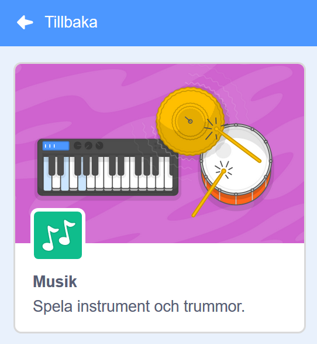
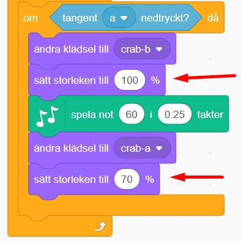

# Fantasimusik

Hur skulle du vilja att ditt alldeles egna instrument såg ut och lät? Förr i tiden fanns bara akustiska instrument så som piano, fiol, gitarr eller sitar att spela musik på. Idag finns elektriska instrument och datorer som kan spela upp nästan vilka otroliga digitala ljud som helst. Här ska du få skapa ditt eget kodade Fantasiinstrument som fungerar och låter precis som du vill!

I vårt exempel nedan har vi kodat en fantasisynth med krabbor som tangenter, klicka på gröna flaggan för att prova att spela på det. Använd datortangenterna A, S, D, F, G, H, J, K som bildar noterna i en C-skala: <a href="https://scratch.mit.edu/projects/400771414/" target="_blank">https://scratch.mit.edu/projects/400771414/
  a
</a>

...och här finns ett Monsterinstrument med körsång som du kan testa. Använd datortangenterna A, S, D, F, G, H, J, K för att spela en C-skala.: <a href="https://scratch.mit.edu/projects/400757584/" target="_blank">https://scratch.mit.edu/projects/400757584
  
</a> 

... och här kan du testa ett kodat piano, använd datortangenterna A, S, D, F, G, H, J, K för att spela en C-skala: <a href="https://scratch.mit.edu/projects/398827603/" target="_blank">https://scratch.mit.edu/projects/398827603/
  
</a> 

> **HUR GÖR JAG?** Bläddra dig fram genom denna guide, steg för steg. <a href="https://scratch.mit.edu" target="_blank">
  Öppna även kodarverktyget Scratch genom att klicka på länken **Öppna Scratch** bredvid katt-figuren ovan eller via www.scratch.mit.edu</a>. I Scratch kodar och skapar du ditt eget fantasiinstrument utifrån instruktionerna som följer nedanför. 

Nu är det din tur att skapa ditt eget instrument. Du bestämmer själv hur det ska se ut och låta. 
Instruktionen följer exemplet av en fantasisynth med krabbor som i exempelprojektet här ovan. Men du ändrar som du vill.

Gå till nästa sida för att börja koda! 

## 1: Klura idé och välj tangent och bakgrund
Först behöver du komma på hur ditt instrument ska se ut och även välja hur tangenterna som man spelar på ska se ut. Du kan rita eget i Scratch, välja färdiga figurer och bakgrunder eller till och med fota eller rita och scanna till datorn och ladda upp från datorn till Scratch. Hur ska ditt instrument se ut? 

  
  
  

I vårt exempelprojekt i denna instruktion skapas en krabb-synth som du spelar på med hjälp av datorns tangenter. Det kommer vara 8 "tangenter" som består av 8 krabbor med olika noter som spelas. 

  

Men hur ska ditt instrument se ut? Och hur många tangenter vill du ha (och därmed ljud/noter att spela på)? Ska det vara frukter som du spelar på? Eller kanske djur? Stjärnor? Kanske rita egna tangenter? Klura ut hur du vill att ditt instrument ska se ut.

Dax att börja koda. I videon nedan kan du se hur du gör första stegen. In under videon finns full instruktion med text och bilder.
<video src="./Fantasimusik_1.mp4" controls muted height=480 width=640 />

>**VAD SKA JAG GÖRA?**

Se i videon ovan hur du ska:
- Ta bort kattfiguren
- Välj ny sprajt
- Välj ny bakgrund

 
>**INSTRUKTION HUR JAG GÖR STEG-FÖR-STEG:**

1. Nu ska du få välja ditt instruments tangenter. <a href="https://scratch.mit.edu" target="_blank"> Öppna Scratch på  www.scratch.mit.edu</a> och logga in med ditt Scratch-konto, så du kan spara ditt projekt sen. Om du inte redan har ett konto skaffar du enkelt ett gratis sådant på Scratch sajt. 
När du är inloggad klickar du på **Skapa** uppe till vänster på Scratch-sidan och ett nytt projekt skapas.

>**Tips!** Öppnas Scratch i fel språk, så kan du alltid ändra. Klicka på den lilla vita jordglob-bollen i Scratch övre vänstra del och välj språket du vill ha. Denna instruktion är för Scratch på svenska. 

2. Radera först kattfiguren på scenen genom att klicka på soptunnan på den lilla bilden av katten under scenen. Då försvinner figuren ur projektet. 

  

>**Visste du att?** Alla figurer och objekt som du använder i ditt Scratch-projekt kallas för **sprajtar**!

3. Dax att välja en ny sprajt-figur som ska bli en första tangent till ditt instrument. Klicka på **Välj ny sprajt**, som är knappen med en kattsymbol på i nedre högra delen av Scratch. Nu kommer du in i Scratch sprajtbibliotek. Där finns massor av figurer som kan bli instrumentets tangenter. Välj en sprajt du gillar som din första tangent, klicka på den för att lägga till i ditt projekt. I vårt exempel har vi valt en krabba.

     
  
> **Bra att veta!** Det finns olika sprajtar i Scratch - en del kan röra sig, andra inte. Det ser du om du håller muspekaren över en sprajt i sprajt-biblioteket och den rör på sig. En sprajt som rör på sig har olika bilder i olika positioner som kallas för "klädslar", som du kan koda att växla mellan för att skapa animation och rörelse i sprajten. 

4.	Nu ska du välja en bakgrund som passar till ditt instrument. Klicka på knappen för **Välj en bakgrund** i nedre högra hörnet av Scratch, så kommer du till bakgrundsbiblioteket. Välj den bakgrund du vill ha till ditt instrument. 

  
  
>**Tips!** Du kan även måla en egen bakgrund med ritverktyget. Klicka då istället på symbolen med en pensel som heter **Måla**. Sedan klickar du på den blå knappen som heter **Gör till Bitmap** innan du börjar rita, så blir målandet enklare. Knappen finns längst ned under ritverktygets tomma yta. Välj mellan olika verktyg att måla med och byt färg genom att klicka på den lilla färgade rutan överst, så kommer färgväljaren fram. Se bilder nedan:

       
  
  

  
 
Gå nu vidare för att lägga till musik!

## 2: Välj tillägget Musik
När du ska jobba med ljud och musik i Scratch lägger man till ett tillägg för Musik. Då får du nya kodblock för musik att koda med.
<video src="./Fantasimusik_2.mp4" controls muted height=480 width=640 />

>**VAD SKA JAG GÖRA?**

Se i videon ovan hur du ska:
- Lägg till tillägget Musik

 
>**INSTRUKTION HUR JAG GÖR STEG-FÖR-STEG:**

1. Klicka på blå knappen **Lägg till ett tillägg** längst ned i Scratch vänstra hörn. Då kommer du till de olika tillägg som du kan välja att lägga till i Scratch.

  
  
2. Klicka på rutan med tillägget Musik, som ser ut såhär:

  
  
Nu har du fått ett nytt Musiktema i ditt bibliotek för kodblock och nya gröna kodblock för musik.

  

Nu är det dax att börja koda in musik och toner!

## 3: Välj ljud och sätt toner

Nu ska du koda den första tangent-sprajten att spela en viss ton - eller ljud - när en viss datortangent trycks ner på datorns tangentbord. Men hur ska sprajten veta om när den ska spela sin ton? Jo, vi måste koppla datortangenten till sprajten med kod.
<video src="./Fantasimusik_3.mp4" controls muted height=480 width=640 />

>**VAD SKA JAG GÖRA?**

Se i videon ovan hur du ska:
- Lägg till kod som bestämmer vilket instrument som ska spelas
- Skapa en loop
- Skapa ett villkor *om...då*
- Känna av datortangent "a"
- Spela en not när tangenten är nedtryckt

 
>**INSTRUKTION HUR JAG GÖR STEG-FÖR-STEG:**

1. Klicka på den lilla bilden av din tangent-sprajt, så att den är vald och du kodar på din första tangent. 

2. Under det gula kodtemat HÄNDELSER finns kodblocket **När GRÖN FLAGGA klickas på**. Dra in blocket och lägg det på den tomma skriptytan till höger.

  

Kodblocket hör ihop med den gröna flaggan ovanför scenen med ditt påbörjade instrument. Flaggan ovanför scenen fungerar som en Start-knapp för ditt projekt, och den röda är en stoppknapp.

  
  
3. Nu ska du välja hur ditt instrument ska låta, exempelvis som ett piano, en marimba eller kör? Under tema MUSIK väljer du kodblocket **sätt instrument till piano** och drar in det på skriptytan. Fäst blocket direkt under det första, så de sittar ihop som två pusselbitar. Då ser det ut såhär:

  

4. Klicka på ordet **piano** i kodblocket så kan du välja andra instrumentljud genom att klicka på det du vill ha i listan som kommer fram. I vårt exempel med krabbor har vi valt piano-ljud.

  

5. Nu ska vi bygga ett skript med kod som säger att "för alltid, om tangent **A** på datorns tangentbord är nedtryckt, då ska instrumentets tangent (krabban) spela en vald ton, ända tills datortangenten **A** inte längre är nedtryckt. Gör såhär: 

Från tema KONTROLL drar du in kodblocket **för alltid** och fäster det under de andra två kodblocken på skriptytan. Detta är en **loop**, som gör att all kod du lägger inuti loopen körs om och om igen, för alltid. 

  
  
6. Nu ska du lägga till ett så kallat villkor med ett block från tema KONTROLL som heter **om...då**. Lägg det inuti loopen **för alltid**, så det ser ut såhär: 

  
  
>**Bra att veta!** Ett villkor är som en regel som man lägger in i koden. Exempelvis kan regeln vara: **OM** jag trycker ned tangenten **A** på datorn, **DÅ** ska en viss ton spelas. I ett spel skulle ett villkor kunna vara: **OM** gubben ramlar ner i lavan, **DÅ** blir spelet Game Over.

7. Ser du det kantiga hålet i villkorsblocket, mellan **om...då**? Där ska vi lägga in ett kodblock. Gå till tema KÄNNA AV och dra ut blocket **tangent mellanslag nedtryckt?**. Dra in blocket snett underifrån det kantiga hålet i blocket mellan **om...då**. När det syns en vit kant omkring hålet kan du släppa blocket så lägger det sig inuti. Se bilden nedan:

  
  
8. Nu ska vi bestämma rätt datortangent. Klicka på ordet **mellanslag** i det blå blocket och byt till bokstaven **a** längre ned i listan som kommer upp. Det är alltså datorns tangent **A** på ditt tangentbord. 

  
  
9. Nu ska du lägga till vilken not som ska spelas när A trycks ned. Under tema MUSIK drar du in blocket **spela not 60 i 0.25 sekunder**. Lägg det inuti villkoret **om tangent a nedtryckt? då**, så det ser ut som i bilden nedan:

  

>**Testa koden** Nu har du ett villkor som spelar en not när tangenten A trycks ned på datorn. Klicka på den GRÖNA FLAGGAN ovanför scenen för att starta koden och tryck på tangenten A på datorn. Vad händer? Hör du tonen? Om inte, kontrollera att du har högtalarfunktionen på på datorn och bra volym. Kolla annars att koden blivit rätt.
  
**Ändra not och notlängd**. Du kan bestämma vilken not som ska spelas genom att klicka på siffran **60** i musikblocket du just lade in. Då får du fram ett litet piano med en C-skala. (Se bilden nedan.) Här kan du välja vilken not du vill ha genom att klicka på tangenten på det lilla pianot. Du kan även byta till högre eller lägre oktaver med den lilla vita pilen i övre hörnet. Du kan även ändra hur länge noten ska spelas, genom att ändra antal sekunder i blocket där det nu står 0.25 sekunder. Förslagsvis kan 0.5 fungera bra, alltså en halv sekund.

  

## 4: Ge sprajten en mun att sjunga med
Klädslar är olika bilder av sprajten där den har olika positioner eller ser olika ut. Genom att koda att klädsel-bilderna byts mellan vid olika tillfällen skapas en känsla av rörelse, exempelvis att krabban får en mun som öppnas och stängs när den sjunger. Om sprajten rör sig så syns det vilken tangent som spelas.
<video src="./Fantasimusik_4.mp4" controls muted height=480 width=640 />

>**VAD SKA JAG GÖRA?**

Se i videon ovan hur du ska:
- Gå till sprajtens klädslar på fliken som heter Klädslar
- Rita en stängd mun på en klädsel
- Rita en öppen mun på nästa klädsel

 
>**INSTRUKTION HUR JAG GÖR STEG-FÖR-STEG:**

1.	Markera din sprajt (lilla bilden under scenen) så den är vald. Klicka sen på fliken KLÄDSLAR, den finns finns högst upp i vänstra hörnet av Scratch. Nu kommer du till sprajtens ritverktyg och kan se dess klädslar - och skapa nya.

  
 
2. Kontrollera om din sprajt redan har olika klädslar. Den har flera om det finns mer än en liten bild av din sprajt längst till vänster. Vår krabba har två klädslar, en med öppen klo och en med stängd klo. 

  
  
**Tips!** Om du bara har en klädsel i din sprajt kan du enkelt skapa fler genom att högerklicka på lilla bilden av sprajtens klädsel och välja kopiera. Då får du två likadana klädslar. Sedan kan du ändra i dem, exempelvis färger eller rita till något. Som den här banan-sprajten till exempel, som bara har en klädsel:
  

I vårt exempel har vår krabba redan ögon, men ingen mun. Hur din sprajt ser ut vet vi inte, kanske har den redan ögon och mun, men du kan leka med att ändra färger, göra ett öga som ser ut att blinka, rita dit något på de olika sprajtarnas klädslar eller liknande. 

3. Nu ska vi rita en stängd mun på vår krabbas första klädsel. Se till att den översta klädseln är markerad och vald för att rita på rätt bild. Klicka även på blå knappen **Gör till bitmap** som finns under ritverktyget.

  

4. Välj vilken **färg** du vill ha genom att klicka på den färgade lilla rutan och dra i färgverktygets reglage tills du är nöjd. 

  
  
5. Välj sen vilket ritverktyg du vill ha för att måla, exempelvis  **pensel** eller **linje** och rita din mun. Du kan även ändra tjockleken på ditt verktyg för att måla tunnare eller tjockare linjer.
  
  
  
>**Tips!** Om du ritar fel och ångrar dig kan du alltid backa några steg och göra om. Klicka på den böjda pilen åt vänster som finns  ovanför ritverktyget.

  
  
Nu ser vår krabbas första klädsel såhär glad ut:

  
  
6.	Klicka sen på den andra klädseln, så den andra blir markerad istället. Den ska få en öppen mun som ser ut att sjunga. Måla en **cirkel** eller liknande som en öppen mun.

  

Nu har du en tangent som går att spela på och som har olika klädslar. Dax att animera så sprajten rör på sig!

## 5: Få sprajten att sjunga!
Nu ska vi ANIMERA sprajten, så den ser ut att sjunga när vi trycker på datorns tangenter för att spela noterna. 
Vi lägger till kod som säger åt sprajten att byta klädsel till den med öppen mun när den spelas.
<video src="./Fantasimusik_5.mp4" controls muted height=480 width=640 />

>**VAD SKA JAG GÖRA?**

Se i videon ovan hur du ska:
- Klicka på KOD-fliken för att komma till skriptytan för sprajten
- Lägg in två block för att ändra klädsel inom villkoret
- Ändra så att det är två olika klädslar som visas
- Lägg till ett likadant block för ändra klädsel i toppen, så rätt klädsel alltid visas när startflaggan klickas på

 
>**INSTRUKTION HUR JAG GÖR STEG-FÖR-STEG:**

1. Klicka på fliken KOD för att komma bort från ritverktyget och tillbaka där du kan koda skript igen. 

  

2. Från tema UTSEENDE drar du ut blocket **ändra klädsel till...**. Lägg in det i sprajtens kodskript så det hamnar precis ovanför det gröna kodblocket **spela not 60 i 0.25 sekunder**. Dra sedan in ett till likadant block med **ändra klädsel till...** och lägg det direkt under det gröna blocket, så det ser ut såhär:

  
  
3. Klädslarna har namn och namnet står i blocket du lade in. Du behöver ändra i blocket så att det är olika klädslar som den byter mellan. Klicka på namnet på klädseln i det första kodblocket du lade till så får du upp en lista med sprajtens klädslar. Klicka på den du vill ha. Nu kommer de två olika klädslarna med öppen och stängd mun att bytas mellan varandra när sprajtens ton spelas.

  

Ibland kan man ha många olika klädslar som man vill variera mellan. Då kan det vara bra att alltid ha en utvald start-klädsel som alltid visas när du trycker på den gröna flaggan för start. En bestämd klädsel att starta med. Vi vill att munnen alltid ska vara stängd när projektet börjar. Vi måste koda in det!

4. Från tema UTSEENDE drar du ut blocket **byt klädsel till...** och fäster det direkt under det första blocket **när GRÖN FLAGGA klickas på**. Se till att rätt klädsel med stängd mun står i det lila **byt klädsel till...**-blocket. Nu kommer alltid denna första klädsel visas när du startar instrumentet. När du är klar ska all kod se ut såhär:

  

>**Testa ditt projekt!** Klicka på gröna START-flaggan ovanför SCEN. Vad händer nu när du trycker på tangenten "A" på datorns tangentbord? Ändras klädseln så att det ser ut som att äpplet sjunger? Visas rätt klädslar som du vill? Spelas tonen?

Nu har du en tangent som går att spela på och som rör på sig. Men vi behöver fler tangenter. Dax att skapa hela instrumentet!

## 6: Skapa alla tangenter
Nu ska vi skapa instrumentets alla tangenter. Om du vill ha **likadana sprajtar till alla dina tangenter**, precis som i vårt krabb-instrument, kan du enklast göra såhär:
<video src="./Fantasimusik_6.mp4" controls muted height=480 width=640 />

>**VAD SKA JAG GÖRA?**

Se i videon ovan hur du ska:
- Kopiera sprajten
- Ändra storlek på sprajtar
- Byta datortangent som ska användas för att spela sprajtens ton
- Byta not som ska spelas av sprajten

 
>**INSTRUKTION HUR JAG GÖR STEG-FÖR-STEG:**

1. Gå till den lilla bilden av din sprajt-tangent under scenen med ditt instrument. Högerklicka på den och välj kopiera. Nu skapas en exakt kopia av din första tangent, såväl sprajtfiguren med dess klädslar som den kod du lade in på den första sprajt-tangenten. Kopiera fler så att du får alla tangenter du vill ha till ditt instrument. 

  
  
2. Placera nu ut tangenterna på scenen genom att dra dem dit du vill ha dem. Ändra även sprajtarnas storlek om de ser för stora eller för små ut. Det gör du genom att ändra storleken på sprajten där det står **Storlek** i rutan under scenen med ditt projekt. 100 står för 100% full storlek. Testa dig fram tills du blir nöjd.

  

Nu har du flera tangenter med exakt samma kod och noter för alla. Nu behöver du ändra lite i koden på varje tangent, så de får en annan datortangent att spelas med och en egen not. 

2. Välj den andra av de kopierade tangenterna bland de små bilderna under scenen, klicka på den så den blir markerad. Ändra nu i koden på denna tangent så att den får nästa ton i skalan (eller den ton du vill ha) samt rätt datortangent på tangentbordet. Förslagsvis kan du spela med tangetbordets A, S, D, F, G, H, J, K om du vill ha en enkel C-skala. Ändra genom att klicka på a i tangentblocket och ändra till s, samt klicka på siffran 60 i musikblocket och välj nästa ton i skalan.

  

>**Tips!** Det kan vara snurrigt att skilja de olika sprajt-tangenterna åt om de alla ser så lika ut. Ett tips är att döpa om dem. Det kan vara smart att lägga in datortangentens bokstav i sprajtens nya namn, exempelvis **Krabba S**. Du ändrar namn under scenen med ditt instrument där det står **Sprajt** och dess namn. Klicka på namnet och skriv ett du vill ha istället.

  
  
>**Vill du ha olika sprajtfigurer som tangenter?** Det går givetvis bra att välja olika sprajtfigurer. Men tänk då på att du kan behöva koda alla sprajtarna för hand som den första istället för att kopiera sprajtar och koden. Klicka på **Välj ny sprajt** för att lägga till sprajtar, eller måla egna sprajtar.
  
>**Testa ditt projekt!** Klicka på gröna START-flaggan över SCEN för att sätta igång projektet. Vad händer när du trycker på datorangenterna du valt? Visst spelas det toner? Är det rätt toner så som du vill ha det? Om du inte hör en ton - kolla koden så allt blivit rätt på de olika sprajt-tangenterna. Och kolla volymen på datorn.

Nu har du ett instrument! Om du vill kan du gå vidare och skapa mer kul med det på nästa avsnitt.

## 7: Skapa mer rörelse (valbart)
Det är roligt när sprajtarna rör sig lite mer. Det finns många olika sätt att koda rörelse på, här kommer några exempel du kan prova.
<video src="./Fantasimusik_7.mp4" controls muted height=480 width=640 />

>**VAD SKA JAG GÖRA?**

Se i videon ovan hur du ska:
- Skapa nytt skript med *när grön flagga klickas på*
- Skapa en loop
- Skapa glidande rörelee på sprajten med blocket *glid 1 sek till x:... y:...*
- Sätt en startposition på sprajten där den ska stå när instrumentet startas

 
>**INSTRUKTION HUR JAG GÖR STEG-FÖR-STEG:**

**Sprajtarna glider:** Om du vill att sprajtarna ska glida till olika positioner kan du lägga in block från tema rörelse som heter **glid 1 sekunder till x:... y:...**. Detta representerar ett koordinatsystem där **x** är vågrätt (liggande) på scenen och **y** är lodrätt (stående) på scenen. Mittpunkten, som kallas för origo är 0 och det är mitt på scenen. 

  

1. Från tema HÄNDELSER drar du ut blocket **när GRÖN FLAGGA klickas på**. Lägg det fritt på första sprajt-tangentens skriptyta. 

2. Från tema KONTROLL drar du ut blocket **för alltid** och fäster det under blocket med flaggan. Det är alltså en loop.

  

3. Från tema RÖRELSE drar du nu ut blocket **glid 1 sekunder till x:... y:...** och lägger det inuti **för alltid**-loopen.

  

3. De siffror som nu står i blocket efter x och y är den position sprajten just nu står på scenen, i mittpunkten av sprajtfiguren. Om du vill att sprajten ska glida fram och tillbaka hela tiden, kan du ändra på siffrorna för x och y. Dra först din sprajt dit du vill att den först ska glida till, någon centimeter åt sidan kan passa bra. Kolla nu under scenen, där står ett x- och y-värde. Skriv nu dessa nya x och y-siffror i det blå kodblocket för x och y. Då kommer sprajtens nya position in i koden.

  

4. Dra nu in ett till likadant block med **glid 1 sekunder till x:... y:...** och lägg blocket under det första blå blocket inuti för alltid-loopen. Dra sen sprajten åt andra hållet dit du vill att den sen ska glida till, kanske 1 eller 2 centimetrar blir lagom. Ändra siffrorna för x och y i det nya blocket med de nya positionsvärdena du ser under scenen, precis som du gjorde tidigare. 

  

>**Testa koden!** Glider sprajten fram och tillbaka? Går det lagom fort? Du kan ändra till snabbare eller långsammare med färre eller fler sekunders glidning. Du kan också ändra avståndet den glider med siffrorna för x och y. 

5. För att sprajtarna alltid ska ha en bestämd startplats när projektet startas med den gröna flaggan, kan du lägga in en block som ger sprajten en startposition. Dra sprajten dit du vill att den alltid ska starta innan den glider iväg, förslagsvis i mitten mellan dit den glider. Från tema RÖRELSE drar du in blocket **gå till x:... y:...**. Lägg in detta block i sprajtens stora skript direkt under det gula kodblocket med den gröna flaggan på sig, som heter **när GRÖN FLAGGA klickas på**.

  

Glöm inte att göra likadant på alla dina sprajt-tangenter, men se till att du ger dem alla olika x och y-positioner, så de inte hamnar på varandra. 

>**Testa koden!** Startar sprajtarna på sin rätta plats när du trycker på den gröna flaggan?

**Ändra storlek på sprajten!** Om du vill skapa en rörelse så att den spelande sprajen blir större medan den spelas och sedan blir mindre igen när den är tyst, som om den hoppar fram mot dig? Gör då som beskrivs nedan:

6. Från tema UTSEENDE drar du två block med **sätt storlek till 100**. (Detta är alltså 100%, full storlek). Lägg dem båda inom sprajtens villkor ovan och nedan musik-blocket, så det ser ut såhär:

  
  
7. Ändra nu siffrorna i storleks-blocken så att det passar vad du vill ha för din sprajt. Under scenen ser du vilken storlek du just nu har på din sprajt när den står stilla. Skriv denna siffran i det understa storleks-blocket, i vårt exempel är krabban 70% stor när den inte används. Och ändra siffran i det översta blocket till det som du vill att den ska bli som störst. Vi har valt 100%, kanske din behöver vara större eller mindre. 

  

8. Glöm inte att göra likadant på alla dina sprajt-tangenter!

>**Testa koden!** Blir sprajtarna större när du spelar dem? Går de tillbaka till sin vanliga storlek igen när du slutar spela dem? Blev storleken du valde bra? Du kan alltid gå in i koden och ändra.

## 8: Lägg till bakgrundsmusik (valbart)
Om du vill kan du lägga till ett coolt ljudspår som loopas i bakgrunden. Vi kodar in det på bakgrundsbilden på scenen. 
<video src="./Fantasimusik_9.mp4" controls muted height=480 width=640 />

>**VAD SKA JAG GÖRA?**

Se i videon ovan hur du ska:
- Välj bakgrunden så den aktiveras
- Lägg in startkod för *när grön flagga klickas på*
- Lägg in en loop
- Lägg ett ljudblock inuti loopen med *spela ljudet pop tills färdigt*
- Lägg till nytt ljud under Ljud-fliken och ljudbiblioteket
- Ändra till det nya ljudet i ditt ljudblock på skriptytan

 
>**INSTRUKTION HUR JAG GÖR STEG-FÖR-STEG:**

1. Klicka på den lilla bilden av din bakgrund, som finns längst till höger snett under scenen. Då blir scenen med bakgrunden vald och kan kodas.

  

2. Från tema HÄNDELSER lägger du in blocket **När GRÖN FLAGGA klickas på**. 

3. Från tema KONTROLL lägger du in blocket **för alltid**, så musiken kan loopas om och om igen.

  

3. Från tema LJUD lägger du in blocket **spela ljudet Pop tills färdigt**.

  
  
4. När du nu kör koden, hörs ett snabbt ploppande ljud, om och om igen. Koden är rätt, men vi bör byta ut ljudet Pop mot musik. Stoppa koden och klicka på fliken som heter Ljud, som du hittar i övre vänstra hörnet av Scratch, så kommer du till ljudredigeraren.

  

5. Här ser du ljudet Pop. För att ändra ljud kan du klicka på den blå knappen med en högtalare på som finns längst ned till vänster av Scratch. 

  
  
6. Nu kommer du till Scratch ljudbibliotek. Klicka på tema **Loopar** högst upp, så får du fram bra musikslingor som passar att loopas om och om igen. Lyssna på ljuden genom att föra muspekaren över de lila små play-knapparna på vardera ljud, utan att trycka. När du hittat den du vill ha så klickar du mitt på ljudets ruta så läggs den till i ditt projekt. 

  
  
  
7. Klicka på fliken **KOD** som finns långt uppe till vänster i Scratch, så kommer du tillbaka till koden du skapar på bakgrunden.

  
  
8. Ändra nu till ditt nya ljud i koden, genom att klicka på ljudet **Pop** i kodblocket och välja ditt nya ljud i listan som kommer fram. 

  
  
>**Testa koden!** Hörs bakgrundsmusiken? Blev du nöjd med ljudet? 

>**Tips!** Vill du spela in egna ljud och använda till bakgrundsmusiken - eller till sina sprajtars toner eller ljud? Gå till ljudfliken som du gjorde ovan. Håll muspekaren över knappen för att välja ljud i nedre vänstra hörnet, så kommer en meny fram. Välj mikrofonen och spela in egna ljud. Lägg sedan in dem i kodblocket på samma sätt som ovan genom att ändra i blocket.

  

> **Vad är noternas siffror?** Vad betyder siffran 60 för noten i kodblocket? Jo, förenklat kan man säga att när man vill skapa instrument digitalt, exempelvis ett digitalt piano istället för ett vanligt klassiskt akustisk piano, behöver man kunna skriva vilken not man vill att instrumentet ska spela fram. Och då använder man en skala med siffror för de olika noterna, en så kallad MIDI-skala. De lägsta (mörkaste) noterna börjar på MIDI-siffra 1, 2, 3... och sen går skalan uppåt, till 60 och långt förbi för högre (ljusare) noter. (Just siffra 60 är noten C i C-skala 4.) Exempel på en C-skala med not-siffror i MIDI:

  

## Färdig!
Grattis, nu har du gjort klart uppgiften. Längre ned hittar du utmaningar!

  

**Glöm inte att spara ditt projekt!** Du måste vara inloggad för att kunna spara. Döp det gärna ditt instrument med ett namn så att du enkelt kan hitta den igen. Tips: Om du inte är inloggat, kan du välja att spara ned projektet som en fil på datorn under menyn Arkiv.

**Testa ditt projekt**  
Visa gärna ditt Fantasiinstrument för en kompis och låt dem testa. Tryck om du vill på **DELA** för att andra ska kunna hitta spelet på Scratch. 

## Frågeställningar

* Varför kan det vara användbart att en sprajt har flera klädslar?
* Vad betyder animation?
* Hur kan du använda noter och toner i Scratch?
* Vad händer när du ändrar takt för tonen?
