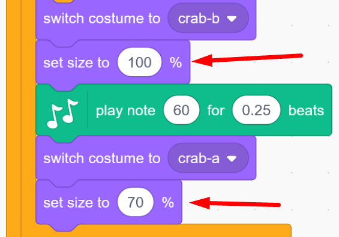

# Fantasy instrument

How would you like your very own instrument to look and sound like? In the past, there were only acoustic instruments such as piano, violin, guitar or sitar to play music on. Today, there are electric instruments and computers that can play almost any incredible digital sound there is. Here you will be able to create your own coded Fantasy instrument that works and sounds just the way you want it to!

In our example below we have coded a Fantasy synth with crabs as keys, click on the green flag to try and play on it. Use the computer keys A, S, D, F, G, H, J, K that form the notes on a C-scale: <a href="https://scratch.mit.edu/projects/400771414/" target="_blank">https://scratch.mit.edu/projects/400771414/
  a
</a>

... and here is a Monster instrument with choral singing that you can try out. Use the computer keys A, S, D, F, G, H, J, K to play a C-scale: <a href="https://scratch.mit.edu/projects/400757584/" target="_blank">https://scratch.mit.edu/projects/400757584
  
</a> 

... and here you can try out a coded piano, use the computer keys A, S, D, F, G, H, J, K to play a C-scale: <a href="https://scratch.mit.edu/projects/398827603/" target="_blank">https://scratch.mit.edu/projects/398827603/
  
</a> 

> **HOW TO GET STARTED??** Browse through this guide, step by step. <a href="https://scratch.mit.edu" target="_blank">
  Also open the Scratch online coding tool by clicking the **Open Scratch** link next to the cat figure above or via www.scratch.mit.edu </a>. In Scratch, you can code and create your own fantasy instrument based on the instructions following below.

Now it's your turn to create your own instrument. You decide for yourself how it should look like and sound.
The instruction follows the example of a fantasy synth with crabs as the keys of the instrument, as seen in the example project above. But you change and create as you please.

Go to the next chapter to start coding!

## 1: Design your idea and select key and background
First you need to figure out how your instrument should look like and also choose what the keys on which you play should look. You can draw your own in Scratch, choose ready-made shapes and backgrounds or even footage or draw on paper and scan to your computer and upload to Scratch.

  
  
  

In our example project in this tutorial, we create a crab synth that you play using the computer keys. There will be 8 "keys" consisting of 8 crabs with different notes being played.
  

But how will your instrument look like? And how many keys do you want (and thus sounds / notes to play on)? Should it be fruits you play on? Or maybe animals? Stars? Maybe draw your own keys in Scratch? Figure out how you want your instrument to look. 

Let's start creating!

1. First you have to select your instrument's keys. <a href="https://scratch.mit.edu" target="_blank"> Open Scratch at www.scratch.mit.edu </a> and log in with your Scratch account so you can save your project later. If you don't already have an account, you can easily get a free one on the Scratch site.
When logged in, click **Create** in the upper-left corner of the Scratch start-page and a new project will be created.

> **Tip!** If Scratch opens in the wrong language, you can always change. Click on the little white globe in the upper left part of Scratch and select the language you want. This instruction is for Scratch in English.

2. First remove the cat figure on the scene by clicking the trashcan on the small image of the cat below the scene. Then the figure disappears from the project.
  

> **Did you know?** All figures and objects that you use in your Scratch are called **Sprites**!

3. Time to choose a new sprite figure that will be a first key within your instrument. Click **choose a Sprite**, which is the button with a cat symbol on the lower right of Scratch. Now you enter the Scratch sprite library. There are lots of figures that can become the instrument's keys. Select the sprite you like as your first key, click on it to add it to your project. In our example, we have chosen a crab.
     
  
> **Did you know?** There are different sprites in Scratch, some have movement in them, others not. You can shee this if you hold the mouse pointer over a sprite in the sprite library and it moves. A sprite that moves has different images in different positions called "costumes", which you can code to toggle between to create animation and movement in the sprite. How to do this you will learn later in the instruction.

4. Now select a background that suits your instrument. Click the **choose a backdrop**-button in the lower right corner of Scratch and the backdrop library will open. Choose the background you like for your instrument.

  
  
> **Tip!** You can also paint your own backdrop with the Scratch built-in drawing tool. Click on the symbol with a paintbrush called **Paint**. Then click the blue button namned **Convert to Bitmap** before you start drawing. That button is located at the bottom under the blank surface of the drawing tool (see image below). Choose from different drawing tools and change color by clicking on the little colored box at the top and adjust to a color of your liking. See pictures below:
       
  
  

  
 
Now, let's add music!

## 3: Add the Music extension
When you work with audio and music in Scratch, you need to add an extension for Music. Then you will get new code blocks related to  music to code with. This is how you do it:

1. Click the blue **Add Extension** button at the bottom of the Scratch left corner. There you will find the various extensions that you can choose to add into Scratch.

  
  
2. Click the box with the Music extension, which looks like this:

  
  
Now you will find a new Music theme in your library of coding blocks and new green coding blocks for music.

  

Now it's time to start coding music and tones!

## 4: Select sound and set tones

Now, you should code the first key sprite to play a specific tone - or sound - when a particular computer key is pressed down on the computer keyboard. But how should the sprite know when to play the tone? Well, we have to connect the computer key to the sprite with help of code. This is how you do it:

1. Click on the small image of your key-sprite, found under the stage with your big spite and backdrop, so that it is selected and you will be coding your first key and not the background.

2. Click on the yellow code theme named EVENTS (found on the left side of Scratch) and you will find the coding block **when GREEN FLAG clicked**. Drag the block and drop it onto the blank script area the the right.

  

The coding block is associated with the green flag above the stage with your instrument. The flag above the stage function as a start button for your project, and the red one is a stop button.

  
  
3. Now choose how your instrument should sound like, for example as a piano, a marimba or chorus? In the MUSIC theme, select the coding block **set instrument to piano** and drag it into the script area. Attach this new block directly below the first one, so they sit together like a jig-saw puzzle. Then it will look like this:

  

4. Click on the word **piano** in the coding block you just added and select the instrument you like to use from the drop down list that comes up. In our example project with the crabs, we have chosen to keep the piano sound.

  

5. Now let's build a script with code that says "forever, if key **A** on the computer keyboard is pressed, then the instrument key (the crab) will play its tone, until the computer key is released. Here's how you code it:

From the theme CONTROL, drag the coding block **forever** and attach it under the other two coding blocks on the script area. This is a **loop**, which makes coding blocks you put inside the loop run over and over again, forever.

  
  
6. Now you should add a so called **condition** with a block from the CONTROL theme called **if ... then**. Put this block inside the loop **forever**, so it looks like this:

  
  
> **Did you know?** A condition is as a rule that you add within the code. For example, the rule might be: **IF** I press the **A** key on the computer, **THEN** a tone should be played out. In a computer game, a condition could be: **IF** the character falls down into the hole, **THEN** the game becomes Game Over.

7. Do you see the diamond-shaped hole in the condition block, between **if ... then**? There you will insert a coding block. Click on the SENSING theme and drag the block **key space pressed?**. Drag in this block from below of the hole in the condition block between **if ... then**. When a white border appears around the hole, you can drop the block and it will place itself within the hole. See image below:

  
  
8. Now let's decide the right computer key to play the first note with. Click the word **space** in the blue block and change to the letter **a** further down in the drop down list. Now it is the computer key **A** on your keyboard that is connected.

  
  
9. Now add which note to play when the computer key A is pressed. In the MUSIC theme, drag the block **play note 60 for 0.25 beats**. Put the block inside the condition **if the key a is pressed? then**, so it looks like the picture below:

  

> **Test your code!** Now you have a condition that plays a tone when the A key is pressed on the computer. Click the GREEN FLAG above the scene to start the script and press the A key on the computer. What happens? Do you hear the tone being played? If not, make sure you have the speakers on and perhaps raise the volume. Otherwise, check so you made the code is correct and put together properly.
  
**Change note and note length**: You can decide which note to play by clicking the number **60** in the music block you just added. Then you a mini piano will show up with a C scale. (See the image below.) Here you can choose which note you want by clicking the key on the small piano. You can also switch to higher or lower octaves with the white arrow in the upper corner. You can also change how long the note will be played out by changing the number of beats in the block where it now is written 0.25 beats.

  

## 5: Give the sprite a mouth to sing with
Costumes are different images of the sprite where it has different positions or looks different. By coding the costume images to be switched between each other at different times, a sense of movement is created, for example that the crab gets a mouth that opens and closes when it sings his note. If the sprite moves, it shows which key is being played. Thi is how you can animate your sprite:

1. Select your sprite by clicking on the small image of your sprite below the scene. Then click on the COSTUMES tab, which is found at the top left corner of Scratch (see images below). Now you enter the sprite drawing tool and can see its costumes (if more than one) - and also create new costumes.

  
 
2. Check if your sprite already has different costumes. It has several if there are more than one small image of your sprite on the far left. Our crab has two costumes, one with closed claws and one with open claws.

  
  
**Tip!** If you only have got one costume in your sprite, you can easily create new ones by right-clicking on the small image of the sprite costume and choose duplicate. Then you will get two exact copies of your first costume. Then you can change them, for example change colors or add drawings or similar in order to create different costumes to animate.

  

In our example, our crab already has got eyes, but no mouth, so we will add one. We do not know what your sprite looks like, it may already have eyes and mouth, but you can play with changing colors, make an eye that blink, draw something on the different sprite costumes or similar. Be creative!

3. Now let's draw a closed mouth on our crab's first costume. Make sure the top costume is selected to draw onto the correct image. Also, click the blue **Convert to Bitmap** button located under the drawing surface.

  

4. Choose which **color** you want by clicking on the small colored box and pull the color pick sliders until you are satisfied.

  
  
5. Then choose which drawing tool you want to paint with, such as **brush** or **line** and draw a mouth onto the big sprite figure. You can also change the thickness of your tool to paint thinner or thicker lines.
  
  
  
> **Tip!** If you draw mistakes and want to regret what you just drawn, you can always reverse a few steps and redo. Click the curved arrow to the left above the drawing tool.

  
  
Now our crab's first costume looks like this:

  
  
6. Then click on the second costume, so the next one will be highlighted instead. This costume should have an open mouth that seems to be singing. Paint a **circle** or similar as an open mouth.

  

Now you have a playable key for your instrument that has different costumes. Time to animate the sprite so it can sing!

## 6: Make the sprite sing!

Now we are going to ANIMATE the sprite, so it seems to be singing as we press the computer keys to play the notes.
We add code that instruct the sprite to change the costume to an open mouth when it is played.

1. Click the CODE tab to get out of the drawing tool and back where you can code your sprite.

  

2. From the theme named LOOKS you will pull out the coding block **switch costume to...**. Put it in the sprite's script so that it ends up just above the green code block named **play note 60 for 0.25 beats**. Then pull in one more block of **swith costume to...** and place this one directly under the green block in the script so it looks like this:

  
  
3. The costume have a name and the name is written in the blocks you've just added. You need to change the name within the blocks so that it is different costumes on the two blocks. Click on the name of the costume in the first block of code you added and you will see a list of the sprite costumes. Click on the one you want (opened mouth or closed mouth?). Now, the two different costumes with open and closed mouth will be switched between each other while the sprite's tone is played.

  

4. Sometimes you can have many different upholsteries that you want to vary between. Then it can be good to always have a selected start costume that always appears when you press the green start flag. A definite costume to start with. We want the sprites' mouth to always be closed when the project starts. We have to code it:

From the LOOKS theme, pull out the block **switch costume to...** and attach it under the first block **when GREN FLAG clicked**. Make sure that the correct costume with the mouth closed is in the purple block. Now this first costume will always appear when you start the instrument.

  

> **Test your code!** Click on the green START flag above the SCENE. What happens when you press the "A" key on the computer keyboard? Does the costume change to make it look like the sprite is singing? Do you get the right costumes you want?

Now you have a playable key that is animated. But we need more keys. Time to create the rest of the instrument!

## 7: Create all the keys
Now let's create all the instrument's keys. If you want **the same sprite beeing used for all your keys** you can do this:

1. Go to the small image of your sprite below the stage with your instrument. Right-click on it and select **Duplicate**. Now an exact copy of your first key is created, both the sprite character with its costumes and the code you have put in on the first sprite key. Duplicate several times to get all the keys you want for your instrument. Tip: In a C-scale there is 8 notes.

  
  
2. Now place the sprite-keys on the stage by dragging them where you want to place them. Also, change the size of the sprites if they look too big or too small on the stage. You can change size within the box below the stage where it says **Size**, where 100 stands for 100% full size. Change to higher or lower percentage on each sprite.

  

2. Now you have several keys with exactly the same code and notes for everyone. Now you need to change the code a little on each sprite, so they get a different computer key to play with and different notes to play out.

Select the second of the copied sprites from the small images below the scene, click on it to highlight it. Now change the code on this sprite so that it gets the next note in the C-scale (or the note or sound you want it to have) and the correct computer key on the keyboard. You can perhaps play with the keyboard A, S, D, F, G, H, J, K, depending of number of sprites and what you prefer. To change, click the letter **a** in the block **key a pressed?** in your code, and change it to another computer key, such as **s**. Then click the number **60** in the music block in your script and select the next note in the scale.

  

> **Tip!** It can be tricky to separate the different sprite keys if they all look the same. A tip is to rename them. You can also include the letter of the computer key into the new name of the sprite, such as **Crab S**. You find the name of each sprite under the scene with your instrument where it says **Sprite** and its name. Click on the name and type another to change it.

  
  
> **Do you want different sprites as keys?** Of course you can choose different sprite-characters. But keep in mind that you may need to code all the sprites by hand instead of copying the sprites and the code. Click **Choose a Sprite** to add new ones, or draw your own sprite.
  
>**Test your code!** Click on the green START flag to start your code. What happens when you press the computer keys you have chosen? Can you hear the tones? Is it the right notes the way you want it? If something wrong, check the code to make sure everything is right on the different sprite keys.

Now you have an instrument! If you want to you can go ahead and create more fun with it in the next chapter!

## 8: Create more movement (optional)
It's fun when the sprites moves around a bit more. There are many different ways to code in movement, here is an example:

**The sprites slides:** If you want the sprites to slide back and forth to different positions, you can insert blocks from theme MOTION  called **glide 1 secs to x:... y:...**. This represents a coordinate system where **x** is horizontal (landscape) on the stage and **y** is vertical (portrait) on the stage. The center point of the coordinate system, which is called origo, is 0 and it is in the middle of the stage.

  

1. From the EVENTS theme, pull out the block **when GREEN FLAG clicked**. Place it somewhere onto the first sprites' script area.

  

2. From the theme CONTROL, pull out the block **forever** and attach it under the first block with the flag. This block is a loop.

  

3. From the theme MOTION, pull out the block **glide 1 secs to x:... y:...** and place it inside the **forever**-loop.

  

4. The numbers in the block after **x** and **y** are the position the sprite currently have on the stage, measured from the center of the sprite figure. You can change the numbers within x and y in order to place the sprite on another position. 
First drag your sprite on the stage where you want it to slide to. Then look underneath the stage, where you will find an x and y value. Write these new numbers into the coding block for x and y.

  

5. Now insert one more **glide 1 secs to x:... y:...**-block. Place the block below the first one inside the forever loop. Then pull the sprite the other direction to where you want it to slide. Check the new numbers for the sprites' position and change the numbers for x and y in the new block.

  

**Test the code!** Does the spray slide back and forth? You can change to faster or slower with less or more seconds of sliding. You can also change the distance it slides with the numbers for x and y.

6. In order for the sprites to always have a specific starting position when the project is started, you can insert a block that gives a starting position. Drag the sprite to where you always want it to start before gliding. From the MOTION theme, drag out the block **go to x:... y:...**. Place this block directly below the yellow coding block **when GREEN FLAG clicked**.

  

Don't forget to do the same on all your sprite keys, but make sure you give them all different x and y positions so they don't end up onto each other.

**Test the code!** Does the sprites start in the right place when you press the green flag?

7. **Resizing the sprite:** If you want to create a movement so that the sprite being played becomes larger while it is playing and then becomes smaller again when it is silent, as if it is mowing towards you? From the theme LOOKS, drag two blocks of **set size to 100%**. (full size). Place them both within the sprite condition above and below the music block, so it looks like this:

  
  
8. Now change the percentage number in the size blocks to make your sprite become bigger and then smaller. Under the scene you will see what size you currently have on your sprite. Write this number in the second size block in the script, in our example the crab is sized 70% when not in use. And change the number in the top block to what you want it to be the largest. We have chosen 100%, maybe your sprite needs to be bigger or smaller.

  
  

Don't forget to change sizes on all your sprite keys!

**Try the code!** Do the sprites change size when you play them? Do they change back to normal size when you stop playing them? Was the size you chosed good? You can always change in the code.

## 9: Add background music (optional)

If you like to, you can add a cool soundtrack to be looped in the background. We code it in onto the backdrop image on the stage.

1. Click on the small image of your backdrop, which is at the far right below the scene. Then the scene with the backdrop is selected and can be coded, just like sprites can be.

2. From the EVENTS theme, pull out the block **when GREEN FLAG clicked** and place it onto the empty script page of the backdrop.

3. From the CONTROL theme, pull out the block **forever** so that the music can be looped over and over again.

  

4. From the SOUND theme, pull out the block **play sound Pop until done**. Place it within the loop.

  
  
5. When you now run the code, a fast popping sound is heard over and over again. The code is right, but we should replace the sound Pop with music. Click on the tab called Sounds, which you will find in the upper left corner of Scratch, and you will get into the audio editor.

  

6. Here you see the sound Pop. To change the sound by adding a new one, you click the blue button with a speaker on the bottom left of Scratch.

  
  
7. Now you come to the Scratch audio library. Click on the theme **Loops** at the top to easier find nice music tracks that are suitable for looping over and over again. Listen to the sounds by moving the mouse pointer over the purple play buttons on each sound, without clicking. When you find the tune you want, click in the middle of the sound box and it is added to your project.

  
  
  
8. Click on the **CODE** tab located at the top left of Scratch and you will return to the code you create in the background.

  
  
9. Now change to your new sound in the code, by clicking on the sound **Pop** in the code block and selecting your new sound in the drop down list that appears.

  
  
**Test the code!** Can you hear the background music? Were you satisfied with the sound?

>**Tip!** Do you want to record your own sounds and use them for background music - or for the tones or sounds of your sprite keys? Go to the Sounds tab above to getinto the sounds editor window. At the bottom left you find the blue button with a speaker on, hold the mouse pointer over the button (no clicking) and a menu will appear. Select the microphone and record your own sounds. Then insert them into the code block in the same way as above by changing sound in the block.Tip is to name your recordings in the top area after recording. You can also edit your sound if you like in the sound editor.
  

>**What does the numbers of the notes means?** What does the number 60 mean for the note in the Music coding block? Well, to put it simply, you can say that when you want to create notes electronically, such as a digital piano instead of a regular classical acoustic piano, you need to be able to write which note you want the instrument to play. And then you use a scale with numbers for the different notes, a so-called MIDI scale. The lowest (lowest) notes start at MIDI digits 1, 2, 3 ... and then the scale goes upwards, to 60 and far past for higher (highest) notes. (Number 60 is note C on C-scale 4.) Examples of a C-scale with note numbers in MIDI:
  

## Finished!
Congratulations, you have now completed the task.

  

**Don't forget to save your project!** You must be logged in to save. Name your instrument so you can easily find it again. Tip: If you are not logged in, you can choose to save the project as a file on your computer under the File menu and choose Save to your computer.

> **Test your project**
Feel free to show your Fantasy instrument to a friend and have them test it. If you feel like it, press **Share** to allow others to find the game on Scratch.

## Questions

* Why can it be useful for a sprite to have multiple costumes?
* What does animation mean?
* How can you use music and notes in Scratch?
* What happens when you change the tempo of the tone?

