# Fantasy instrument

How would you like your very own instrument to look and sound? In the past, there were only acoustic instruments such as piano, violin, guitar or sitar to play music on. Today, there are electrical instruments and computers that can play almost any incredible digital sound there is. Here you will be able to create your own coded Fantasy instrument that works and sounds just the way you want it to!

In our example below we have coded a Fantasy synth with crabs as keys, click on the green flag to try and play on it. Use the computer keys A, S, D, F, G, H, J, K that form the notes on a C-scale: <a href="https://scratch.mit.edu/projects/400771414/" target="_blank">https://scratch.mit.edu/projects/400771414/
  a
</a>

... and here is a Monster instrument with choral singing that you can test. Use the computer keys A, S, D, F, G, H, J, K to play a C-scale: <a href="https://scratch.mit.edu/projects/400757584/" target="_blank">https://scratch.mit.edu/projects/400757584
  
</a> 

... and here you can test a coded piano, use the computer keys A, S, D, F, G, H, J, K to play a C-scale: <a href="https://scratch.mit.edu/projects/398827603/" target="_blank">https://scratch.mit.edu/projects/398827603/
  
</a> 

> **HOW TO GET STARTED??** Browse through this guide, step by step. <a href="https://scratch.mit.edu" target="_blank">
  Also open the Scratch encoder tool by clicking the ** Open Scratch ** link next to the cat figure above or via www.scratch.mit.edu </a>. In Scratch, you code and create your own fantasy instrument based on the instructions below.

Now it's your turn to create your own instrument. You decide for yourself how it should look and sound.
The instruction follows the example of a fantasy synth with crabs as in the example project above. But you change as you please.

Go to the next page to start coding!

## 1: Design idea and select key and background
First you need to figure out what your instrument should look like and also choose what the keys on which you play should look. You can draw your own in Scratch, choose ready-made shapes and backgrounds or even footage or draw and scan to your computer and upload from your computer to Scratch. What should your instrument look like?

  
  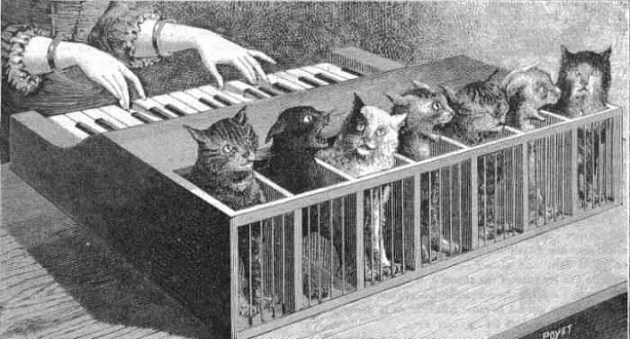
  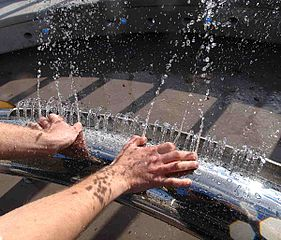

In our example project in this tutorial, we create a crab synth that you play using the computer keys. There will be 8 "keys" consisting of 8 crabs with different notes being played.
  

But what should your instrument look like? And how many keys do you want (and thus sounds / notes to play on)? Should it be fruits you play on? Or maybe animals? Stars? Maybe draw your own keys? Figure out how you want your instrument to look.

1. Now you have to select your instrument's keys. <a href="https://scratch.mit.edu" target="_blank"> Open Scratch at www.scratch.mit.edu </a> and log in with your Scratch account so you can save your project late. If you don't already have an account, you can easily get a free one on the Scratch site.
When logged in, click ** Create ** in the upper-left corner of the Scratch page and a new project will be created.

> **Tip!** If Scratch opens in the wrong language, you can always change. Click on the little white globe ball in the upper left part of Scratch and select the language you want. This instruction is for Scratch in Swedish.

2. First erase the cat figure on the scene by clicking the trash can on the small image of the cat below the scene. Then the figure disappears from the project.
  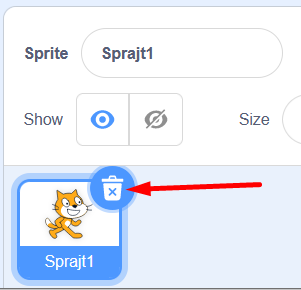

> ** Did you know that? ** All figures and objects that you use in your Scratch project are called ** sprays **!

3. Dax to choose a new spray figure that will be a first key to your instrument. Click ** Select New Spray **, which is the button with a cat symbol on the lower right of Scratch. Now you enter the Scratch Spray Library. There are lots of figures that can become the instrument's keys. Select a spray you like as your first key, click on it to add to your project. In our example, we have chosen a crab.
  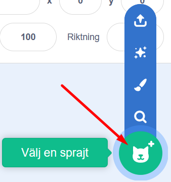   
  
> ** Good to know! ** There are different sprays in Scratch - some can move, others not. You can see that if you hold the mouse pointer over a spray in the spray library and it moves. A moving spray has different images in different positions called "covers", which you can code to toggle between to create animation and movement in the spray.

4. Now select a background that fits your instrument. Click the ** Choose a Background ** button in the lower right corner of Scratch and you will be taken to the Background Library. Choose the background you want for your instrument.

  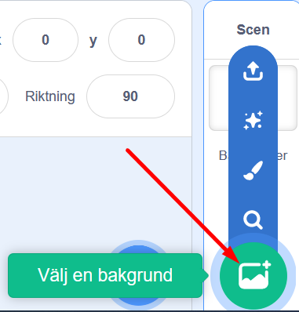
  
> **Tips!** You can also paint your own background with the drawing tool. Instead, click on the symbol with a brush called **Paint**. Then click the blue button called **Make to Bitmap** before you start drawing, the painting will be easier. The button is located at the bottom under the blank surface of the drawing tool. Choose from different tools to paint with and change color by clicking on the little colored box at the top, then the color selector will appear. See pictures below:
  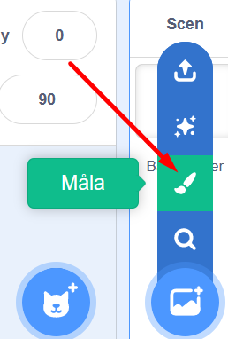     
  
  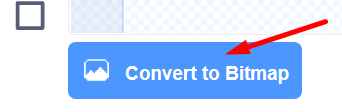

  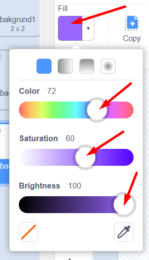
 
Now go ahead to add music!

## 3: Select the Music extension
When you work with audio and music in Scratch, you add an extension for Music. Then you get new code blocks for music to code with. Do this:

1. Click the blue ** Add Extension ** button at the bottom of the Scratch left corner. Then you come to the various extensions that you can choose to add to Scratch.

  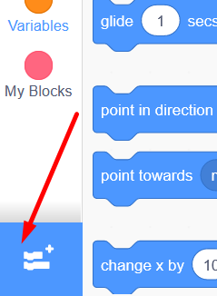
  
2. Click the box with the Music extension, which looks like this:

  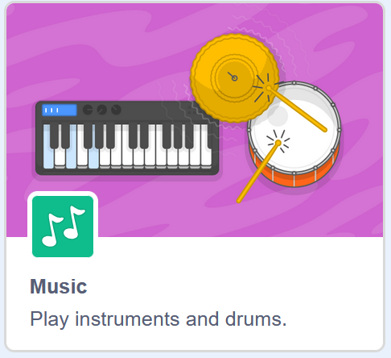
  
Now you have got a new Music theme in your library for code blocks and new green code blocks for music.

  

Now it's time to start encoding music and tones!

## 4: Select sound and set tones

Now, you should encode the first key splash to play a specific tone - or sound - when a particular computer key is pressed down on the computer keyboard. But how should the sprayer know when to play his tone? Well, we have to connect the computer key to the spray with code. Do this:

1. Click on the small image of your key-spray, so that it is selected and you code on your first key.

2. Below the yellow code theme EVENTS is the code block **when GREEN FLAG is clicked**. Drag the block and place it on the blank script area to the right.

  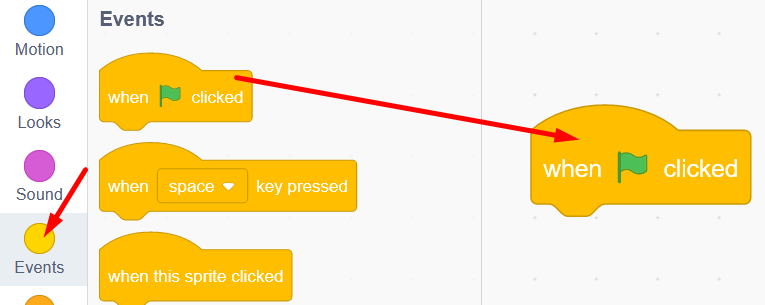

The code block is associated with the green flag above the stage with your instrument started. The flag above the stage serves as a Start button for your project, and the red one is a stop button.

  
  
3. Now choose how your instrument should sound, for example as a piano, a marimba or chorus? Under the MUSIC theme, select the code block ** insert instrument to piano ** and drag it into the script area. Attach the block directly below the first one, so they sit together like two puzzle pieces. Then it looks like this:

  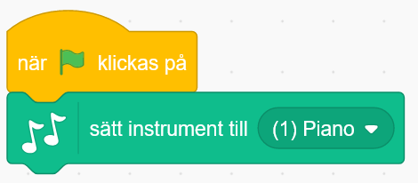

4. Click on the word ** piano ** in the code block and you can select other instrument sounds by clicking on what you want in the list that appears. In our example of crabs, we have chosen piano sounds.

  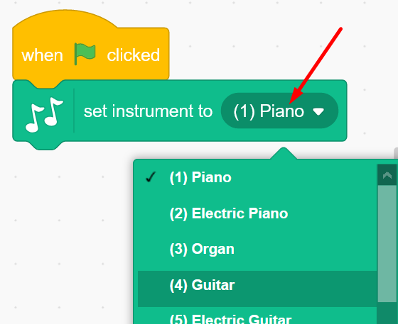

5. Now let's build a script with code that says "forever, if key ** A ** on the computer keyboard is pressed, then the instrument key (crab) will play a selected tone, right up to the computer key ** A ** is no longer depressed. Here's how:

From the CONTROL theme, drag the code block ** forever ** and attach it under the other two code blocks on the script area. This is a ** loop **, which makes every code you put inside the loop run over and over again, forever.

  
  
6. Now you should add a so-called condition with a block from the CONTROL theme called ** if ... then **. Put it inside the loop ** forever **, so it looks like this:

  
  
> ** Good to know! ** A condition is as a rule that you enter in the code. For example, the rule might be: ** IF ** I press the ** A ** key on the computer, ** THEN ** a certain tone should be played. In one game, one condition could be: ** IF ** the guy falls into the lava, ** THEN ** the game becomes Game Over.

7. Do you see the angular hole in the condition block, between ** if ... then **? There we will insert a code block. Go to the KNOW theme and drag the block ** key space down? **. Pull the block obliquely from below the angular hole in the block between ** if ... then **. When there is a white border around the hole, you can drop the block and it will lie inside. See image below:

  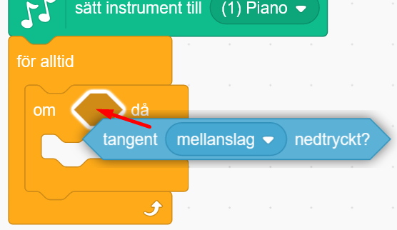
  
8. Now let's decide the right computer key. Click the word ** space ** in the blue block and change to the letter ** a ** further down in the list that comes up. So it is the computer key ** A ** on your keyboard.

  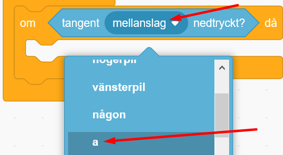
  
9. Now add which note to play when A is pressed. Under the MUSIC theme, drag the block ** play note 60 for 0.25 seconds **. Put it inside the condition ** if the key a is pressed? then **, so it looks like in the picture below:
  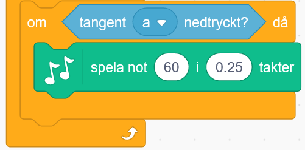

> ** Test the code ** Now you have a condition that plays a note when the A key is pressed on the computer. Click the GREEN FLAG above the scene to start the code and press the A key on the computer. What happens? Do you hear the tone? If not, make sure you have the speaker feature on the computer and good volume. Otherwise, check that the code is correct.
  
** Change note and note length **. You can decide which note to play by clicking the number ** 60 ** in the music block you just entered. Then you get a small piano with a C scale. (See the image below.) Here you can choose which note you want by clicking the key on the small piano. You can also switch to higher or lower octaves with the small white arrow in the upper corner. You can also change how long the note is played by changing the number of seconds in the block where it now stands 0.25 seconds. It is suggested that 0.5 can work well, ie half a second.

  

## 5: Give the sprayer a mouth to sing with
Upholstery is different images of the spray where it has different positions or looks different. By coding that the upholstery images are switched between at different times, a sense of movement is created, for example that the crab gets a mouth that opens and closes when it sings. If the sprayer moves, it shows which key is being played. Do this:

1. Select your spray (small image below the scene) so it is selected. Then click on the CLOTHES tab, it can be found at the top left corner of Scratch. Now you come to the spray drawing tool and can see its upholstery - and create new ones.

  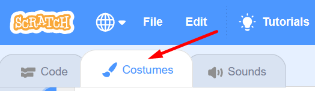
 
2. Check if your spray already has different upholstery. It has several if there is more than one small image of your spray on the far left. Our crab has two upholstery, one with open claw and one with closed claw.

  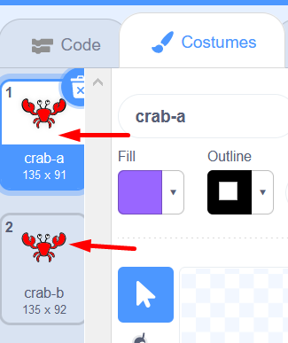
  
** Tip! ** If you only have one cover in your spray, you can easily create more by right-clicking on the small image of the spray and choosing copy. Then you get two similar upholstery. Then you can change them, for example colors or draw something. Like this banana spray, for example, which has only one upholstery:

  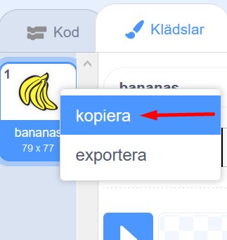

In our example, our crab already has eyes, but no mouth. We do not know what your spray looks like, it may already have eyes and mouths, but you can play with changing colors, make an eye that looks flashing, draw something on the different sprayers' clothes or similar.

3. Now let's draw a closed mouth on our crab's first upholstery. Make sure the top cover is selected and selected to draw the correct image. Also, click the blue ** Make to Bitmap ** button located under the drawing tool.

  

4. Choose which ** color ** you want by clicking on the colored little box and dragging the color tool slider until you are satisfied.

  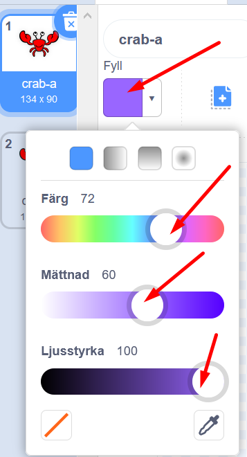
  
5. Then choose which drawing tool you want to paint, such as ** brush ** or ** line ** and draw your mouth. You can also change the thickness of your tool to paint thinner or thicker lines.
  
  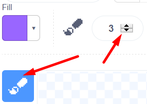
  
> ** Tip! ** If you draw mistakes and regret, you can always reverse a few steps and redo. Click the curved arrow to the left above the drawing tool.

  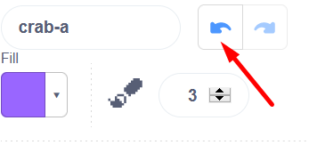
  
Now our crab's first dress looks like this:

  
  
6. Then click on the other upholstery, so the other one will be highlighted instead. It should have an open mouth that seems to sing. Paint a ** circle ** or similar as an open mouth.

  

Now you have a playable key that has different upholstery. Dax to animate as the spray moves!

## 6: Få sprajten att sjunga!

Now we are going to ANIMATE the splash, so it seems to be singing as we press the computer keys to play the notes.
We add code that tells the sprayer to change the dress to it with an open mouth when it is played.

1. Click the CODE tab to get out of the drawing tool and back where you can re-encode scripts.

  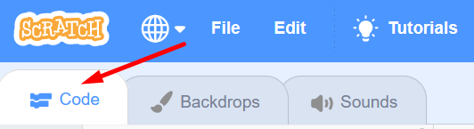

2. From the APPEARANCE theme, pull out the block ** change clothing to ... **. Put it in the sprite's code script so that it ends up just above the green code block ** play note 60 for 0.25 seconds **. Then pull in one more block with ** change upholstery to ... ** and place it directly under the green block so it looks like this:

  
  
3. The covers have a name and the name is in the block you entered. You need to change the block so that it is different upholstery that it changes between. Click on the name of the cover in the first block of code you added and you will see a list of the spray covers. Click on the one you want. Now, the two different upholsteries with open and closed mouths will be exchanged between each other as the spray's tone is played.

  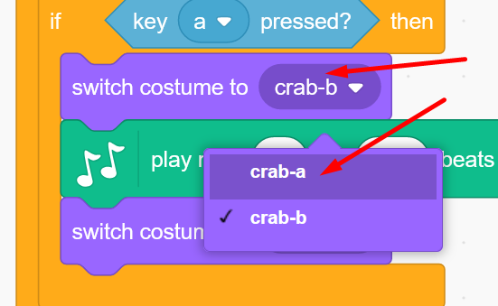

4. Sometimes you can have many different upholsteries that you want to vary between. Then it can be good to always have a selected start dress that always appears when you press the green start flag. A definite dress to start with. We want your mouth to always be closed when the project starts. We have to encode it:

From the EVENTS theme, first pull out the block ** When GREEN FLAG is clicked ** and place it freely on the script area. From the APPEARANCE theme, you then pull out the block ** change upholstery to ... ** and attach it under the first block. Make sure that the correct upholstery with the mouth closed is in the purple ** change the upholstery to the ... ** block. Now this first cover will always appear when you turn on the instrument. When you're done, all code should look like this:

  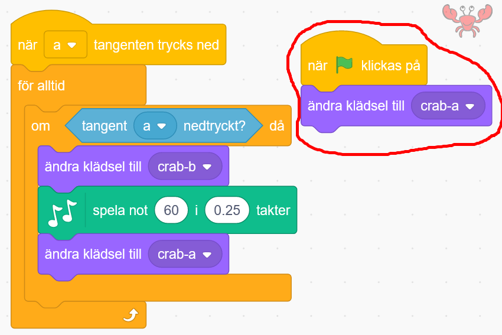

> ** Test your project! ** Click on the green START flag above the SCENE. What happens when you press the "A" key on the computer keyboard? Does the upholstery change to make it look like the apple is singing? Do you get the right clothes you want? Is the tone played?

Now you have a playable key that moves. But we need more keys. Dax to create the whole instrument!

## 7: Create all the keys
Now let's create all the instrument's keys. If you want ** the same sprays for all your keys ** you can easily do this:

1. Go to the small image of your spray key below the stage with your instrument. Right-click on it and select Copy. Now an exact copy of your first key is created, both the spray character with its covers and the code you entered on the first spray key. Copy more to get all the keys you want for your instrument.

  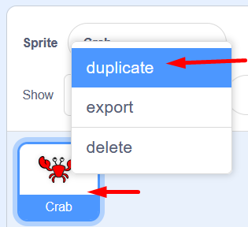
  
2. Now place the IT keys on the stage by dragging them where you want them. Also change the size of the sprayers if they look too big or too small in the box below the stage where it says ** Size **, where 100 stands for 100% full size.

  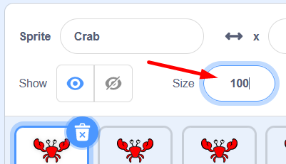

2. Now you have several keys with exactly the same code and notes for everyone. Now you need to change the code a little on each key, so they get a different computer key to play with and their own note.

Select the second of the copied keys from the small images below the scene, click on it to highlight it. Now change the code on this key so that it gets the next note in the scale (or the note you want) and the correct computer key on the keyboard. You can play with the keyboard A, S, D, F, G, H, J, K if you want a simple C scale. To change, click a in the keypad and change to s, and click the number 60 in the music block and select the next note in the scale.

  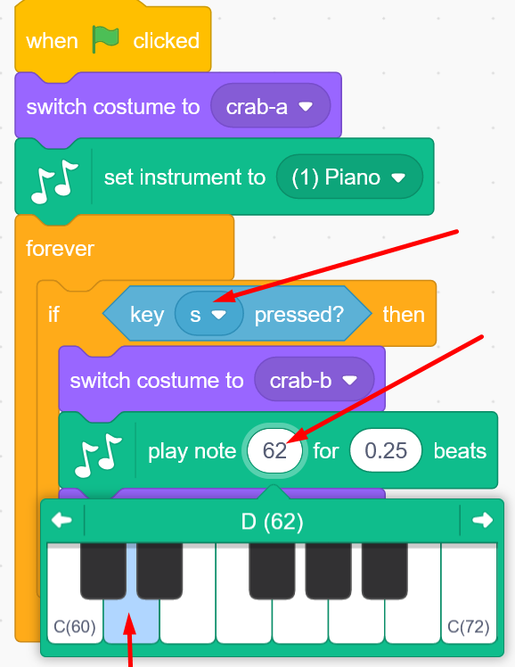

> ** Tip! ** It can be tricky to separate the different spray keys if they all look the same. One tip is to rename them. It may be smart to enter the letter of the computer key into the new name of the sprayer, such as ** Crab S **. You change the name during the scene with your instrument that says ** Spray ** and its name. Click on the name and type one you want instead.

  
  
> ** Do you want different characters as keys? ** Of course, you can choose different characters. But keep in mind that you may need to code all the sprays by hand as the first instead of copying the sprays and the code. Click ** Choose new spray ** to add spray, or paint your own spray.
  
> ** Test your project! ** Click on the green START flag over the SCEN to start the project. What happens when you press the computer keys you have chosen? Surely tones are played? Is it the right toner the way you want it? If you do not hear a tone - check the code to make sure everything is right on the different spray keys. And check the volume of the computer.

Now you have an instrument! If you want, you can go ahead and create more fun with it!

## 8: Create more movement (optional)
It's fun when the sprayers move a little more. There are many different ways to encode movement, here is an example.

The Sprayers slide: If you want the Sprayers to slide to different positions, you can insert blocks from theme movement called ** slide 1 second to x: ... y: ... **. This represents a coordinate system where ** x ** is horizontal (landscape) on stage and ** y ** is vertical (portrait) on stage. The midpoint, which is called origo, is 0 and it is in the middle of the stage.

  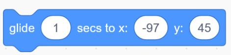

1. From the EVENTS theme, drag out the block ** when the GREEN FLAG is clicked **. Place it on the first Spray Key script area.

2. From the CONTROL theme, pull out the block ** forever ** and attach it under the block with the flag. So it's a loop.

  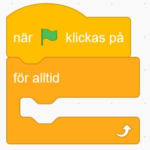

3. From the MOVEMENT theme, you now pull out the block ** slide 1 second to x: ... y: ... ** and place it inside the ** forever ** loop.

  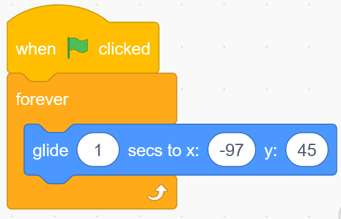

4. The numbers that are now in the block after x and y are the position the sprayer currently stands on, at the center of the sprayer figure. If you want the sprayer to slide back and forth all the time, you can change the numbers for x and y. First drag your sprayer where you want it to first slide, a few inches to the side can fit well. Now look underneath the stage, where there is an x ​​and y value. Now write these new numbers in the code block for x and y.

  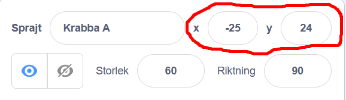

5. Now insert one more block with ** slide 1 second to x: ... y: ... **. Place the block below the former inside the forever loop. Then pull the spray the other way you want it to slide, so it moves past where it started with a few centimeters. Change the numbers for x and y in the new block just as you did before.

  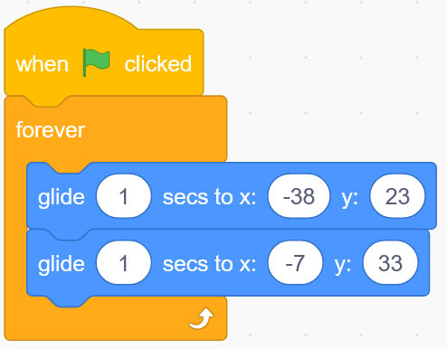

** Test the code! ** Does the spray slide back and forth? Is it going well? You can change to faster or slower with less or more seconds sliding. You can also change the distance it slides with the numbers for x and y.

6. In order for the sprinters to always have a specific starting position when the project is started, you can insert a block that gives a starting position. Drag the spray to where you always want it to start before leaving. From the MOVEMENT theme, drag the block ** go to x: ... y: ... **. Enter this block directly below the yellow code block with the green flag on it, which is called ** when GREEN FLAG is clicked **.

  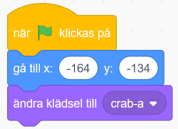

Don't forget to do the same on all your spray keys, but make sure you give them all different x and y positions so they don't end up on each other.

** Test the code! ** Do the sprayers start in the right place when you press the green flag?

7. ** Resizing the Spray ** If you want to create a movement so that the playing spray becomes larger while it is playing and then becomes smaller again when it is silent, as if it is leaning forward towards you? From the APPEARANCE theme, you drag two blocks of ** way size to 100 **. (This is 100%, full size). Place them both within the spray conditions above and below the music block, so it looks like this:

  
  
8. Now change the numbers in the size blocks to fit what you want for your spray. During the scene you will see what size you currently have on your spray when it is stationary. Write this number in the lower size block, in our example the crab is 70% large when not in use. And change the number in the top block to what you want it to be the largest. We have chosen 100%, maybe yours needs to be bigger or smaller.

  

Don't forget to do the same on all your spray keys!

** Test the code! ** Do the sprouts get bigger as you play them? Do they return to their normal size when you stop playing them? Was the size you chose good? You can always enter the code and change.

## 9: Add background music (optional)

If you like, you can add a cool soundtrack looped in the background. We encod it in the background image on the stage.

1. Click on the small image of your background, which is at the far right obliquely below the scene. Then the scene with the background is selected and can be coded.

2. From the EVENTS theme, enter the block ** When GREEN FLAG is clicked **.

3. From the CONTROL theme, enter the block ** forever ** so that the music can be looped over and over again.

4. From the SOUND theme, enter the block ** play the sound Pop until done **.

  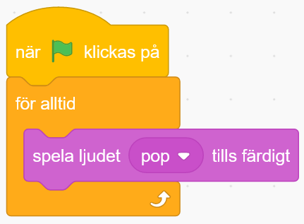
  
5. As you now execute the code, a fast popping sound is heard over and over again. The code is right, but we should replace the sound Pop with music. Click on the tab called Sounds, which you will find in the upper left corner of Scratch, and you will come to the audio editor.

  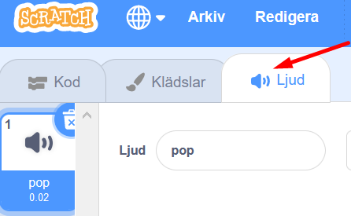

6. Here you see the sound Pop. To change the sound, you can click the blue button with a speaker on the bottom left of Scratch.

  
  
7. Now you come to the Scratch audio library. Click on the theme ** Loops ** at the top, so you get good music tracks that are suitable for looping over and over again. Listen to the sounds by moving the mouse pointer over the orange little play buttons on each sound, without pressing. When you find the one you want, you click in the middle of the sound box and it is added to your project.

  
  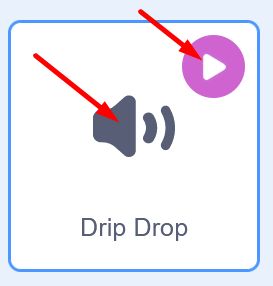
  
8. Click on the ** CODE ** tab located at the top left of Scratch and you will return to the code you create in the background.

  
  
9. Now change to your new sound in the code, by clicking on the sound ** Pop ** in the code block and selecting your new sound in the list that appears.

  
  
** Test the code! ** Hear the background music? Were you satisfied with the sound?

> ** Tips ** Do you want to record your own sounds and use them for background music - or for the tones or sounds of their sprayers? Go to the audio tab you did above. Hold the mouse pointer over the button to select audio in the lower left corner, and a menu will appear. Select the microphone and record your own sounds. Then insert them into the code block in the same way as above by changing the block.
  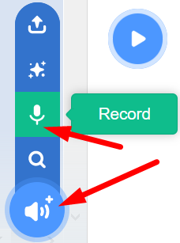

> ** What are the numbers of the notes? ** What does the number 60 mean for the note in the code block? Well, to put it simply, you can say that when you want to create instruments digitally, such as a digital piano instead of a regular classical acoustic piano, you need to be able to write which note you want the instrument to play. And then you use a scale with numbers for the different notes, a so-called MIDI scale. The lowest (darkest) notes start at MIDI digits 1, 2, 3 ... and then the scale goes upwards, to 60 and far past for higher (lighter) notes. (Exact number 60 is note C on C scale 4.) Examples of a C scale with note numbers in MIDI:
  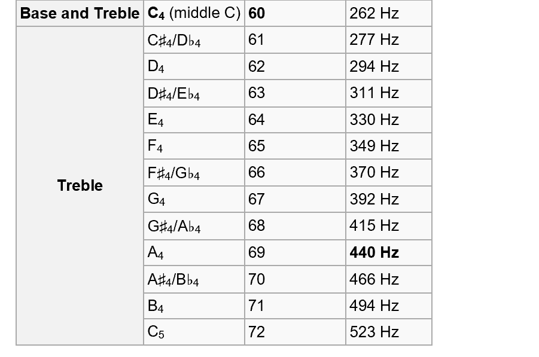

## Finished!
Congratulations, you have now completed the task.

** Don't forget to save your project! ** You must be logged in to save. Name it your instrument with a name so you can easily find it again. Tip: If you are not logged in, you can choose to save the project as a file on your computer under the File menu.

> ** Test your project **
Feel free to show your Fantasy instrument to a friend and have them tested. Press ** to share ** to allow others to find the game on Scratch.

## Issues

* Why can it be useful for a sprayer to have multiple covers?
* What does animation mean?
* How can you use sheet music and notes in Scratch?
* What happens when you change the tempo of the tone?

