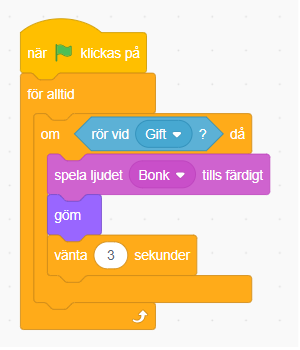
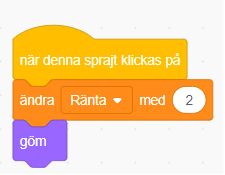
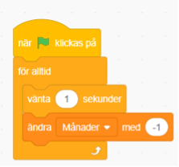

# Sparmästaren

I spelet Sparmästaren är målet att spara pengar och försöka att få räntan att öka! I detta spel kommer du få lära dig mer om sparande, ränta och hur man använder kodblocken i Scratch.

Testa ett exempelspel av Sparmästaren nedan.

**HUR KODAR JAG?**

Följ denna instruktion steg för steg och koda ditt projekt i verktyget Scratch. [Klicka här för att öppna Scratch i en n](https://scratch.mit.edu/)[y](https://scratch.mit.edu/)[flik.](https://scratch.mit.edu/)I Scratch klickar du på Skapa för att börja. Logga gärna in på Scratch så kan du även spara och dela ditt projekt. Det är gratis att skaffa ett konto.

Dags att börja koda! Klicka på steg 1 nedan för att gå vidare i instruktionen.
## 1: Välj en sprajt

I verktyget Scratch skapar du projekt med så kallade sprajtar. En **sprajt** är en figur eller andra saker du väljer att lägga in i ditt spel eller projekt. Sprajtar kan se ut hur som helst, kanske som en katt, en boll, ett träd du ritat själv eller annat. Alla sprajtar kan påverkas och styras med den kod du lägger till. Koden i Scratch ser ut som små pusselbitar. När du byggt ihop olika kod-pusselbitar kallas det för att du bygget ett **skript** - det är ditt kodade program som styr ditt projekt och alla dina sprajtar.

När du öppnar nytt projekt i Scratch visas först en katt som sprajt på en vit bakgrund. Nu ska vi byta ut katten mot en passande sprajt, så börja med att ta bort katten och välja en ny sprajt istället. Gör såhär:

1. Tryck på **krysset på lilla rutan med kattfiguren** så försvinner den - du har nu tagit bort den ur projektet.

1. Nu vill du lägga till en passande sprajt istället som ska bli din sparbank. Tryck på knappen för **NY SPRAJT** som finns under den vita bakgrunden:

En katalog med massa figurer dyker upp. Tryck på den sprajt som du vill ha så har du lagt till en ny sprajt i ditt projekt.

1. Om sprajten är för stor eller liten så kan vi öka eller minska storleken på sprajten. Under projektet med sprajten hittar du **Storlek** och bredvid står det 100. Det betyder att sprajten är i full storlek, alltså 100%. Ändra vi siffran till en lägre procent, exempelvis 50 så får du en sprajt som är hälften så stor. Testa dig fram tills den blir lagom stor (som din tumnagel ungefär). Du kan alltid ändra det sen igen om det blev för stort eller litet.

Nu är sprajten klar och det är dags att färglägga din bakgrund.

## Klicka dig vidare. 2: Färglägg bakgrunden

Du ska nu få färglägga spelets bakgrund.

1. För att ändra på bakgrunden trycker du först på den vita lilla rutan längst ner till höger där det står **SCEN** , så den blir markerad. Klicka sedan på fliken **BAKGRUNDER** som du finner högst upp till vänster.

1. Tryck på blå knappen som det står **"Gör till bitmapp** på.

Välj sen **en färg** du gillar genom att klicka på den lilla färgade rutan ovanför och ställ in färgen du vill ha, genom att dra eller klicka på de olika reglagen tills du är nöjd.

Fyll sen bakgrunden med färgen du valt genom att klicka på verktyget **Fyll** som ser ut som en liten hink och sen klicka på stora vita rutan så fylls bakgrunden med den färg du valt.

> Tips: Viktigt att färgen du valt inte är samma som någon färg som din sprajt har på sig. Annars kan det bli problem i ditt projekt längre fram.

Ungefär så här kan nu spelet se ut.

1. Nu ska du göra ett mynt som vi sedan ska koda att det faller ner i vår spargris. Så du lägger till en ny sprajt och denna gång väljer du en sprajt som heter "BUTTON" som vi ska göra om.

 7. Testa lägg till en ny gul heltäckande färg på knappen genom att använda hink verktyget och fyll myntet med valfri färg, i detta exempel använder jag färgen gul. Därefter väljer ni **text verktyget** och skriver **100KR.** Om myntet är för stort så kan ni förminska den under **Storlek**.

8.Kopiera myntet som ni precis gjorde så ni har nu två mynt.
 

9. Gå in på andra myntet och skriv **2%** i stället för **100KR.** Då har ni **ett mynt som är 100KR och ett mynt på 2%.**

## 3: Ditt första skript

Nu när bakgrunden är färdig och dess mynt kan du börja skapa ditt första skript. Glöm inte att **spara** ofta! Du måste vara inloggad för att kunna spara.

Ställ muspekaren på din valda sprajt och ta tag i den genom att hålla ned musknappen (eller håll på den med ditt finger om du använder surfplatta) och dra sprajten på den målade banan, släpp den där du tycker sprajten ska stå när ditt spel börjar.

Tryck på KOD-fliken högst upp till vänster. Nu kommer du bort från målarverktyget och tillbaka till vita ytan där du kan bygga din kod för spelet.

Har du lagt märke till START- och STOPP-knappen än? **Den gröna flaggan** betyder är en start-knapp och **den röda knappen** är en stopp-knapp.

Nu ska du koda första myntet som vi kallar för " **sparande.**" För att göra det måste du tala om för myntet vad den ska göra, annars händer ingenting. Myntet kan inte tänka av sig självt, den väntar på dina instruktioner. Du ska alltså koda och lägga till ditt första skript som säger:

"När jag trycker på START-flaggan, ska myntet falla ner i min spargris." Gör såhär:

1. Överst till vänster hittar du flera färgglada rubriker med en massa kodpusselbitar under. Klicka på gula rubriken **HÄNDELSER** och välj pusselbiten med en grön flagga på som är blocket för: **"när START (gröna flaggan) klickas på"**. Ta tag i och dra detta block till skriptytan (den stora tomma, vita ytan i mitten) och släpp den där.

Välj sedan den blå rubriken **RÖRELSE** som finns längst upp och välj blocket **"gå till X: Y:"**. Lägg detta block direkt under det första blocket med den gröna flaggan på scriptytan och koppla ihop dem som pusselbitar.

> Tips: om man för två block nära varandra på scriptytan dyker snart en grå skugga upp, då kan man bara släppa så kopplar blocken automatiskt ihop sig som pusselbitar.

Testa nu vad som händer när du trycker på START. Flyttar sig ditt mynt åt de nya positionerna som du valt? Det är bra, men du vill ju att myntet ska falla ner i spargrisen. Hur gör du det? Jo, såhär:

1. Under blåa rubriken **RÖRELSE** finns kodblocket **"glid 1 sek till X: Y:"**

Dra in **"glid"** -blocket och lägg den direkt under **"gå till X: Y:"** så blocket **"glid 3 steg"** hamnar inuti loopen. Kolla på bilden nedan så ser du hur du ska göra. 

För att myntet ska fortsätta att falla nedåt så måste vi lägga till ett "för alltid" **LOOP**. "Glid 3 steg" kommer då att upprepas för alltid - om och om igen, så myntet faller och faller och faller.

Testa att trycka på START - alltså den gröna flaggan ovanför spelet. 

## 4: Sätt en rörelsepunkt

För att slippa starta om spelet varje gång myntet har fallit ned en gång så ska vi "visa/ gömma" myntet när den rör vid vår spargris.

Innan du gör ditt skript, se till att din spargris är på rätt startposition på banan som du tycker din sprajt alltid ska börja på.

1. Under **KONTROLL** väljer du blocket **"om \_\_ då"** och koppla fast blocket direkt under **"glid 3 sek X: Y:"** , inne **"för alltid"** -loopen. Sedan under **KÄNNA AV** väljer du kodblocket " **rör vid muspekare.**" och ändrar det blåa känna av blocket till den rätta sprajten som du valt som spargris. 

Nu kommer myntet automatiskt att förflyttas till samma startposition varje gång du trycker på gröna START-flaggan.

Lägg gärna till ett ljud som ditt sparande ska spela upp varje gång myntet nuddar din spargris.

## 5: Variabler

Nästa steg blir att göra det möjligt att samla ihop till ditt sparande! För det behöver du två korta skript. Ett som säger åt datorn att myntet ska falla ner i din spargris och ett annat som ger dig god ränta.

Gör såhär:

1. Under rubriken **VARIABLER** finns ett block som säger **"Skapa en variabel"** gör en ny som heter **"sparande"**. Skapa ytterligare två variabler och döp de till **"ränta"** och en till som heter **"månader".**

Nu ska du dra in **"ändra min variabel med 1"** in i ditt sparande mynt. Tryck på lilla vita pilen bredvid "min variabel" och välj din nya variabel **"sparande"** och skriv in **100** istället för **1**.
 

1. Nu ska vi ta emot ett meddelande från "ränta." Så inne på **händelser** måste vi hämta ett block som heter **"när jag tar emot meddelande"** och lägg till ett nytt meddelande **"ränta."** Sedan lägg till ett **"visa"** block från utseende, **"vänta 2 sekunder"** och **"ändra sparande med 2."** Ditt sparande kommer nu öka med 2kr.

Nu ska du ha **två rader av script** och nu är du klar med mynt 100, när du är helt färdig så ska scripten se ut såhär:

> Testa vad som händer nu när du trycker på gröna START-flaggan. Kan du samla sparande? Går pengarna uppåt?

## 6: Ränta

Nu ska vi koda vårt andra mynt **"2%"** som är vår ränta. Nu ska du göra exakt samma kodning som vi gjorde med **"100kr"** myntet. När du har hämtat alla kodblock så ska första scriptet se ut såhär:

Ändra gärna ljudet till annat valfritt ljud och tryck på lilla vita pilen på **"spela ljudet \_\_ tills färdigt"** för att byta till ditt nya ljud.

Sedan under **"händelser"** så ska du hämta ett block som heter **"när denna sprajt klickas på"** så ska du lägga till **"ändra Ränta med 2"** och sedan lägga till ett **"göm"** block. Denna kodning gör det möjligt för dig att öka din ränta varje gång du fångar myntet genom att klicka på det med muspekaren eller med ditt finger om du kodar på en surfplatta.

12. Nu ska vi koda en ny rad av block på samma sprajt. Du behöver gå tillbaka till **"händelser"** och hämta **"när grön flagga klickas på",** hämta en **LOOP** som heter **"för alltid"** och lägga in ett **"visa"** block och lägga till två rörelse block **"gå till X:\_\_ Y:\_\_"** samt en **"glid \_\_ sek till X:\_\_ Y:\_\_"**

> Testa din kodning och se vad som händer! Faller myntet till spargrisen? Kan du klicka på den? Nu i nästa steg så ska vi lägga till ett slumptal. Ett slumptal är en position som är helt random när myntet ska falla.

Inne på **operatorer** hittar du ett block som heter **"slumptal 1 till 10"** lägg in den i din scriptyta och hämta ett till kodblock från **"kontroll"** som heter **"vänta 1 sekunder".** Nu ska du lägga in operatorer blocket in i **vänta** blocket och sedan lägga in den i vår senaste kodning. När det är färdigt så borde ditt script se ut så här:

## 7: Scen

Det sista steget vi ska göra är att gå in på bakgrunder och lägga till **"månader"** och sätta våra pengar till 0 varje gång vi startar om vårt spel.

Gör såhär:

1. Klicka på **SCEN** som är längst bort till höger. Gå till **händelser** och lägg till startblocket **"när grön flagga klickas på"** , en **"för alltid"** loop och **"vänta 1 sekunder."** Gå in på variabler kategorien och välj **"ändra månader med 1"** ändra 1an till **-1** då vi ska räkna ner månaderna.
 
2. Vårt nästa steg är att lägga in ett nytt start kodblock under **SCEN** och lägga till tre **"sätt \_\_\_ till 0"** och sätta **sparande** och **ränta** till 0 och sätta **månader** till 36.
 
3. Vårt sista steg är att gå tillbaka till vår **sprajt** med **myntet på 2%** lägga till ett **"skicka meddelande"** på 2% där du ska lägga in ett nytt meddelande som heter **"ränta".**

> Testa nu din kodning för att se att din ränta **ökar** med två kronor varje gång du lyckas fånga 2% myntet och att du får 100kr varje gång din spargris fångar upp 100kr.

## Färdig!

Grattis, nu har du skapat ditt första spel!
 Det färdiga skriptet i sin helhet borde se ut ungefär så här - om du följt instruktionerna:

**100kr myntkodningen:**

**2% myntkodningen:**

**Scen kodning:**

**Glöm inte att spara ditt projekt - och att döpa det!**
 Döp det gärna till uppgiftens namn Drömfabriken - eller hitta på ett eget namn, så att du enkelt kan hitta det igen. Du skriver in namn på spelet högt upp ovanför projektet, där det nu står "Scratchprojekt". Spara sedan, men du måste vara inloggad för att kunna spara.

**Testa ditt projekt**

Visa gärna någon ditt spel och låt dem testa. Om du vill, tryck på knappen DELA som du finner överst så kan andra också hitta spelet på Scratch sajt och testa det.

**Viktigt om du delar ditt projekt:** Tänk på att delade projekt kan ses, testas och remixas (omskapas) av alla som vill på Scratch sajt. Det är viktigt när du sparar och delar att projektet inte innhåller information, bilder eller ljud du inte vill sprida till andra.

## Frågeställningar

* Vad är en sprajt?

* Vad är en loop?

* Vad är sparande?

* Varför kan det vara bra att använda en loop?

* Vad är en variabel?

* Vad händer i spelet Sparmästaren?

