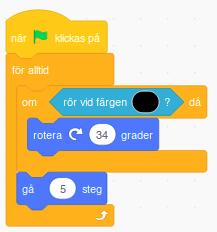

Visst kan det ibland kännas lite trist att städa. Varför inte skapa din egna robotdammsugare som kan hjälpa till? I den här uppgiften får du rita och koda din egen robotdammsugare! Det är lättare än vad du tror! 

Klicka på bilden nedan för att se ett exempelprojekt i Scratch på hur ett projekt med en robotdammsugare kan tänkas se ut: 

> **HUR KODAR JAG?** 
Följ denna instruktion steg för steg och koda ditt projekt i verktyget Scratch. <a href="https://scratch.mit.edu" target="_blank"> Klicka här för att öppna Scratch i en ny flik.</a> I Scratch klickar du på Skapa för att börja. Logga gärna in på Scratch så kan du spara och om du vill även sen dela ditt projekt. Det är gratis att skaffa ett konto på Scratch.
 

Dax att börja skapa din städrobot! Klicka på kapitel 1 här under för att bläddra dig vidare.

## 1: Rita din robotdammsugare
Börja med att rita din robotdammsugare. Du bestämmer själv hur den ska se ut.

1. Ta först bort katt-sprajten som finns i projektet, genom att klicka på lilla *soptunnan* på den katt-bilden under scenen. 

 

2. För att rita din egen robotdammsugare går du till symbolen för **Välj ny sprajt** och klicka på pensel-symbolen **Måla**. Nu öppnas ett ritverktyg att måla med nya sprajtfigurer med. 

 

3. Rita din egen robotdammsugare med ritverktygen. Du väljer själv hur din robotdammsugare ska se ut! I vårt exempel ser vår  vår dammsugarrobot ut såhär:

 

Nu har vi en dammsugarrobot, men vart ska den städa? Vi går vidare.

## 2: Rita rummet som ska städas
Dax att rita rummet eller lägenheten som roboten ska städa. Du ska rita väggarna som om du ser rummet *ovanifrån*, exempelvis en enkel fyrkant. Endast väggarna ska ritas och det är viktigt att alla har exakt samma färg och att inget annat i bakgrunden är målat med samma färg som väggarna! Måla gärna golvet i en ny färg också.

 

Gör såhär:

1.  Klicka på lilla rutan där det står **Scen** i nedre högra hörnet av Scratch. Klicka sedan på fliken som heter **Bakgrunder** i övre vänsta hörnet, så får du fram ritverktyget för din bakgrundsbild. Här kan du rita rummet. 

 
 

2. Klicka först på den blå knappen under ritfönstret där det står **Gör till Bitmapp**. 

 

3. Välj sen verktyg att måla med, exempelvis **Pensel**, och en färg du vill ha på väggarna. Måla upp väggarnas form som om du såg rummet ovanifrån. Tänk på att inte göra det för trångt för roboten att kunna åka in mellan väggarna. 

4. Golvet kan också få en ny färg. Välj det lilla hink-verktyget som heter **Fyll färg**. Välj sen vilken färg du vill ha på golvet och måla det genom att klicka på ytan innanför väggarna. 

Nu har vi en dammsugarrobot och ett rum, men vi måste rå roboten att börja röra på sig. Dax att börja koda.

## 3: Få roboten att röra sig
Nu ska vi börja koda roboten så att den vet hur den ska röra sig i rummet. Det första som vi vill göra är att få roboten att röra sig framåt. 

1. Välj fliken **Kod** högst upp till vänster för att komma bort från ritläget och tillbaka till där du kan koda md kodblocken. Se till att din sprajt för dammsugarroboten är vald, genom att klicka på den lilla bilden som visar din dammsugar-sprajt under scenen. Nu kan du koda din dammsugarrobot.

2. Är din dammsugarrobot för stor, så kan du ändra storleken på den. Under scenen finns **Storlek** och siffran 100 (alltså 100% full storlek). Ändra till lägre siffra, prova dig fram vad som passar.

2. Klicka på temat **RÖRELSE** och dra ut kodblocket **Gå 10 steg** till den tomma skriptytan. Ändra siffran i blocket så det istället står **Gå 5 steg**. 

3. Vi vill att roboten ska gå framåt hela tiden utan att sluta gå. Om vi loopar koden för röelse, så kommer roboten gå framåt för alltid. Under tema **KONTROLL** finns kodblocket **För alltid**. Dra ut den på skriptytan och stoppa in röresleblocket **Gå 5 steg** inuti. Nu har du kodat en loop för robotens röresle och den kommer gå framåt hela tiden.

4. Ser du den gröna flaggan ovanför scenen med din robot på? Det är ditt projekts startknapp, för att sätta igång roboten. För att den ska funka och roboten ska veta när den ska börja gå behöver vi lägga till det i koden. Under **HÄNDELSER** finns kodblocket **När GRÖN FLAGGA klickas på**. Dra in den på skriptytan och lägg den överst i skriptet med kodblock. Nu ska koden se ut som bilden nedan.

> Testa koden! Klicka på den gröna flaggan ovanför scenen - rör sig roboten framåt? 

Nu rör sig roboten, men den känner inte av väggarna, och inte heller smutsen. Dags att koda vidare!

## 5: Känna av väggarna
Nu ska vi koda så att roboten känner av när den rör vid en vägg. Om roboten rör en vägg, då ska ska vrida sig lite och åka vidare. Gör såhär: 

1. Välj tema **KONTROLL** och dra in kodblocket **Om...Då**. Lägg det någonstans fritt på robotens skriptyta.

2. Välj tema **KÄNNA AV** och välj blocket **Rör vid färgen?**. Dra in detta kodblock och lägg det inuti det lilla kantiga hålet mellan **Om** och **Då** i blocket. Då står det i koden: *Om Rör vid färgen? Då*.

För att roboten ska kunna känna av att den rör vid en vägg, behöver den veta vilken färg väggen har. Viktig att färgpunkten i ditt kodblock har exakt ditt rums väggfärg. Det ordnar du såhär:

3. Klicka på den färgpunkt som just nu finns i ditt **Rör vid färgen?**-block. Då kommer en palett med färger fram. Klicka på det lilla pippettverktyget längst ned under färgerna och klicka sedan på en av väggarna på scenen. Då ändras färgen i ditt **Rör vid färgen?**-block till just den väggfärg du målat ditt rum med.

Nu är färgen i din kod rätt, men vi måste även koda in vad roboten ska göra när den känner av en vägg! Vi vill att roboten ska vända lite åt sidan och åka vidare, bort från väggen. Gör såhär:

4. Välj tema **RÖRELSE** och välj blocket **Rotera höger 15 grader**. För att få roboten att svänga lite mer, kan du höja värdet lite. I vårt exempel har vi valt 34 grader.

5. Nu ska vi lägga ihop all kod vi har på skriptytan. Dra in **Om...Då**-blocket så det hamnar inom **För alltid**-loopen med **Gå 5 steg**, så att det ser ut som bilden nedan: 

> **Testa koden!** Klicka på den gröna flaggan ovanför scenen - rör sig roboten framåt? Vänder den när den åker in i en vägg?  

Nu har vi en robotdammsugare som rör sig runt i rummet och vänder när den stöter in i en vägg. Men den behöver smuts att städa upp. Vi lägger till en liten dammråtta som smutsar ned!

## 6: Koda en dammråtta 
Välj en sprajt som blir din dammråtta. Du kan såklart välja annat djur eller rita din egen sprajt om du hellre vill det.du kan koda ett annat djur om du hellre vill det.

> Notera: Om du ritar en egen figur, var noga med att det inte har samma färg som din dammsugarrobot, väggar, golv eller smuts. 

Vi kodar husdjuret på samma sätt som vi kodade dammsugaren. 

1. Börja med att lägga till ett **Gå 10 steg**-block från **RÖRELSE** och ändra variabeln i det till 5 steg. 

2. Vi vill också att dammråttan ska gå framåt hela tiden, så vi lägger rörelseblocket inuti ett **För alltid**-block - alltså en loop.

3. Från tema **HÄNDELSER** lägger du in startblocket **när GRÖNA FLAGGAN klickas på** och lägger det överst i skriptet.

4. För att husdjuret ska vända om det rör vid en vägg, behöver det känna av väggarnas färg. Från tema **KONTROLL** lägger du till blocket **Om...Då**. Välj sen tema **KÄNNA AV** och blocket **Rör vid färgen?**. Dra in detta block inuti det kantiga hålet i **Om...Då**-blocket.

5. Klicka på den färg som finns i **Rör vid färgen?**-blocket och använd pippettverktyget längst ned för att välja exakt samma färg som väggarna genom att klicka på en av väggarna på scenen. Då ändras färgen i blocket till samma färg som dina väggar.

6. Nu känner husdjuret av om den åker in i en vägg. För att husdjuret ska vända sig, väljer du temat **RÖRELSE** och drar ut blocket **Rotera vänster 15 grader**. Klicka på variabeln 15 och ändra till 36 grader istället.

Lägg nu in röresle-blocket som du har på skriptytan så den hamnar inom **För alltid**-loopen, direkt under **Om...Då**-blocket. Då ser skriptet ut såhär: 

Nu har vi ett husdjur som rör sig runt i rummet!

> Tips! Vill du att ditt husdjur ska röra sig lite olika genom rummet, kan du prova med att lägga in att den förslagsvis ska vänta några sekunder ibland på olika ställen, eller att den ska röra sig annorlunda om den kommer nära robotdammsugaren. Kanske den ska ha röst eller  ljud - eller pratbubbla med text som säger någonting? Kanske du kommer på andra idéer?

### Få hudsjuret att smutsa till lägenheten
Många djur har en tendens att stöka ner lite efter sig (särskilt dammråttan som vi har använt som exempel!) Vi ska nu lägga till en liten bit kod som gör att djuret stökar till det lite efter sig, så dammsugaren får mer att städa upp.. 

Börja med att ta ett **sätt pennans storlek** block och välj här en passande storlek. I dammråttans fall passar 20 bra. Sätt därefter pennans färg med ett **sätt pennans färg till** block till samma färg som du använde för smutsen tidigare.

> Tips! Använd pippetverktyget som du använda förut för att få exakt samma färg!

Därefter behöver vi bara ett **penna ner block** och sen är du klar. 

Sätt dessa tre block direkt efter **startblocket** för ditt djur.

## 6: Lägg till specialblocket Penna

Vi vill att smutsen ska se ut att försvinna när dammsugaren åkt över den. Det löser det genom att låta dammsugaren rita över  smutsen med golvfärg, så ser det rent och städat ut! För att dammsugaren ska kunna rita behlver vi lägga till specialblocket "Penna". Gör såhär:

1. Nere i vänstra hörnet hittar vi en knapp för **Tillägg** som ser ut såhär:

2. Klicka på knappen **Tillägg**  och klicka sen på bilden som heter Penna, så läggs den till i ditt Scratchprojekt. 

Sådär! Nu finns nya penn-block att koda med. Dax att koda vidare så roboten kan börja städa!

## 7: Dammsugarroboten får en penna
Dax att koda in pennan i dammsugarrobotens kod.

1. Det första vi måste göra är att ändra pennan till den storlek som vi vill ha. Under tema **PENNA** finns kodblocket **Sätt pennans storlek 1**. Lägg in detta block i robotens kod direkt under start-blocket **När GRÖNA FLAGGAN klickas på**. Ändra siffran 1 till en lagom stor storlek, i vårt exempel har vi skrivit 30. Anpassa storlek beroende på hur stor eller liten din robot är. Pennans storlek behöver vara mindre än din robotdammsugare är! Prova dig fram.

2. Från tema **PENNA** lägger du även till blocket **Sätt pennans färg**. Lägg det direkt under blocket **Sätt pennans storlek till 1**. 

3. Pennan måste ha golvytans färg att rita över smutsen med, så att den ser ut att städa rent. I blocket som du just la till finns en färgcirkel. Klicka därför på färgcirkeln och välj pippetten längst ned i rutan som kommer fram.

Klicka sen på golvfärgen i scenen, så ändras färgen i kodblocket till den rätta golvfärgen. I vårt exempel har vi en vit golvfärg.

> Notera: Det är viktigt att färgen på pennan har exakt samma färg som golvet i rummet du ritat. Då "ritar" pennan över smutsen med golvfärgen medan roboten åker runt. 

3. Vi vill kunna styra när dammsugaren ska rita med pennan och när den ska sluta rita. Därför lägger vi till ett kodblock som lyfter upp pennan från golvet så den inte ritar över med färg hela tiden - utan bara när den rör vid smuts. Gör såhär: 

Välj tema **PENNA** och dra in blocken **Penna upp** och **Radera Allt**. Lägg blocket **Penna upp** direkt under den två andra penn-blocken och blocket **Radera Allt** precis ovanför de tidigare så det ser ut som i bilden nedan, Nu kommer pennan hållas uppe ovan golvet och inte rita golvfärg när roboten startas.

Sådär! Nu är vi redo att koda själva städandet av smutsen!

## 8: Dammsugarroboten städar

Först ska vi koda så att roboten känner av smutsen - eller snarare dess färg. Då ska den börja rita över smutsen med din golvfärg. Gör såhär:

1. I tema **KONTROLL** finns blocket **Om...Då...Annars**- Dra in det och lägg det inuti **För alltid**-loopen direkt under blocket med **Om...Då** som redan ligger där. **Om...Då**-block, precis inunder vårt **Penna upp**-block i skriptet. 

2. Från tema **KÄNNA AV** drar vi sedan in ett **Känn av färgen**-block. Klicka på färgen i blocket och pippettverktyget, sedan på smutsfärgen i rummet på scenen. Då får **Känna av**-blocket smutsens färg och roboten kan "känna av smutsen". 

3. Från tema **PENNA** drar vi in ett **Penna ned**-block och även ett **Penna upp**-block och lägger dem inuti **Om...Då...Annars**-blocket, så att det ser ut som på bilden här:

Vi kan nu testa skriptet och se hur roboten dammsugar upp smutsen!

> **Testa koden!** Försvinner smutsen när dammsugarroboten åkt över det? Får golvet sin rätta färg igen bakom roboten? Städar roboten upp allt smuts i lägenheten?

## Färdig!
Grattis, nu har du skapat din egen robotdammsugare! Det färdiga skriptet i sin helhet borde se ut ungefär så här - om du följt instruktionerna:

**Glöm inte att spara ditt projekt - och att döpa det!** Döp det gärna till uppgiftens namn Robotdammsugaren - eller hitta på ett eget namn, så att du enkelt kan hitta det igen. Du skriver in namn på spelet högt upp ovanför projektet, där det nu står "Scratchprojekt". Spara sedan, men du måste vara inloggad för att kunna spara.

> **Testa ditt projekt**  
Visa gärna någon ditt spel och låt dem testa. Om du vill, tryck på knappen DELA som du finner överst så kan andra också hitta spelet på Scratch sajt och testa det.

> **Viktigt om du delar ditt projekt:** Tänk på att delade projekt kan ses, testas och remixas (omskapas) av alla som vill på Scratch sajt. Det är viktigt när du sparar och delar att projektet inte innhåller information, bilder eller ljud du inte vill sprida till andra.

## Utmaning
Saknas något? Hur skulle du vilja utveckla projektet? 
Kanske finns det något i rummet som roboten behöver undvika? Kanske finns det något husdjur eller möbel som roboten måste stanna för att inte köra på? 

Här nedan följer några exempel på vad du kan koda in i projektet. Vi börjar med ett kodat husdjur som roboten ska akta att inte köra på.

### Få dammsugaren att undvika husdjuret
För att dammsugarroboten inte ska åka in i husdjuret - eller kanske i olika möbler eller människofigurer - kan du koda så att den stannar om den möter på något. För att roboten ska akta sig för att åka in i husdjuret gör du såhär:

1. Se till att dammsugarrobot-sprajten är vald, så att du kan koda vidare på robotens skriptyta. 

2. Välj tema **KONTROLL** och dra in ett till **Om...Då**-block. Placera det direkt ovanför det **Om...Då**-block du redan har i skriptet som känner av färgen på väggarna. 

3. I det nya **Om...Då**-blocket lägger vi till ett **Rotera vänster 15 grader**-block. Klicka på variabeln "15" och ändra det till "36" grader. (Du kan givetvis valfritt välja mellan ett vänd vänster eller vänd höger-block)

4. För att få dammsugaren att vända riktning när den stöter på husdjurs-sprajten tar vi under **KÄNNA AV** ett **Rör vid muspekare?**-block. Klicka sedan på lilla pilen på **Rör vid muspekare?**-blocket och välj vårt husdjurs-sprajt i listan, så muspekare nyts ut mot din husdjurssprajts namn. Detta **Rör vid...?**-block sätter vi sen in inuti det nya **Om...Då**-blocket. 

Sådär! Nu undviker robotdammsugaren även ditt husdjur som springer runt i lägenheten!

> Tips! Du kan givetvis göra på samma sätt för att undvika exempelvis en möbel eller annat i din lägenhet. Det är bra om alla saker som roboten ska undvika har en egen speciell färg, annars kan inte roboten veta vad den rör vid. Men det går såklart bra att allt har samma färg som exempelvis väggarna, så undviker roboten alltid just den färgen.

### Koda ett batteri och en laddningstation till dammsugaren!
1. Börja med att rita eller välja en sprajt som ska vara platsen där robotdammsugaren kan ladda sitt batteri. 

2. Skapa därefter en ny **Variabel** och döp den till **Batteri**. 

> En variabel kan ses som en låda i vilken vi lägger en liten kom-ihåg lapp med någon form av information. I det här fallet är informationen hur mycket batteri som dammsugaren har kvar att använda innan den behöver laddas - som en batterimätare.

3. När vi startar skriptet vill vi att batteriets variabel ska vara **1000**, så därför lägger vi till ett variabel-block som kan ändra variabelns värde. Var noga med att ändra så att det i blocket står **sätt "Batteri" till 1000**, så det ser ut såhär:

4. Nu kan vi börja koda batteriets möjlighet till laddning och urladdning. Börja med att sätta ett **för alltid**-block (en loop) direkt inunder **sätt batteri**-blocket. Inuti loopen kommer vi sätta in två stycken **om...då**-block. Ett som sköter batteriets laddande, och ett annat som sköter batteriets urladdning. 

5. Nu kodar vi först delen för batteriets laddning. Ta ett **känna av**-block och välj sprajten för vår dammsugare. Inuti blocket sätter vi därefter ett variabelblock som heter **ändra batteri med** och ändrar variabeln till **5**. För att det ska synas vad som händer kan vi lägga till ett **säg __ i 2 sekunder**-block från tema UTSEENDE som du ändrar text i så den säger "Laddar!". När du är klar ser skriptet ut såhär:

 
Vi stoppar in skriptet ovan i vårt **för alltid**-block och så det ser ut såhär:

Nu går det att ladda roboten!
För att göra det realistiskt behöver vi också skriva lite kod så att robotens batteri laddas ut medan den städar. 

6. Från tema KONTROLL drar vi in ett **om...då...annars**-block. Och från tema OPERATORER tar vi ett kantigt block som har tecken för att något är "större än", alltså block med **__ > __** och sätter in **operator**-blocket i det kantiga hålet mellan **om...då**. Gå sedan till tema VARIABLER och dra in blocket du skapade som heter **Batteri**. Lägg det i operatorns vänstra vida cirkel. Skriv sedan värdet **0** i den högra cirkeln på operatorn. Då kan blocket göra jämförelsen **om "Batteri" är större än 0**. Alltså om värdet som håller reda på variablen i kodblocket som heter Batteri är större än 0 - då ska något hända.  Koden ser alltså nu ut såhär:

7. Vad ska då hända? Jo, batteriet ska laddas ur. Gör såhär: Innanför **om...då**-delen av blocket sätter vi ett **ändra "Batteri" med 1**-block och skriver in **-1** som variabel. Längre ned i blockets **...annars**-del sätter vi in ett **Säg __ i 2 sekunder**-block från tema UTSEENDE, och skriv in "Åh nej! Batteriet tog slut!". Ändra till förslagsvis 5 sekunder i variablen. 
När du är klar borde skriptet se ut såhär:

Sätt nu även detta skript innuti **för alltid**-blocket, så att skriptet för batteriets kod ser ut såhär:

Nu Har vi kodat batteriets laddning och urladdning. Då återstår bara att göra så att robotdammsugaren stannar helt och inte kan röra sig framåt om den råkar få slut på sitt batteri. Gör såhär:

8. Välj din dammsugarsprajt och skapa ett nytt om block. I det lägger vi in en jämförelse som kollar om batteriet är större än noll.

Nu ska vi bara lägga in detta block innanför **för alltid**-blocket, och dra med även all den kod som tidigare låg innanför **för alltid**-blocket i det nya om blocket. När du är klar bör det se ut såhär:

Sådär! Nu använder din robotdammsugare ett batteri och kan ladda det!

### Saker att arbeta vidare på
1. Kan du göra så att roboten kan känna av och skilja på flera olika saker? Kanske finns det en viss typ av smuts som den inte ska damsuga upp utan istället hälla vatten på? 

2. Går det att få roboten att röra sig på annat sätt?

3. Ska roboten och husdjuret ha ljud, kanske robot-ljud, varningssignaler eller husdjur som jamar eller skäller? Kanske pratbubblor med text?

4. Bygg en tidsräknare som räknar städtiden, eller en poängräknare som ger roboten minuspoäng om den dammsugar upp exempelvis strumpor eller kattgodis som katten letar efter. Kanske du kommer på fler egna idéer?

BORTKLIPPT!

## 3: Smutsa ner rummet
Dammsugaren behöver såklart smuts och damm att städa upp. Dax att måla smuts! 

1. Välj verktyget **Pensel** och en färg att rita allt smuts med. 

2. Måla ut smuts lite här och var i rummen. Gör ganska mycket, som om det inte har städats på riktigt länge! Det är viktigt att allt smuts har en och samma färg.

Sådär! Nu har vi en riktigt smutsig lägenhet och en robot som vi nu kan programmera att städa upp efter oss! Dax att väcka liv i roboten!
