Här hittar du utmaningar för att vidareutveckla ditt projekt med din robotdammsugare från förra uppgiften **Städrobot - intro**. Här får du lära dig hur du kan ge din städrobot ett husdjur och en laddstation att ladda sitt batteri med. I den här uppgiften får du koda vidare och utveckla ditt projekt med din robotdammsugare!

Klicka på bilden nedan för att se ett exempelprojekt i Scratch på hur ett projekt med en robotdammsugare kan tänkas se ut: <a href="https://scratch.mit.edu/projects/352325169" target="_blank"> 

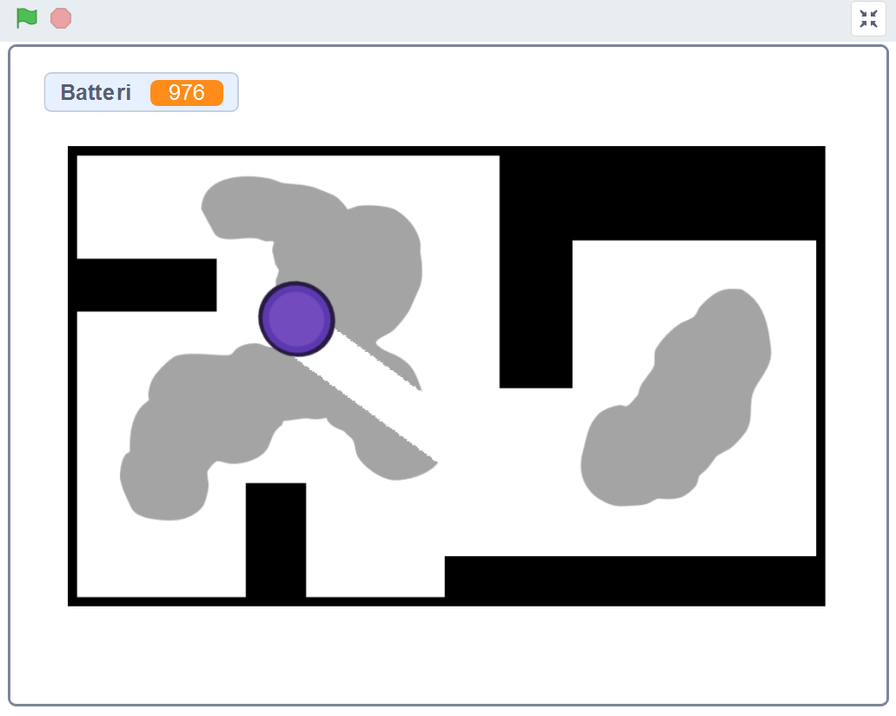 </a>

> **HUR KODAR JAG?** 
Följ denna instruktion steg för steg och koda ditt projekt i verktyget Scratch. <a href="https://scratch.mit.edu" target="_blank"> Klicka här för att öppna Scratch i en ny flik.</a> I Scratch klickar du på Skapa för att börja. Logga gärna in på Scratch så kan du spara och om du vill även sen dela ditt projekt. Det är gratis att skaffa ett konto på Scratch.
 

Dax att ge en kompis till din städrobot! Klicka på kapitel 1 här under för att bläddra dig vidare.

Kanske finns det något i rummet som roboten behöver undvika? Kanske finns det något husdjur eller möbel som roboten måste stanna för att inte köra på? 

## 1 Koda ett litet husdjur 

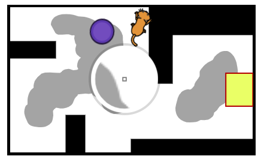

Börja med rita en ny sprajt som blir ditt husdjur eller välj en färdig sprajt som du tycker skulle vara rolig att ha som ett husdjur!

> Notera: Om du ritar en egen figur, var noga med att det inte har samma färg som dina väggar, golv eller smuts. 

Vi kodar husdjuret på samma sätt som vi kodade dammsugaren. 

1. Börja med att lägga till ett **Gå 10 steg**-block från **RÖRELSE** och ändra variabeln i det till 5 steg. 

2. Vi vill också att husdjuret ska gå framåt hela tiden, så vi lägger röresleblocket inuti ett **För alltid**-block - alltså en loop.

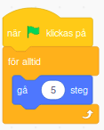

3. Lägg till ett startblock från tema **HÄNDELSER**, alltså blocket **När START-flaggan klickas på** och sätt den överst i skriptet.

4. För att husdjuret ska vändra då det rör vid en vägg, behöver det känna av väggarnas färg. Lägg till blocket **Om...Då** som finns under tema **KONTROLL**. Välj sen tema **KÄNNA AV** och välj blocket **Rör vid färgen?**. Dra in detta block inuti **Om...Då**-blocket.

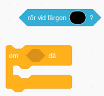

5. Klicka på den färg som finns i **Rör vid färgen?**-blocket och använd pippettverktyget för att välja exakt samma färg som väggarna genom att klicka på en av väggarna på scenen.

6. Nu känner husdjuret av om den åker in i en vägg! För att husdjuret ska vända åt andra hållet, väljer du temat **RÖRELSE**och drar ut blocket för **Rotera vänster 15 grader**. Klicka på variabeln 15 och ändra till 36 grader istället.

Lägg nu in röresle-blocket du har på skriptytan, så den hamnar **Fär alltid**-loopen, direkt under **Om...Då**-blocket. Då ska skriptet se ut såhär: 

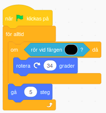

Nu har vi ett husdjur som rör sig runt i rummet!

> Tips! Vill du att ditt husdjur ska röra sig lite olika genom rummet, kan du prova med att lägga in att den förslagsvis ska vänta några sekunder ibland på olika ställen, eller att den ska röra sig annorlunda om den kommer nära robotdammsugaren. Kanske den ska ha röst eller  ljud - eller pratbubbla med text som säger någonting? Kanske du kommer på egna andra idéer?

## 2 Få dammsugaren att undvika husdjuret
För att dammsugarroboten inte ska åka in i husdjuret - eller kanske i olika möbler eller människofigurer - kan du koda så att den stannar om den möter på något. För att roboten ska akta sig för att åka in i husdjuret gör du såhär:

1. Se till att dammsugarrobot-sprajten är vald, så att du kan koda vidare på robotens skriptyta. 

2. Välj tema **KONTROLL** och dra in ett till **Om...Då**-block. Placera det direkt ovanför det **Om...Då**-block du redan har i skriptet som känner av färgen på väggarna. 

3. I det nya **Om...Då**-blocket lägger vi till ett **Rotera vänster 15 grader**-block. Klicka på variabeln "15" och ändra det till "36" grader. (Du kan givetvis valfritt välja mellan ett vänd vänster eller vänd höger-block)

4. För att få dammsugaren att vända riktning när den stöter på husdjurs-sprajten tar vi under **KÄNNA AV** ett **Rör vid muspekare?**-block. Klicka sedan på lilla pilen på **Rör vid muspekare?**-blocket och välj vårt husdjurs-sprajt i listan, så muspekare nyts ut mot din husdjurssprajts namn. Detta **Rör vid...?**-block sätter vi sen in inuti det nya **Om...Då**-blocket. 

Sådär! Nu undviker robotdammsugaren även ditt husdjur som springer runt i lägenheten!

> Tips! Du kan givetvis göra på samma sätt för att undvika exempelvis en möbel eller annat i din lägenhet. Det är bra om alla saker som roboten ska undvika har en egen speciell färg, annars kan inte roboten veta vad den rör vid. Men det går såklart bra att allt har samma färg som exempelvis väggarna, så undviker roboten alltid just den färgen.

## 3 Koda ett batteri och en laddningstation till dammsugaren!
1. Börja med att rita eller välja en sprajt som ska vara platsen där robotdammsugaren kan ladda sitt batteri. 

2. Skapa därefter en ny **Variabel** och döp den till **Batteri**. 

> En variabel kan ses som en låda i vilken vi lägger en liten kom-ihåg lapp med någon form av information. I det här fallet är informationen hur mycket batteri som dammsugaren har kvar att använda innan den behöver laddas - som en batterimätare.

3. När vi startar skriptet vill vi att batteriets variabel ska vara **1000**, så därför lägger vi till ett variabel-block som kan ändra variabelns värde. Var noga med att ändra så att det i blocket står **sätt "Batteri" till 1000**, så det ser ut såhär:

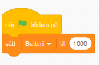

4. Nu kan vi börja koda batteriets möjlighet till laddning och urladdning. Börja med att sätta ett **för alltid**-block (en loop) direkt inunder **sätt batteri**-blocket. Inuti loopen kommer vi sätta in två stycken **om...då**-block. Ett som sköter batteriets laddande, och ett annat som sköter batteriets urladdning. 

5. Nu kodar vi först delen för batteriets laddning. Ta ett **känna av**-block och välj sprajten för vår dammsugare. Inuti blocket sätter vi därefter ett variabelblock som heter **ändra batteri med** och ändrar variabeln till **5**. För att det ska synas vad som händer kan vi lägga till ett **säg __ i 2 sekunder**-block från tema UTSEENDE som du ändrar text i så den säger "Laddar!". När du är klar ser skriptet ut såhär:

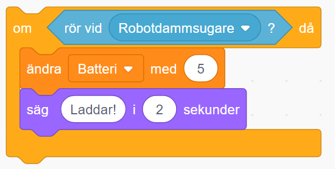
 
Vi stoppar in skriptet ovan i vårt **för alltid**-block och så det ser ut såhär:

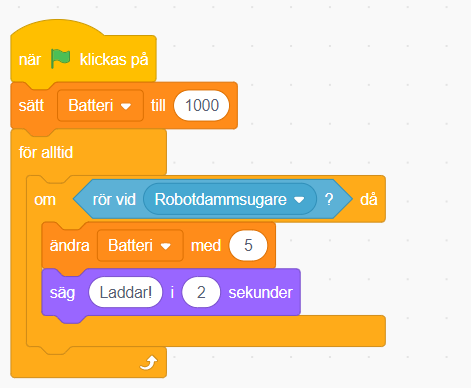

Nu går det att ladda roboten!
För att göra det realistiskt behöver vi också skriva lite kod så att robotens batteri laddas ut medan den städar. 

6. Från tema KONTROLL drar vi in ett **om...då...annars**-block. Och från tema OPERATORER tar vi ett kantigt block som har tecken för att något är "större än", alltså block med **__ > __** och sätter in **operator**-blocket i det kantiga hålet mellan **om...då**. Gå sedan till tema VARIABLER och dra in blocket du skapade som heter **Batteri**. Lägg det i operatorns vänstra vida cirkel. Skriv sedan värdet **0** i den högra cirkeln på operatorn. Då kan blocket göra jämförelsen **om "Batteri" är större än 0**. Alltså om värdet som håller reda på variablen i kodblocket som heter Batteri är större än 0 - då ska något hända.  Koden ser alltså nu ut såhär:

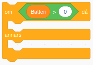

7. Vad ska då hända? Jo, batteriet ska laddas ur. Gör såhär: Innanför **om...då**-delen av blocket sätter vi ett **ändra "Batteri" med 1**-block och skriver in **-1** som variabel. Längre ned i blockets **...annars**-del sätter vi in ett **Säg __ i 2 sekunder**-block från tema UTSEENDE, och skriv in "Åh nej! Batteriet tog slut!". Ändra till förslagsvis 5 sekunder i variablen. 
När du är klar borde skriptet se ut såhär:

Sätt nu även detta skript innuti **för alltid**-blocket, så att skriptet för batteriets kod ser ut såhär:

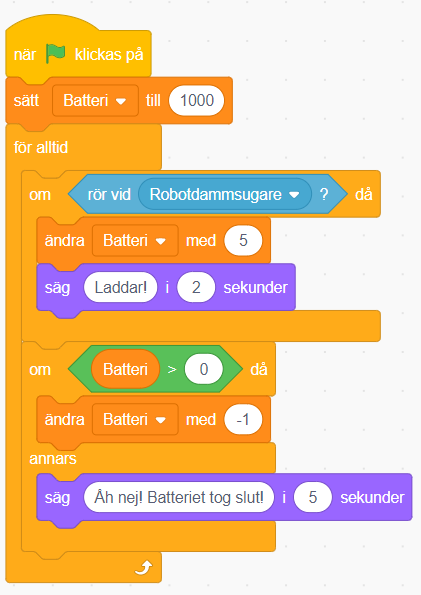

Nu Har vi kodat batteriets laddning och urladdning. Då återstår bara att göra så att robotdammsugaren stannar helt och inte kan röra sig framåt om den råkar få slut på sitt batteri. Gör såhär:

8. Välj din dammsugarsprajt och skapa ett nytt om block. I det lägger vi in en jämförelse som kollar om batteriet är större än noll.

Nu ska vi bara lägga in detta block innanför **för alltid**-blocket, och dra med även all den kod som tidigare låg innanför **för alltid**-blocket i det nya om blocket. När du är klar bör det se ut såhär:

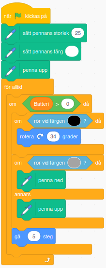

Sådär! Nu använder din robotdammsugare ett batteri och kan ladda det!

### Saker att arbeta vidare på
1. Kan du göra så att roboten kan känna av och skilja på flera olika saker? Kanske finns det en viss typ av smuts som den inte ska damsuga upp utan istället hälla vatten på? 

2. Går det att få roboten att röra sig på annat sätt?

3. Ska roboten och husdjuret ha ljud, kanske robot-ljud, varningssignaler eller husdjur som jamar eller skäller? Kanske pratbubblor med text?

4. Bygg en tidsräknare som räknar städtiden, eller en poängräknare som ger roboten minuspoäng om den dammsugar upp exempelvis strumpor eller kattgodis som katten letar efter. Kanske du kommer på fler egna idéer?
