# Städrobot

Visst kan det ibland kännas lite trist att städa. Varför inte skapa din egna robotdammsugare som kan hjälpa till? I den här uppgiften får du rita och koda din egen robotdammsugare! Det är lättare än vad du tror! 

Klicka på bilden nedan för att se ett exempelprojekt i Scratch på hur ett projekt med en robotdammsugare kan tänkas se ut: <a href="https://scratch.mit.edu/projects/374793805" target="_blank"> 

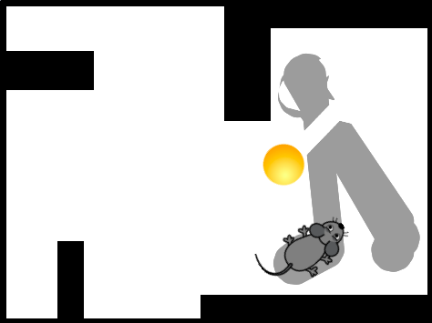 </a>
 
> **HUR KODAR JAG?** 
Följ denna instruktion steg för steg och koda ditt projekt i verktyget Scratch. <a href="https://scratch.mit.edu" target="_blank"> Klicka här för att öppna Scratch i en ny flik.</a> I Scratch klickar du på Skapa för att börja. Logga gärna in på Scratch så kan du spara och om du vill även sen dela ditt projekt. Det är gratis att skaffa ett konto på Scratch.
 

Dax att börja skapa din städrobot! Klicka på kapitel 1 här under för att bläddra dig vidare.

<!--## 1: Rita din robotdammsugare
Börja med att rita din robotdammsugare. Du bestämmer själv hur den ska se ut.
1. Ta först bort katt-sprajten som finns i projektet, genom att klicka på lilla *soptunnan* på den katt-bilden under scenen. 
 
2. För att rita din egen robotdammsugare går du till symbolen för **Välj ny sprajt** och klicka på pensel-symbolen **Måla**. Nu öppnas ett ritverktyg att måla med nya sprajtfigurer med. 
 
3. Rita din egen robotdammsugare med ritverktygen. Du väljer själv hur din robotdammsugare ska se ut! I vårt exempel ser vår  vår dammsugarrobot ut såhär:
 
Nu har vi en dammsugarrobot, men vart ska den städa? Vi går vidare. -->

## 1: Skapa en robotdammsugare
Börja med att skapa din robotdammsugare. Du bestämmer själv vilken sprajt du väljer.

1. Ta först bort katt-sprajten som finns i projektet, genom att klicka på lilla *soptunnan* på den katt-bilden under scenen. 

 

2. För att skaa din egen robotdammsugare går du till symbolen för **Välj ny sprajt** och klicka på på den. 

<!--[image alt text](städrobot_1.2.png)-->
 

3. Nu öppnas ett nytt fönster med många sprajtfigurer i. Välj den sprajten du vill ha som din robotdammsugare. Till vårt exempel har vi valt en ball som vår dammsugarrobot. 

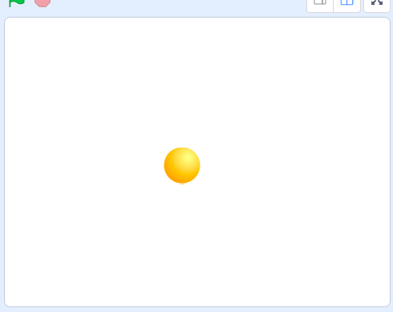 

Nu har vi en dammsugarrobot, men vart ska den städa? Vi går vidare.

## 2: Rita rummet som ska städas
Dax att rita rummet eller lägenheten som roboten ska städa. Du ska rita väggarna som om du ser rummet *ovanifrån*, exempelvis en enkel fyrkant. Endast väggarna ska ritas och det är viktigt att alla har exakt samma färg och att inget annat i bakgrunden är målat med samma färg som väggarna! Måla gärna golvet i en ny färg också.

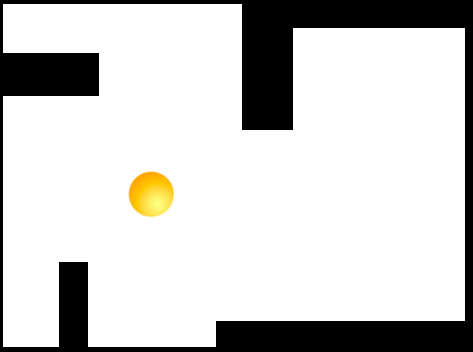 

Gör såhär:

1.  Klicka på lilla rutan där det står **Scen** i nedre högra hörnet av Scratch. Klicka sedan på fliken som heter **Bakgrunder** i övre vänsta hörnet, så får du fram ritverktyget för din bakgrundsbild. Här kan du rita rummet. 

 
 

2. Klicka först på den blå knappen under ritfönstret där det står **Gör till Bitmapp**. 

 

3. Välj sen verktyg att måla med, exempelvis **Pensel**, och en färg du vill ha på väggarna. Måla upp väggarnas form som om du såg rummet ovanifrån. Tänk på att inte göra det för trångt för roboten att kunna åka in mellan väggarna. 

 

4. Golvet kan också få en ny färg. Välj det lilla hink-verktyget som heter **Fyll färg**. Välj sen vilken färg du vill ha på golvet och måla det genom att klicka på ytan innanför väggarna. 

Nu har vi en dammsugarrobot och ett rum, men vi måste få roboten att börja röra på sig. Dax att börja koda.

## 3: Få roboten att röra sig
Nu ska vi börja koda roboten så att den vet hur den ska röra sig i rummet. Det första som vi vill göra är att få roboten att röra sig framåt. 

1. Välj fliken **Kod** högst upp till vänster för att komma bort från ritläget och tillbaka till där du kan koda med kodblocken. 

2. Se till att din sprajt för dammsugarroboten är vald, genom att klicka på den lilla bilden som visar din dammsugar-sprajt under scenen. Nu kan du koda din dammsugarrobot.

3. Är din dammsugarrobot för stor, så kan du ändra storleken på den. Under scenen finns **Storlek** och siffran 100 (alltså 100% full storlek). Ändra till lägre siffra, prova dig fram vad som passar.

4. Klicka på temat **RÖRELSE** och dra ut kodblocket **Gå 10 steg** till den tomma skriptytan. Ändra siffran i blocket så det istället står **Gå 5 steg**. 

5. Vi vill att roboten ska gå framåt hela tiden utan att sluta gå. Om vi loopar koden för rörelse, så kommer roboten gå framåt för alltid. Från tema **KONTROLL** drar du ut kodblocket **för alltid** till skriptytan. Lägg sen rörelseblocket **Gå 5 steg** inuti.

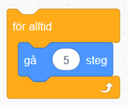

6. För att roboten veta när den ska börja röra sig behöver vi lägga till en startknapp. Under tema **HÄNDELSER** finns kodblocket **när GRÖN FLAGGA klickas på**. Dra in den på skriptytan och lägg den överst i skriptet med kodblock. Nu ska koden se ut såhär:

> **Testa koden!** Klicka på den projektets startknapp som är den gröna flaggan ovanför scenen - rör sig roboten framåt? 

Nu rör sig roboten, men den känner inte av väggarna. Dags att koda vidare!

## 4: Känna av väggarna
Nu ska vi koda så att roboten känner av när den rör vid en vägg. Om roboten rör en vägg, då ska ska vrida sig lite och åka vidare. Gör såhär: 

1. Välj tema **KONTROLL** och dra in kodblocket **Om...Då**. Lägg det någonstans fritt på robotens skriptyta.

2. Välj tema **KÄNNA AV** och välj blocket **rör vid färgen__?**. Dra in kodblocket och lägg det inuti det lilla kantiga hålet mellan **Om** och **Då** i det gula blocket, så att koden säger: *om rör vid färgen__? då*.

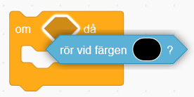

För att roboten ska kunna känna av att den rör vid en vägg, behöver den veta vilken färg väggen har. Viktig att färgpunkten i ditt kodblock har exakt ditt rums väggfärg. Det ordnar du såhär:

3. Klicka på den färgpunkt som just nu finns i ditt **rör vid färgen__?**-block. Då kommer fler färger fram. Klicka på pippettverktyget längst ned under färgvalen och klicka sedan på en av väggarna på scenen. Då ändras färgen i ditt **Rör vid färgen?**-block till just den väggfärg du målat ditt rum med.

Nu är färgen i din kod rätt, men vi måste även koda in vad roboten ska göra när den känner av en vägg! Vi vill att roboten ska vända lite åt sidan och åka vidare, bort från väggen. Gör såhär:

4. Välj tema **RÖRELSE** och välj blocket **Rotera höger 15 grader**. Lägg blocket inuti **om...då**-loopen. För att få roboten att svänga lite mer, kan du höja värdet lite. I vårt exempel har vi valt 34 grader.

5. Nu ska vi lägga ihop all kod vi har på skriptytan. Dra in **Om...Då**-blocket så det hamnar inom **För alltid**-loopen med **Gå 5 steg**, så att det ser ut som bilden nedan: 

> **Testa koden!** Klicka på den gröna flaggan ovanför scenen - rör sig roboten framåt? Vänder den när den åker in i en vägg?  

Nu har vi en robotdammsugare som rör sig runt i rummet och vänder när den stöter in i en vägg. Men den behöver smuts att städa upp. Vi lägger till en liten dammråtta som smutsar ned!

## 5: Koda en dammråtta 
Nu ska vi lägga till en liten sprajtfigur som smutsar ned - en dammråtta.

1. Välj en sprajt som blir din dammråtta. Du kan såklart välja annat djur eller rita din egen sprajt om du hellre vill det. Klicka på **Välj en sprajt** i nedre högra hörnet av Scratch för att lägga till en ny sprajtfigur. 

> **Tänk på!** Om du ritar en egen figur, var noga med att den inte har samma färg som din dammsugarrobot, väggar eller golv. 

Dammråttan ska också röra sig i rummet, så vi kodar den på samma sätt som vi kodade dammsugaren:

2. Från tema **RÖRELSE** lägger du till ett **gå 10 steg**-block och ändrar variabeln i blocket till 5 steg. 

3. Från tema **KONTROLL** drar du in ett **för alltid**-block. Lägg in rörelseblocket **gå 5 steg** inuti loopen.

4. Från tema **HÄNDELSER** drar du in startblocket **när GRÖNA FLAGGAN klickas på** och lägger det överst i skriptet.

5. För att dammråttan ska veta att den ska göra något om den stöter in i en vägg, behöver den känna av väggens färg. Från tema **KONTROLL** drar du in blocket **Om...Då** och lägger det fritt på skriptytan. Välj sen tema **KÄNNA AV** och blocket **rör vid färgen__?**. Lägg detta block inuti det kantiga hålet mellan **Om...Då**.

6. Klicka på cirkeln med färg som finns i blocket **rör vid färgen__?** och klicka på pippettverktyget längst ned i rutan som kommer upp. Klicka på väggens färg på scenen för att välja exakt samma färg som väggarna.

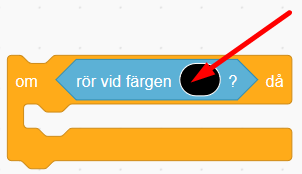

7. För att husdjuret ska vända sig om den rör vid en vägg, väljer du tema **RÖRELSE** och drar ut blocket **Rotera höger 15 grader**. Klicka på variabeln 15 och skriv 34 grader istället.

Lägg nu in hela denna **om...då**-loop med väggfärg och röresle in i  det andra skriptet så allt hamnar inom **för alltid**-loopen. Då ser skriptet ut såhär: 

Nu har vi en dammråtta som rör sig runt i rummet! Men den ju ska smutsa ned också. Vi lägger till en penna som ritar smuts där råttan åker fram.

> Istället för att skriva samma kod, kan du kopiera koden från dammsugaren och klistra den på dammråttan. Så här gör du för att kopiera ett skript: 

1. Klicka på texten **Ryggsäck** som finns nedan för skärmen.
2. Klicka sedan på koden så att den lyser gul runt om och dra den till ryggsäcken. 
3. När ni ser en mini-version av koden i ryggsäcken, då är koden kopierad. Annars, försök att dra koden igen. 

Så här gör du för att klistra koden:

1. Gå till dammråttan och öppna **Ryggsäcken** genom att klicka på den. 
2. Dra den koden du kopierade från ryggsäcken till skriptytan. 
3. Nu har du samma kod som du har på dammsugaren utan att behöva skriva en enda kod!

## 6: Dammråttan smutsar ned
Vi ska nu lägga till kod som gör att dammråttan smutsar ned i lägenheten där den åker runt. Det löser vi genom att lägga till specialblocket **Penna**, som ritar smuts efter dammråttan. Gör såhär:

1. Nere i vänstra hörnet av Scratch hittar vi en knapp för **Tillägg** som ser ut såhär:

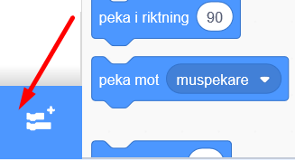

2. Klicka på knappen **Tillägg**  och klicka sen på bilden som heter **Penna**, så läggs den till i ditt Scratchprojekt. 

Sådär! Nu finns nya pennblock att koda med. Dax att koda vidare så dammråttan kan börja smutsa ned - eller ritar "damm" med en penna!

3. Under nya temat **PENNA** drar du ut ett **sätt pennans storlek 1**-block och lägger det direkt under dammråttans starblock **när GRÖN FLAGGA klickas på**. Ändra pennans storlek till 10, det blir lagom. 

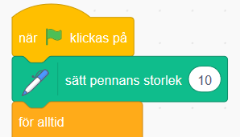

4. Från tema **PENNA** drar du in blocket **sätt pennans färg till**. Klicka på cirkeln med färg i blocket och välj en dammfärg du gillar. Lägg in blocket direkt under det förra med pennans storlek.

> **Tänk på!** Smutsfärgen kan inte vara samma som färgen som på dammsugarroboten, dammråttan, golv eller väggar.

5. För att pennan ska börja måla smutsfärg där dammråttan åkt fram, väljer du tema **PENNA** och drar in blocket **penna ned**. Lägg blocket direkt under det förra med pennans färg.

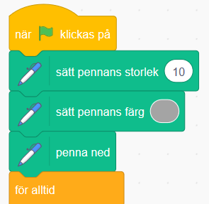

6. Slutligen lägger du till ett block för att radera all pennfrg med dammet varje gång du startar om koden. Under tema **PENNA** drar du in blocket **radera allt**. Lägg den överst i dammråttans kod under **när GRÖN FLAGGA klickas på**. 

> **Testa koden!** Vad händer när du kör igång koden? Ritar dammråttan smuts? Vänder den om den stöter i väggen?

Nu har vi en robotdammsugare och en dammråtta som ritar smuts. Men dammsugaren städar inte upp smutsen. Vi kodar in vidare!

## 7: Dammsugarroboten får också en penna
Vi vill att smutsen ska se ut att försvinna när dammsugaren åkt över den. Det löser vi genom att låta dammsugaren får en penna med golvfärg att rita över smutsen med, så ser det rent och städat ut igen! Gör såhär:

1. Se till att sprajten för dammsugarroboten är aktiverad, så att du kodar rätt sprajt.

2. Under tema **PENNA** finns kodblocket **sätt pennans storlek 1**. Lägg in detta block i robotens kod direkt under start-blocket **när GRÖNA FLAGGAN klickas på**. Ändra siffran 1 till en lagom stor storlek, i vårt exempel är det 20. Pennans storlek behöver vara mindre än din robotdammsugare! Prova dig fram.

3. Från tema **PENNA** lägger du även till blocket **sätt pennans färg**. Lägg det direkt under blocket med pennans storlek.

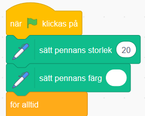

4. Pennan måste ha golvytans färg att rita över smutsen med, så att den ser ut att städa rent. Klicka på färgcirkeln i blocket och välj pippetten längst ned i rutan som kommer fram. Klicka på golvfärgen i scenen, så ändras färgen i kodblocket till den rätta golvfärgen. I vårt exempel har vi en vit golvfärg.

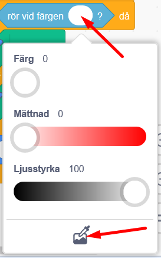

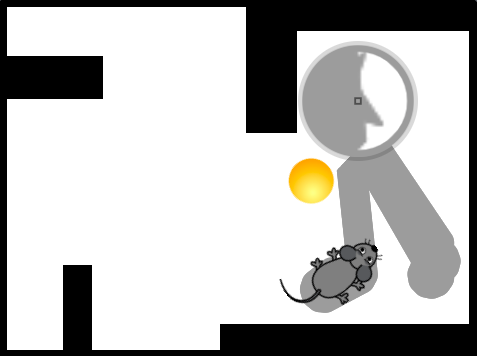

> **Tänk på!** Det är viktigt att färgen på pennan har exakt samma färg som golvet i rummet du ritat. Då ritar pennan över dammråttans smutsfärg med golvfärgen.

Vi vill kunna styra när dammsugaren ska rita med pennan och när den ska sluta rita. Därför lägger vi till kodblock som lyfter upp pennan från golvet så den inte ritar över med färg hela tiden - utan bara när den rör vid smuts. Gör såhär: 

5. Från tema **PENNA** dra du in blocket **penna upp**. Lägg blocket direkt under den två andra pennblocken i robotens skript. 

6. Från tema **PENNA** drar du även in blocket **radera allt**. Lägg det direkt under startblocket **när GRÖN FLAGGA klickas på**. Detta kodblock gör att all färg försvinner varje gång vi startar om roboten. 

Nu har vi en robot som kan måla golvfärg. Men den behöver veta när den ska måla och vad den ska måla över, alltså *känna av* när den åker över smuts. Vi kodar vidare.

## 8: Dammsugarroboten städar
Först ska vi koda så att roboten känner av dammet i rummet - eller snarare dess färg. Då ska den börja rita över dammet med golvfärgen så det ser fint ut igen. Gör såhär:

1. Under tema **KONTROLL** finns blocket **om...då...annars**- Dra in det och lägg det inuti **för alltid**-loopen direkt under blocket med **gå 5 steg** som redan ligger där. 

2. Från tema **KÄNNA AV** drar du sedan in ett **rör vid färgen**-block. Klicka på färgen i blocket och pippettverktyget, sedan på råttans sammfärg i rummet på scenen. Då får blocket rätt dammfärg och roboten kan "känna av dammet".

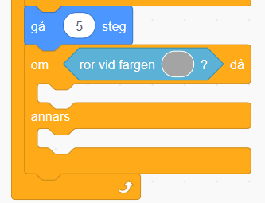

3. När roboten känner av dammet, ska den sätta ned pennan och måla över med golvfärg, om inget damm ska roboten ta upp pennan och sluta måla. Från tema **PENNA** drar du in ett **penna ned**-block och även ett **penna upp**-block och lägger dem inuti **Om...Då...Annars**-blocket, så att det ser ut som på bilden här:

> **Testa koden!** Försvinner smutsen när dammsugarroboten åkt över det? Får golvet sin rätta färg igen bakom roboten? Städar roboten upp allt smuts i lägenheten?

> **Tips!** Försvinner dina sprajtar ut från lägeneheten? Testa att göra tjockare ytterväggar. Du kan även sätta in en startposition i början på varje sprajts skript från tema **RÖRESLE** med blocket **gå till x:__ y__.

## Färdig!
Grattis, nu har du skapat din egen robotdammsugare! Det färdiga skriptet för roboten i sin helhet borde se ut ungefär så här - om du följt instruktionerna:

**Skript för dammsugarrobot:**
 

**Skript för dammråtta:**
 
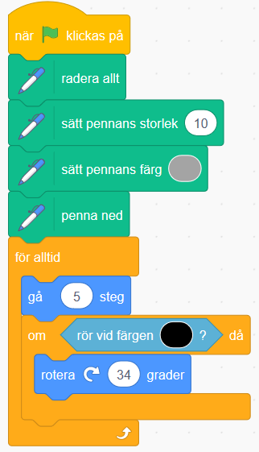

**Glöm inte att spara ditt projekt - och att döpa det!** Döp det gärna till uppgiftens namn Robotdammsugaren - eller hitta på ett eget namn, så att du enkelt kan hitta det igen. Du skriver in namn på spelet högt upp ovanför projektet, där det nu står "Scratchprojekt". Spara sedan, men du måste vara inloggad för att kunna spara.

> **Testa ditt projekt**  
Visa gärna någon ditt spel och låt dem testa. Om du vill, tryck på knappen DELA som du finner överst så kan andra också hitta spelet på Scratch sajt och testa det.

> **Viktigt om du delar ditt projekt:** Tänk på att delade projekt kan ses, testas och remixas (omskapas) av alla som vill på Scratch sajt. Det är viktigt när du sparar och delar att projektet inte innhåller information, bilder eller ljud du inte vill sprida till andra.

## Utmaning
Saknas något? Hur skulle du vilja utveckla projektet? 
Kanske finns det något i rummet som roboten behöver undvika? Kanske finns det något husdjur eller möbel som roboten måste stanna för att inte köra på? 

Här nedan följer några exempel på vad du kan koda in i projektet. Vi börjar med ett kodat husdjur som roboten ska akta att inte köra på.

### Få dammsugaren att undvika dammråttan
För att dammsugarroboten inte ska åka in i dammråttan - eller kanske i olika möbler, husdjur eller människofigurer som du vill lägga till - kan du koda så att roboten stannar om den möter på något. För att roboten ska akta sig för att åka in i dammråttan gör du såhär:

1. Se till att dammsugarrobot-sprajten är vald, så att du kan koda vidare på robotens skriptyta.

2. Välj tema **KONTROLL** och dra in ett till **Om...Då**-block. Placera det direkt ovanför det **Om...Då**-block du redan har i skriptet som känner av färgen på väggarna. 

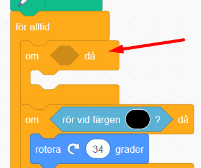

3. Inuti det nya **Om...Då**-blocket lägger vi till ett **Rotera vänster 15 grader**-block från tema **RÖRELSE**. Klicka på variabeln "15" och ändra det till "36" grader.

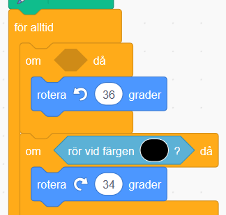

4. Roboten behöver känna av när den rör vid dammråttan. Från tema **KÄNNA AV** drar du ut ett **Rör vid muspekare?**-block och lägger in det i lilla hålet i ditt **om...då**-block. Klicka på lilla pilen på **Rör vid muspekare?**-blocket och välj dammråttans sprajt från listan som visas. 

Sådär! Nu undviker roboten din dammråttan som springer runt i lägenheten!

> **Tips!** Vill du att dammråttan ska röra sig lite olika genom rummet, kan du prova med att lägga in att den ska vänta några sekunder ibland på olika ställen, eller att den ska röra sig annorlunda om den kommer nära robotdammsugaren. Kanske den ska ha röst eller ljud - eller pratbubbla med text som säger någonting? Kanske du kommer på andra idéer?

### Saker att arbeta vidare på
1. Kan du göra så att roboten kan känna av och skilja på flera olika saker? Kanske finns det en viss typ av smuts som den inte ska damsuga upp utan istället hälla vatten på? 

2. Går det att få roboten att röra sig på annat sätt?

3. Ska roboten och husdjuret ha ljud, kanske robot-ljud, varningssignaler eller husdjur som jamar eller skäller? Kanske pratbubblor med text?

4. Bygg en tidsräknare som räknar städtiden, eller en poängräknare som ger roboten minuspoäng om den dammsugar upp exempelvis strumpor eller kattgodis som katten letar efter. Kanske du kommer på fler egna idéer?

## Frågeställningar

* Vad är en loop?

* Varför är en loop bra att använda ibland?

* Vad är ett villkor? 

* Vad händer om roboten inte känner igen väggfärgen?

* Vad händer om dammråttan har samma färg som dammet?
