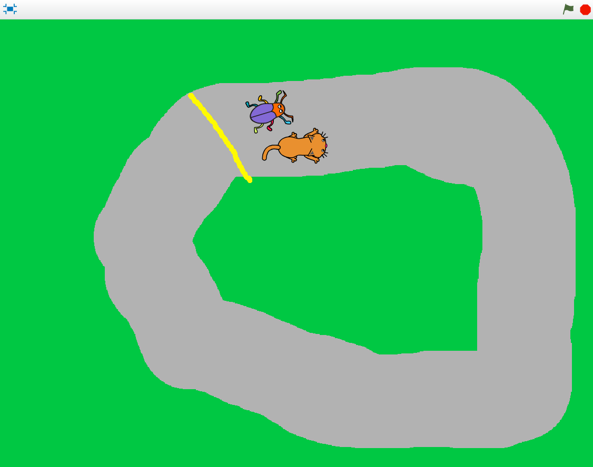
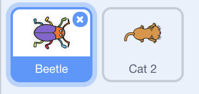
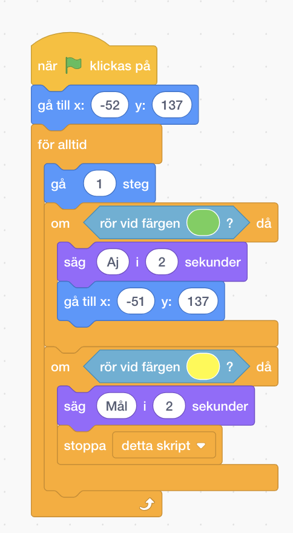
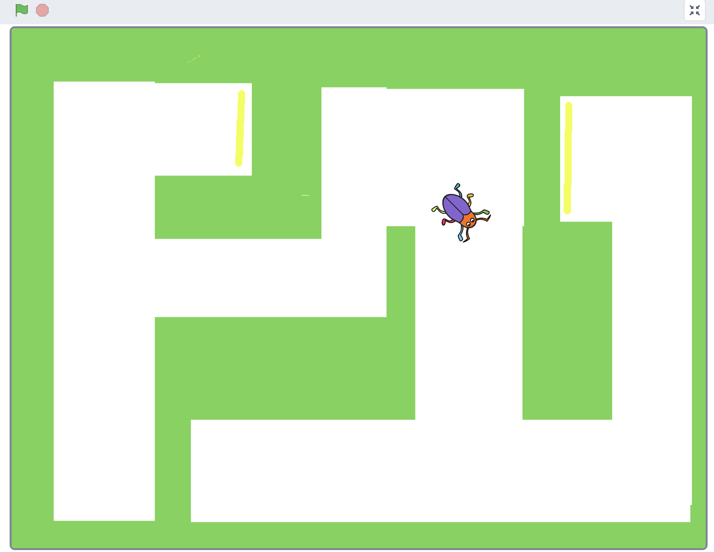
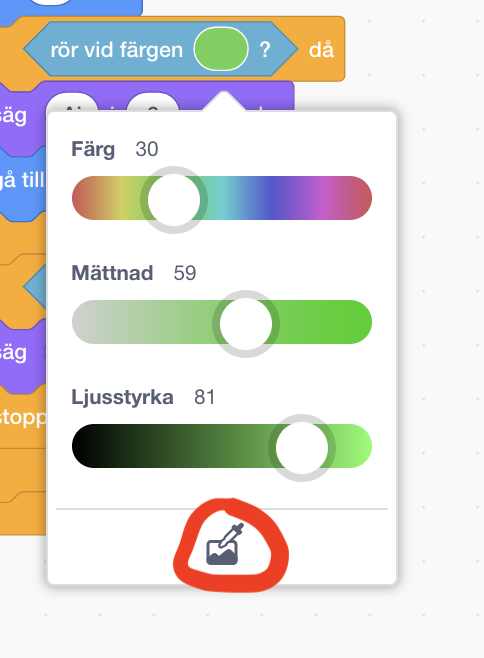

# Bug Race - Additions (English)

If you have created the game Bug Race - Intro you have a game where you control a beetle that runs around a track. The goal of the game is to stay on the track and if you don’t it is Game Over. But how do you win the game? And how can you add more players or add more levels? Here are suggestions on how to develop your project. You can pick one thing, all of them and add your own! 

> **STEP-BY-STEP INSTRUCTIONS** 
 

<a href="https://scratch.mit.edu" target="_blank"> Click here </a> to open Scratch in a new tab. 
You need to log in so that you can open your already made project **"Bug Race – Intro"**, which you are now going to develop further.  

>**Note!** Remember that you can look back at the previous instructions of <a href="https://www.kodboken.se/start/skapa-spel/uppgifter-i-scratch/bug-race-intro-english?chpt=0" target="_blank"> Bug Race - Intro </a> if you can’t remember how to code certain scripts. 
 

Let’s start developing the game! 

## 1: Add a finish line to win the game

With a finish line on the track you can code a script that says that you win the game when the beetle crosses it. The code is similar to the script you created in Bug Race to show Game Over when the beetle runs off the track. To code the finish line, follow these steps: 

1.  Start by drawing a goal line where you want it, preferably just behind the beetle's starting position.

  

2. Now create a condition for the beetle that says: **If** the beetle touches the color of your finish line, **then** you win the game. (Note: Look at the script you coded for Game Over – you want to look at CONTROL.)

3. What do you want should happen **if** the beetle touches the finish line? Should it say "Goal!" or "Congratulations!" Add **"stop this script"** to end the game.

4. Place your new code in your **"forever"** loop. This is what it might look like:

  
  
Now you've created the script for the finish line. 
On the next page you can add more players. 

## 2: Flera spelare

Nu har du ett spel för en spelare. Men det kan vara roligt att spela flera – eller spela med två händer! Om banan är tillräckligt bred kan du lägga till en skalbagge eller något annat djur och låta dem tävla mot varandra om vem som kommer först i mål.

1.  Börja med att lägga till en ny sprajt. Välj fritt i biblioteket eller kopiera den sprajt du redan har i projektet om du vill ha två likadana sprajtar som tävlar mot varandra. Ändra storlekarna på sprajtarna så att båda får plats bredvid varandra på banan.

3. Du behöver ändra skripten för att styra sprajten så att inte båda ska styras med vänster- och högerpil. Välj i rullistan för **"när _ trycks ned"**, till exempel tangenterna A och D.

4. Du kanske märker att din nya sprajt startar på samma ställe som skalbaggen? Du behöver ändra startposition. Flytta sprajten dit du vill att den ska stå. Du hittar sprajtens koordinater i sprajtens informationsruta, markera sprajten och tryck på "i". Ändra värden för **"gå till x: y:"**.

  

> Testa spelet! Nu kan du styra båda sprajtar. Men vad händer när en av dem hamnar utanför banan?

5. Om du vill kunna tävla om vem som kommer först i mål, kan det inte bli Game Over när en spelare hamnar utanför banan. Istället kan du t ex välja att sprajtarna säger "Aj!" och hamnar tillbaka på sin startposition. Så här kan det se ut då:

  

> Testa spelet! Om det buggar och någon sprajt säger "Mål!" för tidigt kan det bero på att färgen gult finns i den nya sprajten. Testa att ändra färg då.

nu har du kodat in fler spelare.
På nästa sida kan du ändra banan till en labyrint.

## 3: Ändra banan till en labyrint

Eftersom skriptet för sprajtarna bara känner av om de rör sig på grön färg, och inte hur själva banan ser ut, är det enkelt att byta ut banan. Du kan till exempel göra en labyrint som bakgrund istället.

1. Tryck på din SCEN och gå till fliken för BAKGRUNDER. Välj **Rita ny bakgrund**.

2. Fyll först med samma gröna färg som i din första bakgrund. Du kan välja färg med färgväljaren som finns till höger om färgrutorna, tryck på den och sedan på den gröna färgen i din första bakgrund.

  

3. Gör en labyrint genom att dra upp flera vita rektanglar på den gröna bakgrunden, eller rita själv med penseln. Tänk på att banan behöver vara tillräckligt bred för att kunna spela!

4. Rita en gul mållinje i slutet av labyrinten. Tänk på att använda samma gula färg som till mållinjen du ritade i Tillägg 1. Om du inte vill ha en mållinje kan du istället rita gula bananer eller något annat som spelaren ska nå fram till.

> Tips: Gör flera olika bakgrunder och se vilka som är roliga att spela med!

Nu har du skapat ny bana.
På nästa sida kan du skapa mjukare styrning när sprajtarna svänger.

## 4: Mjukare styrning

Du har kanske märkt att det kan vara svårt att styra sprajten när du spelar. Varje tryckning vrider den ett visst antal grader,
men om du håller inne händer ingenting - förrän efter en liten stund. Då börjar den snurra jättefort!

Den här "ketchupeffekten" kan man se när man skriver text också. Testa i en ruta där du kan skriva text, som till
exempel längst upp i internet-browsern där Scratch är öppet. Om du trycker ner "a" på tangentbordet kommer först ett a,
sedan ingenting - och sedan en hel rad, jättesnabbt.

För varje "bokstav" som datorn får inskickad, kommer Händelsen "När [a] trycks in" att skickas, och det lilla skriptet
som vrider sprajten blir utfört. Det är därifrån "ketchupeffekten" kommer.

Men det finns andra sätt för Scratch att läsa av tangentbordet. Under "Känna av" finns ett villkor som heter
"tangent [mellanslag] nedtryckt?".

Det kan man använda i ett "Om"-block (som man kan hämta från fliken "Kontroll")
för att få sprajten att vrida sig lite grann när en viss knapp är nedtryckt (man kan ändra [Mellanslag] till vilken
tangent som helst).

Var ska man placera "Om"-blocket, då? Tja, om man lägger det på samma ställe som flyttar sprajten framåt hela tiden,
så kommer den vrida sig lite grann för varje steg framåt, om knappen man valt är nedtryckt. Då får man en mjuk sväng.

Prova olika värden för hur många grader den ska vrida sig! Och glöm inte att ta bort de de andra skripten som vrider
på sprajten!

## Färdig!
Grattis, nu har du gjort klart uppgiften.

**Glöm inte att spara ditt projekt!** Döp det gärna till uppgiftens namn så att du enkelt kan hitta den igen.

> **Testa ditt projekt**  
Visa gärna någon det som du har gjort och låt dem testa. Tryck på **dela** för att andra ska kunna hitta spelet på Scratch. Gå ut till projektsidan och låt någon annan testa spelet!

## Utmaning
Har du tid över? Här kommer en utmaning för dig som vill fortsätta:

### Flera banor
Kan du skapa skript som **byter scenens bakgrund** när en spelare kommer i mål – så att spelet består av flera banor?

## Frågeställningar

* Hur kan du kopiera kod i Scratch?

* Vad kan du behöva tänka på när du kopierar kod mellan olika sprajter?
