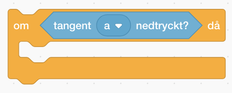

# Bug Race - Additions (English)

If you have created the game Bug Race - Intro you have a game where you control a beetle that runs around a track. The goal of the game is to stay on the track and if you don’t it is Game Over. But how do you win the game? And how can you add more players or add more levels? Here are suggestions on how to develop your project. You can pick one thing, all of them and add your own! 

> **STEP-BY-STEP INSTRUCTIONS** 
 

<a href="https://scratch.mit.edu" target="_blank"> Click here </a> to open Scratch in a new tab. 
You need to log in so that you can open your already made project **"Bug Race – Intro"**, which you are now going to develop further.  

>**Note!** Remember that you can look back at the previous instructions of <a href="https://www.kodboken.se/start/skapa-spel/uppgifter-i-scratch/bug-race-intro-english?chpt=0" target="_blank"> Bug Race - Intro </a> if you can’t remember how to code certain scripts. 
 

Let’s start developing the game! 

## 1: Add a finish line to win the game

With a finish line on the track you can code a script that says that you win the game when the beetle crosses it. The code is similar to the script you created in Bug Race to show Game Over when the beetle runs off the track. To code the finish line, follow these steps: 

1.  Start by drawing a goal line where you want it, preferably just behind the beetle's starting position.

  

2. Now create a condition for the beetle that says: **If** the beetle touches the color of your finish line, **then** you win the game. (Note: Look at the script you coded for Game Over – you want to look at CONTROL.)

3. What do you want should happen **if** the beetle touches the finish line? Should it say "Goal!" or "Congratulations!" Add **"stop this script"** to end the game.

4. Place your new code in your **"forever"** loop. This is what it might look like:

  
  
Now you've created the script for the finish line. 
On the next page you can add more players. 

## 2: Multiple players

You have a game for one player. But it can be fun to play against someone else – or play with two hands! If the track is wide enough, you can add a beetle or other animal and let them compete against each other for who crosses the finish line first. 

1.  Start by adding a new sprite. Choose in the library or copy the sprite you already have in the project. If you copy the sprite, which you do by right-clicking and selecting ‘duplicate’ the code will follow with the new sprite. If you select a new sprite, you’ll need to enter code again or manually copy code to the new sprite. Change the sizes of the sprites so that they fit next to each other on the track.

2. Change the code so that the sprites are controlled with different keys on the keyboard. Select in the drop-down list for "when _ key pressed." You might want to pick for example the keys A and D so that you are not too close on the keyboard when you play.

3. With the copied code, your new sprite will start in the same position as the beetle. So, you need to change its starting position. Move the new sprite to where you want it to start. Then change values for the **"go to x:_ y:_"** block in the sprites script. You can find the sprites new coordinates in the information box below the stage. Use these coordinates when you change values in the block. 

  

> **Test your game!** Can you control both sprites? But what happens when one of them ends up off the track? 

4. If you want to be able to keep going until the first person crosses the finish line, it can’t be Game Over when a player runs of the track. Instead, you can, for example, get the sprite to say "Oh no!" and go back to its starting position. This is what it might look like then:

  

>**Note!** If a sprite says "Congratulation!" too early you’ve detected a bug J. It may be because part of your sprite is the same color as the finishing line. Debug, by changing colors. 

Now you have two players and perhaps you want to create a maze of your track – check out the next page. 

## 3: Change the track to a maze 

Since the script for the sprites only detects if they are moving in green, and not what the track itself looks like, it is easy to replace the track. For example, you can make a maze as a backdrop instead. 

1. Press the **STAGE**, so it becomes activated. Then go to the **BACKDROPS** tab in the top left corner. 

2. In the bottom left-hand corner, hover with the mouse pointer over the blue button **Choose a Backdrop** and then press **Paint** (the brush) in the pop-up menu.  

3. First ‘Fill’ with the same green color as in your first background. You can select a color with the color picker, click on it and then click on the green color in your first background.

  

4. Make a maze by drawing several white rectangles on the green backdrop or use a brush to draw it yourself. Keep in mind that the track needs to be wide enough for the sprites to run on!

5. Draw a yellow finish line at the end of the maze. Remember to use the same yellow color as for the finish line you drew in your first game. If you don’t want a finish line, you can draw something else that the player must reach – can be bananas, flowers or anything you want.

>**Note!**: Make several different backdrops and see which is the most fun to play!  

You have now created a new track. 
On the next page, you can adjust your steering so that it is smoother to navigate the sprites. 

## 4: Mjukare styrning

Du har kanske märkt att det kan vara svårt att styra sprajten när du spelar. Varje tryckning vrider den ett visst antal grader,
men om du håller inne händer ingenting - förrän efter en liten stund. Då börjar den snurra jättefort!

Den här "ketchupeffekten" kan man se när man skriver text också. Testa i en ruta där du kan skriva text, som till
exempel längst upp i internet-browsern där Scratch är öppet. Om du trycker ner "a" på tangentbordet kommer först ett a,
sedan ingenting - och sedan en hel rad, jättesnabbt.

För varje "bokstav" som datorn får inskickad, kommer Händelsen "När [a] trycks in" att skickas, och det lilla skriptet
som vrider sprajten blir utfört. Det är därifrån "ketchupeffekten" kommer.

Men det finns andra sätt för Scratch att läsa av tangentbordet. Under "Känna av" finns ett villkor som heter
"tangent [mellanslag] nedtryckt?".

Det kan man använda i ett "Om"-block (som man kan hämta från fliken "Kontroll")
för att få sprajten att vrida sig lite grann när en viss knapp är nedtryckt (man kan ändra [Mellanslag] till vilken
tangent som helst).

Var ska man placera "Om"-blocket, då? Tja, om man lägger det på samma ställe som flyttar sprajten framåt hela tiden,
så kommer den vrida sig lite grann för varje steg framåt, om knappen man valt är nedtryckt. Då får man en mjuk sväng.

Prova olika värden för hur många grader den ska vrida sig! Och glöm inte att ta bort de de andra skripten som vrider
på sprajten!

## Färdig!
Grattis, nu har du gjort klart uppgiften.

**Glöm inte att spara ditt projekt!** Döp det gärna till uppgiftens namn så att du enkelt kan hitta den igen.

> **Testa ditt projekt**  
Visa gärna någon det som du har gjort och låt dem testa. Tryck på **dela** för att andra ska kunna hitta spelet på Scratch. Gå ut till projektsidan och låt någon annan testa spelet!

## Utmaning
Har du tid över? Här kommer en utmaning för dig som vill fortsätta:

### Flera banor
Kan du skapa skript som **byter scenens bakgrund** när en spelare kommer i mål – så att spelet består av flera banor?

## Frågeställningar

* Hur kan du kopiera kod i Scratch?

* Vad kan du behöva tänka på när du kopierar kod mellan olika sprajter?
