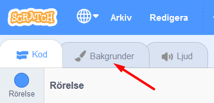
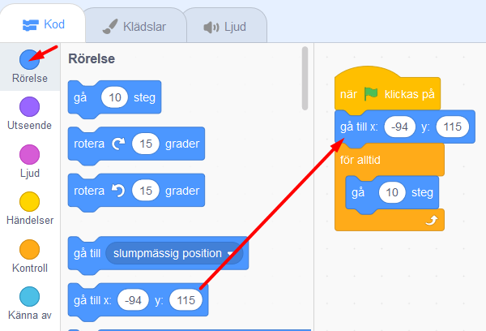

# Bug Race (intro)

Nu ska du få  skapa ett roligt spel som är enkelt även om du aldrig har jobbat med Scratch tidigare. Målet är att få en skalbagge att springa runt en bana och försöka undvika att hamna utanför banan genom att styra med vänster- och högerpil på datorns tangentbord. Ramlar figuren utanför banan blir du Game Over!

> Använder du Scratch 2.0 offline-version? <a href="https://www.kodboken.se/start/kom-igang/uppgifter-i-scratch/bugraceoffline">Här hittar du samma instruktion anpassad utifrån kodning med nedladdningsbara Scratch 2.0 offline</a>.

> Bläddra dig fram genom denna guide, steg för steg. <a href="https://scratch.mit.edu" target="_blank">
  Öppna även kodarverktyget Scratch genom att klicka på länken bredvid katt-figuren ovan eller via www.scratch.mit.edu</a>. Här kodar och skapar du själva spelet utifrån instruktionerna nedan. 

Hur kan spelet Bug Race komma att se ut? Klicka på bilden här under och testa ett exempel på det färdiga spelet på Scratch sajt. (Starta spelet där genom att klicka på den gröna flaggan på projektet som kommer fram.) 

Är du redo att koda? Då börjar vi! Klicka på steg 1 i gröna cirkeln nedan för att gå vidare i instruktionen.

## 1: Välj en skalbagge som sprajt

En **sprajt** är alla de figurer eller andra saker du väljer att lägga in i ditt spel eller projekt i Scratch, som en katt, en boll, ett ritat träd eller annat. Alla sprajter kan styras med den kod (script) du väljer att lägga in i Scratch. 

I ditt nya projekt visas först en katt som enda sprajt på vit bakgrund. Nu ska vi byta ut katten mot en skalbagge, så börja med att ta bort katten och välja en ny sprajt istället. Gör såhär:

1. Tryck på **krysset på lilla rutan med kattfiguren** så försvinner den - du har nu tagit bort den ur projektet.

     

2. Nu vill du lägga till en skalbagge istället. Tryck på knappen för **NY SPRAJT** som finns inunder den vita bakgrunden:

    

  En katalog med massa figurer dyker upp. I menyn till vänster finns en kategori som heter **"Djur"**, tryck på den. Bland alla djurbilder  hittar du skalbaggen. Tryck på den så har du lagt till en ny sprajt i ditt projekt.

3. Skalbaggen är ganska stor, för att spelet ska bli enklare att spela måste vi minska storleken på sprajten. Under projektet med sprajten hittar du **Storlek** och bredvid står det 100. Det betyder att sprajten är i full storlek, alltså 100%. Ändra siffran till en lägre procent, exempelvis 50 för hälften så stor. Testa dig fram tills den blir lagom stor (som din tummnagel ungefär). Du kan alltid ändra det sen igen om det blev för stort eller litet.

    

Nu är skalbaggen klar och det är dags att rita banan som den ska springa runt på!

## 2: Färglägg bakgrunden och rita en bana

Du ska nu få färglägga spelets bakgrund och rita en bana som skalbaggen kan springa på.

4. För att ändra på bakgrunden trycker du först på den vita lilla rutan längst ner till höger där det står **SCEN**, så den blir markerad. Klicka sedan på fliken **BAKGRUNDER** som du finner högst upp till vänster.

    	    

5. Tryck på blå knappen som det står **"Gör till bitmapp** på. 

    

Välj sen **en färg** du gillar genom att klicka på den lilla färgade rutan ovanför och ställ in färgen du vill ha, genom att dra eller klicka på de olika reglagen tills du är nöjd.

   
    
Fyll sen bakgrunden med färgen du valt genom att klicka på verktyget **Fyll** som ser ut som en liten hink och sen klicka på stora vita rutan så fylls bakgrunden med den färg du valt.

  
  
> Tips: Viktigt att färgen du valt inte är samma som någon färg som din sprajt har på sig. Annars kan det bli problem i ditt projekt längre fram.

6. Tryck sen på figuren som ser ut som en **PENSEL** och välj sen en annan färg som du vill ha för banan i ditt spel Viktigt att färgen inte är samma som färger som insekten har (eller den sprajt du valt). Gör även penseln mycket bredare genom att klicka länge på uppåtpilen som finns snett ovanför, eller bara skriva 100 i rutan bredvid pilarna. Strecket ska bli tjockt. 

 
 
 Rita nu en bana som en oval eller en utdragen cirkel - gör den så stor som du kan, utan att den hamnar utanför spelets ruta!

 Ungefär så här kan nu spelets bana se ut. Om banan är väldigt smal kommer spelet bli väldigt svårt, skalbaggen hamnar då lätt utanför banan - och du blir Game Over. Är banan bred blir spelet lite lättare då du har mer plats att styra runt på utan att åka ut! 

  

## 3: Ditt första skript

Nu när bakgrunden är färdig kan du börja skapa ditt första skript. Glöm inte att **spara** ofta! Du måste vara inloggad för att kunna spara.

Ställ muspekaren på skalbaggen och ta tag i den genom att hålla ned musknappen (eller håll på den med ditt finger om du använder surfplatta) och dra sprajten på den målade banan, släpp den där du tycker skalbaggen ska stå när ditt spel börjar.

Tryck på KOD-fliken högst upp till vänster. Nu kommer du bort från målarverktyget och tillbaka till vita ytan där du kan bygga din kod för spelet.

Har du lagt märke till START- och STOPP-knappen än? **Den gröna flaggan** betyder är en start-knapp och **den röda knappen** är en stopp-knapp.

  

Nu ska du koda så att skalbaggen börjar röra sig när du sen trycker på START-knappen - som alltså är **den gröna flaggan**. För att göra det måste du tala om för skalbaggen vad den ska göra, annars händer ingenting. Skalbaggen kan inte tänka av sig självt, den väntar på dina instruktioner. Du ska alltså koda och lägga till ditt första skript som säger:

"När jag trycker på START-flaggan, ska skalbaggen röra sig."

Gör såhär:

7. Överst till vänster hittar du flera färgglada rubriker med en massa kod-pusselbitar under. Klicka på gula rubriken **HÄNDELSER** och välj pusselbiten med en grön flagga på som är blocket för: **"när START (gröna flaggan) klickas på"**. Ta tag i och dra detta block till skriptytan (den stora tomma, vita ytan i mitten) och släpp den där. 

  

Välj sedan den blå rubriken **RÖRELSE** som finns längst upp och välj blocket **"gå 10 steg"**. Lägg detta block direkt under det första blocket med den gröna flaggan på scriptytan och koppla ihop dem som pusselbitar.

  

> Tips: om man för två block nära varandra på scriptytan dyker snart en grå skugga upp, då kan man bara släppa så kopplar blocken automatiskt ihop sig som pusselbitar.

  

> Testa nu vad som händer när du trycker på START. Flyttar sig skalbaggen åt lite höger! Det är bra, men du vill ju att skalbaggen skall röra sig framåt hela tiden när spelet startats, inte bara flytta sig superkort en enda gång. Hur gör du det? Jo, såhär:

8. Under orangea rubriken **KONTROLL** finns kodblocket **"för alltid"**. Det är en LOOP, alltså en **repetition** av något som sker om och om igen. Med detta block kommer skalbaggen fortsätter röra sig framåt så länge spelet är igång. 
Dra in **"för alltid"**-loopen och lägg den direkt under **"när START klickas på"** så blocket **"gå 10 steg"** hamnar inuti loopen. Kolla på bilden nedan så ser du hur du ska göra.

  

  _För att skalbaggen ska fortsätta att gå måste du lägga "gå 10 steg" i mitten av "för alltid"-loopen. "Gå 10 steg" kommer då att upprepas för alltid - om och om igen, så skalbaggen går och går och går._

> Testa att trycka på START - alltså den gröna flaggan ovanför spelet. Nu blir det fart på skalbaggen! Prova vad som händer om du ändrar antalet steg till en lägre siffra. Klicka på siffran 10 i blocket **gå 10 steg** och skriv in en annan siffra för en hastighet som du tror är lagom för att kunna styra skalbaggen. Testa dig fram tills det känns lagom snabbt.

  

## 4: Sätt en Startposition

För att slippa dra tillbaka skalbaggen till startplatsen på din bana varje gång du vill starta spelet, kan du säga åt datorn att placera den på en bestämd plats vid start. Detta kallas för att **initiera programmet** - du gör ett INIT-SKRIPT som berättar för datorn hur programmet ska starta.

Innan du gör ditt skript, flytta skalbaggen till den startposition på banan som du tycker din sprajt alltid ska börja på.

9. Under **RÖRELSE** väljer du blocket **"gå till x:__ y:__"** och koppla fast blocket direkt under **"när START klickas på"**, ovanför **"för alltid"**-loopen. De siffror (värden) som står vid X och Y är KOORDINATERNA för den startposition som du har ställt skalbaggen på - alltså en bestämd plats i ditt spel. 

  

Nu kommer skalbaggen automatiskt att förflyttas till samma startposition varje gång du trycker på gröna START-flaggan.

## 5: Styra skalbaggen

Nästa steg blir att göra det möjligt att styra skalbaggen, så den inte rusar rakt av banan! För det behöver du två korta skript. Ett som säger åt datorn att skalbaggen ska svänga åt höger när du trycker ned höger piltangent på datorns tangentbord, och ett annat som säger åt den att svänga vänster när du trycker ned vänster piltangent.

Gör såhär:

10. Under rubriken **HÄNDELSER** finns ett block som säger **"när mellanslag trycks ned"**. Dra in två sådana block och lägg dem bredvid varandra vart som som helst fritt på skriptytan. 

  

Bredvid ordet **mellanslag** i dessa två block finns en liten vit triangel. Klicka på lilla triangeln i vardera block och välj i rullistan som kommer fram -  ändra till **vänsterpil** i det ena blocket och till **högerpil** i det andra.

  

11. Nu ska vi få sprajten att kunna vända sig. Under **RÖRELSE** hittar du ett block som säger **"rotera (pil vänster) 15 grader"** och ett som säger **"rotera (pil höger) 15 grader"**. Koppla fast dessa två block under blocken **"när vänsterpil tangent trycks ned"** och **"när högerpil tangent trycks ned"**.

  

> Testa vad som händer nu när du trycker på gröna START-flaggan. Kan du styra skalbaggen åt båda hållen med piltangenterna på tangentbordet? Går det för fort? Sänk skalbaggens hastighet genom att ändra variabelsiffran i rörelse-blocket!

## 6: Ändra startriktning

Om du trycker på START-flaggan igen märker du att skalbaggen behåller den riktning som den hade när du avslutade spelet sist. Kan lätt bli fel håll och detta kan du lösa genom att lägga in ett till init-skript som säger åt datorn att skalbaggen alltid ska vara vänd åt höger när du startar spelet.

12. Under **RÖRELSE** väljer du blocket som säger **"peka i 90 riktning"**. 

  

> Testa vad som händer om du ändrar på värdet från 90 grader till något annat (klicka på siffran 90 i blocket, dra runt muspekaren till annan vinkel och klicka utanför bilden för att välja annan vinkel).
  
  

## 7: Känna av när skalbaggen åker av banan

Nästa steg är att skapa ett skript som gör att skalbaggen känner av när den hamnar utanför banan. Hur ska den kunna veta det? Det kan du lösa med ett skript som känner av vilken färg som skalbaggen rör sig över. Du behöver skapa ett VILLKOR för skalbaggen, som säger att: "**OM** skalbaggen rör vid färgen som finns utanför banan betyder det att den har åkt av banan, och **DÅ** ska spelet ta slut", alltså att spelet blir Game Over!

Gör såhär:

13. Under **KONTROLL** finns blocket "**om <> då**", dra in det till scriptytan, lägg det fritt någonstans bredvid de övriga scripten. Det här blocket säger att **OM** det som står inom **<>** händer, **DÅ** ska något annat direkt hända. Till exempel: Om skalbaggen <rör färgen grön>, säg Game Over i 2 sekunder.

  
  
14. Under **KÄNNA AV** finns blocket "**Rör färgen <> ?"**. 
Dra in detta block till hålet **<>** inom blocket "**om <> då**" som du lagt på scriptytan. 

  

Kolla att lilla fyrkanten med färg till höger om texten **"rör färgen"** i ditt script är samma färg som spelets bakgrundsfärg. Byt annars genom att klicka med muspekaren på den lilla fyrkanten med färg i så du får fram en liten hand som symbol. Flytta handen till spelets bakgrundsyta och  klicka en gång - då byts färgen i den lilla fyrkanten på scriptytan och får nu samma färg som den du har i spelets bakgrund. Nu har du talat om för datorn att något ska hända när skalbaggen rör vid denna färg.

15. Till sist skapar du ett skript för att spelet ska säga att det är Game Over om skalbaggen nuddar färgen utanför banan. Under rubriken  **UTSEENDE** väljer du blocket **"säg Hej! i 2 sekunder"** och drar in detta block innanför **"om <**"**Rör färgen grön?> då"**". Klicka sedan på ordet "Hej!" och ändra texten till det du vill skalbaggen ska säga - till exempel Game Over.

  

> Testa ditt spel! Händer det något när skalbaggen nuddar färgen utanför banan? Om inte, vad tror du att det kan bero på? 

## 8: Göra klart skriptet

Något saknas för att koden ska fungera! Tänk efter: **När** vill du att datorn ska känna av om skalbaggen rör färgen utanför banan? Det behöver ju göras **efter varje steg** skalbaggen tar, för att inte missa om den springer av banan. Datorn måste kolla **exakt vart skalbaggen befinner sig** "om och om igen", hela tiden. Därför måste du koppla ihop skriptet som känner av färgen utanför banan med det som får skalbaggen att röra sig. 

Gör såhär:

16. Lägg skriptet som känner av färgen utanför banan, **inuti** din **"för alltid"**-loop. Nu kollar datorn av om skalbaggen ramlat av banan **varje gång** innan den tar nästa steg framåt igen. Sen kollar den igen - har jag ramlat av banan? Om inte, spring vidare, kolla, spring...

  

17. När spelet blir Game Over ska ju allt ta slut och skalbaggen stoppa. Under **KONTROLL** finns blocket **"stoppa alla"**. Dra in detta block till scriptfältet. Klicka på lilla pilen i blocket och byt till **"stoppa detta script"**.

  

Lägg in detta block längst ned inuti skriptet med **"om <> då"**. På så sätt avslutas spelet och skalbaggen stannar om den hamnar utanför banan och blir Game Over.

> Är det svårt att veta hur alla blocken ska läggas in i skriptet? På nästa sida kan du se en bild på hur det färdiga skriptet ska se ut. 

## Färdig!
Grattis, nu har du skapat ditt första spel! Det färdiga skriptet i sin helhet borde se ut ungefär så här - om du följt instruktionerna:

 

**Glöm inte att spara ditt projekt - och att döpa det!** Döp det gärna till uppgiftens namn Bug Race - eller hitta på ett eget namn, så att du enkelt kan hitta det igen. Du skriver in namn på spelet högt upp ovanför projektet, där det nu står "Scratchprojekt". Spara sedan, men du måste vara inloggad för att kunna spara.

> **Testa ditt projekt**  
Visa gärna någon ditt spel och låt dem testa. Om du vill, tryck på knappen DELA som du finner överst så kan andra också hitta spelet på Scratch sajt och testa det.

> **Viktigt om du delar ditt projekt:** Tänk på att delade projekt kan ses, testas och remixas (omskapas) av alla som vill på Scratch sajt. Det är viktigt när du sparar och delar att projektet inte innhåller information, bilder eller ljud du inte vill sprida till andra.

## Utmaning
Saknas något? Hur skulle du vilja utveckla spelet?

Tips på hur du kan bygga vidare på Bug Race får du i nästa uppgift som heter Bug Race Tillägg. Där kan du bland annat skapa Bug Race för två spelare samtidigt och göra en mjukare styrning av sprajtarna.

## Frågeställningar

* Vad är en sprajt?

* Vad är en loop?

* Varför kan det vara bra att använda en loop?

* Vad är ett INIT-Script eller Start-Script?

* Vad händer i spelet Bug Race om sprajten har samma färg som bakgrunden?
