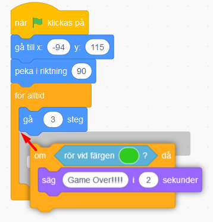

# Bug Race - Intro (English)
In the game Bug Race, the goal is to get a beetle to stay on a track until it crosses the finishing line. To steer you use the left and right arrows on the computer keyboard. If the character leaves the track, it will be Game Over!

Test our version of Bug Race below. 

> **HOW DO YOU CODE THE GAME?** 
 
Follow the step-by-step instructions to code your project in Scratch. <a href="https://scratch.mit.edu" target="_blank"> Click here to open Scratch in a new tab.</a> When you’ve opened Scratch, click Create to get started. If you have a scratch account, log in so that you can save and share your project. If you don’t have an account yet, it is free. 
 

Time to start coding! 

Click on step 1 below to get started.

## 1: Choose a new "sprite" character

Replace the cat sprite with a new sprite, we’ve used a beetle! 
<video src="./BugRacedel1_nytt.mp4" controls muted height=480 width=640 />

>**TIME FOR YOU TO:**

Watch the video to see how to: 

- Remove the cat  
- Choose a new sprite 
- Reduce the size of the sprite

 
>**STEP-BY-STEP INSTRUCTIONS:**

In Scratch, you create projects using **sprites**. A sprite is a character you choose to add to your project. All sprites can be controlled with **code**. The code in Scratch looks like small pieces of a puzzle. When you put the pieces together, you build a **script**. The script is your code that controls your project and all your sprites. 

Time to replace the cat with a beetle, or any other sprite you want to have race around the track. This is how: 

1. Click on the **trash can on the small box with the cat** and the sprite will disappear. 

     

2. To add a new sprite, click on the **Choose a sprite** button located under the **stage** with the white background: 

    

There are a lot of sprites to choose from. You can use the menu for different categories. If you want to use the beetle, go to "Animals.” Click on the beetle and it will be added to your project. 

3. The beetle is quite large and it will be hard for it to fit on a track. To make it smaller you go to where it says **Size** with 100 next to it. This means that the sprite is in full size, i.e 100%. You change the size by entering a lower number, for example 30%. Find a size that you want by testing different numbers. You can always change it again later when you have your track. 

    

The beetle is ready so it's time to draw the track! 

Click on chapter 2.

## 2: Color the backdrop and draw a track
We are now going to color the backdrop of the game and draw a track for the beetle to run on.
<video src="./BugRacedel2_nytt.mp4" controls muted height=480 width=640 />

>**TIME FOR YOU TO:**

Watch the video to see how to:
- Work on backdrop 
- Activate Bitmap mode 
- Select color and tools to fill backdrop 
- Choose a new color and tool to draw the track 

 
>**STEP-BY-STEP INSTRUCTIONS**

1. To change the backdrop, we first need to click on the white small box at the bottom right where it says **STAGE**. It will be marked with blue. 

    

Now click on the **BACKDROPS** tab at the top left.

   

2. Click on the blue button **"Convert to bitmap.”**. It is found at the bottom under the drawing surface.

    

3. Now we will paint the backdrop. To choose **a color** click on the colored box that says **Fill**. A color picker will appear. Move the white circles to the color you want. When you are happy with your color, close the color picker by clicking next to it. 

   
    
4. Now select a tool to fill your backdrop with the color. Click on the icon that looks like a small bucket, and click on the white checkered area to the right. You should now have a different colored backdrop. 

  
  
>**Note:** Don’t pick the same color for your backdrop or track as your sprite, since that will make it tricky later on.  

5. Now click on the **BRUSH** tool and select a new color for your track. You adjust the size of the brush stroke by clicking on the arrows next to it, or by changing the number in the box. You need the track to be rather thick. 

 
 
Draw a track like an oval or circle – make it as big as you can but keep it inside the box! 

This is roughly what the game's course may now look like. If the course is very narrow, the game will be very difficult, the beetle will easily end up off the course - and you will be Game Over. If the course is wide, the game will be a little easier as you have more space to steer around without going out! 

  

## 3: Making the sprite move
Now that the backdrop is done, you can put code together to create your first script and get your sprite to move. 
<video src="./BugRacedel3_nytt.mp4" controls muted height=480 width=640 />

>**TIME FOR YOU TO:**
Watch the video to see how to: 
- Return to CODE and your sprite to start coding 
- Add code for hat block: When GREEN FLAG clicked 
- Add MOTION code: move 10 steps 
- Add code for CONTROL: Forever (a loop) 

 
>**STEP-BY-STEP INSTRUCTIONS**

With your colorful backdrop and a track, it is time for you to create your first script. Remember to **save** your game often! You must be logged in to be able to save. 

Click on the CODE tab at the top left to return to the white surface where you can build your code for the game. Now click on the box with the small sprite below the stage so that it gets a blue frame. You are now ready to add code to your beetle. 

Place the mouse pointer on the beetle and hold down the mouse button (or hold it with your finger if you are using a tablet) to drag the sprite onto the painted track, dropping it where you want the beetle to be when you start your game. 

Have you found the START and STOP buttons yet? **The green flag** is the start button and the **red button** is the stop button. 

  

You need to add code so that the beetle starts moving when you click on the START button – which is **the green flag**. To do this, you must tell the beetle what to do. The beetle can’t think for itself. It is waiting for your instructions in code that should say: 

"When I click on the START flag, the beetle should move." Code that initiates something is called INIT script.

This is how:

1. On the left-hand side you see colorful dots with headings and next to that code in the shape of puzzle pieces. Click on the yellow dot **EVENTS** and select the puzzle piece with a green flag on: **"when Green flag clicked"**. Drag this block to the script surface (the large empty, white area in the middle) and drop it there. 

  

2. Then select the blue heading **MOTION** at the top and the block **"move 10 steps"**. Place this block directly below the first block with the green flag on the script surface. They will connect like puzzle pieces. 

  

>**Note:** if you move two blocks close to each other on the script surface, a gray shadow will appear and you can just release and the blocks will automatically connect as puzzle pieces. 

  

>**Test your code!** Test what happens when you click on the green flag **START** above the stage. Does your beetle move to the right? If it doesn’t, don’t worry, just check your code. If it does, great, but you want the beetle to keep moving forward without you having to press start over and over again. Let’s add some more code. 

3. Under the orange heading **CONTROL** find the block **“forever”**. This block is a **loop**, i.e. a **repetition** of something so that it happens over and over again. With this block, the beetle will continue to move forward for as long as the game is running. 
Drag the "forever" block to the script surface and place it under "when green flag clicked" so that "move 10 steps" is placed inside the loop. Look at the picture below to see what it should look like.

  

>**Test your code!** Time to check you code by clicking on **START** – the green flag. Does your beetle run fast? See what happens if you change the number of steps to a lower number. Click on the number 10 in the block **"move 10 steps"** and enter another number. Test until you find the speed you want. 

  

## 4: Set a Starting position
To avoid having to drag the beetle back to the starting point each time you start the game, you can use code to place it at its starting position every time you click the green flag.  
<video src="./BugRacedel4_nytt.mp4" controls muted height=480 width=640 />

>**TIME FOR YOU TO:**

Watch the video to see how to: 
- Drag the sprite to where you want it to start on the track 
- Enter code from MOTION theme: go to x: __ y: __ 

 
>**STEP-BY-STEP INSTRUCTIONS**

1. Drag the sprite to the position on the track where you want it to be when you start the game. Place the sprite in the middle of the track and preferably not in a curve.

2. Under **MOTION**, select the block **"go to x: __ y: __"** and place it directly below  **"when green flag clicked"** and above the **"forever"** loop. The numbers (values) for X and Y are the COORDINATES of the starting position where you have placed the beetle – a specific place on your track. 

  

The beetle will now automatically move to the same starting position each time you click on the green START flag. 

## 5: Control the beetle

The next step is to make it possible to control the beetle, so that it doesn’t run straight off the track! For that you need two short scripts. One that tells the beetle to turn to the right when you click on the right arrow key on the computer keyboard, and another that tells it to turn left when you click on the left arrow key. (If you use a tablet with a touch screen, there are Notes further down for how you can code the sprite to follow your finger.) 
<video src="./BugRacedel5_nytt.mp4" controls muted height=480 width=640 />

>**TIME FOR YOU TO:**
Watch the video to see how to: 
- Enter code for EVENTS: “when space key pressed” Drag in two of those blocks 
- Change where it says *“space”* in the blocks to say *"left arrow"* and *"right arrow"* 
- Enter code for MOTION: turn ‘left’ 15 degrees and a turn ‘right’ 15 degrees 

 
>**STEP-BY-STEP INSTRUCTIONS**

1. Under the heading **EVENTS** there is a block that says **"when space key pressed"**. Drag in **two of those blocks** and place them next to each other anywhere on the script surface. 

  

Next to the word *"space"* in these two blocks is a small white triangle. Click on the triangle in each block and select from the drop-down list that appears – **left arrow** in one block and **right arrow** in the other. 

  

2. Now you will be able to turn the sprite. Under **MOTION** you find a block that says **"turn (arrow left) 15 degrees"** and one that says **"turn (arrow right) 15 degrees"**. Connect these two blocks under the blocks **"when left arrow key pressed"** and **"when right arrow key pressed"**.

  

>**Test your code!** Click on the green START flag and see if you can control the beetle in both directions with the arrow keys on the keyboard? Is it going too fast? Too slow? Adjust the speed of the beetle by changing the variable number in the motion block! 

>**Note! Are you using a tablet with a touch screen?** Then use the code below instead and the sprite will follow your finger on the screen around the track. 
  

## 6: Change starting direction

 When you click on START, you will notice that the beetle moves in the direction it had when you last finished the game. This can make it tricky, so let’s add another init script that tells the beetle that it should always be facing to the right when the game is started. 
<video src="./BugRacedel6_nytt.mp4" controls muted height=480 width=640 />

>**TIME FOR YOU TO:**

Watch the video to see how to: 
- Enter code for MOTION: point in 90 degrees 

 
>**STEP-BY-STEP INSTRUCTIONS:**       

1. Under **MOTION**, select the block that says **"point in 90 direction”**. 

  

>**Test your code!** Test what happens if you change the value from 90 degrees to something else. Just click on the number 90 in the block, and a clock-like image will appear. Move the mouse pointer to another angle and click outside the image to select another angle.
  
  

## 7: Känna av när skalbaggen åker av banan

Skalbaggen måste känna av när den hamnar utanför banan och bli Game Over! Det löser vi genom att skalbaggen känner av vilken färg den åker på. Vi kodar ett VILLKOR för skalbaggen, som säger att: "**OM** skalbaggen rör vid färgen utanför banan - **DÅ** ska spelet ta slut".
<video src="./BugRacedel7_nytt.mp4" controls muted height=480 width=640 />

>**VAD SKA JAG GÖRA?**

Se i videon ovan hur du ska:
- Lägg in kod för KONTROLL: om...då
- Lägg in kod för KÄNNA AV: rör färgen_. Lägg blocket i det kantiga hålet mellan om...då.
- Lägg in kod för UTSEENDE: säg Hej! i 2 sekunder. Ändra texten till Game Over!

 
>**INSTRUKTION HUR JAG GÖR STEG-FÖR-STEG:**

1. Under **KONTROLL** finns blocket "**om <> då**", dra in det till scriptytan, lägg det fritt någonstans bredvid de övriga scripten. Det här blocket säger att **OM** det som står inom **<>** händer, **DÅ** ska något annat direkt hända. Till exempel: Om skalbaggen <rör färgen grön>, säg Game Over i 2 sekunder.

  
  
2. Under **KÄNNA AV** finns blocket "**Rör färgen <> ?"**. 
Dra in detta block till hålet **<>** inom blocket "**om <> då**" som du lagt på skriptytan. 

  

Kolla att lilla ovala cirkeln med färg till höger om texten **"rör färgen"** i ditt script är exakt samma färg som spelets bakgrundsfärg. Byt annars genom att klicka med muspekaren på den lilla färgcirkeln och välj den lilla symbolen med en pimpett längst ned. Klicka sedan med den på spelets bakgrundsfärg, så blir det rätt färg i kodblockets cirkel. Nu har du talat om för datorn att något ska hända när skalbaggen rör vid denna färg.

  

3. Till sist skapar du ett skript för att spelet ska säga att det är Game Over om skalbaggen nuddar färgen utanför banan. Under tema   **UTSEENDE** väljer du blocket **"säg Hej! i 2 sekunder"** och drar in detta block innanför **"om <**"**Rör färgen grön?> då"**". Klicka sedan på ordet "Hej!" och ändra texten till det du vill skalbaggen ska säga - till exempel Game Over.

  

> Testa ditt spel! Händer det något när skalbaggen nuddar färgen utanför banan? Om inte, vad tror du att det kan bero på? 

## 8: Gör klart skriptet

Något saknas för att koden ska fungera! Tänk efter: **När** vill du att datorn ska känna av om skalbaggen rör färgen utanför banan? Det behöver ju göras **efter varje steg** skalbaggen tar, för att inte missa om den springer av banan. Datorn måste kolla **exakt vart skalbaggen befinner sig** "om och om igen", hela tiden. Därför måste du koppla ihop skriptet som känner av färgen utanför banan med det som får skalbaggen att röra sig. 
<video src="./BugRacedel8_nytt.mp4" controls muted height=480 width=640 />

>**VAD SKA JAG GÖRA?**

Se i videon ovan hur du ska:
- Lägg skriptet inuti för alltid-loopen
- Lägg in kod för KONTROLL: stoppa alla. Lägg blocket längst ned inom *om...då*. Ändra till *stoppa detta skript*.

 
>**INSTRUKTION HUR JAG GÖR STEG-FÖR-STEG:**

1. Lägg skriptet som känner av färgen **inuti** din **"för alltid"**-loop. Nu kollar datorn av om skalbaggen ramlat av banan **varje gång** innan den tar nästa steg framåt igen. Sen kollar den igen - har jag ramlat av banan? Om inte, spring vidare, kolla, spring...

  

2. När spelet blir Game Over ska ju allt ta slut och skalbaggen stoppa helt. Under **KONTROLL** finns blocket **"stoppa alla"**. Dra in detta block till skriptfältet. Klicka på lilla pilen i blocket och byt till **"stoppa detta skript"**.

  

Lägg in detta block längst ned inuti skriptet med **"om <> då"**. På så sätt avslutas spelet och skalbaggen stannar om den hamnar utanför banan och blir Game Over.

>**Testa koden!** Kan du styra skalbaggen runt banan med piltangenterna? Vad händer om sprajten åker utanför banan? 

> Är det svårt att veta hur alla blocken ska läggas in i skriptet? På nästa sida kan du se en bild på hur det färdiga skriptet ska se ut. 

## Färdig!
Grattis, nu har du skapat ditt första spel! Det färdiga skriptet i sin helhet borde se ut ungefär så här - om du följt instruktionerna:

 

**Glöm inte att spara ditt projekt - och att döpa det!** Döp det gärna till uppgiftens namn Bug Race - eller hitta på ett eget namn, så att du enkelt kan hitta det igen. Du skriver in namn på spelet högt upp ovanför projektet, där det nu står "Scratchprojekt". Spara sedan, men du måste vara inloggad för att kunna spara.

> **Testa ditt projekt**  
Visa gärna någon ditt spel och låt dem testa. Om du vill, tryck på knappen DELA som du finner överst så kan andra också hitta spelet på Scratch sajt och testa det.

> **Viktigt om du delar ditt projekt:** Tänk på att delade projekt kan ses, testas och remixas (omskapas) av alla som vill på Scratch sajt. Det är viktigt när du sparar och delar att projektet inte innhåller information, bilder eller ljud du inte vill sprida till andra.

## Utmaning
Saknas något? Hur skulle du vilja utveckla spelet?

Tips på hur du kan bygga vidare på Bug Race hittar du i uppgiften som heter <a href="https://www.kodboken.se/start/skapa-spel/uppgifter-i-scratch/bug-race-tillagg?chpt=0" target="_blank"> Bug Race - Tillägg</a>.
Där kan du bland annat skapa Bug Race för två spelare samtidigt och göra en mjukare styrning av sprajtarna.

## Frågeställningar

* Vad är en sprajt?

* Vad är en loop?

* Varför kan det vara bra att använda en loop?

* Vad är ett INIT-Script eller Start-Script?

* Vad händer i spelet Bug Race om sprajten har samma färg som bakgrunden?
