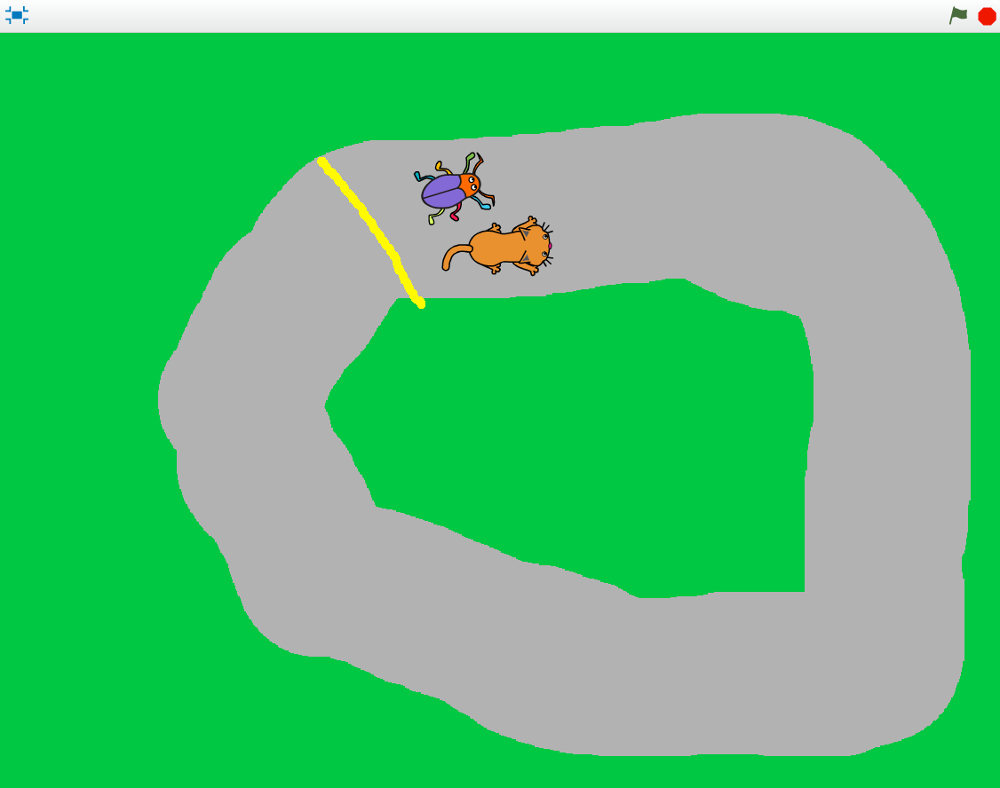

# Bug Race (intro) - för surfplatta med touch screen
Saknar du fysiskt tangentbord? Denna instruktion är framtagen för att programmera spelet Bug Race på en surfplatta med touch screen. 

I spelet Bug Race är målet att få en skalbagge att springa runt en bana och försöka undvika att hamna utanför banan. Åker figuren utanför banan blir du Game Over! Du styr genom att låta skalbaggen följa ditt finger på surfplattans skärm (eller muspekaren om du vill visa testa projektet på en dator).

Testa ett exempelspel av Bug Race nedan. 

> **HUR KODAR JAG?** 
 
Följ denna instruktion steg för steg och koda ditt projekt i verktyget Scratch. <a href="https://scratch.mit.edu" target="_blank"> Klicka här för att öppna Scratch i en ny flik.</a> I Scratch klickar du på Skapa för att börja. Logga gärna in på Scratch så kan du även spara och dela ditt projekt. Det är gratis att skaffa ett konto.
 

Dax att börja koda! Klicka på steg 1 nedan för att gå vidare i instruktionen.

## 1: Välj ny sprajtfigur

Byt ut katt-sprajten till ny sprajt - en skalbagge!
<video src="./BugRacedel1_nytt.mp4" controls muted height=480 width=640 />

>**VAD SKA JAG GÖRA?**

Se i videon ovan hur du ska:
- Ta bort kattfiguren
- Välj ny sprajt
- Minska sprajtens storlek

 
>**INSTRUKTION HUR JAG GÖR STEG-FÖR-STEG:**

I Scratch skapar du projekt med så kallade sprajtar. En **sprajt** är en figur eller andra saker du väljer att lägga in i ditt projekt. Alla sprajtar kan påverkas och styras med den kod du lägger till. Koden i Scratch ser ut som små pusselbitar. När du byggt ihop olika kod-pusselbitar kallas det för att du byggt ett **skript** - det är ditt kodade program som styr ditt projekt och alla dina sprajtar, så allt får liv och rörelse.

Nu ska vi byta ut katten mot en skalbagge. Gör såhär:

1. Tryck på **krysset på lilla rutan med kattfiguren** så försvinner den.

     

2. Nu vill du lägga till en ny sprajt - en skalbagge. Tryck på knappen för **NY SPRAJT** som finns under den **scenen** med den vita bakgrunden:

    

En massa sprajt-figurer finns här. I menyn överst finns en kategori som heter **"Djur"**, tryck på den. Bland alla djurbilder hittar du skalbaggen som heter **Beetle**. Klicka på den så läggs den till i ditt projekt.

3. Skalbaggen är ganska stor, så vi minskar storleken på sprajten. Under scenen med sprajten finns texten **Storlek** och bredvid står det 100. Det betyder att sprajten är i full storlek, alltså 100%. Ändra siffran till en lägre procent, exempelvis 30%. Testa dig fram tills den blir lagom stor (som din tummnagel ungefär). Du kan alltid ändra det senare om det blev för stort eller litet.

    

Nu är skalbaggen klar och det är dags att rita banan som den ska springa runt på!
Klicka dig vidare till kapitel 2.

## 2: Färglägg bakgrunden och rita en bana
Du ska nu färglägga spelets bakgrund och rita en bana som skalbaggen kan springa på.
<video src="./BugRacedel2_nytt.mp4" controls muted height=480 width=640 />

>**VAD SKA JAG GÖRA?**

Se i videon ovan hur du ska:
- Aktivera bakgrunder
- Aktivera Bitmapp-läge
- Välj färg och verktyg för att fylla bakgrund
- Välj ny färg och verktyg för att måla en bana

 
>**INSTRUKTION HUR JAG GÖR STEG-FÖR-STEG:**

1. För att ändra på bakgrunden trycker du först på den vita lilla rutan längst ner till höger där det står **SCEN**, så den blir markerad. Tryck sedan på fliken **BAKGRUNDER** som finns högst upp till vänster.

    	    

2. Tryck på den blå knappen som det står **"Gör till bitmapp** på. Den finns under själva ritytan.

    

Välj sen **en färg** du gillar genom att klicka på den lilla färgade rutan ovanför verktygen och ställ in den färg du vill ha genom att dra i de olika reglagen tills du är nöjd.

   
    
Fyll sen bakgrunden med färgen du valt. Det gör du genom att trycka på verktyget **Fyll** som ser ut som en liten hink och sen trycker du på den stora vita ritytan bredvid. Då fylls bakgrunden med den färg du valt. Du ser nu samma färg även på senen med din skalbagge-sprajt.

  
  
> Tips: Viktigt att bakgrundsfärgen du väljer inte är samma färg som din sprajt har på sig. Annars kan det bli problem i ditt projekt längre fram i skapandet.

3. Dax att rita en bana - så vi väljer penselverktyg och ny färg. Tryck först på verktyget **PENSEL** och välj sen en ny färg till banan i ditt spel. Viktigt att färgen inte är samma som skalbagge-sprajtens färger. Gör även penseln ordentligt bred genom att ändra penselns storlek med uppåt-pilen som finns snett ovanför ritytan, eller bara skriva 100 direkt i rutan bredvid pilarna (se bilden nedan). Penselstrecket ska bli ordentligt tjockt. 

 
 
Dra ditt finger på ritytan och rita en bana som en oval eller en cirkel - gör banan så stor du kan, utan att den hamnar utanför spelets rityta med bakgrundsfärgen. Lämna lite bakgrundsfärg längs med kanterna som en ram.

Ungefär så här kan nu spelets bana se ut - beroende på hur du valt att rita din bana och färgval. Om banan är smal kommer spelet bli väldigt svårt, skalbaggen hamnar då lätt utanför banan med en del av sin "kropp" - och blir Game Over. Är banan bredare blir spelet lite lättare då du har mer plats att styra runt på utan att åka utanför! 

  

## 3: Sprajten rör på sig
Dax att programmera röresler! Nu när bakgrunden är färdig kan du börja skapa ditt första skript med kod för att få din sprajt att börja röra sig.
<video src="./BugRaceIntroDel3_enkel.mp4" controls muted height=480 width=640 />

>**VAD SKA JAG GÖRA?**

Se i videon ovan hur du ska:
- Välj KOD och din sprajt för att kunna börja koda
- Lägg in kod för start-block: När GRÖN FLAGGA klickas på
- Lägg in kod för RÖRELSE: Gå 10 steg
- Lägg in kod för KONTROLL: För alltid (en loop)

 
>**INSTRUKTION HUR JAG GÖR STEG-FÖR-STEG:**

Nu när bakgrunden är färdig kan du börja skapa ditt första skript. Glöm inte att **spara** ofta! Du måste vara inloggad för att kunna spara.

Sätt fingret på skalbaggen för att ta tag i den och dra sprajten så den står på banan. Ställ sprajten där du tycker den ska starta i spelet.

Tryck på KOD-fliken högst upp till vänster. Nu kommer du bort från målarverktyget och tillbaka till vita ytan där du kan bygga din kod för spelet.

Har du lagt märke till START- och STOPP-knappen än? **Den gröna flaggan** betyder är en start-knapp och **den röda knappen** är en stopp-knapp.

  

Nu ska du koda så att skalbaggen börjar röra sig när du sen trycker på START-knappen - alltså **den gröna flaggan** ovanför ditt projekt. För att skalbaggen ska veta när den ska börja röra sig måste på något sätt tala om det för skalbaggen, annars vet den inte vad den ska göra och inget händer. Skalbaggen kan inte tänka av sig självt, den väntar på dina instruktioner. Instruktionerna skapar du med hjälp av de kodade pusselbitarna till vänster i Scratch. Du ska bygga ihop pusselbitarna till ett skript som ska ge skalbaggen instruktionen:

"När jag trycker på gröna START-flaggan, så ska skalbaggen röra sig."

Gör såhär:

1. Överst till vänster hittar du flera färgglada rubriker med en massa kod-pusselbitar bredvid. Klicka på den gula rubriken som heter **HÄNDELSER** och välj den översta gula pusselbiten med en grön flagga på, som heter: **"när gröna flaggan (START) klickas på"**. Ta tag i och dra detta block till skriptytan (den stora tomma, vita ytan i mitten) och lägg den där. 

  

Välj sedan den blå rubriken som heter **RÖRELSE** och välj blocket **"gå 10 steg"**. Dra in detta block på skritpytan och lägg det direkt under blocket med den gröna flaggan. Sätt ihop dem som pusselbitar så att de sitter ihop. (Se bild nedanför.)

  

> Tips: om man för två block nära varandra på skriptytan så syns en grå skugga. Då kan man släppa så kopplar blocken automatiskt ihop sig som två passande pusselbitar.

  

> Testa nu vad som händer när du trycker på START. Flyttar sig skalbaggen lite åt höger! Det är bra, men du vill ju att skalbaggen skall röra sig framåt hela tiden när spelet startats, inte bara flytta sig lite en enda gång. Hur gör du det? Jo, såhär:

2. Under orangea rubriken som heter **KONTROLL** finns kodblocket som heter **"för alltid"**. Detta kodblock är en LOOP, alltså en **repetition** av något som sker, om och om igen. Med detta block kan du göra så att skalbaggen får instruktionen att röra sig framåt för alltod, så länge spelet är igång. 

Dra in **"för alltid"**-blocket till skriotytan och lägg in det direkt under kodblocket som heter **"när START klickas på"**. Då hamnar det blå blocket **"gå 10 steg"** inuti **för alltid**-loopen. Kolla på bilden nedan så ser du hur du ska göra.

  

  _För att skalbaggen ska fortsätta att gå måste du lägga "gå 10 steg" i mitten av "för alltid"-loopen. "Gå 10 steg" kommer då att upprepas för alltid - om och om igen, så skalbaggen går och går och går._

> Testa att trycka på START - alltså den gröna flaggan ovanför spelet. Nu blir det fart på skalbaggen! Prova vad som händer om du ändrar antalet steg till en lägre siffra. Tryck på siffran 10 i blocket **gå 10 steg** och skriv in en annan siffra för en hastighet som du tror är lagom för att kunna styra skalbaggen - kanske siffran 3?. Testa dig fram tills det känns lagom snabbt.

  

## 4: Sätt en Startposition
För att slippa dra tillbaka skalbaggen till startplatsen varje gång du vill starta spelet, kan du säga åt skalbaggen att den ska ställa sig på en bestämd plats varje gång du startar spelet. Vi kodar in en startposition i skriptet.
<video src="./BugRacedel4_nytt.mp4" controls muted height=480 width=640 />

>**VAD SKA JAG GÖRA?**

Se i videon ovan hur du ska:
- Dra sprajten till där du vill den ska starta på banan
- Lägg in kod för RÖRELSE: gå till x:__ y:__

 
>**INSTRUKTION HUR JAG GÖR STEG-FÖR-STEG:**

1. Dra sprajten till den position där du vill att den ska starta på banan när spelet börjar. Se till att sprajten står på mitten av banan och helst på en raksträcka, inte en kurva. 

2. Under tema **RÖRELSE** väljer du blocket **"gå till x:__ y:__"** och koppla fast blocket direkt inunder det översta blocket i skriptet som heter **"när START klickas på"**. Alltså ovanför **"för alltid"**-loopen. De siffror (värden) som står vid X och Y är KOORDINATERNA för den position som du har ställt skalbaggen på - alltså en bestämd plats i ditt spel. 

  

Nu kommer skalbaggen automatiskt att förflyttas till samma startposition varje gång du trycker på gröna START-flaggan.

>Tips: Du kan alltid ändra koordinaterna i blocket om det inte blev rätt plats direkt. Dra skalbaggen dit du vill att den ska starta på banan, kolla sedan vilka nya koordinater för x och y som den nu har fått - du kan hitta dem direkt under scenen med ditt projekt med skalbaggen. Skriv nu in dessa nya siffror i blocket med **"gå till x:__ y:__"** på skriptytan. 

## 5: Styra skalbaggen

Nästa steg blir att koda styrning av skalbaggen, så den inte springer av banan och blir Game Over! Du behöver koda in instruktionen för skalbaggen att den ska följa ditt finger när du drar fingret längs med banan.
<video src="./BugRaceIntroDel5_enkel.mp4" controls muted height=480 width=640 />

>**VAD SKA JAG GÖRA?**

Se i videon ovan hur du ska:
- Lägga in kod för RÖRELSE: följ muspekare

 
>**INSTRUKTION HUR JAG GÖR STEG-FÖR-STEG:**

1. Under tema RÖRELSE finns kodblocket som heter **"följ muspekare"**. Den gför så att sprajten följer antingen en muspekare som dras över skärmen på en dator, eller ditt finger som du drar över skärmen på en surfplatta med touch screen. Dra in kodblocket till skriptytan och lägg in det inuti din **"för alltid"**-loop. Då ser det ut som i bilden nedanför. Testa sedan att starta projektet och låt skalbaggen följa ditt finger över banan.  
  

> Testa vad som händer nu när du trycker på gröna START-flaggan. Kan du styra skalbaggen genom att dra fingret över skärmen? Går sprajten för fort? Sänk då hastigheten på skalbaggens rörelse genom att minska siffran i det blå rörelse-blocket i ditt skript!

## 6: Ändra startriktning

Om du trycker på START-flaggan igen märker du att skalbaggen behåller den riktning som den hade när du avslutade spelet sist. Kan lätt bli fel håll och detta kan du lösa genom att lägga in ett till skript som ger instruktionen att skalbaggen alltid ska vara vänd åt höger när du startar spelet.
<video src="./BugRacedel6_nytt.mp4" controls muted height=480 width=640 />

>**VAD SKA JAG GÖRA?**

Se i videon ovan hur du ska:
- Lägga in kod för RÖRELSE: peka i 90 graders riktning

 
>**INSTRUKTION HUR JAG GÖR STEG-FÖR-STEG:**                                                                                                                                                                                                                                                                                                                                                                                                                                                                                                                                                                                                                                                                                                                                                                                                                                                                                                                                                                                                                                                                                                                                                                                                                                                                                                                                                                                                                                                                                                                                                                                                                                                                                                                                                                                                                                                                                                                                                                                                                                                                                                                                                                                                                                                                                                                                                                                                                                                                                                                                                                                                                                                                                                                                                                                                                                                                                                                                                                                                                                                                                                                                                                                                                                                                                                                                                                                                                                                                                                                                                                                                                                                                                                                                                                                                                                                                                                                                                                                                                                                                                                                                                                                                                                                                                                                                                                                                                                                                                                                                                                                                                                                                                                                                                                                                                                                                                                                                                                                                                                                                                                                                                                                                                                                                                                                                                                                                                                                                                                                                                                                                                                                                                                                                                                                                                                                                                                                                                                                                                                                                                                                                                                                                                                                                                                                                                                                                                                                                                                                                                                                                                                                                                                                                                                                                                                                                                                                                                                                                                                                                                                                                                                                                                                                                                                                                                                                                                                                                                                                       

1. Under **RÖRELSE** väljer du blocket som säger **"peka i 90 riktning"**. 

  

> Testa vad som händer om du ändrar på värdet från 90 grader till något annat (tryck på siffran 90 i blocket, dra runt pilen till en annan vinkel och tryck sen någonstans utanför bilden för att avsluta).
  
  

## 7: Känna av när skalbaggen åker av banan

Skalbaggen måste känna av om den åker utanför banan och då bli Game Over! Det löser vi genom att skalbaggen känner av vilken färg den rör vid - banans färg eller bakgrundens färg. Vi kodar ett VILLKOR för skalbaggen, som säger att: "**OM** skalbaggen rör vid färgen utanför banan - **DÅ** ska spelet ta slut".
<video src="./BugRaceIntroDel7_enkel.mp4" controls muted height=480 width=640 />

>**VAD SKA JAG GÖRA?**

Se i videon ovan hur du ska:
- Lägg in kod för KONTROLL: om...då
- Lägg in kod för KÄNNA AV: rör färgen_. Lägg blocket i det kantiga hålet mellan om...då.
- Lägg in kod för UTSEENDE: säg Hej! i 2 sekunder. Ändra texten till Game Over!

 
>**INSTRUKTION HUR JAG GÖR STEG-FÖR-STEG:**

1. Under det orangea temat **KONTROLL** finns blocket som heter "**om <> då**" (det som har ett kantigt hål mellan orden" om" och "då"). Dra in detta block till skriptytan och lägg det bredvid de andra blocken där. Det här blocket säger att **OM** det som står inom **<>** händer, **DÅ** ska något annat direkt hända. Till exempel: OM <rör färgen grön>, DÅ "säg Game Over i 2 sekunder".

  
  
2. Under **KÄNNA AV** finns blocket "**Rör färgen <> ?"**. (det finns en slumpmässigt vald färg i blocket. Du ändrar senare till ditt projekts bakgrundsfärg.)
Dra in detta block till hålet **<>** inom blocket "**om <> då**" som du nyss lade på skriptytan. (se nedan bild)

  

3. För att din skalbagge ska kunna känna av spelets bakgrundsfärg (om den åker av banan), så måste vi lägga till exakt samma färg i kodblocket du just lade in i skriptet. Gör såhär:  
Tryck på den lilla cirkeln med färg i blovket **"rör färgen <>?"** så kommer en färgväljar-meny fram. Tryck på den lilla bilden med en färgväljare längst ned i menyn, och tryck sen på din bakgrundsfärg på scenen med spelet. Då ändras färgen i kodblocket till exakt samma färg som spelets bakgrundsfärg. Nu har du lagt in kod som säger  att något ska hända när skalbaggen rör vid spelets bakgrundsfärg.

  

4. Till sist skapar du kod för att spelet ska kunna säga att det är Game Over om skalbaggen nuddar färgen utanför banan. Under temat **UTSEENDE** väljer du blocket som heter **"säg Hej! i 2 sekunder"**. Dra in detta block och lägg det inuti blocket som heter **"om <**"**Rör färgen grön?> då"**". (se bilden nedanför) Tryck sedan på ordet "Hej!" i blocket och ändra texten till det du vill skalbaggen ska säga om den åker av banan - till exempel "Game Over!".

  

Nu har vi kodat ett skript som känner av bakgrundens färg. Men det är inte riktigt färdigt än. Om du trycker på start nu, så kommer inte skalbaggen att reagera när den åker av banan. Vi måste koda lite till för att det ska fungera. Vi går vidare!

## 8: Gör klart skriptet

Något saknas för att koden ska fungera! Tänk efter: **När** vill du att datorn ska känna av om skalbaggen rör färgen utanför banan? Det behöver ju göras **efter varje steg** skalbaggen tar, för att inte missa om den springer av banan. Datorn måste kolla **exakt vart skalbaggen befinner sig** "om och om igen", hela tiden. Inte bara en gång direkt efter vi startat spelet, som det nu står i koden. Därför måste du koppla ihop skriptet som känner av färgen utanför banan med det andra skriptet som får skalbaggen att röra på sig. Vi ska sätta samman skripten till ETT skript.
<video src="./BugRaceIntroDel8_enkel.mp4" controls muted height=480 width=640 />

>**VAD SKA JAG GÖRA?**

Se i videon ovan hur du ska:
- Lägg skriptet med villkoret inuti för alltid-loopen
- Lägg in kod för KONTROLL: stoppa alla. Lägg blocket längst ned inom *om...då*. Ändra till *stoppa detta skript*.

 
>**INSTRUKTION HUR JAG GÖR STEG-FÖR-STEG:**

1. Lägg skriptet med vilkoret **"om <> då"** som känner av färgen **inuti** din **"för alltid"**-loop. Nu kollar datorn hela tiden om skalbaggen ramlat av banan, alltså den kollar detta **varje gång** innan den tar nästa steg framåt igen. Sen kollar den igen om den ramlat av banan. Om inte, då springer den lite till, kolla, spring, kolla spring... (se bilden nedan)

  
  
  > Testa projektet! Starta spelet och styr utanför banan. Vad händer? Känner skalbaggen av bakgrundsfärgen?

2. När spelet blir Game Over ska ju allt ta slut och skalbaggen ska stoppa helt. Under **KONTROLL** finns blocket som heter **"stoppa alla"**. Dra in detta block till skriptytan. Tryck sen på den lilla pilen i blocket och byt till **"stoppa detta skript"**.

  

Lägg in detta block längst ned inuti skriptet med **"om <> då"**. På så sätt avslutas spelet och skalbaggen stannar om den åker utanför banan och blir Game Over.

>**Testa koden!** Kan du styra skalbaggen runt banan med piltangenterna? Vad händer om sprajten åker utanför banan? 

> Är det svårt att veta hur alla blocken ska läggas in i skriptet? På nästa sida kan du se en bild på hur det färdiga skriptet ska se ut. 

## Färdig!
Grattis, nu har du skapat ditt första spel! Det färdiga skriptet i sin helhet borde se ut ungefär så här - om du följt instruktionerna:

 

**Glöm inte att spara ditt projekt - och att döpa det!** Döp det gärna till uppgiftens namn Bug Race - eller hitta på ett eget namn, så att du enkelt kan hitta det igen. Du skriver in namnet på spelet högt upp ovanför projektet, där det nu står "Scratchprojekt". Spara sedan, men du måste vara inloggad för att kunna spara.

> **Testa ditt projekt - och dela det med andra!**  
Visa gärna någon ditt spel och låt dem testa. Om du vill, tryck på knappen DELA som du finner överst så kan andra också hitta spelet på Scratch sajt och testa det. (knappen DELA finns bara om du är inloggad samt att ditt användarkonto bekräftats via den mejl som ditt konto är kopplat till. Mejlet skickades ut av Scratch när kontot skapades.)

> **Viktigt om du delar ditt projekt:** Tänk på att delade projekt kan ses, testas och remixas (omskapas) av alla som vill på Scratch sajt. Det är viktigt när du sparar och delar att projektet inte innhåller information, bilder eller ljud du inte vill sprida till andra, till exempel foton och bilder du inte har rättigheter till.

## Utmaning
Saknas något? Hur skulle du vilja utveckla spelet?

Tips på hur du kan bygga vidare på Bug Race hittar du i uppgiften som heter <a href="https://www.kodboken.se/start/skapa-spel/uppgifter-i-scratch/bug-race-tillagg?chpt=0" target="_blank"> Bug Race - Tillägg</a>.
Där kan du bland annat skapa Bug Race för två spelare samtidigt och göra en mjukare styrning av sprajtarna.

## Frågeställningar

* Vad är en sprajt?

* Vad är en loop?

* Varför kan det vara bra att använda en loop?

* Vad är ett INIT-Script eller Start-Script?

* Vad händer i spelet Bug Race om sprajten har samma färg som bakgrunden?
