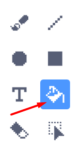

# Börja koda med Scratch - introuppgift
I denna enkla introuppgift får du prova på några första steg av kodning i verktyget Scratch.  

**Ordlista för Scratch**
**SPRAJT:** En sprajt är en figur eller bilder av saker och ting som du väljer att lägga in i ditt Scratchprojekt. Alla sprajtar kan påverkas och styras med kod som du väljer att lägga till. 
**KOD:** Kod är det du använder när du programmerar. Med hjälp av kod kan du ge instruktioner till dina sprajtar och projektet i sin helhet för vad som ska hända i det, exempelvis att en sprajt ska börja röra på sig. Koden i Scratch ser ut som små pusselbitar som kan pusslas ihop. 
**SKRIPT:** När du byggt ihop olika kod-bitar bildar de tillsammans ett skript. Du kan skapa flera olika skript inom projektet, som alla tillsammans styr olika delar inom projektet, exempelvis olika sprajtfigurers rörelser, musik som spelas och bakgrundsbilder som ändras. 
**PROGRAM:** All kod och skript som finns i projektet ingår i projektets program - alltså det som styr hur hela projektet ska fungera i sin helhet.
**ANIMATION & KLÄDSLAR:** I Scratch kan man skapa **animation**, alltså att figurer och bilder ser ut att röra på sig eller ändra utseende när projektet startats. Detta görs genom att olika bilder av sprajten (så kallade **klädslar**) kodas till att snabbt växlas mellan och därmed ser sprajtarna ut att kunna röra på sig mellan olika positioner eller utseenden, exempelvis att ett öga ser ut att blinka om du växlar flera gånger mellan en bild med ett öppet öga och en bild med ett stängt öga, och tillbaka igen. 

Testa ett exempelprojekt nedan: 

> **HUR KODAR JAG?** 
 
Följ denna instruktion steg för steg och koda ditt projekt i verktyget Scratch. <a href="https://scratch.mit.edu" target="_blank"> Klicka här för att öppna Scratch i en ny flik.</a> I Scratch klickar du på **Skapa** för att börja. Logga gärna in på Scratch så kan du även spara och dela ditt projekt efteråt. Saknar du konto på Scratch? Klicka på **Gå med Scratch** och skaffa enkelt och gratis ett konto där.
     
 

Dax att börja koda! Klicka på steg 1 nedan för att gå vidare i instruktionen.

## 1: Välj ny sprajtfigur

Byt ut katt-sprajten till ny sprajt-figur - tillexempelvis en skalbagge!
<video src="./BugRacedel1_nytt.mp4" controls muted height=480 width=640 />

>**VAD SKA JAG GÖRA?**

Se i videon ovan hur du ska:
- Ta bort kattfiguren från projektet
- Välja en ny sprajt-figur (exempelvis en skalbagge)
- Minska sprajtens storlek

 
>**INSTRUKTION HUR JAG GÖR STEG-FÖR-STEG:**

Nu ska vi byta ut katten mot en annan sprajt-figur. Gör såhär:

1. Klicka på den lilla **soptunnan på lilla rutan med kattfiguren** så försvinner den ur projektet.

     

2. Nu vill du lägga till en ny sprajt. Tryck på knappen för **Välj en sprajt** som finns under den **scenen** med den vita bakgrunden:

    

3. Nu kommer du in i Scratch sprajtbibliotek. Här finns massor av olika sprajt-figurer att välja mellan. Klicka på den sprajt du vill ha så läggs den till i ditt projekt.

    

>**Tips!** I menyn längst upp finns olika kategorier som du kan välja för att lättare hitta det du vill ha, exempelvis *Djur* och *Mat*. Det finns även en sökfunktion.

4. Sprajten du just lagt till är ganska stor, så om du vill kan du minska storleken på den. Under scenen med sprajten finner du rubriken **Storlek** och bredvid står det 100. Det betyder att sprajten är i full storlek, alltså 100%. Ändra siffran till en lägre procent, exempelvis 70. Du kan alltid ändra det sen igen om det blev för stort eller litet.

    

Nu har du lagt till en sprajt och det är dags att den ska börja röra på sig. Vi behöver ge den kod med instruktioner!

Klicka dig vidare till kapitel 2.

## 2: Sprajten rör på sig
Sprajten kan inte röra på sig, då den inte har några instruktioner om hur den ska göra. Den skapar du med de små pusselbitarna med kod.Dax att koda rörelse.
<video src="./BugRacedel3_nytt.mp4" controls muted height=480 width=640 />

>**VAD SKA JAG GÖRA?**

Se i videon ovan hur du ska:
- Lägga in kod för start-block: *När GRÖN FLAGGA klickas på*
- Lägga in kod för RÖRELSE: *Gå 10 steg*
- Lägga in kod för KONTROLL: *För alltid* (en loop)

 
>**INSTRUKTION HUR JAG GÖR STEG-FÖR-STEG:**

Har du lagt märke till START- och STOPP-knappen för projektet som finns ovanför scenen med dig sprajtfigur? **Den gröna flaggan** är en start-knapp och **den röda knappen** är en stopp-knapp.

  

Nu ska du koda så att din sprajtfigur börjar röra sig när du trycker på START-knappen - som alltså är **den gröna flaggan**. För att göra det måste du tala om för sprajten precis vad den ska göra, annars händer ingenting. Sprajtar kan inte tänka av sig själva, de väntar på dina instruktioner. Du ska alltså koda och lägga till ditt första skript som säger:

"När jag trycker på START-flaggan, ska sprajten röra sig framåt."

Gör såhär:

1. Längst till vänster hittar du olika färgade rubriker. Om man klickar på rubrikerna kommer olka färgade pusselbitar fram bredvid. Klicka på den gula rubriken som heter **HÄNDELSER** och välj pusselbiten som har en grön flagga på sig och som heter **"när START (grön flagga) klickas på"**. Ta tag pusselbiten och dra detta kodblock ut till den stora, tomma skriptytan i mitten av Scratch. Släpp kodblocket där. 

  
  
Nu har du lagt in ett så kallat **start-block** i ditt projekt. Men det behövs mer kod för att prajten ska veta vad den ska göra när den gröna flaggan klickats på. Vi kodar vidare.

2. Välj nu den blå rubriken som heter **RÖRELSE** och välj blocket **"gå 10 steg"**. Dra ut blocket till skriptytan och fäst det  direkt under det första kodblocket som ligger där. Koppla ihop dem som pusselbitar.

  

> Tips: om man för två block nära varandra på skriptytan så dyker en grå skugga upp. Då kan du släppa kodblocket du håller i så kopplar blocken automatiskt ihop sig som pusselbitar.

  

>**Testa koden!** Testa vad som händer när du trycker på START-knappen (den gröna flaggan ovanför scenen). Flyttar sig sprajten lite åt höger nr du klickat på startknappen? Prova fler gånger, vad händer?

2. Nu ska vi koda så att sprajten rör sig framåt hela tiden efter att du tryckt på startknappen. Under den orangea rubriken som heter **KONTROLL** finns kodblocket som heter **"för alltid"**. Detta kodblock är en **loop**, alltså en **repetition** av något som sker om och om igen. Med detta block kommer sprajten fortsätta att röra sig framåt för alltid ända tills du stoppar koden med stoppknappen.
Dra in **"för alltid"**-loopen och lägg den direkt under **"när *GRÖN FLAGGA* klickas på"** så blocket **"gå 10 steg"** hamnar inuti blocket med **för alltid**-loopen. Kolla på bilden nedan så ser du hur du ska göra.

  

  _För att sprajten ska fortsätta att gå måste du lägga "gå 10 steg" i mitten av "för alltid"-loopen. "Gå 10 steg" kommer då att upprepas för alltid - om och om igen, så skalbaggen går och går och går._

>**Testa koden!** Tryck på START-knappen för projektet. Nu blir det fart på sprajten som springer iväg åt höger! 

3. Sprajten stoppar vid kanten. Klicka på den del av sprajten som du kan se vid kanten och dra den tillbaka ut på scenen igen. Fortsätter den att springa? Du mpste trycka på den röda **stopp-knappen** ovanför scenen för att stoppa koden och få sprajten att sluta springa.

3. Går sprajten för fort framåt? Du kan ändra hastigheten genom att skriva en lägre siffra i det blå kodblocket dom heter **gå 10 steg**. . Klicka på siffran 10 och ändra till en lägre siffra, exempelvis 5. Starta projektet igen - går sprajten lagom fort nu? Testa dig fram tills du är nöjd med hastigheten.

  

## 3: Rita en bakgrund
Du ska nu rita en bakgrund som sprajten kan springa på.
<video src="./BugRacedel2_nytt.mp4" controls muted height=480 width=640 />

>**VAD SKA JAG GÖRA?**

Se i videon ovan hur du ska:
- Aktivera bakgrunder
- Aktivera Bitmapp-läge
- Välj färg och verktyg för att fylla bakgrund
- Välj ny färg och verktyg för att måla en bana

 
>**INSTRUKTION HUR JAG GÖR STEG-FÖR-STEG:**

1. För att ändra på bakgrunden trycker du först på den vita lilla rutan längst ner till höger där det står **SCEN**, så den blir markerad. Klicka sedan på fliken **BAKGRUNDER** som du finner högst upp till vänster.

    	    

2. Tryck på blå knappen som det står **"Gör till bitmapp** på. 

    

Välj sen **en färg** du gillar genom att klicka på den lilla färgade rutan ovanför och ställ in färgen du vill ha, genom att dra eller klicka på de olika reglagen tills du är nöjd.

   
    
Fyll sen bakgrunden med färgen du valt genom att klicka på verktyget **Fyll** som ser ut som en liten hink och sen klicka på stora vita rutan så fylls bakgrunden med den färg du valt.

  
  
> Tips: Viktigt att färgen du valt inte är samma som någon färg som din sprajt har på sig. Annars kan det bli problem i ditt projekt längre fram.

3. Tryck sen på verktyget **PENSEL** och välj en ny färg till banan i ditt spel. Viktigt att färgen inte är samma som skalbaggens färger. Gör även penseln mycket bredare genom att klicka länge på uppåtpilen som finns snett ovanför, eller bara skriva 100 i rutan bredvid pilarna. Strecket ska bli tjockt. 

 
 
Rita nu en bana som en oval eller en utdragen cirkel - gör den så stor som du kan, utan att den hamnar utanför spelets ruta!

Ungefär så här kan nu spelets bana se ut. Om banan är väldigt smal kommer spelet bli väldigt svårt, skalbaggen hamnar då lätt utanför banan - och du blir Game Over. Är banan bred blir spelet lite lättare då du har mer plats att styra runt på utan att åka ut! 

  

## 4: Sätt en Startposition
För att slippa dra tillbaka skalbaggen till startplatsen varje gång du vill starta spelet, kan du säga åt datorn att placera den på en bestämd plats vid start.
<video src="./BugRacedel4_nytt.mp4" controls muted height=480 width=640 />

>**VAD SKA JAG GÖRA?**

Se i videon ovan hur du ska:
- Dra sprajten till där du vill den ska starta på banan
- Lägg in kod för RÖRELSE: gå till x:__ y:__

 
>**INSTRUKTION HUR JAG GÖR STEG-FÖR-STEG:**

1. Dra sprajten till den position där du vill att den ska starta på banan när spelet börjar. Se till att sprajten står på mitten av banan och helst på en raksträcka, inte en kurva. 

2. Under **RÖRELSE** väljer du blocket **"gå till x:__ y:__"** och koppla fast blocket direkt under **"när START klickas på"**, ovanför **"för alltid"**-loopen. De siffror (värden) som står vid X och Y är KOORDINATERNA för den startposition som du har ställt skalbaggen på - alltså en bestämd plats i ditt spel. 

  

Nu kommer skalbaggen automatiskt att förflyttas till samma startposition varje gång du trycker på gröna START-flaggan.

## Färdig!
Grattis, nu har du skapat ditt första projekt i Scratch och kodat ditt första program med ett skript som styr en sprajt! 
Nu har du lärt dig lite grunder i Scratch och kan ta dig an lite större projekt!

## Frågeställningar

* Vad är en sprajt?

* Vad är en loop?

* Varför kan det vara bra att använda en loop?
