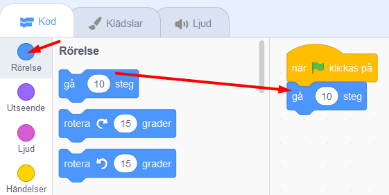

# Börja koda med Scratch - introuppgift
**Vad är detta?** I denna introuppgift får du som är ny till programmering och verktyget Scratch prova på några enkla första steg av kodning.  

**Mål:** Lägga till en ny figur, måla en bakgrund, koda figuren att röra sig.

**Exempelprojekt:** Klicka på bilden för att testa ett färdigt exempelprojekt: 

> **HUR KODAR JAG?** 
 
Följ instruktionen steg-för-steg och koda ditt projekt i verktyget Scratch. <a href="https://scratch.mit.edu" target="_blank"> Klicka här för att öppna Scratch.</a> 
 
Klicka på **Skapa** överst på Scratch webbsida för att öppna kodverktyget. Om du har ett konto på Scratch kan du logga in, och sen även spara projektet.
     
 

Dax att börja koda! Se till att du har Scratch öppnat i en flik i din webbläsare och den här instruktionen i en annan flik. Eller i två fönster bredvid varandra.
 
 
Klicka på kapitel 1 nedan för att gå vidare.

## 1: Välj ny sprajtfigur

I Scratch kallas figurer och gubbar för en **sprajt**. Det finns massor av sprajtar att lägga in i ditt projekt som du sedan kan koda att röra på sig.

Här ser du några exempel på olika **sprajtar**.  
     
 

**Dax att byta ut katt-sprajten:** Vi börjar med att byta ut katt-sprajten till ny sprajt-figur - till exempel en skalbagge! 
 

Här nedan kan du se en video på hur du gör detta. Under videon finns även text som beskriver hur du gör steg-för-steg.
<video src="./BugRacedel1_nytt.mp4" controls muted height=480 width=640 />

>**VAD SKA JAG GÖRA?**

Se i videon ovan hur du ska:
- Ta bort kattfiguren från projektet
- Välja en ny sprajt-figur (exempelvis en skalbagge)
- Minska sprajtens storlek

 
>**INSTRUKTION HUR JAG GÖR STEG-FÖR-STEG:**

Se till att du har klickat **Skapa** i Scratch så att verktyget Scratch har öppnats så du är redo att skapa ditt projekt. 
Först ska vi byta ut katten mot en annan sprajt-figur. Gör såhär:

**Ta bort katten och välj ny sprajt**

1. Det finns två likadana katt-figurer i projektet - en stor och en liten. Den stora står på den vita **Scenen** och den lilla katt-bilden i en ruta under scenen. På den lilla kattfiguren finns **en soptunna**. Klicka på soptunnan så raderas kattsprajten ur projektet. Scenen blir helt tom.

     

2. Nu ska vi lägga till en ny sprajt-figur. Under scenen långt ner till höger finns en blå knapp med ett vitt kattansikte på. Knappen heter **Välj en sprajt**. Tryck på den.

    

3. Nu kommer du in i Scratch stora sprajtbibliotek. Här finns massor av sprajtar att välja mellan. Klicka på den sprajt du vill ha så läggs den till i ditt projekt och hamnar på scenen.

    

>**Tips!** I Sprajtbibliotekets meny längst upp finns olika kategorier som du kan välja mellan för att lättare hitta en sprajt du vill ha, exempelvis kategorin *Djur* eller *Mat*. Det finns även en sökfunktion.

**Minska sprajtens storlek**

4. Sprajten du just lagt till är ganska stor, så du kan minska storleken på den. Under scenen där sprajten finns hittar du rubriken **Storlek - 100**. Det betyder att sprajten är i full storlek, alltså 100%. Ändra siffran till en lägre procent, exempelvis 50. Du kan alltid ändra det igen senare om det blev för stort eller litet.

    

**Nästa steg:**
Nu har du lagt till en ny sprajt och det är dax att koda så den kan röra på sig. För att det ska fungera behöver vi ge sprajten kod med instruktioner hur den ska göra!

Klicka dig vidare till kapitel 2.

## 3: Rita en bakgrund
Nu ska vi rita en bakgrund med en väg som sprajten kan springa på.
<video src="./BugRacedel2_nytt.mp4" controls muted height=480 width=640 />

>**VAD SKA JAG GÖRA?**

Se i videon ovan hur du ska:
- Aktivera bakgrunden
- Aktivera Bitmapp-läge i ritverktyget
- Välj färg och verktyg för att fylla bakgrunden
- Välj ny färg och verktyg för att måla en väg

 
>**INSTRUKTION HUR JAG GÖR STEG-FÖR-STEG:**

Den vita rutan bakom din sprajt kallas för en Scen. Vi kan ändra bakgrund på scenen, antingen genom att lägga till en färdig bild från Scratch bakgrundsbibliotek eller genom att rita en egen bakgrund. Nu ska vi rita en bakgrund med en väg på. Gör såhär:

**Aktivera bakgrunden och ritverktyget**

1. Just nu är sprajten aktiverad, då det är den vi jobbat med. För att jobba med bakgrunden måste vi aktivera bakgrunden. Klicka därför på den lilla vita rutan långt ned till höger nära där det står **SCEN**. Då blir den lilla vita rutan markerad med en blå ram och bakgrunen är aktiverad. 

    

2. För att öppna bakgrundens ritverktyg klickar du på fliken som heter **BAKGRUNDER** som finns högt uppe till vänster i Scratch.

	  

3. Klicka först på den blå knappen längst ned under ritytan som det står **"Gör till bitmapp** på. Detta gör ditt målande mycket lättare.

    
    
**Välj färg och verktyg och fyll bakgrunden**

4. Välj **en ny färg** för bakgrunden genom att klicka på den lilla färgade rutan ovanför verktygen. En färgväljare kommer nu fram och du kan dra i de vita cirklarna i färgväljaren tills du får en färg du vill ha.

   
    
5. Klicka nu på vertyget som ser ut som en **HINK**. Klicka sen på den vita rutan bredvid hinken så fylls hela bakgrunden med din nya färg.

  
  
**Välj nytt verktyg och färg och måla en väg**

6. Nu ska vi måla en väg på bakgrunden som sprajten kan springa på. Klicka på verktyget som ser ut som en **PENSEL**. Klicka sen på **siffran 10** som står ovanför ritytan och ändra penselns storlek till 100 - det blir en lagom bredd för vägen. Välj sen en **ny färg** med färgväljaren. 

 
 
7. Måla nu en rak väg på ritytan med penseln och den nya färgen. Strecket ska bli ganska tjockt så sprajten får plats på vägen.

  

**Nästa steg:**
Nu har vi en sprajt och en bakgrund. Dax att börja koda så att sprajten kan röra på sig!

Klicka på kapitel 3 och gå vidare.

## 3: Sprajten rör på sig
Med kod kan vi styra sprajten och projektet. Sprajtar är egentligen bara en stillastående bild. Sprajten behöver kodas med instruktioner om den ska kunna röra sig över scenen. Koden styr **hur** sprajten ska röra sig och **när** den ska börja röra sig. Koden skapar du med de små pusselbitarna med kod som du ser längst till vänster i Scratch. Dax att koda sprajtens rörelse!
<video src="./BugRacedel3_nytt.mp4" controls muted height=480 width=640 />

>**VAD SKA JAG GÖRA?**

Se i videon ovan hur du ska:
- Lägga in kod för start-block: *när GRÖN FLAGGA klickas på*
- Lägga in kod för RÖRELSE: *gå 10 steg*
- Lägga in kod för KONTROLL: *för alltid* (en loop)

 
>**INSTRUKTION HUR JAG GÖR STEG-FÖR-STEG:**

**Start och stoppknapp**

Har du lagt märke till START- och STOPP-knappen för projektet som finns ovanför scenen med sprajtfiguren? **Den gröna flaggan** är en start-knapp och **den röda knappen** är en stopp-knapp.

  

Nu ska du koda så att din sprajtfigur börjar röra sig när du trycker på START-knappen - som alltså är **den gröna flaggan**. För att göra det måste du tala om för sprajten precis vad den ska göra och när den ska börja röra sig, annars händer ingenting. Sprajtar kan inte tänka av sig själva, de väntar på dina instruktioner. Du ska alltså koda och lägga till ditt första skript som gör att detta händer:

"När START-flaggan klickas på ska sprajten röra sig framåt."

**Lägg in kodblock för start och rörelse**

1. Längst till vänster hittar du olika färgade teman med rubriker, ex. Rörelse och Utseende. Om man klickar på dessa olika teman kommer flera kodblock i form av pusselbitar fram. Temat och kodblocken har samma färg. 
Klicka först på det gula temat som heter **HÄNDELSER** och välj kodblocket med en grön flagga på, som heter: **"när GRÖN FLAGGA klickas på"**. Ta tag i kodblocket och dra det åt höger ut till den stora, vita ytan i mitten av Scratch - den vita yta kallas för Skript-ytan. Släpp kodblocket där, så ligger det kvar. Nu har du lagt in din första kod i ditt spel.

  
  
Nu har du lagt in ett så kallat **start-block** i ditt projekt. Ett startblock ligger alltid överst i koden du vill bygga ihop.  Men det behövs mer kod för att prajten ska veta vad den ska göra när den gröna start-flaggan  har klickats på. Vi mpste koda vidare.

2. Klicka på den blå rubriken som heter **RÖRELSE** och välj blocket **"gå 10 steg"**. Dra ut blocket till den stora skriptytan och fäst det **under** det första kodblocket med den gröna flaggan på. Koppla ihop blocken som två pusselbitar, som i bilden nedan.

  

 >**Tips!** Om man för två block nära varandra på skriptytan så syns en grå skugga. Då kan du släppa kodblocket du håller i så kopplar blocken automatiskt ihop sig som pusselbitar.

 

>**Testa koden!** Testa vad som händer när du trycker på START-knappen (den gröna flaggan ovanför scenen). Flyttar sig sprajten lite åt höger när du klickat på startknappen? Prova fler gånger, vad händer?

**Repetera koden med en loop**

3. Vi vill att sprajten ska röra sig framåt länge och hela tiden efter att vi tryckt på startknappen. Vi behöver lägga till kodblock som repeterar röreslen framåt om och om igen - alltås en loop i koden. Gör såhär: 
Klicka på det orangea temat som heter **KONTROLL**. Här finner du ett kodblock som heter **"för alltid"**. Detta kodblock är en **loop**, alltså en **repetition** av något som sker om och om igen. Med detta block kommer sprajten fortsätta att röra sig framåt för alltid, ända tills du stoppar koden med den röda stoppknappen ovanför projektet på scenen.
Dra in **"för alltid"**-loopen till skriptytan och lägg den direkt under **"när *GRÖN FLAGGA* klickas på"** så det blå röresleblocket **"gå 10 steg"** lägger sig inuti **för alltid**-loopens block. Då ser det ut som i bilden nedan:

  

>**Testa koden!** Tryck på START-knappen för projektet. Nu blir det fart på sprajten som springer iväg åt höger och stoppar vid kanten.

**stoppa koden och dra tillbaka sprajten**

4. Sprajten stoppar vid kanten. Klicka på den del av sprajten som du kan se vid kanten och dra den tillbaka ut på scenen igen. Fortsätter den att springa iväg igen? Du måste trycka på den röda **stopp-knappen** ovanför scenen för att stoppa koden och få sprajten att sluta springa.

  

>**Tips!** Springer sprajten för fort? Du kan ändra hastigheten genom att skriva en lägre siffra i det blå kodblocket som heter **gå 10 steg**. Klicka på siffran 10 i blocket och skriv exempelvis 3. Starta projektet igen - går sprajten lagom fort nu? Testa dig fram tills du är nöjd med hastigheten.

 

**Nästa steg:**
Nu har vi en sprajt som springer på vägen. Men den fastnar vid kanten. Dags att sätta in en startposition.

Klicka på kapitel 4 för att gå vidare.

## 4: Sätt en Startposition
För att slippa dra tillbaka skalbaggen varje gång du startar spelet så kan du koda sprajten att alltid starta på en bestämd plats på scenen. För detta använder vi oss av sprajtens x och y-koordinater.
<video src="./BugRacedel4_nytt.mp4" controls muted height=480 width=640 />

>**VAD SKA JAG GÖRA?**

Se i videon ovan hur du ska:
- Dra sprajten till en plats på vägen där du vill den ska starta
- Lägg in kodblock för position med RÖRELSE: gå till x:__ y:__

 
>**INSTRUKTION HUR JAG GÖR STEG-FÖR-STEG:**

**Lägg till kodblock för startposition**

1. Dra sprajten till den plats där du vill att den ska starta på vägen. 

2. Klicka på tema **RÖRELSE** till vänster och välj blocket **"gå till x:__ y:__"**. Lägg in kodblocket i skriptet direkt under gula blocket som heter **"när START klickas på"**. De siffror (värden) som står i blocket vid X och Y är **KOORDINATERNA** för den position som du har ställt skalbaggen på - alltså en bestämd plats i ditt spel. 

  

Nu kommer skalbaggen att ställa sig på samma startposition varje gång du trycker på den gröna START-flaggan ovanför scenen.

>**Testa koden!** Testa ditt projekt och starta koden. Startar sprajten från samma plats varje gång du trycker på den gröna start-flaggan? Går den lagom fort?

**Bra jobbat! Nu har du skapat ditt första projekt i Scratch och kodat ditt första program som styr en sprajt att röra sig. **

## Färdig!
Grattis! Nu har du lärt dig grunderna i Scratch och kan ta dig an lite större projekt!

## Frågeställningar

* Vad är en sprajt?

* Vad är en loop?

* Vad är ett skript?
