# Start coding in Scratch - intro task 

**What is this about?** In this introductory project, you who are new to programming and the Scratch tool, can try a few first basic steps of coding. 

**The goal:** Add a new character, paint a backdrop, and get the character to move by coding. 

**Sample project:** Click on the moving image below to test a completed sample project: 

>**HOW DO YOU CODE?** 
Follow the step-by-step instructions and code your project in Scratch, a programming tool. <a href="https://scratch.mit.edu" target="_blank"> Click here to open Scratch. </a> 
  
Click on **Create** at the top of the Scratch web page to open the coding tool. If you have a Scratch account, you can log in, and save the project. 
 
    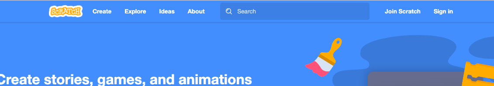 
 
 
>**Note!** To change language in Scratch, click on the arrow next to what looks like **a globe** in the top left corner and a whole list of language will appear. 
 
    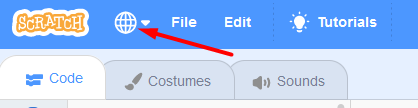 
    
    
Time to start coding! Make sure you have Scratch open in one tab of your web browser and this instruction in another tab. Or have two windows open next to one another. 
 
 
Click on Chapter 1 below to proceed. 

## 1: Choose a new "Sprite" character

In Scratch, characters and figures are called a **"Sprite"**. There are lots of different Sprites to add to your project, which you can then program to move. 

Here are some examples of different Sprites.   
    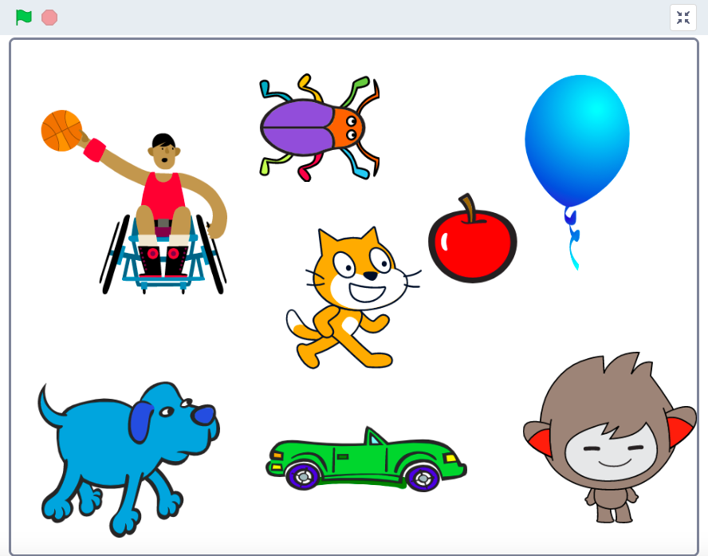 
 

**Time to replace the cat Sprite:** We start by replacing the cat Sprite with a new character – for example a beetle! 
 

>**TIME FOR YOU TO:**
- Remove the cat Sprite from the project
- Choose a new Sprite (for example a beetle) 
- Reduce the size of the Sprite  

 
>**STEP-BY-STEP INSTRUCTIONS:**

**Remove the cat and choose a new Sprite**

There are two similar cat characters in the project – one large and one small. The big one is on the white **Stage** and the little one in a box below the stage. 

   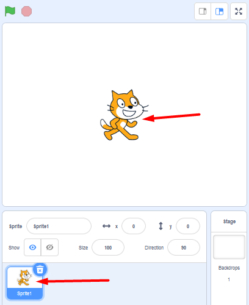

1. On the box with the small cat below the Stage there is **a trash can**. Delete the cat from the project by clicking on the trash can. The cat is now gone and the stage is empty with no Sprites in the project.  

    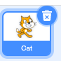 

2. Now we need to add a **new Sprite**. To the right under the stage you can see a blue button with a white cat face on it. This is the **Choose a Sprite** button. Click on it. 

    

3. Now you are in the Sprite library for Scratch. There are lots of Sprites to choose from. Click on the Sprite you want in your project and it will show up on your stage. 

    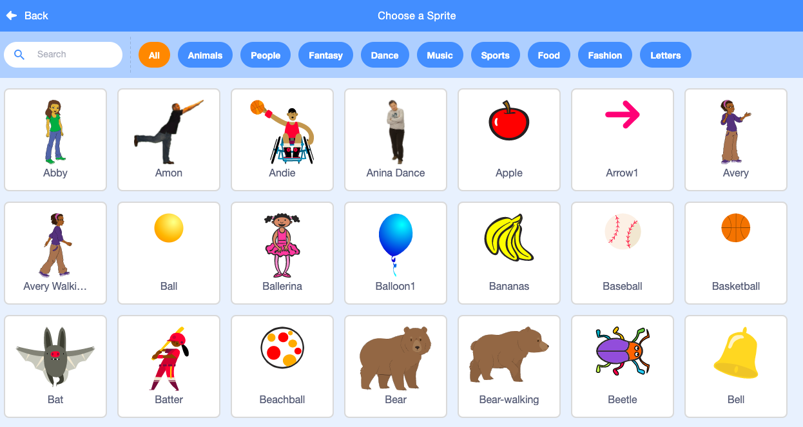

>**Note!** At the top of the Sprite Library there is a menu with different categories to make it easier to find the Sprite you want, for example, Music, People or Food. There is also a search function. 

**Reduce the size of the Sprite**

4. The Sprite you just added is a bit large. You can reduce the size of it by locating **Size 100** above the smaller Sprite image and below the stage. This means that the Sprite is **in full size**, i.e., 100%. Change the number to a lower percentage, for example 50. You can always go back and change it again if it becomes too big or small for your project. 

    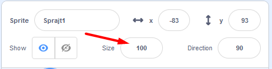

**Next step:** You have now added a new Sprite and we want to make it move, but first we’ll create a more fun backdrop for the Sprite to move on.  

Click to go to chapter 2. 

## 2: Draw a backdrop
Now we are going to draw a backdrop with a track for the Sprite to run on.
    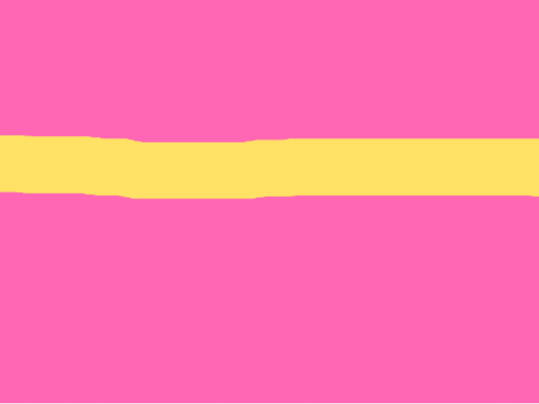

>**TIME FOR YOU TO:**
- Activate the backdrop 
- Enable Bitmap mode in the drawing tool
- Select color and tools to fill the backdrop
- Choose a new color and tool to paint a track 

 
>**STEP-BY-STEP INSTRUCTIONS:**

The white box behind your Sprite is called a stage. We can change the backdrop of the stage, either by selecting an image from the backdrop library or by drawing our own. We want to draw a backdrop with a track on it. This is how:  

**Activate the backdrop and drawing tool**

1. The Sprite is activated, since we have been working with it so we need to activate the backdrop to be able to make changes to that instead. Click on the white box in the bottom right hand corner where it says **STAGE**. The backdrop is activated when you see that it is marked with a blue frame. 

    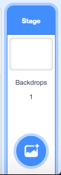

2. To open the backdrop drawing tool, click on the tab called **Backdrops** located in the top left corner of your screen. 

	  

3. Click on the blue button at the bottom below the drawing area that says **"Convert to bitmap”** on. This makes painting much easier.

    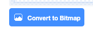
    
**Pick color and tools to change the backdrop**

4. Select **a new color** for the backdrop by clicking on the **Fill box**. A color picker will appear. Move the white circles to the left or right to get the color you want. 

   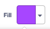
 
   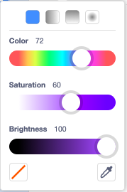
    
5. When you are happy with your color, close the window of the color picker by clicking anywhere outside it. Then **select the tool** that looks like a **BUCKET**. Click on the larger checkered area to the right and the whole backdrop will be in the color you selected. (You will se the same color appear on the Stage with your Sprite as well)

  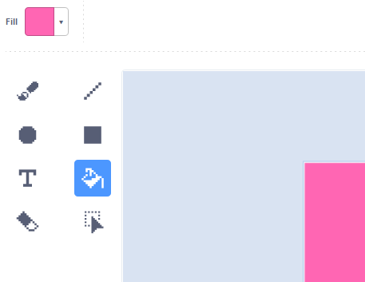
  
**Choose a new tool and color to paint a track**

6. Now we need to paint a track for the Sprite to run on. Click on the tool that looks like a **BRUSH**. Then click on the **number 10** above the drawing surface and change the size of the brush to **100** – a good width for the track. Press **Fill** to pick a color for the track. 

 
 
7. Paint a straight path on the drawing surface with the brush and the new color. The line should be quite thick so the Sprite can fit on the track. 

  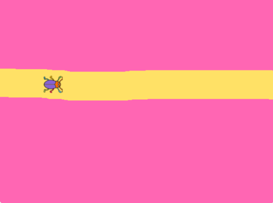

**Next step:** we have a Sprite and a backdrop. Time to start coding so that the Sprite can run on the track!
 
Click on Chapter 3 for the next step 

## 3: Code to make the Sprite move 
A Sprite is just an image, but with code we can control the Sprite and the project. Coding in Scratch can for example look like this:

With the help of code we can give the Sprite instructions for how it should move across the stage. Code also controls **how** and **when** the Sprite should be moving. You create the code with the colorful puzzle pieces that you see on the left side in Scratch. You put the pieces together into, what we call, **a Script** on the large white script surface in the middle.

Time for you to make the Sprite move! 
 

>**TIME FOR YOU TO:**

- Activate the Sprite and go back to the code workspace 
- Add code for EVENTS with starting code: *when GREEN FLAG clicked* 
- Add code for MOTION: *move 10 steps* 
- Add code for CONTROL: *forever* (a loop) 
 
>**STEP-BY-STEP INSTRUCTIONS:**

**Return to the code workspace and activate the Sprite**

1.  When you worked on the backdrop you were in the workspace called **BACKDROP**. To be able to code you need to click on the tab named **CODE** in the upper left-hand corner. Then click on the **small image for your Sprite to activate it**.

  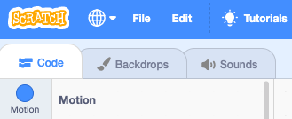
 
  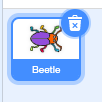

Now you are ready to start coding your Sprite – which doesn’t have to be a beetle.

**Start och stop button**
Have you noticed the **START** and **STOP** buttons above the stage with the Sprite? The **green flag** is the start button and the **red button** is the stop button.   

  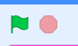

Time for you to add code so that your Sprite starts to move on the Stage when you press the START button – that is, **the green flag**. 

**Enter code block for start**

2. At the far left you can see different colored themes with headings, e.g. *Motion*, *Looks* and *Control*. When you click on the themes, more coding blocks will show up in the shape of puzzle pieces. The theme has the same color as its associated code blocks.  

  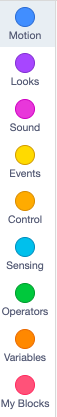 

Click on the yellow theme called **EVENTS** and select the block with a green flag on it called: **"when GREEN FLAG clicked”**. Drag the block to the large, white script surface in the middle of the window and drop it there. 

  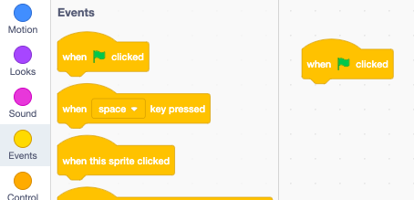
  
You have now added a **Hat block** to your project. A hat block is always at the top of the code you want to build. But you need more code so that the Sprite knows what to do when the green start flag is clicked.

**Enter code blocks for motion**

3. Click on the blue theme called **MOTION** and select the **"move 10 steps"** block. Drag the block to the script surface and attach it under the yellow hat block with the green flag. You connect the blocks as two pieces of a puzzle.

  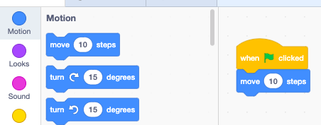

 >**Note!** If you move two blocks close to each other on the script surface, a gray shadow will appear. You can then release the code block you are holding, and the blocks automatically come together as puzzle pieces –like a magnet is pulling them together. 
 
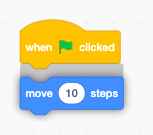
 

>**Test your code!** Test what happens when you press the START button (the green flag above the scene). Does the Sprite move a little to the right when you click the start button? Try several times, what happens?

**Add a loop to repeat the motion**

You want the Sprite to continue moving forward when you press the start button. For that we need to add a code block that tells the motion to repeat over and over again. This is called a **loop**. This is what you do: 

4. Click on the orange theme called **CONTROL**. Here you will find a block called **"forever"**. This block will repeat the code that is placed inside it over and over, which is a **loop**.  

5. Pull over the **"forever"** block to the script surface and place it directly below **"when GREEN FLAG clicked"** so that the blue motion block **"move 10 steps"** is placed inside the loop. It should look like the image below: 

  

>**Test your code!** Press the START button. Your Sprite should run away really fast.

**Stop the code and drag the Sprite back**

6. The Sprite stops by itself at the edge of the stage. You can drag it back onto the stage again. Does it run away again? You have to click on the red stop button above the stage to stop the code for the Sprite to stop running. 

  

>**Note!** Does the Sprite move too fast? You can change the speed by typing a lower number in the blue block called **“move 10 steps”**. Click on the number 10 in the block and write, for example, 3. Start the project again – does the Sprite move at a good speed? Test until you find the speed you want it to have. 
 
   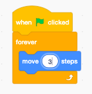
 

**Next step:**
Now we have a Sprite that runs on the track, but it gets stuck at the edge. Let’s give it a starting position. 

Click on Chapter 4 for the next step.

## 4: Set a Start position
To avoid having to drag the beetle (or whatever Sprite you are using) back every time you start the game, you can code it to start at the same place each time. For that you need to use x and y coordinates. 

>**TIME FOR YOU TO:**

- Drag the Sprite to a place on the track where you want it to start 
- Enter code to indicate starting position MOTION: go to x: __ y: __ 

 
>**STEP-BY-STEP INSTRUCTIONS:**

**Add a code to set starting position**

1. Drag the Sprite to the position on the track where you want it to start. 

2. Click on the **MOTION** theme on the left and select the block **"go to x: __ y: __"**. Insert the code block in the script directly below the block **"when GREEN FLAG clicked".** The numbers (values) that are in the block at X and Y are the coordinates for the position of your beetle on the stage. 

   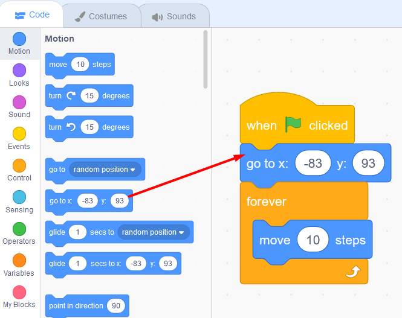

Now the beetle will be in the same starting position every time you press the green START flag above the stage. 

>**Time to test your code!** Does the Sprite start from the same position every time you press the green start flag? Does it move fast enough? 

**Good work! You have created your first project in Scratch and coded your first project that makes a Sprite move.**

## Finished!
Congratulations! You now know the basics of Scratch and can move on to bigger projects! 

## Questions:

* What is a sprite? 

* What is a loop? 

* What is a script? 
