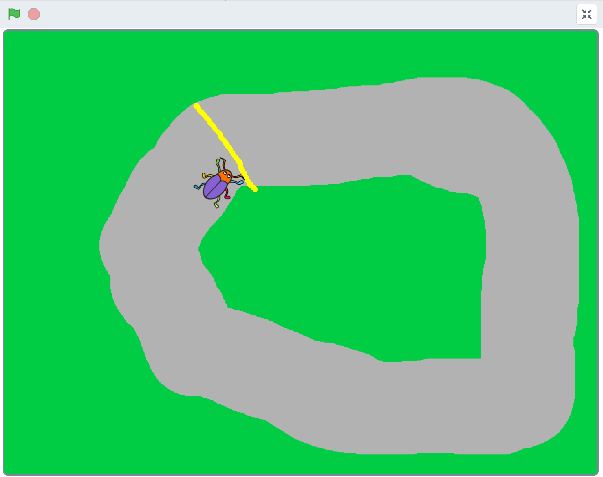

# Bug Race (intro)
I spelet Bug Race är målet att få en skalbagge att springa runt en bana och försöka undvika att hamna utanför banan genom att styra med vänster- och högerpil på datorns tangentbord. Åker figuren utanför banan blir du Game Over!

Testa ett exempelspel av Bug Race nedan. 

> **HUR KODAR JAG?** 
 
Följ denna instruktion steg för steg och koda ditt projekt i verktyget Scratch. <a href="https://scratch.mit.edu" target="_blank"> Klicka här för att öppna Scratch i en ny flik.</a> I Scratch klickar du på Skapa för att börja. Logga gärna in på Scratch så kan du även spara och dela ditt projekt. Det är gratis att skaffa ett konto.
 

Dax att börja koda! Klicka på steg 1 nedan för att gå vidare i instruktionen.

## 1: Välj ny sprajtfigur

Byt ut katt-sprajten till ny sprajt - en skalbagge!
<video src="./BugRacedel1_nytt.mp4" controls muted height=480 width=640 />

>**VAD SKA JAG GÖRA?**

Se i videon ovan hur du ska:
- Ta bort kattfiguren
- Välj ny sprajt
- Minska sprajtens storlek

 

## 2: Färglägg bakgrunden och rita en bana
Du ska nu färglägga spelets bakgrund och rita en bana som skalbaggen kan springa på.
<video src="./BugRacedel2_nytt.mp4" controls muted height=480 width=640 />

>**VAD SKA JAG GÖRA?**

Se i videon ovan hur du ska:
- Aktivera bakgrunder
- Aktivera Bitmapp-läge
- Välj färg och verktyg för att fylla bakgrund
- Välj ny färg och verktyg för att måla en bana

 

## 3: Sprajten rör på sig
Nu när bakgrunden är färdig kan du börja skapa ditt första skript med kod för att få din sprajt att börja röra sig.
<video src="./BugRacedel3_nytt.mp4" controls muted height=480 width=640 />

>**VAD SKA JAG GÖRA?**

Se i videon ovan hur du ska:
- Välj KOD och din sprajt för att kunna börja koda
- Lägg in kod för start-block: När GRÖN FLAGGA klickas på
- Lägg in kod för RÖRELSE: Gå 10 steg
- Lägg in kod för KONTROLL: För alltid (en loop)

 

## 4: Sätt en startposition
För att slippa dra tillbaka skalbaggen till startplatsen varje gång du vill starta spelet, kan du säga åt datorn att placera den på en bestämd plats vid start.
<video src="./BugRacedel4_nytt.mp4" controls muted height=480 width=640 />

>**VAD SKA JAG GÖRA?**

Se i videon ovan hur du ska:
- Dra sprajten till där du vill den ska starta på banan
- Lägg in kod för RÖRELSE: gå till x:__ y:__

 

## 5: Styra skalbaggen

Nästa steg blir att göra det möjligt att styra skalbaggen, så den inte rusar rakt av banan! För det behöver du två korta skript. Ett som säger åt datorn att skalbaggen ska svänga åt höger när du trycker ned höger piltangent på datorns tangentbord, och ett annat som säger åt den att svänga vänster när du trycker ned vänster piltangent. (Använder du surfplatta med pekskärm finns tips på hur du kan koda sprajten att följa ditt finger längre ned.)
<video src="./BugRacedel5_nytt.mp4" controls muted height=480 width=640 />

>**VAD SKA JAG GÖRA?**

Se i videon ovan hur du ska:
- Lägg in kod för HÄNDELSER: när mellanslag trycks ned. Dra in två stycken sådana block
- Ändra *mellanslag* i kodblocken till *vänsterpil* och *högerpil*
- Lägg in kod för RÖRELSE: rotera vänster 15 grader och ett block rotera höger 15 grader

 

## 6: Ändra startriktning

Om du trycker på START-flaggan igen märker du att skalbaggen behåller den riktning som den hade när du avslutade spelet sist. Kan lätt bli fel håll och detta kan du lösa genom att lägga in ett till init-skript som säger åt datorn att skalbaggen alltid ska vara vänd åt höger när du startar spelet.
<video src="./BugRacedel6_nytt.mp4" controls muted height=480 width=640 />

>**VAD SKA JAG GÖRA?**

Se i videon ovan hur du ska:
- Lägg in kod för RÖRELSE: peka i 90 graders ritning

                                                                                                                                                                                                                                                                                                                                                                                                                                                                                                                                                                                                                                                                                                                                                                                                                                                                                                                                                                                                                                                                                                                                                                                                                                                                                                                                                                                                                                                                                                                                                                                                                                                                                                                                                                                                                                                                                                                                                                                                                                                                                                                                                                                                                                                                                                                                                                                                                                                                                                                                                                                                                                                                                                                                                                                                                                                                                                                                                                                                                                                                                                                                                                                                                                                                                                                                                                                                                                                                                                                                                                                                                                                                                                                                                                                                                                                                                                                                                                                                                                                                                                                                                                                                                                                                                                                                                                                                                                                                                                                                                                                                                                                                                                                                                                                                                                                                                                                                                                                                                                                                                                                                                                                                                                                                                                                                                                                                                                                                                                                                                                                                                                                                                                                                                                                                                                                                                                                                                                                                                                                                                                                                                                                                                                                                                                                                                                                                                                                                                                                                                                                                                                                                                                                                                                                                                                                                                                                                                                                                                                                                                                                                                                                                                                                                                                                                                                                                                                                                                                          

## 7: Känna av när skalbaggen åker av banan

Skalbaggen måste känna av när den hamnar utanför banan och bli Game Over! Det löser vi genom att skalbaggen känner av vilken färg den åker på. Vi kodar ett VILLKOR för skalbaggen, som säger att: "**OM** skalbaggen rör vid färgen utanför banan - **DÅ** ska spelet ta slut".
<video src="./BugRacedel7_nytt.mp4" controls muted height=480 width=640 />

>**VAD SKA JAG GÖRA?**

Se i videon ovan hur du ska:
- Lägg in kod för KONTROLL: om...då
- Lägg in kod för KÄNNA AV: rör färgen_. Lägg blocket i det kantiga hålet mellan om...då.
- Lägg in kod för UTSEENDE: säg Hej! i 2 sekunder. Ändra texten till Game Over!

 

## 8: Gör klart hela skriptet

Något saknas för att koden ska fungera! Tänk efter: **När** vill du att datorn ska känna av om skalbaggen rör färgen utanför banan? Det behöver ju göras **efter varje steg** skalbaggen tar, för att inte missa om den springer av banan. Datorn måste kolla **exakt vart skalbaggen befinner sig** "om och om igen", hela tiden. Därför måste du koppla ihop skriptet som känner av färgen utanför banan med det som får skalbaggen att röra sig. 
<video src="./BugRacedel8_nytt.mp4" controls muted height=480 width=640 />

>**VAD SKA JAG GÖRA?**

Se i videon ovan hur du ska:
- Lägg skriptet inuti för alltid-loopen
- Lägg in kod för KONTROLL: stoppa alla. Lägg blocket längst ned inom *om...då*. Ändra till *stoppa detta skript*.

 

## Färdig!
Grattis, nu har du skapat ditt första spel! Det färdiga skriptet i sin helhet borde se ut ungefär så här - om du följt instruktionerna:

 

**Glöm inte att spara ditt projekt - och att döpa det!** Döp det gärna till uppgiftens namn Bug Race - eller hitta på ett eget namn, så att du enkelt kan hitta det igen. Du skriver in namn på spelet högt upp ovanför projektet, där det nu står "Scratchprojekt". Spara sedan, men du måste vara inloggad för att kunna spara.

> **Testa ditt projekt**  
Visa gärna någon ditt spel och låt dem testa. Om du vill, tryck på knappen DELA som du finner överst så kan andra också hitta spelet på Scratch sajt och testa det.

> **Viktigt om du delar ditt projekt:** Tänk på att delade projekt kan ses, testas och remixas (omskapas) av alla som vill på Scratch sajt. Det är viktigt när du sparar och delar att projektet inte innhåller information, bilder eller ljud du inte vill sprida till andra.

## Utmaning
Saknas något? Hur skulle du vilja utveckla spelet?

Tips på hur du kan bygga vidare på Bug Race hittar du i uppgiften som heter <a href="https://www.kodboken.se/start/skapa-spel/uppgifter-i-scratch/bug-race-tillagg?chpt=0" target="_blank"> Bug Race - Tillägg</a>.
Där kan du bland annat skapa Bug Race för två spelare samtidigt och göra en mjukare styrning av sprajtarna.

## Frågeställningar

* Vad är en sprajt?

* Vad är en loop?

* Varför kan det vara bra att använda en loop?

* Vad är ett INIT-Script eller Start-Script?

* Vad händer i spelet Bug Race om sprajten har samma färg som bakgrunden?
