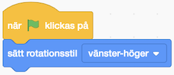
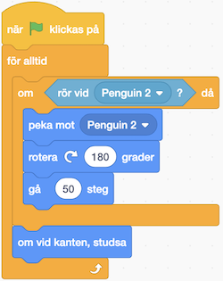
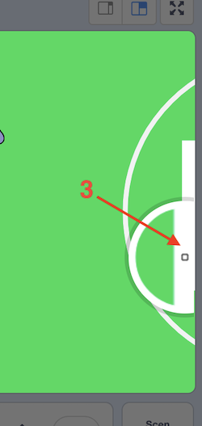
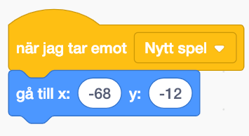
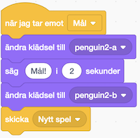

# Fotbollsspel

Det här är ett enkelt spel för dig som har börjat lära dig litegrann om Scratch. Spelet går ut på att styra en fotbollsspelare som ska skjuta bollen i mål.

Ett exempel på det färdiga spelet finns här: <a href="https://scratch.mit.edu/projects/277142988/" target="_blank">scratch project 277142988</a>

> **HUR KODAR JAG?** 
 
Följ denna instruktion steg för steg och koda ditt projekt i verktyget Scratch. <a href="https://scratch.mit.edu" target="_blank"> Klicka här för att öppna Scratch i en ny flik.</a> I Scratch klickar du på Skapa för att börja. Logga gärna in på Scratch så kan du även spara och dela ditt projekt. Det är gratis att skaffa ett konto.
 
  
Då börjar vi koda!

## 1: Välj sprajtar för fotbollsspelare och boll

Skapa ett nytt projekt. Börja med att ta bort katten och välj två nya sprajtar från biblioteket, en fotbollsspelare och en fotboll.

1. Ta bort katt-sprajten.

  

2. Nu vill du lägga till de nya sprajtarna. Tryck på knappen "Välj en sprajt":

  

  Välj vilken sprajt du vill använda som spelare. I det här exemplet har vi valt en pingvin: **Djur > Penguin 2** men du kan välja någon annan figur också. Lägg sedan till en ny sprajt i form av en fotboll: **Sport > Soccer Ball**.

3. Du behöver minska storleken på sprajtarna, så att de får en större yta att spela på. Se till så att spelaren blir något mindre än bollen. Välj fotbollen och ändra storleken till 175 samt ändra storleken på spelaren till 75.

  

4. Ändra klädsel på spelaren (om det är pingvinen) så att den tittar åt höger.

  

## 2: Fotbollsplan som bakgrund

Nu ska du rita en fotbollsplan som bakgrund till scenen. Men vi håller det enkelt!

5. För att ändra bakgrunden trycker du först på Scen och sedan på fliken Bakgrunder högst upp.

  	

6. Tryck på Rektangel-verktyget och välj en grön färg. Rita ut en stor rektangel på bakgrunden och dra ut sidorna så rektangeln fyller hela bakgrunden.

  	 

7. Rita ett mål i höger kant med REKTANGEL-verktyget. Målet ska vara vitt. Välj ljusstyrka 100.

  

8. Välj sedan Cirkel och gör en halvcirkel utanför målet, med en färg som ser vit ut men har en annan nyans än målet. Fyll-färgen ska vara transparent och Kontur ska ha en vit färg med ljusstyrka 95. 

> Det är viktigt att du använder **två olika vita nyanser**, du kommer att förstå varför senare.

    

## 3: Få spelaren att röra på sig

Nu när bakgrunden är färdig kan du börja skapa ditt första skript. Glöm inte att **spara ofta**!

Dra din fotbollsspelare till den målade banan om den inte redan står där. Välj Penguin 2-sprajten och tryck på Kod-fliken. Du ska nu göra ett skript som låter dig styra spelaren (pingvinen) med _piltangenterna_.

1. Dra ut ett block för **HÄNDELSER**: **"när [mellanslag] tangenten trycks ned"** till kodytan.

2. Välj sedan **"vänsterpil"** i rullistan på det blocket.

3. Under blocket kopplar du fast blocket **"gå 10 steg"** från **RÖRELSE**.

4. Högerklicka på skriptet och kopiera, tills du har fyra stycken likadana skript som du lägger bredvid varandra.

5. Ändra i rullistan på de kopierade blocken så att du har ett skript för **"högerpil"**, ett för **"uppåtpil"** och ett för **"nedåtpil"**.

  

> Testa ditt projekt! Klicka på START. Se vad som händer när du styr med vänster och höger piltangent. Spelaren går i samma riktning vilken piltangent du än trycker på! Hur kan du ändra det?

9. Du behöver tala om för sprajten åt vilket håll den ska peka innan den börjar röra på sig, så att den står i rätt riktning! Välj blocket **"peka i riktning (90)"** från **RÖRELSE** och lägg ovanför **"gå 10 steg"** i alla fyra skript.

10. Nu gäller det att välja rätt riktning för varje skript.

> Testa ditt projekt! Klicka på START. Vad händer nu när du styr med piltangenterna? Vad händer när spelaren når scenkanten?

  **Tips:** Om spelaren försvinner ut från scenen behöver du säga åt den att **om vid kanten, studsa** så att den stannar inuti scenen! Se om du kan hitta ett sådant kommando i **RÖRELSE**.

  

  _Så här borde dina skript för fotbollsspelaren se ut nu._

> Om din spelare hamnar upp-och-ner när du går åt vänster är det nog för att sprajten har "fel" rotationsstil. Använd **"Sätt rotationsstil [vänster-höger]"** från **RÖRELSE** ihop med **"när 'flagga' klickas på"** från **HÄNDELSER** och tryck på START igen för att se om det ser bättre ut nu.
> 
> 

## 4: Få spelaren att sparka på bollen

Nästa steg blir att göra det möjligt för spelaren att sparka bollen i mål! Du ska göra så att bollens sprajt *känner av* spelarens sprajt, och *då* få bollen att röra sig i samma riktning som spelaren men med en högre hastighet, så att det ser ut som att bollen skjuts iväg.  

1. Gå till bollens kod genom att välja boll-sprajten först.

2. Välj en **"för alltid"**-loop från **KONTROLL** och sätt under en **"när 'flagga' klickas på"**.

3. Välj blocket **"om <> då"** som finns under **KONTROLL** och lägg inuti loopen.

4. Från **KÄNNA AV** tar du blocket **rör vid [muspekare]?"** och väljer spelarens sprajt ur rullistan (Penguin 2). Fäst blocket till kommandot så att *om* bollen *rör* sprajten *då* ska något hända.

5. Vad ska hända? Jo, bollen ska röra sig! Välj **"gå (10) steg"** från **RÖRELSE** och lägg in i kommandot för **"om <> då"**.

6. Ändra antalet steg – det ska vara högre än 10 eftersom spelaren rör sig med den hastigheten och du vill att bollen ska röra sig fortare. Prova dig fram tills du får rätt effekt!

  

> Testa ditt projekt! Klicka på START. Vad händer när spelaren nuddar bollen? Har bollen en bra hastighet? Vad händer när bollen når scenkanten?

  **Tips:** Om bollen försvinner ut från scenen behöver du säga åt den att **om vid kanten, studsa** på samma sätt som du gjorde med din fotbollsspelare. Lägg blocket inuti din loop men efter **"om <> då"**.

> Testa ditt projekt igen. Klicka på START. När bollen har studsat vid kanten, kan spelaren då komma från andra hållet och sparka på bollen? Vad händer?

## 5: Få bollen att röra sig i rätt riktning

Antagligen rör sig bollen bara i samma riktning, oavsett vilket håll din spelare kommer från. Du behöver säga åt bollen i vilken riktning du vill att den ska röra sig.

> Eftersom du vill att spelaren ska kunna sparka på bollen från alla möjliga håll, behöver du tala om för bollen att den ska röra sig i *motsatt riktning från där spelaren står* när den rör vid bollen. Det här är lite knepigt, men går om du gör det i två steg: först säger du åt bollen att *peka mot spelaren*, sedan säger du åt den att *vända sig helt om*. Det behöver den göra *innan* den rör sig framåt.

1. Ta blocket **"peka mot [muspekare]"** från **RÖRELSE** och välj spelarens sprajt i rullistan. Till det fäster du sedan blocket som heter **"rotera (15) grader"** och skriver in **180** för att bollen ska vändas helt om. Det spelar ingen roll vilken av de två rotera-blocken du tar.  

2. Lägg in de två blocken i kommandot som du redan har gjort för **"om <> då"**. Tänk på att de ska ligga före **"gå (50) steg"**.

  

> Testa ditt projekt! Klicka på START. Kan du få spelaren att sparka på bollen åt olika håll? Kan du sparka bollen i mål? Vad händer om du sparkar boll längst ner till kanten, kan du få upp bollen igen? Om det inte går, kanske spelaren (pingvinen) måste bli lite mindre. Ändra storlekn t.ex. till 50 och se om det går bättre.

## 6: Göra mål

Nu ska du få fotbollsspelaren att ropa "Mål!" när bollen nuddar det vita målet. För att göra det måste bollen *känna av* när den nuddar det vita målet, och *då meddela* spelaren att den är i mål.

> Att en sprajt kan **skicka meddelande** till en annan, kallas för en *funktion*. Det är ett sätt för olika delar i programmet att kunna "prata" med varandra. Du kommer snart att se varför det är bra att ha.

15. Börja med att säga till bollens sprajt att *om* den *rör färgen* för målet, *då* ska bollen göra något. Lägg kommandot i samma loop som den första **"om <> då"**-blocket. Färgen för målet får du om du klickar i rutan för **"rör vid färgen ( )?"** och sedan klickar på färgväljaren och sedan på ditt mål på scenen.

    

16. Nu ska du be bollen *skicka meddelande* när den rör färgen för målet. I **HÄNDELSER** hittar du **"skicka [meddelande1] och vänta"**, ändra till nytt meddelande i rullistan och skriv in "Mål".

    Det är viktigt att du använder blocket som _skickar meddelande_ OCH _väntar_, annars så kommer koden att fastna i loopen.

  

17. Nu är det spelarens tur! Du behöver tala om för spelarens sprajt att när den *tar emot meddelande* "Mål", då ska den säga "Mål!" – eller något annat om du hellre vill det. Under **UTSEENDE** hittar du **"säg (Hej!) i (2) sekunder"**. Ändra antalet sekunder om du vill att det spelaren säger ska stå längre.

  

> Testa ditt projekt! Klicka på START. Vad händer när du får spelaren att sparka bollen i mål? Ropar fotbollsspelaren "Mål!" när bollen är i mål?

  **Tips:** Om färgen på rektangeln (mål) är densamma som färgen på halvcirkeln (strafflinje), kan inte programmet känna skillnad på mål och strafflinje. Ändra i så fall så att nyansen på vitt skiljer sig åt. Det räcker med en liten skillnad i nyans, för att en dator ska förstå att det är olika färg!

## 7: Starta om efter mål

Något saknas! Vad ska hända när fotbollsspelaren har skjutit bollen i mål? Nu ligger bara bollen kvar och spelaren har inget mer att göra. Det ska du få fixa till nu. När bollen går i mål, ska spelare och boll flyttas tillbaka till där de stod från början, så att du kan spela igen.

> En *startposition* är alltid bra att sätta, för att slippa dra tillbaka spelaren varje gång du trycker på START. Du gör då ett "start"-skript som talar om hur programmet ska starta.

Men istället för att sätta startpositionen i början på skriptet, ska du få använda dig av *meddelanden* igen. På så sätt skapar du nämligen en funktion som går att använda på flera ställen i ditt program.

18. Börja med att flytta sprajterna för spelare och boll där du vill att de ska starta på fotbollsplanen. Markera sedan spelarens sprajt. Gör ett nytt skript för **"när 'flagga' klickas på"** (eller använd existerande om det finns utdraget redan) och fäst ett block för **"skicka [Mål]"**, ändra till nytt meddelande i rullistan och skriv in "Nytt spel".

19. Gå till skriptet för **"när jag tar emot [Mål]"** och lägg till blocket **"skicka [Nytt spel]"** även där, efter det att sprajten har sagt "Mål!".

20. Skapa ett nytt skript för spelaren som **när jag tar emot [Nytt spel]**. Välj från **RÖRELSE "gå till x: y:"** och koppla fast det blocket under. De värden som redan står för X och Y ska nu stämma överens med sprajtens koordinater - alltså den plats där den står.

  

21. Markera nu bollen och gör ett likadant skript som **när jag tar emot [Nytt spel]** "nytt spel" som för spelaren i punkt 20.

  

> **Testa ditt projekt.** Klicka på START. Startar spelaren och bollen på rätt plats? Vad händer när spelaren sparkar bollen i mål, hoppar spelaren och bollen tillbaka till startpositionerna?

## Färdig!
Grattis, nu har du gjort klart uppgiften.

**Glöm inte att spara ditt projekt!** Döp det gärna till uppgiftens namn så att du enkelt kan hitta det igen.

> **Testa ditt projekt**  
Visa gärna någon det som du har gjort och låt dem testa. Tryck på Dela-knappen för att andra ska kunna hitta spelet på Scratch. Gå ut till projektsidan och låt någon annan testa spelet!

## Utmaning
Har du tid över? Här kommer en utmaning för dig som vill fortsätta.

### Animera fotbollsspelaren
Du kan till exempel *animera* fotbollsspelaren genom att *byta klädsel* på sprajten när den gör mål.

  

### Poängräknare
Du kan även skapa en *poängräknare* som håller reda på hur många mål du hinner göra inom en viss tid. Eller så kan du göra ett spel för *två spelare* och skapa en målvakt som ska försöka stoppa bollen.

**Tips:** Titta på <a href="http://www.scratch.mit.edu/projects/32369372" target = "_blank">det här exemplet</a> på hur spelet kan se ut.
För att se koden bakom projektet trycker du på "Se inuti".

## Frågeställningar

* Hur kan du göra så att en sprajt inte åker utanför spelplanen när du har flyttat på den?

* Hur kan du göra så att en sprajt som pingvinen inte hamnar på huvudet när den byter riktning?

* Vad är ett meddelande?

* Vad kan du använda ett meddelande till?
