# Startövning 1: Rörelse

Nu ska du få lära dig grunderna i hur man får figurer och saker att röra sig i programmeringsverktyget Scratch.

De flesta program och spel du kommer skapa i verktyget Scratch kommer innehålla någon form av figurer. I Scratch kallas alla figurer för **sprajtar**. Dessa sprajtar brukar ofta röra sig över skärmen, tänk till exempel hur Super Mario eller Pacman rör sig i sina spel.

Nu ska vi prova att koda en av Kodcentrums robotar att röra sig så här:

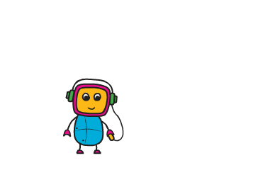

Redo att börja koda? Klicka på nästa steg nummer 1 här under för att gå vidare.

## 1: Remixa projekt

När man ska koda i Scratch kan man antingen starta ett eget projekt eller program själv, eller jobba vidare på någon annans skapade program och kod. Detta kallas för att remixa. Vi ska nu testa att remixa ett program så vi kan skapa vidare på det:

1. Klicka på länken nedanför för att komma till det förberedda programmet på Scratch.

<a href="https://scratch.mit.edu/projects/210051047/" target='_blank'>Scratchprojekt: Robot som rör sig</a> <!--_-->

2. Om Scratch visas på fel språk, kan du byta till Svenska (eller valfritt språk) högst upp till vänster med ett klick på denna symbol:

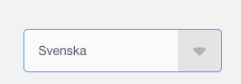

3. Se till att du är inloggad på ditt Scratch-konto. (Om du inte har ett konto, klicka på "Gå med Scratch" och skapa ett, det är gratis.)

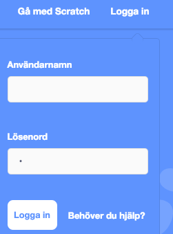

4. Klicka på Se inuti.

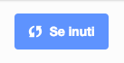

5. Klicka på remix-knappen för att spara en egen kopia av programmet med robotsprajten.

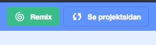

Vi kan nu koda som vi vill i det remixade projektet - det har blivit till ditt eget. I just detta projekt finns ingen kod än, bara en robotsprajt.

Vi ska nu lära oss hur vi kan lägga in kod för att få roboten att röra sig. All kod som ska läggas in kallas för **skript**. I Scratch är alla skript förberedda små kod-pusselbitar att skapa med.

## 2: Gå-skriptet

1. Se till att robotsprajten är markerad, klicka på rubriken **RÖRELSE** och dra ut ett **"gå 10 steg"**-skript till skriptytan.

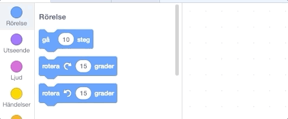

2. Testa att dubbelklicka på en blå del av gå-skriptet du lade på skriptytan. Vad händer?

	Roboten rör sig en liten bit till höger varje gång vi dubbelklickar. Testa nu att klicka på siffran 10 i gå-skriptet och ändra det till en högre siffra. Vad händer då när du klickar på gå-scriptet?

	Om roboten skulle hamna för långt till höger kan du bara dra in henne till mitten igen.

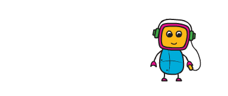

3. Testa sätta ett minustecken framför siffran i gå-skriptet. Vad händer då?

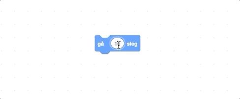

Snyggt jobbat! Vi kan nu få roboten att gå fram och tillbaka bara genom att dubbelklicka på vårt Gå-skript.

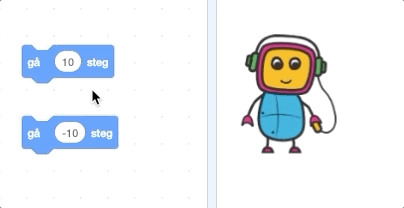

## 3: Rotera-skriptet

Förutom att gå fram och tillbaka så vill vi att roboten ska kunna vända på sig. För att göra det har vi två olika skript som finns under rubriken **RÖRELSE**, nämligen **"rotera** högerpil **15 grader"** och **"rotera** vänsterpil **15 grader"**.

1. Dra ut båda två till skriptytan och dubbelklicka på dem. Vad händer om du byter siffran 15 till något större? Testa med 30, 90, 180 och 270.

2. Testa att byta till 360. Vad händer då?

3. Testa byta till något ännu större än 360 och till något negativt med minustecken framför. Vad händer då?

Nu när vi har Rotera-skripten kan vi få roboten att vända sig om.

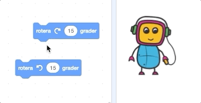

## 4: Vänta-skriptet

Nu har vi lärt oss hur vi får roboten att göra enskilda rörelser, men hur ska vi göra för att få henne att göra flera saker i rad?

Scratch-skripten funkar lite som lego eller pusselbitar, man kan sätta ihop dem på olika sätt.

1. Sätt ihop några av skripten du tagit fram efter varandra.

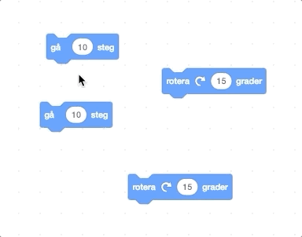

2. Dubbelklicka på det första skriptet som ligger på toppen.

3. Roboten gör allt vi sa åt henne att göra med vårt skript, men det går så snabbt att vi inte hinner se alla steg. Klicka på rubriken **KONTROLL** och lägg till skriptet **"vänta 1 sekunder"** mellan varje Gå-skript och Rotera-skript. Nu utför roboten instruktionerna i lugnare tempo och kan vi följa varje steg hon gör.

## 5: Start-skriptet

Nu har vi lärt oss hur man får roboten att röra sig genom att dubbelklicka direkt på blocken. För att slippa dubbelklicka på blocken, och få programmet att starta med ett klick behöver vi en startknapp. Välj rubriken **HÄNDELSER** och använd skriptet **"när** grön flagga **klickas på"**. Den gröna flagg-bilden betyder samma sak som "Start".

1. Dra in detta Flagg-skript och lägg ovanför rörelse-skripten som du skapade. Testa sen att klicka på den gröna flaggan som finns ovanför roboten. Nu har du kopplat ditt program till Scratch startknapp.

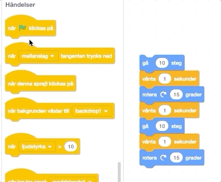

Under rubriken **HÄNDELSER** finns många olika sorters händelse-skript att använda - alla dessa får saker som finns kopplat under att hända. Händelse-skript har en rundad topp, det betyder att de alltid ligger överst och man kan bara koppla andra scriptblock under.

Alla skript i programmet måste vara kopplade till ett händelse-skript medrundad topp, annars kommer inte programmet veta när den ska köra skripten och inget händer.

Bra jobbat! Nu har du lärt dig grunderna i hur man får figurer att röra sig i Scratch. Nu är du redo att testa på lite mer avancerade saker.
