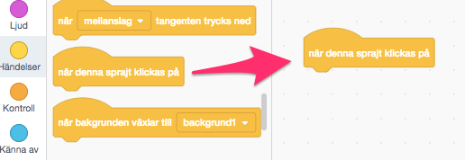
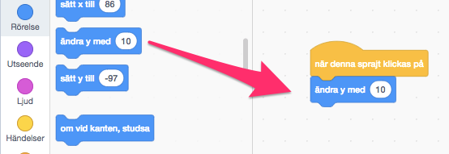
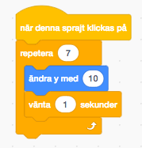
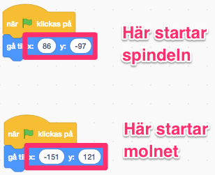
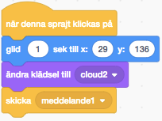

# Imse Vimse Spindel

Nu ska du få skapa ett program som är en interaktiv berättelse, en berättelse där användaren styr vad som ska hända. Programmet är enkelt även om du aldrig har jobbat med Scratch tidigare. Målet är att illustrera barnvisan ”Imse Vimse Spindel” med hjälp av enkla animationer.

> Använder du Scratch 2.0 offline-version? <a href="https://www.kodboken.se/start/skapa-berattelser/uppgifter-i-scratch/imse-vimse-spindel-offline?chpt=0">Här hittar du samma instruktion anpassad utifrån kodning med nedladdningsbara Scratch 2.0 offline</a>.

> Bläddra dig fram genom denna guide, steg för steg. <a href="https://scratch.mit.edu" target="_blank">
  Öppna även kodarverktyget Scratch genom att klicka på länken bredvid katt-figuren ovan eller via www.scratch.mit.edu</a>. Här kodar och skapar du själva berättelsen utifrån instruktionerna nedan. 

Klicka på bilden här under och se ett exempel på den färdiga berättelsen på Scratch sajt: 

  Då börjar vi koda! Klicka fram till avsnitt 1 här under.

## 1: Välja en insekt som sprajt

I ditt nya projekt visas en katt som enda sprajt på en vit bakgrund. Du får börja med att ta bort katten och välja en ny sprajt.

1.	Markera katten, sprajt1 (långt ner till höger) och tryck sedan på krysset i den blå cirkeln så försvinner den.

  

2.	Nu vill du lägga till en insekt i stället. Markera knappen för sprajter (nere till höger). Tryck på förstoringsglaset för VÄLJ EN SPRAJT:

  

  I menyn längst upp finns en kategori som heter **”Djur”**, tryck på den. I listan hittar du flera insekter. Välj den som heter **”Ladybug1”**. Tryck på insekten så att den blir markerad. (Tyvärr finns det ingen riktig spindel, så därför får du använda dig av **”Ladybug1”**)

3.	Placera spindel på botten i mitten av bakgrunden. 

4. Vänd på den så den ser ut att gå neråt. För att vrida spindels skriver du in siffran "180" i lilla fönstret bredvid RIKTNING. Då vrider spindelsn sig.

Nu har du gjort spindel och det är dags att skapa en rolig bakgrund!

## 2: Skapa en bakgrund

Du ska nu få infoga en bakgrundsbild från biblioteket och därefter rita lite spindelnät.

1.	Markera knappen för bakgrund (längst nere till höger). Tryck på förstoringsglaset för VÄLJ EN BAKGRUND.

  

I menyn längst upp finns en kategori som heter **”Utomhus”**, tryck på den. I listan hittar du flera utomhusmiljöer. Välj den som heter **”wall2”**. Tryck på den bilden.

> **Tips:** Om du vill så får du använda en annan bakgrund, det är bara att markera en annan bild.

Nu får du se till att rita lite spindelnät:

1.	Klicka på fliken BAKGRUNDER i övre vänsta hörnet, så kommer du till ritverktyget. Tryck på PENSEL eller LINJE och välj en vit färg. Rita ett tjusigt spindelnät i övre högra hörnet.

    .   .   

2.	Tryck på LINJE och välj en vit färg. Rita en rak tråd i mitten av bakgrunden, från spindelnätet till gräset där spindeln är placerad. Det är den här tråden spindeln ska klättra upp på lite senare.

Ungefär så här ska programmet se ut nu. Exakt hur spindelnätet ser ut spelar ingen roll.

  

## 3: Din första kod

Nu när bakgrunden är färdig kan du börja skapa din första kod. Glöm inte att **spara** ofta!

Börja med att klicka på sprajten så att den är markerad och tryck därefter på KOD-fliken.

 
 _Så här ser det ut när sprajten är markerad_

Animationen du ska koda nu är för att få spindeln att klättra på den lodräta tråden i mitten av scenen.  Detta ska ske när du klickar på spindeln.

1.	Dra ut ett block för **HÄNDELSER**: **”när denna sprajt klickas på”** till kodytan. Under den kopplar du fast blocket för **RÖRELSE**: **”ändra y med 10”**

  

  

> Testa nu vad som händer när du trycker på spindeln. Den flyttar sig uppåt! Det är bra, men du vill ju att spindeln ska fortsätta uppåt på tråden. Hur gör du det?

2.	Det kan du ordna med blocket **”repetera 10”** som finns under rubriken **KONTROLL**. Det här är en LOOP som gör att du kan upprepa en viss kod ett antal gånger.

  

3. Markera **10:an** och skriv in **7** istället, så att loopen körs _7_ gånger. Då kan du sjunga med i ramsan när spindeln åker upp!

  > Testa att trycka spindeln nu. Nu åker spindeln uppåt!

3.	Du kan förbättra animationen genom att lägga in en fördröjning efter varje gång spindeln flyttas. Dra ett block KONTROLL: ”vänta 1 sekunder” och placera den direkt efter blocket ”ändra y med 7”.

  

> Tryck på spindeln igen! Hur ser animationen ut nu? Åker den för fort eller för långsamt? Åker den för långt eller för kort på tråden? Du kan ändra både hur mycket du ska flytta spindeln och hur många gånger tills du är nöjd.

## 4: Sätt en Startposition

För att slippa dra tillbaka spindeln varje gång du vill testa din animation ska du nu skapa kod som säger åt datorn att placera spindeln på en särskild plats. Detta kallas för att INITIERA programmet och berättar för datorn vad som ska hända när programmet startar.

> För att starta och stoppa ett program, finns det i Scratch två särskilda knappar.   Har du lagt märke till dem än? Nu ska du se till att spindeln hamnar i början av tråden när du klickar på START-knappen.

1.	Dra ett block för **HÄNDELSER**: **”när START (flaggan) klickas på”** till kodytan.

2.	Dra spindeln till botten av den lodrätta tråden.

3.	Välj **RÖRELSE**: **”gå till x: y:”** och koppla fast direkt under flaggan. De värden som står för X och Y är KOORDINATER för den startposition som du har ställt spindeln på.

  

Nu kommer spindeln automatiskt att flyttas till sin startposition varje gång du trycker på flaggan, utan att du behöver dra den dit själv!

## 5: Ner faller regnet...

Nästa sak som händer i ramsan är att det börjar regna. Därför behöver du ett moln i ditt program. Det ska du få koda nu!

  

1.	Tryck på knappen för **VÄLJ EN SPRAJT** och välj sprajten **”cloud”**.

2.	Placera den uppe i vänstra hörnet.

Sprajten **cloud** är ett helt vanligt moln men i ramsan regnar det. Du ska därför få rita ett regnmoln. Det kan du göra genom att lägga till en ny KLÄDSEL för sprajten.

1. Gå till fliken KLÄDSLAR

2. Högerklicka på molnet i klädslar och klicka på KOPIERA. Nu ska du ha två likadana klädslar, alltså två likadana bilder på två moln.

  
  

3. Använd penselverktyget och en blå färg och rita  till lite regndroppar.

  

  

  _Så här kan de två klädslarna för molnet se ut_.

Nu är det dags att animera molnet!

1. Nu ser du att du har fått en helt tom kodyta. Här kan du lägga in kod som styr molnet.

2.	**Skapa kod** för **molnet** som säger:

  * När **START** klickas på

  * **Gå till** x: y:

  Det här är precis samma kod som du gjorde för spindeln förut, men den här gången har molnet andra KOORDINATER som startposition.

  

  _Skillnaderna på de två start-kodningarna du gjort. Det enda som skiljer sig är x- och y-värdet._

3. För att se till att det är det vanliga molnet som syns när programmet startar så dra ett block **UTSEENDE**: **"ändra klädsel till ..."** och lägg det under blocket **"gå till...""**  

4. Klicka på den lilla pilen intill namnet på klädseln och välj **"cloud"**.

  

Nu ska du få animera molnet. Målet är att få den att glida åt höger när du klickar på den samtidigt som den byter utseende. Den ska hamna precis ovanför spindeln.

1. Dra ut ett block för **HÄNDELSER**: **”när denna sprajt klickas på”** till kodytan.

2. Under **RÖRELSE** finns det ett block som heter **”glid 1 sek till x: y:”**. Placera den direkt under blocket i punkt 1.

3. **Ändra x-värdet** till **0**

4. Ändra också **1 sek** till **2 sek**

5. Dra sedan ett block **UTSEENDE**: **ändra klädsel...** till skriptet. Se till att klädseln **"cloud2"** väljs i listan över klädslar.

  

> Testa spelet! Glider molnet till den lodrätta tråden och blir till ett regnmoln?

## 6: Skicka meddelanden

När du klickar på molnet ska även spindeln spolas bort och glida bort ifrån tråden. Men hur ska spindeln få reda på att du klickat på molnet? Svaret är MEDDELANDEN! När molnet har klickats på skickar den ut ett meddelande som spindeln kan lyssna på. Fiffigt va?

Block för att skicka och ta emot meddelanden hittar du under **HÄNDELSER**.

1.	Dra ett block för **HÄNDELSER**: **”skicka meddelande1”** och placera den direkt under koden för animationen du gjorde tidigare.

  

2.	Klicka på den lilla **nedåtpilen** på kodblocket och klicka på **”nytt meddelande”**.

3.	I rutan som dyker upp skriver du in **”molndans”**.

   .  

Nu skickar molnet meddelande **"molndans"** när du klickar på den. Nu ska du fixa så att spindeln lyssnar på detta meddelande och glider bort från tråden.

1. Klicka på spindeln sprajten så att den är markerad och du ser koden du gjorde tidigare

2.	Dra ett block **HÄNDELSER**: **”när jag tar emot...”** till kodytan och välj **"molndans"** i listan över meddelanden.  

   

3.	Dra ett block **UTSEENDE**: **”säg ... i 2 sek”** och placera direkt under. Skriv in **”Usch…”** i stället för ”Hello”

4.	Dra ett block **UTSEENDE**: **”ändra klädsel till…”** och placera den direkt under **”säg..”**-blocket.

5. Precis som molnet Cloud är spindeln **"ladybug1"** en helt vanlig insekt men kan få flera utseende genom att man kopierar och gör fler klädslar, klädseln heter **"ladybug2"**. Kopiera klädseln **"ladybug2"** ändra spindelns mun till en ledsen mun med hjälp av ritverktygen.

 . 

6. Spindel sprajten har nu två klädslar, som heter ladybug2 och ladybug3. Klädseln **”ladybug3”** ser lite mer ledsen ut så välj den i **”ändra klädsel till…”**-blocket genom att klicka på den lilla nedåtpilen.

5.	För att spindeln alltid ska ha en glad mun i början av berättelsen, är det viktigt att lägga in att den glada spindeln **"ladybug2"** alltid visas först. Lägg därför till blocket "ändra klädsel till **"ladybug2"** i skriptet som ha en flagga, såhär:

  

6. Använd sedan ett block **RÖRSELSE**: **”glid 1 sek till x: y:”**. Låt y-värdet stå kvar men **ändra x-värdet** till **-100**

  

> Tryck på molnet! Rör sig både molnet och spindeln nu?

## 7: Ljudeffekt

Du ska få göra det lite roligare genom att lägga till ett ljud till animationen.

1.	Klicka på fliken LJUD och därefter på knappen (längst ner till vänster) för **VÄLJ ETT LJUD**: 

2.	Välj ljudet **”screech”** genom att klicka på det så att det blir markerat.

Nu har du lagt till ett ljud till sprajten som kan spelas upp. Block för olika ljudeffekter hittar du under kategorin LJUD.

3.	Dra ett block **LJUD**: **”spela ljudet…”** och placera på kodytan under den kod du gjorde ovan.

4.	Välj **”screech”** från menyn genom att klicka på den lilla **nedåtpilen**.

  

## 8: Upp stiger solen...

Härnäst i ramsan om spindeln kommer solen som gör spindeln glad. Nu är det dags att lägga till en sol till ditt program. Solen ska fungera på nästan samma sak som molnet du just har kodat. När du klickar på solen ska du animera den och solen ska skicka ett meddelande. När spindeln tar emot det meddelandet ska den åka tillbaka till tråden och bli glad.

1.	Tryck på knappen för **NY SPRAJT** och välj sprajten **”Sun”**.

2.	Placera den i övre, högra hörnet.

3.	**Skapa kod** för solen som säger:

  * När **START** klickas på

  * **Gå till** x: y:

Nu är det dags att animera solen!

1. **Skapa kod** för **solen** som säger:

  * När denna sprajt **klickas på**

  * **Glid 2 sekunder till x: y:**. Ange koordinaterna så att solen hamnar precis ovanpå molnet, i mitten på skärmen.

  * **Skicka** meddelandet **"soldans"**

  

> Klicka på solen! Glider den och hamnar ovanför molnet?

## 9: Torka bort allt regn

Nu är regnmolnet kvar även om du klickar på solen vilket är konstigt. Det sista du ska fixa är att se till att molnet åker bort och blir till ett vitt och fluffigt moln. Du ska också se till att spindeln åker tillbaka till tråden.

1.	**Skapa kod** för **molnet** som säger:

  * När jag **tar emot ”soldans”**

  * **Ändra klädsel** till **”cloud”**

  * **Glid 1 sekunder** till x: -150 y: 110

  

2. **Skapa kod** for **spindeln** som säger:

   * När jag **tar emot ”soldans”**

   *  **Ändra klädsel** till **”ladybug2”**

   * **Glid 1 sekund x: y:**. Ange samma koordinater som spindeln startar på i början av programmet.

  > **Tips**. Du behöver använda samma block som i koden för molnet.

## Färdig!
Grattis, nu har du skapat ett nytt program!

**Glöm inte att spara ditt projekt!** Döp det gärna till uppgiftens namn så att du enkelt kan hitta den igen.

> **Testa ditt projekt**  
Visa gärna någon det som du har gjort och låt dem testa. Tryck på DELA för att andra ska kunna hitta projektet på Scratch. Gå ut till projektsidan och låt någon annan testa det!

## Utmaningar

### Fler ljud

Kan du lägga till fler ljudeffekter? Du kan till exempel lägga till ett ljud när solen stiger upp.

### Roligare animationer

Kan du förbättra dina animationer? Det finns en hel del olika block under kategorin **RÖRELSER**. Testa dig fram genom att prova de olika blocken.

### Ändra sprajter och bakgrund

Tycker du inte om spindlar eller tycker du att de är läskiga? Då kan du byta ut spindeln mot en annan sprajt och skapa en helt annan berättelse. Du kan också byta ut bakgrunden eller rita en helt egen!

### En annan barnvisa

Har du en annan sång som du tycker bättre om? Kan du bryta ner den i olika sprajtar och block som blir till ett program? Här är ett exempel:

    En elefant balanserade på en liten spindeltråd,
    det tyckte hon var så intressant
    så hon gick och hämtade en annan elefant

    Två elefanter balanserade på en liten spindeltråd,
    det tyckte de var så intressant
    så de gick ock hämtade en tredje elefant

    osv

För att illustrera denna barnvisa kan du till exempel:

  * Rita en bakgrund med två träd och en tråd emellan dem
  * Ha två eller fler elefant-sprajtar
  * När spelet startar är bara en elefant synlig
  * När du klickar på den första elefanten så dansar den på tråden
  * När den har dansat klart så dyker det upp en andra elefant
  * När du klickar på den nya elefanten så dansar båda två på tråden
  * När de har dansat klart så dyker det upp en tredje elefant

Ett exempel på det färdiga spelet kan du se  <a href="https://scratch.mit.edu/projects/117364599/
" target="_blank">här på Scratch</a>

## Frågeställningar

* Vad är en start-kod?

* Varför är det bra att koda en sådan?

* Vad är en loop?

* När är det bra med en loop?

* Vad är ett meddelande?

* Hur kan du använda ett meddelande?

* Varför kan en sprajt ha flera klädslar?

* Vad kan du använda det till?
