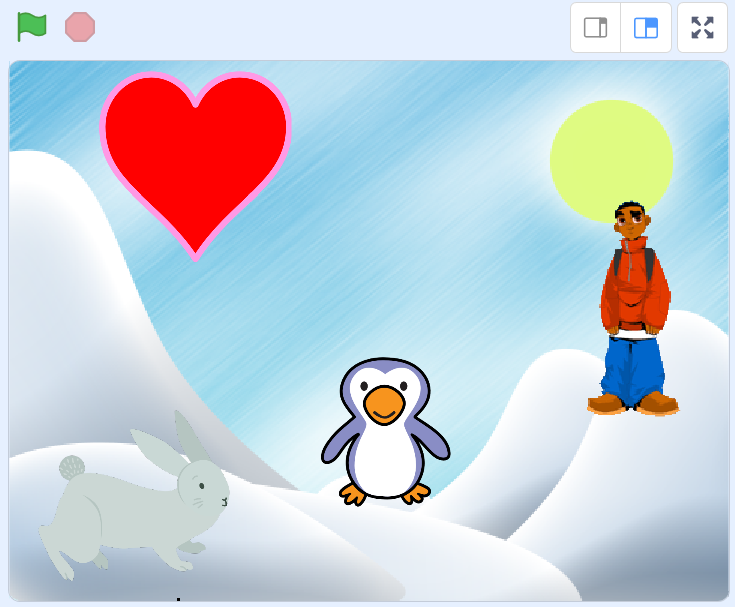
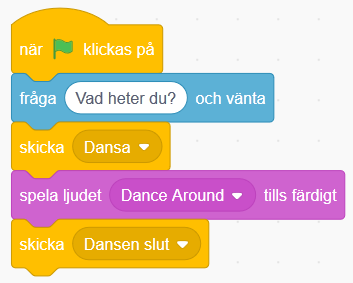
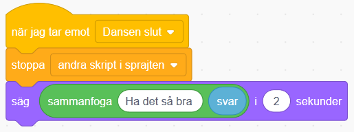
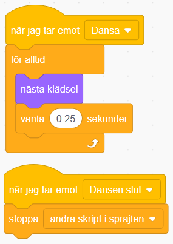
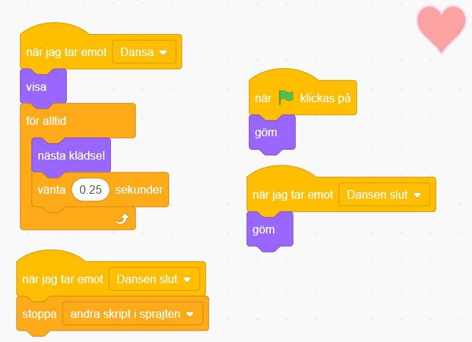
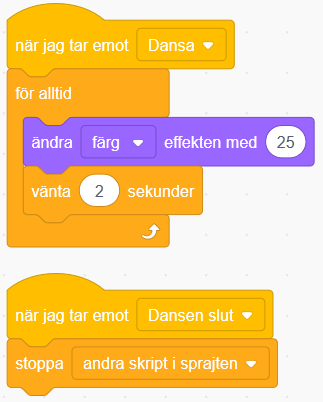

# Digitalt vykort

Här får du göra ett digitalt vykort som du kan skicka till någon du vill hälsa till. Det är interaktivt så att mottagaren av kortet kan skriva in sitt namn och bli personligt firad med fest, musik och hälsningar! Kortets tema går att ändra om du vill göra födelsedagskort, påskkort, julkort eller annat. Ett mål med uppgiften är att du skall lära dig att använda meddelanden och funktioner.
Här kan du se ett exempelprojekt på ett vykort: 

> Bläddra dig fram genom denna guide, steg för steg. <a href="https://scratch.mit.edu" target="_blank"> Öppna även verktyget Scratch på sajten www.scratch.mit.edu</a> där du kodar och skapar själva spelet utifrån Kodbokens instruktioner.
  
  Då börjar vi koda!

## 1: Välja sprajtar och bakgrund

Först behöver du en **bakgrund** och några fina **sprajtar** som figurer!

1. Tryck på **Skapa** på Scratch startsida för ett skapa ett nytt projekt.

2. Lägg till en bakgrund, till exempel **Utomhus > Slopes** som vi har valt i exempelprojektet.

3. Klipp bort sprajten katten genom att klicka krysset på den lilla kattbilden under scenen, så förvinner den.

  

4. Välj en ny sprajt som huvudkaraktär i ditt vykort. Vi har valt **Djur > Penguin 2**, men du kan välja vilken du vill såklart.

5. Lägg in två till sprajtar som kan röra på sig på var sin sida om pingvinen. Till exempel **Djur > Rabbit** och **Människor > Kai.** Lägg alla tre sprajtar bredvid varandra på **scenen** med utrymme för att röra på sig.

6. Om figurerna är för stora kan du ändra storlek genom att skriva in exempelvis 80 istället för 100 - då visas sprajten med 80% storlek istället för full storlek på 100%. Klicka på siffrorna vid **Storlek** som finns under scenen och skriv in nytt tal mellan 1-100. Prova dig fram.

  

Nu har du sprajtar som kan röra sig och en bakgrund. Nästa steg är att få vykortet att:

* Fråga mottagaren : Vad heter du?

* Spela upp musik.

* Få alla sprajtar att dansa och röra sig på sitt eget sätt.

* Säga en hälsning till mottagaren av kortet.

## 2: Fråga efter mottagarens namn

Vi börjar med första steget! Du ska få pingvinen (eller den sprajt du valt) att fråga vad kortets mottagare heter.

7. Välj pingvinens sprajt (klicka på lilla figuren med pingvinen under scenen så den blir markerad) och skapa ett skript till den som säger:

  * Startar när START-flaggan klickas på.

  * Välj **KÄNNA AV**: **"Fråga ___ och vänta"** och skriv in "*Vad heter du?"*.

  

*När du har skrivit in ett namn i svarsrutan, tryck på Enter-knappen på datorns tangentbord.
Du kommer att förstå senare vad namnet ska användas till!*

> Testa ditt projekt! Klicka på START. Frågar pingvinen "Vad heter du?"? Kan du skriva ett svar på frågan i rutan?

## 3: Pingvinen kan dansa!

Nu vill du ge pingvinen några rörelser till musik. 

8. Gå till fliken LJUD i övre vänstra hörnet.

  

9. Klicka sen på VÄLJ NYTT LJUD-symbolen i nedre vänstra hörnet. 

  

10. Välj nytt ljud från ljudbiblioteket och klicka på det ljud du vill välja. Vi har valt **Loop > Dance Around** i exempelprojektet. 
  
  > **Tips!** Man kan för-lyssna på de olika ljuden genom att föra musknappen över de olika! Om du inte hör någonting så kanske du har stängt av ljudet eller har hörlurar inkopplade, fråga någon om hjälp om du inte kan få igång ljudet!

11. Gå till fliken KOD i vänstra övre hörnet och ändra lite i skriptet som du skapade i steg 2. Det ska nu:

  * Starta när START-flaggan klickas på

  * **Fråga** _"Vad heter du?"_ och vänta på svar

  * **Skicka** meddelandet _"Dansa"_

  * **Spela ljudet** _Dance Around_ tills det har spelats färdigt

  

  _Meddelandet "Dansa" kommer att bli viktigt
om en stund. Kan du lista ut varför?_

12. Skapa nu ett nytt skript till pingvinen som ska:

  * Starta när det **tar emot meddelandet** _"Dansa"_

  * **För alltid**:

    * Byta till **nästa klädsel**

    * **Vänta 0.25 sekunder**

  

> Testa ditt projekt! Spelas ljudet efter att du har skrivit in ett namn? Dansar pingvinen lagom fort eller går det för snabbt eller långsamt? Testa att byta ut hur länge den ska vänta mellan klädselbyten.

## 4: Festens slut

För att pingvinen ska sluta dansa när melodin är slut, måste du koda den att göra det. Det kan du fixa med ett nytt **meddelande** som berättar att dansen är slut, så att pingvinen kan säga en hälsning, exempelvis *"Ha det så bra "* och sluta dansa.

13. Gör så att skriptet du gjorde i steg 1 skickar ut **meddelande** _"DANSEN SLUT"_ efter att ljudet _Danse Around_ har spelats klart.

  

14. Skapa ett nytt skript för pingvinen som ska:

  * Starta när det **tar emot meddelande** _"DANSEN SLUT"_

  * **Stoppa** alla _andra skript i sprajt_

  * **Säga** _"Ha det så bra"_ och **namnet du skrev in i början** i 2 sekunder! (namnet kommer automatiskt läggas in)

  

> Testa ditt projekt! Slutar Pingvinen att röra sig när melodin är slut? Säger pingvinen _"Ha det så bra …"_ och det namn som du skrev in när kortet frågade _"Vad heter du?"_ i början?

  > **Tips:** Om den sätter ihop Ha det så bra med namnet, så lägg till ett mellanslag efter _"Ha det så bra "_ i skriptet!

## 5: Alla ska dansa!

Nu vill vi att de två andra sprajtarna ska dansa också! Du ska få bestämma vad de gör när musiken börjar och när musiken slutar. Du kommer att få se varför **skicka** och **ta emot meddelande** är så bra att ha. Det kallas för en FUNKTION och är en del av programmet som kan anropas flera gånger och från flera olika skript i programmet.

15. Först måste du se till så att dina sprajtar har flera klädslar att byta mellan - och alltså kan röra sig. Annars kommer de stå stilla. 

16. Nu ska du skapa två skript för vardera sprajt. Du kan göra skripten för en sprajt och sedan kopiera dem till den andra. Bestäm själv vad som händer när sprajtarna **tar emot** meddelande "DANSA" och "DANSEN SLUT".

  

  > **Tips:** Titta på hur du gjorde skripten för pingvinen om du inte kommer ihåg!

> Testa ditt projekt! Dansar alla sprajtar nu? Dansar de i rätt hastighet? Testa att ändra antalet sekunder som de väntar innan byte av klädsel.

## 6: Pynta vykortet

Du har dansare och musik, men det finns alltid plats för lite mer bling och punt på vykortet! Kanske ska en annan sprajt dyka upp när musiken tar slut, en snöflinga, en stjärna eller ej annan figur? Du kan också göra fint med bakgrunden genom att exempelvis byta färg på scenen i takt med musiken eller lägga in stämningsmusik.

17. Börja med en sprajt som ska dykea upp på slutet, exempelvis ett hjärta. Lägg då till sprajten **Heart** från biblioteket och placera den där du vill ha den på scenen.

18. Skapa ett skript för hjärtat som säger att den ska vara **gömd** när START klickas på (så man inte ser den i början), och ett skript som säger att den ska **gömma** sig när den **tar emot meddelandet** "DANSEN SLUT" ( så den försvinenr igen när dansen är slut).

  
  
19. Sen lägger vi in att hjärtat ska **visa** sig och dansa och **byta klädsel** precis som pingvinen, när musiken går igång. Och försvinna igen när musiken tar slut.

  

20. Nu när vi har gjort ett hjärta (eller vilken sprajt du väljer) så ska vi se till att scenen blir mer pyntad genom att scenen ändrar färg. Klicka på BAKGRUNDER som finns under SCEN och gå till KOD-fliken. Skapa ett skript för när scenen tar emot meddelandet "DANSA" och ett för "DANSEN SLUT".

21. Skriptet för "DANSA" ska använda en LOOP som gör att scenen **för alltid** ska:

  * **Ändra** _färg_ **effekten med** _25_

  * **Vänta** _2_ **sekunder**

22. Skriptet för "DANSEN SLUT" ska:

  * **Stoppa** _andra skript i sprajten_

  

> **Testa ditt projekt!** Kommer det upp ett hjärte när pingvinen säger _"Ha det så bra …"_? Ändrar scenen färg? Slutar den ändra färg när melodin är slut?

## Färdig!
Grattis, nu har du gjort klart uppgiften.

**Glöm inte att spara ditt projekt!** Döp det gärna till uppgiftens namn så att du enkelt kan hitta den igen.

> **Testa ditt projekt**  
Visa gärna någon det som du har gjort och låt dem testa. Tryck på DELA för att andra ska kunna hitta spelet på Scratch. Gå ut till projektsidan och låt någon annan testa spelet!

## Utmaning
Har du tid över? Här kommer en utmaning för dig som vill fortsätta.

### Unika sprajtar
Kan du ändra i skripten för dina sprajtar så att de blir mer olika och roliga? Testa till exempel att:

* Ändra färgeffekt under dansen

* Ändra storlek på sprajten

* Lägg till rotation så att de vrider på sig

* Ändra hur fort dom dansar

Kan du hitta fler sätt att göra dom mer unika?

## Frågeställningar

* Hur är denna uppgift en berättelse?  

* Vad för block kan du använda för att få spelaren att ge ett svar på en fråga?

* Vad är ett meddelande?

* Vad kan du använda ett meddelande till?
