# Påskkort

Här får du göra ett digitalt påskkort som du kan skicka till någon du vill hälsa till. Det är interaktivt så att mottagaren av kortet kan skriva in sitt namn och bli personligt firad med fest, musik och hälsningar! Kortets tema går att ändra om du vill göra födelsedagskort, påskkort, julkort eller annat. Ett mål med uppgiften är att du skall lära dig att använda meddelanden och funktioner.
Här kan du se ett exempelprojekt på ett vykort: 

> Bläddra dig fram genom denna guide, steg för steg. <a href="https://scratch.mit.edu" target="_blank">
  Öppna även verktyget Scratch på sajten www.scratch.mit.edu</a> där du kodar och skapar själva spelet utifrån Kodbokens instruktioner.
  
  Då börjar vi koda!

## 1: Välja sprajtar och bakgrund

Först behöver du en **bakgrund** och några fina **sprajtar** som figurer! Sprajtarna ska helst kunna röra på sig.

1. Tryck på **Skapa** på Scratch startsida för ett skapa ett nytt projekt. Se gärna till att du är inloggad på Scratch, så kan du spara ditt projekt även.

2. Klipp först bort katt-sprajten genom att klicka på krysset på den lilla kattbilden under scenen. Då försvinner den.

  
  
3. Klicka på **Ny bakgrund** och välj en bakgrund du gillar, till exempel **Utomhus > Slopes** som vi har valt i exempelprojektet. Du kan även välja att rita en egen bakgrund med ritverktyget.

  

4. Klicka på **Ny sprajt**-ikonen som ser ut som en liten vit katt på en blå knapp. Välj en ny sprajt som huvudkaraktär i ditt vykort, se till att det är en sprajt som kan röra på sig (alltså en figur som rör sig när du för muspekaren över den). Vi har valt en kyckling,  men du kan välja vilken sprajt du vill såklart.

  

5. Lägg in två sprajtar till som också kan röra på sig. Dra i figurerna på scenen så att de står där du vill ha dem, med utrymme för att röra på sig.

6. Om figurerna är för stora kan du ändra storlek på dem. Klicka på siffrorna vid **Storlek** som finns under scenen och skriv in nytt tal mellan 1-100, där 100 är 100%, alltså full storlek. Prova dig fram.

  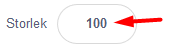

Nu har du sprajtar och en bakgrund. Dax att börja koda vykortet!

## 2: Fråga efter mottagarens namn

Vi börjar med första steget! Du ska få en av dina sprajtar att fråga vad kortets mottagare heter. 

1. Välj den sprajt du vill koda genom att klicka på den lilla figuren av din sprajt under scenen så den blir markerad. Vi har valt att kycklingen ska ställa frågan i vårt exempel. 

2. Från tema HÄNDELSER drar du in blocket **när GRÖNA FLAGGAN klickas på** och lägger det fritt på skriptytan för din sprajt. 

  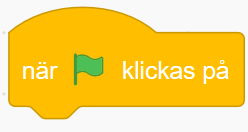

3. Från tema KÄNNA AV drar du in blocket **"Fråga** *"Vad heter du?"* **och vänta"** och sätter fast det under det gula blocket med gröna flaggan.

  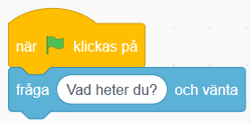
  
  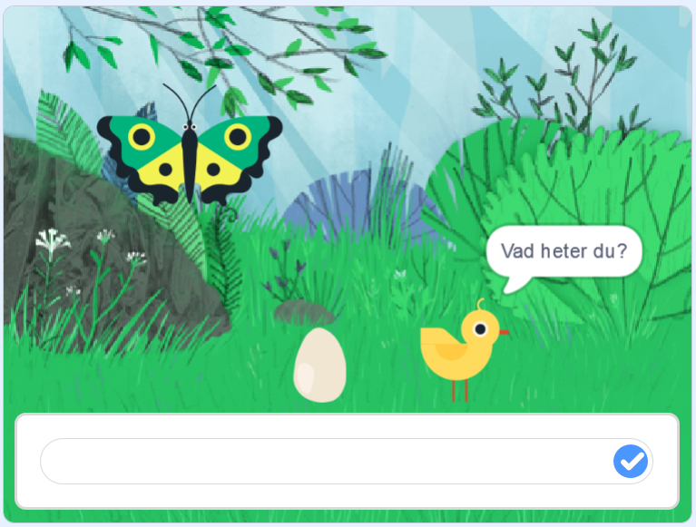

*När du har skrivit in ett namn i svarsrutan, klicka på den lilla blå ikonen till höger eller tryck på Enter-knappen på datorns tangentbord.
Du kommer att förstå senare vad namnet ska användas till!*

> **Testa ditt projekt!** Klicka på START-flaggan ovanför ditt projekt på scenen. Frågar sprajten "Vad heter du?"? Kan du skriva ett svar på frågan i rutan?

Dax att koda vidare!

## 3: Sprajten kan dansa!

Nu vill du ge sprajten några rörelser till musik. 

1. Gå till fliken LJUD i övre vänstra hörnet av Scratch.

  

2. Klicka sen på VÄLJ NYTT LJUD-ikonen i nedre vänstra hörnet. 

  

3. Välj nytt ljud från ljudbiblioteket. Lyssna på de olika ljuden genom att föra muspekare över den lila Play-symbolen på ljuden och klicka sedan på mittan på det du vill välja in i projektet!  

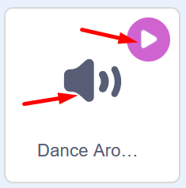

> **Tips!** Kategorin **Loopar** är bra om man letar efter en längre musikslinga istället för enskilda ljud. Klicka på knappen **Loopar** hgst upp för att få fram endast musikslingor. 
  

4. Klicka på fliken KOD i vänstra övre hörnet så kommer du tillbaka till kodsidan igen. Se till att din sprajt som ställer frågan är vald.

5. Nu ska vi skapa ett meddelande. Från tema HÄNDELSER drar du in blocket **skicka meddelande1**. Sätt in det under de andra blocken på skriptytan.

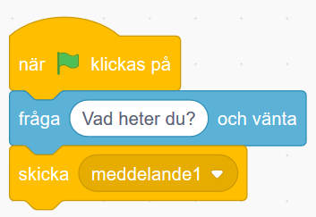

6. Nu ska vi skapa ett nytt meddelande. Klicka på den lilla pilen bredvid texten **meddelande** i blocket du just lade in. Klicka sen på  **Nytt meddelande** i menyn som kommer fram. 

7. Skriv in ordet **Dansa** i textrutan och klicka på OK. Nu ändras texten i blocket till **skicka Dansa**.

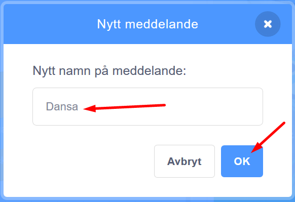

8. Nu lägger vi in musiken. Från tema **Ljud** drar du in blocket **Spela ljudet ____ tills färdigt**. (i blocket står namnet på det ljud du valde tidigare, i vårt exempel heter ljudet *Dance Around*. 

        
  
*Meddelandet "Dansa" kommer att bli viktigt om en stund. Kan du lista ut varför?*

9. Nu ska vi skapa ett nytt skript till vår sprajt som som vi lägger bredvid det första på skriptytan. Från tema HÄNDELSER drar du in blocket **När jag tar emot meddelande1**. Klicka på den lila pilen och välj meddelandet **Dansa** som du skapade tidigare.

  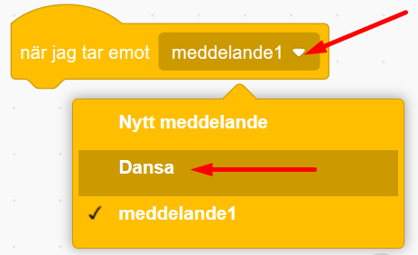
  
10. Nu ska lägga till en loop. Från tema KONTROLL drar du in blocket **för alltid**. Sätt fast det under det förra blocket du just drog in.

  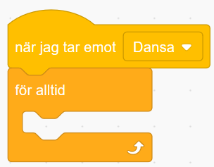
  
11. Nu ska vi få sprajten att byta klädslar, eller rörelsebilder som det är egentligen. Från tema UTSEENDE drar du in blocket **nästa klädsel** och lägger det inuti loopen, så det ser ut såhär:

  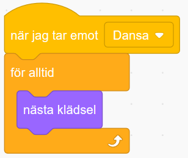
  
12. Från tema KONTROLL drar du in blocket **vänta 1 sekunder**. Lägg in det i loopen under blocket **nästa klädsel**. Klicka på variabeln **1** i blocket och ändra till **0.25** för kortare väntetid.

  

Nu finns det kod för att din sprajt ska kunna röra på sig och dansa runt till musik!

> **Testa ditt projekt!** Spelas ljudet efter att du har skrivit in ett namn som svar? Dansar sprajten lagom fort eller går det för snabbt eller långsamt? Testa att byta ut hur länge den ska vänta mellan klädselbyten.

## 4: Dansen är slut

För att sprajten ska sluta dansa när melodin är slut, måste du koda den att göra det. Det kan du fixa med ett nytt **meddelande** som berättar att dansen är slut, så att pingvinen kan säga en hälsning, exempelvis *"Ha det så bra!"* och sluta dansa.

1. Från tema HÄNDELSER drar du in blocket **skicka meddelande1**. Fäst blocket i det första större skriptet i sprajten, såhär:

  

2. Klicka på lilla pilen i meddelande-blocket och klicka på **Nytt meddelande**. Döp det till *Dansen slut*.

3. Nu ska vi skapa ett helt nytt skript bredvid de andra. Från tema HÄNDELSER drar du ut **När jag tar emot meddelande1** och lägger det fritt på skriptytan som ett nytt skript. Klicka på lilla pilen i blocket och byt till meddelandet *Dansen slut*. 

  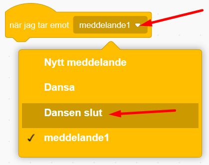

4. Från tema KONTROLL tar du blocket **stoppa alla**. Lägg det direkt under det förra blocket du lade in. Klicka på lilla pilen i blocket och byt till **andra skript i sprajten**.

  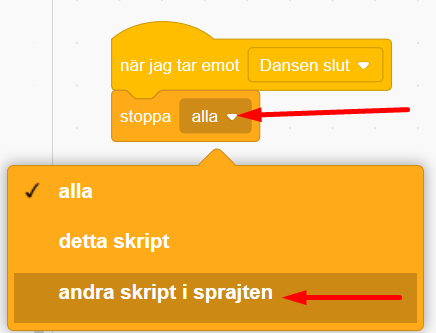

5. Nu ska vi koda så att sprajten säger något på slutet och lägger in namnet du skrev in i början. Från tema UTSEENDE drar du in blocket **säg Hej! i 2 sekunder**. Fäst det under det förra blocket du lade in, såhär:

  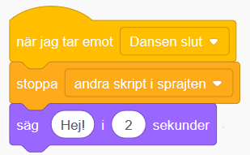
  
6. Nu ska vi lägga in en operator. Det är ett block som kan göra beräkningar i koden, exempelvis sätta ihop olika saker. Från tema OPERATORER drar du ut det gröna blocket som heter **sammanfoga äpple och banan**. Lägg det inuti den textbubblan i förra blocket där det står **Hej!**. 

  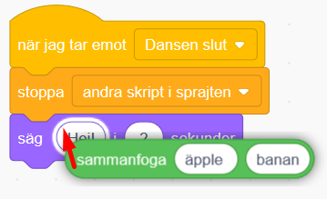  

> **Tips** **Svårt att lägga in operatorblocket?** Gör såhär: dra operatorblockets ena kant snett in över texten Hej! och när det visas en vit ring runt texten Hej! så kan du släppa. Då fäster operatorblocket inne i textcirkeln.

8. Klicka på texten **äpple** i det gröna blocket och skriv istället **Glad Påsk**. (lägg till ett mellanslag efter Glad påsk, så blir det mellanrum mellan Glad Påsk och nästa ord som sen ska komma.)

  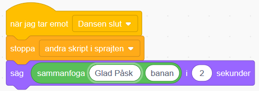  
  
7. Nu ska vi lägga in svaret på frågan *Vad heter du?* som sprajten ställde i början. Från tema KÄNNA AV drar du in lilla blocket **Svar** och lägger in det inuti gröna operatorns andra textcirkel, där det står *banan*. 

    
  

När du är färdig ska koden se ut såhär:

  

> **Testa ditt projekt!** Slutar sprajten att röra sig när melodin är slut? Säger pingvinen _"Glad Påsk"_ och det namn som du skrev in när kortet frågade _"Vad heter du?"_ i början?

Nu vill vi att alla sprajtar ska röra på sig och dansa loss! Vi kodar vidare!

## 5: Alla ska dansa!

Nu vill vi att de två andra sprajtarna ska dansa också! Du kommer att få se varför **skicka** och **ta emot meddelande** är så bra att ha. Det kallas för en FUNKTION och är en del av programmet som kan anropas flera gånger och från flera olika skript. Då börjar vi koda!

1. Nu ska du skapa två skript vardera på de andra sprajtarna i projektet. Klicka på de smp bilderna av sprajtarna under scenen med ditt projekt för att byta till ny figur att koda. Skapa skripten du ser i bilden nedan på vardera sprajt. 

  

2. Du bestämmer själv vad som ska hända när sprajtarna **tar emot** meddelandet *Dansa* och meddelandet *Dansen slut*. Sprajtarna kan röra sig genom att byta klädslar, kanske glida till ny position eller säga något med pratbubbla de med? Testa dig fram.
Såhär kan till exempel ett skript se ut om du vill att något ska glida till olika slumpvisa ställen. 

  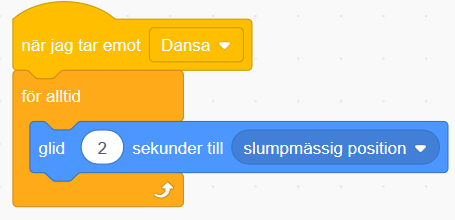

> **Testa ditt projekt!** Dansar alla sprajtar nu? Dansar de i rätt hastighet? Testa att ändra antalet sekunder som de väntar innan byte av klädsel.

## 6: Pynta vykortet

Du har dansande sprajtar och musik, men det finns alltid plats för lite mer bling och pynt på vykortet! Kanske ska en annan sprajt dyka upp när musiken tar slut, en snöflinga, en stjärna eller annan figur? Du kan också göra fint med bakgrunden genom att exempelvis byta färg på scenen i takt med musiken eller lägga in stämningsmusik.

1. Börja med en sprajt som ska vara osynlig i början men dyka upp på slutet, exempelvis ett hjärta. Lägg då till sprajten **Heart** från biblioteket och placera den där du vill ha den på scenen.

  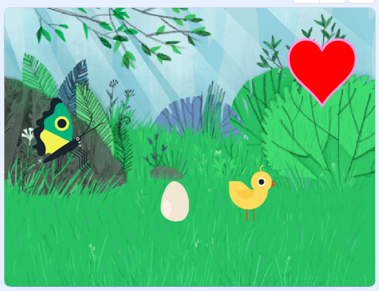

2. Nu ska vi koda när sprajten ska vara gömd och när den ska synas. Från tema HÄNDELSER drar du ut blocket **när GRÖNA FLAGGAN klickas på** och lägger den på den nya sprajtens skriptyta. 

3. Från tema UTSEENDE drar du ut blocket **göm** och sätter fast den under det blocket med glrna flaggan. 

  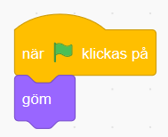

4. Från tema HÄNDELSER drar du in blocket **när jag tar emot Dansa** (alltså ett meddelande). Lägg det fritt på sprajtens skriptyta. 

  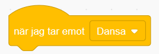
  
5. Från tema UTSEENDE drar du in lilla blocket **visa** och fäster det under förra blocket. 

5. Från tema KONTROLL drar du ut blocket **för alltid**, som alltså är en loop. Föst det under förra blocket du drog in. 

6. Från tema UTSEENDE drar du in blocket **nästa klädsel** och lägger det inuti loopen. När du är färdig ska skriptet se ut såhär:

  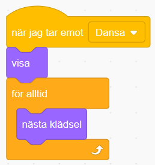
  
7. Från tema KONTROLL drar du in blocket **vänta 1 sekunder**. Lägg det längst ned innanför loopen. Klicka på variabeln **1** och ändra till **0.25**. 

  
  
7. Om du vill att sprajten ska försvinna igen när musiken tar slut drar du från tema HÄNDELSER in blocket **när jag tar emot Dansa**. Lägg det fritt på skriptytan bredvid de andra skripten. Klicka på lilla pilen i blocket och byt medelandet till **Dansen slut**. 

  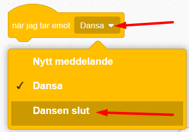

8. Från tema UTSEENDE drar du sen in blocket **göm** och fäst det direkt under blocket du just drog in. Då ser skriptet ut såhär. 

  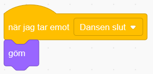

> **Testa koden!** Fungerar projektet som du vill? Gömmer sig och visar sig sprajten som den ska? Tips: om något inte fungerar, gå igenom koden och läs den högt så kan man enklare hitta felet. Kontrollera att du valt rätt meddelande i de olika skripten.

9. Nu ska vi se till att själva bakgrunden får en snygg effekt! Klicka på lilla bilden av din bakgrund där det står BAKGRUNDER till vänster under scenen med ditt projekt. Nu kommer skriptytan för din bakgrund fram, där du kan lägga in kod för den med.

  

10. Från tema HÄNDELSER drar du in två meddelandeblock med **när jag tar emot Dansa** Lägg dem bredvid varandra på bakgrundens tomma skriptyta. Ändra så att ett block har meddelandet **Dansa** och det andra har meddelandet **Dansen slut**, så det ser ut såhär:

  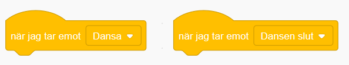
  
11. Från tema KONTROLL drar du in blocket **för alltid**, alltså en loop, och fäster det under blocket **när jag tar emot Dansa**.

12. Från tema UTSEENDE drar du in blocket **ändra färgeffekten med 25** och lägger den inuti loopen.

13. Från tema KONTROLL drar du in blocket **vänta 1 sekunder**. Lägg det nederst inuti loopen. Klicka på variablen **1** i blocket och skriv **2** istället. 

När du är färdig ska skriptet se ut såhär:

  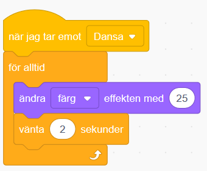

14. Från tema KONTROLL drar du in skriptet **stoppa alla**. Fäst det under blocket **när jag tar emot Dansen slut**. Klicka på lilla pilen i blocket och ändra till **stoppa andra skript i sprajten**. 

  

> **Testa ditt projekt!** Ändrar bakgrundsbilden på scenen färg? Slutar den ändra färg när musiken är slut?

## Färdig!
Grattis, nu har du gjort klart uppgiften.

**Glöm inte att spara ditt projekt!** Döp det gärna till uppgiftens namn så att du enkelt kan hitta den igen.

> **Testa ditt projekt**  
Visa gärna någon det som du har gjort och låt dem testa. Tryck på DELA för att andra ska kunna hitta spelet på Scratch. Gå ut till projektsidan och låt någon annan testa spelet!

## Utmaning
Har du tid över? Här kommer en utmaning för dig som vill fortsätta.

### Unika sprajtar
Kan du ändra i skripten för dina sprajtar så att de blir mer olika och roliga? Testa till exempel att:

* Ändra färgeffekt under dansen

* Ändra storlek på sprajten

* Lägg till rotation så att de vrider på sig

* Ändra hur fort dom dansar

Kan du hitta fler sätt att göra dom mer unika?

## Frågeställningar

* Hur är denna uppgift en berättelse?  

* Vad för block kan du använda för att få spelaren att ge ett svar på en fråga?

* Vad är ett meddelande?

* Vad kan du använda ett meddelande till?
