# Hunden och stjärnan - del 1
I spelet Hunden och Stjärnan skapar du en busig hund som springer loss på jakt efter stjärnor och bollar i rymden för att få poäng - men akta dig för rymdblixtarna!
Instruktionen till ur du skapar spelet är uppdelad i 3 delar, här följer del 1.

Testa ett exempelspel av Hunden och stjärnan - del 1. Klicka på bilden nedan. Starta exempelspelet genom att klicka på gröna flaggan. <a href="https://scratch.mit.edu/projects/631259076" target="_blank"> 
  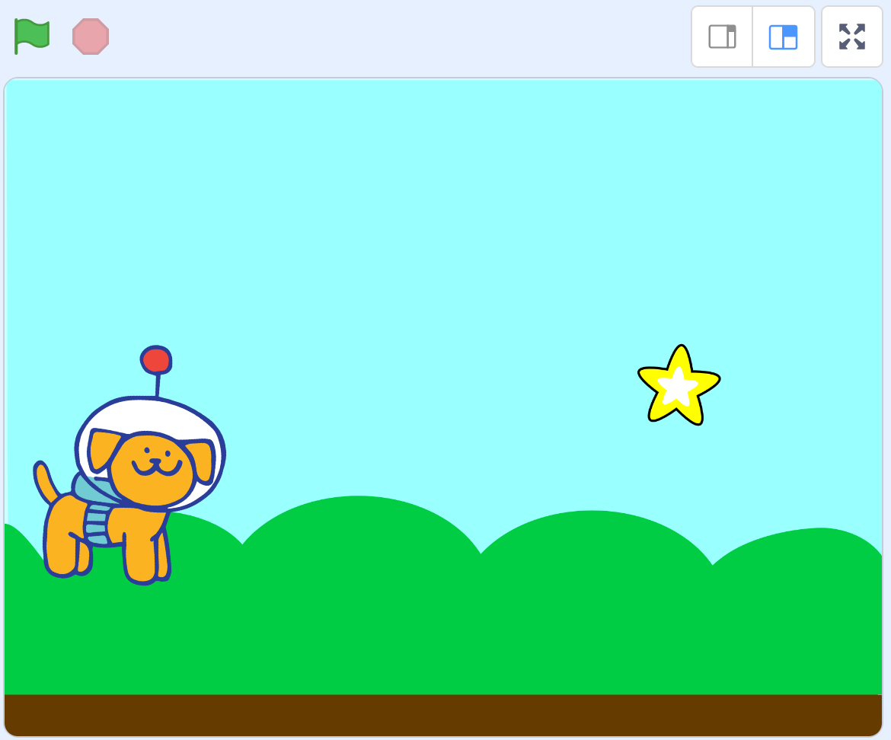</a>

> **HUR KODAR JAG?** 
 
Följ denna instruktion steg för steg och koda ditt projekt i verktyget Scratch. <a href="https://scratch.mit.edu" target="_blank"> Klicka här för att öppna Scratch i en ny flik.</a> I Scratch klickar du på Skapa för att börja. Logga gärna in på Scratch så kan du även spara och dela ditt projekt. Det är gratis att skaffa ett konto.
 

Dax att börja koda! Klicka på steg 1 nedan för att gå vidare i instruktionen.

## 1: Välj en hund som sprajt

I verktyget Scratch skapar du projekt med så kallade sprajtar. En **sprajt** är en figur eller andra saker du väljer att lägga in i ditt spel eller projekt. Sprajtar kan se ut hur som helst och kan styras runt på scenen med hjälp av kodblocken i Scratch. 

När du öppnar nytt projekt i Scratch visas först en katt som sprajt på en vit bakgrund. Nu ska vi byta ut katten mot en rymdhund, så börja med att ta bort katten och välja en ny sprajt istället. Gör såhär:

1. Tryck på **soptunnan på lilla rutan med kattfiguren** under scenen, så försvinner katten - du har nu tagit bort den ur projektet.

    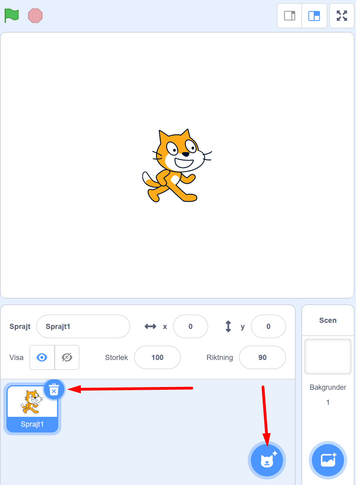 

2. Nu vill du lägga till en hund istället. Tryck på knappen för **NY SPRAJT** som finns inunder den vita bakgrunden:

    

En katalog med massa sprajt-figurer dyker upp. I menyn högst upp finns en kategori som heter **"Djur"**, tryck på den. Bland alla djurbilder hittar du en hund som ser ut som bilden här nedan. Tryck på hunden så läggs den till i ditt projekt.

    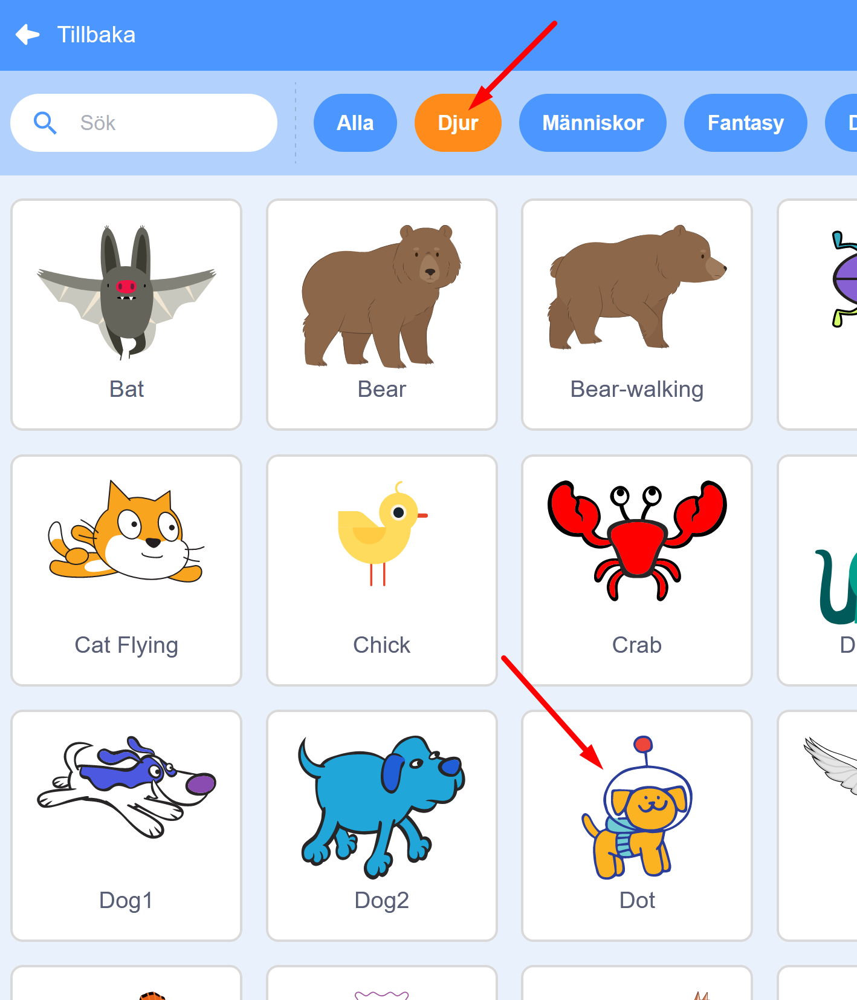
    
3. Nu ska vi lägga till en ny bakgrund i projektet. Klicka på knappen längst ned till höger som heter **"Välj en bakgrund"**.

    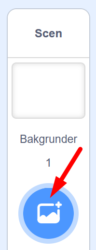

Nu har vi en bakgrund och en sprajt. Det är dagx att programmera med kodblocken så att hunden får rörelse!
Klicka dig vidare till kapitel 2.

## 2: Få hunden att röra sig

Hunden ska röra på sig. Rörelse skapar du med kodblocken i Scratch. Vi ska koda så att hunden rör sig på scenen och följer efter muspekaren (eller ditt finger om du har touch screen).

1. Hunden ska ha en startposition som den alltid ställer sig på när vi ska starta vårt spel. Bestäm hundens startposition genom att ta tag i hunden på scenens yta och dra den dit du vill att den ska stå när spelet börjar.

    

2. Ovanför scenen med hunden finns en grön flagga och en röd knapp. Det är START- och STOPP-knappar för spelet du bygger.

  
  
  Om du provar att klicka på den gröna start-flaggan nu, så händer ingenting, hunden rör sig inte. Det är för att vi inte har lagt in kodblock än som talar om för hunden vad den ska göra. Så nu ska vi skapa kod som kopplar gröna startflaggan till hunden.

3. Se först till att din sprajt hunden är aktiverad. Klicka på den lilla bilden av din hundsprajt som finns under scenen, så att den markeras med en blå ram runt (om den inte redan har det). 

    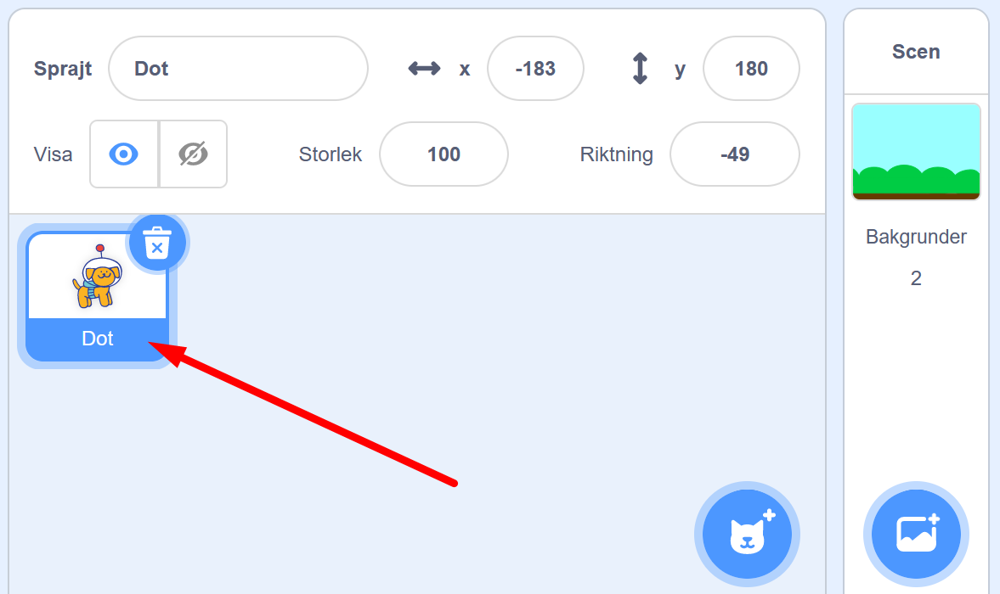

4. Längst till vänster i Scratch hittar du olika färgglada rubriker med en massa kodblock bredvid som ser ut som pusselbitar. Klicka på den gula rubriken som heter **HÄNDELSER** och välj översta pusselbiten med en grön flagga på som är blocket för: **"när START (gröna flaggan) klickas på"**. Ta tag i och dra detta block till skriptytan (den stora tomma, vita ytan i mitten av Scratch) och släpp den där. 

  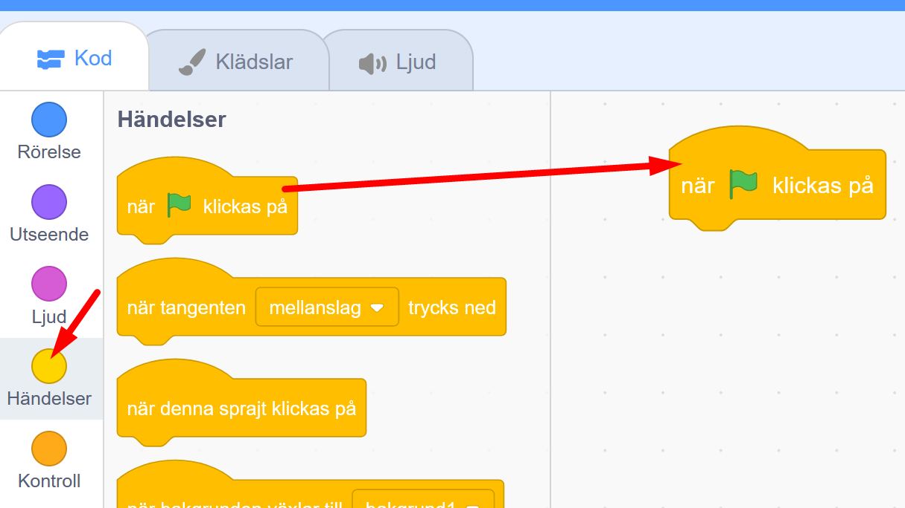

5. Välj sedan den översta mörkblå rubriken som heter **RÖRELSE** och välj blocket som heter **"gå till x:__ , y:__"**. Detta block gör att din hund alltid startar på samma startposition. Lägg detta block direkt under det första blocket med den gröna flaggan på skriptytan och koppla ihop dem som pusselbitar.

  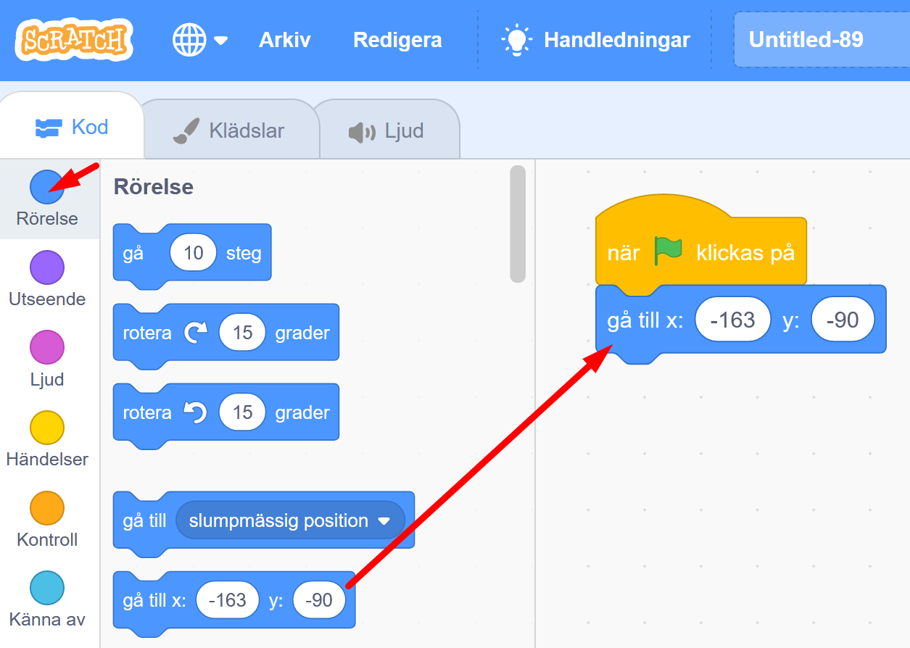
  
6. Nu ska vi lägga till kod som får hunden att röra sig. Under **RÖRELSE** finns blocket **"gå 10 steg"**. Dra in det och fäst det under de andra blocken.

  

> **Testa koden!** Tryck på gröna startflaggan ovanför scenen. Flyttar sig hunden lite åt höger? Bra! Nu ska vi koda så att hunden rör sig framåt om och om igen för alltid när spelet startats. Vi kodar vi vidare.

## 3: Styra runt hunden 
Nu vill vi sätta mer fart på hunden - och sedan styra runt den.

1. Klicka på orangea rubriken **KONTROLL** och hitta kodblocket som heter **"för alltid"**. Dra in det på kodytan. Detta block skapar en LOOP, som repeterar andra kodblock så att de utförs om och om igen, för alltid.

  

Nu ska vi pussla om i koden så att blocket **"Gå 10 steg"** lägg sin i blocket **"för alltid"** och sen sätta ihop allt igen. Se bilden här under:

  
  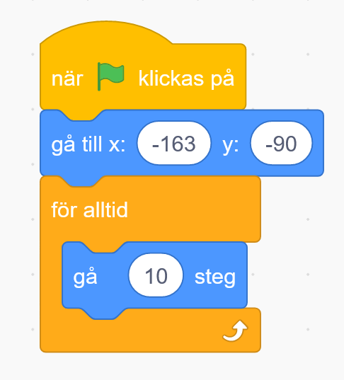

> **Testa koden!** Tryck på START-flaggan ovanför ditt spel. Nu blir det fart på hunden! Tryck på startflaggan igen, börjar hunden om från sin startposition?. Stoppa hunden (och koden) med den röda knappen.

Nu ska vi få hunden att kunna åka runt i spelet.

2. Vi vill att den ska kunna följa muspekaren (eller ditt finger om du har en touch screen) när du drar den över scenen. Vi lägger till ett kodblock till.

Under **RÖRELSE** väljer du blocket som heter **"peka mot muspekare"**. Lägg in det i kodblocket för din **"för alltid"**-loop, så det ser ut som i bilden nedan:

  

> **Testa koden!** Tryck på START-flaggan och rör din muspekare (eller fingret om du har touch screen) över skärmen. Hunden jagar efter och åker runt. Stoppa koden och hunden med den röda stoppknappen.

## 4: Fixa hastighet och startriktning

1. Springer hunden runt för fort? Du kan sänka hastigheten genom att ändra till en lägre siffra i blocket **"Gå 10 steg"**. Klicka på siffran 10 och skriv istället in förslagsvis siffran 5, så går hunden hälften så fort. 

  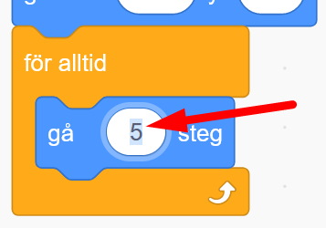

2. Vill du att hunden alltid startar  märker du att hunden behåller den riktning som den hade när du avslutade spelet sist. Du kan bestämma vilket håll hunden ska titta åt när spelet startar.

1. Under **RÖRELSE** väljer du blocket som heter **"peka i 90 riktning"**. Lägg in det direkt under startblocket **"När GRÖN FLAGGA klickas på"**.

  

## 7: Känna av när skalbaggen åker av banan

Nästa steg är att skapa ett skript som gör att skalbaggen känner av när den hamnar utanför banan. Hur ska den kunna veta det? Det kan du lösa med ett skript som känner av vilken färg som skalbaggen rör sig över. Du behöver skapa ett VILLKOR för skalbaggen, som säger att: "**OM** skalbaggen rör vid färgen som finns utanför banan betyder det att den har åkt av banan, och **DÅ** ska spelet ta slut", alltså att spelet blir Game Over!

Gör såhär:

13. Under **KONTROLL** finns blocket "**om <> då**", dra in det till scriptytan, lägg det fritt någonstans bredvid de övriga scripten. Det här blocket säger att **OM** det som står inom **<>** händer, **DÅ** ska något annat direkt hända. Till exempel: Om skalbaggen <rör färgen grön>, säg Game Over i 2 sekunder.

  
  
14. Under **KÄNNA AV** finns blocket "**Rör färgen <> ?"**. 
Dra in detta block till hålet **<>** inom blocket "**om <> då**" som du lagt på scriptytan. 

  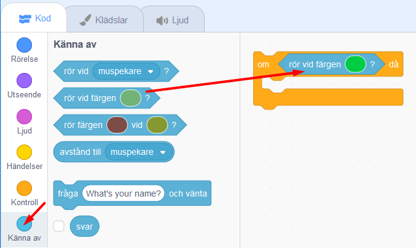

Kolla att lilla ovala cirkeln med färg till höger om texten **"rör färgen"** i ditt script är exakt samma färg som spelets bakgrundsfärg. Byt annars genom att klicka med muspekaren på den lilla färgcirkeln och välj den lilla symbolen med en pimpett längst ned. Klicka sedan med den på spelets bakgrundsfärg, så blir det rätt färg i kodblockets cirkel. Nu har du talat om för datorn att något ska hända när skalbaggen rör vid denna färg.

  

15. Till sist skapar du ett skript för att spelet ska säga att det är Game Over om skalbaggen nuddar färgen utanför banan. Under rubriken  **UTSEENDE** väljer du blocket **"säg Hej! i 2 sekunder"** och drar in detta block innanför **"om <**"**Rör färgen grön?> då"**". Klicka sedan på ordet "Hej!" och ändra texten till det du vill skalbaggen ska säga - till exempel Game Over.

  

> Testa ditt spel! Händer det något när skalbaggen nuddar färgen utanför banan? Om inte, vad tror du att det kan bero på? 

## 8: Göra klart skriptet

Något saknas för att koden ska fungera! Tänk efter: **När** vill du att datorn ska känna av om skalbaggen rör färgen utanför banan? Det behöver ju göras **efter varje steg** skalbaggen tar, för att inte missa om den springer av banan. Datorn måste kolla **exakt vart skalbaggen befinner sig** "om och om igen", hela tiden. Därför måste du koppla ihop skriptet som känner av färgen utanför banan med det som får skalbaggen att röra sig. 

Gör såhär:

16. Lägg skriptet som känner av färgen utanför banan, **inuti** din **"för alltid"**-loop. Nu kollar datorn av om skalbaggen ramlat av banan **varje gång** innan den tar nästa steg framåt igen. Sen kollar den igen - har jag ramlat av banan? Om inte, spring vidare, kolla, spring...

  

17. När spelet blir Game Over ska ju allt ta slut och skalbaggen stoppa. Under **KONTROLL** finns blocket **"stoppa alla"**. Dra in detta block till scriptfältet. Klicka på lilla pilen i blocket och byt till **"stoppa detta script"**.

  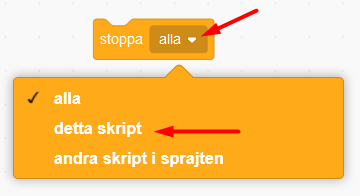

Lägg in detta block längst ned inuti skriptet med **"om <> då"**. På så sätt avslutas spelet och skalbaggen stannar om den hamnar utanför banan och blir Game Over.

> Är det svårt att veta hur alla blocken ska läggas in i skriptet? På nästa sida kan du se en bild på hur det färdiga skriptet ska se ut. 

## Färdig!
Grattis, nu har du skapat ditt första spel! Det färdiga skriptet i sin helhet borde se ut ungefär så här - om du följt instruktionerna:

 

**Glöm inte att spara ditt projekt - och att döpa det!** Döp det gärna till uppgiftens namn Bug Race - eller hitta på ett eget namn, så att du enkelt kan hitta det igen. Du skriver in namn på spelet högt upp ovanför projektet, där det nu står "Scratchprojekt". Spara sedan, men du måste vara inloggad för att kunna spara.

> **Testa ditt projekt**  
Visa gärna någon ditt spel och låt dem testa. Om du vill, tryck på knappen DELA som du finner överst så kan andra också hitta spelet på Scratch sajt och testa det.

> **Viktigt om du delar ditt projekt:** Tänk på att delade projekt kan ses, testas och remixas (omskapas) av alla som vill på Scratch sajt. Det är viktigt när du sparar och delar att projektet inte innhåller information, bilder eller ljud du inte vill sprida till andra.

## Utmaning
Saknas något? Hur skulle du vilja utveckla spelet?

Tips på hur du kan bygga vidare på Bug Race hittar du i uppgiften som heter <a href="https://www.kodboken.se/start/skapa-spel/uppgifter-i-scratch/bug-race-tillagg?chpt=0" target="_blank"> Bug Race - Tillägg</a>.
Där kan du bland annat skapa Bug Race för två spelare samtidigt och göra en mjukare styrning av sprajtarna.

## Frågeställningar

* Vad är en sprajt?

* Vad är en loop?

* Varför kan det vara bra att använda en loop?

* Vad är ett INIT-Script eller Start-Script?

* Vad händer i spelet Bug Race om sprajten har samma färg som bakgrunden?
