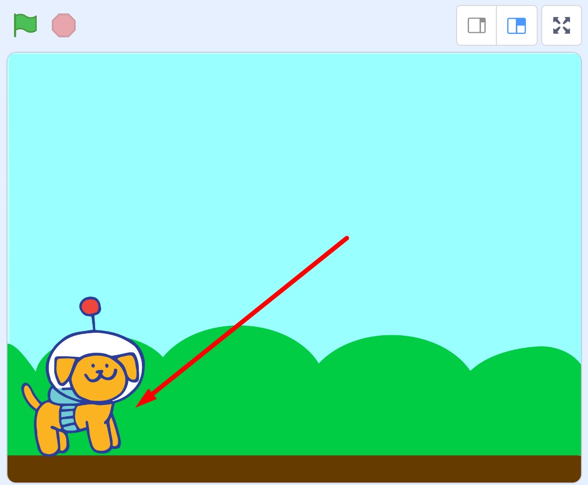
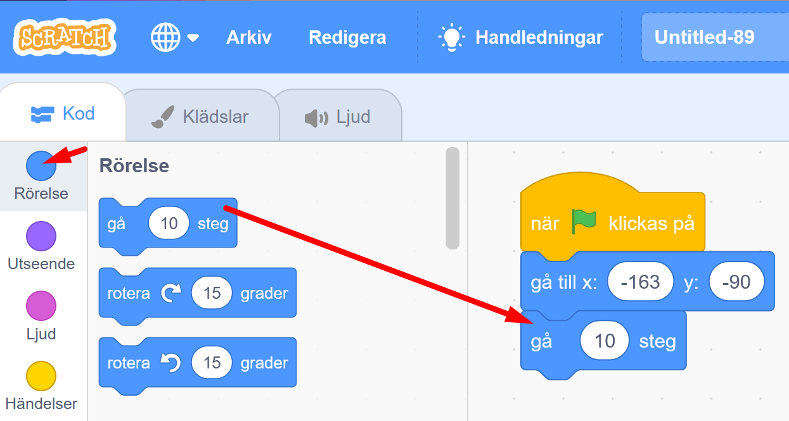

# Rymdhunden - del 1
I spelet **Rymdhunden** skapar du en busig hund som springer loss på jakt efter stjärnor och bollar i rymden för att få poäng - men akta dig för rymdblixtarna!
Instruktionen till hur du skapar spelet är uppdelad i 3 delar, här följer del 1.

Testa ett exempelspel av **Rymdhunden - del 1**. Klicka på bilden nedan och starta exempelspelet genom att klicka på gröna flaggan. Hunden föjer efter muspekaren (eller ditt finger om du har pekskärm). 

> **HUR KODAR JAG?** 
 
Följ denna instruktion steg för steg och koda ditt projekt i verktyget Scratch. <a href="https://scratch.mit.edu" target="_blank"> Klicka här för att öppna Scratch i en ny flik.</a> I Scratch klickar du på Skapa för att börja. Logga gärna in på Scratch så kan du även spara och dela ditt projekt. Det är gratis att skaffa ett konto.
 

Dax att börja koda! Klicka på steg 1 nedan för att gå vidare i instruktionen.

## 1: Välj en hund som figur

I verktyget Scratch skapar du projekt med figurer och bakgrunder. I Scratch kallas figurer för **sprajtar**. Sprajtar kan se ut hur som helst och de kan programmeras att röra på sig och styras runt på scenen med hjälp av kodblocken i Scratch. 

När du öppnar Scratch finns alltid en katt som sprajt. Nu ska vi byta ut katten mot en ny sprajt - en rymdhund. Gör såhär:

1. Ta först bort katten ur projektet genom att klicka på **soptunnan på lilla rutan med kattfiguren** under scenen. Lägg sen till en en ny sprajt-figur genom att klicka på den blå knappen **Välj en sprajt**, i nedre högra hörnet. Se bilden nedan.

     

Nu öppnas ett bibliotek med många olika sprajt-figurer. Leta fram en sprajt som ser ut som hunden i bilden nedan. (Du kan även sortera på kategorin Djur.) Tryck på hundbilden så läggs den till i ditt projekt.

     
    
3. Nu ska vi lägga till en ny bakgrund i projektet. Klicka på knappen längst ned till höger som heter **"Välj en bakgrund"**. Välj en bakgrund du gillar och tryck på den för att lägga till bakgrunden i projektet.

    

Nu har du en bakgrund och en hundsprajt. Det är dags att programmera med kodblocken så att hunden får rörelse! Vi är redo att börja programmera.
Klicka dig vidare till kapitel 2.

## 2: Få hunden att röra sig

Vi ska koda så att hunden rör sig på scenens bakgrund och följer efter muspekaren (eller ditt finger om du har pekskärm). Rörelse skapar du med kodblocken i Scratch. 

Ser du knapparna ovanför scenen med en grön flagga och en röd knapp? Det är spelets startknapp och stoppknapp. 

    

Just nu händer ingenting om du trycker på startflaggan. Det finns nämligen ingen kod som bestämmer vad hunden ska göra om du startar spelet. Vi måste programmera in det. Gör såhär:

1.  Längst till vänster i Scratch hittar du olika färgglada rubriker med en massa kodblock bredvid som ser ut som pusselbitar. Klicka på den gula rubriken som heter **HÄNDELSER** och välj översta pusselbiten med en grön flagga på som är blocket för: **"när START (gröna flaggan) klickas på"**. Dra detta block till skriptytan (den stora tomma, vita ytan i mitten av Scratch) och släpp den där. 

  
  
2. Nu har du skapat en startknapp. Då ska du lägga in en startposition för hunden, en plats där hunden alltid ska starta på när du börjar spelet. Dra hunden dit du vill att den ska stå på scenen när spelet börjar.

    

3. Titta på kodblocken. Välj nu den översta mörkblå rubriken som heter **RÖRELSE** och leta fram blocket som heter **"gå till x:__ , y:__"**. Detta block gör att din hund alltid startar på samma startposition. Dra in blocket till skriptytan och lägg det direkt under det första blocket med den gröna flaggan, så att de kopplas ihop som pusselbitar.

  
  
4. Nu ska vi lägga till kod som får hunden att röra sig framåt. Under rubriken **RÖRELSE** finns blocket **"gå 10 steg"**. Dra in blocket och fäst det under de andra blocken på skriptytan.

  

> **Testa koden!** Tryck på gröna startflaggan ovanför scenen. Flyttar sig hunden lite åt höger? Bra! Vad händer om du trycker flera gånget på startflaggan? Nu ska vi koda så att hunden rör sig framåt om och om igen för alltid när spelet startats. Vi kodar vi vidare.

## 3: Styra runt hunden 
Nu vill vi sätta mer fart på hunden - och sedan styra runt den.

1. Klicka på den orangea rubriken **KONTROLL** och hitta kodblocket som heter **"för alltid"**. Dra in blocket på skriptytan och lägg det löst bredvid de andra blocken. Detta block skapar en LOOP, som repeterar andra kodblock så att de utförs om och om igen, för alltid.

  

2. Nu ska vi pussla om i koden så att blocket **"Gå 10 steg"** läggs inuti i blocket **"för alltid"**. Sen ska vi sätta ihop alla kodbitar igen. Gör så att det blir som i bilden under:

  
  

> **Testa koden!** Tryck på START-flaggan ovanför ditt spel. Nu blir det fart på hunden! För alltid-loopen repeterar hundens steg, om och om igen, så den springer framåt hela tiden. Tryck på startflaggan igen, börjar hunden om från sin startposition?. Stoppa hunden (och koden) med den röda knappen.

3. Nu ska vi få hunden att kunna åka runt i spelet. Vi vill att den ska följa efter muspekaren när du drar den över scenen (eller följa efter ditt finger om du har en pekskärm). Under mörkblå rubriken **RÖRELSE** väljer du blocket som heter **"peka mot muspekare"**. Lägg in det i kodblocket med din **"för alltid"**-loop, så det ser ut som i bilden nedan:

  

> **Testa koden!** Tryck på START-flaggan och rör din muspekare (eller fingret om du har pekskärm) över skärmen. Hunden jagar efter och åker runt. Stoppa koden och hunden med den röda stoppknappen.

Nu springer hunden runt på scenen, men det går lite fort. Vi kodar vidare.

## 4: Fixa hastighet och startriktning

1. Springer hunden runt för fort? Du kan sänka hastigheten genom att ändra till en lägre siffra i blå blocket **"Gå 10 steg"**. Klicka på siffran **10** i kodblocket och skriv istället in förslagsvis siffran 5, så går hunden hälften så fort. 

  

2. Du kan koda så att din hund alltid börjar springa i samma riktning när du startar om spelet. Under mörkblå rubriken **RÖRELSE** väljer du blocket som heter **"peka i riktning 90"**. Lägg in blocket direkt under startblocket **"När GRÖN FLAGGA klickas på"** på skriptytan.

  
  
> **Testa koden!** Tryck på START-flaggan och rör din muspekare över scenen. Testa att starta om flera gånger - springer hunden iväg i rätt riktning varje gång? 

Tips: Om du vill ändra riktning kan du klicka på siffran 90 i blå kodblocket du just lade in för att ändra. 

  

## 7: Känna av när skalbaggen åker av banan

Nästa steg är att skapa ett skript som gör att skalbaggen känner av när den hamnar utanför banan. Hur ska den kunna veta det? Det kan du lösa med ett skript som känner av vilken färg som skalbaggen rör sig över. Du behöver skapa ett VILLKOR för skalbaggen, som säger att: "**OM** skalbaggen rör vid färgen som finns utanför banan betyder det att den har åkt av banan, och **DÅ** ska spelet ta slut", alltså att spelet blir Game Over!

Gör såhär:

13. Under **KONTROLL** finns blocket "**om <> då**", dra in det till scriptytan, lägg det fritt någonstans bredvid de övriga scripten. Det här blocket säger att **OM** det som står inom **<>** händer, **DÅ** ska något annat direkt hända. Till exempel: Om skalbaggen <rör färgen grön>, säg Game Over i 2 sekunder.

  
  
14. Under **KÄNNA AV** finns blocket "**Rör färgen <> ?"**.  
Dra in detta block till hålet **<>** inom blocket "**om <> då**" som du lagt på scriptytan. 

  

Kolla att lilla ovala cirkeln med färg till höger om texten **"rör färgen"** i ditt script är exakt samma färg som spelets bakgrundsfärg. Byt annars genom att klicka med muspekaren på den lilla färgcirkeln och välj den lilla symbolen med en pimpett längst ned. Klicka sedan med den på spelets bakgrundsfärg, så blir det rätt färg i kodblockets cirkel. Nu har du talat om för datorn att något ska hända när skalbaggen rör vid denna färg.

  

15. Till sist skapar du ett skript för att spelet ska säga att det är Game Over om skalbaggen nuddar färgen utanför banan. Under rubriken  **UTSEENDE** väljer du blocket **"säg Hej! i 2 sekunder"** och drar in detta block innanför **"om <**"**Rör färgen grön?> då"**". Klicka sedan på ordet "Hej!" och ändra texten till det du vill skalbaggen ska säga - till exempel Game Over.

  

> Testa ditt spel! Händer det något när skalbaggen nuddar färgen utanför banan? Om inte, vad tror du att det kan bero på? 

## 8: Göra klart skriptet

Något saknas för att koden ska fungera! Tänk efter: **När** vill du att datorn ska känna av om skalbaggen rör färgen utanför banan? Det behöver ju göras **efter varje steg** skalbaggen tar, för att inte missa om den springer av banan. Datorn måste kolla **exakt vart skalbaggen befinner sig** "om och om igen", hela tiden. Därför måste du koppla ihop skriptet som känner av färgen utanför banan med det som får skalbaggen att röra sig. 

Gör såhär:

16. Lägg skriptet som känner av färgen utanför banan, **inuti** din **"för alltid"**-loop. Nu kollar datorn av om skalbaggen ramlat av banan **varje gång** innan den tar nästa steg framåt igen. Sen kollar den igen - har jag ramlat av banan? Om inte, spring vidare, kolla, spring...

  

17. När spelet blir Game Over ska ju allt ta slut och skalbaggen stoppa. Under **KONTROLL** finns blocket **"stoppa alla"**. Dra in detta block till scriptfältet. Klicka på lilla pilen i blocket och byt till **"stoppa detta script"**.

  

Lägg in detta block längst ned inuti skriptet med **"om <> då"**. På så sätt avslutas spelet och skalbaggen stannar om den hamnar utanför banan och blir Game Over.

> Är det svårt att veta hur alla blocken ska läggas in i skriptet? På nästa sida kan du se en bild på hur det färdiga skriptet ska se ut. 

## Färdig!
Grattis, nu har du skapat ditt första spel! Det färdiga skriptet i sin helhet borde se ut ungefär så här - om du följt instruktionerna:

 

**Glöm inte att spara ditt projekt - och att döpa det!** Döp det gärna till uppgiftens namn Bug Race - eller hitta på ett eget namn, så att du enkelt kan hitta det igen. Du skriver in namn på spelet högt upp ovanför projektet, där det nu står "Scratchprojekt". Spara sedan, men du måste vara inloggad för att kunna spara.

> **Testa ditt projekt**  
Visa gärna någon ditt spel och låt dem testa. Om du vill, tryck på knappen DELA som du finner överst så kan andra också hitta spelet på Scratch sajt och testa det.

> **Viktigt om du delar ditt projekt:** Tänk på att delade projekt kan ses, testas och remixas (omskapas) av alla som vill på Scratch sajt. Det är viktigt när du sparar och delar att projektet inte innhåller information, bilder eller ljud du inte vill sprida till andra.

## Utmaning
Saknas något? Hur skulle du vilja utveckla spelet?

Tips på hur du kan bygga vidare på Bug Race hittar du i uppgiften som heter <a href="https://www.kodboken.se/start/skapa-spel/uppgifter-i-scratch/bug-race-tillagg?chpt=0" target="_blank"> Bug Race - Tillägg</a>.
Där kan du bland annat skapa Bug Race för två spelare samtidigt och göra en mjukare styrning av sprajtarna.

## Frågeställningar

* Vad är en sprajt?

* Vad är en loop?

* Varför kan det vara bra att använda en loop?

* Vad är ett INIT-Script eller Start-Script?

* Vad händer i spelet Bug Race om sprajten har samma färg som bakgrunden?
