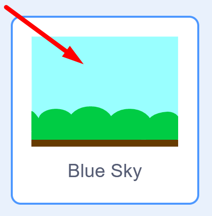
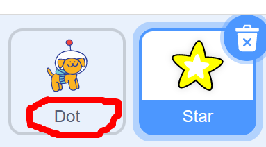
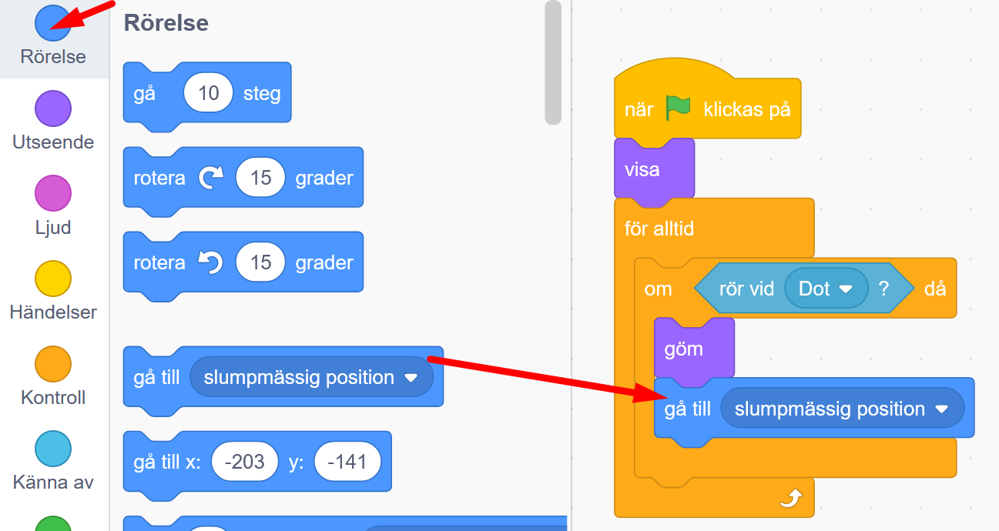

# Rymdhunden - del 1
I spelet **Rymdhunden** skapar du en busig hund som springer loss på jakt efter stjärnor och bollar i rymden för att få poäng - men akta dig för rymdblixtarna!
Instruktionen till hur du skapar spelet är uppdelad i 3 delar, här följer del 1.

Testa ett exempelspel av **Rymdhunden - del 1**. Klicka på bilden nedan och starta exempelspelet genom att klicka på gröna flaggan. Hunden föjer efter muspekaren (eller ditt finger om du har pekskärm). 

> **HUR KODAR JAG?** 
 
Följ denna instruktion steg för steg och koda ditt projekt i verktyget Scratch. <a href="https://scratch.mit.edu" target="_blank"> Klicka här för att öppna Scratch i en ny flik.</a> I Scratch klickar du på Skapa för att börja. Logga gärna in på Scratch så kan du även spara och dela ditt projekt. Det är gratis att skaffa ett konto.
 

Dax att börja koda! Klicka på steg 1 nedan för att gå vidare i instruktionen.

## 1: Välj en hund som figur

I verktyget Scratch skapar du projekt med figurer och bakgrunder. I Scratch kallas figurer för **sprajtar**. Sprajtar kan se ut hur som helst och de kan programmeras att röra på sig och styras runt på scenen med hjälp av kodblocken i Scratch. 

När du öppnar Scratch finns alltid en katt som sprajt. Nu ska vi byta ut katten mot en ny sprajt - en rymdhund. Gör såhär:

1. Ta först bort katten ur projektet genom att klicka på **soptunnan på lilla rutan med kattfiguren** under scenen. Lägg sen till en en ny sprajt-figur genom att klicka på den blå knappen **Välj en sprajt**, i nedre högra hörnet. Se bilden nedan.

   
    
2. Nu öppnas ett bibliotek med många olika sprajt-figurer. Leta fram en sprajt som ser ut som hunden i bilden nedan - den heter **Dot**. Tryck på bilden av hundsprajten så läggs den till i ditt projekt.

  
    
3. Nu ska vi lägga till en ny bakgrund i projektet. Klicka på knappen längst ned till höger som heter **"Välj en bakgrund"**. Hitta en bakgrund du gillar och tryck på den för att lägga till i ditt projektet. Vi har valt bakgrunden som heter **Blue Sky**.

  

Nu har du en bakgrund och en hundsprajt. Det är dags att programmera med kodblocken så att hunden får rörelse! Vi är redo att börja programmera.
Klicka dig vidare till kapitel 2.

## 2: Få hunden att röra sig

Vi vill programmera så att hunden rör sig på scenens bakgrund och följer efter muspekaren (eller ditt finger om du har pekskärm). Rörelse skapar du med hjälp av de olika kodblocken som finns till vänster i Scratch. 

1. Vi ska programmera hunden. Då är det viktigt att vi först ser till att vår sprajt med hunden är vald. Klicka på den lilla bilden av din hund-sprajt som finns under scenen. Då blir hunden aktiverad och lilla bilden får en blå ram runt sig. 

  

2. Ser du knapparna ovanför scenen med en **grön flagga** och en **röd knapp**? Det är spelets startknapp och stoppknapp. 

  

Just nu händer ingenting om du trycker på startflaggan. Det finns nämligen ingen programmerad kod i projektet som bestämmer vad hunden ska göra om du startar spelet. Vi måste programmera in det. Ibland kallar man det för att man **kodar** spelet. Gör såhär:

Längst till vänster i Scratch hittar du olika färgglada rubriker med en massa kodblock bredvid som ser ut som pusselbitar. Klicka på den gula rubriken som heter **HÄNDELSER** och välj det översta kodblocket med en grön flagga på. Texten på kodblocket säger: **när START (gröna flaggan) klickas på**. Ta tag i detta kodblock och dra det ut till den tomma vita ytan till höger i mitten av Scratch och lägg den där. Denna vita yta kallas för kodytan eller skriptytan, det är där du lägger in koden som ska styra sprajtarna och projektet på scenen.

  
  
Nu har vi skapat en **startknapp** för spelet.

3. Då ska vi lägga in en startposition för hunden, en plats där hunden alltid ska starta på när du börjar spelet. För att bestämma startplatsen drar vi hunden dit vi vill att den ska stå på scenen när spelet börjar.

    

4. Välj sen den översta mörkblå rubriken som heter **RÖRELSE** och leta fram kodblocket som heter **"gå till x:__ , y:__"**. Detta block gör att hunden alltid startar på samma startposition. Dra in blocket till skriptytan och lägg det direkt under det första blocket med den gröna flaggan, så att de kopplas ihop som pusselbitar, som i bilden nedan.

  
  
5. Nu ska vi lägga till mer kod som får hunden att röra sig framåt. Under rubriken **RÖRELSE** finns blocket **"gå 10 steg"**. Dra in blocket och fäst det under de andra blocken på skriptytan.

  

> **Testa koden!** Tryck på gröna startflaggan ovanför scenen. Flyttar sig hunden lite åt höger? Bra! Vad händer om du trycker flera gånger på startflaggan? 

Nu ska vi koda så att hunden inte bara skuttar ett kort steg, utan att den rör sig framåt om och om igen för alltid när spelet startats. Vi kodar vi vidare.

## 3: Styra runt hunden 

Nu vill vi sätta mer fart på hunden - och sedan styra runt den.

1. Klicka på den orangea rubriken **KONTROLL** och hitta kodblocket som heter **"för alltid"**. Dra in blocket på skriptytan och lägg det löst bredvid de andra blocken. Detta block skapar en **LOOP**, som repeterar andra kodblock så att de utförs om och om igen, för alltid.

  

2. Nu ska vi pussla om i koden. Vi vill att kodblocket **gå 10 steg** ska läggas in i kodblocket **för alltid**. Sen ska vi sätta ihop alla kodbitar igen. Gör så att det blir som i bilden under:

  
  

> **Testa koden!** Tryck på den gröna START-flaggan ovanför ditt spel. Nu blir det fart på hunden! För alltid-loopen repeterar hundens steg, om och om igen, så den åker framåt hela tiden. Tryck på startflaggan igen, börjar hunden om från sin startposition? Stoppa hunden (och koden) med den röda knappen.

3. Springer hunden för fort? Man kan sänka hastigheten genom att ändra till en lägre siffra i blå blocket **Gå 10 steg**. Klicka på siffran **10** i kodblocket och skriv istället in förslagsvis siffran 5, så går hunden hälften så fort. Testa koden tills du är nöjd med hastigheten.

  

4. Nu ska vi få hunden att kunna åka runt i spelet. Vi vill att den ska följa efter muspekaren när du drar den över scenen (eller följa efter ditt finger om du har en pekskärm). Under mörkblå rubriken **RÖRELSE** väljer du blocket som heter **"peka mot muspekare"**. Lägg in det i **för alltid**-loopen, så det ser ut som i bilden nedan:

  

> **Testa koden!** Tryck på START-flaggan och rör din muspekare (eller fingret om du har pekskärm) över skärmen. Hunden jagar efter och åker runt. Stoppa koden och hunden med den röda stoppknappen.

Nu springer hunden runt på scenen. Men den skulle ju kunna få jaga någonting? Vi kodar vidare.

## 4: En stjärna att jaga

Nu ska vi lägga till en ny sprajt - en stjärna. Hunden ska jaga stjärnan och när de rör vid varandra, så ska stjärnan försvinna och sen dyka upp på ett nytt ställe. 

1. Klicka på **Välj ny sprajt** i nedre högra hörnet. Leta fram en gul stjärna - den heter **Star**. Lägg till den i projektet genom att klicka på den.

  
  
**Tips!** Undrar du vart koden du skapat tog vägen? Ingen fara, din nya sprajt stjärnan har en egen skriptyta och du har inte lagt in några kodblock där än, därför är den tom. Men hunden har all sin kod kvar. För att se hundens skriptyta med din kod kan du växla mellan dina sprajter genom att klicka på de olika små bilderna av dina sprajter under scenen. Testa att klicka på de olika små bilderna av sprajterna så ser du.

  
  
2. Nu ska vi programmera stjärn-sprajten, så den kan gömma sig om den rör vid hunden - och sedan visa sig igen på ett nytt ställe. Vi börjar med att lägga till startknappen. Se till att du har din stjärn-sprajt aktiverad, så att du kodar rätt sprajt. Under gula rubriken **HÄNDELSER** drar du in blocket **När START (gröna flaggan) klickas på**. Lägg det på stjärnans skriptyta.

  
  
3. Nu ska vi lägga till en **loop**. Under rubriken **KONTROLL** finns kodblocket **för alltid**. Dra in det till stjärnans kodyta och fäst det under startblocket med gröna flaggan. 

  

4. Nu ska vi skapa ett så kallat **villkor**. Det är kod som styr att något ska hända **OM** något annat händer. Vi vill skapa ett villkor som säger att **OM** hunden rör vid stjärnan, **DÅ** ska stjärnan gömma sig. Koda såhär: Under orangea rubriken **KONTROLL** finns kodblocket **om <> då**. Dra in blocket och lägg in det inuti **för alltid**-loopen.

  
  
5. Ser du det kantiga hålet i kodblocket mellan **om** och **då**? Där kan vi lägga in vad stjärnan ska känna av som rör vid den. Vi vill att stjärnan ska känna om hunden rör vid den. Under den ljusblå rubriken **KÄNNA AV** finns kodblocket **rör vid muspekare**. Dra in blocket och lägg in det i det hålet mellan **om** och **då**. Se bilden nedan:

  
  
  
6. I det ljusblå kodblocket står det **rör vid muspekare**. Men koden ska ju styra om stjärnan rör vid hund-sprajten, inte rör vid muspekaren. Vi måste ändra i koden. Kolla först vad din hund-sprajt heter. Du hittar namnet på den lilla bilden av din sprajt under scenen. Hund-sprajten heter **Dot**. 

  

7. Ändra nu i ljusblå kodblocket genom att klicka på ordet **muspekare** och sedan på namnet **Dot** i listan som kommer fram. Nu känner stjärnan av om den rör vid hunden **Dot** istället.

  
  

8. Nu ska vi lägga till vad som ska hända när stjärnan och hunden rör vid varandra. Vi vill att stjärnan ska gömma sig, så de försvinner. Under den lila rubriken **UTSEENDE** hittar du kodblocket **Göm**. Dra in det och lägg det inuti ditt villkor, så det ser ut som i bilden nedan.

  
  
>**Testa koden!** Starta spelet och låt hunden springa fram till stjärnan. Vad händer? Försvinner stjärnan. Testa att starta spelet igen. Vad händer med stjärnan?

Nu har vi en stjärna, men den försvinner. Vi måste koda vidare.

## 5: Få stjärnan att visa sig

Om man startar spelet så försvinner stjärnan när hunden rör vid den, precis som vi kodat. Men ett problem är att stjärnan inte kommer tillbaka när vi startar om spelet igen. 

1. Vi måste lägga till kod som får stjärnan att visa sig igen när man startar om spelet. Under rubriken **UTSEENDE** finns kodblocket **visa**. Lägg in det direkt under startblocket **när START (grön flagga) klickas på**. 

  
  
>**Testa koden!** Starta spelet och se vad som händer. Visar sig stjärnan igen?

2. Nu har vi stjärnan synlig igen. Men vi vill att den ska dyka upp på en ny plats så hunden får jaga efter stjärnan hela tiden. Under rubriken **RÖRELSE** finns kodblocket **gå till slumpmässig position**. Dra in blocket och lägg det inuti villkoret under **visa**-blocket. 

  
  
3. Nu ska vi se till att stjärnan visar sig på sin nya plats. Från rubriken **UTSEENDE** drar du in ett till **visa**-block och lägger det inuti villkoret direkt under **gå till slumpmässig position**.

  
  
>**Testa koden!** Starta spelet och låt hunden jaga efter stjärnan. Vad händer? Dyker stjärnan upp på nya platser igen?

## Färdig!
Grattis, nu har du skapat första delen av ditt spel! Om du vill kan du koda vidare spelet i **Rymdhunden - del 2**. 

**Glöm inte att spara ditt projekt - och att döpa det!** Döp det gärna till uppgiftens namn Rymdhunden - eller hitta på ett eget namn, så att du enkelt kan hitta det igen. Du skriver in namnet på spelet högt upp ovanför projektet, där det nu står "Scratchprojekt". Spara sedan, men du måste vara inloggad för att kunna spara.

> **Testa ditt projekt**  
Visa gärna ditt spel och låt andra testa. Om du vill, tryck på knappen DELA som du finner överst så kan andra också hitta spelet på Scratch sajt och testa det.

> **Viktigt om du delar ditt projekt:** Tänk på att delade projekt kan ses, testas och remixas (omskapas) av alla som vill på Scratch sajt. Det är viktigt när du sparar och delar att projektet inte innhåller information, bilder eller ljud du inte vill sprida till andra.

## Frågeställningar

* Vad är en sprajt?

* Vad är en loop?

* När kan det vara bra att använda en loop?

* Vad gör ett villkor? 
