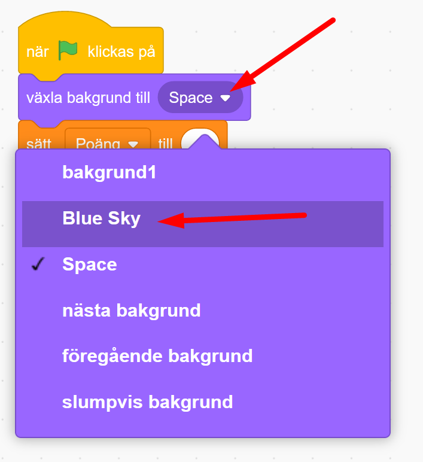

# Rymdhunden - del 2
I spelet **Rymdhunden** skapar du en busig hund som springer loss på jakt efter stjärnor och bollar i rymden för att få poäng - men akta dig för rymdblixtarna!
Instruktionen till hur du skapar spelet är uppdelad i 3 delar, här följer del 2. (Om du inte redan gjort första delen av spelet Rymdhunden, så hittar du <a href="https://www.kodboken.se/start/skapa-spel/uppgifter-i-scratch/rymdhunden-del-1?chpt=0" target="_blank"> instruktionen till hur du först skapar del 1 här</a>.)

Testa ett exempelspel av **Rymdhunden - del 2**. Klicka på bilden nedan och starta exempelspelet genom att klicka på gröna flaggan. Hunden föjer efter muspekaren (eller ditt finger om du har pekskärm). 

> **HUR KODAR JAG?** 
 
Följ denna instruktion steg för steg och koda ditt projekt i verktyget Scratch. <a href="https://scratch.mit.edu" target="_blank"> Klicka här för att öppna Scratch i en ny flik.</a> I Scratch klickar du på Skapa för att börja. Logga gärna in på Scratch så kan du även spara och dela ditt projekt. Det är gratis att skaffa ett konto.
 

Dax att börja koda! Klicka på steg 1 nedan för att gå vidare i instruktionen.

## 1: Skapa en poängräknare

I **Rymdhunden del 1** skapade vi början till spelet, där vi programmerade en hund att kunna jaga runt efter en stjärna. När hunden fångade stjärnan gömde sig stjärnan och dök sen upp på en ny plats igen. 

  

Nu i **Rymdhunden - del 2** ska vi skapa en poängräknare, så att vi får ett poäng varje gång hunden fångar stjärnan.

En Poängräknare skapar vi genom att programmera en så kallad **variabel**. Du kan föreställa dig att en variabel är som en låda som samlar in alla poäng vi får och håller räkningen på antalet under spelets gång.

1. Först ska vi skapa en ny variabel. Välj den mörk-orangea rubriken till vänster som heter **VARIABLER** och klicka på den vita rutan överst som det står **"Skapa en variabel"** på. 

  
  
2. Variablen ska heta Poäng, så skriv ordet **Poäng** i rutan som kommer upp. Klicka på OK.

  

Nu kan du se att du skapat en ny variabel som heter **Poäng**.

  
  
3. Dags att programmera in den i spelet. Poängräknarens kodblock lägger vi på scenens skriptyta, istället för på sprajtarnas. Börja därför med att aktivera scenen, så den blir blåmarkerad. 

  
  
4. Från rubriken **HÄNDELSER** drar du in ett startblock med **När START (grön flagga) klickas på** och lägger på scenens tomma skriptyta.

  
  
5. Vi vill att poängräknaren alltid ska starta på siffran 0 när du startar spelet. Därför kodar vi att räknaren "nollas" direkt efter start. Under rubriken **VARIABLER** finner du kodblocket **sätt min variabel till 0**. Dra in blocket på skriptytan och fäst det direkt under startblocket med gröna flaggan.

  
  
6. Vi måste ändra i kodblocket så det står rätt variabel. Klicka på ordet **min variabel** i kodblocket, så kan du välja din skapade variabel **Poäng** i menyn. Då står det **sätt Poäng till 0**.

  
    
  
Nu har vi skapat en poängräknare som alltid börjar på 0 poäng vid start. Men hur ska vi få poäng? Vi kodar vidare.

## 2: Ge poäng i spelet

Nu ska vi koda in hur poängen ska ges i spelet. Vi vill få ett poäng varje gång hunden fångar stjärnan. 

1. Stjärnans sprajt känner av när hunden rör vid den. Då kan stjärnan även få skicka ett poäng till poängräknaren. Klicka på lilla bilden av din stjärn-sprajt för att aktivera den och öppna dess skriptyta med kod. 

    
  
2. Under rubriken **VARIABLER** finns blocket **ändra min variabel med 1**. Dra in blocket och lägg det inuti villkoret under det blå blocket, så det ser ut som i bilden nedan.

    
  
3. Ändra i blocket så att det blir rätt variabel. Klick på texten **min variabel** och byt till **Poäng**. Nu står det **ändra Poäng till 1**.

    

>**Testa koden!** Starta spelet och se om du får poäng när hunden fångar stjärnan? Fungerar poängräknaren? Om inte, dubbelkolla att du ändrat i blocken så att du har rätt variabel - alltså den som heter **Poäng**.

Nu har vi en poängräknare som ger poäng. Men vi vill att något ska hända när vi får 5 poäng. Vi kodar vidare!

## 3: Sätt en poänggräns

Nu ska vi programmera så att OM hunden fångat 5 stjärnor, DÅ ska vi byta bakgrund och gå till nästa bana. Då passar ett villkor bra att använda. Vi kodar vidare!

1. Först väljer vi scenen med bakgrunden, där koden för vår poängräknare ligger. Klicka på den lilla bilden av scenen för att aktivera den.

    
  
2. Först behöver vi skapa en **loop**. Under rubriken **KONTROLL** finns loop-blocket **för alltid**. Dra in blocket och fäst det under **sätt Poäng till 0**.

    
  
3. Nu ska vi lägga in ett villkorsblock inuti loopen. Under rubriken **KONTROLL** finns blocket **Om <> Då**. Dra in det och lägg inuti loopen. 

    
  
4. I det kantiga hålet i villkorsblocket ska vi lägga en operator. Under gröna rubriken **OPERATOR** finns ett kantigt block som innehåller tecknet **=**.  Dra in blocket och lägg i hålet mellan **OM <> DÅ** som i bilden nedan.

  
  
5. Nu ska vi lägga in att villkoret läser av när poängräknaren fått 5 poäng. Under rubriken **VARIABLER** finns din skapade **Poäng**, som ett ovalt block högt upp. Dra inblocket och lägg i den första vida cirkeln i den gröna operatorn.

  
  
6. Ändra sedan siffran i operatorn till 5.

  
  
Nu har vi satt en gräns för hur många poäng vi kan få i villkoret. Men vad ska hända?

## 4: Ny bana med ny bakgrund

Nu vill vi bara att bakgrunden ska ändras så en ny bana startas. 

1. Klicka på knappen **Välj en bakgrund** längst ned i högra hörnet.

  

3. Välj kategori **Rymden** och välj en rymdbakgrund. Vi valde **Space**.

  
  
4. Nu ska vi koda så att nya bakgrunden visas. Se till att du har scenen aktiverad med dess skriptyta. Under rubriken **UTSEENDE** finner du in kodblocket **växla bakgrund till Space** (I vårt block står det namnet **Space**, då vi valde den bakgrunden. Du kanske valde en annan bakgrund med annat namn). Lägg blocket inuti villkoret på bakgrundens skriptyta. 

  

5. Dra in ett till likadant block från **UTSEENDE** och lägg det överst precis under **när START (gröna flaggan)** klickas på.

   
  
6. Klicka på blocket och ändra så det står namnet på din första bakgrund, så spelet alltid börjar med rätt bakgrund. 

   
  
>**Testa koden!** Starta spelet och låt hunden jaga efter stjärnan. Vad händer när du får 5 poäng? Byter det till ny bakgrund? Försvinner stjärnan? Vad händer om du startar om spelet? Visas rätt bakgrund? Är poängräknaren och stjärnan igång igen?

## Färdig!
Grattis, nu har du skapat färdigt den andra delen av ditt spel! Om du vill kan du koda vidare spelet i **Rymdhunden - del 3**. Då ska vi bygga vidare på vår nästa bana, med rymdskepp och fallande blixtar! 

**Glöm inte att spara ditt projekt - och att döpa det!** Döp det gärna till uppgiftens namn Rymdhunden - eller hitta på ett eget namn, så att du enkelt kan hitta det igen. Du skriver in namnet på spelet högt upp ovanför projektet, där det nu står "Scratchprojekt". Spara sedan, men du måste vara inloggad för att kunna spara.

> **Testa ditt projekt**  
Visa gärna ditt spel och låt andra testa. Om du vill, tryck på knappen DELA som du finner överst så kan andra också hitta spelet på Scratch sajt och testa det.

> **Viktigt om du delar ditt projekt:** Tänk på att delade projekt kan ses, testas och remixas (omskapas) av alla som vill på Scratch sajt. Det är viktigt när du sparar och delar att projektet inte innhåller information, bilder eller ljud du inte vill sprida till andra.

## Frågeställningar

* Vad gör ett villkor? 

* Vad är en variabel?

* Vad är ett meddelande?

