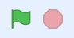

# Rymdhunden - del 2
I spelet **Rymdhunden** skapar du en busig hund som springer loss på jakt efter stjärnor och bollar i rymden för att få poäng - men akta dig för rymdblixtarna!
Instruktionen till hur du skapar spelet är uppdelad i 3 delar, här följer del 2. (Om du inte redan gjort första delen av spelet Rymdhunden, så hittar du <a href="https://www.kodboken.se/start/skapa-spel/uppgifter-i-scratch/rymdhunden-del-1?chpt=0" target="_blank"> instruktionen till hur du först skapar del 1 här</a>.)

Testa ett exempelspel av **Rymdhunden - del 2**. Klicka på bilden nedan och starta exempelspelet genom att klicka på gröna flaggan. Hunden föjer efter muspekaren (eller ditt finger om du har pekskärm). 

> **HUR KODAR JAG?** 
 
Följ denna instruktion steg för steg och koda ditt projekt i verktyget Scratch. <a href="https://scratch.mit.edu" target="_blank"> Klicka här för att öppna Scratch i en ny flik.</a> I Scratch klickar du på Skapa för att börja. Logga gärna in på Scratch så kan du även spara och dela ditt projekt. Det är gratis att skaffa ett konto.
 

Dax att börja koda! Klicka på steg 1 nedan för att gå vidare i instruktionen.

## 1: Skapa en poängräknare

I **Rymdhunden del 1** skapade vi början till spelet, där vi programmerade en hund att kunna jaga runt efter en stjärna. När hunden fångade stjärnan gömde sig stjärnan och dök sen upp på en ny plats igen. 

  

Nu i **Rymdhunden - del 2** ska vi skapa en poängräknare, så att vi får ett poäng varje gång hunden fångar stjärnan.

En Poängräknare skapar vi genom att programmera en så kallad **variabel**. Du kan föreställa dig att en variabel är som en låda som samlar in alla poäng vi får och håller räkningen på antalet under spelets gång.

1. Först ska vi skapa en ny variabel. Välj den mörk-orangea rubriken till vänster som heter **VARIABLER** och klicka på den vita rutan överst som det står **"Skapa en variabel"** på. 

  
  
2. Variablen ska heta Poäng, så skriv ordet **Poäng** i rutan som kommer upp. Klicka på OK.

  

Nu kan du se att du skapat en ny variabel som heter **Poäng**.

  
  
3. Dags att programmera in den i spelet. Poängräknarens kodblock lägger vi på scenens skriptyta, istället för på sprajtarnas. Börja därför med att aktivera scenen, så den blir blåmarkerad. 

  
  
4. Från rubriken **HÄNDELSER** drar du in ett startblock med **När START (grön flagga) klickas på** och lägger på scenens tomma skriptyta.

  
  
5. Vi vill att poängräknaren alltid ska starta på siffran 0 när du startar spelet. Därför kodar vi att räknaren "nollas" direkt efter start. Under rubriken **VARIABLER** finner du kodblocket **sätt min variabel till 0**. Dra in blocket på skriptytan och fäst det direkt under startblocket med gröna flaggan.

  
  
6. Vi måste ändra i kodblocket så det står rätt variabel. Klicka på ordet **min variabel** i kodblocket, så kan du välja din skapade variabel **Poäng** i menyn. Då står det **sätt Poäng till 0**.

  
    
  
Nu har vi skapat en poängräknare som alltid börjar på 0 poäng vid start. Men hur ska vi få poäng? Vi kodar vidare.

## 2: Ge poäng i spelet
Nu ska vi koda in hur poängen ska ges i spelet. Vi vill få ett poäng varje gång hunden fångar stjärnan. 

1. Stjärnans sprajt känner av när hunden rör vid den. Vi kan  då låta stjärnan skicka ett poäng till poängräknaren samtidigt. Klicka på lilla bilden av din stjärn-sprajt för att aktivera den och öppna dess skriptyta med kod. 
2. Under rubriken **VARIABLER** finns kodblocket **ändra min variabel med 1**. Dra in blocket och lägg det inuti villkoret, direkt under röresleblocket **gå till slumpnässig position**.

    
  
3. Ändra i blocket så att det blir rätt variabel. Det ska stå **ändra Poäng till 1**.

    

>**Testa koden!** Starta spelet och se om du får poäng när hunden fångar stjärnan? Fungerar poängräknaren? Om inte, dubbelkolla att du ändrat i blocken så att du har rätt variabel - alltså den som heter **Poäng**.

Nu har vi en poängräknare som ger poäng. Men vi vill att någoit ska hända när vi får 5 poäng. Vi kodar vidare!

## 3: Sätt en poänggräns

Nu ska vi programmera så att OM hunden fångat 5 stjärnor, DÅ ska vi byta bakgrund och gå till nästa level. Då passar ett villkor bra att använda - Om.. Då. Vi kodar vidare!

1. Vi går tillbaka till scenen med bakgrunden, där vår koden för vår poängräknare ligger. Aktivera **Scenen** för att öppna dess skriptyta. 
2. Först behöver vi skapa en **loop**. Under rubriken **KONTROLL** finns loop-blocket **för alltid**. Dra in blocket och fäst det direkt under **sätt Poäng till 0**.

    
  
3. Nu ska vi lägga in ett villkorsblock inuti loopen. Under rubriken **KONTROLL** finns blocket **Om <> Då**. Dra in det och lägg inuti loopen. 

    
  
4. I det kantiga hålet i villkorsblocket ska vi lägga en operator. Under gröna rubriken **OPERATOR** finns ett kantigt block som innehåller tecknet **>**, alltså tecknet för **större än**. Dra in blocket och lägg i hålet mellan **OM <> DÅ** som i bilden nedan. (Var noga med att tecknet i blocket pekar åt rätt håll, alltså **>**.)

  
  
5. Nu ska vi lägga in att villkoret läser av när poängräknaren fått 5 poäng. Under rubriken **VARIABLER** finns din skapade **Poäng**, som ett ovalt block högt upp. Dra inblocket och lägg i den första vida cirkeln i den gröna operatorn.

  
  
6. Ändra sedan siffran i operatorn till 5.

  
  
Nu har vi satt en gräns för hur många poäng vi kan få i villkoret. Men vad ska hända?
  

## 4: Skicka meddelande

Vi vill att när vi fått 5 poäng, då ska vi byta till nästa level och stjärnan ska gömma sig.

1. Vi lägger in ett meddelande-block. Under rubriken **HÄNDELSER** finns kodblocket **skicka meddelande 1**. Dra in blocket på scenens skriptyta och lägg det inuti villkoret du just skapat. 

  
  
2. Nu ska vi skapa det nya meddelandet. Klicka på texten **meddelande 1** i blocket du just lade in. Klicka på **Nytt meddelande**. 

  
  
3. Döp ditt meddelande till något som den ska hantera, exempelvis **byt bana**. Tryck sedan på **OK**.

  
  
4. Nu står det **skicka byt bana** i blocket. Nu ska vi ordna så att när meddelandet skickas, då ska stjärn-sprajten ta emot meddelandet och gömma sig. Klicka på lilla bilden av stjärn-sprajten för att programmera stjärnan. Under rubriken **HÄNDELSER** finns blocket **När jag tar emot ___** (I vårt block står det **byt bana**, men kanske det står meddelande 1 eller vad du döpte ditt meddelande till.) Dra in blocket och lägg det fritt på stjärnans skriptyta. 

  
  
5. Nu lägger vi till ett block så att stjärnan gömmer sig. Under rubriken **UTSEENDE** finns blocket **Göm**. Lägg det direkt under meddelandeblocket.

  
  

>**Testa koden!** Testa spelet, vad händer när du fångat 5 stjärnor? Gömmer sig stjärnan? 

## 5: Ny bana med ny bakgrund

Nu vill vi bara att bakgrunden ska ändras när ny bana startas. 

1. Klicka på knappen **Välj en bakgrund** längst ned i högra hörnet.
2. Välj kategori **Rymden** och välj en rymdbakgrund. Vi valde **Space**.

  
  
3. Nu ska vi koda så att nya bakgrunden visas. Se till att du har scenen aktiverad med dess skriptyta. Under rubriken **UTSEENDE** finner du in kodblocket **växla bakgrund till Space** (I vårt block står det namnet **Space**, då vi valde den bakgrunden. Du kanske valde en annan bakgrund med annant namn). Lägg blocket inuti villkoret på bakgrundens skriptyta. 

   

3. Dra in ett till likadant block från **UTSEENDE** och lägg det överst precis under **när START (gröna flaggan)** klickas på.

   
  
Klicka på blocket och ändra så det står namnet på din första bakgrund, så spelet alltid börjar med rätt bakgrund. 

   

## 3: Få hunden att röra sig

Vi ska koda så att hunden rör sig på scenens bakgrund och följer efter muspekaren (eller ditt finger om du har pekskärm). Rörelse skapar du med kodblocken i Scratch. 

Ser du knapparna ovanför scenen med en grön flagga och en röd knapp? Det är spelets startknapp och stoppknapp. 

  

Just nu händer ingenting om du trycker på startflaggan. Det finns nämligen ingen kod som bestämmer vad hunden ska göra om du startar spelet. Vi måste programmera in det. Gör såhär:

1.  Längst till vänster i Scratch hittar du olika färgglada rubriker med en massa kodblock bredvid som ser ut som pusselbitar. Klicka på den gula rubriken som heter **HÄNDELSER** och välj översta pusselbiten med en grön flagga på som är blocket för: **"när START (gröna flaggan) klickas på"**. Dra detta block till skriptytan (den stora tomma, vita ytan i mitten av Scratch) och släpp den där. 

  
  
2. Nu har du skapat en startknapp. Då ska du lägga in en startposition för hunden, en plats där hunden alltid ska starta på när du börjar spelet. Dra hunden dit du vill att den ska stå på scenen när spelet börjar.

    

3. Titta på kodblocken. Välj nu den översta mörkblå rubriken som heter **RÖRELSE** och leta fram blocket som heter **"gå till x:__ , y:__"**. Detta block gör att din hund alltid startar på samma startposition. Dra in blocket till skriptytan och lägg det direkt under det första blocket med den gröna flaggan, så att de kopplas ihop som pusselbitar.

  
  
4. Nu ska vi lägga till kod som får hunden att röra sig framåt. Under rubriken **RÖRELSE** finns blocket **"gå 10 steg"**. Dra in blocket och fäst det under de andra blocken på skriptytan.

  

> **Testa koden!** Tryck på gröna startflaggan ovanför scenen. Flyttar sig hunden lite åt höger? Bra! Vad händer om du trycker flera gånget på startflaggan? Nu ska vi koda så att hunden rör sig framåt om och om igen för alltid när spelet startats. Vi kodar vi vidare.

## 3: Styra runt hunden 

Nu vill vi sätta mer fart på hunden - och sedan styra runt den.

1. Klicka på den orangea rubriken **KONTROLL** och hitta kodblocket som heter **"för alltid"**. Dra in blocket på skriptytan och lägg det löst bredvid de andra blocken. Detta block skapar en LOOP, som repeterar andra kodblock så att de utförs om och om igen, för alltid.

  

2. Nu ska vi pussla om i koden så att blocket **"Gå 10 steg"** läggs inuti i blocket **"för alltid"**. Sen ska vi sätta ihop alla kodbitar igen. Gör så att det blir som i bilden under:

  
  

> **Testa koden!** Tryck på START-flaggan ovanför ditt spel. Nu blir det fart på hunden! För alltid-loopen repeterar hundens steg, om och om igen, så den springer framåt hela tiden. Tryck på startflaggan igen, börjar hunden om från sin startposition?. Stoppa hunden (och koden) med den röda knappen.

3. Springer hunden för fort? Du kan sänka hastigheten genom att ändra till en lägre siffra i blå blocket **"Gå 10 steg"**. Klicka på siffran **10** i kodblocket och skriv istället in förslagsvis siffran 5, så går hunden hälften så fort. 

  

4. Nu ska vi få hunden att kunna åka runt i spelet. Vi vill att den ska följa efter muspekaren när du drar den över scenen (eller följa efter ditt finger om du har en pekskärm). Under mörkblå rubriken **RÖRELSE** väljer du blocket som heter **"peka mot muspekare"**. Lägg in det i kodblocket med din **"för alltid"**-loop, så det ser ut som i bilden nedan:

  

> **Testa koden!** Tryck på START-flaggan och rör din muspekare (eller fingret om du har pekskärm) över skärmen. Hunden jagar efter och åker runt. Stoppa koden och hunden med den röda stoppknappen.

Nu springer hunden runt på scenen. Den skulle ju kunna få jaga någonting? Vi kodar vidare.

## 4: En stjärna att jaga

Nu ska vi lägga till en ny sprajt - en stjärna. Hunden ska jaga stjärnan, och när de rör vid varandra, så ska stjärnan försvinna och sen dyka upp på ett nytt ställe. 

1. Klicka på **Välj ny sprajt** i nedre högra hörnet. Leta fram en gul stjärna. Lägg til lden i projektet genom att klicka på den.

  
  
**Tips!** Undrar du vart koden du skapat tog vägen? Ingen fara, din nya sprajt stjärnan har en egen skriptyta och du har inte lagt in några kodblock där än, därför är den tom. Men hunden har all sin kod kvar. För att se hundens skriptyta med din kod kan du växla mellan dina sprajter genom att klicka på de olika små bilderna av dina sprajter under scenen. Testa att klicka på de olika så ser du.

  
  
2. Nu ska vi programmera stjärn-sprajten, så den kan gömma sig om den rör vid hunden - och sedan visa sig igen på ett nytt ställe. Vi börjar med att lägga till startknappen. Se till att du har din stjärn-sprajt aktiverad, så att du kodar rätt sprajt. Under gula rubriken **HÄNDELSER** drar du in blocket **När START (gröna flaggan) klickas på**. Lägg det på stjärnans skriptyta.

3. Nu ska vi skapa ett så kallat **villkor**. Det är kod som styr att något ska hända **OM** något annat händer. Vi vill skapa ett villkor som säger att **OM** hunden rör vid stjärnan, **DÅ** ska stjärnan gömma sig. Koda såhär: Under orangea rubriken **KONTROLL** finns kodblocket **OM <> DÅ**. Dra in blocket och fäst det direkt under startknappens block, så det ser ut såhär:

  
  
4. Ser du det kantiga hålet i kodblocket mellan **OM** och **DÅ**? Där kan vi lägga in vad stjärnan ska känna av som rör vid den. Vi vill att stjärnan ska känna om hunden rör vid den. Under den ljusblå rubriken **KÄNNA AV** finns kodblocket **rör vid muspekare**. Dra in blocket och lägg in det i det hålet mellan **OM** och **DÅ**. Se bilden nedan:

  
  
  
  
5. I det ljusblå kodblocket står det **rör vid muspekare**. Men koden ska ju styra om stjärnan rör vid hund-sprajten, inte muspekaren. Vi måste ändra i koden. Kolla först vad din hund-sprajt heter. Du hittar namnet på den lilla bilden av din sprajt under scnene. Hund-sprajten heter **Dot**. 

  

Ändra nu i ljusblå kodblocket genom att klicka på ordet **muspekare** och sedan på namnet **Dot** i listan som kommer fram. Nu känner stjärnan av om den rör vid hunden **Dot** istället.

  
  

6. Nu ska vi lägga till vad som ska hända när stjärnan och hunden rör vid varandra. Vi vill att stjärnan ska gömma sig, så de försvinner. Under den lila rubriken **UTSEENDE** hittar du kodblocket **Göm**. Dra in det och lägg det inuti ditt villkor, så det ser ut som i bilden nedan.

  
  
>**Testa koden!** Starta spelet och låt hunden springa fram till stjärnan. Vad händer? Försvinner stjärnan. Testa att starta spelet igen. Vad händer med stjärnan?

Nu har vi en stjärna, men den försvinner. Vi måste koda vidare.

## 5: Få stjärnan att visa sig

1. Om man startar spelet så försvinner stjärnan när hunden rör vid den, precis som vi kodat. Men ett problem är att stjärnan inte kommer tillbaka när vi startar om spelet igen. Vi måste lägga till kod som får stjärnan att visa sig igen när man startar om spelet. Under rubriken **UTSEENDE** finns kodblocket **Visa**. Lägg in det direkt under startblocket **När START (grön flagga) klickas på**. 

  
  
>**Testa koden!** Starta spelet och se vad som händer. Kommer stjärnan tillbaka?

2. Nu har vi stjärnan synlig igen. Men vi vill att den ska dyka upp på en ny plats så hunden får jaga efter stjärnan hela tiden. Under rubriken **RÖRELSE** finns kodblocket **gå till slumpmässig position**. Dra in blocket och lägg det inuti villkoret under **Visa**-blocket. 

  
  
3. Nu ska vi se till att stjärnan visar sig på sin nya plats. Från rubriken **UTSEENDE** drar du in ett till **Visa**-block och lägger det inuti villkoret direkt under **gå till slumpmässig position**.

  
  
>**Testa koden!** Starta spelet och låt hunden jaga efter stjärnan. Vad händer? Dyker stjärnan upp på nya platser igen?

## Färdig!
Grattis, nu har du skapat första delen av ditt spel! Om du vill kan du koda vidare spelet i **Rymdhunden - del 2**. 

**Glöm inte att spara ditt projekt - och att döpa det!** Döp det gärna till uppgiftens namn Rymdhunden - eller hitta på ett eget namn, så att du enkelt kan hitta det igen. Du skriver in namnet på spelet högt upp ovanför projektet, där det nu står "Scratchprojekt". Spara sedan, men du måste vara inloggad för att kunna spara.

> **Testa ditt projekt**  
Visa gärna ditt spel och låt andra testa. Om du vill, tryck på knappen DELA som du finner överst så kan andra också hitta spelet på Scratch sajt och testa det.

> **Viktigt om du delar ditt projekt:** Tänk på att delade projekt kan ses, testas och remixas (omskapas) av alla som vill på Scratch sajt. Det är viktigt när du sparar och delar att projektet inte innhåller information, bilder eller ljud du inte vill sprida till andra.

## Frågeställningar

* Vad är en sprajt?

* Vad är en loop?

* Varför kan det vara bra att använda en loop?

* Vad gör ett villkor? 
