# Rymdhunden - del 3
I spelet **Rymdhunden** skapar du en busig hund som springer loss på jakt efter stjärnor och bollar i rymden för att få poäng - men akta dig för rymdblixtarna!
Instruktionen till hur du skapar spelet är uppdelad i 3 delar, här följer del 3. (Om du inte redan gjort första och andra delen av spelet Rymdhunden, så hittar du <a href="https://www.kodboken.se/start/skapa-spel/uppgifter-i-scratch/rymdhunden-del-1?chpt=0" target="_blank"> instruktionen till hur du först skapar del 1 här</a> och del 2 här.)

Testa ett exempelspel av **Rymdhunden - del 3**. Klicka på bilden nedan och starta exempelspelet genom att klicka på gröna flaggan. Hunden föjer efter muspekaren (eller ditt finger om du har pekskärm). <a href="https://scratch.mit.edu/projects/643992517" target="_blank"> 
  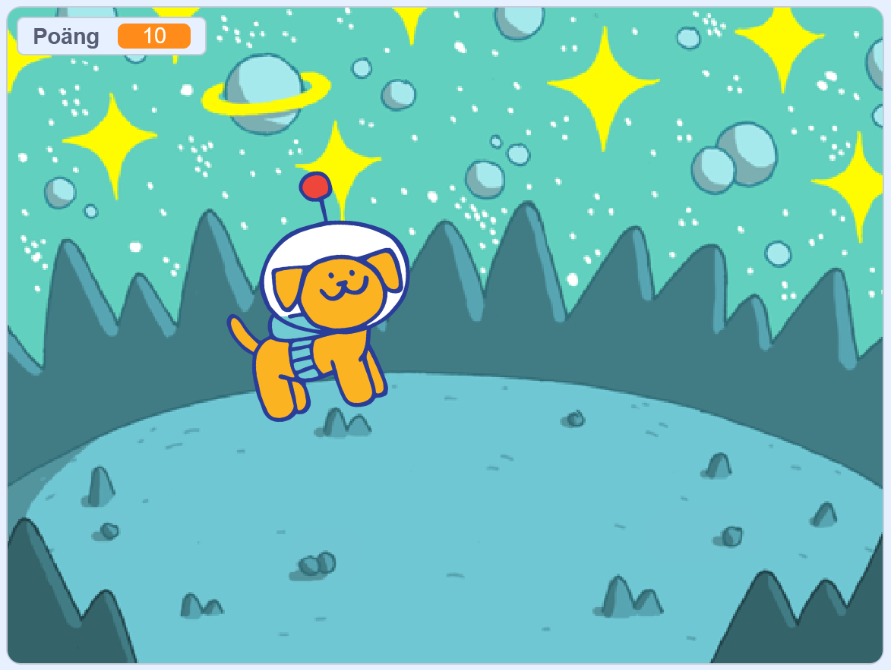</a>

> **HUR KODAR JAG?** 
 
Följ denna instruktion steg för steg och koda ditt projekt i verktyget Scratch. <a href="https://scratch.mit.edu" target="_blank"> Klicka här för att öppna Scratch i en ny flik.</a> I Scratch klickar du på Skapa för att börja. Logga gärna in på Scratch så kan du även spara och dela ditt projekt. Det är gratis att skaffa ett konto.
 

Dax att börja koda! Klicka på steg 1 nedan för att gå vidare i instruktionen.

## 1: Lägg till en robot

I **Rymdhunden del 1 och del 2** skapade vi början till spelet, där vi programmerade en hund att kunna jaga runt efter en stjärna och en poängräknare som gick till 5. Sen kommer man till en ny bana. Där börjar del 3 som vi ska programmera vidare på nu. 

  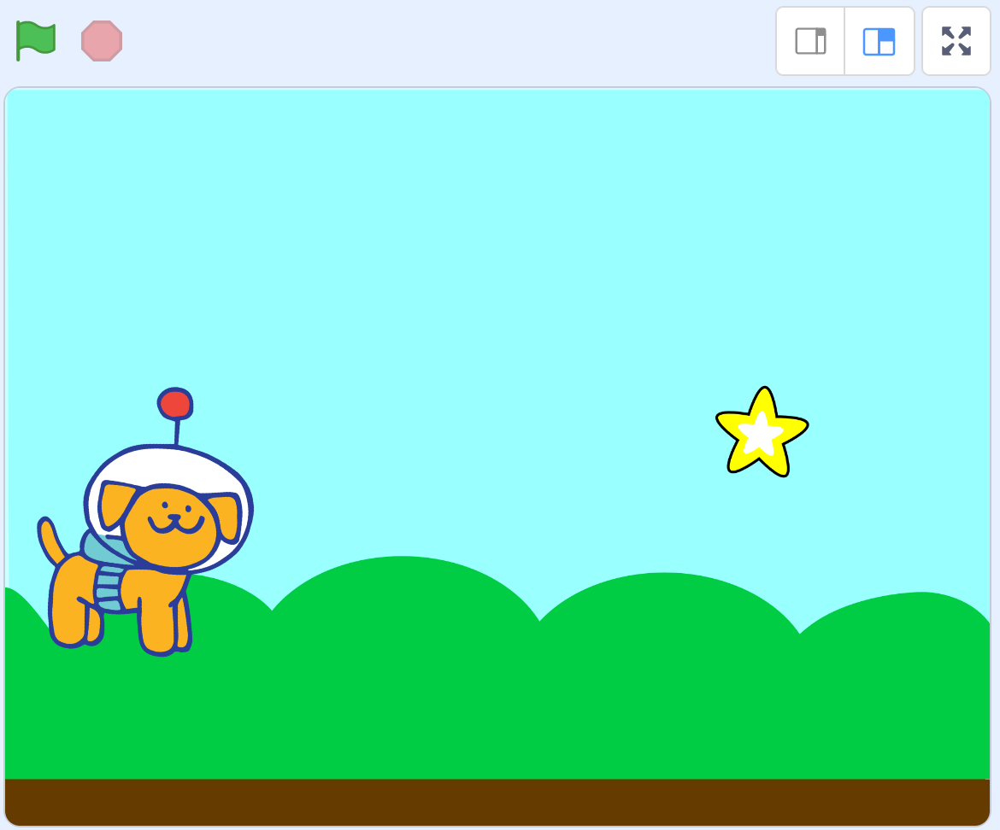

I **Rymdhunden - del 3** ska vi lägga till en ny sprajt - en robot, som åker i luften och som släpper bollar som du ska fånga med hunden för poäng, men akta dig för blixtarna som roboten släpper - de gör dig Game Over!

1. Först lägger vi till den nya sprajten - en robot. Tryck på knappen **Välj en sprajt** längst ned och leta fram sprajten Robot.  

  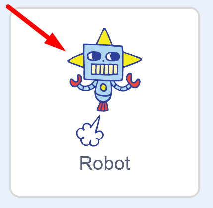

2. Nu ska vi programmera roboten. Vi vill att den ska vara gömd när spelet startar, annars syns den även på första banan. Under rubriken **HÄNDELSER** finns startblocket **när START (grön flagga) klickas på**. Lägg det på robotens skriptyta. 

  
  
3. Under rubriken **UTSEENDE** finns lilla kodblocket **Göm**. Dra ut det och fäst det direkt under startblocket med den gröna flaggan.

  
  
4. Nu ska vi koda så att roboten ska visa sig när den nya bakgrunden syns, alltså den nya banan. Under rubriken **HÄNDELSER** finns blocket **När bakgrunden växlar till "bakgrund1"** Dra ut blocket till robotens skriptyta. 

  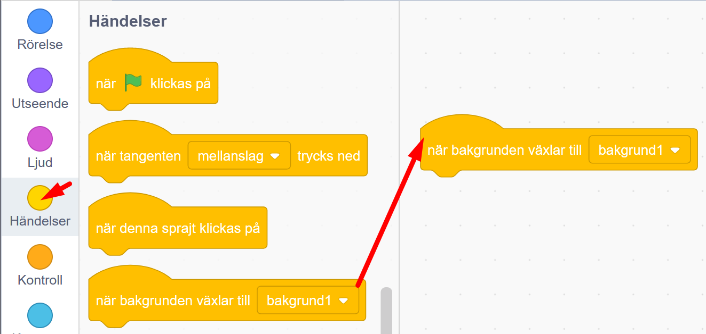
  
5. Ändra i kodblocket du just lade till så att det står namnet på bakgrunden för den nya banan. Bakgrunden i vårt exempel heter **Space**. Klicka på texten **bakgrund 1** i blocket och välj rätt namn på nya bakgrunden i menyn.
  
  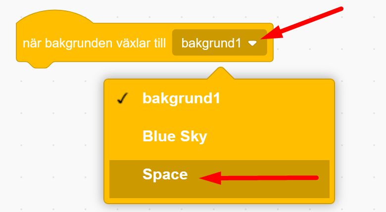
  
6. Nu lägger vi till kod som får roboten att visa sig när nya bakgrunden kommer fram. Under rubriken **UTSEENDE** finns lilla kodblocket **Visa**. Dra ut till skriptytan och fäst direkt under det gula blocket, så det ser ut som på bilden nedan.

  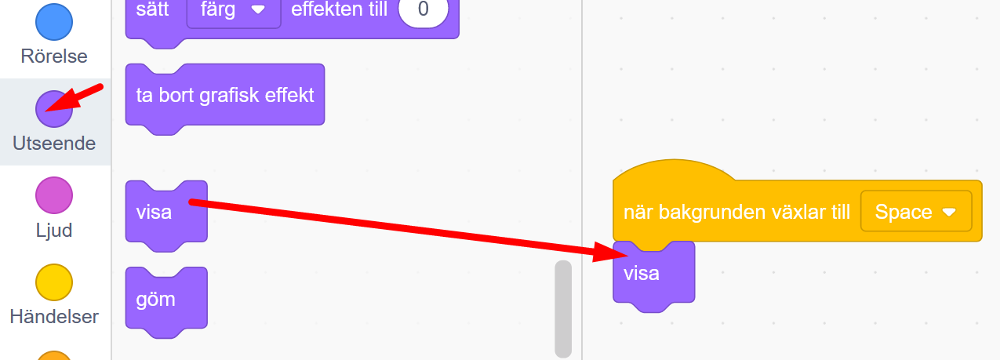
  
>**Testa koden!** Klicka på startflaggan och kör spelet. Är roboten gömd på första banan? Kommer roboten fram på nästa bana? 

## 2: Ge roboten fart

Dax att ge roboten lite fart! Vi kodar in rörelse.

1. Vi vill att roboten ska åka fram och tillbaka åt höger och vänster spelet. Vi behöver programmera in en startriktning, så den vet åt vilket håll den ska åka. Under rubriken **RÖRELSE** finns kodblocket **peka i riktning 90**. Dra in blocket och fäst det under **Visa**-blocket i robotens kod.

  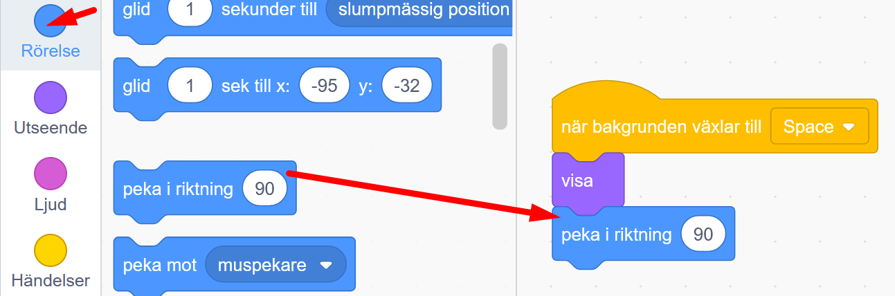  
  
2. Vi ska även programmera in att roboten ska åka hela tiden. Vi lägger till en loop. Under rubriken **KONTROLL** finns kodblocket **för alltid**. Dra in blocket och fäst under blocket för **peka i riktning 90** på roboten. 

  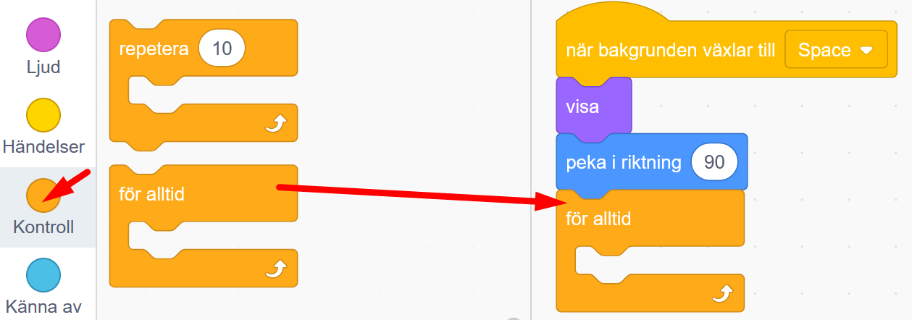  
  
3. Nu lägger vi till rörelsen framåt. Under rubriken **RÖRELSE** finns kodblocket **gå 10 steg**. Lägg in det inuti loopen **för alltid**.

  
  
>**Testa koden!** Starta spelet med gröna flaggan. Vad händer med roboten på den nya banan? Åker den iväg åt sidan?

4. Nu vill vi att roboten ska åka fram och tillbaka från sida till sida, så den studsar åt andra hållet om den rör vid kanten. Under rubriken **RÖRELSE** finns kodblocket **om vid kanten, studsa**. Dra in blocket och lägg det inuti loopen under **gå 10 steg**.

  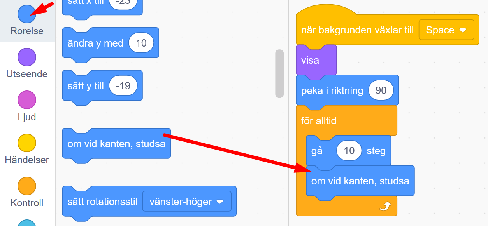
  
>**Testa koden!** Starta spelet med gröna flaggan. Åker roboten fram och tillbaka på scenen?

5. Åker roboten för fort eller för långsamt? Du kan ändra hastigheten genom att ändra antal steg roboten ska ta. Ändra till en lägre siffra om du vill ge den långsammare fart. 

  

5. Är roboten för stor? Du kan göra den mindre genom att ändra storleken i rutan under scenen där det står **Storlek 100**. Nu är roboten alltså 100% stor. Ändra till lägre siffra, kanske 70% blir lagom? Prova dig fram.

  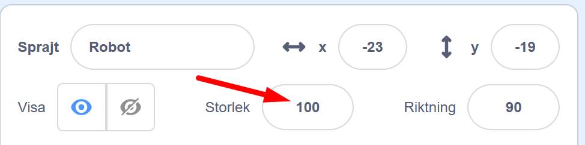
  
6. Vi vill att roboten ska åka i övre delen av scenen i spelet. Dra roboten till en plats på scenen där du vill att den ska starta. Nu lägger vi till ett kodblock som bestämmer robotens startposition. När du ställt roboten på rätt plats, klicka på rubriken **RÖRELSE** och dra ut kodblocket **gå till x:__, y:__**. Lägg in blocket direkt under gula startblocket **när bakgrunden växlar till Space**. 

  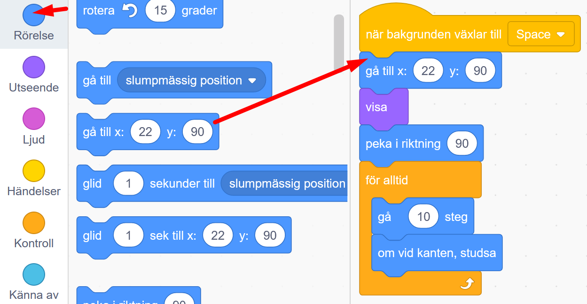
  
>**Testa koden!** Starta spelet med gröna flaggan. Åker roboten som du vill, på rätt plats och med bra hastighet? Är den lagom stor? Ändra om du inte är helt nöjd.

Nu har vi en robot som åker fram och tillbaka. Det är dags att lägga till poäng-bollar att fånga.

## 3: Lägg till en boll

Nu ska vi lägga till en boll-sprajt som roboten ska släppa ned och som ger poäng om hunden fångar den. 

1. Klicka på knappen för **Välj en sprajt** och leta fram den gula bollen som heter **Ball**. Klicka på den för att lägga till i projektet.

  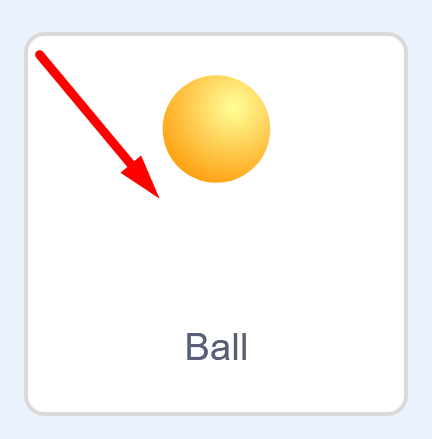
  
2. Först programmerar vi in att bollen ska vara gömd när spelet startar, så den inte syns på första banan. Från rubriken **HÄNDELSER** drar du ut startblocket **när START (grön flagga) klickas på** och lägger det på bollens tomma skriptyta.

  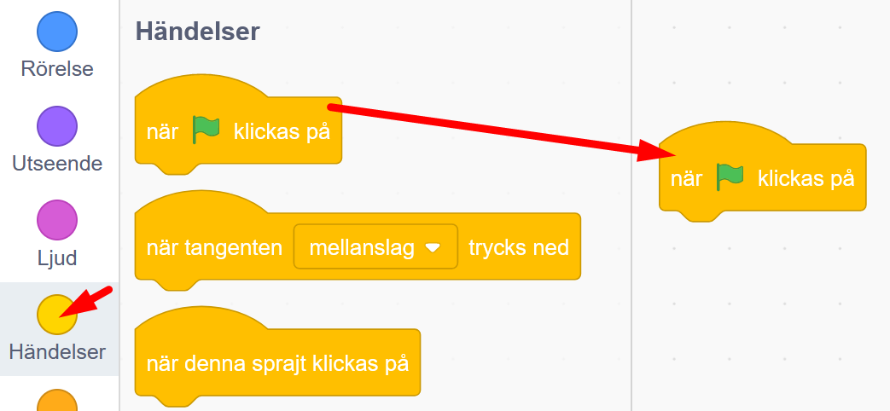

3. Under rubriken **UTSEENDE** finns lilla blocket **Göm**. Lägg den direkt under startblocket på skriptytan.

  

4. Nu ska vi programmera ett nytt skript som gör att roboten kan släppa ner massa bollar. Vi ska koda så att bollen kan klona sig med kopior av sig själv. Under rubriken **HÄNDELSER** finns blocket **när bakgrunden växlar till bakgrund 1**. Dra in blocket och lägg det på skriptytan för bollen. (Kanske det står något annat än **bakgrund 1** i ditt block.)

  
  
5. Se till att det är rätt bakgrund som står på blocket. Klicka på texten **bakgrund 1** och välj nmanet på din bakgrundsbild för bana 2. I vårt exempel heter bakgrunden **Space**.

  
  
6. Vi vill att det ska ramla ned bollar från roboten för alltid. Så från rubriken **KONTROLL** hämtar vi ett **för alltid**-block, som loopar kodblock som läggs inuti. Lägg in blocket direkt under gula **när bakgrunden växlar till Space**.

  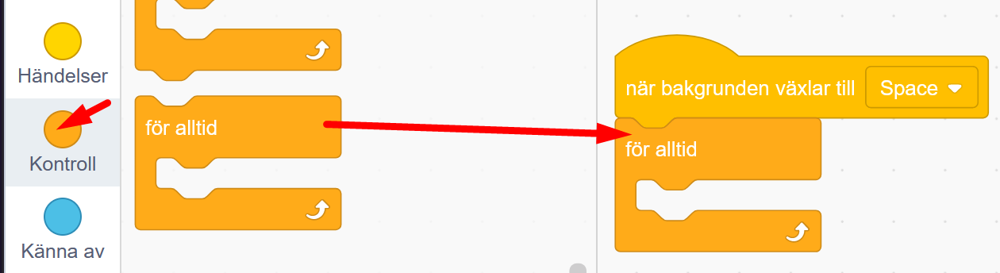
  
7 Vi vill att alla bollar ska se ut att ramla ned roboten. Då roboten åker fram och tillbaka måste vi koda så att bollarna går till roboten innan de faller ned. Under rubriken **RÖRELSE** finns kodblocket **gå till slumpmässig position**. Lägg in blocket inuti **för alltid**-loopen. 

  
  
8. Klicka på texten **slumpmässig position** i blocket och byt det till **Robot**. Då går bollen alltid först till roboten.

  
  
9. Nu ska vi klona bollen så det kan falla massor av bollar. Under rubriken **KONTROLL** finns kodblocket **skapa klon av mig själv**. Lägg blocket inuti loopen under **gå till robot**. 

  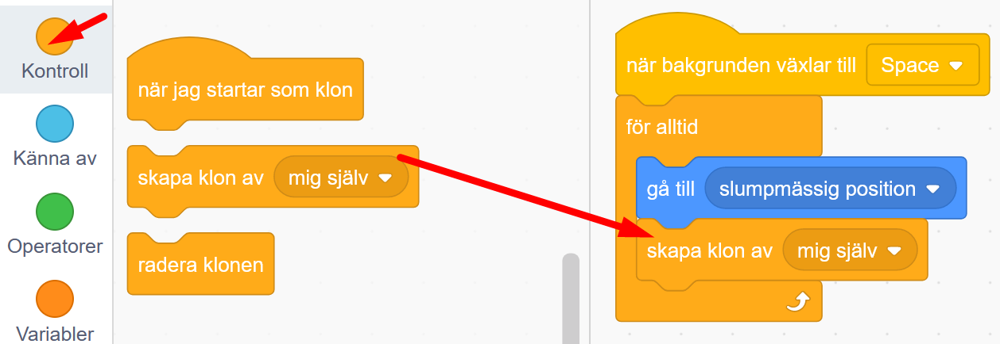
  
Nu har vi en boll som kan klona sig själv. Dags att programmera den att kunna falla ner.

## 4: Låt bollarna falla

Nu ska vi se till att klonerna av bollen kan falla ned. En klon är som en kopia av originalbollen.

1. Vi skapar ett nytt skript på boll-sprajten. Under rubriken **KONTROLL** finns kodblocket **när jag startar som klon**. Dra in blocket till bollens skriptyta och lägg den någonstans på ytan. 

  
  
2. Nu vill vi att boll-klonen ska synas på scenen. Under rubriken **UTSEENDE** finns lilla blocket **visa**. Lägg in blocket direkt under **när jag startar som klon**.

  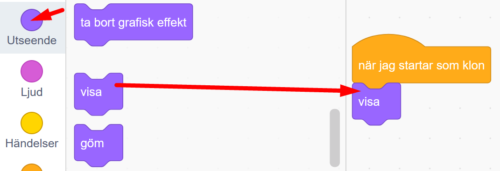

3.Vi vill att bollen ska falla neråt. Därför lägger vi till ett block som ger riktningen för bollen. Under rubriken **RÖRELSE** väljer du blocket **peka i riktning 90**. Lägg in blocket direkt under det lila blocket **visa**.

  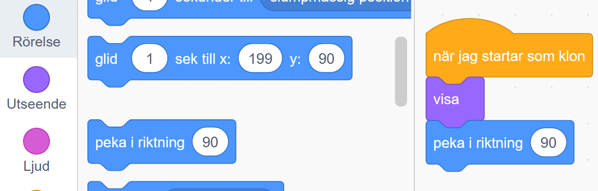
  
4. Klicka på siffran **90** i blocket och ändra till **180**. Då blir riktningen nedåt.

  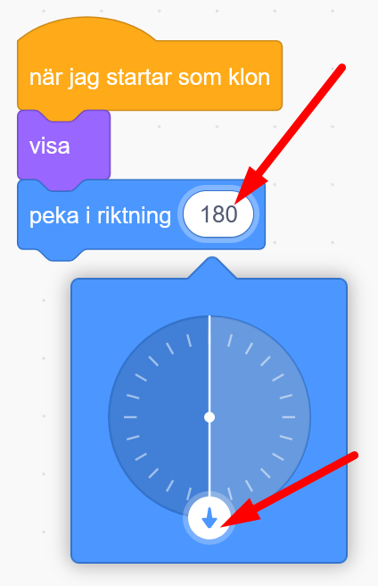

5. Vi vill att bollen ska falla neråt och röra sig tills den antingen rör vid scenens nedre kant eller att hunden får tag i den och då får du poäng. Vi behöver koda in en repetition som fungerar ungefär som en loop. Under rubriken **KONTROLL** finns **repetera tills <>**. Dra in blocket och fäst det direkt under **peka i riktning 180**. 

  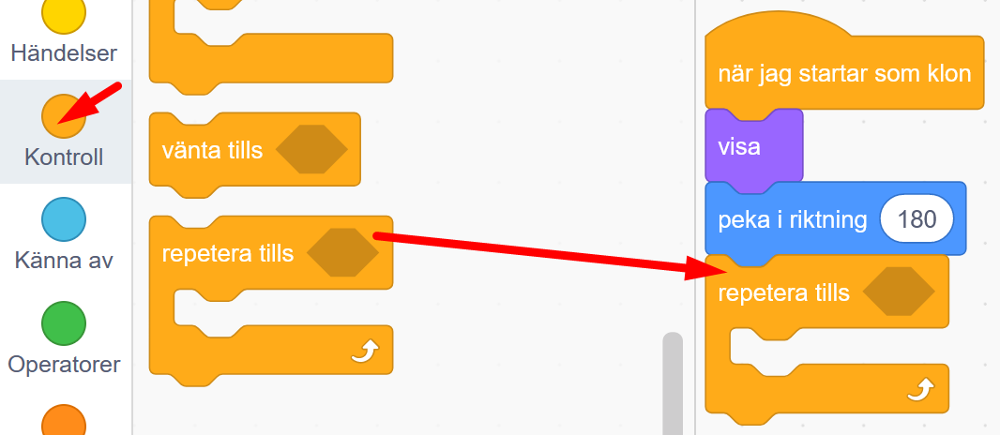

jfkflkeala

## 5: Ny bana med ny bakgrund

Nu vill vi bara att bakgrunden ska ändras när ny bana startas. 

1. Klicka på knappen **Välj en bakgrund** längst ned i högra hörnet.
2. Välj kategori **Rymden** och välj en rymdbakgrund. Vi valde **Space**.

  
  
3. Nu ska vi koda så att nya bakgrunden visas. Se till att du har scenen aktiverad med dess skriptyta. Under rubriken **UTSEENDE** finner du in kodblocket **växla bakgrund till Space** (I vårt block står det namnet **Space**, då vi valde den bakgrunden. Du kanske valde en annan bakgrund med annant namn). Lägg blocket inuti villkoret på bakgrundens skriptyta. 

  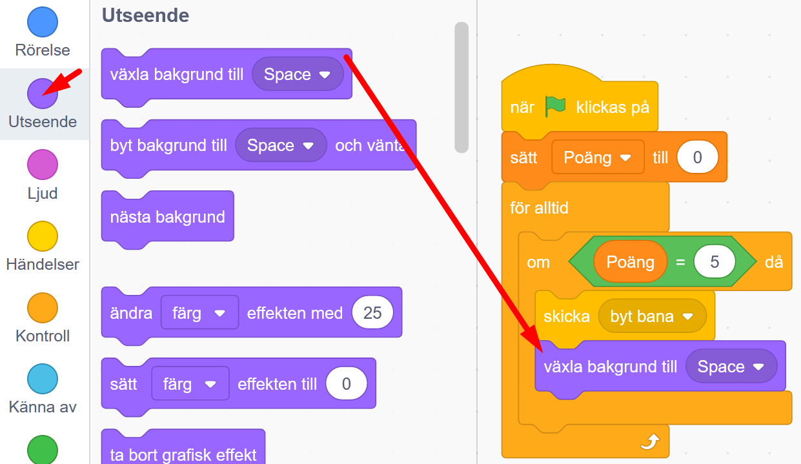 

3. Dra in ett till likadant block från **UTSEENDE** och lägg det överst precis under **när START (gröna flaggan)** klickas på.

  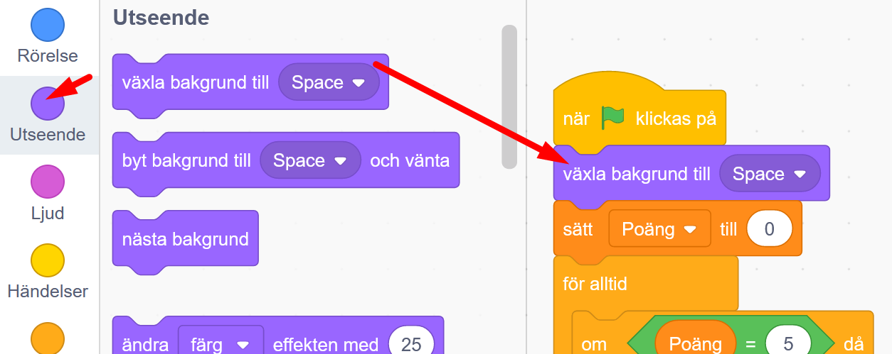 
  
Klicka på blocket och ändra så det står namnet på din första bakgrund, så spelet alltid börjar med rätt bakgrund. 

  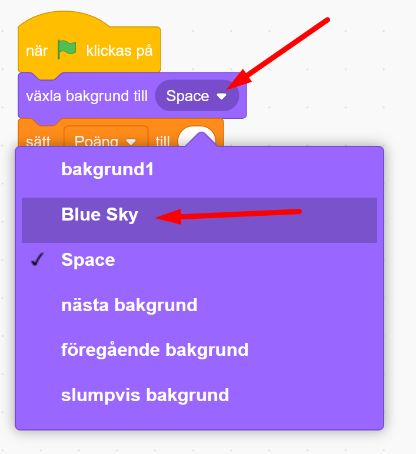 
  
>**Testa koden!** Starta spelet och låt hunden jaga efter stjärnan. Vad händer när du får 5 poäng? Byter det till ny bakgrund? Försvinner stjärnan? Vad händer om du startar om spelet? Visas rätt bakgrund? Är poängräknaren och stjärnan igång igen?

## Färdig!
Grattis, nu har du skapat den andra delen av ditt spel! Om du vill kan du koda vidare spelet i **Rymdhunden - del 3**. 

**Glöm inte att spara ditt projekt - och att döpa det!** Döp det gärna till uppgiftens namn Rymdhunden - eller hitta på ett eget namn, så att du enkelt kan hitta det igen. Du skriver in namnet på spelet högt upp ovanför projektet, där det nu står "Scratchprojekt". Spara sedan, men du måste vara inloggad för att kunna spara.

> **Testa ditt projekt**  
Visa gärna ditt spel och låt andra testa. Om du vill, tryck på knappen DELA som du finner överst så kan andra också hitta spelet på Scratch sajt och testa det.

> **Viktigt om du delar ditt projekt:** Tänk på att delade projekt kan ses, testas och remixas (omskapas) av alla som vill på Scratch sajt. Det är viktigt när du sparar och delar att projektet inte innhåller information, bilder eller ljud du inte vill sprida till andra.

## Frågeställningar

* Vad gör ett villkor? 

* Vad är en variabel?

* Vad är ett meddelande?

