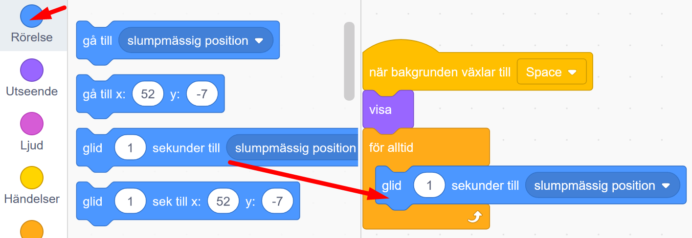
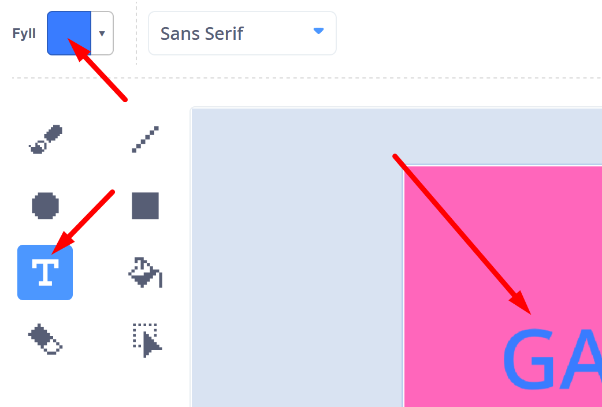
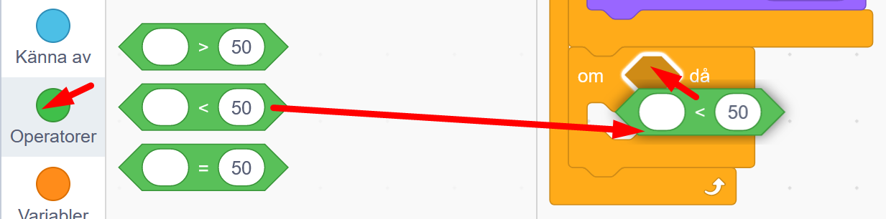

# Rymdhunden - del 3
I spelet **Rymdhunden** skapar du en busig hund som springer loss på jakt efter stjärnor i rymden för att få poäng - men akta dig för roboten - den ger dig minuspoäng!
Instruktionen till hur du skapar spelet är uppdelad i 3 delar, här följer del 3. (Om du inte redan gjort första och andra delen av spelet Rymdhunden, så hittar du <a href="https://www.kodboken.se/start/skapa-spel/uppgifter-i-scratch/rymdhunden-del-1?chpt=0" target="_blank"> instruktionen till hur du först skapar del 1 här</a> och <a href="https://www.kodboken.se/start/skapa-spel/uppgifter-i-scratch/rymdhunden-del-2?chpt=0" target="_blank"> del 2 här</a> .)

Testa ett exempelspel av **Rymdhunden - del 3**. Klicka på bilden nedan och starta exempelspelet genom att klicka på gröna flaggan. Hunden föjer efter muspekaren (eller ditt finger om du har pekskärm). 

> **HUR KODAR JAG?** 
 
Följ denna instruktion steg för steg och koda ditt projekt i verktyget Scratch. <a href="https://scratch.mit.edu" target="_blank"> Klicka här för att öppna Scratch i en ny flik.</a> I Scratch klickar du på Skapa för att börja. Logga gärna in på Scratch så kan du även spara och dela ditt projekt. Det är gratis att skaffa ett konto.
 

Dax att börja koda! Klicka på steg 1 nedan för att gå vidare i instruktionen.

## 1: Lägg till en robot

I **Rymdhunden del 1 och del 2** skapade vi början till spelet, där vi programmerade en hund att kunna jaga runt efter en stjärna och en poängräknare som gick till 5 poäng. Sen kommer man till en ny bana med en ny bakgrund. Där börjar del 3 som vi ska programmera vidare på nu. 

  

I **Rymdhunden - del 3** ska vi lägga till en ny sprajt - en robot, som åker runt och jagar samma stjärna som hunden, men om roboten tar stjärnan före hunden, då får du minuspoäng. Får du 0 poäng blir spelet Game Over!

1. Först lägger vi till den nya sprajten - en robot. Tryck på knappen **välj en sprajt** långt  ned till höger i Scratch och leta fram sprajten **Robot**.  

  

2. Nu ska vi programmera roboten. Vi vill att den ska vara gömd när spelet startar, annars syns den även på första banan. Under rubriken **HÄNDELSER** finns startblocket **när START (grön flagga) klickas på**. Lägg det på robotens skriptyta. 

  
  
3. Under rubriken **UTSEENDE** finns lilla kodblocket **göm**. Dra ut det och fäst det direkt under startblocket med den gröna flaggan.

  
  
4. I del 2 av Rymdhunden lade vi till en ny bakgrund med rymdtema, som visar sig när hunden fångat 5 stjärnor och fått 5 poäng. Denna nya bakgrund heter **Space**. Nu ska vi programmera så att roboten ska visa sig när bakgrunden **Space** kommer fram, alltså den nya banan. 
Under rubriken **HÄNDELSER** finns blocket **när bakgrunden växlar till "bakgrund1"** Dra ut blocket till robotens skriptyta, lägg det bredvid det andra skriptet med gröna flaggan. 

  
  
5. Ändra i kodblocket så att det står namnet på nya bakgrunden - alltså **Space**. Klicka på texten **bakgrund 1** i blocket och välj rätt namn i menyn. Då ser blocket ut som bilden nedan.
  
  
  
6. Nu lägger vi till kod som får roboten att visa sig när nya bakgrunden kommer fram. Under rubriken **UTSEENDE** finns kodblocket **visa**. Dra ut till skriptytan och fäst direkt under det gula blocket, så det ser ut som på bilden nedan.

  
  
>**Testa koden!** Klicka på startflaggan och kör igång spelet. Är roboten gömd på första banan? Kommer roboten fram på nästa bana? 

Nu har vi en robot, dags att koda vidare!

## 2: Ge roboten fart

Dax att ge roboten lite fart! Vi kodar in rörelse.

1. Vi vill att roboten alltid ska röra sig mot stjärnan och försöka fånga den innan hunden hinner fram. Först lägger vi till en loop, så roboten för alltid rör på sig. Under rubriken **KONTROLL** finns blocket **för alltid**. Dra in blocket och fäst det under **visa**-blocket.

    
  
2. Nu lägger vi till rörelse. Vi vill att roboten ska glida fram till stjärnan. Under rubriken **RÖRELSE** finns kodblocket **glid 1 sekunder till slumpmässig position**. Lägg in det inuti **för alltid**-loopen.

  
  
3. Klicka på texten **slumpmässig position** i blocket du just lade in. Välj istället namnet på din stjärna **Star**, så ändras texten i blocket till **glid 1 sekunder till Star**. Nu kommer roboten alltid glida fram till stjärnan.

  
  
4. Ändra även antal sekunder i blocket. Klicka på siffran **1** i blocket och skriv **2**. 

  
  
>**Testa koden!** Starta spelet med gröna flaggan. Vad händer med roboten på den nya banan? Åker den iväg mot stjärnan? Om hunden tar stjärnan, åker roboten iväg till nästa stjärna? 

5. Är roboten för stor? Du kan göra den mindre genom att ändra storleken i rutan under scenen där det står **Storlek 100**. Nu är roboten alltså 100% stor. Ändra till lägre siffra, kanske 70% blir lagom? Prova dig fram.

  
  
6. Vi vill att roboten ska få en startposition. Dra roboten till en plats på scenen där du vill att den ska starta, förslagsvis ett av hörnen på scenen. Under **RÖRELSE** finns kodblocket **gå till x_ , y_**. Lägg in blocket direkt under det gula startblocket **när bakgrunden växlar till Space**. 

  

Nu har vi en robot som jagar stjärnan. Vi kodar vidare.

## 3: Roboten skapar minuspoäng

1. Om roboten fångar stjärnan före hunden hinner fram så ska spelet få 3 minuspoäng. Vi vill att stjärnan ska ordna med minuspoängen, så vi lägger in koden på stjärn-sprajten. Klicka på den lilla bilden av sprajten med stjärnan som finns under scenen. Då blir stjärnan aktiv och vi ser koden den har.

  

2. Nu skapar vi ett villkor i stjärnans skript som gör att om roboten rör vid stjärnan, då ska stjärnan skicka 3 minuspoäng till poängräknaren. Under rubriken **KONTROLL** finns kodbloket **om <> då**. Lägg in blocket inuti **för alltid**-loopen i stjärnans stora skript, så att det hamnar under det första **om <>då**-villkoret som ligger i loopen, så att det ser ut som i bilden nedan.

  
  
3. Nu ska vi se till att stjärnan känner av roboten. Under rubriken **KÄNNA AV** finns kodblocket **rör vid muspekare**. Lägg in blocket inuti det kantiga hålet mellan **om <> då**, så det istället står **om rör vid muspekare då**

  

4. Klicka på texten **muspekare** i kodblocket du just lade in och ändra till **Robot**. Då står det **om rör vid Robot då**

  

5. Först vill vi att stjärnan ska gömma sig, så det ser ut som om roboten fångat den. Under rubriken **UTSEENDE** finns blocket **göm**. Lägg det inuti villkoret. 

  
  
6. Nu vill vi att stjärnan skickar 3 minuspoäng till poängräknaren för att Roboten tog den. Under rubriken **VARIABLER** finns kodblocket **ändra min variabel med 1**. Lägg in blocket inuti villkoret under **göm**.

  
  
7. Klicka på ordet **min variabel** i blocket och välj **Poäng** från menyn som kommer fram. Då står det **Poäng** även i blocket.

  

8. Nu fixar vi antal poäng. Klicka på siffran **1** i blocket och skriv istället **-3**. (om du inte kan skriva minustecken, så använd ett bindestreck, det går också bra.)

  
  
9. Nu ska vi flytta stjärnan till en ny slumpvis vald plats på scenen. Under rubriken **RÖRELSE** finns blocket **gå till slumpmässig position**. Lägg in det i villkoret under **ändra Poäng med -3**.

  

10. Nu ska stjärnan visa sig på sin nya plats. Under **UTSEENDE** finns blocket **visa**. Lägg in blocket inuti villkoret under det blå blocket **gå till slumpmässig position**.

  
  
>**Testa koden!** Starta spelet med gröna flaggan. Vad händer? Kan roboten fånga stjärnan? Får spelet 3 minuspoäng när det händer? Kan hunden fånga stjärnan och få 1 pluspoäng? 

## 4: En sista bakgrundsbild

Vi vill att spelet ska kunna bli Game Over. Vi kodar vidare!

1. Om roboten fångar så många stjärnor att poängen blir 0 så förlorar hunden och spelet blir Game Over. Vi lägger till en ny bakgrund som blir en slutbild. Håll muspekaren över knappen **Välj en bakgrund** i nedre högra hörnet och välj den lilla penseln **Måla**. Då kommer du till scenens ritverktyg.

  
  
2. Klicka allra först på den blå knappen under ritytan, som det står **Gör till Bitmap** på. Då blir det enklare att måla sen.

  
  
3. Välj verktyget som ser ut som en liten hink.

  
  
4. Klicka på den lilla rutan med färg på, som finns över ritverktygen och välj en färg som du vill ha på bilden. Du kan ändra färg genom att dra i de vita,runda färgväljarna.  När du valt färg klickar du på ritytan en gång, så fylls ytan med färgen du valt. Se bilden nedan.

  
  
5. Om du vill kan du skriva texten **Game Over** på bakgrundsbilden. Klicka på **Text-verktyget** och välj även en **ny färg** som du gillar för texten. Klicka på ritytan och skriv Game Over på bakgrunden. (Klicka sedan bredvid texten, då kommer en fyrkant upp med blå prickar runt texten du skrev. Du kan dra i hörnpunkterna på rutan runt texten, så kan du förstora texten. Du kan även flytta på texten.)

  
  
6. Vi kan döpa om vår nya bakgrundsbild, så den heter Game Over. Ovanför färgväljaren finns namnet på bakgrundsbilden, just nu heter den kanske *bakgrund 2*. Radera det och skriv istället till exempel **Game Over**. 

  
  
7. Om du är nöjd med färgen kan du gå tillbaka till där vi programmerar genom att klicka på lilla fliken i övre vänstra hörnet som heter **Kod**.

  
  
## 5: Game Over i spelet
  
1. Nu är vi tillbaka där vi har alla kodblocken. Just nu är bakgrunden med scenen markerad och vi ser dess kod. Det är bra, för vi vill koda in att om poängen blir 0, då ska spelet bli Game Over och vår sista bakgrundsbild ska visa sig. Se först till att scenen med bakgrunden är markerad med en blå ram runt sig som i bilden nedan.

  
  
2. Nu skapar vi ett villkor som kollar om poängen är 0. Under rubriken **KONTROLL** finns villkors-blocket **om <> då**. Lägg in det inuti scenens **för alltid**-loop, under det första villkoret i loopen. 

  
  
3. Nu behöver vi kodblock som kollar att poängen är **mindre än 0**. Tecknet för *mindre än* ser ut såhär: **<**. Under rubriken **OPERATOR** finns kodblocket som har tecknet **<** i sig. Dra in det och lägg det inuti det kantiga hålet mellan **om** och **då** i villkoret. Se bilden här under.

  
  
4. Ändra siffran **50** i det gröna operatorblocket till siffran **0**. 

  
  
5. Gå till rubriken **VARIABLER** och leta fram det ovala kodblocket som det står **Poäng** på. Lägg in blocket i det första tomma runda hålet i det gröna operatorblocket. Då står det istället **om Poäng < 0 då**.

  

6. Nu lägger vi in ett kodblock som ser till att bakgrunden som heter Game Over visas när poängen blir mindre än 0. Under rubriken **UTSEENDE** finns kodblocket **växla bakgrund till Game Over**. Dra in blocket och lägg det inuti villkoret.

  
  
7. Vi vill att poängräknaren ska gömma sig när spelet är Game Over. Under rubriken **VARIABLER** finns kodblocket **göm min variabel**. Lägg in blocket inuti scenens villkor, direkt under meddelandet.

  

8. Klicka på texten **min variabel** i blocket och ändra till **Poäng**.

  
  
9. Vi måste se till att poängräknaren syns när vi startar spelet igen. Under rubriken **VARIABLER** finns blocket **visa min variabel**. Lägg in detta block överst i skriptet direkt under startblocket med gröna flaggan. 

  
  
10. Klicka på texten **min variabel** i kodblocket och ändra till **Poäng**.

  
  
>**Testa koden!** Starta spelet med gröna flaggan. Vad händer om roboten gör spelet Game Over? Syns rätt bakgrund på slutet? Om inte, ändra i kodblocket som styr vilken bakgrund som ska visas på scenen. 

## Färdig!
Grattis, nu har du skapat den tredje delen av ditt spel! Om du vill kan du koda vidare spelet och utveckla mer i koden. Vad vill du mer ska hända i ditt spel? 

**Glöm inte att spara ditt projekt - och att döpa det!** Döp det gärna till uppgiftens namn Rymdhunden - eller hitta på ett eget namn, så att du enkelt kan hitta det igen. Du skriver in namnet på spelet högt upp ovanför projektet, där det nu står "Scratchprojekt". Spara sedan, men du måste vara inloggad för att kunna spara.

> **Testa ditt projekt**  
Visa gärna ditt spel och låt andra testa. Om du vill, tryck på knappen DELA som du finner överst så kan andra också hitta spelet på Scratch sajt och testa det.

> **Viktigt om du delar ditt projekt:** Tänk på att delade projekt kan ses, testas och remixas (omskapas) av alla som vill på Scratch sajt. Det är viktigt när du sparar och delar att projektet inte innhåller information, bilder eller ljud du inte vill sprida till andra.

## Frågeställningar

* Vad gör ett villkor? 

* Vad är en variabel?

* Vad är ett meddelande?

