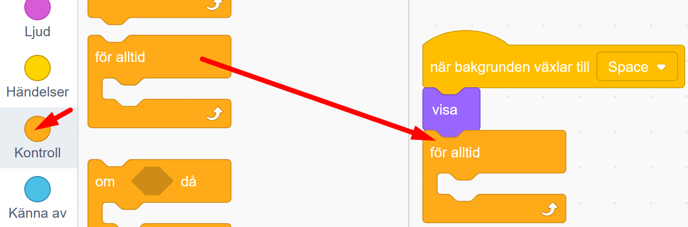
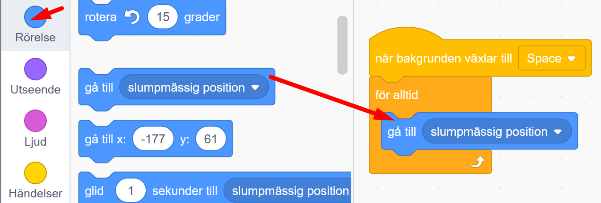

# Rymdhunden - del 3
I spelet **Rymdhunden** skapar du en busig hund som springer loss på jakt efter stjärnor i rymden för att få poäng - men akta dig för roboten - den ger dig minuspoäng!
Instruktionen till hur du skapar spelet är uppdelad i 3 delar, här följer del 3. (Om du inte redan gjort första och andra delen av spelet Rymdhunden, så hittar du <a href="https://www.kodboken.se/start/skapa-spel/uppgifter-i-scratch/rymdhunden-del-1?chpt=0" target="_blank"> instruktionen till hur du först skapar del 1 här</a> och del 2 här.)

Testa ett exempelspel av **Rymdhunden - del 3**. Klicka på bilden nedan och starta exempelspelet genom att klicka på gröna flaggan. Hunden föjer efter muspekaren (eller ditt finger om du har pekskärm). 

> **HUR KODAR JAG?** 
 
Följ denna instruktion steg för steg och koda ditt projekt i verktyget Scratch. <a href="https://scratch.mit.edu" target="_blank"> Klicka här för att öppna Scratch i en ny flik.</a> I Scratch klickar du på Skapa för att börja. Logga gärna in på Scratch så kan du även spara och dela ditt projekt. Det är gratis att skaffa ett konto.
 

Dax att börja koda! Klicka på steg 1 nedan för att gå vidare i instruktionen.

## 1: Lägg till en robot

I **Rymdhunden del 1 och del 2** skapade vi början till spelet, där vi programmerade en hund att kunna jaga runt efter en stjärna och en poängräknare som gick till 5 poäng. Sen kommer man till en ny bana med en ny bakgrund. Där börjar del 3 som vi ska programmera vidare på nu. 

  

I **Rymdhunden - del 3** ska vi lägga till en ny sprajt - en robot, som åker runt och jagar samma stjärna som hunden, men om roboten tar stjärnan före hunden, då får du 2 minuspoäng. Till slut blir spelet Game Over!

1. Först lägger vi till den nya sprajten - en robot. Tryck på knappen **Välj en sprajt** längst ned och leta fram sprajten Robot.  

  

2. Nu ska vi programmera roboten. Vi vill att den ska vara gömd när spelet startar, annars syns den även på första banan. Under rubriken **HÄNDELSER** finns startblocket **när START (grön flagga) klickas på**. Lägg det på robotens skriptyta. 

  
  
3. Under rubriken **UTSEENDE** finns lilla kodblocket **Göm**. Dra ut det och fäst det direkt under startblocket med den gröna flaggan.

  
  
4. Nu ska vi koda så att roboten ska visa sig när den nya bakgrunden syns, alltså den nya banan. Under rubriken **HÄNDELSER** finns blocket **När bakgrunden växlar till "bakgrund1"** Dra ut blocket till robotens skriptyta, lägg det bredvid det andra skriptet med gröna flaggan. 

  
  
5. Ändra i kodblocket du just lade till så att det står namnet på bakgrunden för den nya banan. Bakgrunden i vårt exempel heter **Space**. Klicka på texten **bakgrund 1** i blocket och välj rätt namn på nya bakgrunden i menyn. Då ser blocket ut som bilden nedan.
  
  
  
6. Nu lägger vi till kod som får roboten att visa sig när nya bakgrunden kommer fram. Under rubriken **UTSEENDE** finns lilla kodblocket **Visa**. Dra ut till skriptytan och fäst direkt under det gula blocket, så det ser ut som på bilden nedan.

  
  
>**Testa koden!** Klicka på startflaggan och kör spelet. Är roboten gömd på första banan? Kommer roboten fram på nästa bana? 

## 2: Ge roboten fart

Dax att ge roboten lite fart! Vi kodar in rörelse.

1. Vi vill att roboten alltid ska röra mot stjärnan som den ska försöka fånga. Först lägger vi till en loop, så roboten för alltid åker runt. Under rubriken **KONTROLL** finns blocket **för alltid**. Dra in blocket och fäst det under **Visa**-blocket i robotens kod.

    
  
2. Nu lägger vi till rörelsen framåt. Under rubriken **RÖRELSE** finns kodblocket **glid 2 sekunder till slumpmässig position**. Lägg in det inuti loopen **för alltid**.

  
  
3. Klicka på texten **slumpmässig position** i blocket du just lade in. Välj istället namnet på din stjärna **Star**, så ändras texten i blocket till **glid 2 sekunder till Star**. Nu kommer roboten alltid glida till stjärnan.

  
  
>**Testa koden!** Starta spelet med gröna flaggan. Vad händer med roboten på den nya banan? Åker den iväg mot stjärnan? om hunden tar stjärnan, åker roboten iväg till nästa stjärna? 

4. Är roboten för stor? Du kan göra den mindre genom att ändra storleken i rutan under scenen där det står **Storlek 100**. Nu är roboten alltså 100% stor. Ändra till lägre siffra, kanske 70% blir lagom? Prova dig fram.

  
  
5. Vi vill att roboten ska få en startposition. Dra roboten till en plats på scenen där du vill att den ska starta, förslagsvis ett av hörnen på scenen. Under **RÖRELSE** finns kodblocket **gå till x:__, y:__**. Dra ut blocket till robotens skriptyta. Lägg in blocket direkt under gula startblocket **när bakgrunden växlar till Space**. 

  

Nu har vi en robot som jagar stjärnan. Vi kodar vidare.

## 3: Roboten skapar minuspoäng

1. Om roboten fångar stjärnan före hunden hinner fram så ska spelet få minuspoäng. Vi vill att stjärnan ska ordna med minuspoängen, så koden lägger vi där. Klicka på den lilla bilden av sprajten med stjärnan som finns under scenen. Då är stjärnan aktiv och vi ser koden den har.

  

2. Nu skapar vi ett villkor i stjärnans skript som gör att om roboten röd vid stjärnan, då ska stjärnan ordna med minuspoäng till poängräknaren. Under rubriken **KONTROLL** finns kodbloket **om <> då**.. Dra in det inuti loopen i stjärnans stora skript, så det hamnar under det första villkoret och ser ut som i bilden nedan.

  
  
3. Nu ska vi lägga till ett block som gör att stjärnan känner av roboten. Under rubriken **KÄNNA AV** finns kodblocket **rör vid muspekare**. Dra in det och lägg det inuti det kantiga hålet mellan **om <> då**, så det står **om rör vid muspekare då**

  

4. Klicka på texten **muspekare** i kodblocket du just lade in och ändra till **Robot**. Då står det **om rör vid Robot då**

  

5. Först vill vi att stjärnan ska gömma sig, så det ser ut som om roboten fångat den. Under rubriken **UTSEENDE** finns blocket **Göm**. Lägg det inuti villkoret. 

  
  
6. Nu vill vi att stjärnan ger poängräknaren 2 minuspoäng för att Roboten tog den. Under rubriken **VARIABLER** finns kodblocket **ändra min variabel med 1**. Lägg in blocket inuti villkoret under **Göm**.

  
  
7. Klicka på ordet **min variabel** i blocket och ändra i menyn som kommer fram så det står **Poäng** i blocket.

  

8. Ändra siffran **1** i blocket, och skriv istället **-3**.

  
  
9. Nu ska vi flytta stjärnan till en ny slumpvis vald plats på scenen. Under rubriken **RÖRELSE** finns blocket **gå till slumpmässig position**. Lägg in det i stjärnans villkor under **ändra Poäng med -2**.

  

10. Nu ska stjärnan visa sig på sin nya plats. Under **UTSEENDE** finns blocket **Visa**. Lägg in blocket inuti stjärnans villkor under det blå blocket **gå till slumpmässig position**.

  
  
>**Testa koden!** Starta spelet med gröna flaggan. Vad händer? Kan roboten fånga stjärnan? Får spelet minuspoäng när det händer? Kan hunden fånga stjärnan och få pluspoäng? 

## Färdig!
Grattis, nu har du skapat den tredje delen av ditt spel! Om du vill kan du koda vidare spelet i **Rymdhunden - del 4**. 

**Glöm inte att spara ditt projekt - och att döpa det!** Döp det gärna till uppgiftens namn Rymdhunden - eller hitta på ett eget namn, så att du enkelt kan hitta det igen. Du skriver in namnet på spelet högt upp ovanför projektet, där det nu står "Scratchprojekt". Spara sedan, men du måste vara inloggad för att kunna spara.

> **Testa ditt projekt**  
Visa gärna ditt spel och låt andra testa. Om du vill, tryck på knappen DELA som du finner överst så kan andra också hitta spelet på Scratch sajt och testa det.

> **Viktigt om du delar ditt projekt:** Tänk på att delade projekt kan ses, testas och remixas (omskapas) av alla som vill på Scratch sajt. Det är viktigt när du sparar och delar att projektet inte innhåller information, bilder eller ljud du inte vill sprida till andra.

## Frågeställningar

* Vad gör ett villkor? 

* Vad är en variabel?

* Vad är ett meddelande?

