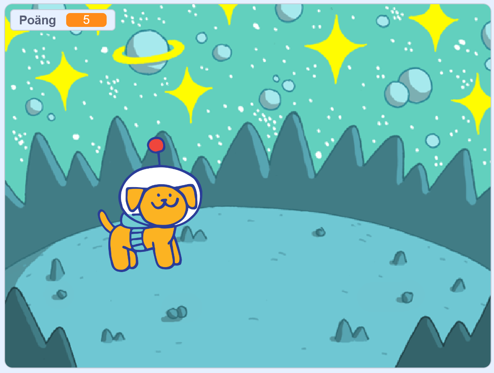
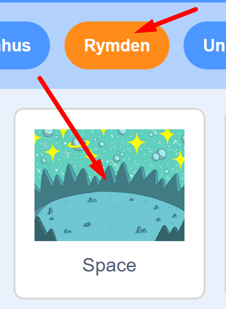

# Rymdhunden - del 3
I spelet **Rymdhunden** skapar du en busig hund som springer loss på jakt efter stjärnor och bollar i rymden för att få poäng - men akta dig för rymdblixtarna!
Instruktionen till hur du skapar spelet är uppdelad i 3 delar, här följer del 3. (Om du inte redan gjort första och andra delen av spelet Rymdhunden, så hittar du <a href="https://www.kodboken.se/start/skapa-spel/uppgifter-i-scratch/rymdhunden-del-1?chpt=0" target="_blank"> instruktionen till hur du först skapar del 1 här</a> och del 2 här.)

Testa ett exempelspel av **Rymdhunden - del 3**. Klicka på bilden nedan och starta exempelspelet genom att klicka på gröna flaggan. Hunden föjer efter muspekaren (eller ditt finger om du har pekskärm). 

> **HUR KODAR JAG?** 
 
Följ denna instruktion steg för steg och koda ditt projekt i verktyget Scratch. <a href="https://scratch.mit.edu" target="_blank"> Klicka här för att öppna Scratch i en ny flik.</a> I Scratch klickar du på Skapa för att börja. Logga gärna in på Scratch så kan du även spara och dela ditt projekt. Det är gratis att skaffa ett konto.
 

Dax att börja koda! Klicka på steg 1 nedan för att gå vidare i instruktionen.

## 1: Lägg till en rymdraket

I **Rymdhunden del 1 och del 2** skapade vi början till spelet, där vi programmerade en hund att kunna jaga runt efter en stjärna och en poängräknare som gick till 5. Sen kommer man till en ny bana. Där börjar del 3 som vi ska programmera vidare på nu. 

  

I **Rymdhunden - del 3** ska vi lägga till en ny sprajt - en robot, som åker i luften och som släpper bollar som du ska fånga med hunden för poäng, men akta dig för blixtarna som roboten släpper - de gör dig Game Over!

1. Först lägger vi till den nya sprajten - en robot. Tryck på knappen **Välj en sprajt** längst ned och leta fram sprajten Robot.  

  

2. Nu ska vi programmera roboten. Vi vill att den ska vara gömd när spelet startar, annars syns den även på första banan. Under rubriken **HÄNDELSER** finns startblocket **när START (grön flagga) klickas på**. Lägg det på robotens skriptyta. 

  
  
3. Under rubriken **UTSEENDE** finns lilla kodblocket **Göm**. Dra ut det och fäst det direkt under startblocket med den gröna flaggan.

  
  
4. Nu ska vi koda så att roboten ska visa sig när den nya bakgrunden syns, alltså den nya banan. Under rubriken **HÄNDELSER** finns blocket **När bakgrunden växlar till "bakgrund1"** Dra ut blocket till raketens skriptyta. 

  
  
5. Ändra i kodblocket du just lade till så att det står namnet på bakgrunden för den nya banan. Bakgrunden i vårt exempel heter **Space**. Klicka på texten **bakgrund 1** i blocket och välj rätt namn på nya bakgrunden i menyn.
  
  
  
6. Nu lägger vi till kod som får roboten att visa sig. Under rubriken **UTSEENDE** finns lilla kodblocket **Visa**. Dra ut till skriptytan och fäst direkt under det gula blocket, så det ser ut som på bilden nedan.

  
  
>**Testa koden!** Klicka på startflaggan och kör spelet. Är roboten gömd på första banan? Kommer roboten fram på nästa bana? 

## 2: Ge roboten fart

Dax att ge roboten lite fart! Vi kodar in rörelse.

1. Vi vill att roboten ska åka fram och tillbaka åt höger och vänster spelet. Vi behöver programmera in en startriktning, så den vet åt vilket håll den ska åka. Under rubriken **RÖRELSE** finns kodblocket **peka i riktning 90**. Dra in blocket och fäst det under **Visa**-blocket i robotens kod.

    
  
2. Vi ska även programmera in att roboten ska åka hela tiden. Vi lägger till en loop. Under rubriken **KONTROLL** finns kodblocket **för alltid**. Dra in blocket och fäst under blocket för **peka i riktning 90** på raketen. 

    
  
3. Nu lägger vi till rörelsen framåt. Under rubriken **RÖRELSE** finns kodblocket **gå 10 steg**. Lägg in det inuti loopen **för alltid**.

  
  
>**Testa koden!** Starta spelet med gröna flaggan. Vad händer med roboten på den nya banan? Åker den iväg åt sidan?

4. Nu vill vi att roboten ska åka fram och tillbaka från sida till sida, så den studsar åt andra hållet om den rör vid kanten. Under rubriken **RÖRELSE** finns kodblocket **om vid kanten, studsa**. Dra in blocket och lägg det inuti loopen under **gå 10 steg**.

  
  
>**Testa koden!** Starta spelet med gröna flaggan. Åker roboten fram och tillbaka på scenen?

5. Åker roboten för fort eller för långsamt? Du kan ändra hastigheten geno att ändra antal steg roboten ska ta. Ändra till en lägre siffra om du vill ge den långsammare fart. 

  

5. Är roboten för stor? Du kan göra den mindre genom att ändra storleken i rutan under scenen där det står **Storlek 100**. Nu är roboten alltså 100% stor. Ändra till lägre siffra, kanske 70% blir lagom? Prova dig fram.

  
  
6. Vi vill att roboten ska åka i övre delen av scenen i spelet. Placera roboten där du vill att den ska starta på scenen. Nu lägger vi till ett kodblock som bestämmer robotens startposition. När du ställt roboten på rätt plats, klicka på rubriken **RÖRELSE** och dra ut kodblocket **gå till x:__, y:__**. Lägg in blocket dirket under startblocket **när bakgrunden växlar till Space**. 

  
  
>**Testa koden!** Starta spelet med gröna flaggan. Åker roboten som du vill, på rätt plats och hasitghet? Är den lagom stor? Ändra om du inte är helt nöjd.

Nu har vi en robot som åker fram och tillbaka. Det är dags att lägga till poäng-bollar att fånga.

## 3: Lägg till boll-sprajt

Nu ska vi lägga till en sprajt som roboten ska släppa ned och som ger poäng om hunden fångar den. 

1. Klicka på knappen för **Välj en sprajt** och leta fram den gula bollen som heter **Ball**. Klicka på den för att lägga till i projektet.

  
  
2. Nu ska vi programmera så att det kan komma massor av bollar ner från roboten. Vi ska koda så att bollen kan skapa kloner av sig själv, som kopior av sig själv.

nfkenfkkfkmkdmfkl

Nu ska vi programmera så att OM hunden fångat 5 stjärnor, DÅ ska vi byta bakgrund och gå till nästa level. Då passar ett villkor bra att använda - Om.. Då. Vi kodar vidare!

1. Vi går tillbaka till scenen med bakgrunden, där vår koden för vår poängräknare ligger. Aktivera **Scenen** för att öppna dess skriptyta. 
2. Först behöver vi skapa en **loop**. Under rubriken **KONTROLL** finns loop-blocket **för alltid**. Dra in blocket och fäst det direkt under **sätt Poäng till 0**.

    
  
3. Nu ska vi lägga in ett villkorsblock inuti loopen. Under rubriken **KONTROLL** finns blocket **Om <> Då**. Dra in det och lägg inuti loopen. 

    
  
4. I det kantiga hålet i villkorsblocket ska vi lägga en operator. Under gröna rubriken **OPERATOR** finns ett kantigt block som innehåller tecknet **>**, alltså tecknet för **större än**. Dra in blocket och lägg i hålet mellan **OM <> DÅ** som i bilden nedan. (Var noga med att tecknet i blocket pekar åt rätt håll, alltså **>**.)

  
  
5. Nu ska vi lägga in att villkoret läser av när poängräknaren fått 5 poäng. Under rubriken **VARIABLER** finns din skapade **Poäng**, som ett ovalt block högt upp. Dra inblocket och lägg i den första vida cirkeln i den gröna operatorn.

  
  
6. Ändra sedan siffran i operatorn till 5.

  
  
Nu har vi satt en gräns för hur många poäng vi kan få i villkoret. Men vad ska hända?
  

## 4: Skicka meddelande

Vi vill att när vi fått 5 poäng, då ska vi byta till nästa level och stjärnan ska gömma sig.

1. Vi lägger in ett meddelande-block. Under rubriken **HÄNDELSER** finns kodblocket **skicka meddelande 1**. Dra in blocket på scenens skriptyta och lägg det inuti villkoret du just skapat. 

  
  
2. Nu ska vi skapa det nya meddelandet. Klicka på texten **meddelande 1** i blocket du just lade in. Klicka på **Nytt meddelande**. 

  
  
3. Döp ditt meddelande till något som den ska hantera, exempelvis **byt bana**. Tryck sedan på **OK**.

  
  
4. Nu står det **skicka byt bana** i blocket. Nu ska vi ordna så att när meddelandet skickas, då ska stjärn-sprajten ta emot meddelandet och gömma sig. Klicka på lilla bilden av stjärn-sprajten för att programmera stjärnan. Under rubriken **HÄNDELSER** finns blocket **När jag tar emot ___** (I vårt block står det **byt bana**, men kanske det står meddelande 1 eller vad du döpte ditt meddelande till.) Dra in blocket och lägg det fritt på stjärnans skriptyta. 

  
  
5. Nu lägger vi till ett block så att stjärnan gömmer sig. Under rubriken **UTSEENDE** finns blocket **Göm**. Lägg det direkt under meddelandeblocket.

  
  

>**Testa koden!** Testa spelet, vad händer när du fångat 5 stjärnor? Gömmer sig stjärnan? 

## 5: Ny bana med ny bakgrund

Nu vill vi bara att bakgrunden ska ändras när ny bana startas. 

1. Klicka på knappen **Välj en bakgrund** längst ned i högra hörnet.
2. Välj kategori **Rymden** och välj en rymdbakgrund. Vi valde **Space**.

  
  
3. Nu ska vi koda så att nya bakgrunden visas. Se till att du har scenen aktiverad med dess skriptyta. Under rubriken **UTSEENDE** finner du in kodblocket **växla bakgrund till Space** (I vårt block står det namnet **Space**, då vi valde den bakgrunden. Du kanske valde en annan bakgrund med annant namn). Lägg blocket inuti villkoret på bakgrundens skriptyta. 

   

3. Dra in ett till likadant block från **UTSEENDE** och lägg det överst precis under **när START (gröna flaggan)** klickas på.

   
  
Klicka på blocket och ändra så det står namnet på din första bakgrund, så spelet alltid börjar med rätt bakgrund. 

   
  
>**Testa koden!** Starta spelet och låt hunden jaga efter stjärnan. Vad händer när du får 5 poäng? Byter det till ny bakgrund? Försvinner stjärnan? Vad händer om du startar om spelet? Visas rätt bakgrund? Är poängräknaren och stjärnan igång igen?

## Färdig!
Grattis, nu har du skapat den andra delen av ditt spel! Om du vill kan du koda vidare spelet i **Rymdhunden - del 3**. 

**Glöm inte att spara ditt projekt - och att döpa det!** Döp det gärna till uppgiftens namn Rymdhunden - eller hitta på ett eget namn, så att du enkelt kan hitta det igen. Du skriver in namnet på spelet högt upp ovanför projektet, där det nu står "Scratchprojekt". Spara sedan, men du måste vara inloggad för att kunna spara.

> **Testa ditt projekt**  
Visa gärna ditt spel och låt andra testa. Om du vill, tryck på knappen DELA som du finner överst så kan andra också hitta spelet på Scratch sajt och testa det.

> **Viktigt om du delar ditt projekt:** Tänk på att delade projekt kan ses, testas och remixas (omskapas) av alla som vill på Scratch sajt. Det är viktigt när du sparar och delar att projektet inte innhåller information, bilder eller ljud du inte vill sprida till andra.

## Frågeställningar

* Vad gör ett villkor? 

* Vad är en variabel?

* Vad är ett meddelande?

