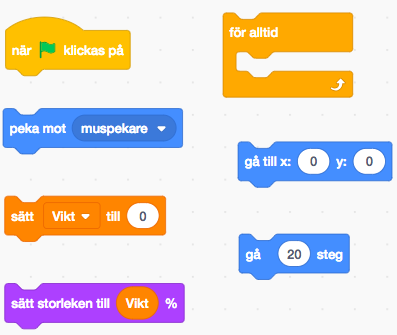
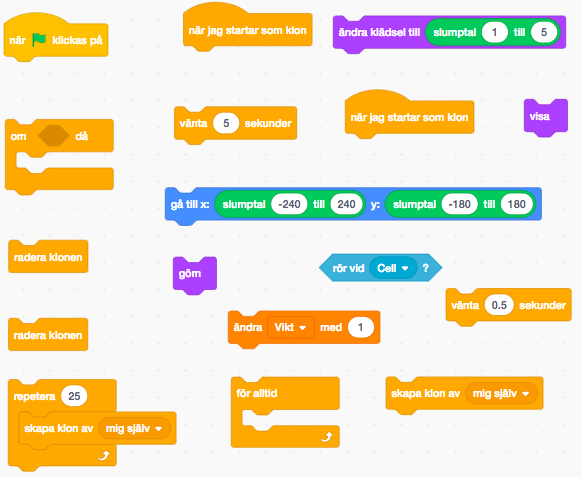
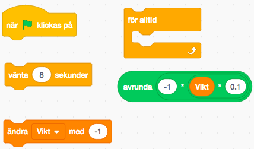
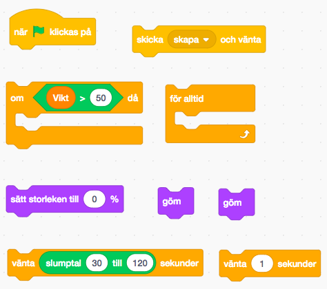

# Agar

Spelet <a href="http://agar.io/" target="_blank">Agar.io</a> är skapat av Matheus Valadares från Brasilien och har blivit en stor succé världen över. Vår version och instruktionen till den är skapad av Samuel Genheden, volontär i Göteborgs kodstuga! I det här spelet är du en cell som äter små kulor. Detta är en bra övning för dig som tycker om matte. Det blir mycket variabler och operatorer. Ett exempel på hur spelet kan se ut ser du här: <a href="https://scratch.mit.edu/projects/102124910/" target="_blank">https://scratch.mit.edu/projects/102124910/</a>

  

## 1: Bakgrund och sprajtar

Börja med att skapa en bakgrund och lägg till sprajten som du skall styra och ytterligare en mindre sprajt som skall bli mat.

1. Skapa ett nytt projekt och ta bort katten.

2. Rita en ny **bakgrund** som ser ut som ett rutnät. Det gör du lättast med **linjeverktyget**.

    Så här kan det se ut:
    

3. Rita en ny sprajt. Den skall var en ganska stor och fylla upp ungefär hälften av spelplanen. Den skall vara rund och **fylld cirkel**. Om du vill göra det lättare ritare du en större och om du vill göra det svårare ritare du en mindre cirkel.

4. Kalla denna sprajt **"Cell"**. Klicka på  bredvid sprajten och skriv in **"Cell"** istället för **"Sprajt1"**.

5. Nu behöver du mat och det gör du genom att rita en ny sprajt. Men rita bara en! De andra kommer du skapa med kod. Rita en liten cirkel som du fyller med valfri färg.

6. Kalla denna sprajt **"Mat"**.

7. Skapa en ny klädsel för sprajten genom att kopiera den första. Fyll den nya klädseln med en annan färg. Fortsätt så tills du har skapat 5 klädslar. Det skall se ut ungefär så här

  

  _Så här kan de olika klädslarna se ut._

## 2: Styra spelaren

Du skall styra sprajten **Cell** med musen och när du äter de små kulorna skall storleken på sprajten öka. Därför behöver vi en variabel **"Vikt"** som håller reda på storleken eller vikten.

1. Skapa en **variabel** som heter **"Vikt"**, den ska vara **synlig** på scenen. Du hittar variabler under kategorin **Data**.

2. Skapa ett skript till **Cell** som säger:

  * Starta när START klickas på

  * Gå till mitten av spelplanen, x:0 y:0

  * **Sätt** **"Vikt"** till 20

  * För alltid:

    * **Peka mot** muspekare

    * **Gå** 20 **steg**

    * **Sätt storleken till** **"Vikt"%**

  

> Testa ditt skript. Följer **Cell** med när du drar musen över spelplanen?

## 3: Mat

Nästa steg är att se till att du har något att äta. Vi har redan skapat en sprajt för maten och för att få flera kulor samtidigt kommer vi använda oss av KLONER. Det är som kopior av sprajten som skapas av ditt skript och bara finns så länge skriptet går.

1. Börja med ett skript för sprajten **Mat** som säger:

  * Starta när START klickas på

  * **Göm** sprajten.

  * Skapa 25 kloner genom att **Repetera** 25 gånger

  * För alltid:

    * **vänta** 0.5 **sekunder**

    * **skapa klon av** mig själv

  Det här skriptet ser till att det finns 25 kloner av **Mat** i början av spelet. Därefter kommer det dyka upp en ny klon varje halv sekund. Om du tycker det är för mycket eller för lite, kan du öka/minska antalet eller se till att det dyker upp kloner oftare/mer sällan.

2. Skapa sedan ett nytt skript för **Mat** som säger:

  * **När jag startar som klon**

  * **Visa**

  * **Byt klädsel till** mellan 1 och 5

  * **Gå till** en slumpmässig plats på spelplanen

  * För alltid:

    * Ändra **"Vikt"** med 1 och **radera** klonen **OM** rör **Cell**

  Det här skriptet körs varje gång en ny klon dyker upp. Klonen kommer dyka upp på en slumpmässig plats på spelplanen och kommer ha en slumpmässigt vald klädsel. Om **Cell** rör vid en klon försvinner den klonen.

3. Till sist skapa ett tredje skript som säger:

  * **När jag startar som klon**

  * **Vänta** mellan 3 och 15 **sekunder**

  * **Radera klonen**

  Det här skriptet ser till att ta bort klonen av **Mat** om den inte äts upp inom en viss tid.

  

> Testa ditt program! Du skall nu ha en enkel version av spelet där du kan styra din cell och äta upp små kulor.

## 4: Utökad speldynamik

Du skall nu se till att utökad spelet så att det svårare att spela ju mer poäng du får. Först skall du se till att **Cell** rör sig långsammare ju tyngre/större den är. För det andra skall du se till att den förlorar vikt ju tyngre/större den blir.

1. Just nu går **Cell** 20 steg varje gång du rör musen: . Ändra det så att den får ett värde som beror på vad variabeln **"Vikt"** har för värde:

  * Om du ändrar den till  så kommer **Cell** röra sig mer ju större den är. Till exempel så kommer den röra sig 20 steg i början och sedan 30 steg när du har ätit 10 kulor.  Detta är raka motsatsen mot vad vi vill.

  * Om du i stället ändrar till  så kommer den röra sig mindre ju större den är. Till exempel så kommer den röra sig 80 steg i början (100 - 20 = 80) och 70 steg när du ätit 10 kulor. Detta är ganska bra men den rör sig väldigt fort.

  * Multiplicera därför denna vikt med 0.1: . Nu kommer den röra sig 8 steg i början ((100 - 20)*0.1 = 8) och 7 steg när du ätit 10 kulor. Det är en lagom hastighet, men prova gärna att multiplicera med 0.2 eller 0.05 istället!  

2. Skapa ett nytt skript för **Cell** som säger:

  * Starta när START klickas på

  * För alltid:

    * **Vänta** (100 - **"Vikt**)*0.1 sekunder. Detta kommer gör att vi väntar 8 sekunder i början och 7 sekunder när du har ätit 10 kulor.

    * **Ändra "Vikt"** med -1\*(**"Vikt"**0.1) och avrunda. **-1** gör att vi minskar storleken/vikten och den kommer minska med 2 i början och 3 när du har ätit 10 kulor. Vi avrundar så att vi alltid minskar med ett heltal (t. ex. 2 istället för 2.2).

  

> Testa din kod! Du kan självklart göra det enklare eller svårare genom att ändra på skripten du gjorde ovan.

**Tips:** Tycker du att **Cell** rör sig för fort? Ändra koden i punkt 1. Tycker du att **Cell** förlorar vikt för fort? Ändra på hur många sekunder du väntar innan du förlorar vikten. Du kan också koda så att du inte förlorar vikt förrän du har kommit upp i en viss storlek.

## 5: En motståndare

Det är nu dags att vi skapar en motståndare. I stället för att den styrs av en annan spelare skall du koda datorn att vara din motståndare. Detta kallas _artificiell intelligens_ och är ett stort forskningsområde som många programmerare jobbar med. Här skall du koda en ganska dum motståndare som rör sig slumpmässigt över spelplanen.

> Se koden som ett förslag på vad du kan göra. Om du är lite kreativ så kan du koda en helt annan motståndare. Det finns inget som sätter stopp - bara din fantasi!

1. Rita en ny sprajt. Rita en fylld cirkel i valfri färg som  skall vara lite mindre än sprajten **Cell**.

2. Kalla denna sprajt **Fiende**.

3. Skapa ett skript för **Fiende** som säger:

  * Starta när START klickas på

  * **Göm**

  * För alltid:

    * OM **"Vikt"** är större än 50 OCH ett **slumptal** mellan 1 och 100 är **större än** 60.

      * **Skicka** meddelandet **"skapa"**

      * **Vänta** mellan 30 och 120 sekunder

      * **Sätt storleken till** 0 %

      * **Göm**

    * **Vänta** 10 sekunder.

  Detta skript kommer göra att **Fiende** dyker upp först när **"Vikt"** är större än 50. **Fiende** kommer också bara dyka upp med 40% säkerhet, det för att inte göra det allt för svårt. Om du vill kan du ta bort detta villkor. När **Fiende** har dykt upp kommer den stanna på spelplanen mellan en halv och 2 minuter (30 till 120 sekunder).

  

4. Skapa ett nytt skript för **Fiende** som säger:

  * **När jag tar emot** meddelandet **"skapa"**

  * **Gå till** en slumpmässig plats på spelplanen

  * **Peka i** en slumpmässig riktning

  * **Sätt storleken till** 100%

  * **Visa**

  * **Repetera tills "storlek"** < 100

    * **Gå** 5 steg

    * **Studsa, vid kanten**

    * **Ändra "Vikt"** med -5 och **vänta** 2 sekunder OM **Rör Cell**

  Det här skriptet kontrollerar hur **Fiende** skall bete sig. Nu dyker den upp på ett slumpmässigt ställe på spelplanen och går i en slumpmässig riktning. Detta fortgår tills **storlek** är mindre än 100, vilket är ett sätt att stoppa skriptet när den försvinner (blir gömd) av skriptet i punkt 3. Det är därför vi använder oss av en **"repetera tills"**-block istället för ett **"för alltid"**-block.

  

5. Ändra skriptet för **Mat**:

  * **Radera klonen** OM **Rör Fiende**. Placera denna kod på samma ställe där du känner av om du rör **Cell**.

## Färdig!

Grattis, nu har du gjort klart uppgiften.

**Glöm inte att spara ditt projekt!** Döp det gärna till uppgiftens namn så att du enkelt kan hitta den igen.

> **Testa ditt projekt**  
  Visa gärna någon det som du har gjort och låt dem testa. Tryck på DELA för att andra ska kunna hitta spelet på Scratch. Gå ut till projektsidan och låt någon annan testa spelet!

## Utmaningar

Har du tid över? Här kommer ett par utmaningar för dig som vill fortsätta. För tillfället kan du fortsätta spela spelet för alltid, men dessa extrauppgifter går ut på att avsluta spelet antingen när du har kommit upp i ett visst antal poäng eller när du har blivit biten av fienden.

### Game over

Du kan lägga in så att spelet slutar när du har kommit upp i 100. Du måste:

  * Stoppa all skript.

  * Visa ett meddelande på skärmen.

### Uppäten

I stället för att du förlorar 5 i vikt kan du koda så att du dör om **Cell** träffar **Fiende** mer än till exempel 5 gånger. Du måste:

  * Skapa en ny variabel som håller reda på hur många gånger **Cell** och **Fiende** har rört varandra.

  * Stoppa all skript om den variabel är större än 5.

  * Visa ett meddelande på skärmen.

## Frågeställningar

* Vad är en variabel?

* Vad är en klon?

* Varför kan det vara bra att skapa kloner i stället för att bara kopiera en sprajt flera gånger?

* Vad är slumptal och vad kan du använda dem till?

* Vad innebär det att du avrundar ett tal?
