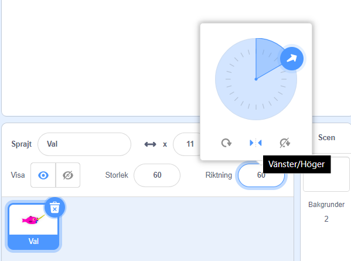
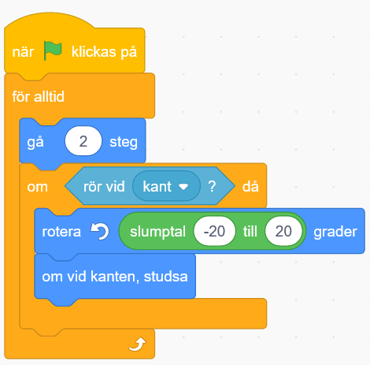
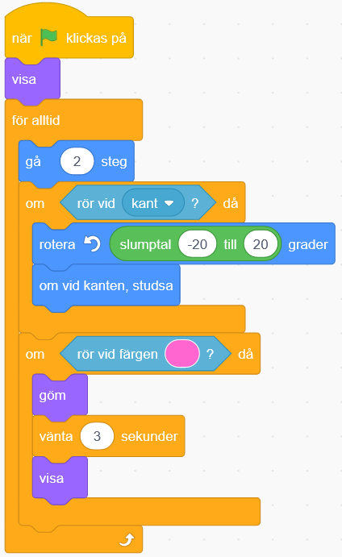
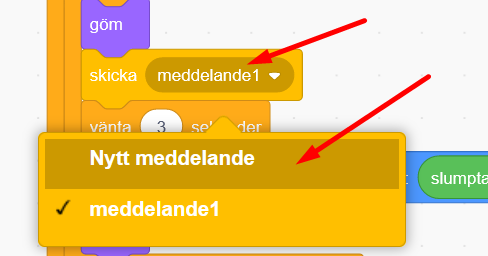
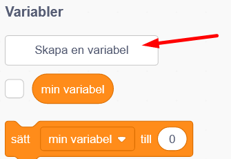
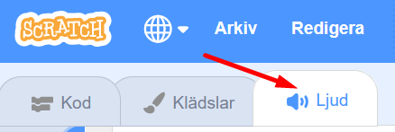
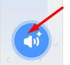
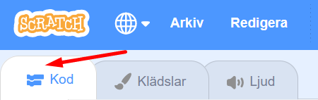

# Flygande valen

Nu ska du få göra en version av spelet Sky Whale där en narval flyger omkring och äter munkar för att få extra energi och samlar andra objekt för att flyga högre och högre! Här i vår version ska valen äta så många munkar som möjligt - varje munk ger poäng! Du kommer att lära dig att använda variabler och slumptal för att få spelet att fungera.

> Bläddra dig fram genom denna guide, steg för steg. Öppna även kodarverktyget Scratch genom att klicka på länken bredvid katt-figuren ovan eller via <a href="https://scratch.mit.edu" target="_blank">scratch.mit.edu</a>. Här kodar och skapar du själva spelet utifrån instruktionerna nedan. 

Här kan du se ett exempel på hur ett färdigt spel kan tänkas se ut: <a href="https://scratch.mit.edu/projects/104732551/" target="_blank">https://scratch.mit.edu/projects/104732551/</a>

  
  Då börjar vi koda!

## 1: En val som följer muspekaren
När du startar ett nytt projekt visas en katt som enda sprajt på vit bakgrund. Ta bort katten och rita en egen sprajt som ska vara spelets huvudkaraktär, den flygande valen. Den ska kunna styras med hjälp av muspekaren.

1. Tryck på **lilla soptunnan** på lilla kattfiguren nere till höger, så försvinner katt-sprajten ur ditt projekt.

   

2. Håll muspekaren över **"Välj en sprajt”** (katten med det vita plus-tecknet) nere i högra hörnet, så kommer en meny upp. Välj  **Måla** (penseln) i menyn - nu kan du rita en egen ny sprajt. Här får du själv prova dig fram och rita din egen val. Om du hellre vill använda en färdig sprajt ur Scratch sprajtbibliotek, så tryck bara på knappen **”Välj en sprajt”** (katten med det vita plus-tecknet).

  

3. För att spelet ska bli enklare att spela måste du nu minska storleken på valen. Ändra storleken genom att skriva in 50 i **rutan för storlek** (finns på höger sida). Välj en ännu mindre storlek om det behövs.

  

4. Tryck nu på kod-fliken i översta högra hörnet, så stängs ritverktyget och du kan börja koda. Dra sen ut ett kod-block för **HÄNDELSER**: **"när START (flaggan) klickas på”** och lägg ut på kodytan. Under detta block fäster du ett **”för alltid”** block som finns under orangea temat **KONTROLL**. Det här är en LOOP som gör att sprajten fortsätter röra sig hela tiden, om och om igen, så länge programmet är igång.

5. Inuti den orangea loopen lägger du ett block från **RÖRELSE** som säger **"peka mot muspekare”** och under den lägger du i blocket  **”gå 10 steg”**. Ändra värdet 10 i blocket mot ett värde som du tycker ger lagom hastighet! (Ju högre tal, desto snabbare rör sig sprajten i spelet.)

6. För att valen alltid ska starta från samma ställe på scenen varje gång spelet går igång, behöver du sätta en startposition. Gör såhär: Dra valen dit du vill ha den på scenen när ditt spel ska starta. Välj från **RÖRELSE** och dra ut **"gå till x: y:”** och koppla fast direkt under blocket **"när START (flaggan) klickas på"**, alltså ovanför loopen **"för alltd"**. De värden som står automatiskt efter X och Y är KOORDINATER för den plats där du placerat valen. Du kan alltid ändra om dem om du inte är nöjd.

  

**Tips:** För att valen inte ska vända sig upp och ned i spelet, klicka på sprajtens riktning och klicka sen på valet **vänster/höger** (de två små pilarna i nedre mitten som pekar mot varandra).

  

> Testa ditt projekt! Klicka på START-flaggan. Kan du styra valen med muspekaren? Går den lagom snabbt?
Vad händer om du inte rör muspekaren och valen hinner ikapp den? Hur ser det ut? Varför händer det, tror du?

7. Studsar din val omkring helt tokigt när den kommer nära muspekaren? Du kan förhindra det genom att lägga till blocket **"om <> då”** som finns under **KONTROLL**. Blocket för **"om <> då”** ska då läggas inuti loopen men utanför din kod för rörelsen.

8. Välj sen två olika block att lägga in från **OPERATORER** och **KÄNNA AV**. (Se bilden nedan för hur de ska läggas in i skriptet.) När du är klar ska val-sprajten göra detta:

  * Om **avståndet till muspekare är större än 10** då **Peka mot muspekaren** och **gå** 

  * Stå stilla om avståndet är mindre än eller lika med 10.

  

> Testa ditt projekt! Klicka på START. Fungerar det bättre att styra valen nu? 

## 2: En himmel som bakgrund
Du ska nu få rita en bakgrund till spelet. Här i exemplet är det en blå himmel, men du får hitta på som du vill. Du behöver inte rita moln på himlen, för det lägger du till som sprajtar. Då kan du välja att programmera dem senare i en av våra utmaningar!

9. För att ändra bakgrunden trycker du först på SCEN längst till höger och sedan på fliken BAKGRUNDER högst upp i mitten.

  
  

10. Tryck på **"Gör till bitmapp"**. Välj en färg under **"Fyll"**. Tryck på målarburken sedan på bakgrunden för att måla hela bakgrunden med den valda färgen.

11. Moln gör du som sprajtar. Rita egna med **"Måla”** eller välj en som redan finns. Sök efter **”Cloud”** för att hitta moln. Gör sprajten lagom stor och placera på scenen. Kopiera för flera moln, eller välj två olika moln om du vill!

  

## 3: Munkar att äta
I spelet ska valen äta munkar som rör sig över himlen. Du ska nu få skapa dessa sprajtar och få dem att röra sig slumpmässigt. Om du inte vill rita egna munkar själv finns det färdiga i Scratch. Du gör en munk-sprajt som du kodar, sen kopierar du den till fler munkar  efter att skriptet med dess kod är klart. På så vis slipper du koda om samma sak för vardera munk, det blir enklare. Nu börjar vi:

12. Rita en egen munk med **"Måla”** eller välj en färdig som redan finns i Scratch sprajt-bibliotek. Under kategorin **"Mat"** hittar du en munk, **”Donut”**. Ändra sprajtens storlek så den blir lagom stor och placera på en startposition på scenen med valen. Vänta med att kopiera sprajten till efter att du har programmerat den! Du behöver bara en sprajt för alla dina munkar - de blir kopior av varandra.

  

13. Då börjar vi koda vår munk. Se till att munk-sprajten är vald, så att du kodar munken och inte valen. Dra sen ut blocket för **HÄNDELSER**: **"när START (flaggan) klickas på”** till skriptytan för munk-sprajten. Under start-blocket fäster du sen blocket **”för alltid”** från **KONTROLL** - alltså en loop.

14. Inuti loopen fäster du nu olika block från **RÖRELSE**, **KONTROLL**, **KÄNNA AV** och även **"Operatorer"** som säger att sprajten ska:

  **För alltid**

  * Gå 2 steg

  * Om den känner av kanten, då ska den...
  
  * ...slumpmässigt rotera sig mellan -20 till 20 grader

  * Studsa vid kanten

  

**Tips:** Blocket för **"slumptal”** hittar du under **OPERATORER**. Du lägger in blocket inuti vita rutan för värdet på **”rotera”**-blocket. Skriv in de värden som du vill att skriptet ska slumpa mellan. Prova dig fram vilka värden som blir bra, minusvärde ger vänster och plusvärde är höger!

> Testa ditt projekt! Klicka på START. Flyger munken runt på himlen?

> Pröva att byta ut värdena för "slumptal” och ”gå”-blocken. Rör sig munken annorlunda? Vad gör "studsa om vid kanten”-blocket? Pröva att ta bort det blocket och se vad som händer!

## 4: Valen äter munkar
Nu ska du få valen att äta munken. När valen når fram till en munk och rör den med sin mun så ska munken bli osynlig för att sedan visa sig igen en stund senare igen, så att munkarna aldrig tar slut! Gör såhär:

15. Se till att din munk-sprajt är vald för att kunna kodas. Dra ut blocket **"om <> då"** som finns under **KONTROLL** och lägg det inuti munkens **”för alltid”**-loop, direkt inunder det första **"om <> då"**-blocket. Nu ska du lägga till block så att munken kan **KÄNNA AV** om den **”rör vid färgen __”** som alltså ska vara munnens färg på valen - och rör munken vid munnens färg så ska den bli osynlig under tre sekunder. Skriptet ska då innehålla instruktioner som säger att:

  **Om** rör valen, **då** ska munk-sprajten:

  * Gömma sig

  * Vänta 3 sekunder

  * Visa sig igen

 16. Se till att färgen i kodblocket **"rör vid färgen"** är den rätta munfärgen på din val. Det gör du genom att klicka på den runda färgcirkeln i blocket **"rör vid färgen"** och sen klicka på den lilla pimpetten som kommer fram längst ned i färgväljarmenyn. Klicka sedan på munnen på valen, så ändras färgen i blocket till den rätta. 

 

16.  Lägg till ett block för **"visa”** även direkt under **”när START klickas på”**. Annars kan det bli fel när du startar spelet! När tror du att det kan hända?

  

> Testa ditt projekt! Klicka på START. Försvinner munken när den nuddar vid valen? Spelar det någon roll vilken del av valen som rör vid munken?

18. Efter att den uppätna munken gömst sig kan du få den att flytta sig till en slumpvis plats på scenen innan den visar sig igen. För det behöver du lägga till ett block för **"gå till x: y:”** från **RÖRELSE** och två stycken block **”slumptal 1 till 10”** från **OPERATORER**. Lägg in slump-blocken i de två variabelcirklarna med siffror i det blå blocket, efter x och y. Skriv in munkens nya koordinater: -240 till 240 i den första och -180 till 180 i den andra. Då täcker du hela scenens koordinatsystem.

  

> Testa ditt projekt! Klicka på START. Försvinner munken endast om den nuddar valens mun? Dyker den upp igen på en ny slumpvis vald plats på scenen istället för där den blev uppäten?

## 5: Poäng för att äta munkar!
Det räcker inte med att bara äta munkar. Du ska kunna samla poäng också! För varje munk som valen äter ska spelet lägga till 1 poäng, och du vill kunna se hur många poäng du har fått.

För att räkna poäng behöver du med kod skapa en VARIABEL. Det kan liknas vid en låda där du lägger i eller tar ur saker. I variabeln lägger du ett värde, t ex en siffra, som kan öka eller minska. Variablen håller reda på hur många saker som ligger i lådan, exempevis hur många poäng du har i ditt spel, en poängräknare. Låter det konstigt? Snart får du se hur det fungerar. Låt oss koda en poängräknare som håller koll på hur många munkar valen ätit upp - ett poäng för vardera munk.

19. Börja med att skapa ett skript som får munken att skicka ett **meddelande** när den blir uppäten. Lägg till blocket **"skicka meddelande1"** från **HÄNDELSER** och fäst det under det lila **”göm”**-blocket. Klicka på texten **"meddelande1"** i blocket du just lade till och välj **"Nytt meddelande"**. Döp meddelandet till ”*jag är uppäten*” och tryck OK.

  

  

20. Markera nu SCEN istället för sprajtarna, så du kan lägga kod på scenen istället. Klicka på den lilla bilden av din scens bakgrund nere till höger i Sratch, så väljs scenen. 
Här gör du ett skript som tar emot meddelandet som den uppätna munken skickar ut. Du vill du tala om för scenen att den ska räkna poäng när munken blir uppäten. För det behöver klicka på **skapa en variabel** från temat **VARIABLER** som du döper till "*poäng*”. 

  

21. Från **"HÄNDELSER** tar du ut blocket **när jag tar emot meddelande1**. Klicka på lilla pilen bredvid "*meddelande1"* och välj meddelandet med namnet *"jag är uppäten"*, så den tar emot meddelandet från munken. 

22. Från **"VARIABLER"** drar du ut blocket **”ändra _min variabel_ med 1”** och fäst det under **”när jag tar emot "*jag är uppäten*"”**. Klicka på lilla pilen i blocket och ändra till vår skapade variabel som heter **poäng**, så det blir rätt.

23. För att nollställa spelets poängräknare vid start gör du ett till skript som säger att **"när START (flaggan) klickas på”** så **”sätt poäng till 0”**.

  

24. Nu kan du kopiera munk-sprajten så att du får så många munkar som du vill ha på himlen! Kopiera genom att högerklicka på den lilla bilden av din munk-sprajt under scenen och välj kopiera. Då får du en till likadan munk, med dess kod-skript och allt. Kopiera fram flera munkar tills du är nöjd. 

> **Glöm inte!** Du behöver ändra i vardera munk-sprajts **startposition** för var de ska vara när spelet börjar. Annars börjar alla munkar på exakt samma ställe när spelet börjar.

Om du vill att munkarna ska bli unika och därmed lite olika varandra kan du till exempel:

  * Ändra munkarnas färger med ritverktyget 

  * Ändra munkarnas storlek, hastighet och riktning

**Tips:** Om du vill kan du lägga till en ljudeffekt när valen äter upp munken! Från **LJUD** lägger du in ett block för **"starta ljud___"** i det skript du nyss gjort. Testa hur det låter. Vill du ändra till annant ljud kan du välja ett nytt i Scratch ljud-bibliotek. Det finner du genom att klicka på fliken som heter **LJUD** högt uppe till vänster i Scratch. Klicka sedan på den blå knappen **Välj ljud** i nedre vänstra hörnet. Välj ett ljud du gillar i biblioteket genom att klicka på det. Klicka slutligen på lilla pilen i ditt ljudblock i kodskriptet och välj det nya ljud du just lade till. Då spelas det istället. 

  
  
  
  
För att komma tillbaka till skriptytan där du kan koda igen, så klickar du på fliken **KOD** i övre vänstra hörnet. 
  

> Testa ditt projekt! Klicka på START. Står poängräknaren på 0 när du startar spelet? Ändras poängen när valen äter upp munkar?

## Färdig!

Grattis, nu har du gjort färdigt uppgiften.

* **Döp ditt projekt** i rutan högst upp till vänster.

* Tryck på **DELA** i mitten högst upp för att andra ska kunna hitta projektet på Scratch.

* Gå ut till projektsidan och låt någon annan **testa ditt spel**.

## Utmaningar

Nu är det fritt fram för dig att hitta på helt egna funktioner till ditt spel – eller fortsätta med någon av våra utmaningar:

  * Tidsgräns för spelet med en tidräknare (VARIABLER)

  * Minuspoäng för moln

  * Flera banor - andra figurer än valen?
  
  * Munkar i olika hastighet och rörelsemönster
  
  * Super-munkar som ger mer än 1 poäng - eller motståndare som ger minuspoäng eller stjäl tid?
  
  * En motståndare som åker runt och äter upp munkarna eller som du måste undvika för att inte bli game over?
  
  * Vad mer kan du komma på att spelet kan innehålla?

### Tidsgräns för spelet 
Klicka på spelet nedan för ett testa av en påskinspirerat spel med en tidräknare.  

  
Om du vill att spelet ska vara på tid kan du göra ett skript som avslutar spelet efter ett visst antal sekunder. Hur många munkar hinner valen äta på exempelvis 30 sekunder?

För det behöver du först skapa en ny VARIABEL som du döper till **"tid”** och som gäller för alla sprajtar. Sedan gör du ett skript för SCEN som talar om att:

  * Starta när spelet startar

  * Sätt **"tid”** till 30

  * **Repetera** tills **tid < 0**

    * **ändra tid med -1**

    * **vänta** 1 sekund

* Om **tid < 0**, då **stoppa alla skript** så att spelet avslutas

### Minuspoäng för moln
I spelet SkyWhale ska valen undvika vissa flygande objekt, som bläckfiskar och hårtorkar. Kan du skapa ett skript för att minska poäng, **"ändra poäng med -1”**, om valen flyger på ett moln?

### Flera banor
I spelet SkyWhale kan valen även flyga ut i rymden och ner till en undervattensvärld. Kan du göra ett skript som **byter scenens bakgrund** när spelaren når en viss poäng – så att ditt spel består av flera banor? Rita flera bakgrundsbilder eller välj ur biblioteket under fliken BAKGRUNDER.

## Frågeställningar

* Vad är slumptal och vad kan du använda dem till?

* Vad är en variabel?

* Vilka två sätt kan du använda för att köra kod när två sprajtar rör vid varandra?
