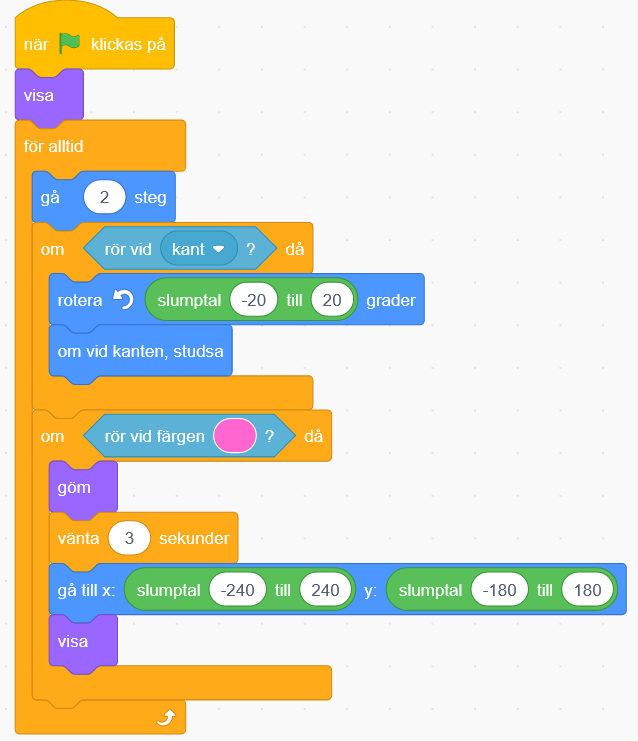

# Flygande valen

Nu ska du få göra en version av spelet Sky Whale där en narval flyger omkring och äter munkar för att få extra energi och samlar andra objekt för att flyga högre och högre! Här i vår version ska valen äta så många munkar som möjligt - varje munk ger poäng! Du kommer att lära dig att använda variabler och slumptal för att få spelet att fungera.

> Använder du Scratch 2.0 offline-version? <a href="https://www.kodboken.se/start/skapa-spel/uppgifter-i-scratch/flygande-valen-offline?chpt=0">Här hittar du samma instruktion anpassad utifrån kodning med nedladdningsbara Scratch 2.0 offline</a>.

> Bläddra dig fram genom denna guide, steg för steg. <a href="https://scratch.mit.edu" target="_blank">
  Öppna även kodarverktyget Scratch genom att klicka på länken bredvid katt-figuren ovan eller via www.scratch.mit.edu</a>. Här kodar och skapar du själva spelet utifrån instruktionerna nedan. 

Här kan du se ett exempel här: <a href="https://scratch.mit.edu/projects/104732551/" target="_blank">https://scratch.mit.edu/projects/104732551/</a>

  
  Då börjar vi koda!

## 1: En val som följer muspekaren
När du startar ett nytt projekt visas en katt som enda sprajt på vit bakgrund. Ta bort katten och rita en egen sprajt som ska vara spelets huvudkaraktär, den flygande valen. Den ska kunna styras med hjälp av muspekaren.

1. Tryck på **krysset** på katten som ligger till höger för att ta bort den.

   

2. Klicka på **"Rita ny sprajt”** (katten med den vita plus tecknet) nere i högra hörnet. Välj sedan **Måla** i menyn. Här får du själv prova dig fram och rita din egen val. Om du hellre vill använda en färdig sprajt, tryck på knappen **”Välj en sprajt”**.

  

3. För att spelet ska bli enklare att spela måste du minska storleken på valen. Klicka på sprajten och skriv in 50 i **rutan för storlek**. Välj ännu mindre 

  

4. Tryck på kod-fliken. Dra ut ett block för **HÄNDELSER**: **"när START (flaggan) klickas på”** till kodytan. Under den fäster du ett **”för alltid”** block som finns under oranga pluppen **KONTROLL**. Det här är en LOOP som gör att sprajten fortsätter röra sig så länge programmet är igång.

5. Inuti loopen lägger du ett block från **RÖRELSE** som säger **"peka mot muspekare”** och efter det **”gå 10 steg”**. Byt ut 10 mot ett värde som du tycker ger lagom hastighet!

6. För att valen alltid ska starta ifrån samma ställe på scenen, behöver du sätta en startposition. Sätt valen där du vill ha den på scenen. Välj från **RÖRELSE** **"gå till x: y:”** och koppla fast direkt under flaggan, innan loopen. De värden som står automatiskt efter X och Y är KOORDINATER för den plats där du har satt valen.

  

**Tips:** För att valen inte ska vända sig upp och ned i spelet, klicka på sprajtens riktning och välj **vänster/höger** (pilarna i mitten som pekar mot varandra)

> Testa ditt projekt! Klicka på START-flaggan. Kan du styra valen med muspekaren? Går den lagom snabbt?
Vad händer om du inte rör muspekaren och valen hinner ikapp den? Hur ser det ut? Varför händer det, tror du?

7. Du kan förhindra att valen flippar omkring som en galning genom att lägga till blocket **"om <> då”** som finns under **KONTROLL**. Blocket för **"om <> då”** ska vara inuti loopen men utanför din kod för rörelsen.

8. Nu ska du välja två block från **OPERATORER** och **KÄNNA AV**. När du är klar ska sprajten.

  * Om **avståndet till muspekare är större än 10** så ska sprajten **peka mot muspekaren** och **gå**. 

  * Är avståndet mindre än 10 så ska sprajten bara stå stilla.

  

> Testa ditt projekt! Klicka på START. Fungerar det bättre att styra valen nu? 

## 2: En himmel som bakgrund
Du ska nu få rita en bakgrund till spelet. Här i exemplet är det en blå himmel, men du får hitta på som du vill. Du behöver inte rita moln på himlen, för det lägger du till som sprajter. Då kan du välja att programmera dem senare i en av våra utmaningar!

9. För att ändra bakgrunden trycker du först på SCEN längst till höger och sedan på fliken BAKGRUNDER högst upp i mitten.

  
  

10. Tryck på Gör till bitmap. Välj en färg under fyll. Tryck på målarburken sedan på bakgrunden för att rita hela bakgrunden med den valda färgen.

11. Moln gör du som sprajtar. Rita egna med **"Måla”** eller välj en som redan finns. Sök efter **”Cloud”** för att hitta moln. Gör sprajten lagom stor och placera på scenen. Kopiera för flera moln, eller välj två olika moln om du vill!

  

## 3: Munkar att äta
I spelet ska valen äta munkar som rör sig över himlen. Du ska nu få skapa dessa sprajtar och få dem att röra sig slumpmässigt. Om du inte vill rita egna munkar själv finns det färdiga i Scratch. Du gör en sprajt som du kopierar efter att skriptet är klart.

12. Rita en egen munk med **"Måla”** eller välj en som redan finns. Under ”Mat” hittar du en munk, **”Donut”**. Gör sprajten lagom stor och placera på scenen. Vänta med att kopiera sprajten till efter att du har programmerat den! Du behöver bara en sprajt för donut.

  

13. Klicka på donuts först sedan tryck på fliken som säger KOD. Dra ut blocket för **HÄNDELSER**: **"när START (flaggan) klickas på”** till skriptytan. Under den fäster du blocket **”för alltid”** från **KONTROLL**.

14. Inuti loopen fäster du block från **RÖRELSE** som säger att sprajten ska:

  **För alltid**

  * Gå 2 steg

  * Slumpmässigt rotera sig mellan -20 till 20 grader

  * Den ska även studsa vid kanten.

  

**Tips:** Blocket för **"slumptal”** hittar du under **OPERATORER**. Du lägger in blocket inuti rutan för värdet på **”rotera”**. Skriv in de värden som du vill att skriptet ska slumpa mellan. Prova dig fram vilka värden som blir bra, minusvärde ger vänster och plusvärde är höger!

> Testa ditt projekt! Klicka på START. Flyger munken runt på himlen?
> Pröva att byta ut värdena för "slumptal” och ”gå”-blocken. Rör sig munken annorlunda? Vad gör "studsa om vid kanten”-blocket? Pröva att ta bort det blocket och se vad som händer!

Nu ska du få valen att äta munken. När valen når en munk ska den försvinna för att komma tillbaka en stund senare, så att munkarna inte tar slut!

15. Dra ut blocket **"om <> då: annars”** som finns under **KONTROLL** och lägg det inuti munkens **”för alltid”**-loop, efter rörelserna. Nu ska du lägga till block så att munken kan **KÄNNA AV** om den **”rör vid sprajten”** som är valen.

  **Om** rör valen, **då** ska munk-sprajten:

  * Gömma sig

  * Vänta 3 sekunder

  * Visa sig igen

16.  Lägg till ett block för **"visa”** även direkt under **”när START klickas på”**. Annars kan det bli fel när du startar spelet! När tror du att det kan hända?

  

> Testa ditt projekt! Klicka på START. Försvinner munken när den nuddar vid valen? Spelar det någon roll vilken del av valen som rör vid munken?

Munken försvinner oavsett vart på valen den nuddar. Men den borde egentligen bara försvinna om den nuddar valens mun eftersom den blir uppäten. Dessutom kan valen nu vänta på stället och äta upp munken igen när den dyker upp, vilket inte är så rättvist!

17. Hur kan du se till att munken bara försvinner om den nuddar valens mun? Se först till att din val har en speciell färg på sin mun, en färg som inte finns någon annanstans på sprajten. Du kan byta ut blocket **"rör sprajten”** mot **”rör färgen”** och välja färgen som valen har på sin mun.

  **Tips:** När du har ritat munnen kan du i skriptet för **"rör färgen”** välja färg genom att klicka på färgrutan och sedan färgväljaren och därefter på valens mun!

 

18. Sedan kan du få munken att gå till en slumpvis punkt på scenen innan den visas igen. För det behöver du lägga till ett **"gå till x: y:”** och välja **”slumptal”** som koordinater! Dra runt med munken på scenen för att se vilka värden som hela scenen har.

  

> Testa ditt projekt! Klicka på START. Försvinner munken bara om den nuddar valens mun? Dyker den upp igen på en slumpvis plats på scenen istället för där den försvann?

## 4: Poäng för att äta munkar!
Det räcker inte med att bara äta munkar. Du ska kunna samla poäng också! För varje munk som valen äter ska spelet lägga till 1 poäng, och du vill kunna se hur många poäng du har fått.

För att räkna poäng behöver du skapa en VARIABEL. Det kan liknas vid en låda där du lägger in saker. I variabeln lägger du ett värde, t ex en siffra, som kan öka eller minska. På samma sätt kan du ta ur eller lägga i fler saker i en låda. Låter det konstigt? Snart får du se hur det fungerar.

19. Börja med att skapa ett skript som får munken att skicka ett **meddelande** när den blir uppäten. Fäst blocket **"skicka"** från **HÄNDELSER** under **”rör färgen”** och ändra till ett nytt meddelande i rullistan. Döp meddelandet till ”*jag är uppäten*”.

  

20. Markera nu SCEN och gör ett skript för den som tar emot meddelandet. Här vill du tala om för scenen att den ska räkna poäng. För det behöver du **skapa en variabel** från **variablar** som du döper till "*poäng*”. Fäst blocket **”ändra **_poäng_** med 1” **efter** ”tar emot meddelandet”**.

22. För att nollställa poängen vid start gör du ett till skript som säger att **"när START (flaggan) klickas på”** så **”sätt poäng till 0”**.

  

23. Nu kan du kopiera sprajten så att du får så många munkar som du vill ha på himlen!

Om du vill att munkarna ska bli unika kan du:

  * Ändra munkarnas färg och storlek

  * Ändra munkarnas hastighet och riktning

**Tips:** Om du vill kan du lägga till en ljudeffekt när valen äter munken! Lägg in ett block för **"spela ljudet”** i det skript du nyss gjort.

> Testa ditt projekt! Klicka på START. Står poängräknaren på 0 när du startar spelet? Ändras poängen när valen äter munkar? Står poängräknaren på 0 när du startar spelet?

## Nu har du ett färdigt spel!

Grattis, nu har du gjort färdigt uppgiften.

* **Döp ditt projekt** i rutan högst upp till vänster.

* Tryck på **DELA** högst upp till höger för att andra ska kunna hitta projektet på Scratch.

* Gå ut till projektsidan och låt någon annan **testa ditt spel**.

## Utmaningar

Nu är det fritt fram för dig att hitta på helt egna funktioner till ditt spel – eller fortsätta med någon av våra utmaningar:

  * Tidsgräns för spelet

  * Minuspoäng för moln

  * Flera banor

### Tidsgräns för spelet

Om du vill att spelet ska vara på tid kan du göra ett skript som avslutar spelet efter ett visst antal sekunder. Hur många munkar hinner valen äta på 30 sekunder?

För det behöver du först skapa en ny VARIABEL som du döper till **"tid”** och som gäller för alla sprajtar. Sedan gör du ett skript för SCEN som talar om att:

  * Starta när spelet startar

  * Sätt **"tid”** till 30

  * **Repetera** tills **tid < 0**

    * **ändra tid med -1**

    * **vänta** 1 sekund

* Om **tid < 0**, då **stoppa alla skript** så att spelet avslutas

### Minuspoäng för moln
I spelet SkyWhale ska valen undvika vissa flygande objekt, som bläckfiskar och hårtorkar. Kan du skapa ett skript för att minska poäng, **"ändra poäng med -1”**, om valen flyger på ett moln?

### Flera banor
I spelet SkyWhale kan valen även flyga ut i rymden och ner till en undervattensvärld. Kan du göra ett skript som **byter scenens bakgrund** när spelaren når en viss poäng – så att ditt spel består av flera banor? Rita flera bakgrundsbilder eller välj ur biblioteket under fliken BAKGRUNDER.

## Frågeställningar

* Vad är slumptal och vad kan du använda dem till?

* Vad är en variabel?

* Vilka två sätt kan du använda för att köra kod när två sprajter rör vid varandra?
