# Jakten på nyckeln

Har du någon gång letat efter en skatt? I denna uppgift ska du få koda en enklare skattjakt. Du kommer få öva dig på koordinater som är ett sätt att ange någon eller någots position. I spelet kommer det vara skattens position som är viktig.

> Bläddra dig fram genom denna guide, steg för steg. <a href="https://scratch.mit.edu" target="_blank">
  Öppna även kodarverktyget Scratch genom att klicka på länken bredvid katt-figuren ovan eller via www.scratch.mit.edu</a>. Här kodar och skapar du själva spelet utifrån instruktionerna nedan. 

Så här kan det se ut:
<a href="https://scratch.mit.edu/projects/172502923/" target="_blank">https://scratch.mit.edu/projects/172502923/</a>

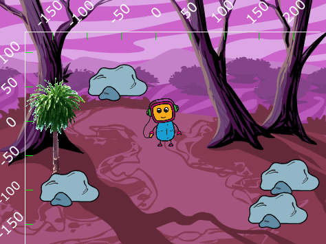

##  1 - Remixa ett projekt

Vi börjar med att remixa ett projekt som redan finns på Scratch.

1. Öppna din webbläsare och gå till

    <a href="https://scratch.mit.edu/projects/188767375/" target="_blank">https://scratch.mit.edu/projects/188767375/</a>

2. Klicka på knappen **"Remix"** så att du får din egen version av projektet.

Nu kommer du komma in i Scratch studion där du kan koda din egen version.

3. Döp om projekt till något som passar bättre.

*Namnet på projektet har fått ordet "remix" på slutet*

I projektet har du nu två sprajter: 

1. En robot-sprajt som är din spelare

2. Koordinataxlar som visar x- och y-axeln.

Innan vi börjar koda ska vi först titta lite närmare på våra två sprajter och koordinatsystemet i Scratch.

1. Markera sprajten **Koordinater** så får du upp koden för denna sprajt. Det är en enkel kod som helt enkelt placerar sprajten på rätt ställe på skärmen.

    

2. Klicka på fliken **Klädslar** kan du se att det finns koordinatsystemet uppritat på olika sätt.

    

3. Klickar på klädseln **"uppe_svart"**

    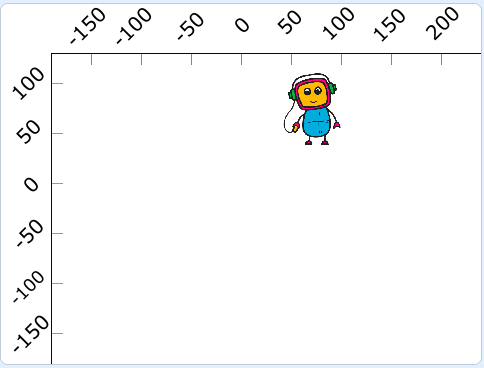

> Detta koordinatsystem visar x-axeln i övre delen av scenen och y-axeln till vänster, vilket gör att de inte är i vägen för spelet. Om du känner dig osäker på detta koordinatsystem så använd klädseln **"mitten_svart"**

**Nu ska vi kolla så att placeringen av koordinatsystemet fungerar!**

1. Klicka på sprajten **Robot** så att den blir markerad. Koordinaten för en sprajt visas nedanför scenen. Vilka koordinater har sprajten?

    

3. Flytta omkring **Robot-sprajten** på scenen och se hur koordinaterna ändrar sig

4. Placera **Robot**-sprajten ungefär vid **x: 0, y:0**. Denna punkt kallas *origo*, och är mitt på scenen.

## 2 - Sätta bakgrund

Du ska få börja med att ladda en bakgrundsbild för spelet. Det kan vara vad du vill, men i detta exempel har vi valt en spöklik djungel.

1. Klicka på **Välj bakgrund** från bibliotek

    

2. Markera en bakgrund och klicka på **Ok**

> **Tips!** Om du har valt en mörk bakgrund kan det vara svårt att se koordinatsystemet. Om det är så kan du byta färg på koordinatsystemet

3. Markera **Koordinater** sprajten och klicka på fliken **Klädslar**

4. Markera klädseln **uppe_vit** så blir färgen på koordinaterna vit

    

Så här kan spelet se ut nu!

## 3 - Flytta roboten

Nu ska du få koda roboten så att den förflyttar sig på scenen. Det sker genom att ställa en fråga till spelaren om vilka koordinater den vill att roboten ska gå till.

1. Markera **Robot** sprajten

2. Skapa följande kod

    1. När **START** klickas på

    2. För alltid:

        1. OM tangenten **x** är nedtryckt

            1. Fråga **"Vilken är x-koordinaten?"** och vänta

            2. Sätt x till SVAR

> Tryck ner **tangenten x** och testa. Kommer en ruta upp där du kan ange vilken x-koordinaten är? Förflyttar sig roboten till den x-koordinat du angav

Vi vill självklart att den ska kunna röra sig längs y-axeln så fortsätta på koden du skapade ovan.

1. Innanför **"För alltid"**-loopen lägg följande kod

    1. OM **y**-tangenten är nedtryckt

        1. Fråga **"Vilken är y-koordinaten?"** och vänta

        2. Sätt y till SVAR

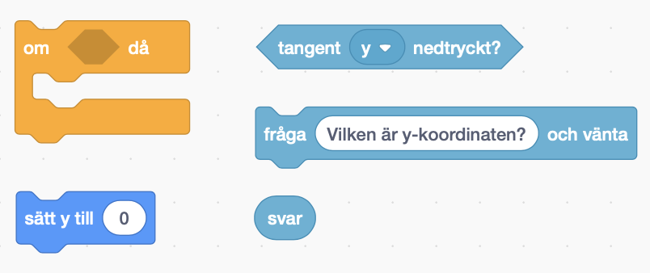

*Dessa kodblock behöver du!*

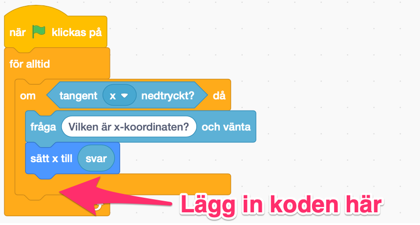

> Testa programmet. Tryck ner **tangenten y**. Kommer en ruta upp där du kan ange vilken y-koordinaten är? Förflyttar sig roboten till den y-koordinat du angav

* För att roboten ska starta på samma ställe varje gång så ska vi lägga in ett **Start-skript**.

* Precis efter blocket med **"När START klickas på"**, lägger du in följande block

    1. Gå till **x:0 y:0**

    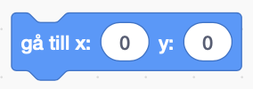

> Testa spelet igen! Var hamnar roboten när spelet startar?

## 4: Gömma nyckel  

Nu ska vi lägg till målet för spelet. En nyckel som roboten ska hitta.

1. Klicka på **"Välj sprajt från biblioteket"**

    

2. Markera Nyckeln och klicka på **Ok**

3. Ändra storleken **Nyckeln** så att den blir mindre. Storleken för sprajten hittar du precis nedanför scenen.

    

4. Placera nyckeln på ett bra ställe på spelplanen

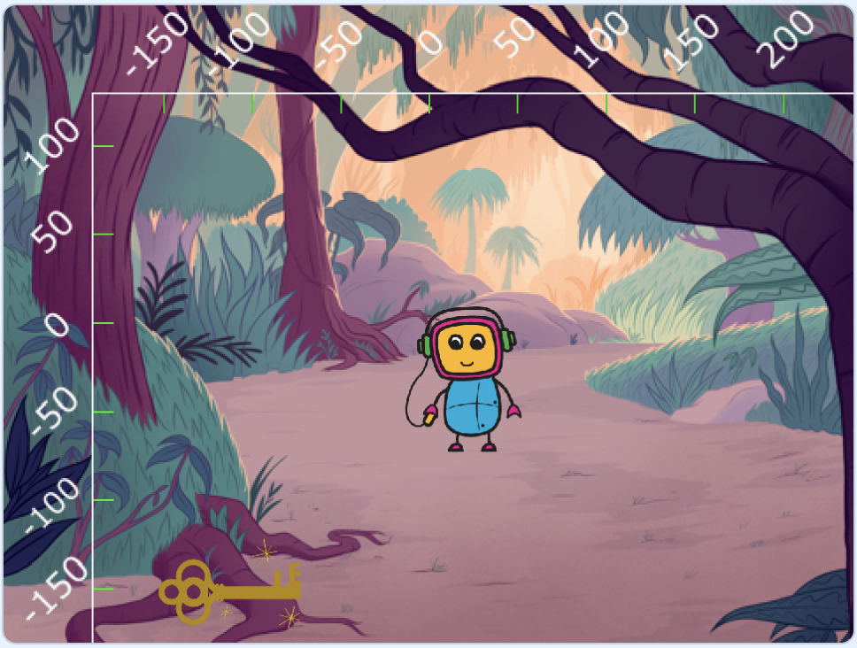

1.  Skapa ett skript för **nyckeln** som säger

    1. När START klickas på

    2. Gå till **x: y:** . (De koordinater som står i detta kodblock kommer vara de koordinater som nyckeln är placerad på.)

    3. Göm

    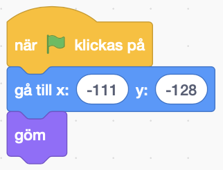

2. Skapa ett nytt Skript för nyckeln:

    1. Dra in ett block **"när jag tar emot meddelande1"** till skriptområdet

    

    2. Klicka på den lilla **nedåtpilen** på kodblocket och klicka på **"nytt meddelande”**.

    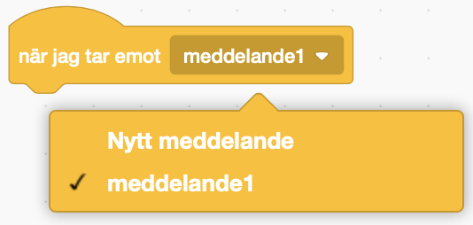

    3. I rutan som dyker upp skriver du **"visa nyckeln"**.

    

    4. Under detta kodblock lägger du in följande kod

        1. Gå till **översta lagret**

        2. Visa

        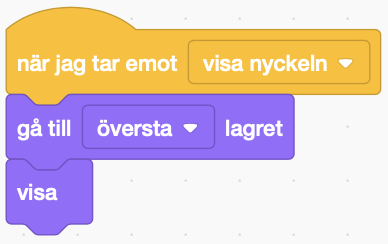

> Nu kommer nyckeln att visas när den tar emot meddelandet **"visa nyckeln"**. Men när kommer det ske? Jo, när roboten är vid nyckeln. Det ska du koda nu. Vi ska säga åt roboten att när den är alldeles i närheten av nyckeln ska nyckeln visas på scenen. För att det inte ska bli allt för svårt, räcker det att roboten är 15 pixlar ifrån nyckeln.  

1. Markera **Robot**-sprajten.

2. Skapa följande skript och lägg det innanför **"För alltid"**-loopen.

    1. OM avstånd till **Key** är mindre än **15**

        1. Skicka meddelandet **"visa nyckeln"** och vänta

        2. Säg **"Jag hittade den!"** i 2 sekunder

        3. Stoppa alla

        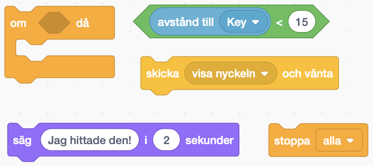

> Testa spelet! Klicka på START och försök styra roboten så att den är vid nyckeln. Visar sig nyckeln?

> Testa spelet på en kompis! Har din kompis svårt att hitta nyckeln?

## 5: Ledtrådar - stenar

Om du låter en kompis spela programmet nu så kommer det vara svårt att hitta nyckeln eftersom spelplanen är så stor. Därför ska vi skapa ledtrådar som gör det lite lättare att hitta nyckeln.

Först vi ska göra är att skapa ett antalet stenar som är utplacerade på spelplanen. Under en av dessa kommer nyckeln vara gömd.

1. Skapa en **ny sprajt från biblioteket**

2. Markera **Stenarna** och klicka på **OK**.

3. Lägg den så att den är ungefär ovanför nyckeln

4. Skapa ett skript för denna sprajt som säger

    1. När START klickas på

    2. Gå till **x: y:**. Här anger du samma start-koordinater som för nyckeln. På så sätt kommer stenen vara precis där nyckeln är.

    

4. Skapa nu **minst 3 nya sprajter** som också är stenar. Placera ut dem på spelplanen, men

    1. Inte för nära Roboten

    2. Inte för nära nyckeln

5. Dessa sprajter behöver ingen kod.

Så här kan det se ut nu:

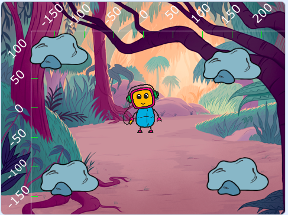

> **Tips:** Om du märker att Roboten hamnar bakom stenarna, så kan du lägga in kodblocket **Gå till "översta" lagret** precis i början av Robotens startskript.

## 6: Ledtrådar  - roboten

En annan ledtråd som vi ska skapa är att **Roboten** kommer förändra utseende om det "bränns", det vill säga om Roboten kommer i närheten av nyckeln.

1. Klicka på fliken **Klädslar** för sprajten **Robot**.

    

2. Välj ut en klädsel som du tycker roboten ska ha när den är långt ifrån nyckeln och en klädsel som den ska ha när den är nära

3. Du kan också rita på klädslarna för att göra dem olika. Här i bilden nedan har roboten fått röda kinder.

    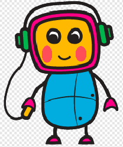*En robot med röda kinder*

1. Markera Roboten

2. Skapa följande skript innanför **"För alltid"**-loopen

    1. OM avstånd till **Key** är mindre än **45**

        * Byt till klädsel **Robot3**. Välj den klädsel som roboten ska ha i närheten av nyckeln.

    2. ANNARS

        * Byt till klädsel **Robot1**. Välj den klädsel som roboten ska ha långt i från nyckeln.

    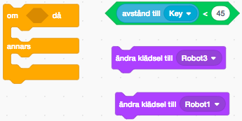

## 7: Slumpmässig placering

Denna uppgift är valfritt men gör att spelat blir roligare för dig som har kodadet det. Nu ska du nämligen koda så att nyckeln hamnar på en slumpmässig plats på spelplanen!

1. Markera sprajten **Robot**

2. Lägg in ett block som säger **när jag tar emot** meddelandet **"starta"**

3. Flytta ALL kod som ligger under blocket **"när start klickas på""** till det nya blocket.

    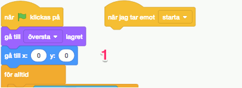

4. Lägg in ett block **Gå till x:0 y:0** under **"när start klickas på"**

    

> Nu ska roboten starta i mitten av spelplanen men den kommer inte kunna styras innan meddelande **starta** tas emot. Testa!

1. Markera **nyckeln**

2. Skapa en variabel som heter **nyx**

    1. Gå till kategorin **Data** och klicka på **"Skapa en variabel"**

    2. Döp variabeln till **nyx**

    

3. Skapa också en variabel som heter **nyy**

4. Visa INTE **nyx** och **nyy** på skärmen, genom att klicka bort krysset bredvid variablerna

    

5. Högerklicka på koden under **"när start klickas på"** och "Ta bort block"

    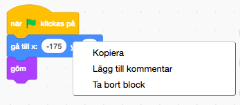

6. Skapa ett nytt skript som säger

    1. När **start** klickas på

    2. Gå till **x:** **x-läge av Robot** **y:** **y-läge av Robot**

    3. Repetera tills **avstånd till Robot > 50**

        1. Sätt **nyx** till ett **slumptal** mellan -160 och 200

        2. Sätt **nyy** till ett **slumptal** mellan -150 och 100

        3. Gå till **x: nyx**, **y: nyy**

    4. Göm

    5. Skicka meddelandet **starta**

    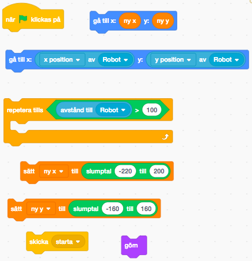

7. Markera **stenen som är ovanpå nyckeln**

8. Skapa ett skript som säger

    1. När meddelandet **starta** tas emot

    2. Gå till **x: nyx**, **y: nyy**

    

> Testa spelet! Nu ska en av stenarna placeras ut slumpmässigt på spelplanen.

1. Skapa följande skript för de andra stenarna i spelet

    1. När meddelandet **starta** tas emot

    2. Gå till **x: slumptal** mellan -160 och 200, **y: slumptal** mellan -150 och 100

    

##  Färdig!

Grattis, nu har du skapat ett nytt spel!

Glöm inte att spara ditt projekt! Döp det gärna till uppgiftens namn så att du enkelt kan hitta den igen.

> **Testa ditt projekt**

> Visa gärna någon det som du har gjort och låt dem testa. Tryck på DELA för att andra ska kunna hitta spelet på Scratch. Gå ut till projektsidan och låt någon annan testa spelet!

## Utmaningar

### Hinder på vägen

Du kan lägga till hinder i vägen för den som spelar. Då blir det lite kluriga att ta sig mellan stenarna.

1. Lägg till en sprajt, t.ex. en dinosaurie

2. I **"för alltid"**-loopen för **Roboten** lägg in ett skript som säger

    1. OM avstånd till **Dinosaurie** är mindre än **15**

        1. Säg **"Neeej!** I 2 sekunder

        2. Stoppa alla

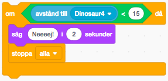

Du kan lägga in flera olika sorters sprajtar.

Du kan också rita saker på bakgrunden i en särskild färg som du kan känna av om **Roboten** nuddar.

### Begränsa antalet gissningar

Nu kan spelaren gissa hur många gånger som helst. Du kan göra det lite svårare genom att koda ett maximalt antal gissningar.

1. Börja med att skapa en variabel som heter **"antal gissningar"**

2. Varje gång du flyttar Roboten ändrar du värdet på **"antal gissningar"** med 1.

    

3. Du får också kolla om **"antalet gissningar"** är lika med det maximala antalet som du har bestämt.

4. När detta sker så stoppar du alla skript

## Frågeställningar

Vad är en koordinat?

Hur lång är x–axeln i Scratch?

Hur lång är y–axeln i Scratch?

Vilken koordinat har mitten på scenen?

Vad innebär det att Remixa ett projekt?

Vad är ett startskript? Varför är det bra att använda det?

Vad är ett meddelanden? Vad kan du använda det till?

Vad är en variabel? Hur kan du använda en variabel för att få input från spelaren?
