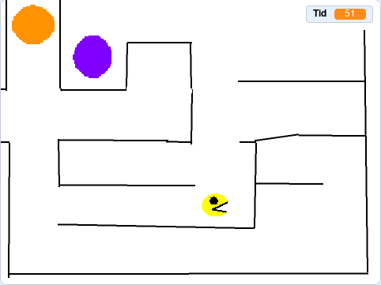
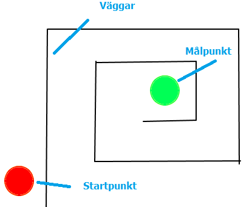
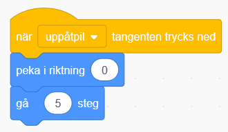
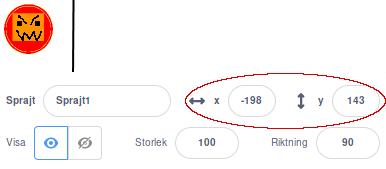
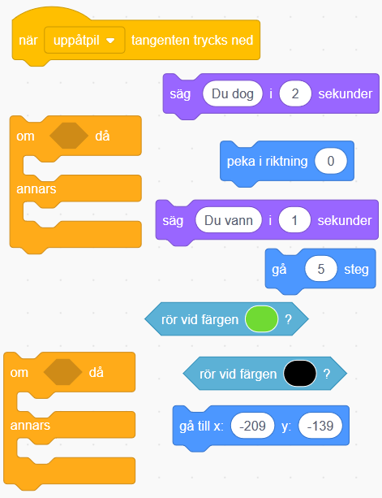
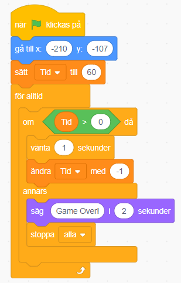
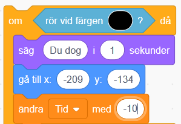
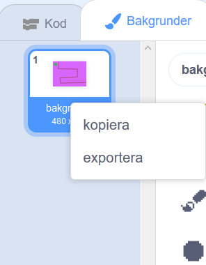
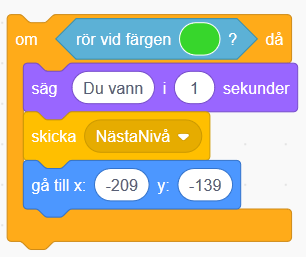

# Labyrinten

## Checklista

 - [ ] Rita labyrint
 - [ ] Styra sprajten
 - [ ] Känner sprajten av väggarna?
 - [ ] Känner sprajten av att den gått i mål?

EXTRA:
 - [ ] Timer
 - [ ] Fler banor

## Beskrivning

Det här är ett spel där du ska försöka ta dig igenom en labyrint och komma till nästa nivå, en ny bana. Det är ett roligt spel för dig som vill hitta på och rita mycket själv! Du kommer att få lära dig att använda variabler och funktioner.

> Bläddra dig fram genom denna guide, steg för steg. Öppna även kodarverktyget Scratch genom att klicka på länken bredvid katt-figuren ovan eller via <a href="https://scratch.mit.edu" target="_blank">scratch.mit.edu</a>. Här kodar och skapar du själva spelet utifrån instruktionerna nedan.

Din labyrint kan se ut som du vill. Här visar vi två exempel på hur olika spelet kan se ut, beroende på vilken form labyrintens väggar har:

* <a href="https://scratch.mit.edu/projects/52105140/" target="_blank">Exempel 1</a>

* <a href="https://scratch.mit.edu/projects/34921466/" target="_blank">Exempel 2</a>

Dags att börja koda!

## 1 – Rita en labyrint

Du väljer själv hur du vill rita din labyrint, men du måste följa vissa **regler** för att få spelet att fungera.

1. Skapa ett nytt projekt. Ta bort katt-sprajten genom att trycka på soptunnan på den lilla kattbilden under scenen.

2. Tryck på SCEN långt ned till höger och byt till fliken BAKGRUNDER som du finner långt upp till vänster. 

Börja med att fixa **bakgrundsfärg**, genom att fylla bakgrunden med en färg du gillar. För att detta ska fungera, behöver du först trycka på knappen som det står **Gör till bitmapp** på.

Sedan väljer du en färg du gillar och klickar på verktyget som ser ut som en liten hink för att fylla bakgrunden genom att klicka på den stora vita rutan bredvid.

3. Rita sedan din labyrint i en annan färg än bakgrunden. Kom ihåg att ha ganska stort **mellanrum mellan** **"väggarna"** så att en sprajt kan gå mellan utan att stöta i och se till att alla väggarna har **samma färg**. Om du vill ha raka streck kan du använd LINJE-verktyget.

4. Rita en **startpunkt**, den får **inte ha samma färg** som väggarna eller bakgrundsfärgen. Du kan till exempel göra cirklar med CIRKEL-verktyget.

  

5. Rita sedan en **målpunkt i slutet av din labyrint**. Målpunkten måste också ha en **helt egen färg**. (Bilden nedan är bara ett exempel för att förklara, hur din labyrint ska se ut och vad du ritar och vilka färger du vill ha väljer du helt själv.)

  

## 2 – Gör din karaktär

Nu ska lägga till en sprajt eller figur som ska kunna styras genom labyrinten, utan att röra väggarna. Välj en färdig sprajt i Scratch som du lägger till, eller rita din egen. Vad för karaktär vill du spela som? Om du vill rita din egen sprajt, så gör du så här:

6. Välj **Ny Sprajt** och klicka på **Måla** som ser ut som en liten pensel. Rita din egen sprajt-figur hur du vill, men tänk på att den ska kunna styras genom labyrinten och enkelt svänga i banans hörn och kanter. Var noga med att sprajten ritas med **andra färger** än din  bagrund och labyrintens väggar. **Efter** att du ritat färdigt din sprajt kan du förminska den så att **den blir tillräcklig liten** för att få plats att ta sig igenom labyrinten ordentligt.

   

  _Exempel på en sprajt._
  
Ändra stoleken på din sprajt så att den passar in i labyrinten, från 100% full storlek till lägre procenttal. Prova dig fram tills det passar.

   

  Nu vill du att din sprajt ska kunna röra sig igenom labyrinten.

7. Gör ett skript för din sprajt som säger:

  * Starta när **uppåtpil**-tangenten trycks ned

  * Då ska sprajten först **peka uppåt** (Peka i riktning 0 grader)

  * Sedan **röra sig** ett par steg

  
  
  8. Gör sedan tre till likadana skript, så du kan styra genom labyrinten åt alla håll. Ändra piltangentknapp och riktningen för att styra **vänster**, **höger** och **nedåt**.

> Tänk på! Det är viktigt att ha olika styrknappar och riktningar i de fyra skripten, så att din karaktär kan svänga i labyrintens bana.

> Testa ditt projekt! Klicka på START. Kan du röra din sprajt åt alla håll? Går den i lagom hastighet? Nu kan du använda piltangenterna för att styra sprajten, men du skulle också kunna välja helt andra tangenter.

**Tips:** Du kan själv ändra hastigheten genom att ändra hur många steg sprajten tar när den rör sig. Ju fler steg den tar, desto längre fram kommer den när den springer, alltså går det fortare.

## 3 – Vinna eller förlora

Dags att göra det här till ett spel! Du behöver se till så att varje gång din sprajt rör väggen i labyrinten, förlorar du och hamnar tillbaka på startpunkten. Men nuddar sprajten målpunkten så vinner du.

9. Ta först reda på var din startpunkt är. Dra din sprajt till mitten på **startpunkten** på SCENEN. Titta på vad din sprajt har för KOORDINATER (alltså vilken position på scen-ytan med x och y). Kom ihåg eller skriv upp dem!

  

  Nu behöver du uppdatera alla skript för **rörelser** så att sprajten hela tiden **känner av** ifall den är i mål eller nuddar en vägg.

1. Börja med skriptet för **uppåt** och ändra så att det säger:

  * Starta när **uppåtpil**-knappen på datorns tangentbord trycks ned

  * **Känn av om** sprajten har nuddat en vägg (alltså den färg som din vägg har)

    * **Då** ska sprajten **säga "Du dog"** och **gå tillbaka till** startpunkten

  * **Känn av om** sprajten har nuddat målpunkten (alltså dess färg)

    * **Då** ska sprajten **säga "Du vann"**

  * **Annars** ska sprajten **röra sig** som förut (peka uppåt och gå ett par steg framåt)

  

  **Tips:** Förstår du hur sprajten ska kunna **känna av** väggen, startpunkten och målpunkten? Kom ihåg att de har olika **färg**! Förstår du hur sprajten ska kunna **veta var startpunkten är**, när den ska gå tillbaka dit? Tänk på att du har tagit fram dess KOORDINATER tidigare. Minns du?

11. Gör nu samma ändringar för alla skripten. Kom ihåg att du fortfarande måste ha rätt riktning och tangent för varje skript.

> Testa ditt projekt! Klicka på START. Går sprajten åt rätt håll och med en hastighet som känns bra? Säger den att "Du dog!" när du nuddar en vägg? Går den tillbaka till startpunkten? Säger den "Du vann!" när du nuddar målpunkten? 

## 4: En timer

Dags att göra spelet lite svårare! Du ska se till att spelaren har en viss tid på sig att ta sig igenom labyrinten. Om du inte är i mål när tiden är slut förlorar du! Nu ska du skapa en timer, alltså en tidräknare.

För att skapa en tidräknare behöver du först skapa en ny variabel som ska heta "Tid". En variabel är lite som en låda som håller reda på saker som sker i spelet, så som hur mycket tid som gått eller hur många poäng som sprajten fått. Gör så här:

1. Under tema VARIABLER finns överst **Skapa en variabel**. Klicka på den och skriv in **Tid** och tryck på OK. Nu har det skapats ett nytt kodblock under tema VARIABLER som heter **Tid**. Du kan också se tidräknaren i ditt labyrintspel på SCENEN. Men vi behöver koda hur räknaren ska fungera, så att den räknar ned sekunderna. Gör så här:

2. Gör ett helt nytt skript för sprajten som säger (och se exempelbilden nedan):

  * Starta när **START-flaggan** klickas på

  * **Gå till** startmarkeringen i spelet (sätt X och Y-position)

  * **Sätt Tid** till 60 sekunder (eller välj själv hur många sekunder ditt spel ska ha)

  * **För alltid om Tid > 0**

    * **Då** ska sprajten **vänta** 1 sekund

    * **Ändra Tid** med -1

    * Annars **säg "Game Over!"** och **stoppa alla** skript

  

  Nu har du en timer, det vill säga en tidräknare! Men för att göra det ännu svårare ska du nu säga åt sprajten att den förlorar extra mycket tid om den nuddar väggen.

3. Lägg till ett block som **ändrar Tid med -10** på alla dina skript som kollar om sprajten har nuddat väggen (alltså den färg din vägg har). Kommer du ihåg vilka skript det är?

  

  _Så här ska alla skript se ut som kollar om sprajten nuddar väggen._

> Testa ditt projekt! Klicka på START. Räknar tiden ned? Vad händer om du nuddar väggen? Är det enkelt eller svårt att spela? Tänk på att du kan ändra tiden som timern startar med, om du vill.

## 5 – Flera banor

Som spelet ser ut nu händer ingenting när du vinner. Det ska du ändra på nu! Du ska få göra så att du kommer till en ny bana, en ny nivå, när du tagit dig genom labyrinten.

1. Gå till fliken BAKGRUNDER i övre vänstra hörnet. På vänster sida finns en liten bild av din nuvarande bakgrund. Högerklicka på lilla bakgrundsbilden så får du upp valet **kopiera**. Nu kan du få en kopia av din bakgrund. Se till att du har din nya kopia av bakgrunden vald och välj verktyget som ser ut som ett litet suddgummi och sudda sen bort allt i din labyrint **förutom startpunkten**.
  
  

2. Du kan nu rita en ny labyrint precis som du vill ha den, men kom ihåg att använda **samma färger på väggarna och på målpunkten som i förra labyrinten**.

> Tips! För att få exakt samma färg på vägg och mål på den nya banan, kan du trycka på färgväljaren och sen på det lilla pimpettverktyget längst ned i färgväljarens meny. Gå sedan till den första bakgrunden och klicka på väggfärgen eller målfärgen så väljs just den färgen. Gå sedan tillbaka till din nya bakgrund och måla väggar och mål.

3. Nu behöver du se till att den nya labyrintbanan kommer fram när du har gått i mål och vunnit den första. Det gör du genom att lägga till ett block som sänder ut ett **meddelande** när du **nuddar målpunkten**. Skapa meddelandet från tema HÄNDELSER och använd kodblocket  **skicka meddelande1**. Klicka på texten **meddelande 1** så kan du välja **Nytt meddelande**. Ge nya meddelandet namnet **NästaNivå**.

  

  

4. Lägg sedan till ett nytt skript för SCENEN (med den första bakgrundsbilden) som säger:

  * När sprajten **tar emot meddelandet NästaNivå**

  * Byt till **nästa bakgrund** 
  
    
    
5. Slutligen behöver du sätta in kod som gör att första bakgrundsbilden alltid visas när du sätter igång spelet, så det inte blir fel bakgrund och labyrintbana i början. Under tema UTSEENDE finns kodblocket **Växla till bakgrund 1**. Lägg in denna kod till sprajten direkt in under översta koden **När GRÖN FLAGGA klickas på**. Då börjar spelet alltid med Bakgrund 1. 

> Testa ditt projekt! Klicka på START. Vad händer när du har klarat den första banan?

## Färdig!
Grattis, nu har du gjort klart uppgiften.

**Glöm inte att spara ditt projekt!** Döp det gärna till uppgiftens namn så att du enkelt kan hitta den igen.

> **Testa ditt projekt**  
Visa gärna någon det som du har gjort och låt dem testa. Tryck på DELA för att andra ska kunna hitta spelet på Scratch. Gå ut till projektsidan och låt någon annan testa spelet!

## Utmaningar
Har du tid över? Här kommer ett par utmaningar för dig som vill fortsätta.

### Fler nivåer
Du kan lägga till ännu fler nivåer genom att rita nya **bakgrunder** som följer reglerna:

  * Samma position på startpunkten

  * Samma färg på väggarna

  * Samma färg på målpunkten

  * Att det inte finns andra saker med samma färg som väggen eller målpunkten

### Lägg till hinder
Det behöver inte vara väggarna i labyrinten som skickar tillbaka dig till startpunkten. Du kan hitta på egna monster eller andra slags hinder som du måste ta dig förbi på väg till mål.

* Tänk på vilken färg hindren har, så att de inte har samma färg som vägg eller målpunkt

* Välj själv om du vill att hindren rör sig eller om de ska stå stilla

* Se till så att det faktiskt är möjligt för sprajten att ta sig förbi hindren

* Ändra skriptet för sprajten så att den känner av hindren på samma sätt som väggen

* Kan du ändra i skriptet för din sprajt så att den kan krocka mot väggen utan att gå tillbaka till startpunkten, men att väggen fortfarande är ogenomtränglig?

## Frågeställningar

* Var kan du hitta de nuvarande koordinaterna för en sprajt?

* Vad är en variabel?

* Vad händer om start och mål har samma färg?

* Vad måste du tänka på när du skapar flera banor?
